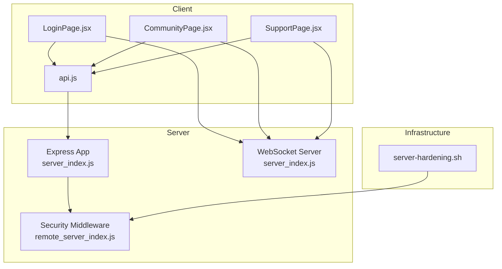
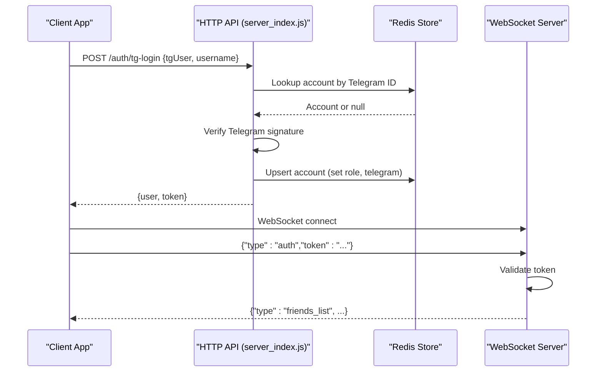
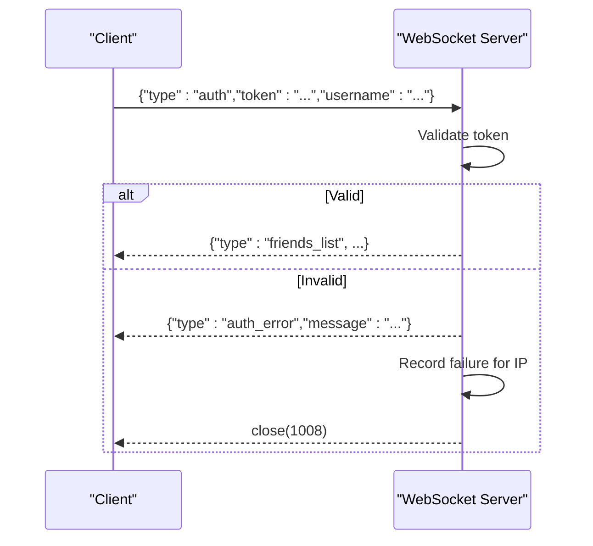
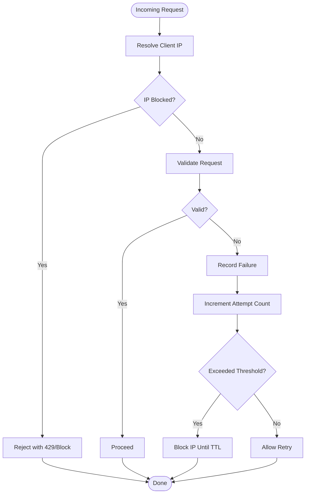
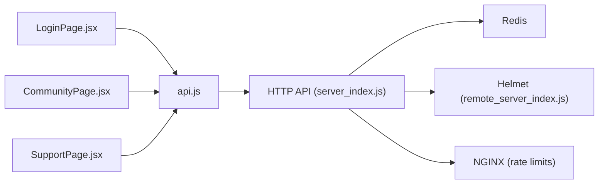

# API Endpoints & Security

<cite>
**Referenced Files in This Document**
- [server_index.js](file://server_index.js)
- [remote_server_index.js](file://scratch/remote_server_index.js)
- [server-hardening.sh](file://scripts/server-hardening.sh)
- [LoginPage.jsx](file://src/pages/LoginPage.jsx)
- [CommunityPage.jsx](file://src/pages/CommunityPage.jsx)
- [SupportPage.jsx](file://src/pages/SupportPage.jsx)
- [api.js](file://src/lib/api.js)
- [Cargo.lock](file://src-tauri/Cargo.lock)
</cite>

## Table of Contents
1. [Introduction](#introduction)
2. [Project Structure](#project-structure)
3. [Core Components](#core-components)
4. [Architecture Overview](#architecture-overview)
5. [Detailed Component Analysis](#detailed-component-analysis)
6. [Dependency Analysis](#dependency-analysis)
7. [Performance Considerations](#performance-considerations)
8. [Troubleshooting Guide](#troubleshooting-guide)
9. [Conclusion](#conclusion)
10. [Appendices](#appendices)

## Introduction
This document provides comprehensive API documentation for authentication endpoints and security measures implemented in the backend server. It covers HTTP endpoints for Telegram-based authentication, WebSocket authentication for real-time features, and the security controls in place including rate limiting, brute force protection, token validation, and SSL/TLS configuration. It also outlines client-side integration patterns and best practices for consuming the authentication APIs securely.

## Project Structure
The authentication surface spans the server implementation, client-side pages that integrate with the backend, and deployment/security scripts. The server exposes Telegram OAuth-style endpoints and WebSocket endpoints for real-time communication. Clients consume these endpoints via shared API utilities and page-specific flows.

**Diagram sources**
- [server_index.js](file://server_index.js)
- [remote_server_index.js](file://scratch/remote_server_index.js)
- [LoginPage.jsx](file://src/pages/LoginPage.jsx)
- [CommunityPage.jsx](file://src/pages/CommunityPage.jsx)
- [SupportPage.jsx](file://src/pages/SupportPage.jsx)
- [api.js](file://src/lib/api.js)
- [server-hardening.sh](file://scripts/server-hardening.sh)

**Section sources**
- [server_index.js](file://server_index.js)
- [remote_server_index.js](file://scratch/remote_server_index.js)
- [LoginPage.jsx](file://src/pages/LoginPage.jsx)
- [CommunityPage.jsx](file://src/pages/CommunityPage.jsx)
- [SupportPage.jsx](file://src/pages/SupportPage.jsx)
- [api.js](file://src/lib/api.js)
- [server-hardening.sh](file://scripts/server-hardening.sh)

## Core Components
- Authentication endpoints:
  - POST /auth/tg-login: Completes Telegram login and returns a JWT token for subsequent authenticated requests.
  - GET /auth/check-code: Polling endpoint for QR-based Telegram login flow.
  - POST /auth/create-code: Generates a short-lived code for QR-based login.
- WebSocket authentication:
  - Client sends a WebSocket message with type "auth" containing token and user identity metadata.
  - Server validates token and authorizes the connection; otherwise closes with an error.
- Security controls:
  - IP-based rate limiting and brute-force blocking.
  - Security headers and HSTS via Helmet.
  - SSL/TLS termination and WebSocket over HTTPS.
  - NGINX rate limiting zones for API and WebSocket traffic.

**Section sources**
- [server_index.js](file://server_index.js)
- [remote_server_index.js](file://scratch/remote_server_index.js)

## Architecture Overview
The authentication architecture combines Telegram OAuth-like flows with JWT tokens for HTTP and WebSocket sessions. The server enforces rate limits and blocks malicious IPs. NGINX sits in front to enforce request rates and connection limits. SSL/TLS is configured to terminate at the server and also supports WebSocket over HTTPS.

**Diagram sources**
- [server_index.js](file://server_index.js)

## Detailed Component Analysis

### HTTP Endpoints

#### POST /auth/tg-login
- Purpose: Complete Telegram login and issue a JWT token for authenticated sessions.
- Request body:
  - tgUser: Telegram user object (required).
  - username: Desired username for registration (optional for desktop flow).
- Response:
  - On success: { user, token }.
  - On missing fields: 400 Bad Request with { message }.
  - On invalid user: 401 Unauthorized with { message }.
  - On verification failure: 401 Unauthorized with { message }.
- Notes:
  - Validates Telegram signature before proceeding.
  - Creates or updates account with Telegram info and admin role detection.
  - Returns a signed JWT token suitable for bearer authentication.

**Section sources**
- [server_index.js](file://server_index.js)
- [remote_server_index.js](file://scratch/remote_server_index.js)

#### GET /auth/check-code
- Purpose: Poll for QR-based login confirmation.
- Query parameters:
  - code: Short code generated by /auth/create-code.
- Response:
  - { confirmed: boolean, tgUser: object|null }.
- Behavior:
  - Returns false if code not found or expired.
  - Returns true with associated tgUser when confirmed.

**Section sources**
- [server_index.js](file://server_index.js)
- [remote_server_index.js](file://scratch/remote_server_index.js)

#### POST /auth/create-code
- Purpose: Generate a short-lived random code for QR-based login.
- Request body: None.
- Response:
  - { code: string }.
- Notes:
  - Code TTL is enforced server-side; old entries are pruned.
  - Rate limiting applies to prevent abuse.

**Section sources**
- [server_index.js](file://server_index.js)
- [remote_server_index.js](file://scratch/remote_server_index.js)

#### GET /health
- Purpose: Health check endpoint returning runtime metrics.
- Response:
  - { ok: true, tickets, ws }.

**Section sources**
- [server_index.js](file://server_index.js)
- [remote_server_index.js](file://scratch/remote_server_index.js)

### WebSocket Authentication

#### Message Protocol
- Client sends:
  - type: "auth"
  - token: JWT issued by /auth/tg-login
  - Additional metadata (e.g., username) depending on page
- Server responds:
  - On success: Initial data such as friends list and pending friend requests.
  - On failure: {"type":"auth_error", message:"..."} followed by closure.

**Diagram sources**
- [server_index.js](file://server_index.js)

**Section sources**
- [server_index.js](file://server_index.js)
- [CommunityPage.jsx](file://src/pages/CommunityPage.jsx)
- [SupportPage.jsx](file://src/pages/SupportPage.jsx)

### Security Measures

#### Rate Limiting and Brute Force Protection
- IP tracking:
  - Tracks failed attempts per IP within a sliding window.
  - Blocks an IP after exceeding a threshold for a period.
- Limits:
  - BLOCK_AFTER: number of failures to trigger block.
  - BLOCK_TTL: duration of block.
  - ATTEMPT_WINDOW: sliding window for counting attempts.
- Enforcement:
  - Applies to authentication endpoints and WebSocket auth messages.
  - Uses Redis-backed storage with in-memory fallback.

**Diagram sources**
- [server_index.js](file://server_index.js)
- [remote_server_index.js](file://scratch/remote_server_index.js)

**Section sources**
- [server_index.js](file://server_index.js)
- [remote_server_index.js](file://scratch/remote_server_index.js)

#### Token Validation Middleware
- JWT validation:
  - Implemented via a dedicated function invoked during WebSocket auth.
  - On failure, records failure and closes the connection with an error.
- Token issuance:
  - Issued upon successful Telegram verification and account upsert.

**Section sources**
- [server_index.js](file://server_index.js)

#### CORS and Security Headers
- Helmet configuration:
  - Content-Security-Policy restricts resources.
  - Cross-Origin policies and HSTS enabled.
  - Referrer policy, X-Content-Type-Options, and DNS prefetch control applied.
- Proxy trust:
  - Trust proxy setting enabled for accurate client IP resolution behind NGINX.

**Section sources**
- [remote_server_index.js](file://scratch/remote_server_index.js)

#### SSL/TLS Configuration
- HTTPS server:
  - Certificate and key loaded from disk; HTTPS server listens on a configured port.
  - WebSocket server mirrors connections to HTTPS server for secure real-time transport.
- Deployment:
  - Firewall rules allow SSL and proxied ports.
  - NGINX hardening script configures rate limiting zones and connection limits.

**Section sources**
- [remote_server_index.js](file://scratch/remote_server_index.js)
- [server_hardening_script](file://scripts/server-hardening.sh)

### Client-Side Implementation Examples

#### Telegram Login Flow (Desktop/Web)
- Steps:
  - Call POST /auth/tg-login with tgUser and optional username.
  - On success, store token and user data.
  - Use token for bearer authentication on protected endpoints.
- Example references:
  - [LoginPage.jsx](file://src/pages/LoginPage.jsx)
  - [api.js](file://src/lib/api.js)

**Section sources**
- [LoginPage.jsx](file://src/pages/LoginPage.jsx)
- [api.js](file://src/lib/api.js)

#### QR-Based Login Flow
- Steps:
  - POST /auth/create-code to obtain a short code.
  - Poll GET /auth/check-code with the code until confirmed.
  - On confirmation, proceed with Telegram login and token acquisition.
- Example references:
  - [LoginPage.jsx](file://src/pages/LoginPage.jsx)

**Section sources**
- [LoginPage.jsx](file://src/pages/LoginPage.jsx)

#### WebSocket Authentication
- Steps:
  - Connect to WebSocket endpoint.
  - Send {"type":"auth","token":"...","username":"..."} immediately after opening.
  - Handle initial events and manage reconnection with exponential backoff.
- Example references:
  - [CommunityPage.jsx](file://src/pages/CommunityPage.jsx)
  - [SupportPage.jsx](file://src/pages/SupportPage.jsx)

**Section sources**
- [CommunityPage.jsx](file://src/pages/CommunityPage.jsx)
- [SupportPage.jsx](file://src/pages/SupportPage.jsx)

### Password Hashing and Cryptography
- Rust crate dependencies indicate PBKDF2 usage for password hashing in Tauri components.
- Relevant crates:
  - pbkdf2
  - password-hash
- Implication:
  - Strong, adaptive hashing suitable for password storage.

**Section sources**
- [Cargo.lock](file://src-tauri/Cargo.lock)

## Dependency Analysis
- Server depends on:
  - Express for HTTP routing and Helmet for security headers.
  - Redis for account storage and search.
  - NGINX for rate limiting and reverse proxying.
- Client depends on:
  - Shared API utilities for HTTP requests.
  - Page-specific hooks for WebSocket connections.

**Diagram sources**
- [server_index.js](file://server_index.js)
- [remote_server_index.js](file://scratch/remote_server_index.js)
- [api.js](file://src/lib/api.js)
- [LoginPage.jsx](file://src/pages/LoginPage.jsx)
- [CommunityPage.jsx](file://src/pages/CommunityPage.jsx)
- [SupportPage.jsx](file://src/pages/SupportPage.jsx)

**Section sources**
- [server_index.js](file://server_index.js)
- [remote_server_index.js](file://scratch/remote_server_index.js)
- [api.js](file://src/lib/api.js)
- [LoginPage.jsx](file://src/pages/LoginPage.jsx)
- [CommunityPage.jsx](file://src/pages/CommunityPage.jsx)
- [SupportPage.jsx](file://src/pages/SupportPage.jsx)

## Performance Considerations
- Use bearer tokens for lightweight authentication on HTTP endpoints.
- Leverage NGINX rate limiting zones to protect backend under load.
- Apply sliding window counters for brute force protection to minimize false positives.
- Keep WebSocket message sizes bounded and enforce per-client rate limits to prevent flooding.

## Troubleshooting Guide
- Common HTTP errors:
  - 400 Bad Request: Missing required fields in request body.
  - 401 Unauthorized: Invalid or missing Telegram signature/token.
  - 404 Not Found: Resource not found (e.g., ticket).
  - 429 Too Many Requests: Rate limit exceeded; wait and retry.
- WebSocket errors:
  - auth_error: Authorization required; ensure token is valid and sent promptly.
  - Too many connections: Exceeded per-IP connection limit.
  - Message too large: Payload exceeds maximum size; reduce message length.
- Diagnostics:
  - Use GET /health to confirm service availability and current WebSocket client counts.

**Section sources**
- [server_index.js](file://server_index.js)
- [remote_server_index.js](file://scratch/remote_server_index.js)

## Conclusion
The authentication system integrates Telegram OAuth with JWT tokens for HTTP and WebSocket sessions, backed by robust rate limiting, brute force protection, and strong security headers. SSL/TLS is configured for secure transport, and NGINX hardening further protects the API surface. Client integrations are straightforward: use the Telegram login endpoints to acquire tokens, then apply bearer authentication and WebSocket "auth" messages for real-time features.

## Appendices

### Endpoint Reference Summary
- POST /auth/tg-login
  - Body: { tgUser, username? }
  - Responses: 200 OK with { user, token }, 400/401/404 as applicable
- GET /auth/check-code
  - Query: { code }
  - Responses: { confirmed, tgUser? }
- POST /auth/create-code
  - Body: none
  - Responses: { code }
- GET /health
  - Responses: { ok, tickets, ws }

**Section sources**
- [server_index.js](file://server_index.js)
- [remote_server_index.js](file://scratch/remote_server_index.js)

### Client Best Practices
- Store tokens securely (e.g., in memory or secure storage).
- Refresh tokens via the Telegram login flow when needed.
- Implement exponential backoff for WebSocket reconnects.
- Validate server responses and handle auth_error gracefully.

**Section sources**
- [api.js](file://src/lib/api.js)
- [CommunityPage.jsx](file://src/pages/CommunityPage.jsx)
- [SupportPage.jsx](file://src/pages/SupportPage.jsx)