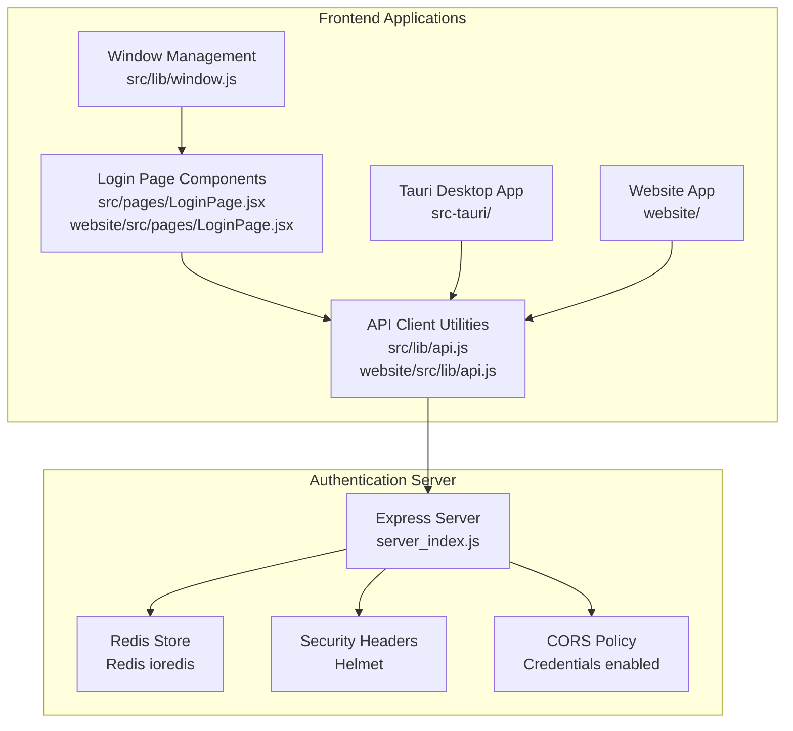
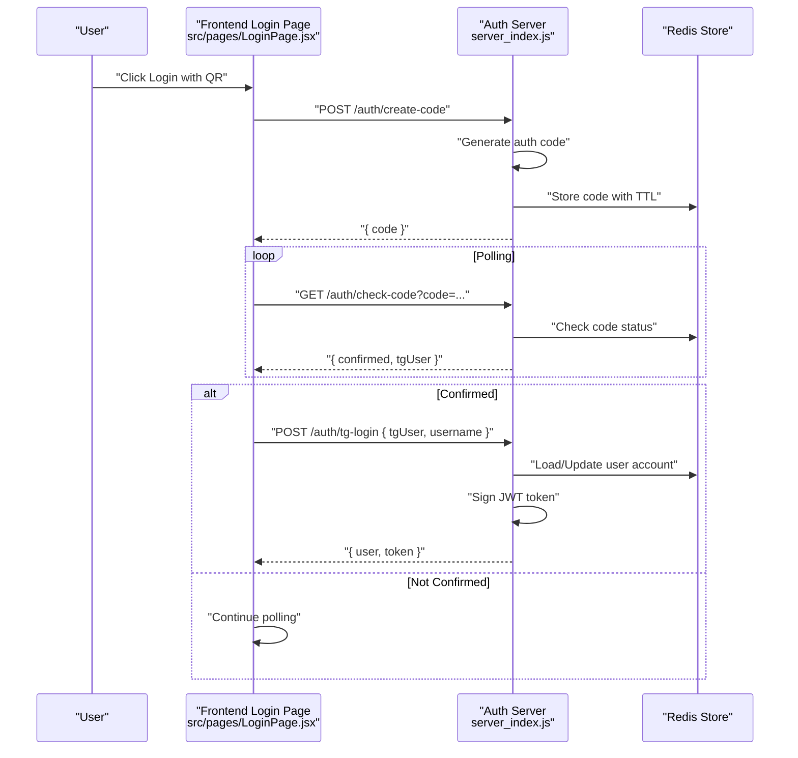
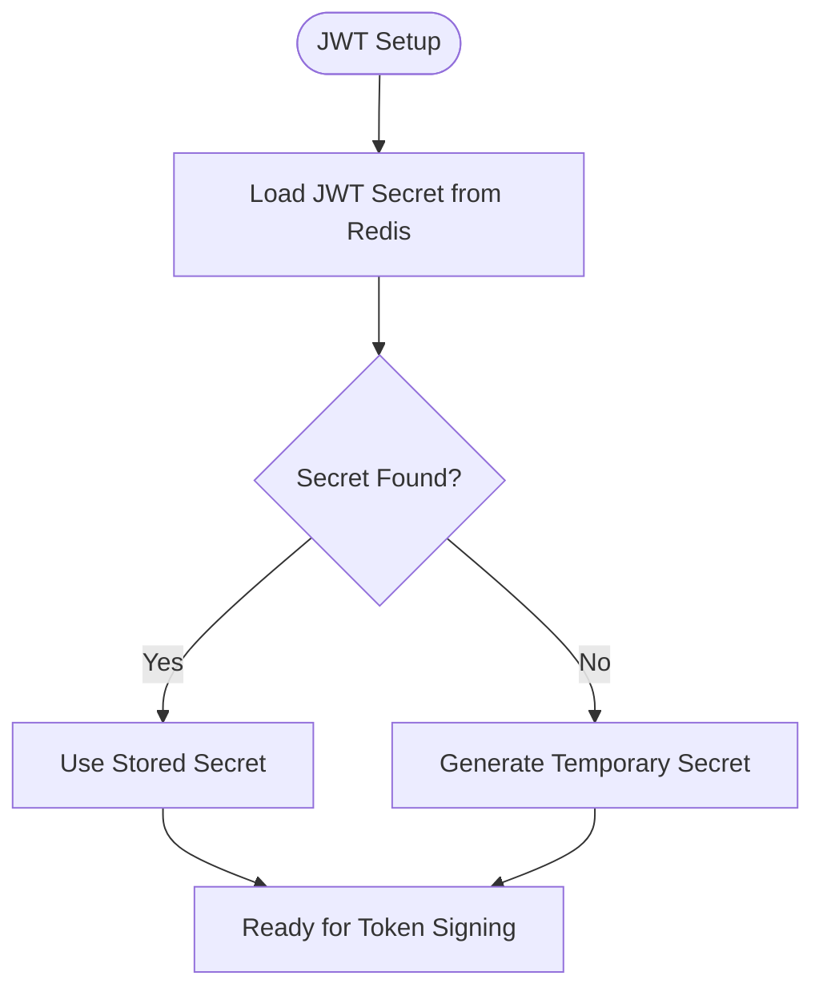
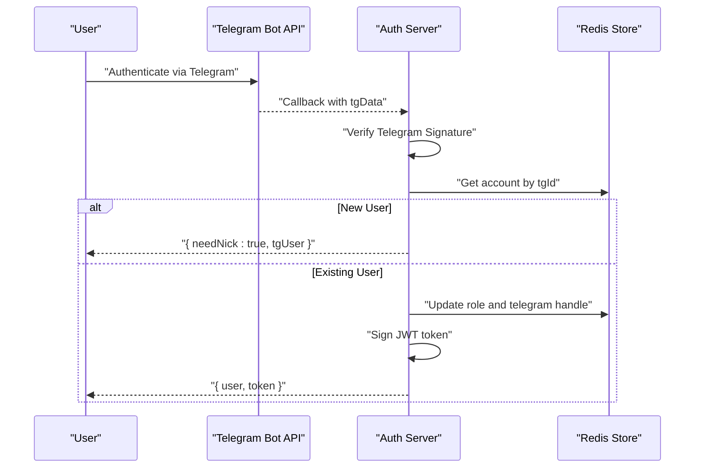
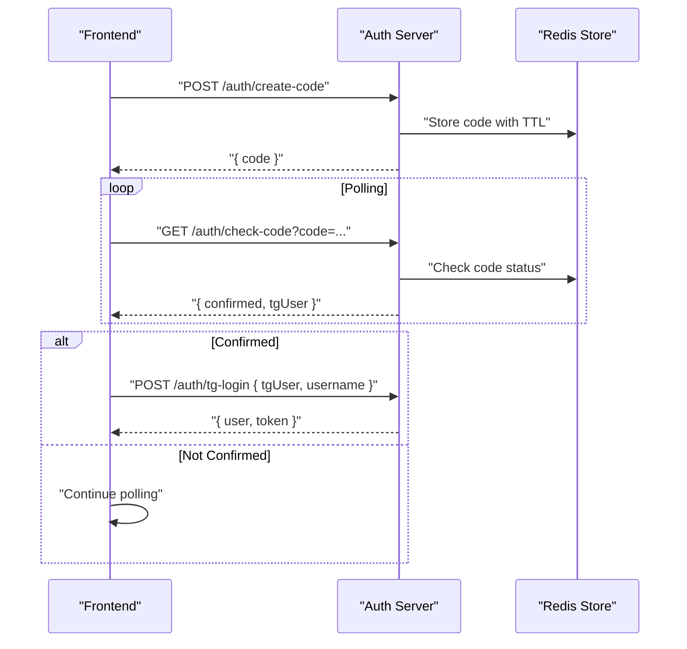
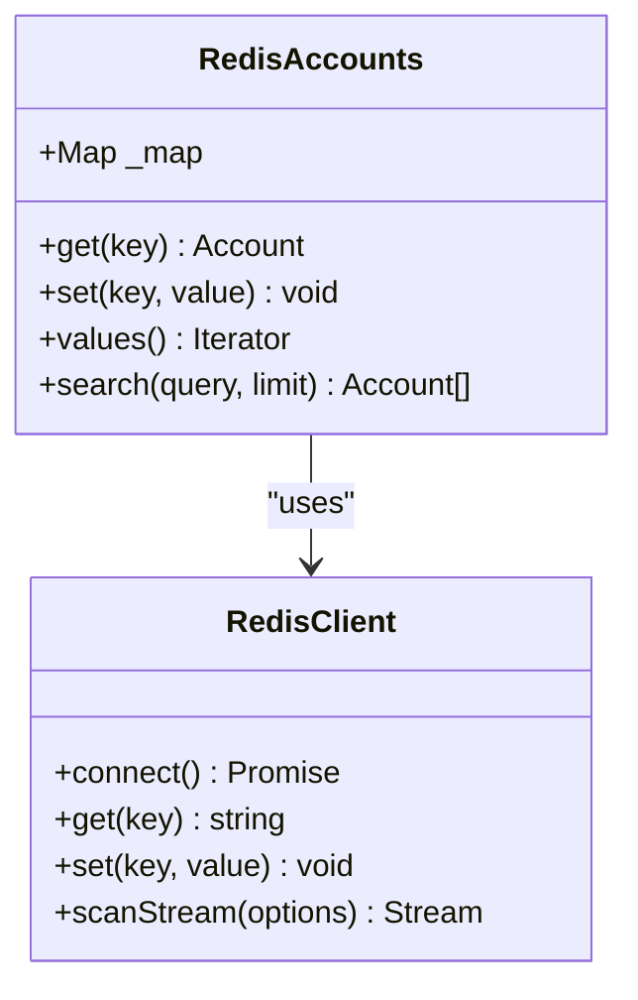
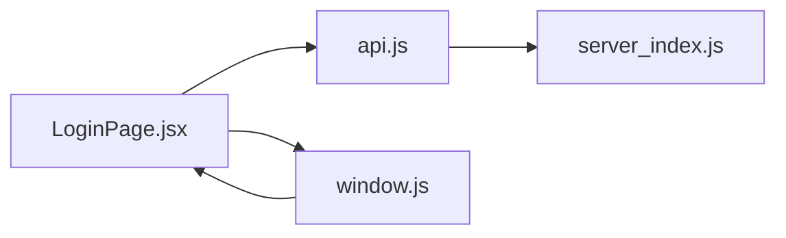
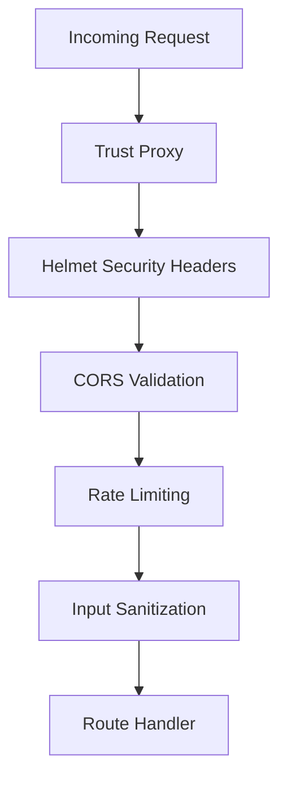
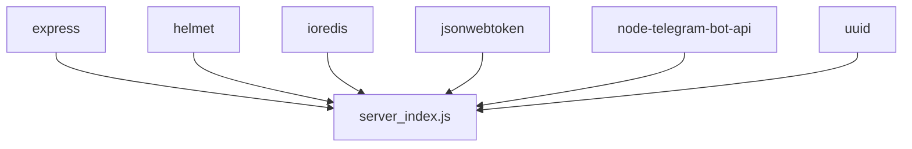

# Authentication System

<cite>
**Referenced Files in This Document**
- [server_index.js](file://server_index.js)
- [server/package.json](file://server/package.json)
- [src/pages/LoginPage.jsx](file://src/pages/LoginPage.jsx)
- [src/lib/api.js](file://src/lib/api.js)
- [src/lib/window.js](file://src/lib/window.js)
- [src-tauri/src/main.rs](file://src-tauri/src/main.rs)
- [src-tauri/tauri.conf.json](file://src-tauri/tauri.conf.json)
- [website/src/pages/LoginPage.jsx](file://website/src/pages/LoginPage.jsx)
- [website/src/lib/api.js](file://website/src/lib/api.js)
</cite>

## Table of Contents
1. [Introduction](#introduction)
2. [Project Structure](#project-structure)
3. [Core Components](#core-components)
4. [Architecture Overview](#architecture-overview)
5. [Detailed Component Analysis](#detailed-component-analysis)
6. [Dependency Analysis](#dependency-analysis)
7. [Performance Considerations](#performance-considerations)
8. [Troubleshooting Guide](#troubleshooting-guide)
9. [Conclusion](#conclusion)

## Introduction
This document provides comprehensive authentication system documentation for SBGames user management and security. It covers the JWT-based authentication flow (login, registration, token refresh, and logout), the integration between frontend React components and the Node.js authentication server, the Redis caching strategy for session management and token validation, API endpoint definitions with request/response schemas, security measures (password hashing, token expiration, and CSRF protection), window management integration for authentication flows, cross-origin considerations, and practical implementation examples for client-side and server-side handling.

## Project Structure
The authentication system spans three primary areas:
- Backend authentication server built with Express.js and secured with Helmet and CORS policies
- Frontend React applications (desktop Tauri app and website) implementing login flows and API communication
- Redis-backed persistence layer for user accounts and JWT secrets

**Diagram sources**
- [server_index.js:23-84](file://server_index.js#L23-L84)
- [server/package.json:1-19](file://server/package.json#L1-L19)
- [src/pages/LoginPage.jsx:82-119](file://src/pages/LoginPage.jsx#L82-L119)
- [website/src/pages/LoginPage.jsx](file://website/src/pages/LoginPage.jsx)
- [src/lib/api.js](file://src/lib/api.js)
- [src/lib/window.js](file://src/lib/window.js)
- [src-tauri/src/main.rs](file://src-tauri/src/main.rs)
- [src-tauri/tauri.conf.json](file://src-tauri/tauri.conf.json)

**Section sources**
- [server_index.js:23-84](file://server_index.js#L23-L84)
- [server/package.json:1-19](file://server/package.json#L1-L19)
- [src/pages/LoginPage.jsx:82-119](file://src/pages/LoginPage.jsx#L82-L119)
- [website/src/pages/LoginPage.jsx](file://website/src/pages/LoginPage.jsx)
- [src/lib/api.js](file://src/lib/api.js)
- [src/lib/window.js](file://src/lib/window.js)
- [src-tauri/src/main.rs](file://src-tauri/src/main.rs)
- [src-tauri/tauri.conf.json](file://src-tauri/tauri.conf.json)

## Core Components
- JWT-based authentication with token signing and verification
- Telegram OAuth integration for user identity verification and account linking
- QR-based authentication flow with polling for confirmation
- Redis-backed user storage and JWT secret persistence
- CORS-enabled server supporting desktop and web clients
- Frontend login components with polling and error handling

Key implementation references:
- JWT secret loading and persistence via Redis
- Redis-backed user account store with search capability
- Telegram OAuth verification and account creation/update
- QR code generation and polling for authentication confirmation
- Frontend login page polling mechanism and auto-login flow

**Section sources**
- [server_index.js:23-84](file://server_index.js#L23-L84)
- [server_index.js:252-267](file://server_index.js#L252-L267)
- [server_index.js:270-290](file://server_index.js#L270-L290)
- [server_index.js:355-368](file://server_index.js#L355-L368)
- [src/pages/LoginPage.jsx:82-119](file://src/pages/LoginPage.jsx#L82-L119)

## Architecture Overview
The authentication architecture integrates a Node.js server with Redis-backed persistence, a Telegram OAuth verification flow, and React-based frontends. The server enforces security headers and CORS policies, while the frontends handle user interactions and polling for QR-based authentication.

**Diagram sources**
- [server_index.js:355-368](file://server_index.js#L355-L368)
- [server_index.js:270-290](file://server_index.js#L270-L290)
- [src/pages/LoginPage.jsx:82-119](file://src/pages/LoginPage.jsx#L82-L119)

## Detailed Component Analysis

### JWT-Based Authentication Flow
The system uses JSON Web Tokens for session management. The server loads a persistent JWT secret from Redis (or generates a temporary one if Redis is unavailable) and signs tokens containing the user identifier. Middleware validates tokens and attaches user IDs to requests.

Implementation highlights:
- JWT secret persistence and fallback behavior
- Token verification middleware for protected routes
- Role-based access control for administrative endpoints

**Diagram sources**
- [server_index.js:31-42](file://server_index.js#L31-L42)

**Section sources**
- [server_index.js:31-42](file://server_index.js#L31-L42)
- [server_index.js:524-532](file://server_index.js#L524-L532)

### Telegram OAuth Integration
The Telegram OAuth flow verifies user identity via Telegram Bot API signatures and links verified identities to user accounts. New users requiring nicknames receive a prompt to complete registration.

Key steps:
- Telegram signature verification
- Account lookup by Telegram ID
- Role assignment based on admin lists
- Token issuance upon successful account retrieval

**Diagram sources**
- [server_index.js:252-267](file://server_index.js#L252-L267)
- [server_index.js:269-290](file://server_index.js#L269-L290)

**Section sources**
- [server_index.js:252-267](file://server_index.js#L252-L267)
- [server_index.js:269-290](file://server_index.js#L269-L290)

### QR-Based Authentication Flow
The QR-based flow enables desktop and web clients to authenticate without direct input. The frontend generates an auth code, polls for confirmation, and proceeds to login once confirmed.

**Diagram sources**
- [server_index.js:355-368](file://server_index.js#L355-L368)
- [src/pages/LoginPage.jsx:82-119](file://src/pages/LoginPage.jsx#L82-L119)

**Section sources**
- [server_index.js:355-368](file://server_index.js#L355-L368)
- [src/pages/LoginPage.jsx:82-119](file://src/pages/LoginPage.jsx#L82-L119)

### Redis Caching Strategy
The Redis caching strategy supports:
- Persistent JWT secret storage
- User account storage with JSON serialization
- Fallback to in-memory Map when Redis is unavailable
- Account search across Redis and memory with scan streaming

**Diagram sources**
- [server_index.js:45-78](file://server_index.js#L45-L78)

**Section sources**
- [server_index.js:45-78](file://server_index.js#L45-L78)

### Frontend Integration and Window Management
The desktop Tauri application integrates authentication flows with window management utilities. Website and desktop share similar login components but differ in window and capability configurations.

Key aspects:
- Login page polling for QR confirmation
- API client utilities for authenticated requests
- Window management for authentication UI

**Diagram sources**
- [src/pages/LoginPage.jsx:82-119](file://src/pages/LoginPage.jsx#L82-L119)
- [src/lib/api.js](file://src/lib/api.js)
- [src/lib/window.js](file://src/lib/window.js)

**Section sources**
- [src/pages/LoginPage.jsx:82-119](file://src/pages/LoginPage.jsx#L82-L119)
- [src/lib/api.js](file://src/lib/api.js)
- [src/lib/window.js](file://src/lib/window.js)

### Cross-Origin and Security Considerations
The server enforces strict security headers and CORS policies:
- Helmet middleware configured for secure defaults
- CORS allows trusted origins and credentials
- Trust proxy setting for reverse proxy environments
- Rate limiting and sanitization for input validation

**Diagram sources**
- [server_index.js:80-84](file://server_index.js#L80-L84)
- [server_index.js:85-108](file://server_index.js#L85-L108)
- [server/package.json:6-18](file://server/package.json#L6-L18)

**Section sources**
- [server_index.js:80-84](file://server_index.js#L80-L84)
- [server_index.js:85-108](file://server_index.js#L85-L108)
- [server/package.json:6-18](file://server/package.json#L6-L18)

## Dependency Analysis
The authentication system relies on several key dependencies:
- Express.js for HTTP routing and middleware
- Helmet for security headers
- ioredis for Redis connectivity
- jsonwebtoken for JWT signing and verification
- node-telegram-bot-api for Telegram OAuth verification
- uuid for generating identifiers

**Diagram sources**
- [server/package.json:6-18](file://server/package.json#L6-L18)

**Section sources**
- [server/package.json:6-18](file://server/package.json#L6-L18)

## Performance Considerations
- Redis fallback ensures availability when external Redis is down
- Scan streaming for account search prevents blocking operations
- Rate limiting protects against abuse during QR polling
- Token verification is lightweight and cached in memory

## Troubleshooting Guide
Common authentication issues and resolutions:
- Redis unavailability: The system falls back to in-memory storage for accounts and uses a temporary JWT secret
- CORS errors: Verify allowed origins and credentials flag in CORS configuration
- Telegram signature failures: Confirm bot API configuration and signature verification logic
- QR polling timeouts: Ensure polling interval and code TTL are appropriate
- Token validation failures: Check JWT secret persistence and expiration settings

Debugging tips:
- Monitor Redis connectivity and fallback behavior
- Inspect CORS logs for blocked requests
- Validate Telegram callback signatures
- Track polling intervals and error responses
- Review token signing and verification logs

**Section sources**
- [server_index.js:28-42](file://server_index.js#L28-L42)
- [server_index.js:85-108](file://server_index.js#L85-L108)
- [server_index.js:355-368](file://server_index.js#L355-L368)

## Conclusion
The SBGames authentication system provides a robust, secure, and scalable solution for user management and security. It leverages JWT-based sessions, Redis-backed persistence, and Telegram OAuth integration, while ensuring cross-origin safety and responsive frontend experiences. The modular design supports both desktop and web clients, with clear separation of concerns between frontend components, backend APIs, and Redis storage.