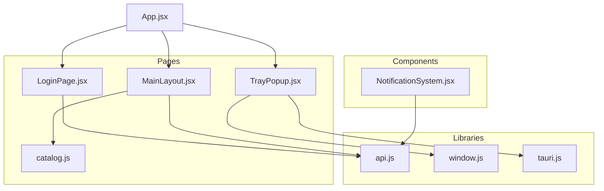
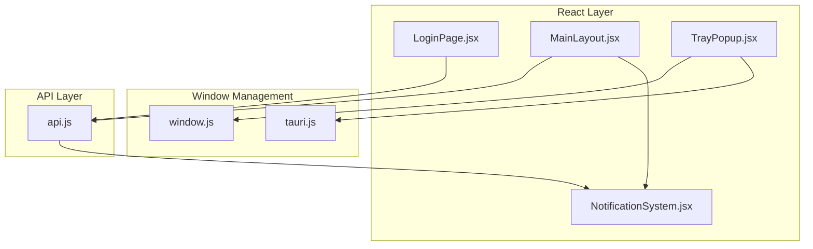
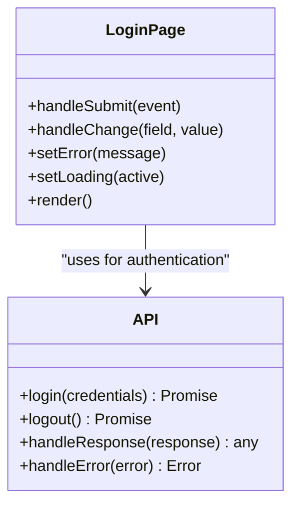
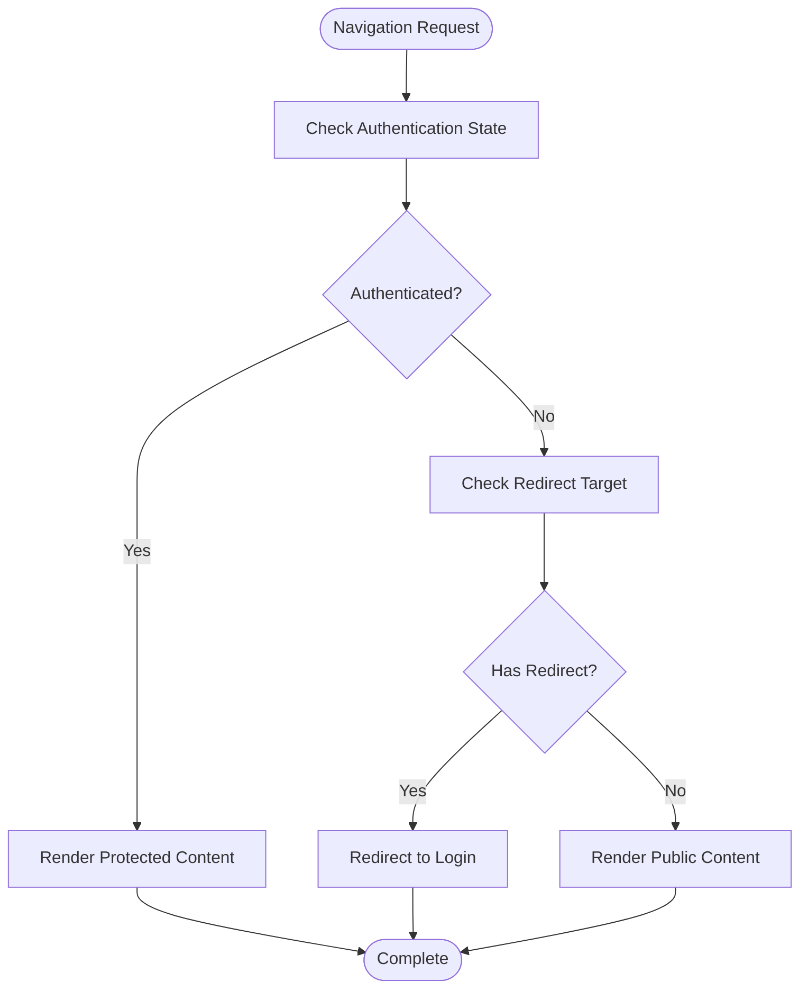
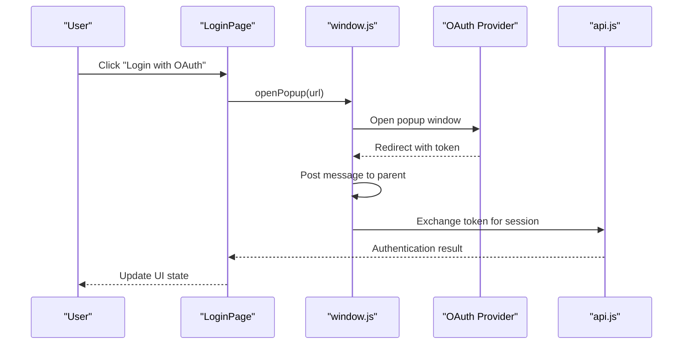
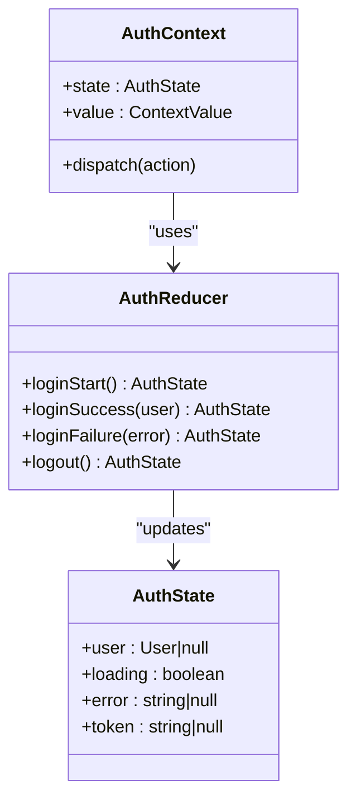
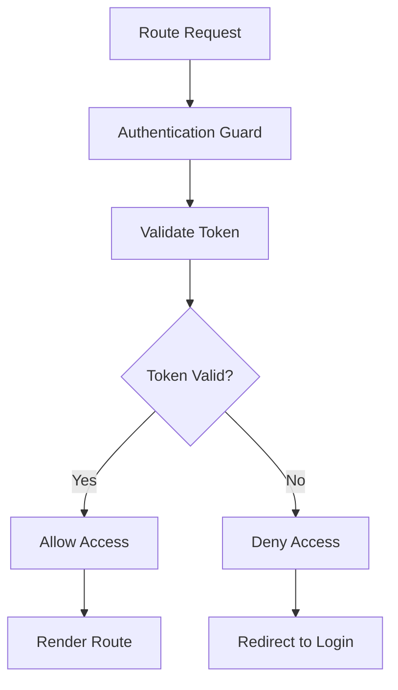
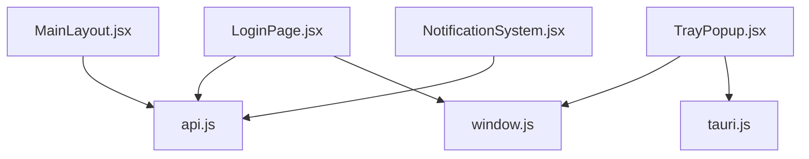

# Client-Side Integration Patterns

<cite>
**Referenced Files in This Document**
- [App.jsx](file://src/App.jsx)
- [main.jsx](file://src/main.jsx)
- [LoginPage.jsx](file://src/pages/LoginPage.jsx)
- [MainLayout.jsx](file://src/pages/MainLayout.jsx)
- [TrayPopup.jsx](file://src/pages/TrayPopup.jsx)
- [api.js](file://src/lib/api.js)
- [window.js](file://src/lib/window.js)
- [tauri.js](file://src/lib/tauri.js)
- [catalog.js](file://src/pages/catalog.js)
- [NotificationSystem.jsx](file://src/components/NotificationSystem.jsx)
</cite>

## Table of Contents
1. [Introduction](#introduction)
2. [Project Structure](#project-structure)
3. [Core Components](#core-components)
4. [Architecture Overview](#architecture-overview)
5. [Detailed Component Analysis](#detailed-component-analysis)
6. [Dependency Analysis](#dependency-analysis)
7. [Performance Considerations](#performance-considerations)
8. [Troubleshooting Guide](#troubleshooting-guide)
9. [Conclusion](#conclusion)

## Introduction
This document provides comprehensive guidance for client-side authentication integration patterns and window management within the application. It covers React component patterns for authentication forms, loading states, and error handling; integration between main application and authentication flows including route protection and conditional rendering; window management for OAuth flows, popup handling, and cross-origin communication; state management patterns for authentication state including context providers and reducer implementations; examples of protected routes, authentication guards, and redirect handling; integration with external authentication providers and social login mechanisms; browser compatibility, fallback mechanisms, and progressive enhancement strategies; and testing strategies for authentication flows and integration testing approaches.

## Project Structure
The authentication and window management functionality is primarily located in the `src` directory, organized by pages, components, and libraries:
- Pages: Authentication entry points and layout components
- Components: Reusable UI elements including notifications
- Lib: Utility modules for API communication, Tauri integration, and window management

**Diagram sources**
- [App.jsx](file://src/App.jsx)
- [LoginPage.jsx](file://src/pages/LoginPage.jsx)
- [MainLayout.jsx](file://src/pages/MainLayout.jsx)
- [TrayPopup.jsx](file://src/pages/TrayPopup.jsx)
- [catalog.js](file://src/pages/catalog.js)
- [NotificationSystem.jsx](file://src/components/NotificationSystem.jsx)
- [api.js](file://src/lib/api.js)
- [window.js](file://src/lib/window.js)
- [tauri.js](file://src/lib/tauri.js)

**Section sources**
- [App.jsx](file://src/App.jsx)
- [main.jsx](file://src/main.jsx)

## Core Components
This section outlines the primary components involved in authentication and window management:
- Authentication entry points: Login page and main layout
- Window management utilities: Popup handling and cross-origin communication
- API integration: HTTP requests and session management
- Notification system: User feedback for authentication events

Key responsibilities:
- LoginPage: Renders authentication form, handles user input, manages loading/error states, and triggers authentication actions
- MainLayout: Provides navigation, route protection, and conditional rendering based on authentication state
- TrayPopup: Manages tray window interactions, popup windows, and cross-origin communication
- API library: Encapsulates HTTP requests, response handling, and error propagation
- Window library: Handles popup creation, focus management, and cross-origin messaging
- Tauri library: Integrates native window controls and system-level features
- NotificationSystem: Displays user-friendly messages for authentication outcomes

**Section sources**
- [LoginPage.jsx](file://src/pages/LoginPage.jsx)
- [MainLayout.jsx](file://src/pages/MainLayout.jsx)
- [TrayPopup.jsx](file://src/pages/TrayPopup.jsx)
- [api.js](file://src/lib/api.js)
- [window.js](file://src/lib/window.js)
- [tauri.js](file://src/lib/tauri.js)
- [NotificationSystem.jsx](file://src/components/NotificationSystem.jsx)

## Architecture Overview
The authentication architecture integrates React components with window management utilities and API services. The system supports:
- Route protection via conditional rendering in the main layout
- OAuth flows through popup windows and cross-origin communication
- Session management through API interactions
- Progressive enhancement with fallback mechanisms for older browsers

**Diagram sources**
- [LoginPage.jsx](file://src/pages/LoginPage.jsx)
- [MainLayout.jsx](file://src/pages/MainLayout.jsx)
- [TrayPopup.jsx](file://src/pages/TrayPopup.jsx)
- [NotificationSystem.jsx](file://src/components/NotificationSystem.jsx)
- [api.js](file://src/lib/api.js)
- [window.js](file://src/lib/window.js)
- [tauri.js](file://src/lib/tauri.js)

## Detailed Component Analysis

### Authentication Form Component Pattern
The authentication form component follows a structured pattern for managing user input, validation, loading states, and error handling:
- Controlled form inputs with state synchronization
- Loading indicators during authentication requests
- Error state management with user-friendly messaging
- Form submission handling with validation

**Diagram sources**
- [LoginPage.jsx](file://src/pages/LoginPage.jsx)
- [api.js](file://src/lib/api.js)

**Section sources**
- [LoginPage.jsx](file://src/pages/LoginPage.jsx)

### Route Protection and Conditional Rendering
Route protection is implemented through conditional rendering in the main layout component:
- Authentication state checks before rendering protected content
- Redirect handling for unauthenticated users
- Navigation guards for sensitive routes

**Diagram sources**
- [MainLayout.jsx](file://src/pages/MainLayout.jsx)

**Section sources**
- [MainLayout.jsx](file://src/pages/MainLayout.jsx)

### Window Management for OAuth Flows
OAuth flows require robust popup handling and cross-origin communication:
- Popup creation with appropriate sizing and positioning
- Focus management and window lifecycle handling
- Cross-origin message passing for OAuth callbacks
- Fallback mechanisms for unsupported browsers

**Diagram sources**
- [LoginPage.jsx](file://src/pages/LoginPage.jsx)
- [window.js](file://src/lib/window.js)
- [api.js](file://src/lib/api.js)

**Section sources**
- [window.js](file://src/lib/window.js)
- [LoginPage.jsx](file://src/pages/LoginPage.jsx)

### State Management Patterns
Authentication state management utilizes React patterns for context and reducers:
- Context provider for global authentication state
- Reducer implementation for state transitions
- Local storage persistence for session continuity
- Error boundary handling for authentication failures

**Diagram sources**
- [MainLayout.jsx](file://src/pages/MainLayout.jsx)

**Section sources**
- [MainLayout.jsx](file://src/pages/MainLayout.jsx)

### Protected Route Implementation
Protected routes ensure unauthorized access is prevented:
- Route guards that check authentication before rendering
- Dynamic redirect handling based on intended destination
- Conditional rendering of navigation elements

**Diagram sources**
- [MainLayout.jsx](file://src/pages/MainLayout.jsx)

**Section sources**
- [MainLayout.jsx](file://src/pages/MainLayout.jsx)

### Integration with External Authentication Providers
External provider integration requires standardized patterns:
- OAuth 2.0 flow implementation
- Social login button rendering
- Token exchange and session establishment
- Provider-specific configuration management

**Section sources**
- [LoginPage.jsx](file://src/pages/LoginPage.jsx)
- [api.js](file://src/lib/api.js)

### Browser Compatibility and Fallback Mechanisms
The system implements progressive enhancement strategies:
- Feature detection for modern APIs
- Polyfill fallbacks for unsupported features
- Graceful degradation for essential functionality
- Cross-browser testing and validation

**Section sources**
- [window.js](file://src/lib/window.js)
- [tauri.js](file://src/lib/tauri.js)

### Testing Strategies for Authentication Flows
Comprehensive testing ensures reliability of authentication systems:
- Unit tests for authentication logic and state management
- Integration tests for API interactions and window management
- E2E tests for complete authentication workflows
- Mock strategies for external provider dependencies

**Section sources**
- [LoginPage.jsx](file://src/pages/LoginPage.jsx)
- [api.js](file://src/lib/api.js)
- [window.js](file://src/lib/window.js)

## Dependency Analysis
Authentication and window management components depend on several key libraries and modules:
- React ecosystem for component rendering and state management
- API library for HTTP communication and session handling
- Window management utilities for popup and cross-origin operations
- Tauri integration for native window controls

**Diagram sources**
- [LoginPage.jsx](file://src/pages/LoginPage.jsx)
- [MainLayout.jsx](file://src/pages/MainLayout.jsx)
- [TrayPopup.jsx](file://src/pages/TrayPopup.jsx)
- [api.js](file://src/lib/api.js)
- [window.js](file://src/lib/window.js)
- [tauri.js](file://src/lib/tauri.js)
- [NotificationSystem.jsx](file://src/components/NotificationSystem.jsx)

**Section sources**
- [catalog.js](file://src/pages/catalog.js)

## Performance Considerations
Authentication performance optimization strategies:
- Lazy loading of authentication components
- Efficient state updates to minimize re-renders
- Debounced input validation for form fields
- Caching of frequently accessed user data
- Optimized network requests with proper caching headers

## Troubleshooting Guide
Common authentication issues and resolutions:
- Authentication state inconsistencies: Verify context provider wrapping and reducer dispatch patterns
- Popup blocking issues: Implement user gesture requirements and fallback redirect strategies
- Token expiration handling: Implement automatic refresh mechanisms and graceful logout
- Cross-origin communication failures: Validate message channel setup and origin restrictions
- API connectivity problems: Implement retry logic and offline state management

**Section sources**
- [api.js](file://src/lib/api.js)
- [window.js](file://src/lib/window.js)
- [tauri.js](file://src/lib/tauri.js)

## Conclusion
The client-side authentication integration in this application demonstrates robust patterns for React component development, window management, and state coordination. The modular architecture supports extensibility for additional authentication providers while maintaining consistent user experience across different browsers and environments. The implementation emphasizes progressive enhancement, comprehensive error handling, and thorough testing strategies to ensure reliable authentication flows.