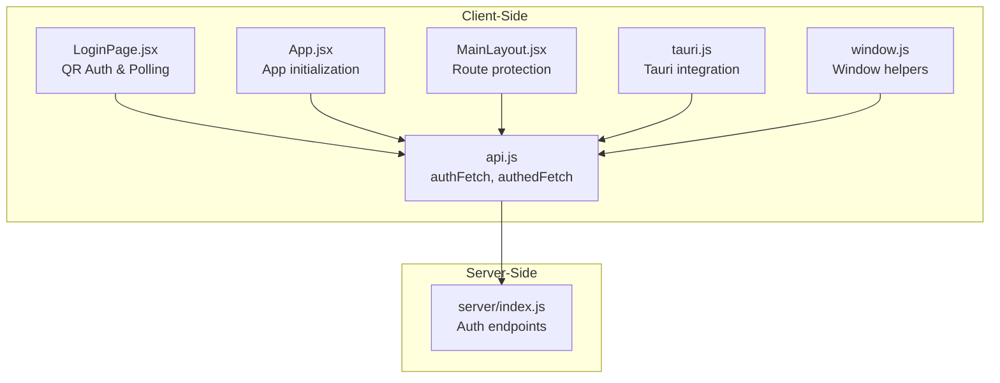
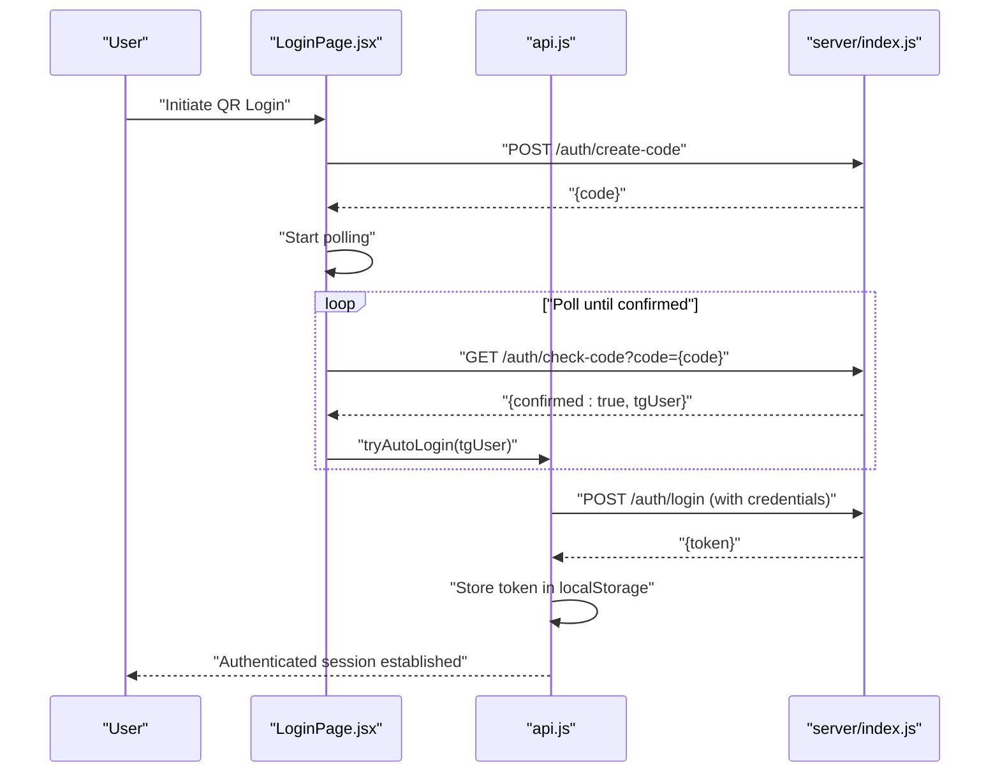
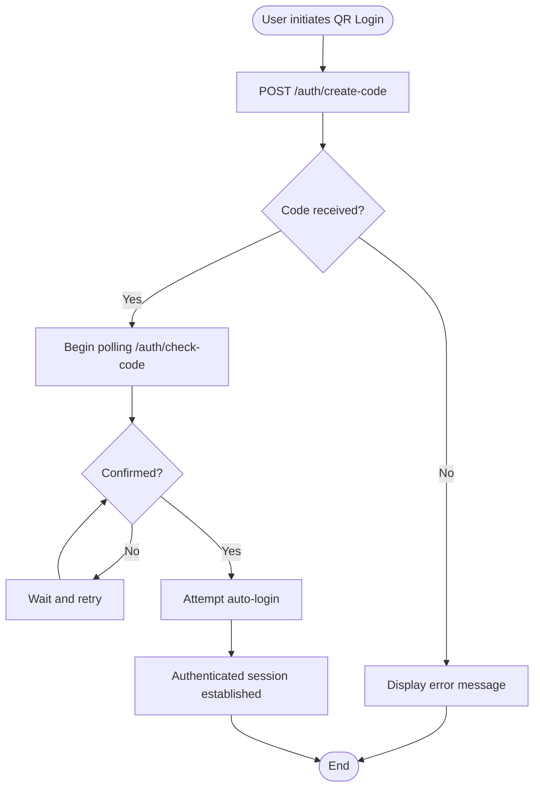
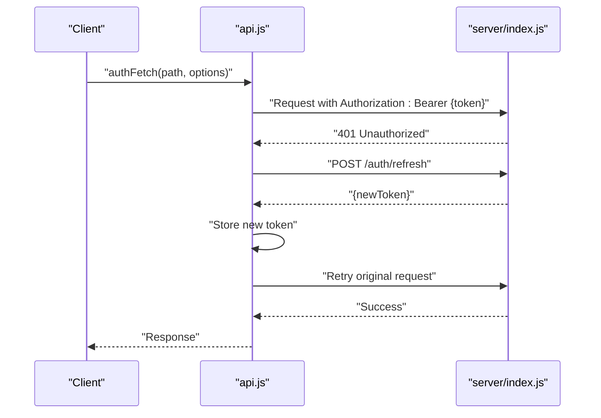
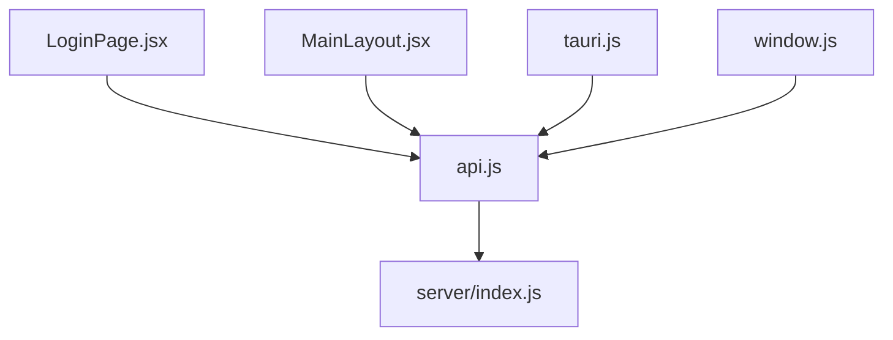

# JWT Authentication Flow

<cite>
**Referenced Files in This Document**
- [api.js](file://src/lib/api.js)
- [LoginPage.jsx](file://src/pages/LoginPage.jsx)
- [App.jsx](file://src/App.jsx)
- [MainLayout.jsx](file://src/pages/MainLayout.jsx)
- [tauri.js](file://src/lib/tauri.js)
- [window.js](file://src/lib/window.js)
- [index.js](file://server/index.js)
</cite>

## Table of Contents
1. [Introduction](#introduction)
2. [Project Structure](#project-structure)
3. [Core Components](#core-components)
4. [Architecture Overview](#architecture-overview)
5. [Detailed Component Analysis](#detailed-component-analysis)
6. [Dependency Analysis](#dependency-analysis)
7. [Performance Considerations](#performance-considerations)
8. [Troubleshooting Guide](#troubleshooting-guide)
9. [Conclusion](#conclusion)

## Introduction
This document details the JWT authentication flow implementation in SBGames, covering the complete authentication lifecycle including login, registration, token refresh, and logout processes. It explains JWT token structure, header claims, and payload data, documents token storage mechanisms using localStorage, and describes the authFetch and authedFetch utility functions for authenticated API requests. Security considerations such as token expiration, secure storage, and cross-site scripting prevention are addressed, along with implementation patterns for protecting routes and handling authentication state throughout the application.

## Project Structure
The authentication system spans client-side React components and utilities, alongside server-side endpoints. Key areas include:
- Client-side authentication utilities and API wrappers
- Login page implementing QR-based authentication polling
- Application layout and route protection
- Tauri and window-specific integrations
- Server-side authentication endpoints

**Diagram sources**
- [api.js](file://src/lib/api.js)
- [LoginPage.jsx](file://src/pages/LoginPage.jsx)
- [App.jsx](file://src/App.jsx)
- [MainLayout.jsx](file://src/pages/MainLayout.jsx)
- [tauri.js](file://src/lib/tauri.js)
- [window.js](file://src/lib/window.js)
- [index.js](file://server/index.js)

**Section sources**
- [api.js](file://src/lib/api.js)
- [LoginPage.jsx](file://src/pages/LoginPage.jsx)
- [App.jsx](file://src/App.jsx)
- [MainLayout.jsx](file://src/pages/MainLayout.jsx)
- [tauri.js](file://src/lib/tauri.js)
- [window.js](file://src/lib/window.js)
- [index.js](file://server/index.js)

## Core Components
This section outlines the primary components involved in JWT authentication and their roles:
- Token Storage and Retrieval: localStorage is used to persist JWT tokens client-side.
- Authentication Utilities: authFetch injects Authorization headers with bearer tokens; authedFetch wraps requests requiring authentication.
- Login Flow: QR-based authentication with polling for confirmation and auto-login attempts.
- Route Protection: MainLayout enforces authentication checks for protected routes.
- Tauri Integration: Optional native environment support for authentication flows.

Key implementation patterns:
- Token injection via Authorization header for all authenticated requests.
- Automatic token refresh logic integrated within authFetch.
- Error handling for expired or invalid tokens.
- Secure storage considerations and XSS prevention strategies.

**Section sources**
- [api.js](file://src/lib/api.js)
- [LoginPage.jsx](file://src/pages/LoginPage.jsx)
- [MainLayout.jsx](file://src/pages/MainLayout.jsx)
- [tauri.js](file://src/lib/tauri.js)
- [window.js](file://src/lib/window.js)

## Architecture Overview
The authentication architecture integrates client-side utilities with server-side endpoints. The client uses authFetch to manage token injection and refresh, while the server exposes authentication endpoints for QR code creation and confirmation.

**Diagram sources**
- [LoginPage.jsx](file://src/pages/LoginPage.jsx)
- [api.js](file://src/lib/api.js)
- [index.js](file://server/index.js)

**Section sources**
- [LoginPage.jsx](file://src/pages/LoginPage.jsx)
- [api.js](file://src/lib/api.js)
- [index.js](file://server/index.js)

## Detailed Component Analysis

### JWT Token Structure and Claims
JWT tokens consist of three parts separated by dots:
- Header: Contains metadata such as algorithm and token type.
- Payload: Contains claims (e.g., subject identifier, issued at, expiration, scopes).
- Signature: Ensures token integrity.

Common claims used in SBGames:
- iss: Issuer of the token.
- sub: Subject (user identifier).
- aud: Audience.
- exp: Expiration time (UNIX timestamp).
- iat: Issued at time (UNIX timestamp).
- jti: Unique token identifier.

Token storage and retrieval:
- Tokens are stored in localStorage under a dedicated key.
- Retrieval functions return the stored token string for Authorization header injection.

Security considerations:
- Tokens should be stored securely and not exposed to XSS attacks.
- Prefer HttpOnly cookies for sensitive environments; localStorage is acceptable with proper CSP and sanitization.
- Implement token refresh logic to minimize long-lived tokens.

**Section sources**
- [api.js](file://src/lib/api.js)

### Token Storage Mechanism and Retrieval Functions
Token persistence and retrieval are handled client-side:
- Storage: Token is saved to localStorage after successful authentication.
- Retrieval: Utility functions fetch the token from localStorage for inclusion in Authorization headers.
- Cleanup: Logout clears the stored token and resets authentication state.

Implementation pattern:
- Store token upon successful login response.
- Retrieve token before each authenticated request.
- Clear token on logout to prevent unauthorized access.

**Section sources**
- [api.js](file://src/lib/api.js)

### authFetch and authedFetch Utility Functions
These utilities encapsulate authenticated request logic:
- authFetch: Injects Authorization header with bearer token, handles automatic token refresh, and manages errors.
- authedFetch: Wrapper for authenticated endpoints, ensuring requests fail gracefully when unauthenticated.

Token injection into headers:
- Authorization: Bearer {token} is appended to request headers for protected endpoints.

Automatic token refresh logic:
- On 401 Unauthorized responses, authFetch triggers token refresh via server endpoint.
- After refresh, the original request is retried with the new token.

Error handling:
- Expired or invalid tokens result in logout and redirect to login.
- Network errors and server-side failures are surfaced to calling components.

**Section sources**
- [api.js](file://src/lib/api.js)

### Login Flow Implementation
The login flow uses QR-based authentication:
- QR Code Creation: Client requests a new authentication code from the server.
- Polling: Client polls the server at intervals to check if the code was confirmed.
- Auto Login: Upon confirmation, the client attempts to auto-login using stored credentials.
- Error Handling: Rate limiting and connection errors are handled with user feedback.

**Diagram sources**
- [LoginPage.jsx](file://src/pages/LoginPage.jsx)
- [index.js](file://server/index.js)

**Section sources**
- [LoginPage.jsx](file://src/pages/LoginPage.jsx)
- [index.js](file://server/index.js)

### Registration and Account Management
Registration and account management are handled through server endpoints:
- Registration: Client submits user credentials to the server for account creation.
- Account Confirmation: Email/SMS verification steps (if enabled) finalize registration.
- Profile Updates: Users can update profile information via authenticated endpoints.

Integration pattern:
- Use authedFetch for profile updates to ensure Authorization header presence.
- Handle server responses and propagate errors to UI components.

**Section sources**
- [api.js](file://src/lib/api.js)
- [index.js](file://server/index.js)

### Token Refresh and Logout Processes
Token refresh and logout are critical for maintaining secure sessions:
- Token Refresh: On 401 responses, authFetch attempts to refresh the token using a refresh endpoint.
- Logout: Clears stored token, resets authentication state, and redirects to login.

**Diagram sources**
- [api.js](file://src/lib/api.js)
- [index.js](file://server/index.js)

**Section sources**
- [api.js](file://src/lib/api.js)
- [index.js](file://server/index.js)

### Route Protection and Authentication State
Protected routes are enforced in the application layout:
- Authentication Check: MainLayout verifies user authentication before rendering protected pages.
- Redirect Logic: Unauthenticated users are redirected to the login page.
- State Management: Authentication state is maintained across components using shared utilities.

Implementation pattern:
- Wrap route components with authentication guards.
- Use authedFetch for all protected API calls.
- Update UI state based on authentication status.

**Section sources**
- [MainLayout.jsx](file://src/pages/MainLayout.jsx)
- [api.js](file://src/lib/api.js)

### Tauri and Window Integrations
Optional integrations enhance authentication in native environments:
- Tauri Integration: Provides native capabilities for authentication flows and secure storage.
- Window Helpers: Utility functions for window-specific behaviors during authentication.

**Section sources**
- [tauri.js](file://src/lib/tauri.js)
- [window.js](file://src/lib/window.js)

## Dependency Analysis
The authentication system exhibits clear separation of concerns:
- Client-side utilities depend on server endpoints for authentication operations.
- UI components rely on authFetch and authedFetch for network requests.
- Route protection depends on authentication state managed by utilities.

**Diagram sources**
- [api.js](file://src/lib/api.js)
- [LoginPage.jsx](file://src/pages/LoginPage.jsx)
- [MainLayout.jsx](file://src/pages/MainLayout.jsx)
- [tauri.js](file://src/lib/tauri.js)
- [window.js](file://src/lib/window.js)
- [index.js](file://server/index.js)

**Section sources**
- [api.js](file://src/lib/api.js)
- [LoginPage.jsx](file://src/pages/LoginPage.jsx)
- [MainLayout.jsx](file://src/pages/MainLayout.jsx)
- [tauri.js](file://src/lib/tauri.js)
- [window.js](file://src/lib/window.js)
- [index.js](file://server/index.js)

## Performance Considerations
- Minimize unnecessary polling: Adjust polling intervals to balance responsiveness and server load.
- Efficient token refresh: Cache refreshed tokens and avoid redundant refresh attempts.
- Lazy loading: Defer authentication-dependent components until user state is resolved.
- CDN and caching: Serve static assets via CDN to reduce latency for authentication pages.

## Troubleshooting Guide
Common issues and resolutions:
- Expired or Invalid Tokens: Trigger logout and prompt re-authentication. Verify token expiration and refresh logic.
- Network Errors: Implement retry logic with exponential backoff for transient failures.
- Rate Limiting: Handle 429 responses gracefully during QR code polling and provide user feedback.
- Storage Issues: Ensure localStorage availability and handle quota exceeded scenarios.
- Cross-Origin Problems: Configure CORS properly on the server to allow client requests.

**Section sources**
- [api.js](file://src/lib/api.js)
- [LoginPage.jsx](file://src/pages/LoginPage.jsx)
- [index.js](file://server/index.js)

## Conclusion
SBGames implements a robust JWT authentication flow with QR-based login, secure token storage, and comprehensive error handling. The authFetch and authedFetch utilities centralize authenticated request logic, while route protection ensures only authorized users access protected content. By following the outlined patterns and security considerations, developers can maintain a secure and reliable authentication system across the application.