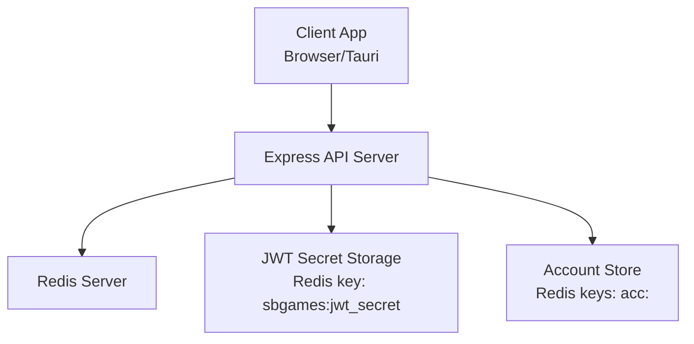
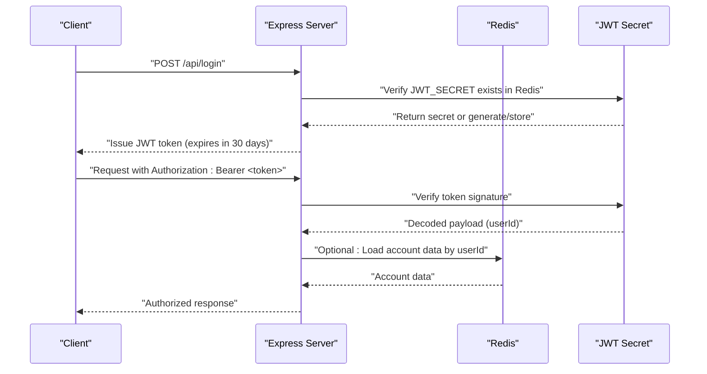
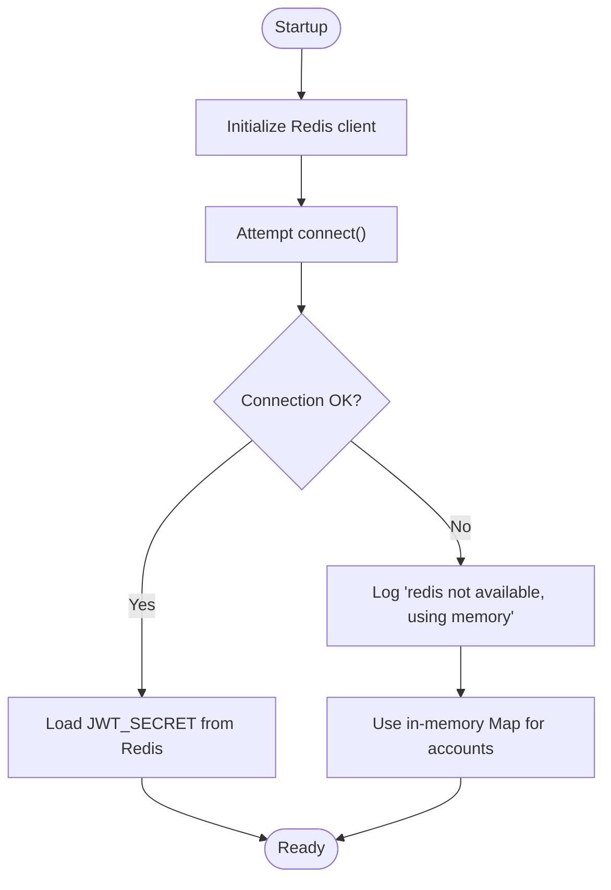
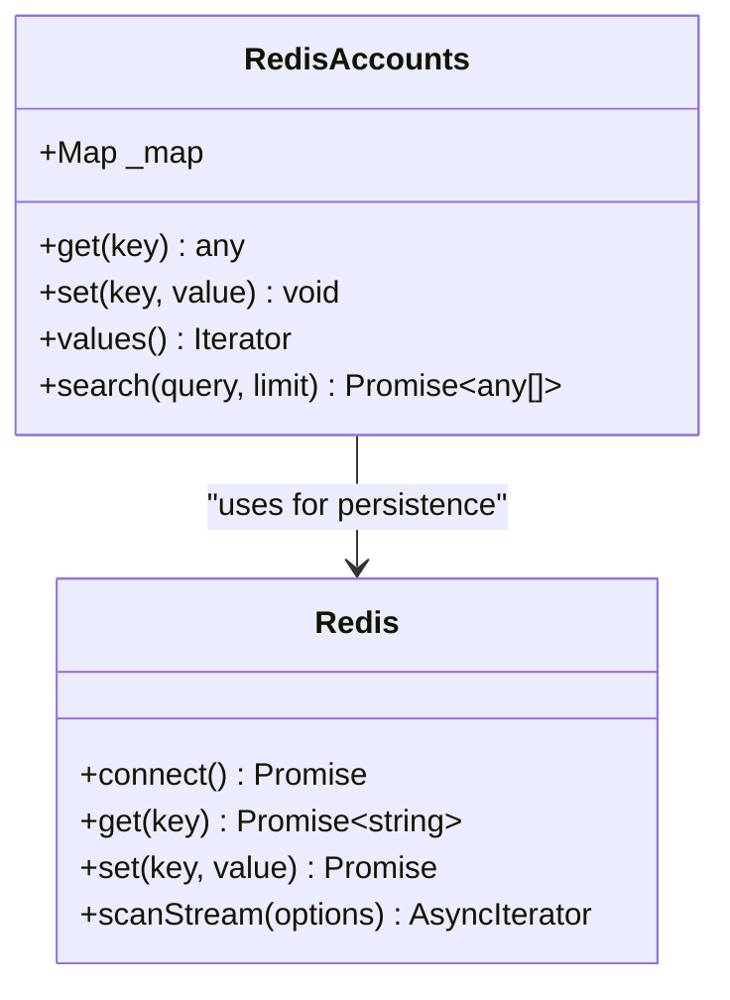
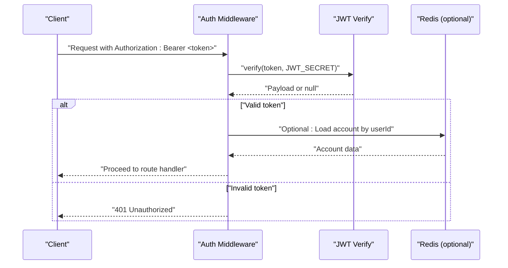
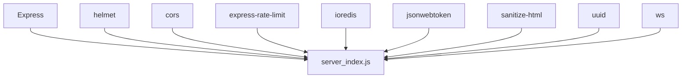

# Redis Session Management

<cite>
**Referenced Files in This Document**
- [server_index.js](file://server_index.js)
- [index.js](file://server/index.js)
- [package.json](file://server/package.json)
- [api.js](file://src/lib/api.js)
</cite>

## Table of Contents
1. [Introduction](#introduction)
2. [Project Structure](#project-structure)
3. [Core Components](#core-components)
4. [Architecture Overview](#architecture-overview)
5. [Detailed Component Analysis](#detailed-component-analysis)
6. [Dependency Analysis](#dependency-analysis)
7. [Performance Considerations](#performance-considerations)
8. [Troubleshooting Guide](#troubleshooting-guide)
9. [Conclusion](#conclusion)

## Introduction
This document describes the Redis-based session management and caching strategy implemented in the backend server. It covers Redis connection configuration, session storage format, cache key management, session lifecycle (creation, validation, renewal, cleanup), token-based authentication with JWT, and practical guidance for scaling, clustering, failover, performance optimization, monitoring, and debugging.

## Project Structure
The session and caching logic is primarily implemented in the server-side entry files. Redis is used for persistent account data and JWT secret storage, while JWT tokens are validated on each request to authorize access.

**Diagram sources**
- [server_index.js:28](file://server_index.js#L28)
- [server_index.js:32](file://server_index.js#L32)
- [server_index.js:45](file://server_index.js#L45)

**Section sources**
- [server_index.js:28](file://server_index.js#L28)
- [server_index.js:32](file://server_index.js#L32)
- [server_index.js:45](file://server_index.js#L45)

## Core Components
- Redis client initialization and lazy connection
- JWT secret persistence and retrieval
- Account data caching with Redis-backed fallback
- Authentication middleware using JWT verification
- Token lifecycle and renewal via expiration

Key implementation references:
- Redis client creation and connection: [server_index.js:28](file://server_index.js#L28)
- JWT secret loading from Redis: [server_index.js:32](file://server_index.js#L32)
- Account store abstraction with Redis and memory fallback: [server_index.js:45](file://server_index.js#L45)
- JWT signing and verification helpers: [server_index.js:77](file://server_index.js#L77), [server_index.js:80](file://server_index.js#L80)
- Authentication middleware: [server_index.js:524](file://server_index.js#L524), [server_index.js:527](file://server_index.js#L527)

**Section sources**
- [server_index.js:28](file://server_index.js#L28)
- [server_index.js:32](file://server_index.js#L32)
- [server_index.js:45](file://server_index.js#L45)
- [server_index.js:77](file://server_index.js#L77)
- [server_index.js:80](file://server_index.js#L80)
- [server_index.js:524](file://server_index.js#L524)
- [server_index.js:527](file://server_index.js#L527)

## Architecture Overview
The server initializes a Redis client lazily and attempts to connect. On startup, it loads or generates a persistent JWT secret from Redis. Account data is stored under keys prefixed with `acc:` and backed by a memory Map as a fallback. Authentication relies on JWT tokens passed in Authorization headers.

**Diagram sources**
- [server_index.js:32](file://server_index.js#L32)
- [server_index.js:77](file://server_index.js#L77)
- [server_index.js:80](file://server_index.js#L80)
- [server_index.js:45](file://server_index.js#L45)

## Detailed Component Analysis

### Redis Connection and Fallback
- The Redis client is created with lazyConnect enabled and a connection attempt is initiated at startup. If Redis is unavailable, the server logs a warning and continues using an in-memory Map for account data.
- The account store uses a Map as an in-memory cache and falls back to Redis for persistence.

Implementation references:
- Redis client creation and connection: [server_index.js:28](file://server_index.js#L28)
- Account store with fallback: [server_index.js:45](file://server_index.js#L45)

**Diagram sources**
- [server_index.js:28](file://server_index.js#L28)
- [server_index.js:32](file://server_index.js#L32)
- [server_index.js:45](file://server_index.js#L45)

**Section sources**
- [server_index.js:28](file://server_index.js#L28)
- [server_index.js:32](file://server_index.js#L32)
- [server_index.js:45](file://server_index.js#L45)

### JWT Secret Persistence
- On startup, the server checks Redis for a persisted JWT_SECRET. If absent, it generates a random secret and stores it in Redis. If Redis is unavailable, it uses an ephemeral secret and logs a warning.
- This ensures consistent token signing/verification across restarts when Redis is available.

Implementation references:
- JWT secret loading and generation: [server_index.js:32](file://server_index.js#L32)

**Section sources**
- [server_index.js:32](file://server_index.js#L32)

### Account Store and Cache Keys
- Account data is cached in Redis under keys formatted as `acc:<userId>`. Values are JSON-encoded.
- The store maintains an in-memory Map as a fallback. Search functionality scans Redis keyspace using SCAN with a cursor-based stream to find matching usernames.

Implementation references:
- Account key format and JSON serialization: [server_index.js:45](file://server_index.js#L45)
- Redis SCAN-based search: [server_index.js:50](file://server_index.js#L50)

**Diagram sources**
- [server_index.js:45](file://server_index.js#L45)
- [server_index.js:50](file://server_index.js#L50)

**Section sources**
- [server_index.js:45](file://server_index.js#L45)
- [server_index.js:50](file://server_index.js#L50)

### Authentication Middleware and Token Validation
- The server signs JWT tokens with a 30-day expiration and verifies them on protected routes.
- The optionalAuth middleware extracts the token from the Authorization header, verifies it, and attaches the decoded userId to the request object.

Implementation references:
- Token signing helper: [server_index.js:77](file://server_index.js#L77)
- Token verification helper: [server_index.js:80](file://server_index.js#L80)
- Optional auth middleware: [server_index.js:524](file://server_index.js#L524)
- Required auth middleware: [server_index.js:527](file://server_index.js#L527)

**Diagram sources**
- [server_index.js:524](file://server_index.js#L524)
- [server_index.js:527](file://server_index.js#L527)
- [server_index.js:80](file://server_index.js#L80)

**Section sources**
- [server_index.js:77](file://server_index.js#L77)
- [server_index.js:80](file://server_index.js#L80)
- [server_index.js:524](file://server_index.js#L524)
- [server_index.js:527](file://server_index.js#L527)

### Session Lifecycle
- Creation: Issued upon successful authentication; token carries a userId and expires in 30 days.
- Validation: Per-request verification using the JWT_SECRET loaded from Redis.
- Renewal: Achieved by issuing a new token with the same userId before the old token expires.
- Cleanup: No explicit Redis TTL is set for tokens; cleanup relies on natural expiration.

Implementation references:
- Token signing with expiration: [server_index.js:77](file://server_index.js#L77)
- Token verification: [server_index.js:80](file://server_index.js#L80)

**Section sources**
- [server_index.js:77](file://server_index.js#L77)
- [server_index.js:80](file://server_index.js#L80)

### Token Blacklisting and Logout
- The current implementation does not maintain a blacklist of revoked tokens. Logout does not invalidate issued tokens; clients should stop sending the token after logout.
- For logout functionality, consider adding a short-lived token revocation list keyed by userId or jti with TTL, and checking it in the auth middleware.

[No sources needed since this section provides general guidance]

### Redis Clustering, Failover, and Scaling
- Current implementation uses a single Redis instance. For clustering and high availability:
  - Use Redis Sentinel for automatic failover or Redis Cluster for horizontal scaling.
  - Configure the Redis client with cluster-aware settings and retry/backoff policies.
  - Ensure the JWT_SECRET key is replicated across nodes to avoid single-point failures.

[No sources needed since this section provides general guidance]

### Performance Optimization Techniques
- Connection pooling and keep-alive settings for the Redis client.
- Use pipeline/multi-exec for batched account updates.
- Apply appropriate TTLs to transient keys to reduce memory pressure.
- Monitor slowlog and use SCAN with COUNT for efficient key iteration.

[No sources needed since this section provides general guidance]

### Monitoring and Debugging
- Health endpoint exposes counters for internal state (e.g., number of WebSocket clients).
- Enable Redis slowlog and monitor command latency.
- Log Redis connection errors and fallback to memory usage.
- Instrument token verification failures and account lookup misses.

Implementation references:
- Health endpoint: [server_index.js:353](file://server_index.js#L353)

**Section sources**
- [server_index.js:353](file://server_index.js#L353)

## Dependency Analysis
The server depends on Express for routing, helmet and CORS for security, rate limiting for API protection, and ioredis for Redis connectivity. JWT is handled via jsonwebtoken.

**Diagram sources**
- [package.json:6](file://server/package.json#L6)
- [server_index.js:28](file://server_index.js#L28)

**Section sources**
- [package.json:6](file://server/package.json#L6)
- [server_index.js:28](file://server_index.js#L28)

## Performance Considerations
- Prefer pipelining for bulk account writes to minimize RTTs.
- Use SCAN with reasonable COUNT values to iterate keys without blocking.
- Set TTLs on temporary keys to prevent unbounded growth.
- Cache hot account data in memory with periodic Redis sync.

[No sources needed since this section provides general guidance]

## Troubleshooting Guide
Common issues and remedies:
- Redis unavailable at startup: The server logs a warning and uses memory fallback. Ensure Redis is reachable and credentials are correct.
  - Reference: [server_index.js:28](file://server_index.js#L28)
- JWT secret missing or invalid: If Redis is down, an ephemeral secret is used. Restarting the service may cause signature mismatches; ensure Redis is available for persistent secrets.
  - Reference: [server_index.js:32](file://server_index.js#L32)
- Authentication failing: Verify the Authorization header format and token validity. Confirm JWT_SECRET consistency.
  - References: [server_index.js:524](file://server_index.js#L524), [server_index.js:527](file://server_index.js#L527), [server_index.js:80](file://server_index.js#L80)
- Account search returns empty: The search uses SCAN; ensure keys exist and the query length is sufficient.
  - Reference: [server_index.js:50](file://server_index.js#L50)

**Section sources**
- [server_index.js:28](file://server_index.js#L28)
- [server_index.js:32](file://server_index.js#L32)
- [server_index.js:524](file://server_index.js#L524)
- [server_index.js:527](file://server_index.js#L527)
- [server_index.js:80](file://server_index.js#L80)
- [server_index.js:50](file://server_index.js#L50)

## Conclusion
The current implementation provides a pragmatic Redis-backed session and caching strategy with JWT-based authentication. It includes Redis persistence with a memory fallback, JWT secret persistence, and basic account caching. For production deployments, consider adding token blacklisting, Redis clustering/failover, TTLs for transient data, and enhanced monitoring to scale effectively.