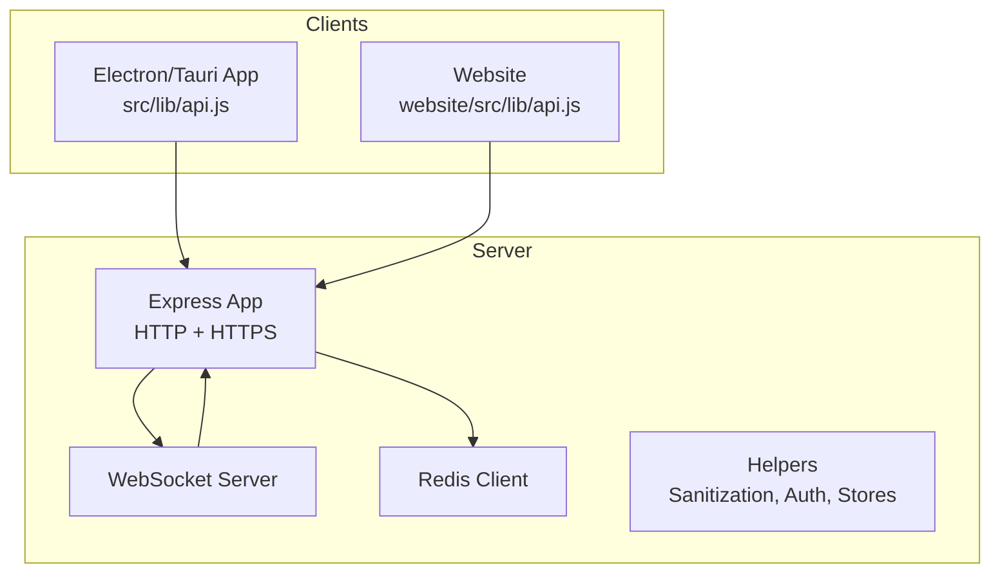
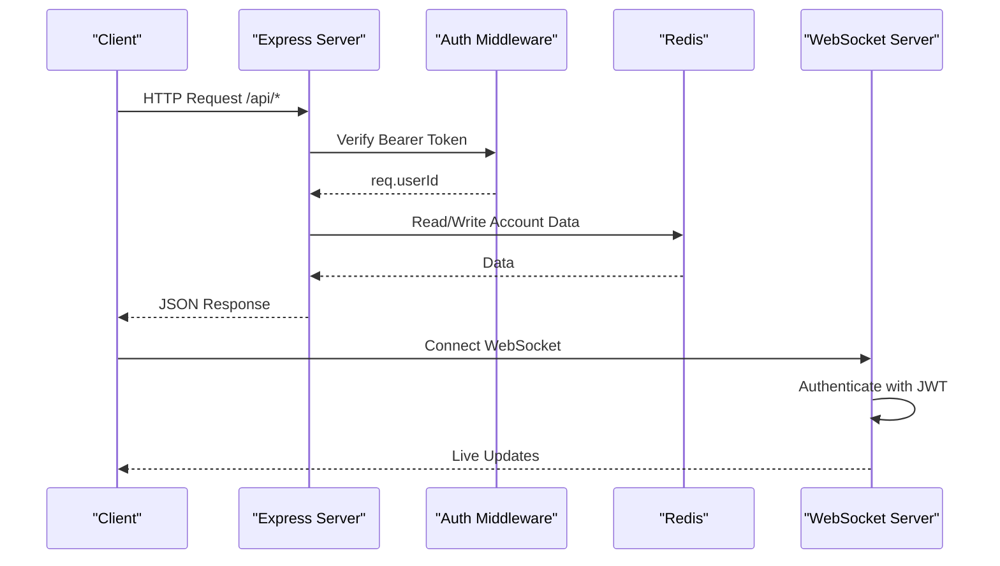
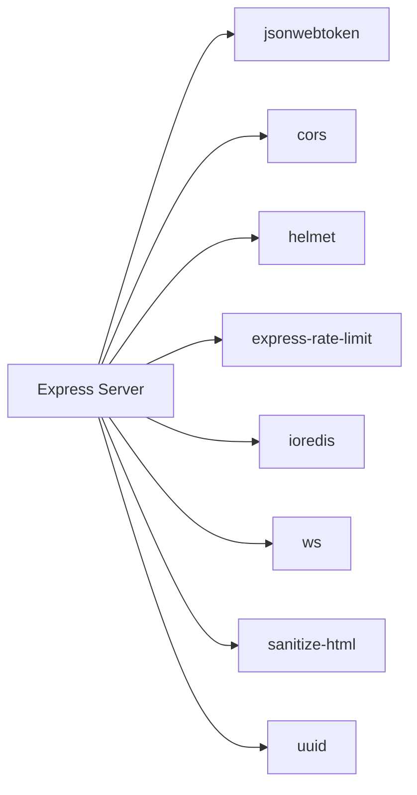

# API Endpoints & REST Services

<cite>
**Referenced Files in This Document**
- [server/index.js](file://server/index.js)
- [server/package.json](file://server/package.json)
- [src/lib/api.js](file://src/lib/api.js)
- [website/src/lib/api.js](file://website/src/lib/api.js)
</cite>

## Table of Contents
1. [Introduction](#introduction)
2. [Project Structure](#project-structure)
3. [Core Components](#core-components)
4. [Architecture Overview](#architecture-overview)
5. [Detailed Component Analysis](#detailed-component-analysis)
6. [Dependency Analysis](#dependency-analysis)
7. [Performance Considerations](#performance-considerations)
8. [Troubleshooting Guide](#troubleshooting-guide)
9. [Conclusion](#conclusion)
10. [Appendices](#appendices)

## Introduction
This document provides comprehensive API documentation for the SBGames backend, covering all REST endpoints and service interfaces. It organizes the API by functional areas: user management, inventory and shop, marketplace, groups and social, activity tracking, and support tickets. For each endpoint, it specifies HTTP methods, URL patterns, request/response schemas, authentication requirements, and error responses. It also documents data models, validation rules, business logic, rate limiting, input sanitization, security measures, optional vs required authentication patterns, token handling, API versioning, backward compatibility, deprecation policies, client integration examples, and common usage patterns.

## Project Structure
The API is implemented in a single Node.js server file with Express and WebSocket support. Client-side API wrappers exist for both the Electron/Tauri app and the website.

**Diagram sources**
- [server/index.js:37-92](file://server/index.js#L37-L92)
- [src/lib/api.js](file://src/lib/api.js)
- [website/src/lib/api.js](file://website/src/lib/api.js)

**Section sources**
- [server/index.js:37-92](file://server/index.js#L37-L92)
- [server/package.json:1-50](file://server/package.json#L1-L50)

## Core Components
- Authentication and Authorization
  - JWT-based bearer tokens for protected routes under /api/*
  - Optional auth middleware for endpoints that accept anonymous access
  - Admin role enforcement for privileged operations
- Rate Limiting
  - Global rate limiter for /api/* endpoints
  - Separate limits for webhooks and general requests
- Input Sanitization
  - HTML-safe input stripping with configurable length caps
  - Validation of usernames, item IDs, and other identifiers
- Data Stores
  - In-memory Maps for accounts, tickets, friendships, DMs, listings, activity logs, groups
  - Redis-backed persistence with in-memory fallback for accounts
- Real-time Features
  - WebSocket server for live updates, friend requests, DMs, group chats, admin notifications

**Section sources**
- [server/index.js:64-88](file://server/index.js#L64-L88)
- [server/index.js:290-301](file://server/index.js#L290-L301)
- [server/index.js:31-36](file://server/index.js#L31-L36)
- [server/index.js:94-102](file://server/index.js#L94-L102)

## Architecture Overview
The server exposes REST endpoints and a WebSocket API. REST endpoints are protected by JWT or optional auth, while WebSocket requires token-based authentication upon connection. Redis persists account data with in-memory fallback. CORS and Helmet secure cross-origin and headers.

**Diagram sources**
- [server/index.js:290-301](file://server/index.js#L290-L301)
- [server/index.js:31-36](file://server/index.js#L31-L36)
- [server/index.js:760-966](file://server/index.js#L760-L966)

## Detailed Component Analysis

### Authentication and Session Management
- Endpoint: POST /auth/tg-login
  - Purpose: Telegram widget login flow; creates/updates user account and issues JWT
  - Authentication: None (public)
  - Request: { tgUser, username }
  - Response: { user, token }
  - Validation: Username sanitized and checked against regex; Telegram user ID validated
  - Security: Hash-based Telegram auth verification performed before account creation
  - Errors: 400 for missing fields, 401 for invalid user, 422 for validation failures
- Endpoint: POST /auth/create-code
  - Purpose: Desktop launcher code generation for browserless login
  - Authentication: None
  - Response: { code }
  - Notes: Codes expire after 10 minutes
- Endpoint: GET /auth/check-code
  - Purpose: Poll for code confirmation
  - Authentication: None
  - Response: { confirmed, tgUser }
- Endpoint: GET /health
  - Purpose: Server health and counts
  - Authentication: None
  - Response: { ok, accounts, tickets, ws }

**Section sources**
- [server/index.js:140-178](file://server/index.js#L140-L178)
- [server/index.js:181-200](file://server/index.js#L181-L200)
- [server/index.js:178](file://server/index.js#L178)

### User Management (/api/user/*)
- Endpoint: GET /api/user/:id
  - Purpose: Public profile lookup
  - Authentication: None
  - Path Params: id (sanitized)
  - Response: { id, username, role, bio, equip, inventory, createdAt, online, friendCount }
  - Errors: 404 if not found
- Endpoint: GET /api/user/:id/activity
  - Purpose: Aggregated activity for a user
  - Authentication: Required
  - Path Params: id (sanitized)
  - Response: { totalSec, byServer, lastSessionAt, recent }
- Endpoint: GET /api/user/:id/comments
  - Purpose: Retrieve profile comments
  - Authentication: None
  - Response: { comments: [ ... ] }
- Endpoint: POST /api/user/:id/comments
  - Purpose: Post a profile comment
  - Authentication: Required
  - Validation: Text sanitized, min length, rate limits per user
  - Response: { ok, comment }
  - Errors: 400 for self-comment, 400 for short text, 429 for rate limit exceeded
- Endpoint: GET /api/user/bio
  - Purpose: Get authenticated user bio
  - Authentication: Required
  - Response: { bio }
- Endpoint: PUT /api/user/bio
  - Purpose: Update authenticated user bio
  - Authentication: Required
  - Request: { bio }
  - Response: { ok, bio }

**Section sources**
- [server/index.js:211-228](file://server/index.js#L211-L228)
- [server/index.js:230-241](file://server/index.js#L230-L241)
- [server/index.js:253-287](file://server/index.js#L253-L287)
- [server/index.js:394-406](file://server/index.js#L394-L406)

### Inventory and Shop (/api/inventory/*)
- Catalog
  - GET /api/inventory/catalog
  - Response: { items: SHOP_CATALOG }
- Inventory
  - GET /api/inventory
  - Authentication: Required
  - Response: { owned, market, equip, catalog, marketCatalog }
- Buy Item
  - POST /api/inventory/buy
  - Authentication: Required
  - Request: { itemId }
  - Validation: Item exists, user owns item, sufficient balance
  - Response: { ok, balance, inventory }
  - Errors: 404 for item not found, 400 for insufficient funds or already owned
- Equip Item
  - POST /api/inventory/equip
  - Authentication: Required
  - Request: { itemId }
  - Validation: Item owned, item exists
  - Response: { ok, equip }
- Unequip Item
  - POST /api/inventory/unequip
  - Authentication: Required
  - Request: { type }
  - Validation: type in ["frame","background","avatar_animated","badge"]
  - Response: { ok, equip }

**Section sources**
- [server/index.js:340-350](file://server/index.js#L340-L350)
- [server/index.js:344-350](file://server/index.js#L344-L350)
- [server/index.js:352-366](file://server/index.js#L352-L366)
- [server/index.js:368-379](file://server/index.js#L368-L379)
- [server/index.js:381-391](file://server/index.js#L381-L391)

### Activity Tracking (/api/activity/*)
- Submit Activity
  - POST /api/activity
  - Authentication: Required
  - Request: { serverId, startedAt, endedAt, durationSec }
  - Validation: Numeric timestamps, bounded duration
  - Response: { ok }
- Get Activity
  - GET /api/activity
  - Authentication: Required
  - Response: { totalSec, byServer, lastSessionAt, recent }

**Section sources**
- [server/index.js:412-422](file://server/index.js#L412-L422)
- [server/index.js:424-441](file://server/index.js#L424-L441)

### Marketplace (/api/market/*)
- Listings
  - GET /api/market/listings
  - Query: type (optional)
  - Response: { listings: [...] }
  - Listing fields: id, itemId, itemType, name, preview, price, sellerId, sellerName, createdAt, status
- My Listings
  - GET /api/market/my
  - Authentication: Required
  - Response: { listings: [...] }
- Catalog
  - GET /api/market/catalog
  - Response: { items: MARKET_CATALOG }
- Grant Item (Admin)
  - POST /api/market/grant
  - Authentication: Required
  - Validation: Admin role
  - Request: { userId, itemId }
  - Response: { ok, market }
- Sell Item
  - POST /api/market/sell
  - Authentication: Required
  - Request: { itemId, price }
  - Validation: Owned market item, price range 10–100000, no duplicate active listing
  - Response: { ok, listing }
- Buy Listing
  - POST /api/market/buy/:id
  - Authentication: Required
  - Validation: Listing exists and active, not self-buy, sufficient balance
  - Response: { ok, balance, market }
  - Fee: 5% if listing older than 14 days
- Cancel Listing
  - DELETE /api/market/:id
  - Authentication: Required
  - Validation: Owns listing, status active
  - Response: { ok }

**Section sources**
- [server/index.js:463-471](file://server/index.js#L463-L471)
- [server/index.js:473-479](file://server/index.js#L473-L479)
- [server/index.js:481-483](file://server/index.js#L481-L483)
- [server/index.js:486-498](file://server/index.js#L486-L498)
- [server/index.js:500-534](file://server/index.js#L500-L534)
- [server/index.js:536-571](file://server/index.js#L536-L571)
- [server/index.js:573-587](file://server/index.js#L573-L587)

### Groups and Social (/api/groups/*)
- List Groups
  - GET /api/groups
  - Authentication: Required
  - Response: { groups: [...] }
  - Group fields: id, name, ownerId, members, createdAt
- Create Group
  - POST /api/groups
  - Authentication: Required
  - Request: { name }
  - Validation: Length 2–40
  - Response: { ok, group }
- Invite to Group
  - POST /api/groups/:id/invite
  - Authentication: Required
  - Request: { username }
  - Validation: Group exists, user is member, group not full (≤8), not already member
  - Response: { ok }
- Respond to Invite
  - POST /api/groups/:id/respond
  - Authentication: Required
  - Request: { accept }
  - Response: { ok, group }
- Leave Group
  - POST /api/groups/:id/leave
  - Authentication: Required
  - Response: { ok }
- Group Messages
  - GET /api/groups/:id/messages
  - Authentication: Required
  - Response: { messages: [...] }
- Pending Invites
  - GET /api/groups/invites
  - Authentication: Required
  - Response: { invites: [...] }

**Section sources**
- [server/index.js:606-612](file://server/index.js#L606-L612)
- [server/index.js:614-622](file://server/index.js#L614-L622)
- [server/index.js:624-644](file://server/index.js#L624-L644)
- [server/index.js:646-660](file://server/index.js#L646-L660)
- [server/index.js:662-679](file://server/index.js#L662-L679)
- [server/index.js:681-686](file://server/index.js#L681-L686)
- [server/index.js:688-696](file://server/index.js#L688-L696)

### Activity Tracking (/api/activity/*)
- Submit Activity
  - POST /api/activity
  - Authentication: Required
  - Request: { serverId, startedAt, endedAt, durationSec }
  - Validation: Numeric timestamps, bounded duration
  - Response: { ok }
- Get Activity
  - GET /api/activity
  - Authentication: Required
  - Response: { totalSec, byServer, lastSessionAt, recent }

**Section sources**
- [server/index.js:412-422](file://server/index.js#L412-L422)
- [server/index.js:424-441](file://server/index.js#L424-L441)

### Support Tickets (/support/*)
- List Tickets (Admin)
  - GET /support/tickets
  - Authentication: None
  - Response: { tickets: [...] }
- Ticket Details
  - GET /support/ticket/:id
  - Authentication: None
  - Response: Ticket object
- Create Ticket
  - POST /support/ticket
  - Authentication: None
  - Request: { category, message, username, userId }
  - Validation: Non-empty fields, minimum message length
  - Response: { ticketId }

**Section sources**
- [server/index.js:707-721](file://server/index.js#L707-L721)
- [server/index.js:724-758](file://server/index.js#L724-L758)

### Real-time WebSocket API
- Connection
  - Endpoint: WebSocket
  - Authentication: Required via message { type: "auth", token, username }
  - Roles: admin or user
  - Broadcasts: online users, friend requests, group updates, ticket notifications
- Message Types
  - auth: Authenticate and initialize client state
  - friend_request_send: Send friend request by username
  - friend_request_respond: Accept or decline friend request
  - dm_send/dm_history: Private messaging
  - message: New ticket message (admin/client)
  - read_ticket/close_ticket: Admin actions
  - subscribe_ticket: Subscribe to ticket updates
  - group_send: Group chat message

**Section sources**
- [server/index.js:760-966](file://server/index.js#L760-L966)

## Dependency Analysis
- External Dependencies
  - express, cors, helmet, express-rate-limit, jsonwebtoken, sanitize-html, ioredis, ws, uuid
- Internal Dependencies
  - Redis-backed account storage with in-memory fallback
  - In-memory collections for tickets, friendships, DMs, listings, activity logs, groups
- Client Integrations
  - Electron/Tauri app and website consume REST endpoints and WebSocket events

**Diagram sources**
- [server/package.json:1-50](file://server/package.json#L1-L50)
- [server/index.js:1-14](file://server/index.js#L1-L14)

**Section sources**
- [server/package.json:1-50](file://server/package.json#L1-L50)

## Performance Considerations
- Rate Limiting
  - Global limiter for /api/* with 120 requests per minute
  - Separate JSON body size limits for general and webhook endpoints
- Caching and Persistence
  - Redis used for account persistence; falls back to in-memory Map if unavailable
  - In-memory caches for recent activity, comments, and group messages
- Scalability
  - Current implementation is single-process; consider clustering or external queue for high concurrency
  - WebSocket connections stored in-memory; consider Redis pub/sub for multi-instance deployments

[No sources needed since this section provides general guidance]

## Troubleshooting Guide
- Authentication Failures
  - 401 Unauthorized: Missing or invalid Bearer token
  - 403 Forbidden: Insufficient privileges (admin-only endpoints)
- Validation Errors
  - 400 Bad Request: Malformed request, invalid fields, or business rule violations
  - 422 Unprocessable Entity: Input validation failures
  - 429 Too Many Requests: Rate limit exceeded
- Common Issues
  - Username validation: 3–16 characters, alphanumeric and underscore only
  - Item purchase: Must own item, sufficient balance
  - Market sell: Must own item, price in range, no duplicate active listing
  - Comment posting: Minimum length, rate limits enforced
- Logging and Monitoring
  - Health endpoint provides counts for accounts, tickets, and WebSocket clients
  - Console logs for webhook setup and errors

**Section sources**
- [server/index.js:140-178](file://server/index.js#L140-L178)
- [server/index.js:259-287](file://server/index.js#L259-L287)
- [server/index.js:352-366](file://server/index.js#L352-L366)
- [server/index.js:500-534](file://server/index.js#L500-L534)
- [server/index.js:178](file://server/index.js#L178)

## Conclusion
The SBGames API provides a cohesive set of REST endpoints and WebSocket features for user management, inventory/shop, marketplace, groups/social, activity tracking, and support tickets. It enforces JWT-based authentication, applies input sanitization, rate limiting, and admin-only controls where necessary. The design supports real-time interactions and is structured to evolve with optional auth patterns and potential versioning strategies.

[No sources needed since this section summarizes without analyzing specific files]

## Appendices

### Authentication and Token Handling
- Token Issuance
  - JWT issued on successful Telegram login with 30-day expiry
- Token Usage
  - Bearer token in Authorization header for /api/* endpoints
  - Optional auth middleware allows anonymous access for specific endpoints
- Admin Role
  - Determined by username or predefined admin list

**Section sources**
- [server/index.js:77-82](file://server/index.js#L77-L82)
- [server/index.js:290-301](file://server/index.js#L290-L301)
- [server/index.js:134-136](file://server/index.js#L134-L136)

### Rate Limiting Strategy
- Global API limiter: 120 requests per 60 seconds for /api/*
- Body size limits: 32KB default, 1MB for webhook endpoint
- Additional rate limits for comment posting and hourly thresholds

**Section sources**
- [server/index.js:64-68](file://server/index.js#L64-L68)
- [server/index.js:61](file://server/index.js#L61)
- [server/index.js:265-271](file://server/index.js#L265-L271)

### Input Sanitization and Security Measures
- HTML-safe input stripping with length caps
- CORS configured for allowed origins and credentials
- Helmet enabled for secure headers (with CSP disabled for Tauri)
- Telegram widget auth verification before account creation

**Section sources**
- [server/index.js:70-75](file://server/index.js#L70-L75)
- [server/index.js:40-59](file://server/index.js#L40-L59)
- [server/index.js:124-132](file://server/index.js#L124-L132)

### API Versioning, Backward Compatibility, and Deprecation
- No explicit versioning scheme observed
- Backward compatibility not documented
- Deprecation policy not specified
- Recommendations:
  - Add version prefix to URLs or Accept headers
  - Maintain backward-compatible field additions
  - Announce breaking changes with migration timelines

[No sources needed since this section provides general guidance]

### Client Integration Examples
- Electron/Tauri App
  - Uses local API wrapper for REST calls and WebSocket subscriptions
- Website
  - Uses local API wrapper for REST calls and WebSocket subscriptions
- Typical Patterns
  - Login flow: POST /auth/tg-login, store JWT
  - Inventory: GET /api/inventory, POST /api/inventory/buy
  - Marketplace: GET /api/market/listings, POST /api/market/sell, POST /api/market/buy/:id
  - Groups: POST /api/groups, POST /api/groups/:id/invite, GET /api/groups/:id/messages
  - Activity: POST /api/activity, GET /api/activity
  - Tickets: POST /support/ticket, GET /support/tickets

**Section sources**
- [src/lib/api.js](file://src/lib/api.js)
- [website/src/lib/api.js](file://website/src/lib/api.js)