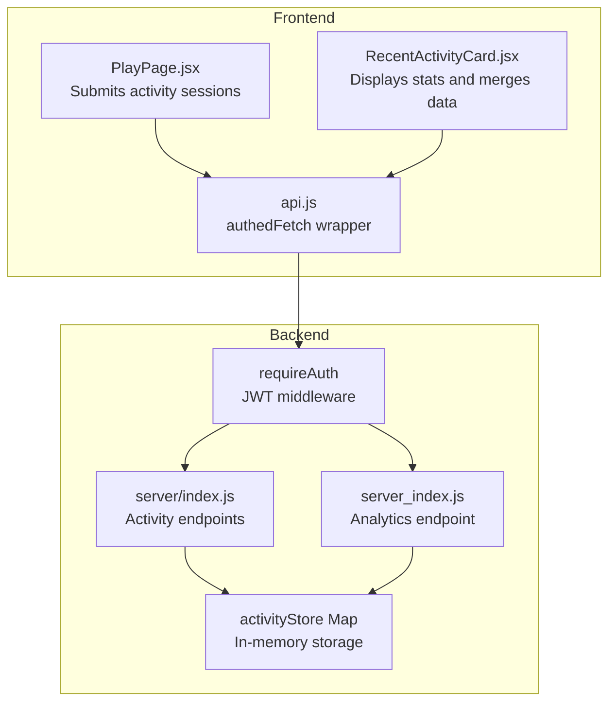
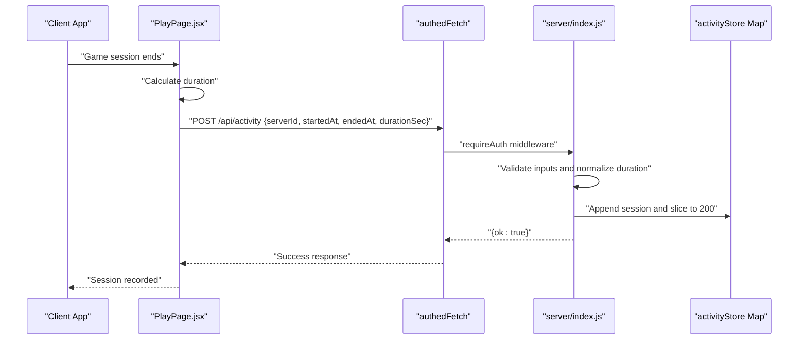
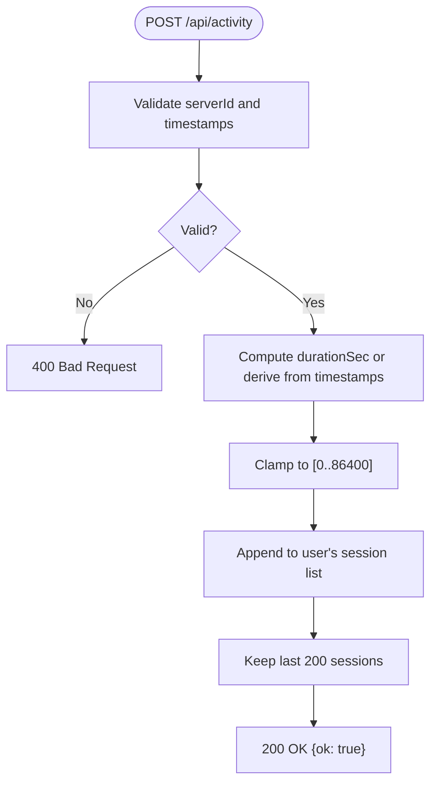
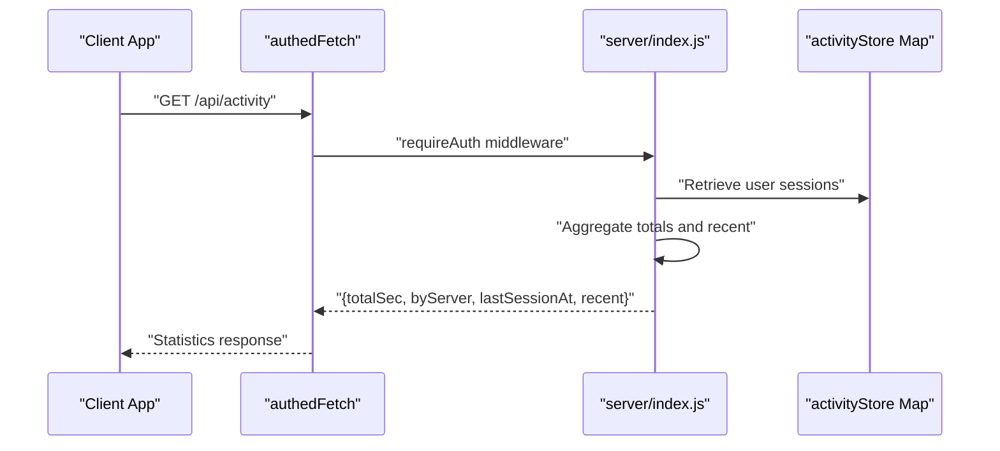
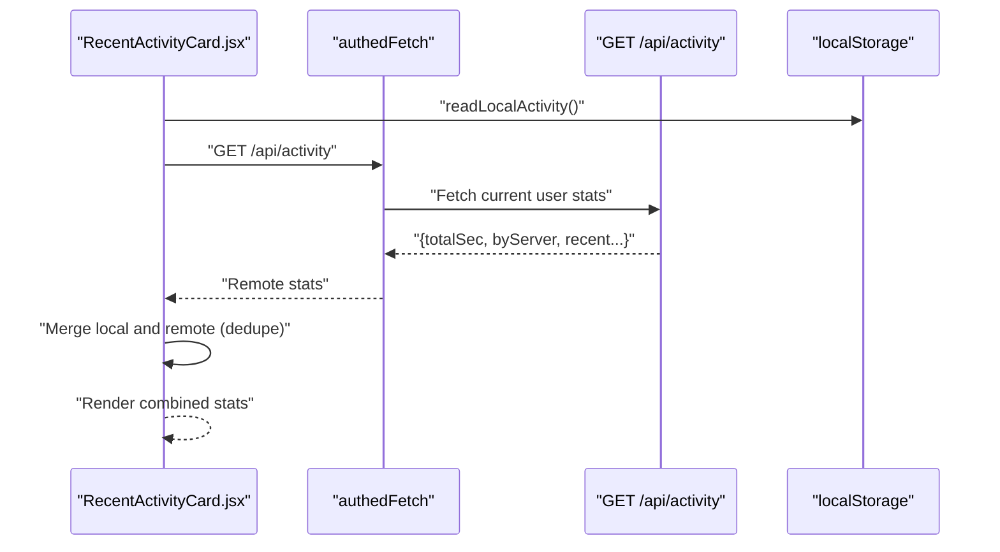
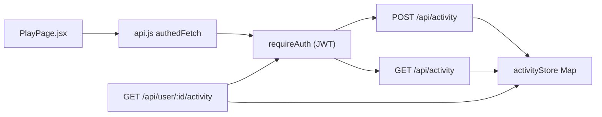

# Activity Tracking & Analytics API

<cite>
**Referenced Files in This Document**
- [server/index.js](file://server/index.js)
- [server_index.js](file://server_index.js)
- [RecentActivityCard.jsx](file://src/components/RecentActivityCard.jsx)
- [playpage.js](file://src/pages/PlayPage.jsx)
- [api.js](file://src/lib/api.js)
</cite>

## Table of Contents
1. [Introduction](#introduction)
2. [Project Structure](#project-structure)
3. [Core Components](#core-components)
4. [Architecture Overview](#architecture-overview)
5. [Detailed Component Analysis](#detailed-component-analysis)
6. [Dependency Analysis](#dependency-analysis)
7. [Performance Considerations](#performance-considerations)
8. [Troubleshooting Guide](#troubleshooting-guide)
9. [Conclusion](#conclusion)

## Introduction
This document provides comprehensive API documentation for the activity tracking and analytics system. It covers:
- Activity logging endpoints for session recording and duration calculation
- Analytics endpoints for retrieving user activity statistics and server usage aggregation
- Request/response schemas, validation rules, and data normalization
- Activity store structure, retention policies, and performance characteristics
- Session validation, duration normalization, and activity history management
- Integration with game sessions, real-time updates, and privacy considerations

## Project Structure
The activity tracking system spans the backend server and frontend client:
- Backend: Express server with two implementations (server/index.js and server_index.js) implementing the same activity endpoints
- Frontend: React components that submit activity sessions and display aggregated statistics
- Authentication: JWT-based middleware enforcing authorization for protected endpoints

**Diagram sources**
- [server/index.js:411-443](file://server/index.js#L411-L443)
- [server_index.js:591-602](file://server_index.js#L591-L602)
- [RecentActivityCard.jsx:32-84](file://src/components/RecentActivityCard.jsx#L32-L84)
- [playpage.js:178-190](file://src/pages/PlayPage.jsx#L178-L190)

**Section sources**
- [server/index.js:411-443](file://server/index.js#L411-L443)
- [server_index.js:591-602](file://server_index.js#L591-L602)
- [RecentActivityCard.jsx:32-84](file://src/components/RecentActivityCard.jsx#L32-L84)
- [playpage.js:178-190](file://src/pages/PlayPage.jsx#L178-L190)

## Core Components
- Activity Logging Endpoint
  - POST /api/activity: Accepts session metadata and duration, validates inputs, normalizes duration, and stores up to 200 recent sessions per user
- Activity Analytics Endpoint
  - GET /api/activity: Returns aggregated totals, server breakdown, last session timestamp, and recent sessions
  - GET /api/user/:id/activity: Returns public analytics for a target user ID
- Frontend Integration
  - PlayPage.jsx submits session data after gameplay
  - RecentActivityCard.jsx displays statistics and merges local and remote data

Key validation and normalization rules:
- Required fields: serverId, startedAt, endedAt
- Duration bounds: clamped between 0 and 86400 seconds (24 hours)
- Storage limits: recent sessions capped at 200 per user
- Aggregation: total seconds, by-server totals, last session timestamp, and top 10 recent sessions

**Section sources**
- [server/index.js:411-443](file://server/index.js#L411-L443)
- [server_index.js:591-602](file://server_index.js#L591-L602)
- [RecentActivityCard.jsx:13-19](file://src/components/RecentActivityCard.jsx#L13-L19)
- [playpage.js:178-190](file://src/pages/PlayPage.jsx#L178-L190)

## Architecture Overview
The system integrates client-side session capture with server-side aggregation and persistence.

**Diagram sources**
- [playpage.js:178-190](file://src/pages/PlayPage.jsx#L178-L190)
- [server/index.js:411-422](file://server/index.js#L411-L422)

## Detailed Component Analysis

### Activity Logging Endpoint (POST /api/activity)
Purpose: Record a single game session with validated metadata and normalized duration.

Processing logic:
- Input validation: serverId presence and numeric timestamps
- Duration calculation: derived from (endedAt - startedAt)/1000 if durationSec missing
- Normalization: clamp to [0, 86400] seconds
- Storage: append to user's session list and keep last 200 entries

Response: JSON object with success indicator.

**Diagram sources**
- [server/index.js:411-422](file://server/index.js#L411-L422)

**Section sources**
- [server/index.js:411-422](file://server/index.js#L411-L422)
- [server_index.js:711-719](file://server_index.js#L711-L719)

### Activity Analytics Endpoint (GET /api/activity)
Purpose: Retrieve current user's aggregated activity statistics.

Processing logic:
- Aggregate byServer totals and compute total seconds
- Track lastSessionAt as the latest endedAt among sessions
- Return recent sessions (top 10 most recent)

Response schema:
- totalSec: number
- byServer: object mapping serverId to accumulated seconds
- lastSessionAt: number (timestamp) or null
- recent: array of up to 10 session objects (most recent first)

**Diagram sources**
- [server/index.js:424-441](file://server/index.js#L424-L441)

**Section sources**
- [server/index.js:424-441](file://server/index.js#L424-L441)
- [server_index.js:721-731](file://server_index.js#L721-L731)

### Public Analytics Endpoint (GET /api/user/:id/activity)
Purpose: Retrieve public activity statistics for another user.

Processing logic:
- Sanitize target user ID parameter
- Aggregate sessions for the target user similarly to the private endpoint
- Return the same response schema as the private endpoint

Response schema identical to GET /api/activity.

**Section sources**
- [server_index.js:591-602](file://server_index.js#L591-L602)

### Frontend Integration and Data Merging
The frontend component combines local and remote activity data:
- Local activity stored in browser localStorage under a dedicated key
- On load, merges local sessions with remote data, deduplicating by timestamp and serverId
- Displays aggregated totals, server breakdown, and recent sessions

**Diagram sources**
- [RecentActivityCard.jsx:36-84](file://src/components/RecentActivityCard.jsx#L36-L84)

**Section sources**
- [RecentActivityCard.jsx:8-19](file://src/components/RecentActivityCard.jsx#L8-L19)
- [RecentActivityCard.jsx:36-84](file://src/components/RecentActivityCard.jsx#L36-L84)

## Dependency Analysis
- Authentication dependency: requireAuth middleware ensures all activity endpoints are protected
- Data store dependency: activityStore Map persists per-user session lists
- Frontend dependency: authedFetch wrapper handles base URL and authentication headers
- Cross-file dependencies:
  - PlayPage.jsx submits sessions to the logging endpoint
  - RecentActivityCard.jsx consumes both private and public analytics endpoints

**Diagram sources**
- [playpage.js:178-190](file://src/pages/PlayPage.jsx#L178-L190)
- [api.js](file://src/lib/api.js)
- [server/index.js:411-443](file://server/index.js#L411-L443)
- [server_index.js:591-602](file://server_index.js#L591-L602)

**Section sources**
- [server/index.js:411-443](file://server/index.js#L411-L443)
- [server_index.js:591-602](file://server_index.js#L591-L602)
- [playpage.js:178-190](file://src/pages/PlayPage.jsx#L178-L190)
- [api.js](file://src/lib/api.js)

## Performance Considerations
- In-memory storage: activityStore uses a Map with arrays; suitable for moderate concurrency but not designed for persistence across restarts
- Limits:
  - Maximum 200 sessions per user retained
  - Maximum 10 recent sessions returned in analytics
  - Duration clamped to 24 hours to prevent outliers
- Network:
  - Rate limiting applied to /api endpoints via middleware
  - Body size limited for JSON requests
- Recommendations:
  - Consider Redis for persistent, scalable storage
  - Add database indexing on user ID and timestamps for efficient queries
  - Implement background aggregation jobs for heavy analytics workloads

[No sources needed since this section provides general guidance]

## Troubleshooting Guide
Common issues and resolutions:
- 400 Bad Request on POST /api/activity
  - Cause: Missing serverId or invalid timestamp types
  - Resolution: Ensure serverId is present and both startedAt and endedAt are numbers
- Empty analytics response
  - Cause: No sessions recorded yet for the user
  - Resolution: Verify that sessions are being submitted after gameplay
- Duplicate sessions in merged view
  - Cause: Same session recorded locally and remotely
  - Resolution: The frontend deduplicates by combining timestamps and serverId
- Authorization errors
  - Cause: Missing or invalid JWT token
  - Resolution: Ensure authedFetch includes proper Authorization header

**Section sources**
- [server/index.js:411-422](file://server/index.js#L411-L422)
- [RecentActivityCard.jsx:60-84](file://src/components/RecentActivityCard.jsx#L60-L84)

## Conclusion
The activity tracking and analytics system provides a robust foundation for capturing game sessions, normalizing durations, and aggregating statistics. Its modular design enables straightforward extension for persistent storage, advanced analytics, and enhanced privacy controls. Integrations with the frontend ensure real-time visibility of user activity while maintaining strict validation and normalization rules.