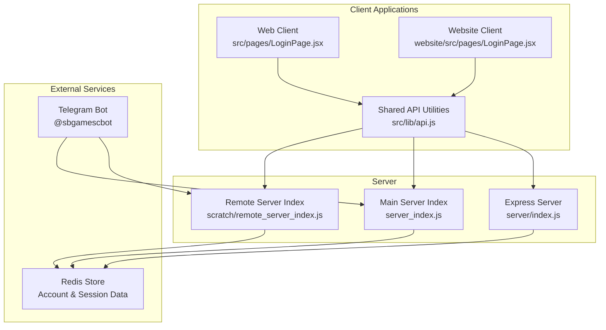
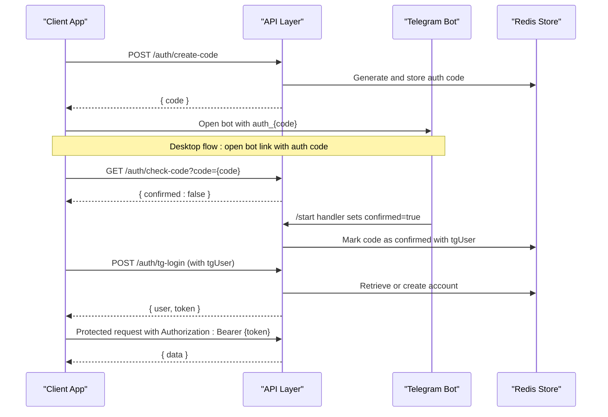
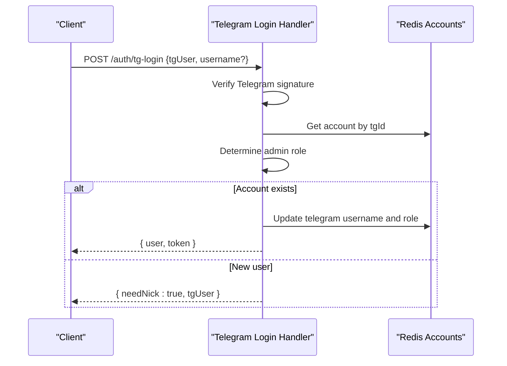
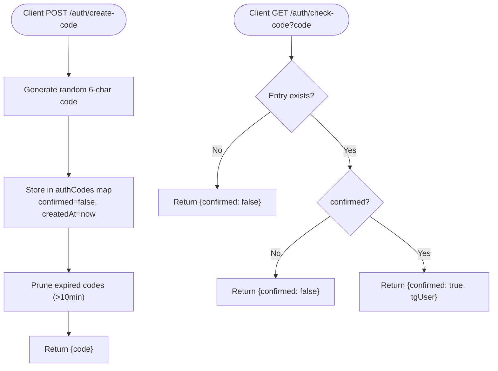
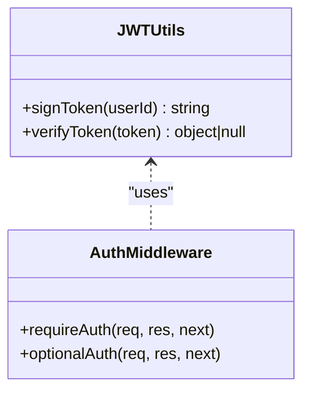
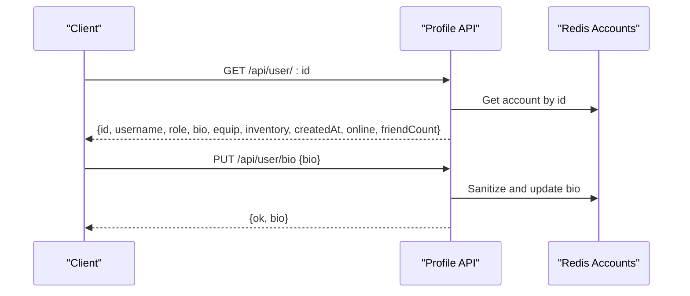
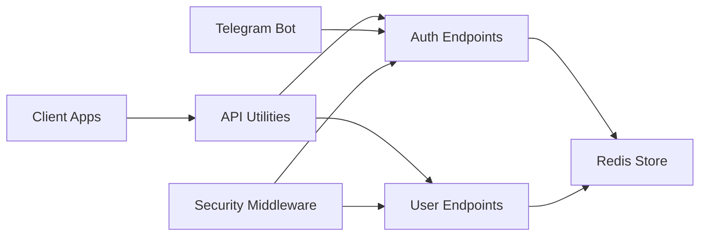

# Authentication & User Management API

<cite>
**Referenced Files in This Document**
- [server_index.js](file://server_index.js)
- [index.js](file://server/index.js)
- [remote_server_index.js](file://scratch/remote_server_index.js)
- [LoginPage.jsx](file://src/pages/LoginPage.jsx)
- [LoginPage.jsx](file://website/src/pages/LoginPage.jsx)
- [api.js](file://src/lib/api.js)
- [AdminPage.jsx](file://website/src/pages/AdminPage.jsx)
</cite>

## Table of Contents
1. [Introduction](#introduction)
2. [Project Structure](#project-structure)
3. [Core Components](#core-components)
4. [Architecture Overview](#architecture-overview)
5. [Detailed Component Analysis](#detailed-component-analysis)
6. [Dependency Analysis](#dependency-analysis)
7. [Performance Considerations](#performance-considerations)
8. [Troubleshooting Guide](#troubleshooting-guide)
9. [Conclusion](#conclusion)

## Introduction
This document provides comprehensive API documentation for authentication and user management endpoints. It covers the complete authentication flow including Telegram login, desktop authentication codes, JWT token management, user registration, profile management, and user search functionality. It also documents rate limiting strategies, input sanitization, security measures (including CORS and CSRF considerations), user account structure, role-based permissions, and admin authentication. Examples of successful authentication flows, error handling scenarios, and token refresh mechanisms are included, along with integration details for Telegram bot authentication and desktop launcher authentication.

## Project Structure
The authentication and user management functionality spans multiple layers:
- Server-side API endpoints for authentication, user profiles, and administrative functions
- Frontend client integrations for QR-based and code-based authentication flows
- Shared API utilities for authenticated requests and error handling
- Bot integration for Telegram-based authentication initiation and confirmation

**Diagram sources**
- [server/index.js](file://server/index.js)
- [server_index.js](file://server_index.js)
- [remote_server_index.js](file://scratch/remote_server_index.js)
- [LoginPage.jsx](file://src/pages/LoginPage.jsx)
- [LoginPage.jsx](file://website/src/pages/LoginPage.jsx)
- [api.js](file://src/lib/api.js)

**Section sources**
- [server/index.js](file://server/index.js)
- [server_index.js](file://server_index.js)
- [remote_server_index.js](file://scratch/remote_server_index.js)
- [LoginPage.jsx](file://src/pages/LoginPage.jsx)
- [LoginPage.jsx](file://website/src/pages/LoginPage.jsx)
- [api.js](file://src/lib/api.js)

## Core Components
- Authentication endpoints:
  - Telegram login initiation and completion
  - Desktop authentication code generation and verification
- JWT token management:
  - Token signing and verification
  - Optional and required authentication middleware
- User management:
  - Public profile retrieval
  - Profile bio management
  - Inventory and equipment management
  - User search functionality
- Security and rate limiting:
  - IP-based blocking and rate limits
  - Input sanitization
  - CORS and security headers

**Section sources**
- [server_index.js](file://server_index.js)
- [server/index.js](file://server/index.js)
- [remote_server_index.js](file://scratch/remote_server_index.js)

## Architecture Overview
The authentication architecture integrates three primary flows:
- Telegram login via bot initiation and web callback
- Desktop launcher authentication using generated codes
- JWT-based protected routes for user data and actions

**Diagram sources**
- [server_index.js](file://server_index.js)
- [remote_server_index.js](file://scratch/remote_server_index.js)

## Detailed Component Analysis

### Authentication Endpoints

#### Telegram Login Flow
- Endpoint: POST /auth/tg-login
- Purpose: Complete authentication after Telegram bot confirmation
- Request body:
  - tgUser: Telegram user object (required)
  - username: New username for registration (optional, required for new users)
- Response:
  - needNick: Boolean indicating if nickname is required
  - user: Account object
  - token: Signed JWT token
- Behavior:
  - Validates Telegram signature
  - Determines admin role based on username or ID
  - Creates account if missing, otherwise updates existing account
  - Returns either needNick flag or user/token pair

**Diagram sources**
- [server_index.js](file://server_index.js)
- [remote_server_index.js](file://scratch/remote_server_index.js)

**Section sources**
- [server_index.js](file://server_index.js)
- [remote_server_index.js](file://scratch/remote_server_index.js)

#### Desktop Authentication Codes
- Endpoint: POST /auth/create-code
- Purpose: Generate short authentication codes for desktop launcher
- Response: { code: string }
- Behavior:
  - Generates random 6-character uppercase code
  - Stores code with confirmation state and creation timestamp
  - Prunes expired codes (>10 minutes old)

- Endpoint: GET /auth/check-code
- Purpose: Poll for code confirmation
- Query parameters:
  - code: The authentication code to check
- Response:
  - confirmed: Boolean indicating confirmation status
  - tgUser: Telegram user object if confirmed

**Diagram sources**
- [server_index.js](file://server_index.js)
- [remote_server_index.js](file://scratch/remote_server_index.js)

**Section sources**
- [server_index.js](file://server_index.js)
- [remote_server_index.js](file://scratch/remote_server_index.js)

### JWT Token Management
- Token signing:
  - Algorithm: HS256
  - Secret: Stored in Redis with fallback to ephemeral
  - Expiration: 30 days
- Token verification:
  - Middleware checks Authorization header for Bearer token
  - Two modes:
    - requireAuth: Rejects requests without valid token
    - optionalAuth: Sets req.userId but allows anonymous access
- Token refresh:
  - Not implemented as separate endpoint
  - Clients should re-authenticate when token expires

**Diagram sources**
- [server/index.js](file://server/index.js)
- [server_index.js](file://server_index.js)

**Section sources**
- [server/index.js](file://server/index.js)
- [server_index.js](file://server_index.js)

### User Registration and Profile Management
- Registration:
  - New users receive needNick flag after initial Telegram login
  - Subsequent POST /auth/tg-login with username completes registration
- Profile retrieval:
  - GET /api/user/:id returns public profile data
  - Includes id, username, role, bio, equipment, inventory, timestamps
- Profile bio management:
  - GET /api/user/bio retrieves current bio
  - PUT /api/user/bio updates bio with sanitization
- Inventory and equipment:
  - Catalog retrieval and user inventory queries
  - Equipment management endpoints for different types

**Diagram sources**
- [server_index.js](file://server_index.js)
- [server/index.js](file://server/index.js)

**Section sources**
- [server_index.js](file://server_index.js)
- [server/index.js](file://server/index.js)

### User Search Functionality
- Endpoint: GET /user/search
- Query parameters:
  - nick: Username to search for (case-insensitive exact match)
- Response:
  - found: Boolean indicating if user was found
  - id: User ID if found
  - username: Username if found

**Section sources**
- [remote_server_index.js](file://scratch/remote_server_index.js)

### Role-Based Permissions and Admin Authentication
- Roles:
  - user: Standard user
  - admin: Administrator with elevated privileges
- Admin detection:
  - Based on Telegram username whitelist or ID whitelist
  - Applied during Telegram login flow
- Administrative actions:
  - Role modification endpoints in admin interface
  - Admin bypass for rate limiting

**Section sources**
- [server_index.js](file://server_index.js)
- [remote_server_index.js](file://scratch/remote_server_index.js)
- [AdminPage.jsx](file://website/src/pages/AdminPage.jsx)

### Security Measures and Rate Limiting
- Rate limiting:
  - Authentication endpoints: 30 requests per minute
  - General API: 100 requests per minute
  - Strict endpoints: 3 requests per minute
  - Admin bypass: Rate limits skipped for admins
- IP blocking:
  - Automatic blocking after repeated failures
  - Window-based failure tracking
- Input sanitization:
  - HTML tag stripping for all string inputs
  - Length limits for various fields
- CORS and security headers:
  - Express CORS configured for credentials
  - Helmet security headers including CSP, HSTS, X-Frame-Options
  - Cross-Origin policies enforced

**Section sources**
- [server/index.js](file://server/index.js)
- [server_index.js](file://server_index.js)
- [remote_server_index.js](file://scratch/remote_server_index.js)

## Dependency Analysis
The authentication system has clear separation of concerns:
- Client-side authentication flows depend on shared API utilities
- Server-side endpoints rely on Redis for persistence
- Telegram bot integration handles external authentication initiation
- Security middleware applies consistently across endpoints

**Diagram sources**
- [api.js](file://src/lib/api.js)
- [server/index.js](file://server/index.js)
- [server_index.js](file://server_index.js)
- [remote_server_index.js](file://scratch/remote_server_index.js)

**Section sources**
- [api.js](file://src/lib/api.js)
- [server/index.js](file://server/index.js)
- [server_index.js](file://server_index.js)
- [remote_server_index.js](file://scratch/remote_server_index.js)

## Performance Considerations
- Redis-backed storage ensures fast account lookups and authentication code management
- Rate limiting prevents abuse while maintaining responsive user experience
- Input sanitization protects against XSS and data corruption
- JWT tokens eliminate database lookups for authenticated requests
- Consider implementing token refresh endpoints for long-running sessions

## Troubleshooting Guide
Common authentication issues and resolutions:
- 401 Unauthorized:
  - Invalid or expired JWT token
  - Missing Authorization header
  - Re-authenticate using Telegram login flow
- 400 Bad Request:
  - Missing required fields in request
  - Invalid Telegram user data
  - Check request payload format
- 429 Too Many Requests:
  - Rate limit exceeded
  - Wait for cooldown period
  - Admin requests are exempt
- 404 Not Found:
  - User not found by ID
  - Verify user ID format and existence
- HTML responses instead of JSON:
  - Server misconfiguration or maintenance
  - Check server availability and endpoint URLs

**Section sources**
- [server/index.js](file://server/index.js)
- [server_index.js](file://server_index.js)
- [api.js](file://src/lib/api.js)

## Conclusion
The authentication and user management system provides a robust, secure, and scalable foundation for user access and profile management. The dual authentication flows (Telegram and desktop) offer flexibility for different client types, while JWT-based authorization ensures efficient and secure protected resource access. The comprehensive rate limiting, input sanitization, and security headers protect the system from common threats. Future enhancements could include token refresh mechanisms and expanded user search capabilities.