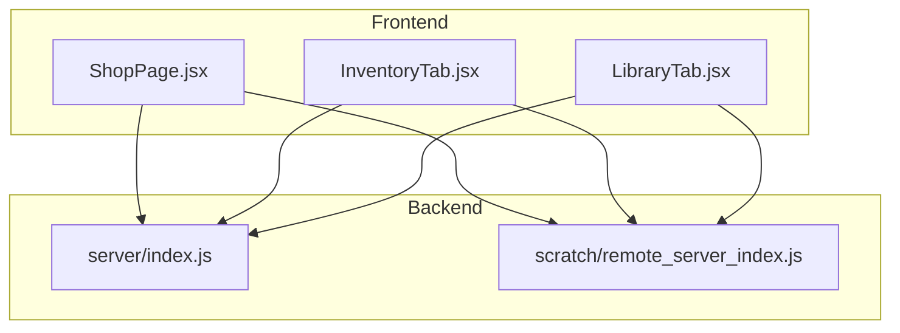
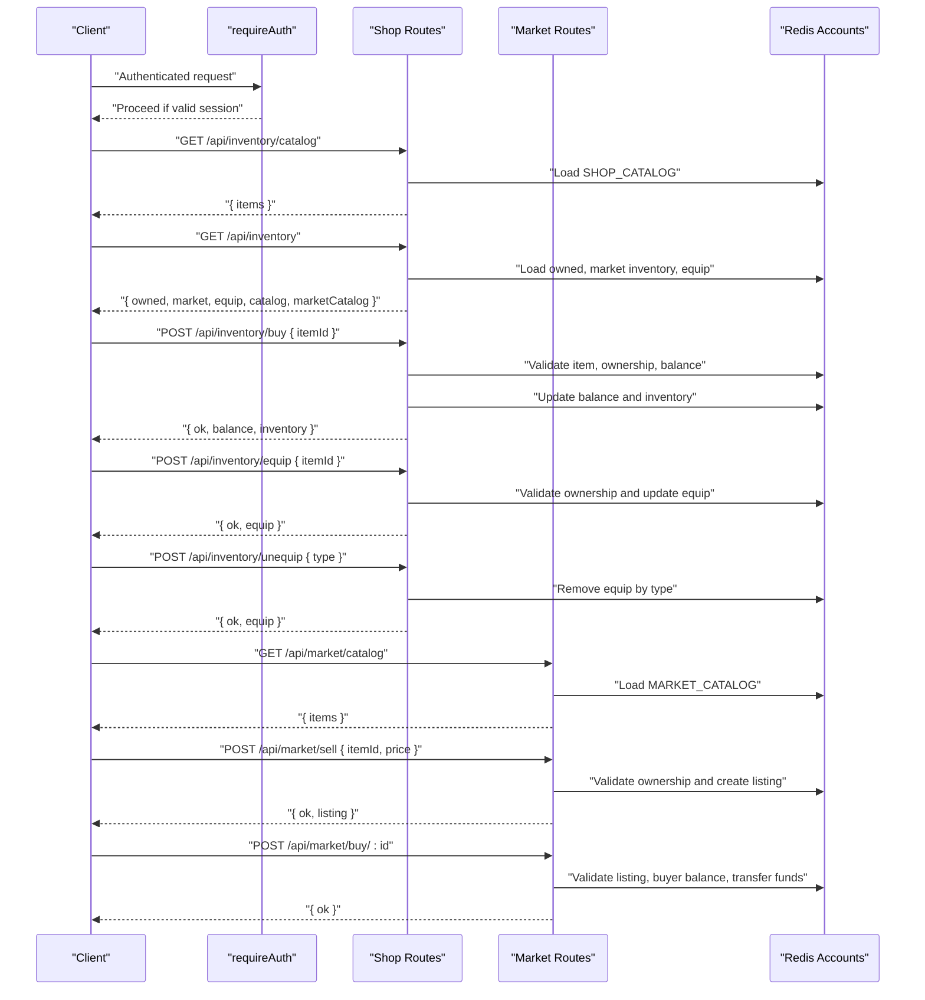
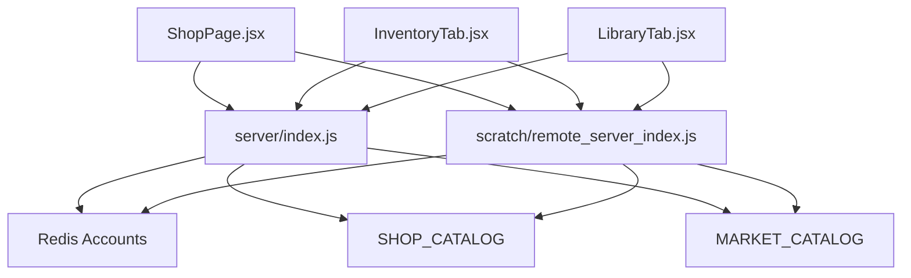

# Inventory & Shop Operations API

<cite>
**Referenced Files in This Document**
- [server/index.js](file://server/index.js)
- [scratch/remote_server_index.js](file://scratch/remote_server_index.js)
- [src/pages/ShopPage.jsx](file://src/pages/ShopPage.jsx)
- [src/pages/LibraryTab.jsx](file://src/pages/LibraryTab.jsx)
- [src/pages/InventoryTab.jsx](file://src/pages/InventoryTab.jsx)
- [src/pages/catalog.js](file://src/pages/catalog.js)
</cite>

## Table of Contents
1. [Introduction](#introduction)
2. [Project Structure](#project-structure)
3. [Core Components](#core-components)
4. [Architecture Overview](#architecture-overview)
5. [Detailed Component Analysis](#detailed-component-analysis)
6. [Dependency Analysis](#dependency-analysis)
7. [Performance Considerations](#performance-considerations)
8. [Troubleshooting Guide](#troubleshooting-guide)
9. [Conclusion](#conclusion)
10. [Appendices](#appendices)

## Introduction
This document provides comprehensive API documentation for the inventory and shop system endpoints. It covers:
- Shop catalog retrieval and purchase operations
- User inventory management
- Equipment system (equipping and unequipping items)
- Marketplace catalog and trading endpoints
- Item categorization, pricing, balance management, ownership validation, and equipment slot management
- Examples of successful transactions and error scenarios
- Relationship between shop items and marketplace items, uniqueness validation, and conflict resolution

## Project Structure
The inventory and shop system spans backend routes and frontend UI components:
- Backend routes define endpoints for shop, inventory, equipment, and marketplace
- Frontend components consume these endpoints to render catalogs, manage inventory, and process purchases

**Diagram sources**
- [server/index.js](file://server/index.js)
- [scratch/remote_server_index.js](file://scratch/remote_server_index.js)
- [src/pages/ShopPage.jsx](file://src/pages/ShopPage.jsx)
- [src/pages/InventoryTab.jsx](file://src/pages/InventoryTab.jsx)
- [src/pages/LibraryTab.jsx](file://src/pages/LibraryTab.jsx)

**Section sources**
- [server/index.js](file://server/index.js)
- [scratch/remote_server_index.js](file://scratch/remote_server_index.js)
- [src/pages/ShopPage.jsx](file://src/pages/ShopPage.jsx)
- [src/pages/InventoryTab.jsx](file://src/pages/InventoryTab.jsx)
- [src/pages/LibraryTab.jsx](file://src/pages/LibraryTab.jsx)

## Core Components
- Shop Catalog Endpoint: Returns shop catalog items
- Inventory Endpoint: Returns owned items, marketplace inventory, equipment state, and both shop and marketplace catalogs
- Purchase Endpoint: Processes item purchases using balance
- Equipment Endpoints: Equips and unequips items by type
- Marketplace Catalog and Trading: Lists marketplace items, creates sell listings, buys listings, and manages balances

Key item categories supported for equipment:
- frame
- background
- avatar_animated
- badge

**Section sources**
- [server/index.js](file://server/index.js)
- [scratch/remote_server_index.js](file://scratch/remote_server_index.js)

## Architecture Overview
The system consists of:
- Authentication middleware to protect endpoints requiring user sessions
- Redis-backed account storage for balances, inventories, and equipment state
- Catalogs for shop and marketplace items
- Transactional endpoints for purchases and trades

**Diagram sources**
- [server/index.js](file://server/index.js)
- [scratch/remote_server_index.js](file://scratch/remote_server_index.js)

## Detailed Component Analysis

### Shop Catalog Endpoint
- Path: GET /api/inventory/catalog
- Purpose: Retrieve the shop catalog items
- Response: { items: [ { id, type, name, price, preview }, ... ] }

Notes:
- Items include frames, backgrounds, animated avatars, and badges with associated prices and previews
- Prices are used during purchase validation

**Section sources**
- [server/index.js](file://server/index.js)
- [scratch/remote_server_index.js](file://scratch/remote_server_index.js)

### Inventory Endpoint
- Path: GET /api/inventory
- Purpose: Retrieve current user’s inventory state
- Response: { owned, market, equip, catalog, marketCatalog }
  - owned: array of shop-owned item IDs
  - market: array of marketplace-owned item IDs
  - equip: object mapping equipment slot types to item IDs
  - catalog: shop catalog items
  - marketCatalog: marketplace catalog items

Validation:
- Requires authenticated session
- Defaults empty arrays and empty equip object if missing

**Section sources**
- [server/index.js](file://server/index.js)
- [scratch/remote_server_index.js](file://scratch/remote_server_index.js)

### Purchase Operation
- Path: POST /api/inventory/buy
- Request Body: { itemId }
- Validation:
  - Item exists in shop catalog
  - Account exists
  - Item not already owned
  - Balance sufficient for item price
- Response on success: { ok, balance, inventory }
- Errors:
  - 404: Item not found
  - 404: Account not found
  - 400: Already purchased
  - 400: Insufficient funds (with need and have)

Balance Management:
- Deducts item price from user balance
- Appends item ID to owned inventory

Ownership Validation:
- Prevents duplicate purchases of the same item

**Section sources**
- [server/index.js](file://server/index.js)
- [scratch/remote_server_index.js](file://scratch/remote_server_index.js)

### Equipment System

#### Equipping Items
- Path: POST /api/inventory/equip
- Request Body: { itemId }
- Validation:
  - Account exists
  - Item is owned (exists in owned array)
  - Item exists in shop catalog
- Behavior:
  - Updates equip object by setting item.type → itemId
- Response: { ok, equip }

Equipment Slot Management:
- Slot type derived from item’s type (frame, background, avatar_animated, badge)
- Overwrite behavior: equipping a new item replaces the previous item in the same slot

**Section sources**
- [server/index.js](file://server/index.js)
- [scratch/remote_server_index.js](file://scratch/remote_server_index.js)

#### Unequipping Items
- Path: POST /api/inventory/unequip
- Request Body: { type }
- Validation:
  - type must be one of ["frame","background","avatar_animated","badge"]
  - Account exists
- Behavior:
  - Removes the item from the specified slot
- Response: { ok, equip }

Conflict Resolution:
- Unequipping clears the slot; subsequent equips can proceed without conflict

**Section sources**
- [server/index.js](file://server/index.js)
- [scratch/remote_server_index.js](file://scratch/remote_server_index.js)

### Marketplace Catalog and Trading

#### Marketplace Catalog
- Path: GET /api/market/catalog
- Response: { items: [ { id, type, name, preview }, ... ] }

Note:
- Marketplace items are distinct from shop items and do not overlap with SHOP_CATALOG

**Section sources**
- [server/index.js](file://server/index.js)
- [scratch/remote_server_index.js](file://scratch/remote_server_index.js)

#### Listing Management
- Get Active Listings: GET /api/market/listings?type=frame|background|avatar_animated|badge
- Get My Listings: GET /api/market/my
- Response: { listings: [ { id, itemId, itemType, name, preview, price, sellerId, sellerName, createdAt, status }, ... ] }

Filters:
- Optional type query parameter to filter by item type

**Section sources**
- [server/index.js](file://server/index.js)
- [scratch/remote_server_index.js](file://scratch/remote_server_index.js)

#### Sell Listing
- Path: POST /api/market/sell
- Request Body: { itemId, price }
- Validation:
  - itemId present and valid
  - price within allowed range (10–100000)
  - Account exists
  - Item present in user’s marketplace inventory
  - No existing active listing for the same item by the same seller
- Behavior:
  - Removes item from marketplace inventory
  - Creates a new active listing
- Response: { ok, listing }

Uniqueness Validation:
- Prevents multiple active listings for the same item by the same seller

**Section sources**
- [server/index.js](file://server/index.js)
- [scratch/remote_server_index.js](file://scratch/remote_server_index.js)

#### Buy Listing
- Path: POST /api/market/buy/:id
- Validation:
  - Listing exists and is active
  - Buyer is not the seller
  - Buyer has sufficient balance
- Behavior:
  - Transfers price from buyer to seller
  - Adds item to buyer’s marketplace inventory
  - Applies optional fee after extended listing duration
- Response: { ok }

Fee Details:
- After a threshold period, a percentage fee is deducted from seller and credited to buyer

**Section sources**
- [server/index.js](file://server/index.js)
- [scratch/remote_server_index.js](file://scratch/remote_server_index.js)

### Relationship Between Shop Items and Marketplace Items
- Shop items: Purchased via shop catalog and stored in owned inventory; can later be listed on marketplace
- Marketplace items: Listed by sellers; bought by buyers; tracked separately in market inventory
- No overlap between SHOP_CATALOG and MARKET_CATALOG

**Section sources**
- [server/index.js](file://server/index.js)
- [scratch/remote_server_index.js](file://scratch/remote_server_index.js)

### Item Categorization and Pricing
Supported equipment types:
- frame
- background
- avatar_animated
- badge

Shop items include frames, backgrounds, animated avatars, and badges with associated prices and previews.

Frontend catalog mapping:
- Used to resolve item metadata for display and filtering

**Section sources**
- [server/index.js](file://server/index.js)
- [src/pages/catalog.js](file://src/pages/catalog.js)

## Dependency Analysis
- Frontend components depend on backend endpoints for data and actions
- Backend routes depend on Redis accounts for persistence
- Equipment endpoints rely on item type to determine slot assignment
- Marketplace endpoints maintain an in-memory listing registry and update Redis accounts

**Diagram sources**
- [server/index.js](file://server/index.js)
- [scratch/remote_server_index.js](file://scratch/remote_server_index.js)
- [src/pages/ShopPage.jsx](file://src/pages/ShopPage.jsx)
- [src/pages/InventoryTab.jsx](file://src/pages/InventoryTab.jsx)
- [src/pages/LibraryTab.jsx](file://src/pages/LibraryTab.jsx)

**Section sources**
- [server/index.js](file://server/index.js)
- [scratch/remote_server_index.js](file://scratch/remote_server_index.js)
- [src/pages/ShopPage.jsx](file://src/pages/ShopPage.jsx)
- [src/pages/InventoryTab.jsx](file://src/pages/InventoryTab.jsx)
- [src/pages/LibraryTab.jsx](file://src/pages/LibraryTab.jsx)

## Performance Considerations
- Use type filters on marketplace listings to reduce payload sizes
- Cache shop and marketplace catalogs on the client to minimize repeated requests
- Batch equipment updates when applicable to avoid redundant writes
- Monitor Redis latency for inventory and balance operations

## Troubleshooting Guide
Common errors and resolutions:
- Item Not Found (404): Verify itemId exists in the appropriate catalog
- Account Not Found (404): Ensure user session is valid and account exists
- Already Purchased (400): Check owned inventory before attempting purchase
- Insufficient Funds (400): Display required vs. available balance and prevent purchase
- Invalid Type (400): Ensure type is one of ["frame","background","avatar_animated","badge"]
- Already Listed (400): Remove existing active listing before relisting
- Cannot Buy Own Listing (400): Prevent self-trade attempts

**Section sources**
- [server/index.js](file://server/index.js)
- [scratch/remote_server_index.js](file://scratch/remote_server_index.js)

## Conclusion
The inventory and shop system provides a robust foundation for purchasing, owning, equipping, and trading items. By leveraging authenticated endpoints, strict validation, and clear categorization, the system ensures predictable ownership and equipment behavior. The marketplace extends the ecosystem by enabling peer-to-peer trading with transparent fee mechanics.

## Appendices

### API Definitions

- GET /api/inventory/catalog
  - Description: Retrieve shop catalog items
  - Response: { items: [ { id, type, name, price, preview }, ... ] }

- GET /api/inventory
  - Description: Retrieve user inventory state
  - Response: { owned, market, equip, catalog, marketCatalog }

- POST /api/inventory/buy
  - Request: { itemId }
  - Response: { ok, balance, inventory }
  - Errors: 404 (item/account not found), 400 (already purchased, insufficient funds)

- POST /api/inventory/equip
  - Request: { itemId }
  - Response: { ok, equip }
  - Errors: 404 (account not found), 400 (not owned, item not found)

- POST /api/inventory/unequip
  - Request: { type }
  - Response: { ok, equip }
  - Errors: 400 (invalid type, account not found)

- GET /api/market/catalog
  - Response: { items: [ { id, type, name, preview }, ... ] }

- GET /api/market/listings?type=frame|background|avatar_animated|badge
  - Response: { listings: [ { id, itemId, itemType, name, preview, price, sellerId, sellerName, createdAt, status }, ... ] }

- GET /api/market/my
  - Response: { listings: [...] }

- POST /api/market/sell
  - Request: { itemId, price }
  - Response: { ok, listing }
  - Errors: 400 (invalid params, not owned, already listed)

- POST /api/market/buy/:id
  - Response: { ok }
  - Errors: 404 (listing not found), 400 (already sold, insufficient funds, self-trade)

### Example Workflows

#### Successful Purchase
- Client calls POST /api/inventory/buy with { itemId }
- Server validates item, ownership, and balance
- Server updates balance and inventory
- Response: { ok, balance, inventory }

#### Equipment Conflict Resolution
- Client calls POST /api/inventory/equip with { itemId }
- Server checks ownership and updates equip
- If another item occupies the same slot, it is overwritten
- Response: { ok, equip }

#### Marketplace Trade
- Seller calls POST /api/market/sell with { itemId, price }
- Server validates and creates listing
- Buyer calls POST /api/market/buy/:id
- Server transfers funds and updates inventories
- Response: { ok }