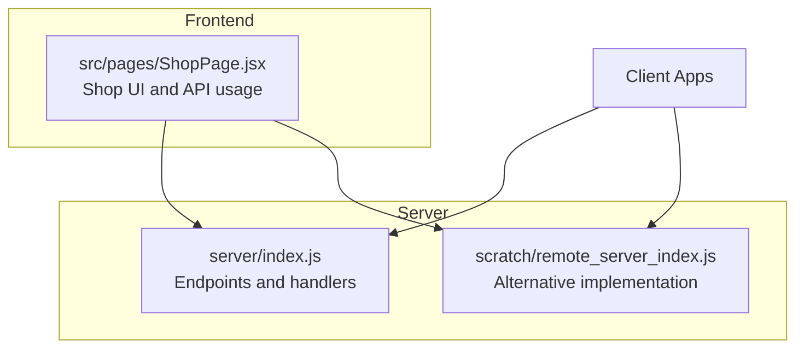
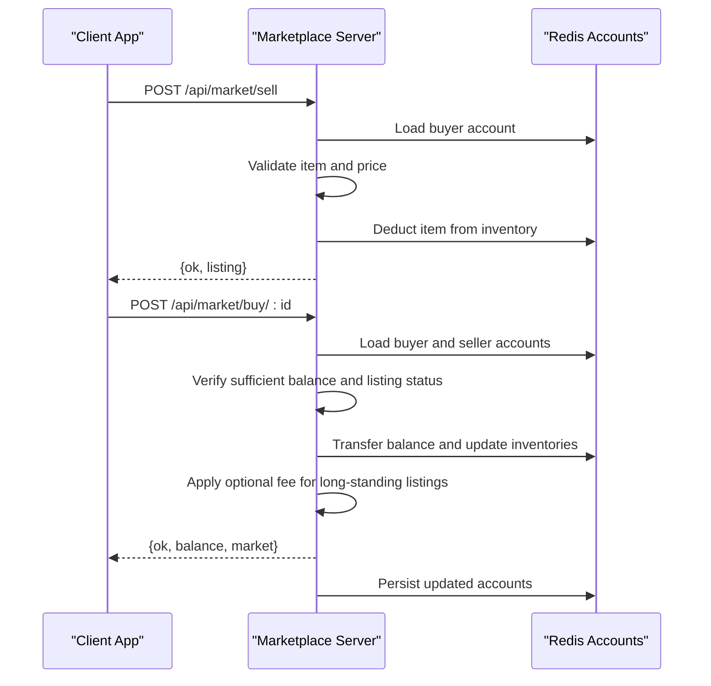
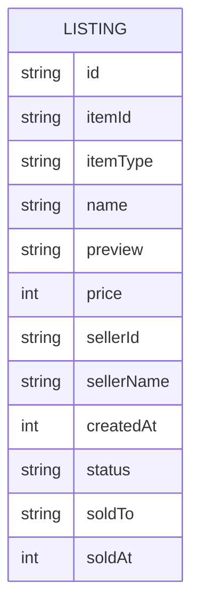
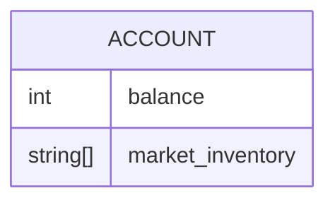
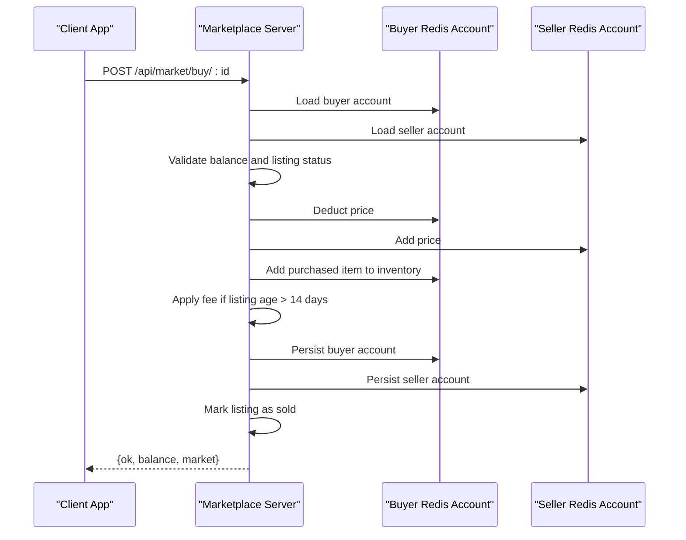
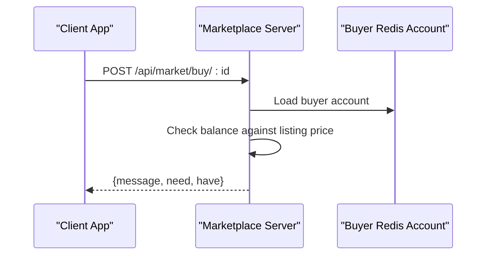
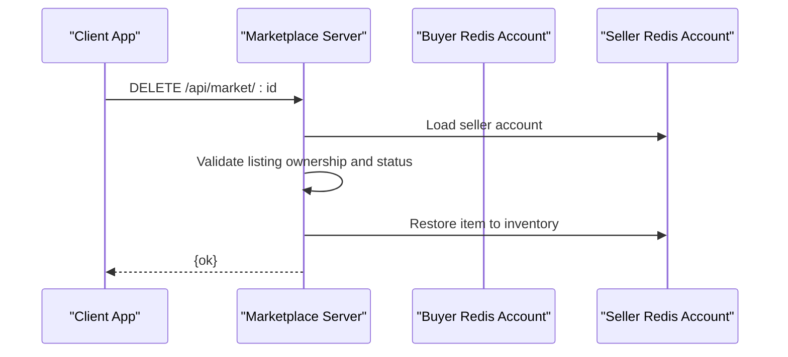
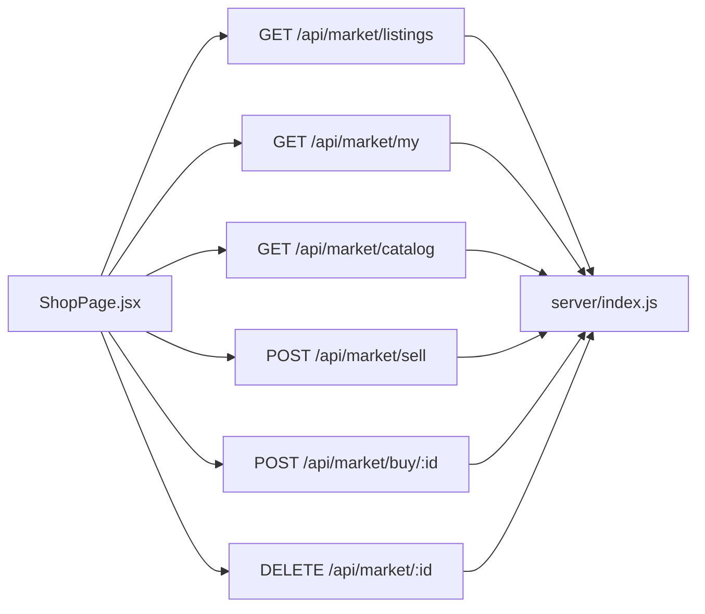

# Marketplace & Trading API

<cite>
**Referenced Files in This Document**
- [server/index.js](file://server/index.js)
- [scratch/remote_server_index.js](file://scratch/remote_server_index.js)
- [src/pages/ShopPage.jsx](file://src/pages/ShopPage.jsx)
</cite>

## Table of Contents
1. [Introduction](#introduction)
2. [Project Structure](#project-structure)
3. [Core Components](#core-components)
4. [Architecture Overview](#architecture-overview)
5. [Detailed Component Analysis](#detailed-component-analysis)
6. [Dependency Analysis](#dependency-analysis)
7. [Performance Considerations](#performance-considerations)
8. [Troubleshooting Guide](#troubleshooting-guide)
9. [Conclusion](#conclusion)

## Introduction
This document provides comprehensive API documentation for the marketplace and trading system endpoints. It covers listing creation, purchase execution, listing management, administrative functions, and supporting infrastructure such as the marketplace catalog, inventory integration, and notifications. It also documents request/response schemas, validation rules, pricing constraints, transaction fees, buyer/seller protections, and integration points with user balances and inventories.

## Project Structure
The marketplace API is implemented in the server-side code and consumed by the frontend shop page. Key areas:
- Server endpoints for marketplace operations
- Market catalog definition and item metadata
- Frontend integration for listing retrieval, selling, buying, and cancellation

**Diagram sources**
- [server/index.js](file://server/index.js)
- [scratch/remote_server_index.js](file://scratch/remote_server_index.js)
- [src/pages/ShopPage.jsx](file://src/pages/ShopPage.jsx)

**Section sources**
- [server/index.js](file://server/index.js)
- [scratch/remote_server_index.js](file://scratch/remote_server_index.js)
- [src/pages/ShopPage.jsx](file://src/pages/ShopPage.jsx)

## Core Components
- Market catalog: Defines available items for sale, including identifiers, types, names, and previews.
- Listings storage: In-memory map keyed by listing ID with fields for item, seller, price, timestamps, and status.
- Authentication middleware: Ensures requests are made by authenticated users for protected endpoints.
- Redis-backed account storage: Stores user balances, inventories, and market inventories.

Key endpoint coverage:
- GET /api/market/listings: Retrieve active listings, optionally filtered by item type.
- GET /api/market/my: Retrieve a user’s own active listings.
- GET /api/market/catalog: Retrieve the marketplace catalog.
- POST /api/market/sell: Create a new listing from a user’s inventory.
- POST /api/market/buy/:id: Purchase a specific active listing.
- DELETE /api/market/:id: Cancel a user’s own active listing.
- POST /api/market/grant: Admin-only endpoint to grant items to users (for testing).

**Section sources**
- [server/index.js](file://server/index.js)
- [scratch/remote_server_index.js](file://scratch/remote_server_index.js)

## Architecture Overview
The marketplace API follows a straightforward request-response model:
- Clients call endpoints to manage listings and execute trades.
- Handlers validate inputs, enforce business rules, update accounts, and persist listing state.
- Notifications are sent to involved parties upon trade completion.

**Diagram sources**
- [server/index.js](file://server/index.js)

## Detailed Component Analysis

### Endpoint Catalog

#### GET /api/market/listings
- Purpose: Fetch active marketplace listings, optionally filtered by item type.
- Query parameters:
  - type: Optional item type filter.
- Response:
  - listings: Array of listing objects with selected fields.

Validation and behavior:
- Filters only active listings.
- Sorts by creation time descending.
- Applies optional type filter.

**Section sources**
- [server/index.js](file://server/index.js)
- [scratch/remote_server_index.js](file://scratch/remote_server_index.js)

#### GET /api/market/my
- Purpose: Fetch the authenticated user’s own active listings.
- Authentication: Required.
- Response:
  - listings: Array of the user’s active listings.

**Section sources**
- [server/index.js](file://server/index.js)
- [scratch/remote_server_index.js](file://scratch/remote_server_index.js)

#### GET /api/market/catalog
- Purpose: Retrieve the marketplace catalog of available items.
- Response:
  - items: Array of item definitions.

**Section sources**
- [server/index.js](file://server/index.js)
- [scratch/remote_server_index.js](file://scratch/remote_server_index.js)

#### POST /api/market/sell
- Purpose: Create a new listing to sell an item from the user’s inventory.
- Authentication: Required.
- Request body:
  - itemId: Identifier of the item to sell.
  - price: Integer price in SBT (between 10 and 100000).
- Validation rules:
  - Item ID must be present and valid.
  - Price must be a finite integer within [10, 100000].
  - User must own the item in their inventory.
  - Item must exist in the marketplace catalog.
  - User must not already have an active listing for the same item.
- Behavior:
  - Removes the item from the user’s inventory.
  - Creates a new active listing with current timestamp.
  - Returns the created listing.

Response:
- ok: Boolean success indicator.
- listing: The created listing object.

**Section sources**
- [server/index.js](file://server/index.js)
- [scratch/remote_server_index.js](file://scratch/remote_server_index.js)

#### POST /api/market/buy/:id
- Purpose: Purchase a specific active listing.
- Authentication: Required.
- Path parameter:
  - id: Listing identifier.
- Validation rules:
  - Listing must exist and be active.
  - Buyer cannot be the seller.
  - Buyer must have sufficient balance.
- Behavior:
  - Deducts listing price from buyer and credits seller.
  - Adds the purchased item to buyer’s inventory.
  - Applies a fee if the listing is older than 14 days:
    - Fee is 5% of the sale price, split between buyer and seller.
  - Marks listing as sold with buyer and timestamp.
  - Notifies the seller via internal messaging channel.
- Response:
  - ok: Boolean success indicator.
  - balance: Updated buyer balance.
  - market: Updated buyer market inventory.

Failure responses:
- Insufficient funds: Returns a message and indicates required vs. available balance.

**Section sources**
- [server/index.js](file://server/index.js)
- [scratch/remote_server_index.js](file://scratch/remote_server_index.js)

#### DELETE /api/market/:id
- Purpose: Cancel a user’s own active listing.
- Authentication: Required.
- Path parameter:
  - id: Listing identifier.
- Validation rules:
  - Listing must exist and be active.
  - Only the listing’s seller can cancel.
- Behavior:
  - Restores the item to the seller’s inventory.
  - Returns success.

**Section sources**
- [server/index.js](file://server/index.js)
- [scratch/remote_server_index.js](file://scratch/remote_server_index.js)

#### POST /api/market/grant
- Purpose: Admin-only endpoint to grant marketplace items to users (for testing).
- Authentication: Required.
- Validation rules:
  - User must own the target item in their inventory.
  - User must not already have an active listing for the same item.
- Behavior:
  - Removes the item from the user’s inventory.
  - Creates a new active listing with current timestamp.
  - Returns the created listing.

**Section sources**
- [server/index.js](file://server/index.js)
- [scratch/remote_server_index.js](file://scratch/remote_server_index.js)

### Data Models

#### Listing Model
- Fields:
  - id: Unique listing identifier.
  - itemId: Item identifier.
  - itemType: Item category/type.
  - name: Item display name.
  - preview: Preview asset reference.
  - price: Sale price in SBT.
  - sellerId: Seller user identifier.
  - sellerName: Seller username.
  - createdAt: Timestamp when listing was created.
  - status: Listing status ("active" or "sold").
  - soldTo: Optional buyer user identifier (when sold).
  - soldAt: Optional timestamp when listing was sold.

**Diagram sources**
- [server/index.js](file://server/index.js)

#### Account Model (relevant fields)
- Fields:
  - balance: User’s SBT balance.
  - market_inventory: Array of item identifiers currently listed for sale.

**Diagram sources**
- [server/index.js](file://server/index.js)

### Transaction Flow: Successful Trade

**Diagram sources**
- [server/index.js](file://server/index.js)

### Transaction Flow: Purchase Failure (Insufficient Funds)

**Diagram sources**
- [server/index.js](file://server/index.js)

### Listing Cancellation Flow

**Diagram sources**
- [server/index.js](file://server/index.js)

## Dependency Analysis
- Endpoints depend on:
  - Authentication middleware for protected routes.
  - Market catalog for item metadata.
  - In-memory listings map for listing state.
  - Redis-backed account storage for balances and inventories.
- Frontend integration:
  - Shop page fetches listings and catalog.
  - Shop page triggers sell, buy, and cancel actions.

**Diagram sources**
- [src/pages/ShopPage.jsx](file://src/pages/ShopPage.jsx)
- [server/index.js](file://server/index.js)

**Section sources**
- [src/pages/ShopPage.jsx](file://src/pages/ShopPage.jsx)
- [server/index.js](file://server/index.js)

## Performance Considerations
- Listings retrieval sorts by creation time; filtering by type reduces payload size.
- In-memory listings map provides O(1) lookup but is not persisted; consider persistence for production.
- Redis operations are asynchronous; ensure connection reliability and timeouts.
- Fee calculation is constant-time and applied conditionally.

## Troubleshooting Guide
Common failure scenarios and resolutions:
- Listing not found:
  - Ensure the listing exists and is active.
- Already listed:
  - User cannot create multiple active listings for the same item.
- Insufficient balance:
  - Increase balance or choose a cheaper listing.
- Cannot buy own listing:
  - Choose another listing.
- Listing already sold:
  - Refresh listings to see updated status.
- Account not found:
  - Re-authenticate or verify account existence.

Operational checks:
- Verify authentication tokens for protected endpoints.
- Confirm Redis connectivity for account updates.
- Validate item presence in the marketplace catalog.

**Section sources**
- [server/index.js](file://server/index.js)

## Conclusion
The marketplace and trading API provides a robust foundation for peer-to-peer sales with strong validation, clear fee policies for long-standing listings, and integrated inventory and balance management. The frontend integrates seamlessly with these endpoints to support listing creation, browsing, purchasing, and cancellation. Extending the system with persistent storage, richer notifications, and dispute resolution would further enhance trust and reliability.