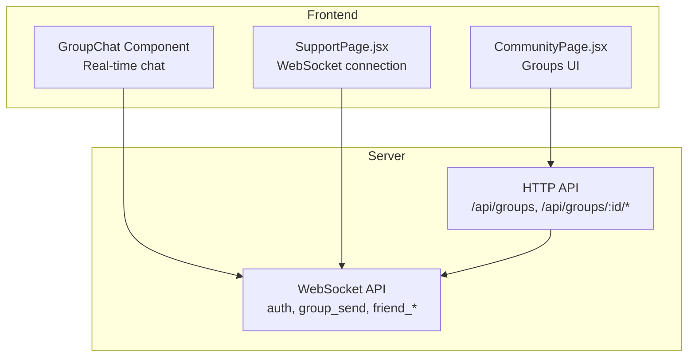
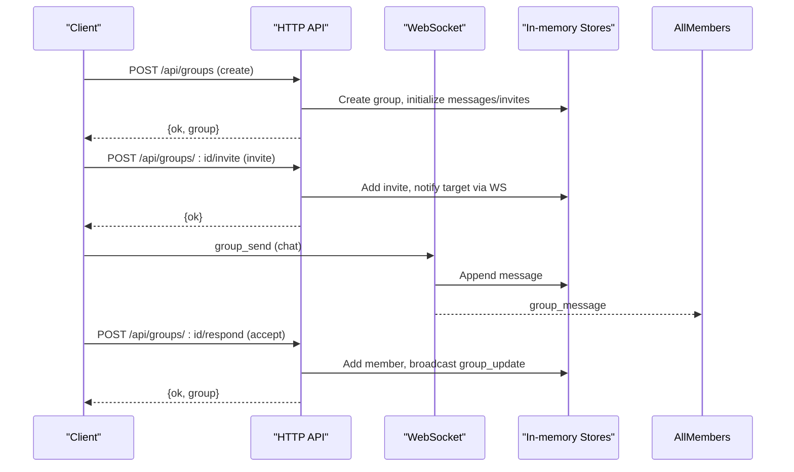
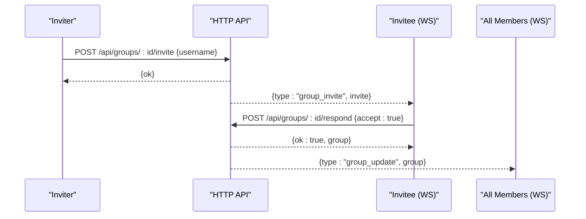
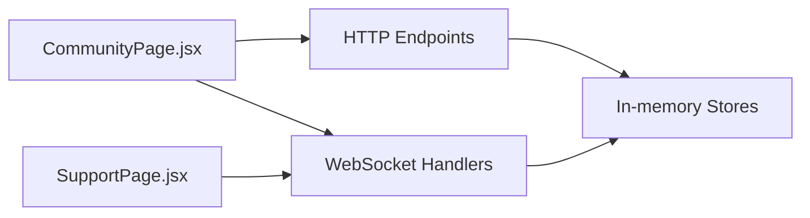

# Social Features & Group Management API

<cite>
**Referenced Files in This Document**
- [server_index.js](file://server_index.js)
- [index.js](file://server/index.js)
- [CommunityPage.jsx](file://src/pages/CommunityPage.jsx)
- [SupportPage.jsx](file://src/pages/SupportPage.jsx)
</cite>

## Table of Contents
1. [Introduction](#introduction)
2. [Project Structure](#project-structure)
3. [Core Components](#core-components)
4. [Architecture Overview](#architecture-overview)
5. [Detailed Component Analysis](#detailed-component-analysis)
6. [Dependency Analysis](#dependency-analysis)
7. [Performance Considerations](#performance-considerations)
8. [Troubleshooting Guide](#troubleshooting-guide)
9. [Conclusion](#conclusion)

## Introduction
This document provides comprehensive API documentation for the social networking and group management features of the platform. It covers:
- Group lifecycle: creation, member management, and dissolution
- Group messaging with real-time updates via WebSocket
- Friend system: friend requests, acceptance/rejection, and direct messaging
- Invitation system, membership limits, and ownership transfer
- Request/response schemas, validation rules, and operational workflows
- Integration with WebSocket notifications and real-time updates

## Project Structure
The social and group features span backend HTTP endpoints and WebSocket handlers, with frontend components consuming these APIs and rendering real-time updates.

**Diagram sources**
- [server_index.js](file://server_index.js)
- [index.js](file://server/index.js)
- [CommunityPage.jsx](file://src/pages/CommunityPage.jsx)
- [SupportPage.jsx](file://src/pages/SupportPage.jsx)

**Section sources**
- [server_index.js](file://server_index.js)
- [index.js](file://server/index.js)
- [CommunityPage.jsx](file://src/pages/CommunityPage.jsx)
- [SupportPage.jsx](file://src/pages/SupportPage.jsx)

## Core Components
- Group management endpoints: GET /api/groups, POST /api/groups, POST /api/groups/:id/invite, POST /api/groups/:id/respond, POST /api/groups/:id/leave, GET /api/groups/:id/messages, GET /api/groups/invites
- Group messaging: WebSocket "group_send" with real-time broadcast to members
- Friend system: WebSocket "friend_request_send", "friend_request_respond", and related events
- Real-time notifications: WebSocket events for group_invite, group_update, group_message, friend_request_received, friend_accepted, friend_error

**Section sources**
- [server_index.js](file://server_index.js)
- [index.js](file://server/index.js)

## Architecture Overview
The system combines REST endpoints for CRUD-like operations with a WebSocket channel for real-time social features. Authentication is enforced via JWT for HTTP endpoints and WebSocket "auth".

**Diagram sources**
- [server_index.js](file://server_index.js)
- [index.js](file://server/index.js)

## Detailed Component Analysis

### Group Management Endpoints

#### GET /api/groups
- Purpose: List groups the authenticated user belongs to
- Auth: Required
- Response: Array of groups with id, name, ownerId, members, createdAt

Validation rules:
- Returns only groups where the user is a member

**Section sources**
- [server_index.js](file://server_index.js)
- [index.js](file://server/index.js)

#### POST /api/groups
- Purpose: Create a new group owned by the authenticated user
- Auth: Required
- Request body:
  - name: string (2–40 characters)
- Response: { ok: true, group: { id, name, ownerId, members, createdAt } }

Validation rules:
- Name length validated (2–40)
- Initial member list contains only the creator

**Section sources**
- [server_index.js](file://server_index.js)
- [index.js](file://server/index.js)

#### POST /api/groups/:id/invite
- Purpose: Invite a user by username to join the group
- Auth: Required
- Path params:
  - id: string (group identifier)
- Request body:
  - username: string (invitee’s username)
- Response: { ok: true }

Validation rules:
- Caller must be a group member
- Group must not exceed max members (8)
- Invitee must exist and not be current member or already invited
- On success, target receives WebSocket "group_invite" event

Membership limit:
- Max 8 players per group enforced

**Section sources**
- [server_index.js](file://server_index.js)
- [index.js](file://server/index.js)

#### POST /api/groups/:id/respond
- Purpose: Accept or reject a pending group invitation
- Auth: Required
- Path params:
  - id: string (group identifier)
- Request body:
  - accept: boolean
- Response: { ok: true, group: { id, name, ownerId, members, createdAt } }

Behavior:
- Removes the user's pending invites for this group
- If accepted and group has space (< 8), adds user to members
- Broadcasts "group_update" to all group members

**Section sources**
- [server_index.js](file://server_index.js)
- [index.js](file://server/index.js)

#### POST /api/groups/:id/leave
- Purpose: Leave a group
- Auth: Required
- Path params:
  - id: string (group identifier)
- Response: { ok: true }

Behavior:
- Removes caller from group members
- If group becomes empty, deletes group, messages, and invites
- If leaving user is owner, transfers ownership to the first remaining member and broadcasts "group_update"

**Section sources**
- [server_index.js](file://server_index.js)
- [index.js](file://server/index.js)

#### GET /api/groups/:id/messages
- Purpose: Fetch recent group messages
- Auth: Required
- Path params:
  - id: string (group identifier)
- Response: { messages: array of message objects }

Access control:
- Caller must be a group member

Message history:
- Returns up to 100 most recent messages

**Section sources**
- [server_index.js](file://server_index.js)
- [index.js](file://server/index.js)

#### GET /api/groups/invites
- Purpose: List invitations sent to the authenticated user
- Auth: Required
- Response: { invites: array of invite objects }

Each invite includes:
- fromId, fromUsername, groupId, groupName, time

**Section sources**
- [server_index.js](file://server_index.js)
- [index.js](file://server/index.js)

### Group Messaging System

#### WebSocket: "group_send"
- Message type: "group_send"
- Payload:
  - groupId: string
  - text: string (1–1000 chars)
- Behavior:
  - Validates group membership and non-empty text
  - Appends message to group history (max 200)
  - Broadcasts "group_message" to all group members

Real-time updates:
- Clients receive "group_message" with message details
- Frontend renders messages and scrolls to latest

**Section sources**
- [server_index.js](file://server_index.js)
- [index.js](file://server/index.js)
- [CommunityPage.jsx](file://src/pages/CommunityPage.jsx)

### Friend System

#### WebSocket: "friend_request_send"
- Message type: "friend_request_send"
- Payload:
  - toUsername: string
- Behavior:
  - Validates existence, self-addition, and duplicate requests
  - Creates pending request and notifies target via "friend_request_received"
  - Sender receives "friend_request_sent"

#### WebSocket: "friend_request_respond"
- Message type: "friend_request_respond"
- Payload:
  - fromId: string
  - accept: boolean
- Behavior:
  - Removes the specific pending request
  - If accepted, establishes bidirectional friendship and sends "friend_accepted" to the other user
  - Both users receive updated "friends_list" and remaining "friend_requests"

Direct messaging (DM):
- WebSocket "dm_send" supports private messages between friends
- DM storage retains last 200 messages per conversation

**Section sources**
- [server_index.js](file://server_index.js)
- [index.js](file://server/index.js)
- [CommunityPage.jsx](file://src/pages/CommunityPage.jsx)

### Request/Response Schemas

Group creation (POST /api/groups):
- Request: { name: string }
- Response: { ok: true, group: { id, name, ownerId, members[], createdAt } }

Invite (POST /api/groups/:id/invite):
- Request: { username: string }
- Response: { ok: true }

Invite response (POST /api/groups/:id/respond):
- Request: { accept: boolean }
- Response: { ok: true, group: { id, name, ownerId, members[], createdAt } }

Leave (POST /api/groups/:id/leave):
- Request: none
- Response: { ok: true }

Messages (GET /api/groups/:id/messages):
- Request: none
- Response: { messages: [{ id, fromId, fromUsername, text, time }] }

Invites (GET /api/groups/invites):
- Request: none
- Response: { invites: [{ fromId, fromUsername, groupId, groupName, time }] }

Friend request (WebSocket):
- Outgoing: { type: "friend_request_send", toUsername }
- Incoming: "friend_request_received", "friend_request_sent", "friend_error"
- Response: { type: "friend_requests", requests: [...] } or { type: "friends_list", friends: [...] }

Group message (WebSocket):
- Outgoing: { type: "group_send", groupId, text }
- Incoming: "group_message", "group_update"

**Section sources**
- [server_index.js](file://server_index.js)
- [index.js](file://server/index.js)
- [CommunityPage.jsx](file://src/pages/CommunityPage.jsx)

### Validation Rules and Membership Restrictions
- Group name: 2–40 characters
- Membership cap: 8 players per group
- Ownership transfer: when owner leaves, ownership passes to the first remaining member
- Access control: group endpoints require membership; messages endpoint requires membership
- Duplicate invites: prevented per group/user combination
- Friend system: self-friendship and duplicates blocked

**Section sources**
- [server_index.js](file://server_index.js)
- [index.js](file://server/index.js)

### Real-Time Updates and WebSocket Integration
- Authentication: WebSocket "auth" with JWT token
- Online users: periodic broadcast of online user lists
- Notifications:
  - "group_invite" for incoming invites
  - "group_update" for membership changes
  - "group_message" for chat messages
  - "friend_request_received", "friend_accepted", "friend_error"
- Frontend integration:
  - CommunityPage.jsx handles friend and group-related WebSocket events
  - SupportPage.jsx manages persistent WebSocket connections with reconnection logic

**Section sources**
- [server_index.js](file://server_index.js)
- [index.js](file://server/index.js)
- [CommunityPage.jsx](file://src/pages/CommunityPage.jsx)
- [SupportPage.jsx](file://src/pages/SupportPage.jsx)

### Example Workflows

#### Successful Group Creation
- Client calls POST /api/groups with { name }
- Server responds with { ok: true, group }

**Section sources**
- [server_index.js](file://server_index.js)
- [index.js](file://server/index.js)

#### Invitation Acceptance Workflow
- Inviter calls POST /api/groups/:id/invite with { username }
- Invitee receives "group_invite" via WebSocket
- Invitee calls POST /api/groups/:id/respond with { accept: true }
- Server broadcasts "group_update" to all members
- Invitee receives { ok: true, group }

**Diagram sources**
- [server_index.js](file://server_index.js)
- [index.js](file://server/index.js)

#### Group Dissolution Scenario
- Last member leaves via POST /api/groups/:id/leave
- Server deletes group, messages, and invites
- No further group operations are possible

**Section sources**
- [server_index.js](file://server_index.js)
- [index.js](file://server/index.js)

#### Real-Time Group Chat
- Member sends WebSocket "group_send" with { groupId, text }
- Server validates and appends message
- All members receive "group_message" with message details

**Section sources**
- [server_index.js](file://server_index.js)
- [index.js](file://server/index.js)
- [CommunityPage.jsx](file://src/pages/CommunityPage.jsx)

## Dependency Analysis
- HTTP endpoints depend on in-memory stores for groups, messages, and invites
- WebSocket handlers coordinate with HTTP endpoints for authentication and real-time broadcasting
- Frontend components subscribe to WebSocket events and call HTTP endpoints for CRUD operations

**Diagram sources**
- [server_index.js](file://server_index.js)
- [index.js](file://server/index.js)
- [CommunityPage.jsx](file://src/pages/CommunityPage.jsx)
- [SupportPage.jsx](file://src/pages/SupportPage.jsx)

**Section sources**
- [server_index.js](file://server_index.js)
- [index.js](file://server/index.js)
- [CommunityPage.jsx](file://src/pages/CommunityPage.jsx)
- [SupportPage.jsx](file://src/pages/SupportPage.jsx)

## Performance Considerations
- Message retention limits:
  - Group messages capped at 200 per group
  - Recent messages endpoint returns last 100 messages
- WebSocket rate limiting:
  - Messages per minute and time window configured to prevent spam
- Memory footprint:
  - Groups, messages, and invites stored in memory; consider persistence for production deployments

[No sources needed since this section provides general guidance]

## Troubleshooting Guide
Common errors and resolutions:
- Authentication failures:
  - Ensure JWT token is provided in WebSocket "auth" message
- Authorization errors:
  - Group invite requires membership; check group membership before inviting
- Validation errors:
  - Group name must be 2–40 characters
  - Membership cap is 8 players; cannot accept if full
- Access denied:
  - Messages endpoint requires membership; ensure user belongs to group
- WebSocket connectivity:
  - Reconnect logic exists; verify token validity and network stability

**Section sources**
- [server_index.js](file://server_index.js)
- [index.js](file://server/index.js)
- [SupportPage.jsx](file://src/pages/SupportPage.jsx)

## Conclusion
The social and group management system provides a robust foundation for community-driven gameplay with:
- Clear group lifecycle management
- Real-time messaging and notifications
- Friend system with request/response workflows
- Strong validation and access controls
- Seamless WebSocket integration for live updates

Future enhancements could include persistent storage, richer moderation tools, and expanded group customization options.