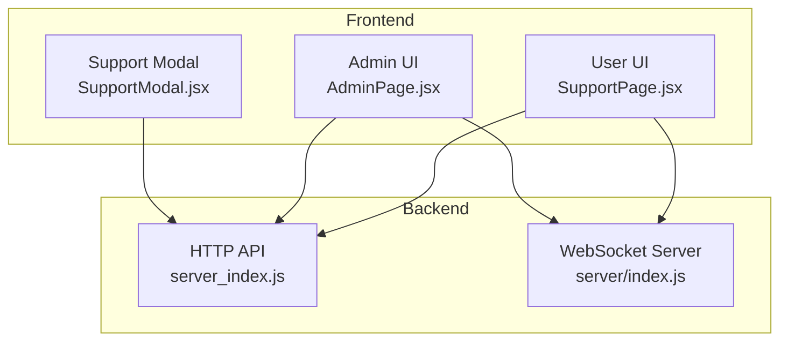
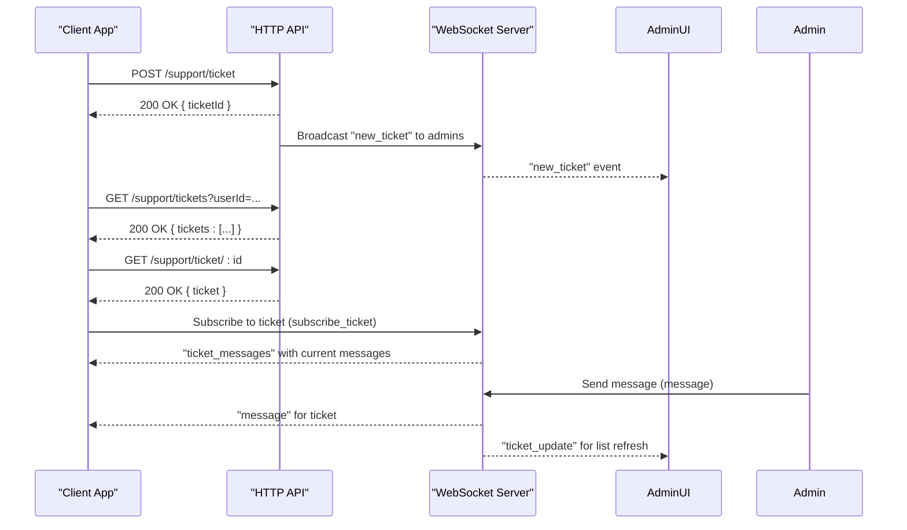
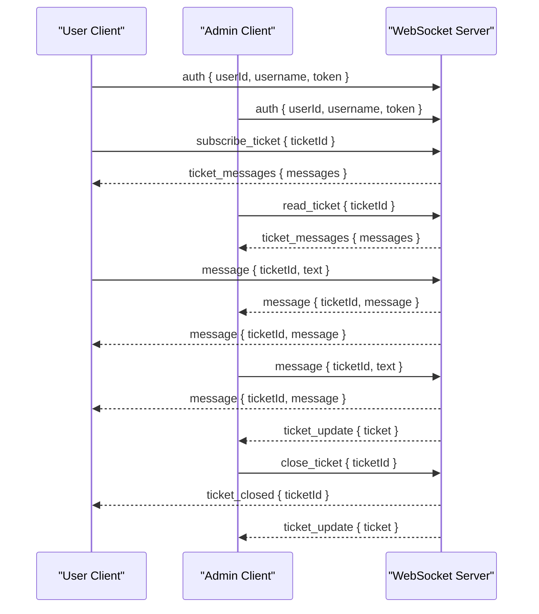
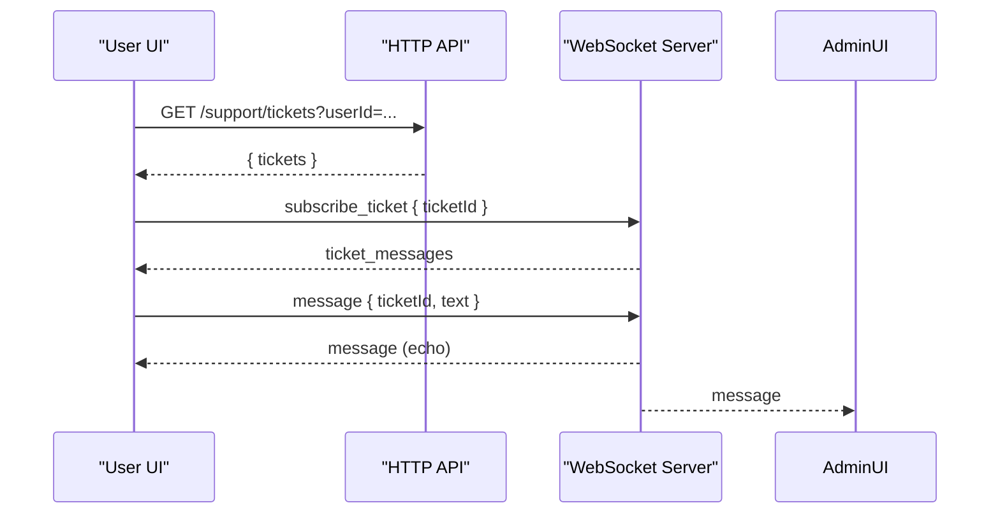
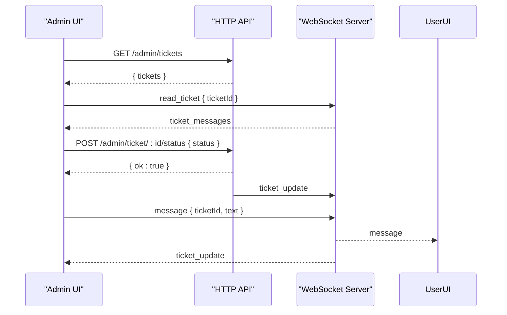
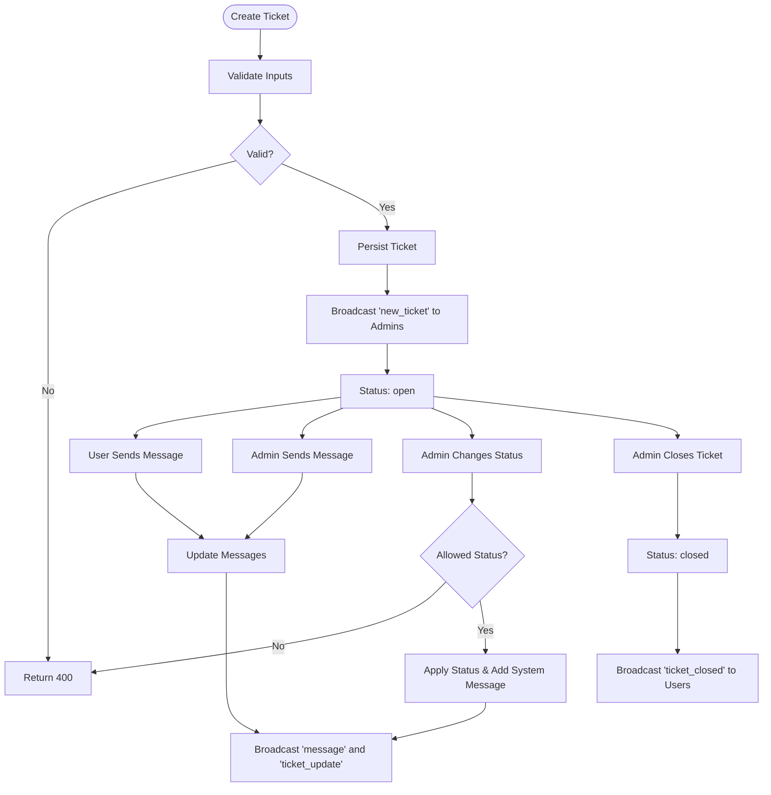
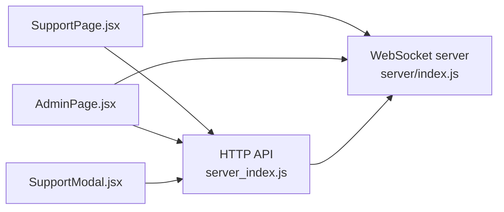

# Support Ticket System API

<cite>
**Referenced Files in This Document**
- [server_index.js](file://server_index.js)
- [server/index.js](file://server/index.js)
- [SupportPage.jsx](file://src/pages/SupportPage.jsx)
- [SupportModal.jsx](file://src/pages/SupportModal.jsx)
- [SupportPage.jsx](file://website/src/pages/AdminPage.jsx)
- [SupportPage.jsx](file://website/src/pages/SupportPage.jsx)
</cite>

## Table of Contents
1. [Introduction](#introduction)
2. [Project Structure](#project-structure)
3. [Core Components](#core-components)
4. [Architecture Overview](#architecture-overview)
5. [Detailed Component Analysis](#detailed-component-analysis)
6. [Dependency Analysis](#dependency-analysis)
7. [Performance Considerations](#performance-considerations)
8. [Troubleshooting Guide](#troubleshooting-guide)
9. [Privacy and Retention Policies](#privacy-and-retention-policies)
10. [Conclusion](#conclusion)

## Introduction
This document provides comprehensive API documentation for the support ticket system. It covers:
- Public endpoints for users to create tickets, list tickets, and retrieve individual tickets
- Administrative endpoints for managing tickets, updating statuses, and closing tickets
- Real-time communication via WebSocket for admin alerts, ticket assignment, and live chat
- Request/response schemas, validation rules, and message threading
- Ticket categorization, status transitions, and administrative controls
- Privacy considerations and data retention practices

## Project Structure
The support system spans frontend React components and backend server logic:
- Frontend user/admin UIs and WebSocket clients
- Backend HTTP endpoints for ticket CRUD and admin management
- WebSocket server for real-time messaging and admin notifications

**Diagram sources**
- [server_index.js](file://server_index.js)
- [server/index.js](file://server/index.js)
- [SupportPage.jsx](file://src/pages/SupportPage.jsx)
- [SupportModal.jsx](file://src/pages/SupportModal.jsx)
- [SupportPage.jsx](file://website/src/pages/AdminPage.jsx)

**Section sources**
- [server_index.js](file://server_index.js)
- [server/index.js](file://server/index.js)
- [SupportPage.jsx](file://src/pages/SupportPage.jsx)
- [SupportModal.jsx](file://src/pages/SupportModal.jsx)
- [SupportPage.jsx](file://website/src/pages/AdminPage.jsx)
- [SupportPage.jsx](file://website/src/pages/SupportPage.jsx)

## Core Components
- HTTP API: Provides ticket lifecycle endpoints and admin management
- WebSocket: Enables real-time updates for new tickets, status changes, messages, and closures
- Frontend UIs: User and admin panels for ticket creation, listing, viewing, and messaging

Key responsibilities:
- Validate and sanitize inputs for ticket creation
- Enforce status transitions and broadcast updates
- Manage message threading per ticket
- Notify admins and users via WebSocket

**Section sources**
- [server_index.js](file://server_index.js)
- [server/index.js](file://server/index.js)
- [SupportPage.jsx](file://src/pages/SupportPage.jsx)
- [SupportModal.jsx](file://src/pages/SupportModal.jsx)
- [SupportPage.jsx](file://website/src/pages/AdminPage.jsx)
- [SupportPage.jsx](file://website/src/pages/SupportPage.jsx)

## Architecture Overview
The system integrates HTTP and WebSocket layers:
- HTTP endpoints handle REST requests for tickets and admin actions
- WebSocket maintains persistent connections for real-time updates
- Admin roles are enforced via bearer tokens and pre-configured identifiers

**Diagram sources**
- [server_index.js](file://server_index.js)
- [server/index.js](file://server/index.js)
- [SupportPage.jsx](file://src/pages/SupportPage.jsx)
- [SupportPage.jsx](file://website/src/pages/AdminPage.jsx)

## Detailed Component Analysis

### Public API Endpoints

#### Create Ticket
- Method: POST
- Path: /support/ticket
- Description: Creates a new support ticket with category, user identity, and initial message
- Authentication: None (public endpoint)
- Validation rules:
  - Category required (<= 80 chars)
  - Message required (<= 2000 chars), minimum length 5
  - Username sanitized (<= 32 chars), default "Player"
  - User ID sanitized (<= 64 chars), default "anon"
- Response: 200 OK with { ticketId }
- Errors: 400 Bad Request on validation failure

Request schema
- category: string (required)
- message: string (required)
- username: string (optional)
- userId: string (optional)

Response schema
- ticketId: number

Example successful request
- POST /support/ticket
- Headers: Content-Type: application/json
- Body: { "userId": "abc123", "username": "AlexK", "category": "Technical issue", "message": "Game crashes on startup" }
- Response: { "ticketId": 12345 }

Example validation error
- POST /support/ticket
- Body: { "category": "", "message": "Hi" }
- Response: { "message": "Fill in all fields (minimum 5 characters)" }

**Section sources**
- [server_index.js](file://server_index.js)
- [server/index.js](file://server/index.js)

#### List Tickets
- Method: GET
- Path: /support/tickets
- Query parameters:
  - userId: optional filter by user ID
- Description: Returns paginated or filtered ticket summaries
- Response: 200 OK with { tickets: [ { id, category, username, status, createdAt, preview, unread } ] }
- Sorting: Descending by createdAt

Example request
- GET /support/tickets?userId=abc123

Example response
- 200 OK
- Body: { "tickets": [ { "id": 12345, "category": "Tech", "username": "AlexK", "status": "open", "createdAt": 1710000000000, "preview": "Help...", "unread": 0 } ] }

**Section sources**
- [server_index.js](file://server_index.js)
- [server/index.js](file://server/index.js)

#### Get Ticket Details
- Method: GET
- Path: /support/ticket/:id
- Description: Retrieves full ticket details by ID
- Response: 200 OK with full ticket object
- Errors: 404 Not Found if ticket does not exist

Example request
- GET /support/ticket/12345

Example response
- 200 OK
- Body: { "id": 12345, "userId": "abc123", "username": "AlexK", "category": "Tech", "status": "open", "createdAt": 1710000000000, "preview": "Help...", "messages": [ { "id": "...", "from": "system", "text": "...", "time": 1710000000000 }, { "id": "...", "from": "abc123", "username": "AlexK", "text": "Help...", "time": 1710000000000 } ] }

**Section sources**
- [server_index.js](file://server_index.js)
- [server/index.js](file://server/index.js)

### Administrative API Endpoints

#### Set Ticket Status
- Method: POST
- Path: /admin/ticket/:id/status
- Description: Updates ticket status; broadcasts updates to admins and users
- Authentication: Bearer token required; admin role enforced
- Allowed statuses: open, in_progress, answered, closed
- Response: 200 OK { ok: true }

Validation and errors:
- 401 Unauthorized if invalid/missing token
- 400 Bad Request if status not allowed
- 404 Not Found if ticket missing

Behavior:
- Adds a system message indicating status change
- Broadcasts "ticket_update" to admins and users
- On close, broadcasts "ticket_closed"

**Section sources**
- [server_index.js](file://server_index.js)
- [server/index.js](file://server/index.js)

#### Close Ticket
- Method: POST
- Path: /admin/ticket/:id/close
- Description: Convenience endpoint to set status to closed
- Authentication: Bearer token required; admin role enforced
- Response: 200 OK { ok: true }

**Section sources**
- [server_index.js](file://server_index.js)
- [server/index.js](file://server/index.js)

#### Admin Ticket Listing
- Method: GET
- Path: /admin/tickets
- Description: Lists all tickets with additional fields for admin panel
- Response: 200 OK { tickets: [ { id, category, username, status, createdAt, preview, unread, userId } ] }

**Section sources**
- [server_index.js](file://server_index.js)
- [server/index.js](file://server/index.js)

### WebSocket Protocol

#### Connection and Authentication
- Clients connect to WS endpoint and send an auth message containing user identity and token
- Admins receive "admin_ready" to trigger loading of tickets

#### Client-Sent Messages
- subscribe_ticket: Subscribe to a specific ticket’s live updates
- message: Send a message to a ticket (from user or admin)
- read_ticket: Mark ticket as read (resets unread count)

#### Server-Sent Messages
- new_ticket: New ticket created; sent to admins
- ticket_update: Ticket metadata changed; sent to admins and users
- ticket_closed: Ticket closed; sent to users
- ticket_messages: Initial batch of messages for a subscribed ticket
- message: New message received for the subscribed ticket

**Diagram sources**
- [server/index.js](file://server/index.js)
- [SupportPage.jsx](file://src/pages/SupportPage.jsx)
- [SupportPage.jsx](file://website/src/pages/AdminPage.jsx)

**Section sources**
- [server/index.js](file://server/index.js)
- [SupportPage.jsx](file://src/pages/SupportPage.jsx)
- [SupportPage.jsx](file://website/src/pages/AdminPage.jsx)

### Frontend Integration

#### User Panel
- Loads tickets via HTTP GET /support/tickets?userId=...
- Subscribes to ticket updates via WebSocket subscribe_ticket
- Sends messages via WebSocket message
- Receives real-time updates for new messages and status changes

**Diagram sources**
- [SupportPage.jsx](file://src/pages/SupportPage.jsx)
- [server_index.js](file://server_index.js)
- [server/index.js](file://server/index.js)

**Section sources**
- [SupportPage.jsx](file://src/pages/SupportPage.jsx)
- [SupportPage.jsx](file://website/src/pages/SupportPage.jsx)

#### Admin Panel
- Loads tickets via HTTP GET /admin/tickets
- Subscribes to ticket messages via WebSocket read_ticket
- Updates status via HTTP POST /admin/ticket/:id/status
- Closes tickets via HTTP POST /admin/ticket/:id/close
- Sends messages via WebSocket message

**Diagram sources**
- [SupportPage.jsx](file://website/src/pages/AdminPage.jsx)
- [server_index.js](file://server_index.js)
- [server/index.js](file://server/index.js)

**Section sources**
- [SupportPage.jsx](file://website/src/pages/AdminPage.jsx)
- [SupportPage.jsx](file://website/src/pages/SupportPage.jsx)

### Ticket Lifecycle Management

**Diagram sources**
- [server_index.js](file://server_index.js)
- [server/index.js](file://server/index.js)

**Section sources**
- [server_index.js](file://server_index.js)
- [server/index.js](file://server/index.js)

## Dependency Analysis

**Diagram sources**
- [server_index.js](file://server_index.js)
- [server/index.js](file://server/index.js)
- [SupportPage.jsx](file://src/pages/SupportPage.jsx)
- [SupportModal.jsx](file://src/pages/SupportModal.jsx)
- [SupportPage.jsx](file://website/src/pages/AdminPage.jsx)

**Section sources**
- [server_index.js](file://server_index.js)
- [server/index.js](file://server/index.js)
- [SupportPage.jsx](file://src/pages/SupportPage.jsx)
- [SupportModal.jsx](file://src/pages/SupportModal.jsx)
- [SupportPage.jsx](file://website/src/pages/AdminPage.jsx)

## Performance Considerations
- WebSocket batching: Group updates to reduce network overhead
- Pagination: Use query filters (e.g., userId) to limit ticket lists
- Message deduplication: Clients should avoid appending duplicate messages
- Rate limiting: Consider throttling message sends to prevent spam
- Memory: Limit stored messages per ticket to prevent unbounded growth

## Troubleshooting Guide
Common issues and resolutions:
- 400 Bad Request on ticket creation:
  - Ensure category and message meet length requirements
  - Verify inputs are properly sanitized
- 401 Unauthorized for admin endpoints:
  - Confirm Bearer token is present and valid
  - Ensure admin role is configured for the user
- WebSocket connection failures:
  - Verify authentication message is sent immediately after connect
  - Check subscribe_ticket after receiving admin_ready or after loading tickets
- Missing real-time updates:
  - Confirm subscription to the correct ticketId
  - Ensure the ticket exists and is accessible

**Section sources**
- [server_index.js](file://server_index.js)
- [server/index.js](file://server/index.js)
- [SupportPage.jsx](file://src/pages/SupportPage.jsx)
- [SupportPage.jsx](file://website/src/pages/AdminPage.jsx)

## Privacy and Retention Policies
- Data minimization: Only collect necessary fields (userId, username, category, message)
- Sanitization: Inputs are sanitized to prevent injection and enforce length limits
- Access control: Admin endpoints require bearer token verification
- Retention: No explicit retention policy is defined in the codebase; consider implementing data retention and deletion policies aligned with local regulations

[No sources needed since this section provides general guidance]

## Conclusion
The support ticket system provides a robust foundation for user-to-admin communication with real-time updates. Administrators can efficiently manage tickets, update statuses, and resolve issues. The documented endpoints, schemas, and workflows enable consistent integrations and reliable operations.