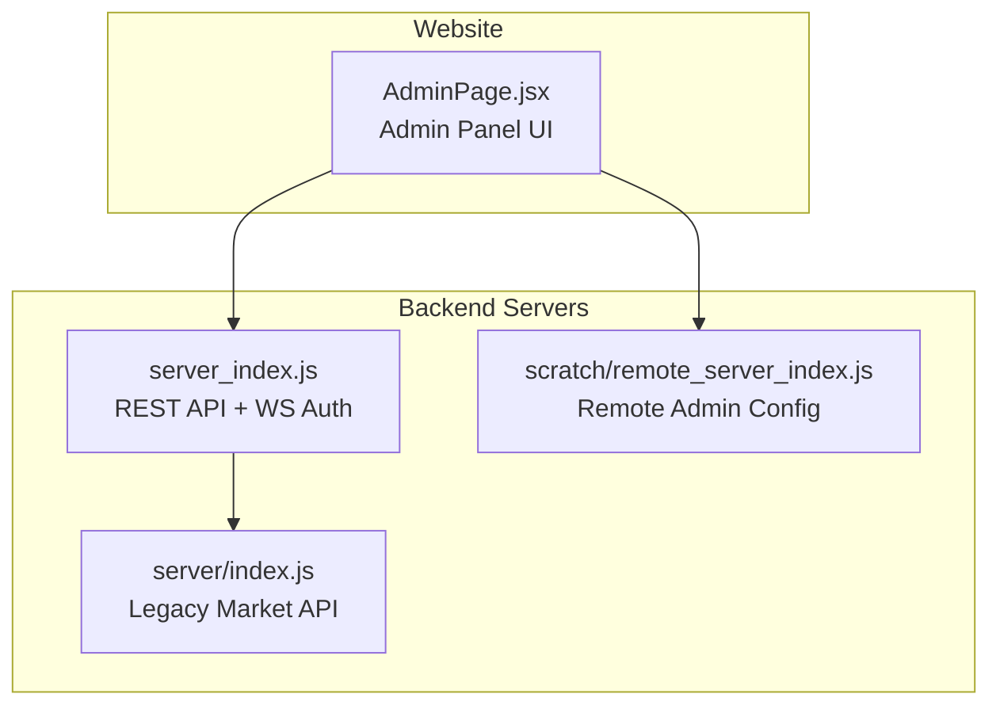
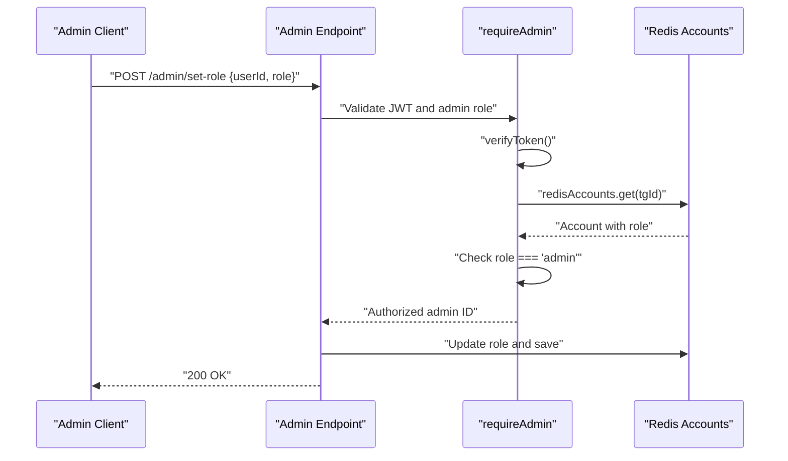
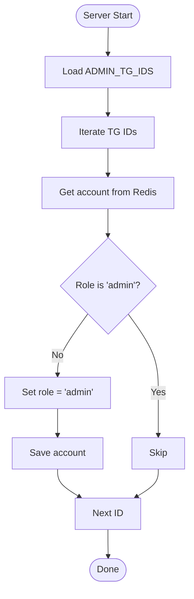
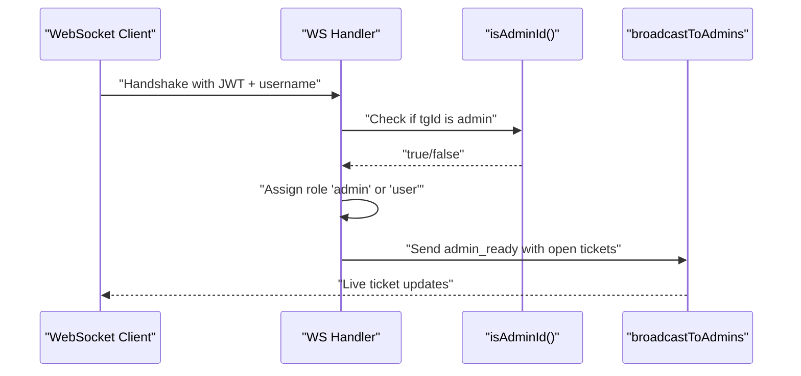
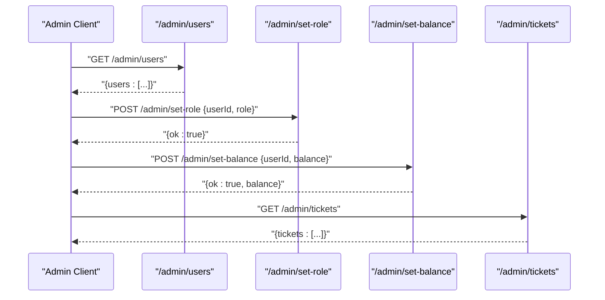
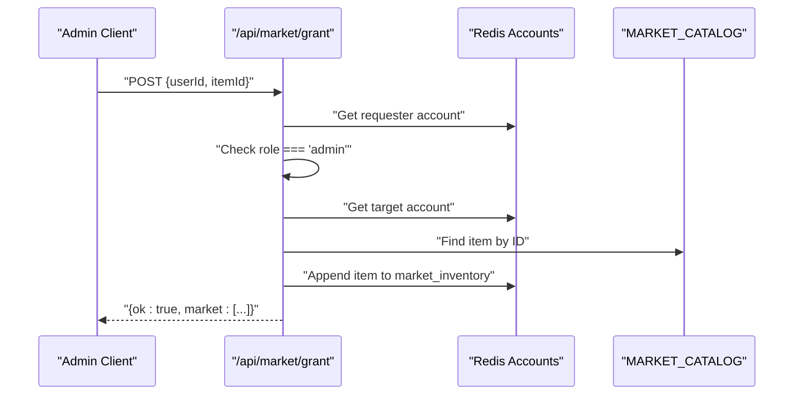
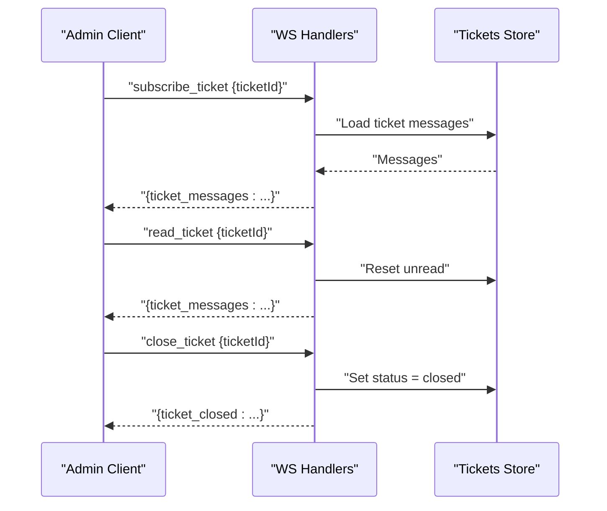
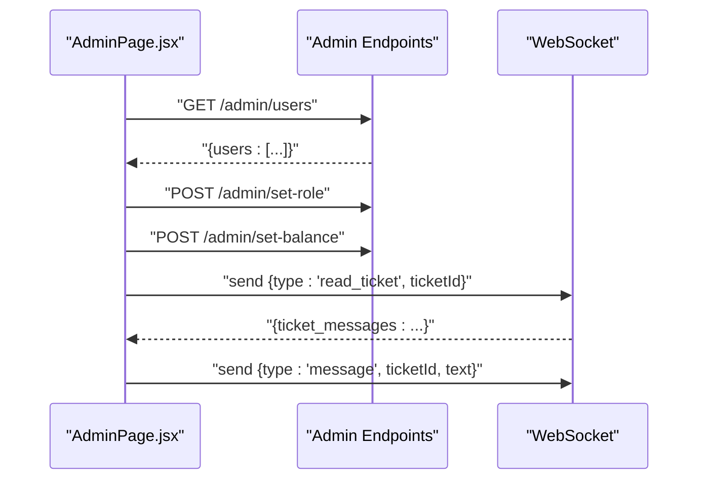
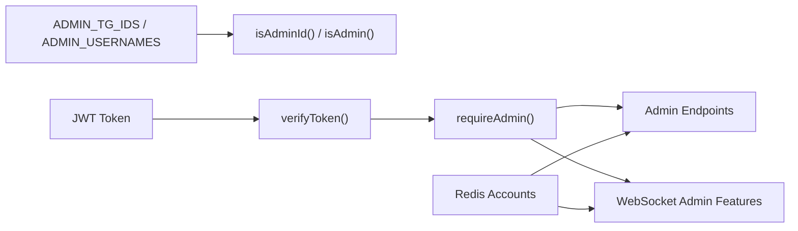

# Admin System & Role-Based Access Control

<cite>
**Referenced Files in This Document**
- [server_index.js](file://server_index.js)
- [remote_server_index.js](file://scratch/remote_server_index.js)
- [AdminPage.jsx](file://website/src/pages/AdminPage.jsx)
- [server/index.js](file://server/index.js)
</cite>

## Table of Contents
1. [Introduction](#introduction)
2. [Project Structure](#project-structure)
3. [Core Components](#core-components)
4. [Architecture Overview](#architecture-overview)
5. [Detailed Component Analysis](#detailed-component-analysis)
6. [Dependency Analysis](#dependency-analysis)
7. [Performance Considerations](#performance-considerations)
8. [Troubleshooting Guide](#troubleshooting-guide)
9. [Conclusion](#conclusion)

## Introduction
This document explains the admin system and role-based access control (RBAC) implementation in the SBGames platform. It covers admin user detection via configuration arrays, role assignment during account creation, admin-only endpoints, and the WebSocket-based admin authentication flow. It also documents admin privileges such as marketplace item granting, ticket management access, and administrative commands, along with security implications and safe administration practices.

## Project Structure
The admin system spans three primary areas:
- Backend server with admin endpoints and WebSocket authentication
- Website admin panel for managing users, tickets, and balances
- Remote server script with admin configuration and enforcement

**Diagram sources**
- [server_index.js](file://server_index.js)
- [remote_server_index.js](file://scratch/remote_server_index.js)
- [AdminPage.jsx](file://website/src/pages/AdminPage.jsx)
- [server/index.js](file://server/index.js)

**Section sources**
- [server_index.js](file://server_index.js)
- [remote_server_index.js](file://scratch/remote_server_index.js)
- [AdminPage.jsx](file://website/src/pages/AdminPage.jsx)
- [server/index.js](file://server/index.js)

## Core Components
- Admin configuration arrays:
  - ADMIN_TG_IDS: Telegram IDs configured as admins at startup
  - ADMIN_USERNAMES: Username whitelist for admin detection
- Admin authentication and authorization:
  - requireAdmin middleware validates JWT and checks admin role
  - isAdminId and isAdmin helpers detect admin status
- Admin endpoints:
  - GET /admin/users: List all users with metadata
  - POST /admin/set-role: Promote/demote users
  - POST /admin/set-balance: Set user balance and notify client
  - GET /admin/tickets: List support tickets
- Admin-only marketplace endpoint:
  - POST /api/market/grant: Grant marketplace items to users (admin-only)
- WebSocket admin features:
  - Admin role assignment during WS handshake
  - Admin-only ticket read/close operations
  - Admin broadcasts for live ticket updates

**Section sources**
- [server_index.js:16-21](file://server_index.js#L16-L21)
- [server_index.js:218-219](file://server_index.js#L218-L219)
- [server_index.js:411-434](file://server_index.js#L411-L434)
- [server_index.js:436-457](file://server_index.js#L436-L457)
- [server_index.js:754-766](file://server_index.js#L754-L766)
- [server_index.js:964](file://server_index.js#L964)
- [server_index.js:916-934](file://server_index.js#L916-L934)

## Architecture Overview
The admin system enforces RBAC across REST APIs and WebSocket connections. Admins are detected either via hard-coded identifiers or stored roles in Redis-backed accounts. Admin-only endpoints validate the caller’s role before executing privileged actions.

**Diagram sources**
- [server_index.js:423-434](file://server_index.js#L423-L434)
- [server_index.js:445-454](file://server_index.js#L445-L454)

## Detailed Component Analysis

### Admin Detection and Role Assignment
- Startup synchronization promotes configured Telegram IDs to admin automatically.
- During WebSocket authentication, clients receive role "admin" if their Telegram ID matches configured admin IDs.
- Account creation does not assign admin roles by default; roles are managed via admin endpoints.

**Diagram sources**
- [server_index.js:411-421](file://server_index.js#L411-L421)

**Section sources**
- [server_index.js:16-21](file://server_index.js#L16-L21)
- [server_index.js:411-421](file://server_index.js#L411-L421)
- [server_index.js:964](file://server_index.js#L964)

### Admin Authentication Flow (WebSocket)
- Clients connect with a JWT and username; server verifies the token and assigns role based on admin ID list.
- Admin clients receive special notifications and can access admin-only features like ticket monitoring.

**Diagram sources**
- [server_index.js:964](file://server_index.js#L964)
- [server_index.js:1086](file://server_index.js#L1086)

**Section sources**
- [server_index.js:964](file://server_index.js#L964)
- [server_index.js:1086](file://server_index.js#L1086)

### Admin-Only Endpoints
- GET /admin/users: Returns user list sorted by creation date.
- POST /admin/set-role: Updates a user's role to "admin" or "user".
- POST /admin/set-balance: Sets a user's balance and notifies the client via WebSocket.
- GET /admin/tickets: Lists tickets with summary info.

**Diagram sources**
- [server_index.js:436-457](file://server_index.js#L436-L457)
- [server_index.js:459-467](file://server_index.js#L459-L467)

**Section sources**
- [server_index.js:436-457](file://server_index.js#L436-L457)
- [server_index.js:459-467](file://server_index.js#L459-L467)

### Marketplace Admin Privilege: Item Granting
- POST /api/market/grant requires admin role and grants items from the marketplace catalog to target users.
- Validates target user existence and requested item presence, then updates inventory.

**Diagram sources**
- [server_index.js:754-766](file://server_index.js#L754-L766)

**Section sources**
- [server_index.js:754-766](file://server_index.js#L754-L766)

### Ticket Management for Admins
- Admins can read tickets, reset unread counters, close tickets, and receive live updates.
- WebSocket handlers enforce role checks for sensitive operations.

**Diagram sources**
- [server_index.js:916-934](file://server_index.js#L916-L934)

**Section sources**
- [server_index.js:916-934](file://server_index.js#L916-L934)

### Website Admin Panel Integration
- The admin page fetches users, tickets, and supports role/balance updates.
- Uses WebSocket to read tickets and send admin messages.

**Diagram sources**
- [AdminPage.jsx:56-104](file://website/src/pages/AdminPage.jsx#L56-L104)
- [AdminPage.jsx:62-83](file://website/src/pages/AdminPage.jsx#L62-L83)
- [AdminPage.jsx:85-96](file://website/src/pages/AdminPage.jsx#L85-L96)

**Section sources**
- [AdminPage.jsx:56-104](file://website/src/pages/AdminPage.jsx#L56-L104)
- [AdminPage.jsx:62-83](file://website/src/pages/AdminPage.jsx#L62-L83)
- [AdminPage.jsx:85-96](file://website/src/pages/AdminPage.jsx#L85-L96)

## Dependency Analysis
- Admin detection depends on:
  - ADMIN_TG_IDS and ADMIN_USERNAMES arrays
  - Redis-backed accounts storage
  - JWT verification for authentication
- Admin endpoints depend on:
  - requireAdmin middleware
  - Redis accounts for user data
  - WebSocket layer for real-time admin features
- Website admin panel depends on:
  - REST endpoints for data retrieval
  - WebSocket for live ticket updates

**Diagram sources**
- [server_index.js:16-21](file://server_index.js#L16-L21)
- [server_index.js:218-219](file://server_index.js#L218-L219)
- [server_index.js:423-434](file://server_index.js#L423-L434)

**Section sources**
- [server_index.js:16-21](file://server_index.js#L16-L21)
- [server_index.js:218-219](file://server_index.js#L218-L219)
- [server_index.js:423-434](file://server_index.js#L423-L434)

## Performance Considerations
- Admin endpoints operate on in-memory collections and Redis maps; sorting by creation time is O(n log n) per request.
- WebSocket broadcasts to admins scale with active admin sessions; consider rate-limiting admin notifications.
- Token verification and Redis lookups are lightweight but should be monitored under load.

## Troubleshooting Guide
- Unauthorized errors on admin endpoints:
  - Verify Authorization header contains a valid JWT
  - Confirm the account exists and role is "admin"
- Admin not recognized after login:
  - Ensure Telegram ID is present in ADMIN_TG_IDS
  - Check startup logs for admin synchronization
- WebSocket admin features unavailable:
  - Confirm client role assignment during handshake
  - Verify admin readiness broadcast and ticket subscriptions

**Section sources**
- [server_index.js:423-434](file://server_index.js#L423-L434)
- [server_index.js:411-421](file://server_index.js#L411-L421)
- [server_index.js:964](file://server_index.js#L964)

## Conclusion
The admin system combines configuration-driven admin detection, JWT-based authentication, and Redis-backed role storage to enforce strict RBAC. Admin-only endpoints and WebSocket features provide comprehensive administrative capabilities while maintaining clear separation between user and admin privileges. Proper configuration of admin identifiers and secure handling of JWTs are essential for safe administration.