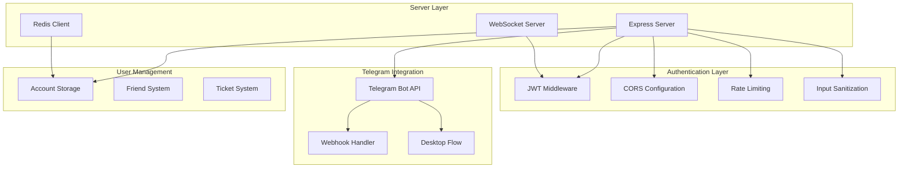
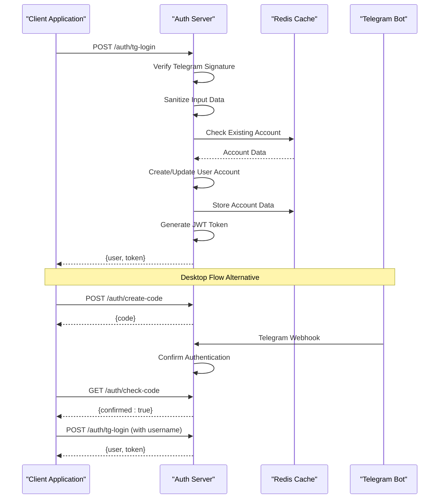
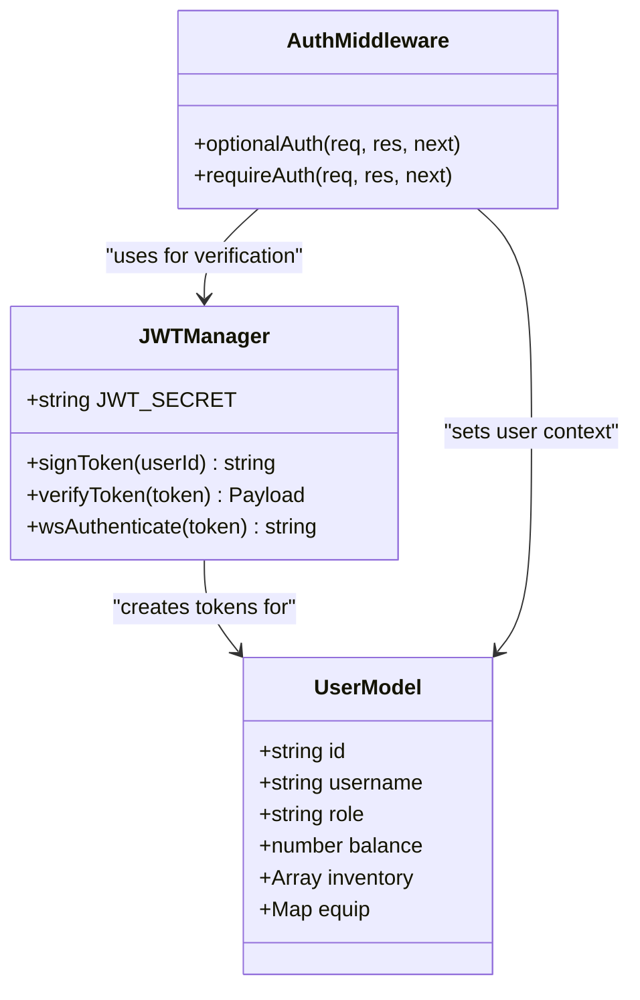
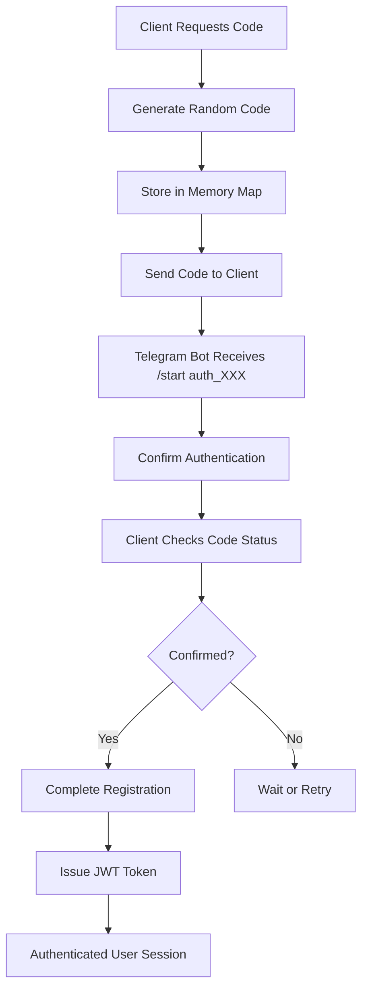
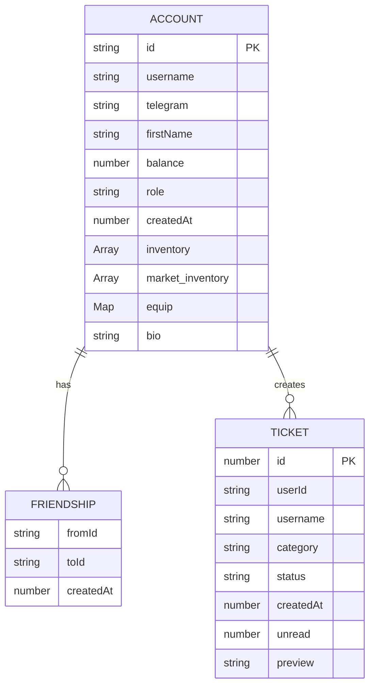
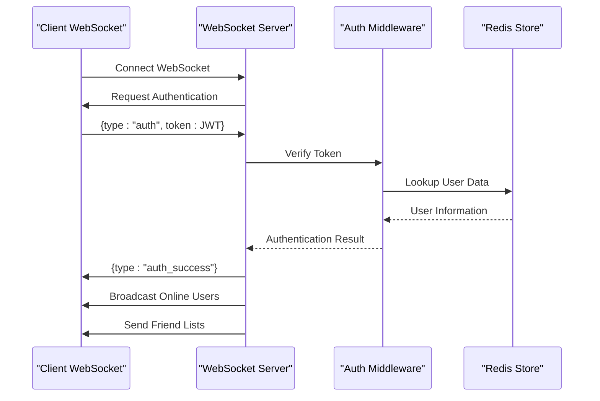
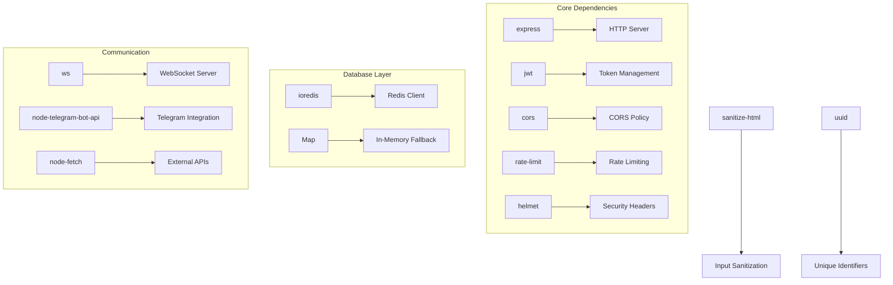

# Authentication Server

<cite>
**Referenced Files in This Document**
- [server/index.js](file://server/index.js)
- [server_index.js](file://server_index.js)
- [server/package.json](file://server/package.json)
- [server/deploy.sh](file://server/deploy.sh)
</cite>

## Table of Contents
1. [Introduction](#introduction)
2. [Project Structure](#project-structure)
3. [Core Components](#core-components)
4. [Architecture Overview](#architecture-overview)
5. [Detailed Component Analysis](#detailed-component-analysis)
6. [Dependency Analysis](#dependency-analysis)
7. [Performance Considerations](#performance-considerations)
8. [Troubleshooting Guide](#troubleshooting-guide)
9. [Conclusion](#conclusion)

## Introduction

The SBGames Authentication Server is a comprehensive Node.js authentication system that provides secure user authentication, JWT token management, Telegram login integration, and user account handling. The server serves as the central authentication hub for the SBGames ecosystem, managing user registration, role-based access control, and secure communication between clients and the game infrastructure.

The authentication server implements modern security practices including CORS configuration, rate limiting, input sanitization, and robust token verification mechanisms. It supports both REST API endpoints and WebSocket connections for real-time communication, with integrated Redis caching for user data persistence.

## Project Structure

The authentication server follows a modular architecture with clear separation of concerns:

**Diagram sources**
- [server/index.js:37-91](file://server/index.js#L37-L91)
- [server_index.js:80-130](file://server_index.js#L80-L130)

**Section sources**
- [server/package.json:1-20](file://server/package.json#L1-L20)
- [server/deploy.sh:1-26](file://server/deploy.sh#L1-L26)

## Core Components

### Security Infrastructure

The authentication server implements multiple layers of security:

**CORS Configuration**: The server maintains a strict allowlist of origins including development environments, production domains, and Tauri applications. This prevents unauthorized cross-origin requests while allowing legitimate client applications to communicate securely.

**Rate Limiting**: Comprehensive rate limiting is implemented using express-rate-limit middleware with different thresholds for various endpoints:
- Authentication endpoints: 30 requests per minute
- General API endpoints: 100 requests per minute  
- Payment endpoints: 3 requests per minute
- Strict endpoints: 3 requests per minute

**Input Sanitization**: All user inputs are sanitized using sanitize-html to prevent XSS attacks and malicious content injection.

**JWT Token Management**: Secure JWT token generation with configurable expiration (30 days) and verification mechanisms.

### Authentication Flow

The server supports two primary authentication methods:

1. **Telegram Widget Authentication**: Direct authentication through Telegram widgets with signature verification
2. **Desktop Authentication Flow**: Multi-step process involving code generation and verification

**Section sources**
- [server/index.js:39-62](file://server/index.js#L39-L62)
- [server/index.js:140-176](file://server/index.js#L140-L176)
- [server_index.js:246-306](file://server_index.js#L246-L306)

## Architecture Overview

The authentication server employs a layered architecture with clear separation between presentation, business logic, and data persistence layers:

**Diagram sources**
- [server/index.js:140-176](file://server/index.js#L140-L176)
- [server/index.js:184-200](file://server/index.js#L184-L200)
- [server_index.js:246-306](file://server_index.js#L246-L306)

## Detailed Component Analysis

### JWT Authentication System

The JWT authentication system provides secure token-based authentication across all API endpoints:

**Diagram sources**
- [server/index.js:77-82](file://server/index.js#L77-L82)
- [server/index.js:290-301](file://server/index.js#L290-L301)

The JWT system generates tokens with a 30-day expiration period and includes user ID claims for easy identification. Token verification handles malformed tokens gracefully by returning null values.

**Section sources**
- [server/index.js:77-82](file://server/index.js#L77-L82)
- [server/index.js:290-301](file://server/index.js#L290-L301)

### Telegram Login Integration

The Telegram integration provides seamless authentication through the Telegram platform:

**Diagram sources**
- [server/index.js:184-200](file://server/index.js#L184-L200)
- [server/index.js:1141-1158](file://server/index.js#L1141-L1158)

The desktop authentication flow uses a two-step process: code generation followed by Telegram bot confirmation, ensuring secure user identity verification.

**Section sources**
- [server/index.js:184-200](file://server/index.js#L184-L200)
- [server/index.js:1141-1158](file://server/index.js#L1141-L1158)

### User Account Management

The user account system manages player profiles with comprehensive data structures:

**Diagram sources**
- [server/index.js:155-172](file://server/index.js#L155-L172)
- [server/index.js:94-99](file://server/index.js#L94-L99)

User accounts include comprehensive metadata including inventory management, trading capabilities, and social features like friend systems and messaging.

**Section sources**
- [server/index.js:155-172](file://server/index.js#L155-L172)
- [server/index.js:94-99](file://server/index.js#L94-L99)

### WebSocket Authentication

The WebSocket authentication system provides real-time bidirectional communication with enhanced security:

**Diagram sources**
- [server/index.js:753-796](file://server/index.js#L753-L796)
- [server/index.js:907-958](file://server/index.js#L907-L958)

WebSocket connections include rate limiting, connection limits per IP address, and automatic cleanup on disconnect.

**Section sources**
- [server/index.js:753-796](file://server/index.js#L753-L796)
- [server/index.js:907-958](file://server/index.js#L907-L958)

## Dependency Analysis

The authentication server relies on several key dependencies for its functionality:

**Diagram sources**
- [server/package.json:6-18](file://server/package.json#L6-L18)

The dependency graph shows a well-balanced architecture with clear separation between HTTP handling, database operations, and external integrations.

**Section sources**
- [server/package.json:6-18](file://server/package.json#L6-L18)

## Performance Considerations

The authentication server implements several performance optimization strategies:

**Redis Integration**: Primary data storage uses Redis for distributed caching with automatic fallback to in-memory storage when Redis is unavailable. The Redis client uses lazy connections to minimize startup overhead.

**Connection Pooling**: WebSocket connections are managed efficiently with automatic cleanup and resource monitoring. Connection limits per IP address prevent abuse while maintaining performance.

**Caching Strategies**: Frequently accessed data like user profiles and inventory information are cached to reduce database load and improve response times.

**Memory Management**: The server uses efficient data structures (Maps, Sets) for user relationships and maintains cleanup routines to prevent memory leaks.

**Section sources**
- [server/index.js:27-35](file://server/index.js#L27-L35)
- [server/index.js:907-918](file://server/index.js#L907-L918)

## Troubleshooting Guide

### Common Authentication Issues

**JWT Token Verification Failures**
- Verify JWT_SECRET environment variable is properly configured
- Check token expiration dates (30 days)
- Ensure consistent token format (Bearer prefix required)

**Telegram Authentication Problems**
- Verify BOT_TOKEN environment variable contains valid token
- Check webhook URL configuration matches server deployment
- Monitor Telegram API rate limits and availability

**Redis Connection Issues**
- Verify Redis server is running and accessible
- Check network connectivity to Redis instance
- Monitor Redis memory usage and connection limits

**CORS Configuration Errors**
- Ensure client origin is included in ALLOWED_ORIGINS
- Verify credentials support is enabled for trusted origins
- Check preflight request handling

### Debugging Authentication Flow

**Enable Debug Logging**: Add console.log statements in authentication middleware to trace request flow and identify bottlenecks.

**Monitor Rate Limits**: Track rate limit violations using server logs to identify potential abuse or misconfigured clients.

**WebSocket Connection Issues**: Check connection timeouts and authentication failures in WebSocket handler logs.

**Section sources**
- [server/index.js:178-182](file://server/index.js#L178-L182)
- [server/index.js:923-927](file://server/index.js#L923-L927)

## Conclusion

The SBGames Authentication Server provides a robust, secure, and scalable foundation for user authentication and account management. Its multi-layered security approach, comprehensive rate limiting, and flexible authentication methods make it suitable for production environments requiring high security standards.

The server's architecture supports both traditional REST API patterns and real-time WebSocket communication, enabling rich interactive experiences for users. The integration with Telegram provides seamless authentication flows while maintaining security through signature verification and token-based sessions.

Key strengths include comprehensive input sanitization, Redis-backed persistence with in-memory fallback, sophisticated rate limiting, and detailed audit logging. The system is designed for scalability with clear separation of concerns and efficient resource management.

Future enhancements could include additional authentication providers, enhanced audit logging, and expanded administrative capabilities for user management and system monitoring.