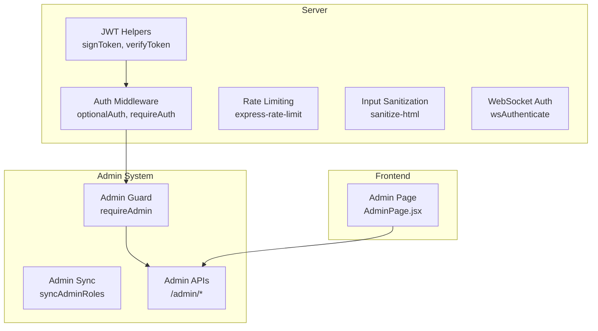
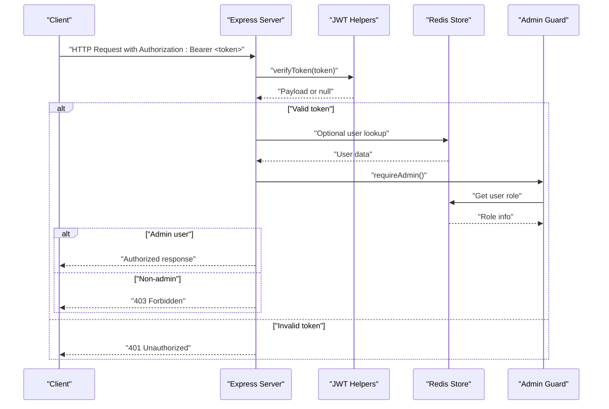
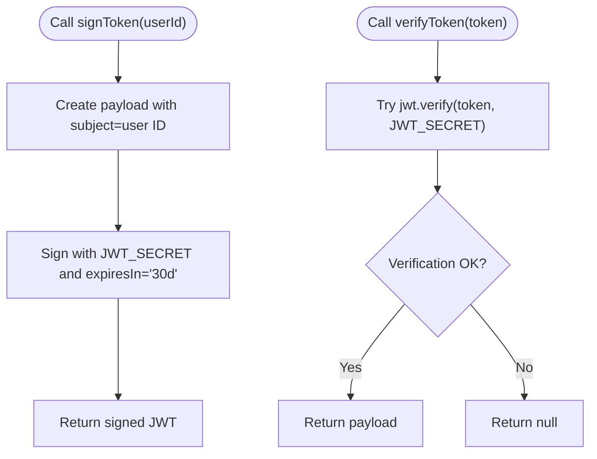
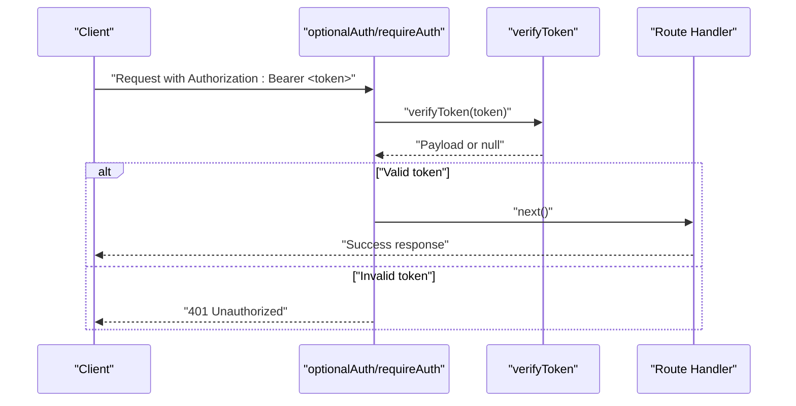
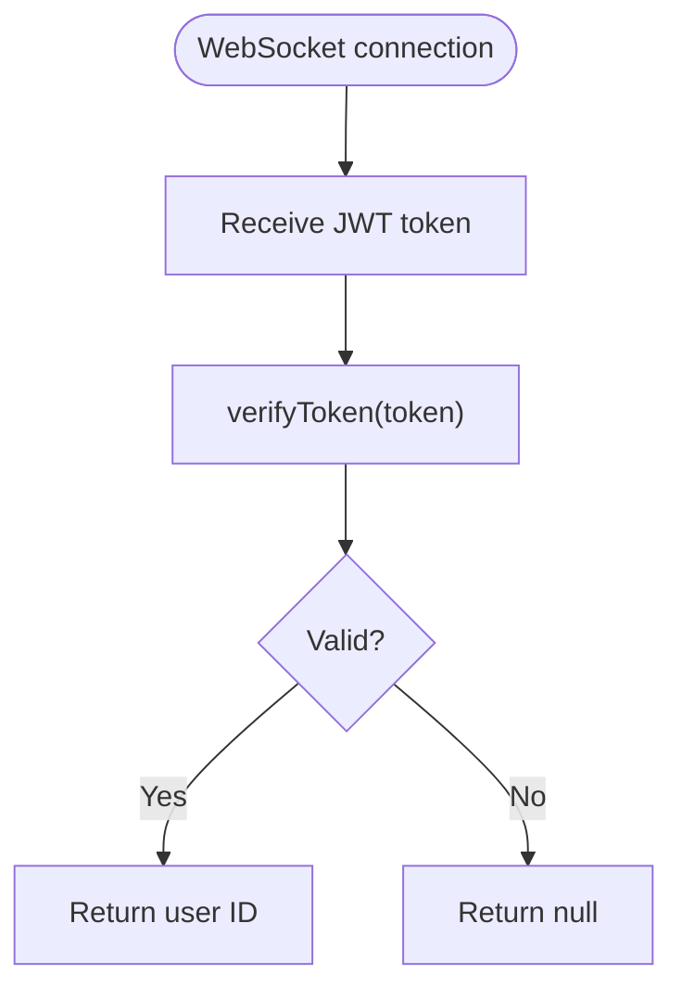
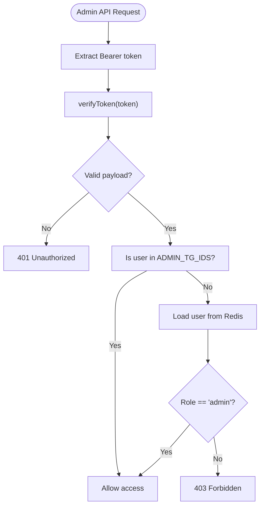
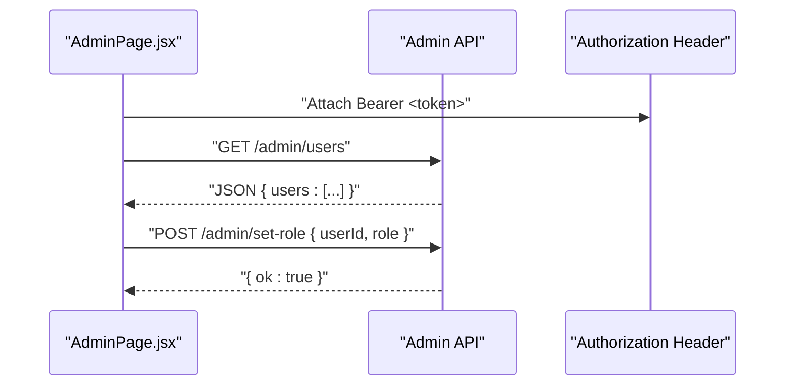
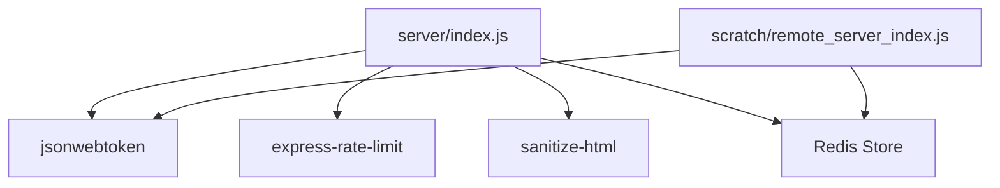

# JWT Token Management & Security Middleware

<cite>
**Referenced Files in This Document**
- [server/index.js](file://server/index.js)
- [scratch/remote_server_index.js](file://scratch/remote_server_index.js)
- [website/src/pages/AdminPage.jsx](file://website/src/pages/AdminPage.jsx)
</cite>

## Table of Contents
1. [Introduction](#introduction)
2. [Project Structure](#project-structure)
3. [Core Components](#core-components)
4. [Architecture Overview](#architecture-overview)
5. [Detailed Component Analysis](#detailed-component-analysis)
6. [Dependency Analysis](#dependency-analysis)
7. [Performance Considerations](#performance-considerations)
8. [Troubleshooting Guide](#troubleshooting-guide)
9. [Conclusion](#conclusion)

## Introduction
This document provides comprehensive documentation for JWT token management and security middleware implementation in the SBGames project. It covers JWT signing and verification functions, token authentication middleware, WebSocket token authentication, CORS configuration, rate limiting, input sanitization, role-based access control, and admin user detection. It also includes examples of token usage patterns, authentication headers, and security best practices.

## Project Structure
The security-related functionality spans multiple parts of the system:
- Server-side JWT helpers and middleware in the server module
- Admin role enforcement and privilege management
- Frontend usage of authentication headers for admin APIs

**Diagram sources**
- [server/index.js:56-83](file://server/index.js#L56-L83)
- [scratch/remote_server_index.js:401-467](file://scratch/remote_server_index.js#L401-L467)
- [website/src/pages/AdminPage.jsx:56-319](file://website/src/pages/AdminPage.jsx#L56-L319)

**Section sources**
- [server/index.js:56-83](file://server/index.js#L56-L83)
- [scratch/remote_server_index.js:401-467](file://scratch/remote_server_index.js#L401-L467)
- [website/src/pages/AdminPage.jsx:56-319](file://website/src/pages/AdminPage.jsx#L56-L319)

## Core Components
This section documents the core JWT and security components used across the system.

- JWT Signing and Verification
  - signToken(userId): Creates a signed JWT with a 30-day expiration for the given user ID.
  - verifyToken(token): Verifies a JWT signature and returns the payload or null on failure.

- Authentication Middleware
  - optionalAuth(req, res, next): Extracts a Bearer token from Authorization header, verifies it, and sets req.userId to the token subject or null if invalid.
  - requireAuth(req, res, next): Wrapper around optionalAuth that enforces authentication; if verification fails, it responds with 401 Unauthorized.

- WebSocket Authentication
  - wsAuthenticate(token): Verifies a JWT and returns the user ID if valid, otherwise null.

- Rate Limiting
  - apiLimiter: Enforces a 60-second window with a maximum of 120 requests for all routes under /api.

- Input Sanitization
  - sanitize(str, max): Trims and sanitizes user input using sanitize-html with empty allowed tags and attributes, returning up to max characters.

- Admin Role Detection
  - syncAdminRoles(): On startup, promotes users whose Telegram IDs are in ADMIN_TG_IDS to admin.
  - requireAdmin(req, res): Validates the Bearer token, checks if the user is in ADMIN_TG_IDS, or retrieves the user's role from Redis and ensures it equals "admin".

**Section sources**
- [server/index.js:56-83](file://server/index.js#L56-L83)
- [scratch/remote_server_index.js:401-467](file://scratch/remote_server_index.js#L401-L467)

## Architecture Overview
The authentication and authorization pipeline integrates JWT verification, middleware enforcement, and admin privilege checks.

**Diagram sources**
- [server/index.js:56-83](file://server/index.js#L56-L83)
- [scratch/remote_server_index.js:401-467](file://scratch/remote_server_index.js#L401-L467)

## Detailed Component Analysis

### JWT Signing and Verification Functions
- Purpose: Provide secure token creation and validation across the platform.
- Implementation highlights:
  - signToken generates a JWT with a 30-day expiration using a shared secret.
  - verifyToken attempts verification and returns null on failure, ensuring safe handling downstream.
- Security measures:
  - Centralized secret management via persistent storage (Redis) with fallback to environment variable or ephemeral generation.
  - Expiration enforced at 30 days to balance usability and risk.

**Diagram sources**
- [server/index.js:76-82](file://server/index.js#L76-L82)

**Section sources**
- [server/index.js:76-82](file://server/index.js#L76-L82)

### Authentication Middleware (optionalAuth, requireAuth)
- Purpose: Enforce authentication on protected routes.
- Behavior:
  - optionalAuth extracts the token from the Authorization header, removes the "Bearer " prefix, verifies it, and sets req.userId accordingly.
  - requireAuth delegates to optionalAuth and returns 401 Unauthorized if verification fails.
- Usage pattern:
  - Apply requireAuth to sensitive endpoints to ensure only authenticated users can access them.

**Diagram sources**
- [server/index.js:56-83](file://server/index.js#L56-L83)

**Section sources**
- [server/index.js:56-83](file://server/index.js#L56-L83)

### WebSocket Token Authentication (wsAuthenticate)
- Purpose: Authenticate WebSocket connections using JWT.
- Behavior:
  - wsAuthenticate verifies the token and returns the user ID if valid; otherwise returns null.
- Integration:
  - Use the returned user ID to associate WebSocket clients with authenticated users.

**Diagram sources**
- [server/index.js:76-82](file://server/index.js#L76-L82)

**Section sources**
- [server/index.js:76-82](file://server/index.js#L76-L82)

### Admin User Detection and Special Privileges
- Purpose: Enforce admin-only access to administrative endpoints.
- Implementation:
  - syncAdminRoles(): Promotes users whose Telegram IDs are in ADMIN_TG_IDS to admin on startup.
  - requireAdmin(): Validates the Bearer token, checks if the user is in ADMIN_TG_IDS, or retrieves the user's role from Redis and ensures it equals "admin".
- Protected endpoints:
  - /admin/users, /admin/set-role, /admin/set-balance, /admin/tickets.

**Diagram sources**
- [scratch/remote_server_index.js:401-467](file://scratch/remote_server_index.js#L401-L467)

**Section sources**
- [scratch/remote_server_index.js:401-467](file://scratch/remote_server_index.js#L401-L467)

### Frontend Usage Example (AdminPage.jsx)
- Purpose: Demonstrate how the frontend passes authentication headers to admin endpoints.
- Pattern:
  - Uses Authorization: Bearer <token> header when calling admin APIs (/admin/*).
  - Handles responses and updates UI state accordingly.

**Diagram sources**
- [website/src/pages/AdminPage.jsx:56-319](file://website/src/pages/AdminPage.jsx#L56-L319)

**Section sources**
- [website/src/pages/AdminPage.jsx:56-319](file://website/src/pages/AdminPage.jsx#L56-L319)

## Dependency Analysis
The security system relies on several external libraries and internal helpers.

**Diagram sources**
- [server/index.js:56-83](file://server/index.js#L56-L83)
- [scratch/remote_server_index.js:401-467](file://scratch/remote_server_index.js#L401-L467)

**Section sources**
- [server/index.js:56-83](file://server/index.js#L56-L83)
- [scratch/remote_server_index.js:401-467](file://scratch/remote_server_index.js#L401-L467)

## Performance Considerations
- JWT verification is lightweight and occurs per request; ensure token verification failures short-circuit early to minimize overhead.
- Rate limiting reduces abuse on API endpoints; tune windowMs and max based on traffic patterns.
- Input sanitization adds CPU overhead; keep max length reasonable to balance safety and performance.
- Redis operations for admin roles and user data should be optimized; consider connection pooling and caching strategies.

## Troubleshooting Guide
Common issues and resolutions:
- 401 Unauthorized on protected routes:
  - Ensure the Authorization header is present and formatted as Bearer <token>.
  - Verify the token is unexpired and was signed with the current JWT_SECRET.
- 403 Forbidden for admin endpoints:
  - Confirm the user's Telegram ID is in ADMIN_TG_IDS or their role is set to admin in Redis.
  - Check that requireAdmin is applied to the route.
- Rate limit exceeded:
  - Reduce client-side request frequency or increase limits cautiously.
- Validation errors:
  - verifyToken returns null on failure; handle null payloads gracefully in middleware.
- Token storage and rotation:
  - Persist JWT_SECRET in Redis for distributed environments; rotate secrets carefully and coordinate with all nodes.

**Section sources**
- [server/index.js:56-83](file://server/index.js#L56-L83)
- [scratch/remote_server_index.js:401-467](file://scratch/remote_server_index.js#L401-L467)

## Conclusion
The SBGames project implements a robust JWT-based authentication and authorization system with clear middleware boundaries, admin privilege enforcement, and practical security measures. By centralizing token handling, enforcing rate limits, sanitizing inputs, and managing admin roles, the system provides a strong foundation for secure API access and admin operations.