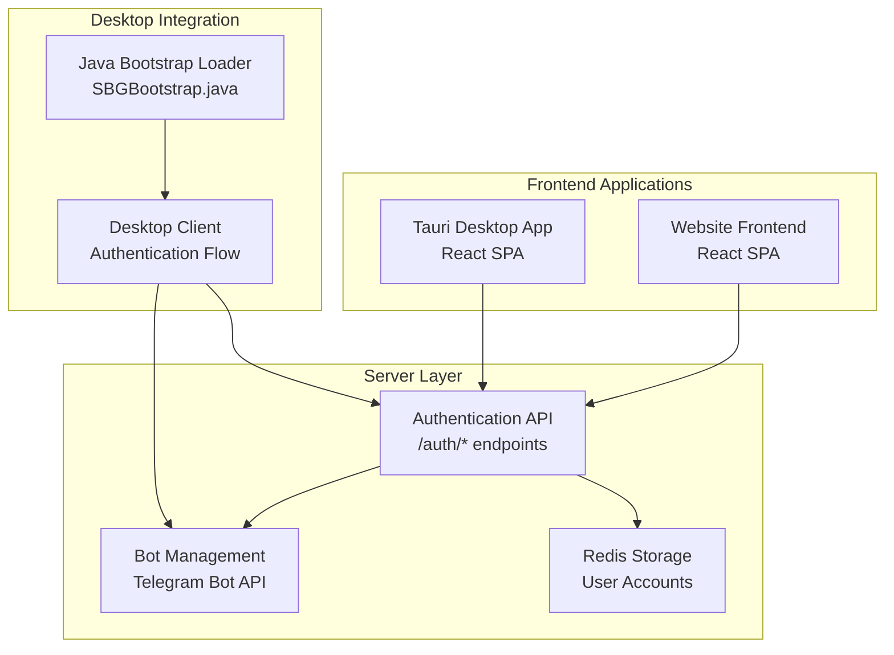
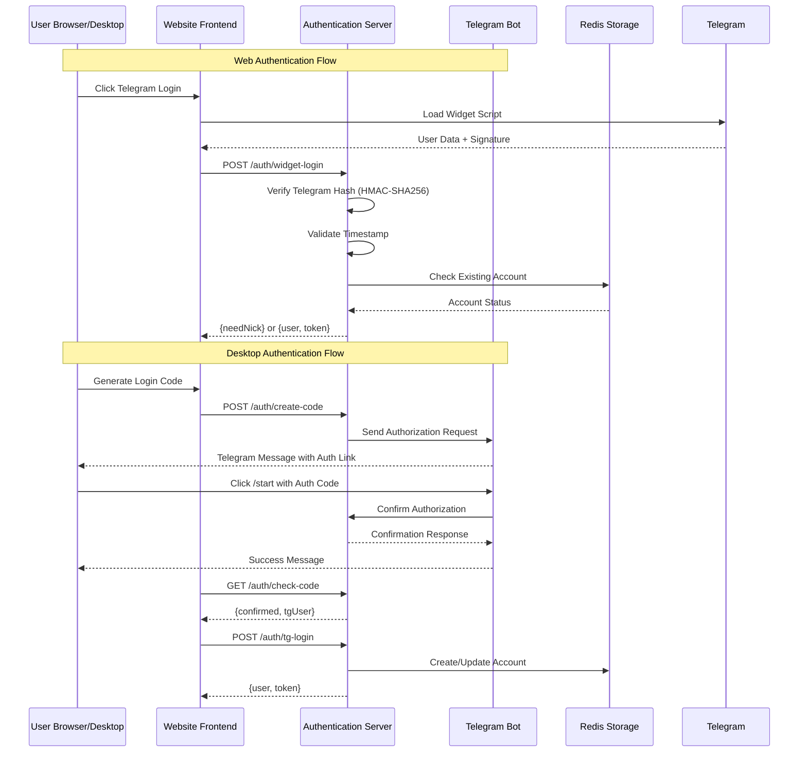
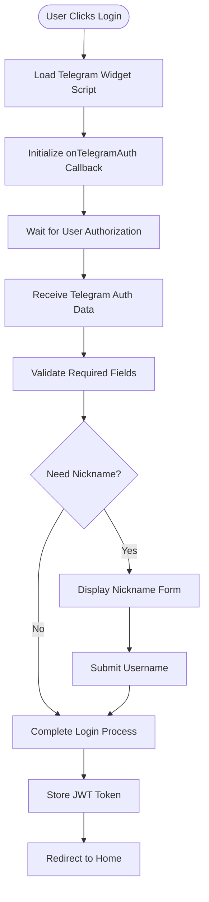
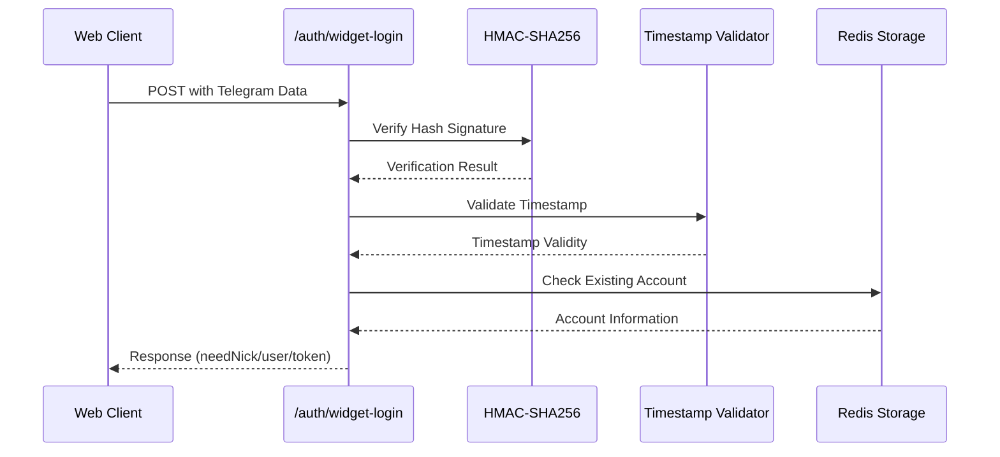
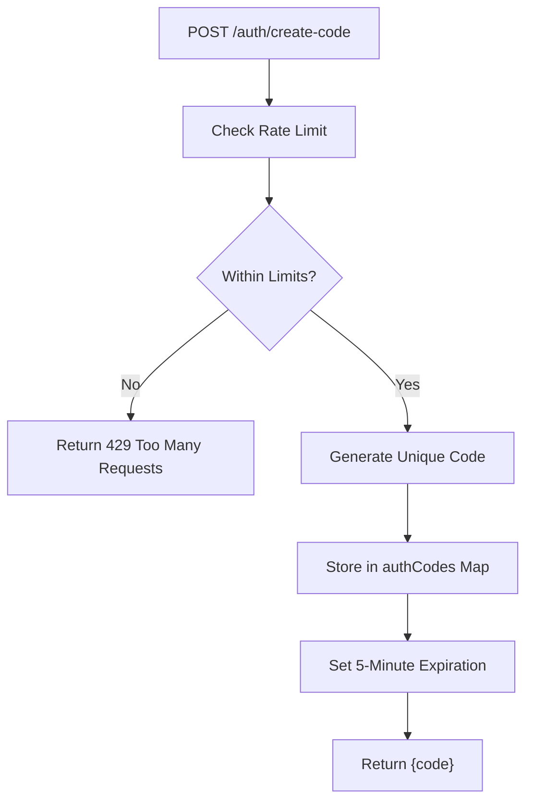
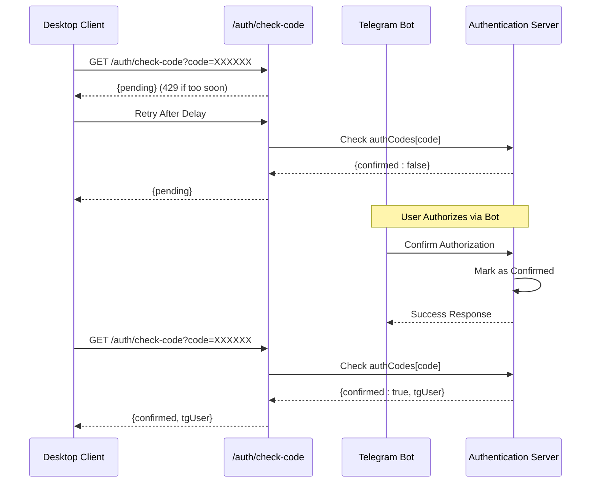
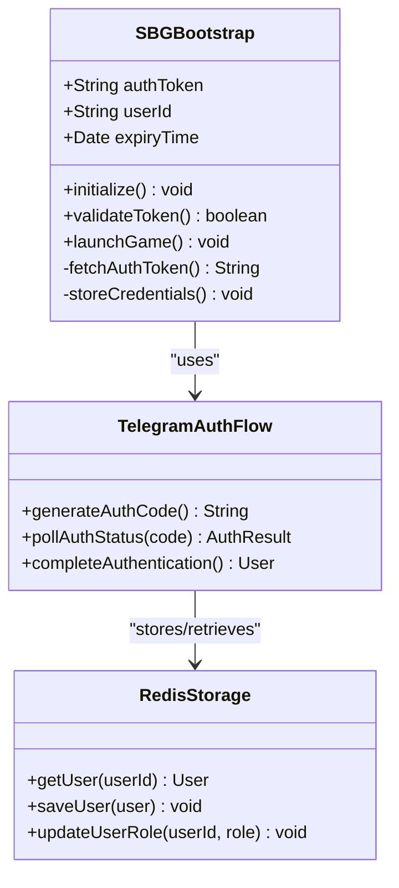
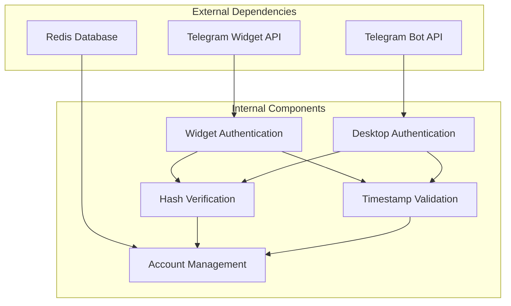

# Telegram Login Integration & Bot Verification

<cite>
**Referenced Files in This Document**
- [server_index.js](file://server_index.js)
- [index.js](file://server/index.js)
- [LoginPage.jsx](file://website/src/pages/LoginPage.jsx)
- [LoginPage.jsx](file://src/pages/LoginPage.jsx)
- [SBGBootstrap.java](file://src-java/com/sbgames/bootstrap/SBGBootstrap.java)
- [remote_server_index.js](file://scratch/remote_server_index.js)
</cite>

## Table of Contents
1. [Introduction](#introduction)
2. [Project Structure](#project-structure)
3. [Core Components](#core-components)
4. [Architecture Overview](#architecture-overview)
5. [Detailed Component Analysis](#detailed-component-analysis)
6. [Dependency Analysis](#dependency-analysis)
7. [Performance Considerations](#performance-considerations)
8. [Security Implementation](#security-implementation)
9. [Troubleshooting Guide](#troubleshooting-guide)
10. [Conclusion](#conclusion)

## Introduction
This document provides comprehensive technical documentation for the Telegram login integration and bot verification system. It covers the Telegram widget authentication flow, bot verification mechanisms, desktop authentication flow, and integration with the Java bootstrap loader. The system implements secure authentication using Telegram's official authentication protocol, including hash verification via HMAC-SHA256, timestamp validation, and user data extraction.

The authentication system supports two primary flows:
- Web-based authentication through Telegram widgets
- Desktop authentication via QR code generation and bot verification

## Project Structure
The Telegram authentication system spans multiple components across the frontend, backend, and desktop application layers.

**Diagram sources**
- [server_index.js](file://server_index.js)
- [index.js](file://server/index.js)
- [LoginPage.jsx](file://website/src/pages/LoginPage.jsx)
- [LoginPage.jsx](file://src/pages/LoginPage.jsx)
- [SBGBootstrap.java](file://src-java/com/sbgames/bootstrap/SBGBootstrap.java)

**Section sources**
- [server_index.js](file://server_index.js)
- [index.js](file://server/index.js)

## Core Components

### Telegram Authentication Flow
The system implements Telegram's official authentication protocol with robust security measures:

#### Hash Verification (HMAC-SHA256)
The authentication process validates Telegram's signature using HMAC-SHA256 with the bot's token as the key. The verification ensures data integrity and prevents tampering.

#### Timestamp Validation
All authentication requests include a timestamp that is validated against the current server time to prevent replay attacks. The system enforces strict time window limits.

#### User Data Extraction
The system extracts essential user information including ID, username, first name, last name, and authentication date from Telegram's payload.

### Authentication Endpoints
The system exposes several key endpoints for different authentication scenarios:

- `/auth/widget-login`: Web-based authentication via Telegram widgets
- `/auth/tg-login`: Complete authentication flow including nickname registration
- `/auth/create-code`: Desktop authentication code generation
- `/auth/check-code`: Desktop authentication code verification

### Bot Integration
The system integrates with a dedicated Telegram bot for desktop authentication flows, enabling users to authorize their desktop clients through bot commands.

**Section sources**
- [server_index.js](file://server_index.js)
- [remote_server_index.js](file://scratch/remote_server_index.js)

## Architecture Overview

**Diagram sources**
- [server_index.js](file://server_index.js)
- [index.js](file://server/index.js)
- [LoginPage.jsx](file://website/src/pages/LoginPage.jsx)
- [LoginPage.jsx](file://src/pages/LoginPage.jsx)

## Detailed Component Analysis

### Telegram Widget Authentication Flow

The web-based authentication flow utilizes Telegram's official widget system for seamless user experience.

#### Frontend Implementation
The frontend component dynamically loads the Telegram widget script and handles the authentication callback:

**Diagram sources**
- [LoginPage.jsx](file://website/src/pages/LoginPage.jsx)

#### Backend Authentication Processing
The server-side authentication validates the Telegram payload and manages user accounts:

**Diagram sources**
- [server_index.js](file://server_index.js)
- [remote_server_index.js](file://scratch/remote_server_index.js)

**Section sources**
- [LoginPage.jsx](file://website/src/pages/LoginPage.jsx)
- [server_index.js](file://server_index.js)
- [remote_server_index.js](file://scratch/remote_server_index.js)

### Desktop Authentication Flow

The desktop authentication system provides a QR code-based approach for users who prefer desktop client authentication.

#### Code Generation Endpoint
The `/auth/create-code` endpoint generates unique authentication codes with expiration handling:

**Diagram sources**
- [index.js](file://server/index.js)

#### Polling Mechanism
The desktop client polls the `/auth/check-code` endpoint to monitor authentication status:

**Diagram sources**
- [index.js](file://server/index.js)
- [server_index.js](file://server_index.js)

**Section sources**
- [index.js](file://server/index.js)
- [LoginPage.jsx](file://src/pages/LoginPage.jsx)

### Java Bootstrap Loader Integration

The desktop authentication seamlessly integrates with the Java bootstrap loader for native application startup:

**Diagram sources**
- [SBGBootstrap.java](file://src-java/com/sbgames/bootstrap/SBGBootstrap.java)
- [server_index.js](file://server_index.js)

**Section sources**
- [SBGBootstrap.java](file://src-java/com/sbgames/bootstrap/SBGBootstrap.java)
- [server_index.js](file://server_index.js)

## Dependency Analysis

The authentication system has well-defined dependencies between components:

**Diagram sources**
- [server_index.js](file://server_index.js)
- [index.js](file://server/index.js)

**Section sources**
- [server_index.js](file://server_index.js)
- [index.js](file://server/index.js)

## Performance Considerations

### Rate Limiting Implementation
The system implements comprehensive rate limiting to prevent abuse:

- `/auth/tg-login`: 5 requests per 15 minutes per IP address
- `/auth/create-code`: 3 requests per minute per user
- `/auth/check-code`: 429 status for rapid polling attempts

### Caching Strategy
Redis caching optimizes user lookup performance and reduces database load during authentication flows.

### Memory Management
Authentication codes are stored in memory with automatic cleanup after expiration to prevent memory leaks.

## Security Implementation

### Input Validation and Sanitization
The system implements strict input validation for all authentication endpoints:

- Telegram user data validation using HMAC-SHA256 signatures
- Username sanitization (3-16 characters, alphanumeric and underscore only)
- IP address tracking for suspicious activity detection
- Automatic failure recording for invalid requests

### Replay Attack Protection
Multiple layers protect against replay attacks:

- Timestamp validation with strict time window limits
- One-time use authentication codes
- Bot command verification with expiration handling
- Session token generation with expiration

### CSRF Protection
While Telegram's authentication flow inherently provides strong anti-CSRF protection through their widget system, the server also implements:

- Origin validation for authentication requests
- Token-based session management
- Rate limiting to prevent automated attacks

### Error Handling and Logging
Comprehensive error handling ensures security without leaking sensitive information:

- Generic error messages for failed authentications
- Detailed logging for suspicious activities
- Automatic IP blocking for repeated failures
- Graceful degradation for service interruptions

**Section sources**
- [server_index.js](file://server_index.js)
- [index.js](file://server/index.js)

## Troubleshooting Guide

### Common Authentication Issues

#### Telegram Widget Not Loading
- Verify Telegram widget script loads successfully
- Check browser console for widget initialization errors
- Ensure proper CSP headers allow Telegram widget loading

#### Authentication Signature Failures
- Verify bot token configuration is correct
- Check timestamp synchronization between client and server
- Validate HMAC-SHA256 implementation matches Telegram's specification

#### Desktop Authentication Problems
- Confirm bot is properly configured and online
- Verify authentication code expiration (5-minute limit)
- Check network connectivity for bot communication

#### Rate Limit Exceeded
- Implement exponential backoff for retry attempts
- Display user-friendly error messages
- Provide guidance for rate limit reset timing

### Debugging Authentication Flows

#### Web Authentication Debugging
1. Enable browser developer tools to monitor `/auth/widget-login` requests
2. Verify Telegram data payload structure and signature
3. Check server logs for authentication validation results

#### Desktop Authentication Debugging
1. Monitor `/auth/create-code` endpoint responses
2. Verify bot message delivery and user interaction
3. Track authentication code lifecycle and expiration

**Section sources**
- [server_index.js](file://server_index.js)
- [index.js](file://server/index.js)

## Conclusion

The Telegram login integration and bot verification system provides a comprehensive, secure, and user-friendly authentication solution. The implementation leverages Telegram's official authentication protocol with robust security measures including HMAC-SHA256 hash verification, timestamp validation, and comprehensive input sanitization.

Key strengths of the implementation include:

- **Multi-platform support**: Seamless authentication across web and desktop platforms
- **Security-first design**: Multiple layers of protection against common attack vectors
- **User experience focus**: Streamlined authentication flows with clear error messaging
- **Scalable architecture**: Redis-backed storage and efficient rate limiting
- **Integration flexibility**: Support for both widget-based and bot-based authentication flows

The system successfully balances security requirements with user accessibility, providing a reliable foundation for user authentication across the SBGames ecosystem. The integration with the Java bootstrap loader ensures seamless desktop client authentication while maintaining the same security standards applied to web authentication.