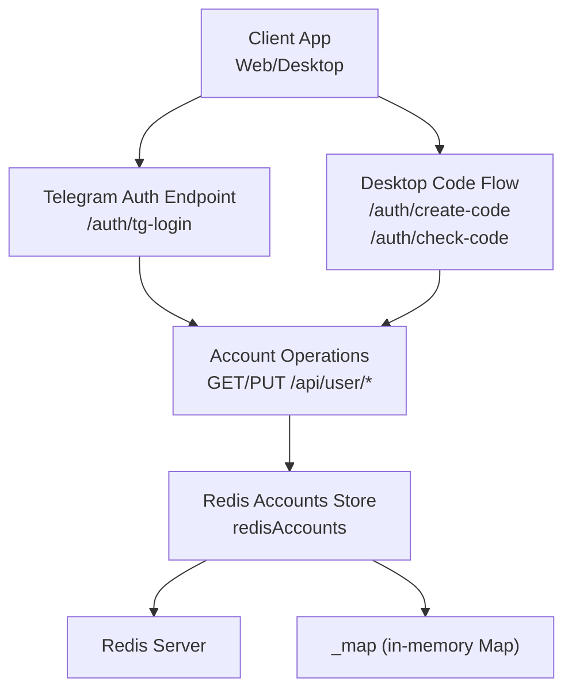
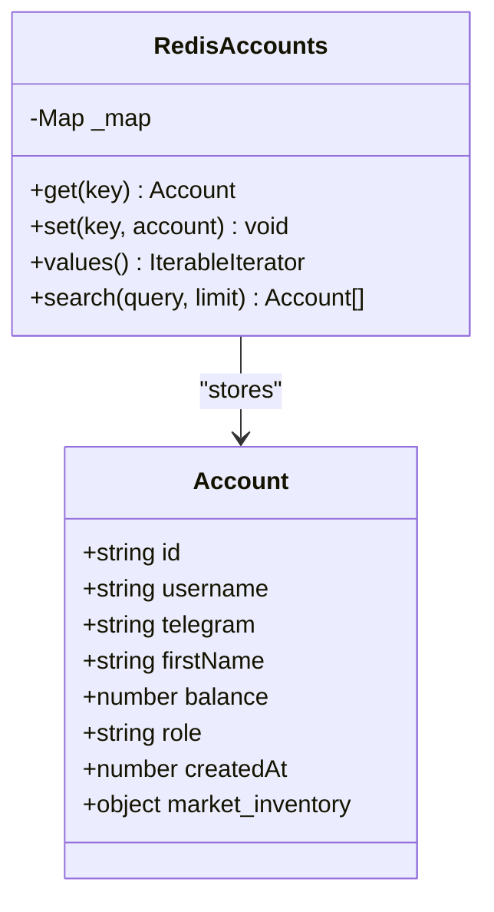
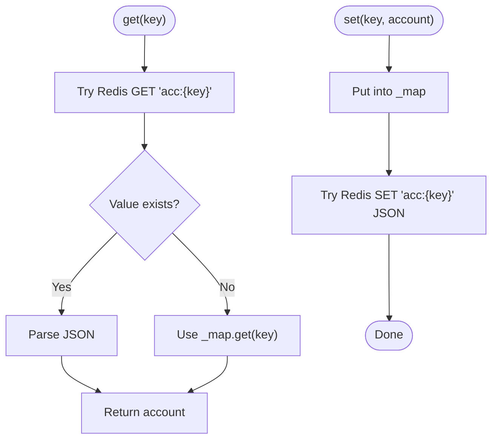
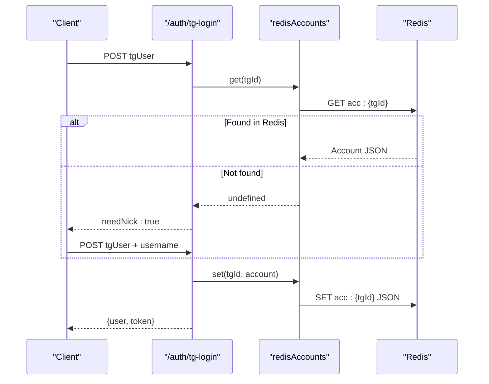
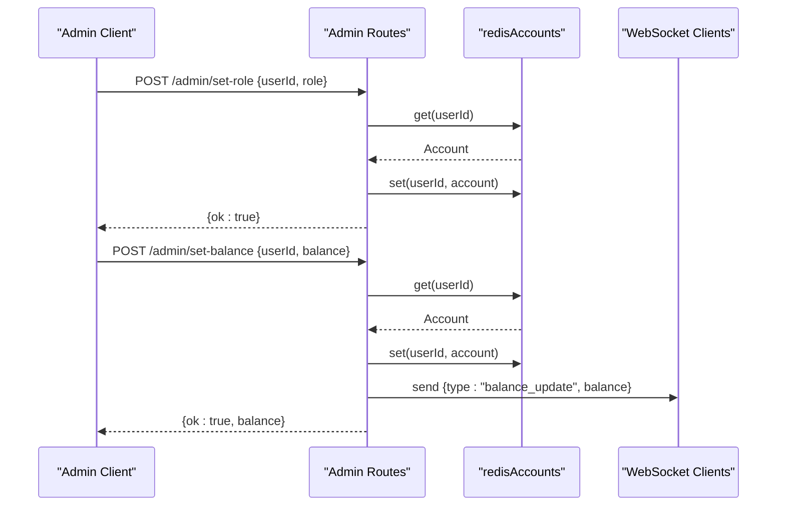
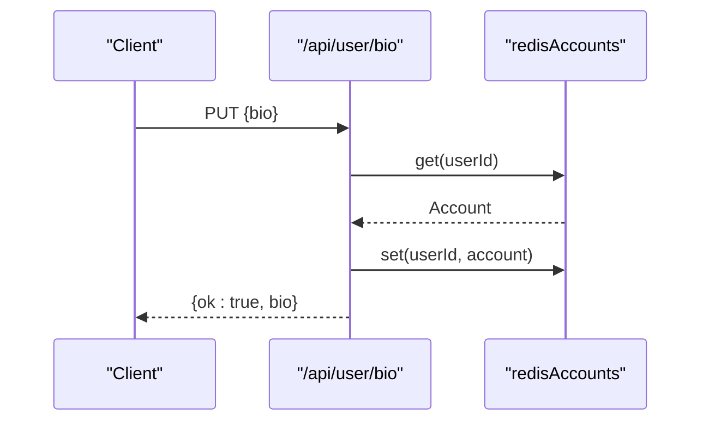
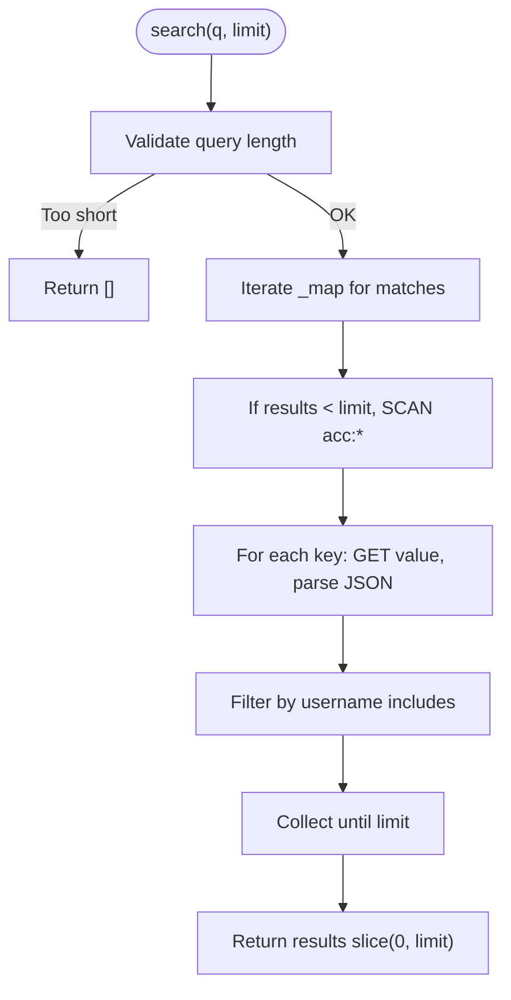
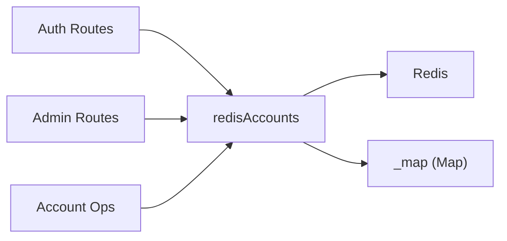

# User Account Management & Redis Integration

<cite>
**Referenced Files in This Document**
- [server_index.js](file://server_index.js)
- [remote_server_index.js](file://scratch/remote_server_index.js)
- [server/index.js](file://server/index.js)
</cite>

## Table of Contents
1. [Introduction](#introduction)
2. [Project Structure](#project-structure)
3. [Core Components](#core-components)
4. [Architecture Overview](#architecture-overview)
5. [Detailed Component Analysis](#detailed-component-analysis)
6. [Dependency Analysis](#dependency-analysis)
7. [Performance Considerations](#performance-considerations)
8. [Troubleshooting Guide](#troubleshooting-guide)
9. [Conclusion](#conclusion)

## Introduction
This document describes the user account management system and Redis integration used to persist and manage player accounts. It covers the account data model, Redis-backed storage with an in-memory fallback, CRUD operations, admin privilege handling, and error recovery strategies. It also documents the account creation flow during first login, role assignment, and initial account setup including starting balances and market inventory.

## Project Structure
The account management logic spans multiple server entry points:
- Primary server implementation: server_index.js
- Remote server variant with Redis integration: scratch/remote_server_index.js
- Legacy server entry point: server/index.js

Key responsibilities:
- Authentication via Telegram and optional desktop code flow
- Account creation on first login with sanitized username and admin detection
- Redis-backed account storage with in-memory Map fallback
- Admin-only operations for role and balance management
- Account search across Redis and memory

**Diagram sources**
- [server_index.js:242-267](file://server_index.js#L242-L267)
- [server_index.js:260-296](file://server_index.js#L260-L296)
- [remote_server_index.js:242-257](file://scratch/remote_server_index.js#L242-L257)
- [remote_server_index.js:261-296](file://scratch/remote_server_index.js#L261-L296)

**Section sources**
- [server_index.js:242-296](file://server_index.js#L242-L296)
- [remote_server_index.js:242-296](file://scratch/remote_server_index.js#L242-L296)

## Core Components
- redisAccounts adapter: Provides get, set, values, and search with Redis + in-memory fallback
- Account data model: id, username, telegram, firstName, balance, role, createdAt, market_inventory
- Admin system: Predefined admin usernames and IDs mapped to "admin" role
- Authentication endpoints: Telegram login and desktop code-based login
- Admin endpoints: Set role and balance for users
- Account update endpoints: Bio, equipment, and activity logging

**Section sources**
- [server_index.js:48-78](file://server_index.js#L48-L78)
- [server_index.js:163-171](file://server_index.js#L163-L171)
- [server_index.js:242-267](file://server_index.js#L242-L267)
- [server_index.js:260-296](file://server_index.js#L260-L296)
- [remote_server_index.js:45-78](file://scratch/remote_server_index.js#L45-L78)
- [remote_server_index.js:242-257](file://scratch/remote_server_index.js#L242-L257)
- [remote_server_index.js:261-296](file://scratch/remote_server_index.js#L261-L296)

## Architecture Overview
The system uses a hybrid storage layer:
- Primary: Redis with keys prefixed "acc:{id}"
- Fallback: In-memory Map (_map) for local development or Redis unavailability
- Search: Scans Redis keyspace with a Redis SCAN stream and merges with memory results

**Diagram sources**
- [server_index.js:48-78](file://server_index.js#L48-L78)
- [remote_server_index.js:45-78](file://scratch/remote_server_index.js#L45-L78)

**Section sources**
- [server_index.js:48-78](file://server_index.js#L48-L78)
- [remote_server_index.js:45-78](file://scratch/remote_server_index.js#L45-L78)

## Detailed Component Analysis

### Account Data Model
Properties stored per account:
- id: Telegram user ID (string)
- username: Sanitized display name
- telegram: Telegram username
- firstName: Player's first name
- balance: Numeric currency amount
- role: "admin" or "user"
- createdAt: Timestamp of account creation
- market_inventory: Starting items array

Initial setup includes:
- Role computed from admin username/ID lists
- Creation timestamp
- Starting market inventory items

**Section sources**
- [server_index.js:163-171](file://server_index.js#L163-L171)

### Redis Accounts Adapter (Hybrid Storage)
Behavior:
- get(key): Try Redis; on failure or missing, fall back to in-memory Map
- set(key, value): Write to Map; attempt Redis write with try/catch
- search(query, limit): Scan Redis keyspace with SCAN stream, merge with memory results
- values(): Iterate in-memory Map

Error recovery:
- Redis failures are caught and ignored to maintain availability
- In-memory Map acts as a hot cache and fallback

**Diagram sources**
- [server_index.js:48-49](file://server_index.js#L48-L49)
- [remote_server_index.js:46-47](file://scratch/remote_server_index.js#L46-L47)

**Section sources**
- [server_index.js:48-49](file://server_index.js#L48-L49)
- [remote_server_index.js:46-47](file://scratch/remote_server_index.js#L46-L47)

### Authentication and First Login Flow
Two flows:
1) Telegram login (/auth/tg-login):
- Validates Telegram signature
- Checks Redis for existing account by tgId
- If absent, signals needNick to client
- On completion, sets telegram username, admin role, persists account, and issues JWT token

2) Desktop code flow (/auth/create-code, /auth/check-code):
- Creates ephemeral auth code with expiry
- Client confirms code via /auth/check-code
- On success, proceeds similar to Telegram login

**Diagram sources**
- [server_index.js:242-267](file://server_index.js#L242-L267)
- [server_index.js:260-296](file://server_index.js#L260-L296)
- [remote_server_index.js:242-257](file://scratch/remote_server_index.js#L242-L257)
- [remote_server_index.js:261-296](file://scratch/remote_server_index.js#L261-L296)

**Section sources**
- [server_index.js:242-296](file://server_index.js#L242-L296)
- [remote_server_index.js:242-296](file://scratch/remote_server_index.js#L242-L296)

### Admin System and Privileges
- Admin detection: Username in admin list OR tgId in admin IDs → role "admin"
- Admin endpoints:
  - POST /admin/set-role: Set user role to "admin" or "user"
  - POST /admin/set-balance: Update numeric balance and notify user via WS

**Diagram sources**
- [server_index.js:436-457](file://server_index.js#L436-L457)
- [remote_server_index.js:436-457](file://scratch/remote_server_index.js#L436-L457)

**Section sources**
- [server_index.js:436-457](file://server_index.js#L436-L457)
- [remote_server_index.js:436-457](file://scratch/remote_server_index.js#L436-L457)

### Account CRUD Endpoints
- GET /api/user/bio: Retrieve bio
- PUT /api/user/bio: Update bio with sanitization
- Equipment management: Add/remove equipment slots
- Activity logging: POST /api/activity (session records)
- Account search: GET /user/search (by username)
- Online users: GET /online (connected clients)

**Diagram sources**
- [server_index.js:394-406](file://server_index.js#L394-L406)
- [remote_server_index.js:394-406](file://scratch/remote_server_index.js#L394-L406)

**Section sources**
- [server_index.js:394-406](file://server_index.js#L394-L406)
- [server_index.js:408-416](file://server_index.js#L408-L416)
- [server_index.js:361-374](file://server_index.js#L361-L374)
- [server_index.js:376-378](file://server_index.js#L376-L378)
- [remote_server_index.js:394-406](file://scratch/remote_server_index.js#L394-L406)
- [remote_server_index.js:408-416](file://scratch/remote_server_index.js#L408-L416)
- [remote_server_index.js:361-374](file://scratch/remote_server_index.js#L361-L374)
- [remote_server_index.js:376-378](file://scratch/remote_server_index.js#L376-L378)

### Account Search Implementation
- Memory-first search: Iterates _map for username matches
- Redis augmentation: Uses SCAN stream to fetch all "acc:*" keys, parse values, and filter by username
- Limiting: Stops when reaching configured limit

**Diagram sources**
- [server_index.js:50-77](file://server_index.js#L50-L77)
- [remote_server_index.js:50-77](file://scratch/remote_server_index.js#L50-L77)

**Section sources**
- [server_index.js:50-77](file://server_index.js#L50-L77)
- [remote_server_index.js:50-77](file://scratch/remote_server_index.js#L50-L77)

## Dependency Analysis
- redisAccounts depends on Redis client for get/set/scanStream
- Account creation depends on admin detection helpers (isAdmin, isAdminId)
- Authentication routes depend on Telegram signature verification
- Admin routes depend on requireAdmin middleware

**Diagram sources**
- [server_index.js:48-78](file://server_index.js#L48-L78)
- [remote_server_index.js:45-78](file://scratch/remote_server_index.js#L45-L78)

**Section sources**
- [server_index.js:48-78](file://server_index.js#L48-L78)
- [remote_server_index.js:45-78](file://scratch/remote_server_index.js#L45-L78)

## Performance Considerations
- Hybrid storage reduces latency for hot reads/writes by caching in _map
- Redis SCAN is bounded by count and stops early when limit reached
- Try/catch around Redis writes prevents single failure from blocking operations
- Consider adding Redis pipeline for bulk operations and connection pooling
- For high-frequency updates, batch account writes and consider optimistic concurrency

## Troubleshooting Guide
Common issues and resolutions:
- Redis unavailable: Adapter falls back to _map; ensure client handles degraded mode gracefully
- Duplicate usernames: Enforce uniqueness during first login and nick completion
- Admin privilege escalation: Verify admin lists and signatures before changing roles
- Data inconsistency: Use atomic operations and consider transactional updates for multi-field changes
- Search performance: Tune SCAN count and limit; consider indexing strategies if search volume grows

**Section sources**
- [server_index.js:46-47](file://server_index.js#L46-L47)
- [remote_server_index.js:46-47](file://scratch/remote_server_index.js#L46-L47)

## Conclusion
The system combines Redis for durable storage with an in-memory Map for resilience and speed. The redisAccounts adapter provides a simple interface with robust fallback behavior. Admin privileges are enforced via configurable lists, and account lifecycle operations (creation, updates, search) are supported across both web and desktop flows. The design emphasizes availability and simplicity, with room for performance enhancements as usage scales.