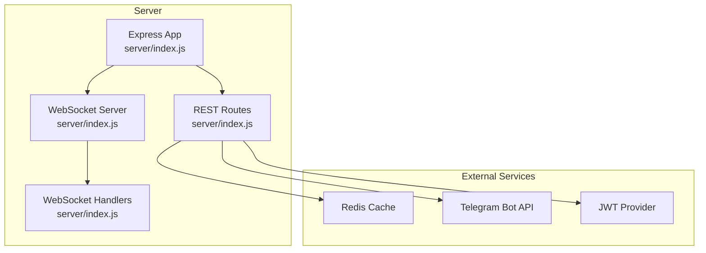
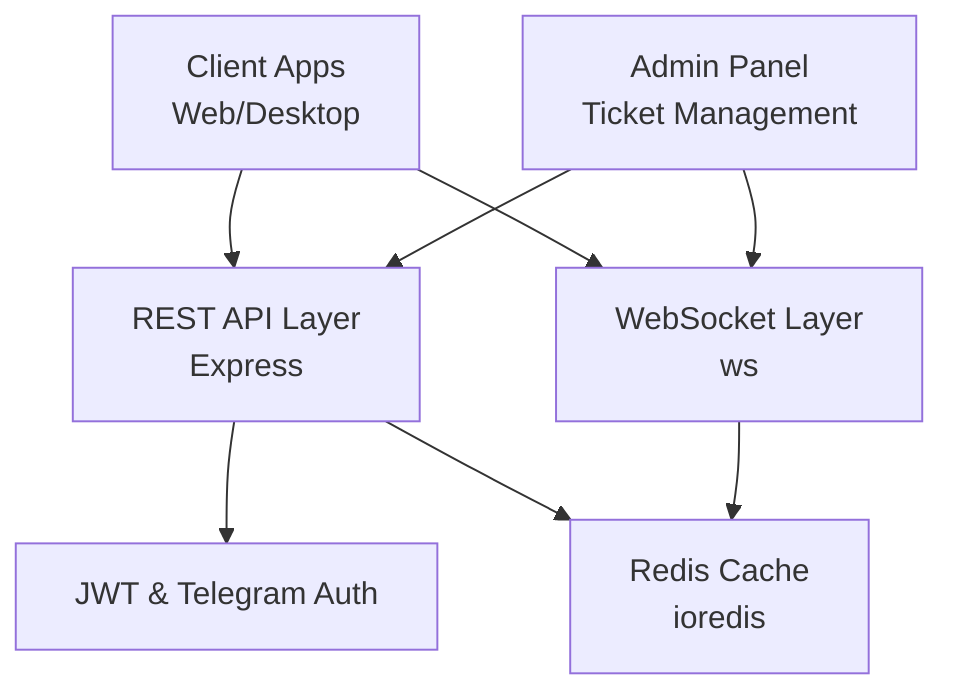
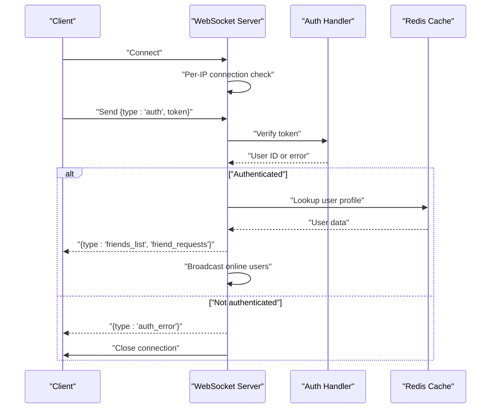
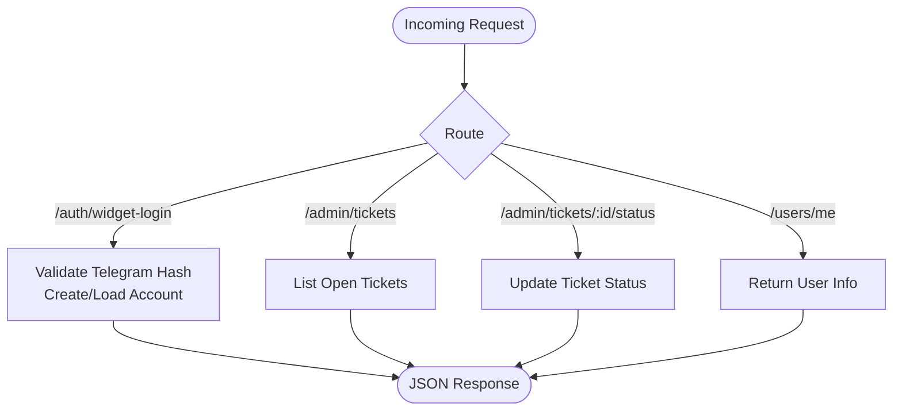
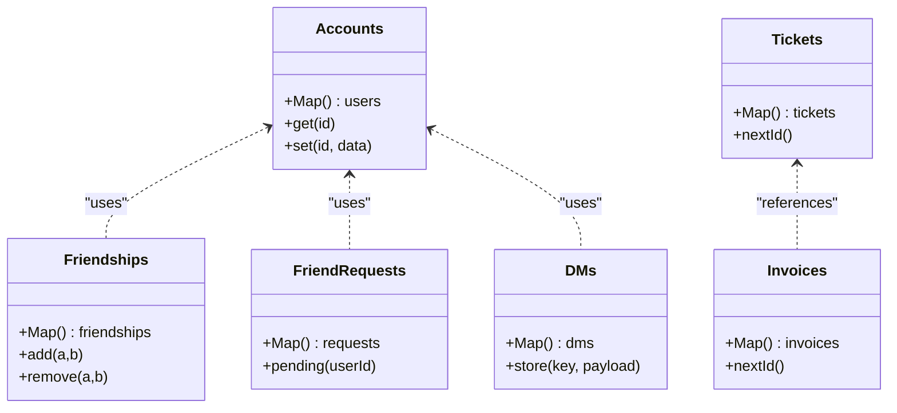
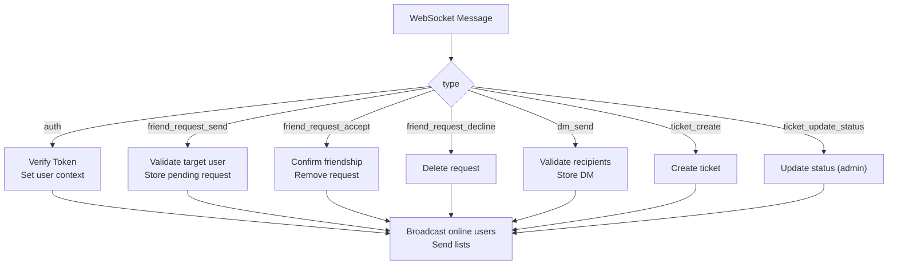
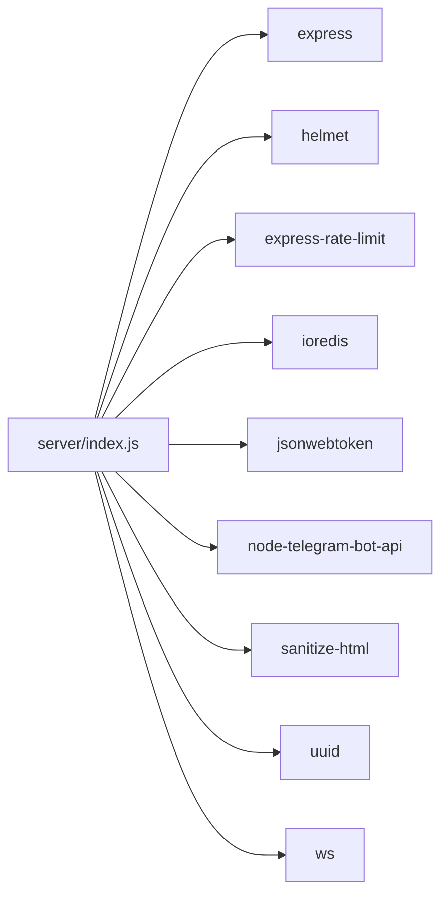
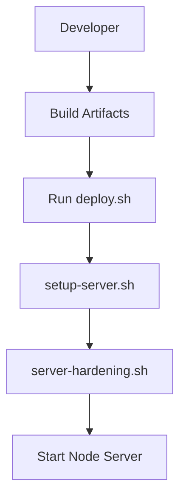

# Backend Services

<cite>
**Referenced Files in This Document**
- [server/index.js](file://server/index.js)
- [server/package.json](file://server/package.json)
- [server/deploy.sh](file://server/deploy.sh)
- [server_index.js](file://server_index.js)
- [scratch/remote_server_index.js](file://scratch/remote_server_index.js)
- [src/lib/api.js](file://src/lib/api.js)
- [website/src/lib/api.js](file://website/src/lib/api.js)
- [scripts/setup-server.sh](file://scripts/setup-server.sh)
- [scripts/server-hardening.sh](file://scripts/server-hardening.sh)
</cite>

## Table of Contents
1. [Introduction](#introduction)
2. [Project Structure](#project-structure)
3. [Core Components](#core-components)
4. [Architecture Overview](#architecture-overview)
5. [Detailed Component Analysis](#detailed-component-analysis)
6. [Dependency Analysis](#dependency-analysis)
7. [Performance Considerations](#performance-considerations)
8. [Security Measures](#security-measures)
9. [Deployment and Scaling](#deployment-and-scaling)
10. [Monitoring, Logging, and Debugging](#monitoring-logging-and-debugging)
11. [API Usage Examples](#api-usage-examples)
12. [Troubleshooting Guide](#troubleshooting-guide)
13. [Conclusion](#conclusion)

## Introduction
This document describes the Node.js backend services for SBGames, focusing on the authentication server, WebSocket real-time communication, and REST API endpoints. The backend is built with Express.js and integrates WebSocket support for live updates, friend requests, tickets, and admin notifications. It also documents database integration patterns, Redis caching strategies, and deployment configurations. Security measures such as rate limiting, input sanitization, and protection against common attacks are explained alongside monitoring and debugging approaches.

## Project Structure
The backend service resides under the server directory and includes:
- An Express server with WebSocket support
- REST endpoints for authentication and administrative tasks
- WebSocket handlers for real-time messaging and user presence
- Package dependencies for security, rate limiting, Redis, JWT, and WebSockets
- Deployment scripts and hardening utilities

**Diagram sources**
- [server/index.js](file://server/index.js)
- [server/package.json](file://server/package.json)

**Section sources**
- [server/package.json:1-19](file://server/package.json#L1-L19)
- [server/index.js](file://server/index.js)

## Core Components
- Express application with middleware for security and CORS
- WebSocket server for real-time communication
- REST endpoints for authentication and administrative operations
- Redis-backed stores for accounts, tickets, friendships, DMs, and invoices
- Rate limiting and input sanitization for resilience and safety
- JWT-based authentication flow for secure sessions

**Section sources**
- [server/index.js](file://server/index.js)
- [server/package.json:6-18](file://server/package.json#L6-L18)

## Architecture Overview
The backend architecture combines REST APIs and WebSocket channels:
- REST endpoints handle authentication, administrative actions, and data retrieval
- WebSocket connections manage real-time messaging, friend requests, tickets, and online presence
- Redis caches user accounts and session-like state for fast access
- Security middleware enforces rate limits and sanitizes inputs

**Diagram sources**
- [server/index.js](file://server/index.js)
- [server/package.json:6-18](file://server/package.json#L6-L18)

## Detailed Component Analysis

### Express Server and Middleware
- Initializes Express app with CORS enabled
- Applies helmet for security headers
- Uses express-rate-limit to protect endpoints
- Provides REST routes for authentication and administrative tasks

**Section sources**
- [server/index.js](file://server/index.js)
- [server/package.json:6-18](file://server/package.json#L6-L18)

### WebSocket Implementation
The WebSocket server manages:
- Connection lifecycle with per-IP connection limits and auth timeouts
- Message parsing with size limits and rate limiting per client window
- Authentication via JWT tokens and Telegram widget verification
- Real-time broadcasts for online users and targeted messages
- Friend request handling, DMs, and ticket notifications for admins

**Diagram sources**
- [server/index.js](file://server/index.js)
- [server/package.json:11-17](file://server/package.json#L11-L17)

**Section sources**
- [server/index.js](file://server/index.js)
- [server_index.js:907-972](file://server_index.js#L907-L972)
- [scratch/remote_server_index.js:870-925](file://scratch/remote_server_index.js#L870-L925)

### REST API Endpoints
Key endpoints include:
- POST /auth/widget-login: Authenticates users via Telegram widget with hash verification
- GET /admin/tickets: Retrieves open tickets for admin panel
- POST /admin/tickets/:id/status: Updates ticket status
- GET /users/me: Returns authenticated user info
- Additional routes for friend requests, DMs, and account management

**Diagram sources**
- [server/index.js](file://server/index.js)

**Section sources**
- [server/index.js](file://server/index.js)

### Data Stores and Caching
- In-memory maps emulate persistent stores for tickets, friendships, friend requests, DMs, and invoices
- Redis cache stores user accounts and session-like state for fast retrieval
- Sanitization ensures safe handling of usernames and messages

**Diagram sources**
- [server/index.js](file://server/index.js)
- [scratch/remote_server_index.js:217-224](file://scratch/remote_server_index.js#L217-L224)

**Section sources**
- [server/index.js](file://server/index.js)
- [scratch/remote_server_index.js:217-233](file://scratch/remote_server_index.js#L217-L233)

### WebSocket Message Types and Flows
Common WebSocket message types:
- auth: Authenticate with token; sets user context and sends friends/friend requests
- friend_request_send: Send a friend request to a user
- friend_request_accept: Accept a pending friend request
- friend_request_decline: Decline a pending friend request
- dm_send: Send a direct message to a friend
- ticket_create: Create a support ticket
- ticket_update_status: Update ticket status (admin)

**Diagram sources**
- [server/index.js](file://server/index.js)
- [server_index.js:945-972](file://server_index.js#L945-L972)
- [scratch/remote_server_index.js:910-925](file://scratch/remote_server_index.js#L910-L925)

**Section sources**
- [server/index.js](file://server/index.js)
- [server_index.js:945-972](file://server_index.js#L945-L972)
- [scratch/remote_server_index.js:910-925](file://scratch/remote_server_index.js#L910-L925)

## Dependency Analysis
The backend depends on:
- Express for HTTP server and routing
- Helmet for security headers
- Express-rate-limit for request throttling
- ioredis for Redis connectivity
- jsonwebtoken for JWT handling
- node-telegram-bot-api for Telegram integration
- sanitize-html for input sanitization
- uuid for generating client identifiers
- ws for WebSocket protocol support

**Diagram sources**
- [server/package.json:6-18](file://server/package.json#L6-L18)

**Section sources**
- [server/package.json:6-18](file://server/package.json#L6-L18)

## Performance Considerations
- WebSocket message size limits and rate limiting prevent abuse and resource exhaustion
- Per-IP connection caps reduce DoS risks
- Redis caching minimizes latency for user lookups and session data
- In-memory maps for transient data (tickets, DMs) avoid unnecessary persistence overhead
- Consider horizontal scaling with sticky sessions or shared Redis for multi-instance deployments

## Security Measures
- Helmet secures HTTP headers
- Express-rate-limit protects REST endpoints from brute force
- Input sanitization for usernames and messages
- WebSocket auth timeout and per-window rate limiting
- Per-IP connection caps and failure tracking
- JWT-based authentication and Telegram widget verification

**Section sources**
- [server/index.js](file://server/index.js)
- [server/package.json:10-17](file://server/package.json#L10-L17)

## Deployment and Scaling
- Start script runs the server using Node.js
- Hardening and setup scripts prepare the environment
- Deployment shell script orchestrates server deployment
- Scale horizontally behind a load balancer with shared Redis for state

**Diagram sources**
- [server/deploy.sh](file://server/deploy.sh)
- [scripts/setup-server.sh](file://scripts/setup-server.sh)
- [scripts/server-hardening.sh](file://scripts/server-hardening.sh)

**Section sources**
- [server/deploy.sh](file://server/deploy.sh)
- [scripts/setup-server.sh](file://scripts/setup-server.sh)
- [scripts/server-hardening.sh](file://scripts/server-hardening.sh)

## Monitoring, Logging, and Debugging
- Console logging for authentication errors and operational events
- WebSocket error handling and connection close reasons
- Use structured logs for audit trails and incident response
- Add metrics collection for request rates, WebSocket connections, and Redis hit ratios

**Section sources**
- [server/index.js](file://server/index.js)
- [server_index.js:951-952](file://server_index.js#L951-L952)

## API Usage Examples
Client-side API usage patterns are demonstrated in:
- Web app API helpers for REST calls
- Website API helpers for admin and user endpoints

These files show how to call REST endpoints and handle responses.

**Section sources**
- [src/lib/api.js](file://src/lib/api.js)
- [website/src/lib/api.js](file://website/src/lib/api.js)

## Troubleshooting Guide
Common issues and resolutions:
- Authentication failures: Verify token validity and Telegram hash correctness
- WebSocket connection closed: Check per-IP limits, auth timeout, and message size limits
- Redis connectivity: Confirm host/port and credentials; ensure keyspace is available
- Rate limiting: Adjust limits in code or middleware configuration
- CORS errors: Ensure origin is whitelisted in Express CORS setup

**Section sources**
- [server/index.js](file://server/index.js)
- [server/package.json:9-10](file://server/package.json#L9-L10)

## Conclusion
The backend provides a robust foundation for authentication, real-time communication, and administrative workflows. By combining Express REST APIs with WebSocket channels, Redis caching, and strong security defaults, it supports scalable and maintainable game-related services. Proper deployment practices, monitoring, and adherence to rate limits ensure reliability under load.