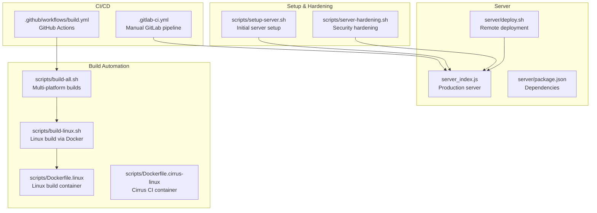
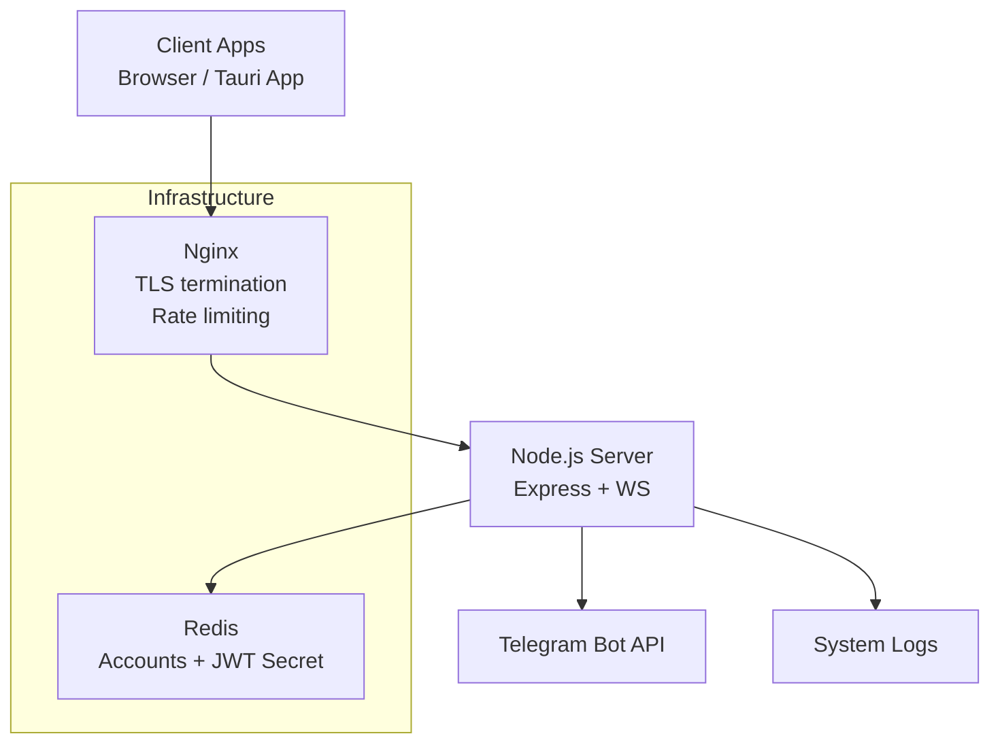
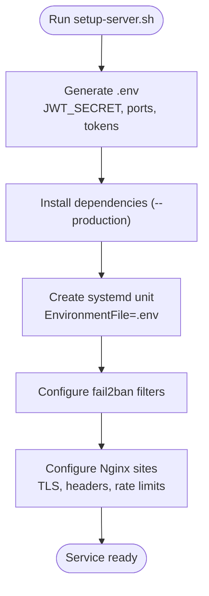
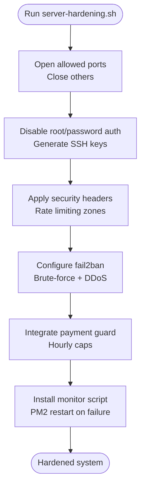
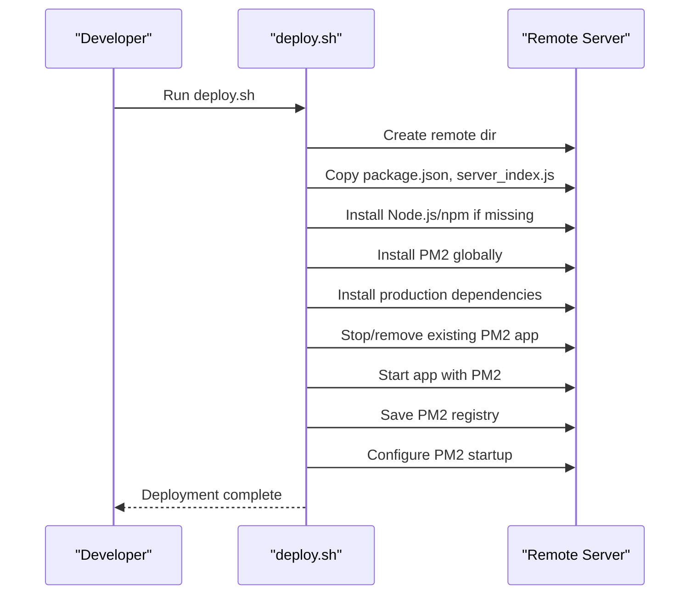
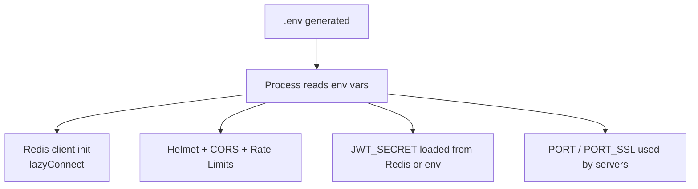
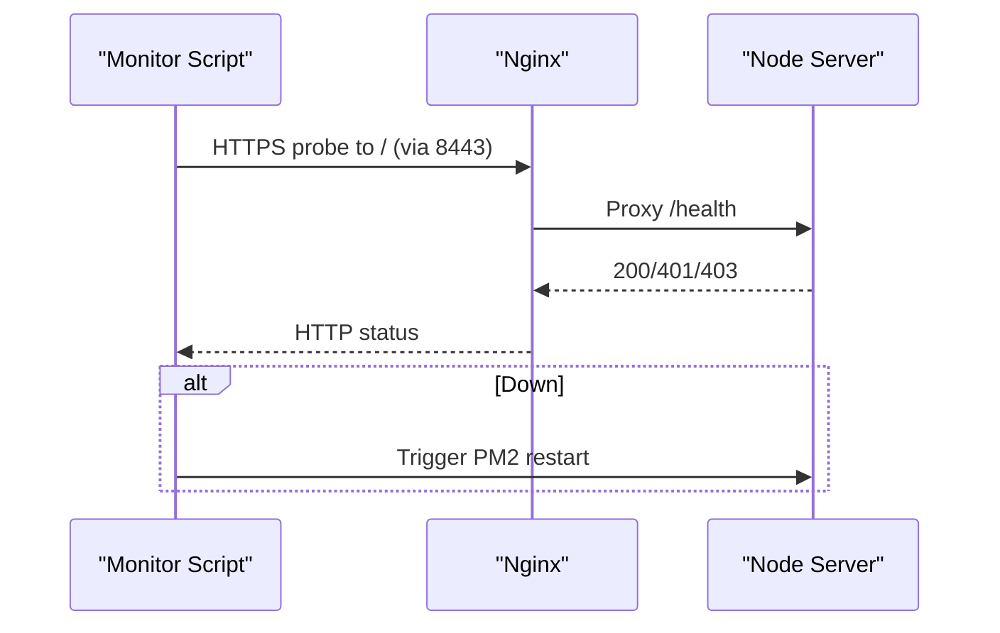
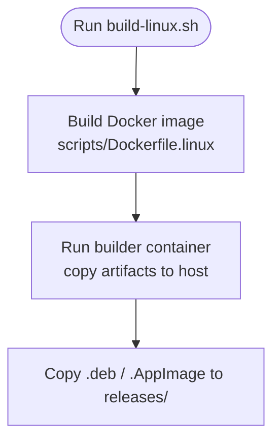
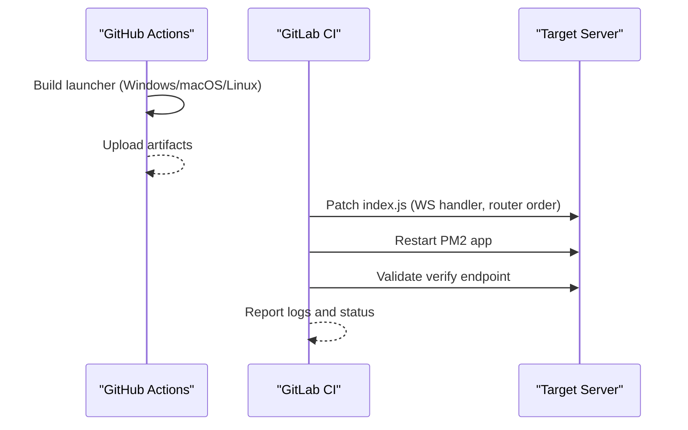
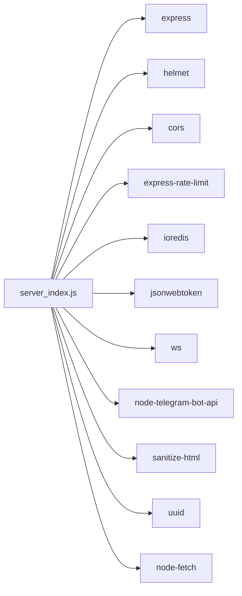

# Deployment & Monitoring

<cite>
**Referenced Files in This Document**
- [setup-server.sh](file://scripts/setup-server.sh)
- [server-hardening.sh](file://scripts/server-hardening.sh)
- [deploy.sh](file://server/deploy.sh)
- [index.js](file://server/index.js)
- [server_index.js](file://server_index.js)
- [package.json](file://server/package.json)
- [build-all.sh](file://scripts/build-all.sh)
- [build-linux.sh](file://scripts/build-linux.sh)
- [Dockerfile.linux](file://scripts/Dockerfile.linux)
- [Dockerfile.cirrus-linux](file://scripts/Dockerfile.cirrus-linux)
- [build.yml](file://.github/workflows/build.yml)
- [.gitlab-ci.yml](file://.gitlab-ci.yml)
</cite>

## Table of Contents
1. [Introduction](#introduction)
2. [Project Structure](#project-structure)
3. [Core Components](#core-components)
4. [Architecture Overview](#architecture-overview)
5. [Detailed Component Analysis](#detailed-component-analysis)
6. [Dependency Analysis](#dependency-analysis)
7. [Performance Considerations](#performance-considerations)
8. [Troubleshooting Guide](#troubleshooting-guide)
9. [Conclusion](#conclusion)
10. [Appendices](#appendices)

## Introduction
This document provides comprehensive deployment and monitoring guidance for the backend services. It covers environment setup, dependency installation, SSL/TLS configuration, service startup, reverse proxy configuration, security hardening, monitoring, backups, scaling, CI/CD automation, and operational procedures. The backend is a Node.js/Express application with WebSocket support, Redis-backed persistence, and integration with a Telegram bot.

## Project Structure
The backend deployment artifacts and automation live primarily under the server directory and supporting scripts:

- server: Production-ready backend server files and deployment scripts
- scripts: Server setup, hardening, and build automation
- .github/workflows: CI pipeline for launcher builds
- .gitlab-ci.yml: Manual deployment pipeline to remote servers

**Diagram sources**
- [setup-server.sh:1-180](file://scripts/setup-server.sh#L1-L180)
- [server-hardening.sh:1-224](file://scripts/server-hardening.sh#L1-L224)
- [deploy.sh:1-26](file://server/deploy.sh#L1-L26)
- [server_index.js:1-800](file://server_index.js#L1-L800)
- [build-all.sh:1-130](file://scripts/build-all.sh#L1-L130)
- [build-linux.sh:1-30](file://scripts/build-linux.sh#L1-L30)
- [Dockerfile.linux:1-47](file://scripts/Dockerfile.linux#L1-L47)
- [Dockerfile.cirrus-linux:1-25](file://scripts/Dockerfile.cirrus-linux#L1-L25)
- [build.yml:1-95](file://.github/workflows/build.yml#L1-L95)
- [.gitlab-ci.yml:1-57](file://.gitlab-ci.yml#L1-L57)

**Section sources**
- [setup-server.sh:1-180](file://scripts/setup-server.sh#L1-L180)
- [server-hardening.sh:1-224](file://scripts/server-hardening.sh#L1-L224)
- [deploy.sh:1-26](file://server/deploy.sh#L1-L26)
- [server_index.js:1-800](file://server_index.js#L1-L800)
- [build-all.sh:1-130](file://scripts/build-all.sh#L1-L130)
- [build-linux.sh:1-30](file://scripts/build-linux.sh#L1-L30)
- [Dockerfile.linux:1-47](file://scripts/Dockerfile.linux#L1-L47)
- [Dockerfile.cirrus-linux:1-25](file://scripts/Dockerfile.cirrus-linux#L1-L25)
- [build.yml:1-95](file://.github/workflows/build.yml#L1-L95)
- [.gitlab-ci.yml:1-57](file://.gitlab-ci.yml#L1-L57)

## Core Components
- Backend server: Express + WebSocket server with Redis-backed persistence and JWT-based authentication
- Reverse proxy: Nginx terminating TLS and proxying to the Node.js server
- Process manager: systemd for service lifecycle and fail2ban for brute-force protection
- CI/CD: GitHub Actions for launcher builds; GitLab CI for manual deployments

Key runtime behaviors:
- Health endpoint: GET /health
- Authentication: Telegram widget and bot flows; JWT issuance
- Rate limiting and security middleware: Helmet, CORS, express-rate-limit, IP blocking
- Redis integration: JWT secret persistence and per-user account storage

**Section sources**
- [server_index.js:1-800](file://server_index.js#L1-L800)
- [index.js:1-800](file://server/index.js#L1-L800)
- [package.json:1-20](file://server/package.json#L1-L20)

## Architecture Overview
The backend architecture integrates a Node.js server with Nginx reverse proxy, Redis for persistence, and Telegram bot integration. The setup script configures systemd, fail2ban, and Nginx.

**Diagram sources**
- [setup-server.sh:89-173](file://scripts/setup-server.sh#L89-L173)
- [server_index.js:27-42](file://server_index.js#L27-L42)
- [index.js:26-35](file://server/index.js#L26-L35)

**Section sources**
- [setup-server.sh:89-173](file://scripts/setup-server.sh#L89-L173)
- [server_index.js:27-42](file://server_index.js#L27-L42)
- [index.js:26-35](file://server/index.js#L26-L35)

## Detailed Component Analysis

### Environment Setup and Initial Deployment
- Generates a secure .env with JWT_SECRET and other variables
- Installs dependencies and sets up systemd service
- Configures fail2ban for authentication brute-force protection
- Sets up Nginx with TLS, security headers, rate limiting, and proxy to Node.js

**Diagram sources**
- [setup-server.sh:7-63](file://scripts/setup-server.sh#L7-L63)
- [setup-server.sh:65-85](file://scripts/setup-server.sh#L65-L85)
- [setup-server.sh:87-173](file://scripts/setup-server.sh#L87-L173)

**Section sources**
- [setup-server.sh:1-180](file://scripts/setup-server.sh#L1-L180)

### Security Hardening and Anti-Fraud Measures
- UFW firewall rules for allowed ports
- SSH hardening and key-based auth
- Nginx security snippets and rate limiting zones
- fail2ban jails for brute force and DDoS
- Payment request guard module with hourly limits
- PM2 monitoring script checking HTTPS reachability

**Diagram sources**
- [server-hardening.sh:5-10](file://scripts/server-hardening.sh#L5-L10)
- [server-hardening.sh:12-18](file://scripts/server-hardening.sh#L12-L18)
- [server-hardening.sh:20-54](file://scripts/server-hardening.sh#L20-L54)
- [server-hardening.sh:62-105](file://scripts/server-hardening.sh#L62-L105)
- [server-hardening.sh:107-188](file://scripts/server-hardening.sh#L107-L188)
- [server-hardening.sh:195-207](file://scripts/server-hardening.sh#L195-L207)

**Section sources**
- [server-hardening.sh:1-224](file://scripts/server-hardening.sh#L1-L224)

### Production Deployment Script (deploy.sh)
Automates remote deployment to a target server:
- Copies package.json and server_index.js
- Ensures Node.js and PM2 are installed
- Installs production dependencies
- Starts/stops PM2 managed process and persists configuration

**Diagram sources**
- [deploy.sh:1-26](file://server/deploy.sh#L1-L26)

**Section sources**
- [deploy.sh:1-26](file://server/deploy.sh#L1-L26)

### Environment Variables and Configuration
- .env generation includes JWT_SECRET, ports, Telegram bot token, admin identifiers, and environment mode
- Runtime variables are read from process.env in server_index.js
- Redis connection configured lazily with fallback to in-memory stores
- Security middleware applies Helmet, CORS, and rate limits

**Diagram sources**
- [setup-server.sh:14-26](file://scripts/setup-server.sh#L14-L26)
- [server_index.js:16-43](file://server_index.js#L16-L43)
- [server_index.js:27-42](file://server_index.js#L27-L42)

**Section sources**
- [setup-server.sh:14-26](file://scripts/setup-server.sh#L14-L26)
- [server_index.js:16-43](file://server_index.js#L16-L43)
- [server_index.js:27-42](file://server_index.js#L27-L42)

### Health Checks and Monitoring
- Health endpoint: GET /health returns basic metrics
- PM2 monitor script checks HTTPS reachability and restarts on failure
- Nginx access logs used by fail2ban for DDoS detection
- systemd service configured with automatic restart on failure

**Diagram sources**
- [server_hardening.sh:196-207](file://scripts/server-hardening.sh#L196-L207)
- [server_index.js:353-353](file://server_index.js#L353-L353)

**Section sources**
- [server_hardening.sh:196-207](file://scripts/server-hardening.sh#L196-L207)
- [server_index.js:353-353](file://server_index.js#L353-L353)

### Logging Configuration
- Request IDs attached to each request for correlation
- Security events logged (blocked IPs, failed attempts)
- PM2 logs used for diagnostics
- Nginx logs consumed by fail2ban

**Section sources**
- [server_index.js:207-210](file://server_index.js#L207-L210)
- [server_index.js:178-176](file://server_index.js#L178-L176)
- [server_hardening.sh:209-210](file://scripts/server_hardening.sh#L209-L210)

### Docker Deployment Options
- Linux build via Docker: scripts/build-linux.sh orchestrates Docker build and artifact copy
- Dockerfile.linux installs system dependencies, Node.js, Rust, and compiles Tauri
- Dockerfile.cirrus-linux provides minimal dependencies for CI environments

**Diagram sources**
- [build-linux.sh:11-19](file://scripts/build-linux.sh#L11-L19)
- [Dockerfile.linux:6-25](file://scripts/Dockerfile.linux#L6-L25)
- [Dockerfile.cirrus-linux:5-22](file://scripts/Dockerfile.cirrus-linux#L5-L22)

**Section sources**
- [build-linux.sh:1-30](file://scripts/build-linux.sh#L1-L30)
- [Dockerfile.linux:1-47](file://scripts/Dockerfile.linux#L1-L47)
- [Dockerfile.cirrus-linux:1-25](file://scripts/Dockerfile.cirrus-linux#L1-L25)

### CI/CD Pipeline and Automated Testing
- GitHub Actions: Builds Windows/macOS/Linux launcher artifacts and uploads as artifacts
- GitLab CI: Manual pipeline to patch server code, restart PM2, and validate verify endpoint

**Diagram sources**
- [build.yml:1-95](file://.github/workflows/build.yml#L1-L95)
- [.gitlab-ci.yml:18-56](file://.gitlab-ci.yml#L18-L56)

**Section sources**
- [build.yml:1-95](file://.github/workflows/build.yml#L1-L95)
- [.gitlab-ci.yml:1-57](file://.gitlab-ci.yml#L1-L57)

### Backup Strategies, Database Maintenance, and Redis Configuration
- Redis-backed JWT secret persistence and account storage
- In-memory fallback when Redis is unavailable
- Periodic Redis persistence and backup procedures recommended outside this repository

**Section sources**
- [server_index.js:31-42](file://server_index.js#L31-L42)
- [server_index.js:45-78](file://server_index.js#L45-L78)
- [index.js:26-35](file://server/index.js#L26-L35)

### Scaling Considerations, Load Balancing, and High Availability
- Current setup uses a single Node.js process behind Nginx
- Recommended enhancements:
  - Horizontal scaling with multiple Node.js instances behind Nginx
  - Sticky sessions or shared Redis for session state
  - Redis Sentinel or cluster for HA Redis
  - Reverse proxy health checks and auto-healing

[No sources needed since this section provides general guidance]

### Reverse Proxy and TLS Configuration
- Nginx terminates TLS with strong ciphers and security headers
- Rate limiting and connection limits applied
- Proxies API traffic to Node.js on localhost

**Section sources**
- [setup-server.sh:89-173](file://scripts/setup-server.sh#L89-L173)

### systemd Service Configuration
- Service unit defines user, working directory, environment file, and restart policy
- Hardening flags enabled (NoNewPrivileges, PrivateTmp, ProtectSystem, etc.)

**Section sources**
- [setup-server.sh:31-63](file://scripts/setup-server.sh#L31-L63)

## Dependency Analysis
Runtime dependencies include Express, Helmet, CORS, rate limiting, Redis, JWT, WebSocket, and Telegram bot integration.

**Diagram sources**
- [package.json:6-18](file://server/package.json#L6-L18)

**Section sources**
- [package.json:1-20](file://server/package.json#L1-L20)

## Performance Considerations
- Use Nginx rate limiting and connection limits to protect upstream
- Tune Redis latency and persistence for account and JWT secret storage
- Enable compression and caching for static assets served by Nginx
- Monitor WebSocket connection counts and implement graceful disconnects

[No sources needed since this section provides general guidance]

## Troubleshooting Guide
Common issues and resolutions:
- Service fails to start: Check systemd logs and .env permissions
- TLS handshake errors: Verify certificate paths and permissions
- Too many 429 responses: Review Nginx and application rate limits
- Redis connectivity: Confirm Redis is reachable and lazyConnect fallback is acceptable
- PM2 restart loops: Inspect monitor script and HTTPS probe

**Section sources**
- [setup-server.sh:31-63](file://scripts/setup-server.sh#L31-L63)
- [setup-server.sh:89-173](file://scripts/setup-server.sh#L89-L173)
- [server_hardening.sh:196-207](file://scripts/server_hardening.sh#L196-L207)

## Conclusion
The backend deployment leverages a robust stack with Nginx, systemd, fail2ban, and PM2 for reliability and security. The provided scripts automate initial setup, hardening, and remote deployment. CI/CD pipelines support launcher builds and controlled backend deployments. For production, consider horizontal scaling, Redis HA, and centralized logging.

[No sources needed since this section summarizes without analyzing specific files]

## Appendices

### Appendix A: Environment Variables Reference
- BOT_TOKEN: Telegram bot token
- JWT_SECRET: Cryptographically secure secret persisted in Redis
- ADMIN_TG_IDS: Comma-separated admin Telegram IDs
- ADMIN_USERNAMES: Comma-separated admin usernames
- PORT: HTTP port for Node.js
- PORT_SSL: HTTPS port for Node.js
- NODE_ENV: Environment mode

**Section sources**
- [setup-server.sh:14-26](file://scripts/setup-server.sh#L14-L26)
- [server_index.js:16-22](file://server_index.js#L16-L22)

### Appendix B: Key Endpoints
- GET /health: Basic health and metrics
- POST /auth/tg-login: Login via Telegram
- POST /auth/widget-login: Login via Telegram widget
- GET /online: Online users
- GET /support/tickets: Admin-only ticket listing

**Section sources**
- [server_index.js:353-353](file://server_index.js#L353-L353)
- [server_index.js:246-306](file://server_index.js#L246-L306)
- [server_index.js:376-378](file://server_index.js#L376-L378)
- [server_index.js:380-389](file://server_index.js#L380-L389)