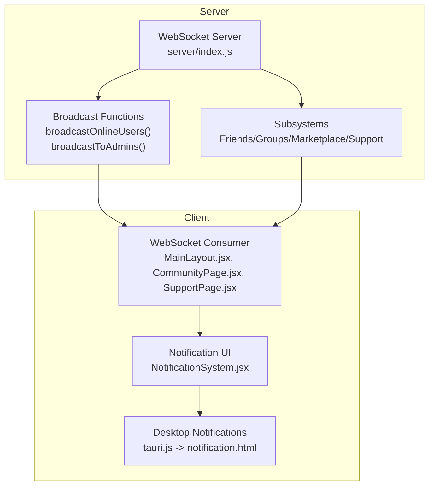
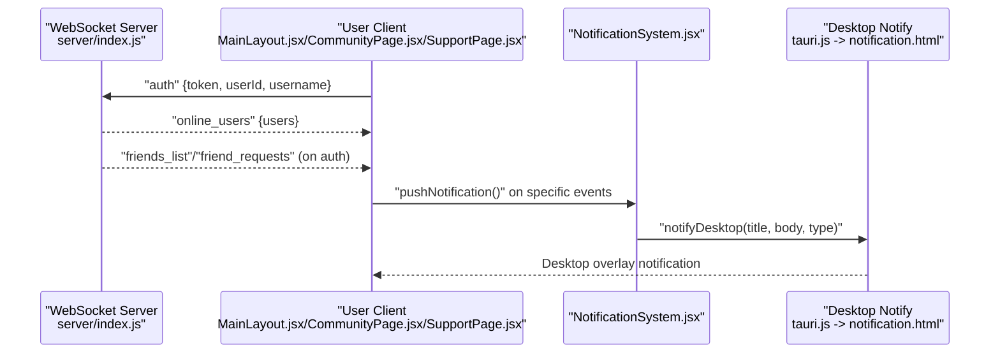
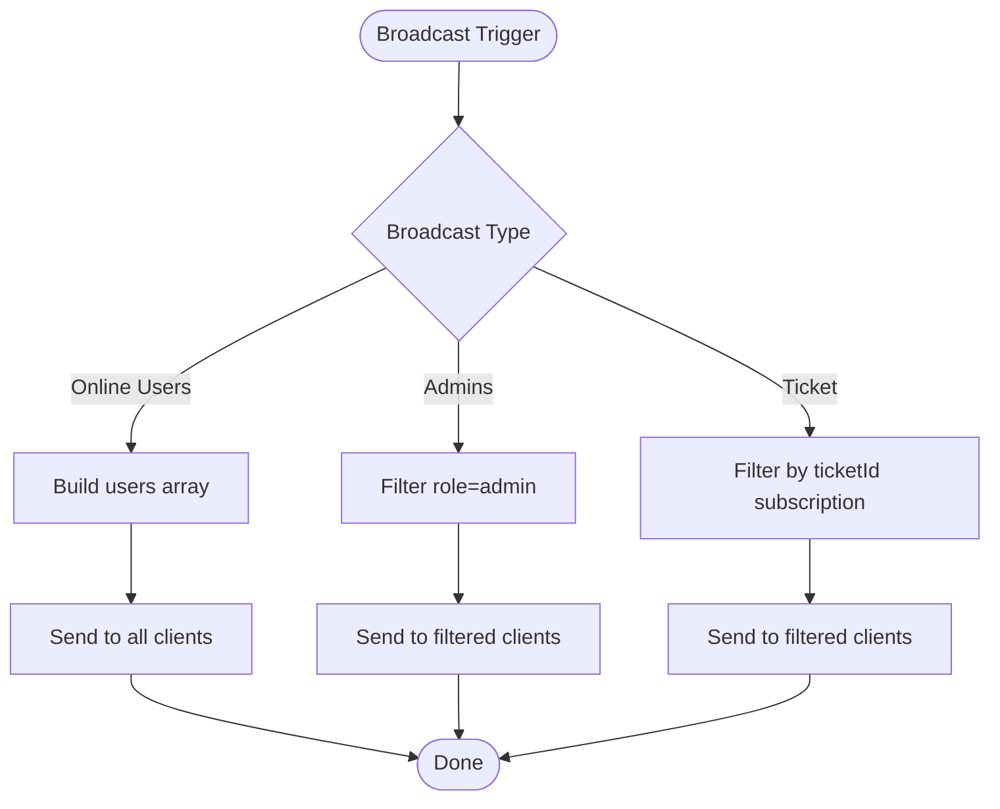
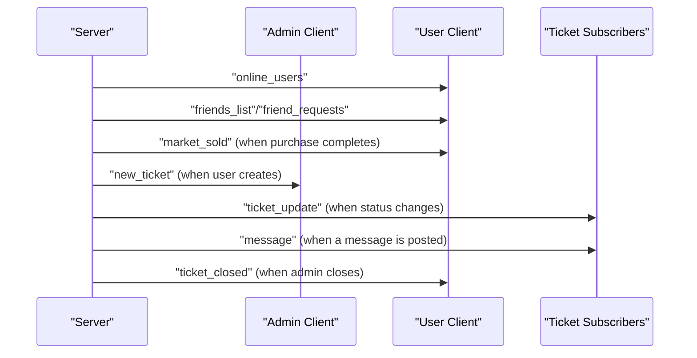
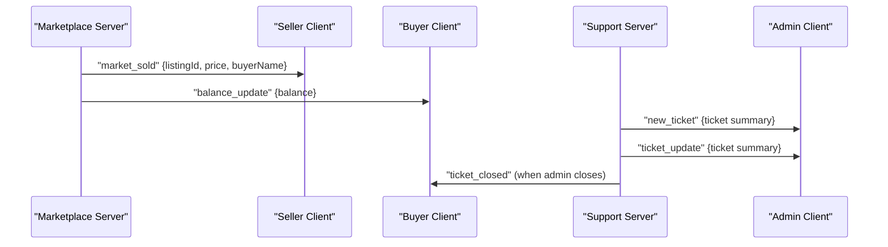
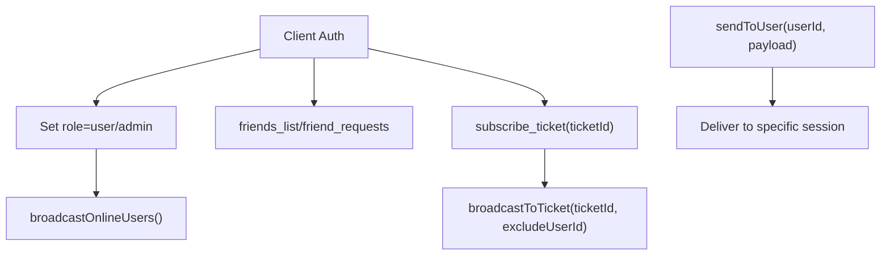
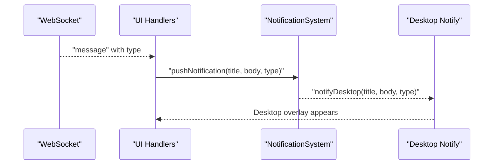
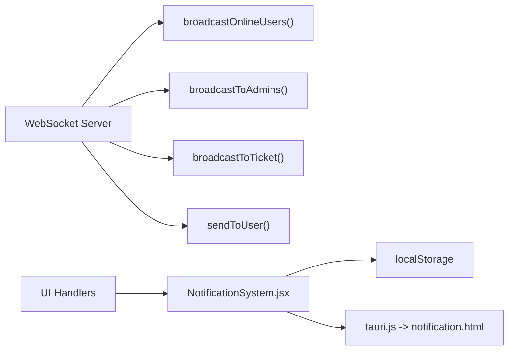

# Broadcasting & Notification Mechanisms

<cite>
**Referenced Files in This Document**
- [server/index.js](file://server/index.js)
- [server_index.js](file://server_index.js)
- [scratch/remote_server_index.js](file://scratch/remote_server_index.js)
- [src/pages/MainLayout.jsx](file://src/pages/MainLayout.jsx)
- [src/pages/CommunityPage.jsx](file://src/pages/CommunityPage.jsx)
- [src/pages/SupportPage.jsx](file://src/pages/SupportPage.jsx)
- [src/components/NotificationSystem.jsx](file://src/components/NotificationSystem.jsx)
- [src/lib/tauri.js](file://src/lib/tauri.js)
- [public/notification.html](file://public/notification.html)
- [dist-tray/notification.html](file://dist-tray/notification.html)
</cite>

## Table of Contents
1. [Introduction](#introduction)
2. [Project Structure](#project-structure)
3. [Core Components](#core-components)
4. [Architecture Overview](#architecture-overview)
5. [Detailed Component Analysis](#detailed-component-analysis)
6. [Dependency Analysis](#dependency-analysis)
7. [Performance Considerations](#performance-considerations)
8. [Troubleshooting Guide](#troubleshooting-guide)
9. [Conclusion](#conclusion)

## Introduction
This document explains the real-time broadcasting and notification mechanisms used across the SBGames platform. It covers broadcast functions such as online user lists, admin-only broadcasts, and targeted user notifications. It documents notification triggers for friend requests, group invitations, marketplace transactions, and support ticket updates. It also describes admin notification broadcasting for new tickets and system alerts, notification delivery patterns, user targeting, filtering, and integration with subsystems (friends, groups, marketplace, support). Finally, it outlines monitoring approaches for broadcast effectiveness and delivery tracking.

## Project Structure
The notification and broadcasting system spans three primary areas:
- Real-time server: WebSocket connections, broadcast functions, and per-subsystem event handling
- Frontend client: WebSocket consumers, toast notifications, and desktop notifications via Tauri
- Desktop notification windows: HTML overlays rendered by Tauri for persistent desktop alerts

**Diagram sources**
- [server/index.js:761-964](file://server/index.js#L761-L964)
- [src/pages/MainLayout.jsx:61-88](file://src/pages/MainLayout.jsx#L61-L88)
- [src/pages/CommunityPage.jsx:164-196](file://src/pages/CommunityPage.jsx#L164-L196)
- [src/pages/SupportPage.jsx:76-273](file://src/pages/SupportPage.jsx#L76-L273)
- [src/components/NotificationSystem.jsx:1-102](file://src/components/NotificationSystem.jsx#L1-L102)
- [src/lib/tauri.js:19-84](file://src/lib/tauri.js#L19-L84)

**Section sources**
- [server/index.js:761-964](file://server/index.js#L761-L964)
- [src/pages/MainLayout.jsx:61-88](file://src/pages/MainLayout.jsx#L61-L88)
- [src/pages/CommunityPage.jsx:164-196](file://src/pages/CommunityPage.jsx#L164-L196)
- [src/pages/SupportPage.jsx:76-273](file://src/pages/SupportPage.jsx#L76-L273)
- [src/components/NotificationSystem.jsx:1-102](file://src/components/NotificationSystem.jsx#L1-L102)
- [src/lib/tauri.js:19-84](file://src/lib/tauri.js#L19-L84)

## Core Components
- Broadcast functions
  - broadcastOnlineUsers(): Sends the current online user list to all connected clients
  - broadcastToAdmins(): Sends a payload to all clients marked as admin
  - broadcastToTicket(): Sends a payload to all clients subscribed to a specific ticket
- Subsystem-specific notifications
  - Friends: friend_request_received, friend_accepted, friend_error, friends_list, friend_requests
  - Groups: group_invite, group_update, group_message
  - Marketplace: market_sold
  - Support: new_ticket, ticket_update, ticket_messages, ticket_closed, message, admin_ready
- Client-side notification pipeline
  - WebSocket message handlers dispatch to notification UI and desktop notifications
  - NotificationSystem.jsx manages toast queue, persistence, and badge counts
  - tauri.js handles desktop notification windows via Tauri WebviewWindow

**Section sources**
- [server/index.js:786-787](file://server/index.js#L786-L787)
- [server/index.js:936-943](file://server/index.js#L936-L943)
- [server/index.js:964-964](file://server/index.js#L964-L964)
- [server_index.js:230-230](file://server_index.js#L230-L230)
- [server_index.js:394-394](file://server_index.js#L394-L394)
- [server_index.js:454-454](file://server_index.js#L454-L454)
- [server_index.js:476-476](file://server_index.js#L476-L476)
- [server_index.js:489-489](file://server_index.js#L489-L489)
- [server_index.js:599-599](file://server_index.js#L599-L599)
- [server_index.js:767-771](file://server_index.js#L767-L771)
- [server_index.js:821-821](file://server_index.js#L821-L821)
- [server_index.js:831-831](file://server_index.js#L831-L831)
- [server_index.js:841-841](file://server_index.js#L841-L841)
- [server_index.js:931-931](file://server_index.js#L931-L931)
- [server_index.js:944-944](file://server_index.js#L944-L944)
- [server_index.js:955-955](file://server_index.js#L955-L955)
- [server_index.js:970-970](file://server_index.js#L970-L970)
- [server_index.js:971-971](file://server_index.js#L971-L971)
- [server_index.js:975-975](file://server_index.js#L975-L975)
- [server_index.js:995-995](file://server_index.js#L995-L995)
- [server_index.js:1009-1009](file://server_index.js#L1009-L1009)
- [server_index.js:1010-1010](file://server_index.js#L1010-L1010)
- [server_index.js:1038-1038](file://server_index.js#L1038-L1038)
- [server_index.js:1039-1039](file://server_index.js#L1039-L1039)
- [server_index.js:1042-1042](file://server_index.js#L1042-L1042)
- [server_index.js:1069-1069](file://server_index.js#L1069-L1069)
- [server_index.js:1076-1076](file://server_index.js#L1076-L1076)
- [scratch/remote_server_index.js:1082-1089](file://scratch/remote_server_index.js#L1082-L1089)
- [src/pages/MainLayout.jsx:61-88](file://src/pages/MainLayout.jsx#L61-L88)
- [src/pages/CommunityPage.jsx:164-196](file://src/pages/CommunityPage.jsx#L164-L196)
- [src/pages/SupportPage.jsx:91-100](file://src/pages/SupportPage.jsx#L91-L100)
- [src/pages/SupportPage.jsx:259-271](file://src/pages/SupportPage.jsx#L259-L271)
- [src/components/NotificationSystem.jsx:15-21](file://src/components/NotificationSystem.jsx#L15-L21)
- [src/components/NotificationSystem.jsx:37-52](file://src/components/NotificationSystem.jsx#L37-L52)
- [src/lib/tauri.js:19-84](file://src/lib/tauri.js#L19-L84)

## Architecture Overview
The system uses a WebSocket-based real-time protocol with typed message types. Clients authenticate and receive targeted updates. Admins receive special broadcasts for support ticket management. Notifications are delivered to the UI and optionally shown as desktop alerts.

**Diagram sources**
- [server/index.js:773-787](file://server/index.js#L773-L787)
- [src/pages/MainLayout.jsx:61-88](file://src/pages/MainLayout.jsx#L61-L88)
- [src/pages/CommunityPage.jsx:164-196](file://src/pages/CommunityPage.jsx#L164-L196)
- [src/pages/SupportPage.jsx:91-100](file://src/pages/SupportPage.jsx#L91-L100)
- [src/components/NotificationSystem.jsx:37-52](file://src/components/NotificationSystem.jsx#L37-L52)
- [src/lib/tauri.js:19-84](file://src/lib/tauri.js#L19-L84)

## Detailed Component Analysis

### Broadcast Functions
- broadcastOnlineUsers(): Iterates all connected clients and sends the online user list to each client
- broadcastToAdmins(): Filters clients by role=admin and sends the given payload
- broadcastToTicket(): Filters clients by ticket subscription and sends the given payload

**Diagram sources**
- [scratch/remote_server_index.js:1082-1089](file://scratch/remote_server_index.js#L1082-L1089)
- [server/index.js:786-787](file://server/index.js#L786-L787)
- [server/index.js:936-943](file://server/index.js#L936-L943)
- [server/index.js:964-964](file://server/index.js#L964-L964)

**Section sources**
- [scratch/remote_server_index.js:1082-1089](file://scratch/remote_server_index.js#L1082-L1089)
- [server/index.js:786-787](file://server/index.js#L786-L787)
- [server/index.js:936-943](file://server/index.js#L936-L943)
- [server/index.js:964-964](file://server/index.js#L964-L964)

### Notification Delivery Patterns
- Online user list broadcast: Sent to all clients upon successful authentication and on connection/disconnection events
- Targeted user notifications: Sent via sendToUser(userId, payload) to specific user sessions
- Admin-only notifications: Sent via broadcastToAdmins() for support ticket updates and new tickets
- Ticket-scoped notifications: Clients subscribe to a ticket; server broadcasts to all subscribers excluding the sender

**Diagram sources**
- [server/index.js:786-787](file://server/index.js#L786-L787)
- [server_index.js:394-394](file://server_index.js#L394-L394)
- [server_index.js:476-476](file://server_index.js#L476-L476)
- [server_index.js:489-489](file://server_index.js#L489-L489)
- [server_index.js:767-771](file://server_index.js#L767-L771)
- [server_index.js:995-995](file://server_index.js#L995-L995)
- [server_index.js:1009-1009](file://server_index.js#L1009-L1009)
- [server_index.js:1010-1010](file://server_index.js#L1010-L1010)
- [server_index.js:1038-1038](file://server_index.js#L1038-L1038)
- [server_index.js:1039-1039](file://server_index.js#L1039-L1039)
- [server_index.js:1042-1042](file://server_index.js#L1042-L1042)

**Section sources**
- [server/index.js:786-787](file://server/index.js#L786-L787)
- [server_index.js:394-394](file://server_index.js#L394-L394)
- [server_index.js:476-476](file://server_index.js#L476-L476)
- [server_index.js:489-489](file://server_index.js#L489-L489)
- [server_index.js:767-771](file://server_index.js#L767-L771)
- [server_index.js:995-995](file://server_index.js#L995-L995)
- [server_index.js:1009-1009](file://server_index.js#L1009-L1009)
- [server_index.js:1010-1010](file://server_index.js#L1010-L1010)
- [server_index.js:1038-1038](file://server_index.js#L1038-L1038)
- [server_index.js:1039-1039](file://server_index.js#L1039-L1039)
- [server_index.js:1042-1042](file://server_index.js#L1042-L1042)

### Notification Triggers and Real-Time Alerts
- Balance update: Sent to the affected user after marketplace purchase/cancel
- Friend request lifecycle: friend_request_received, friend_accepted, friend_error, friends_list, friend_requests
- Group lifecycle: group_invite, group_update, group_message
- Marketplace: market_sold (seller receives notification)
- Support: new_ticket, ticket_update, ticket_messages, ticket_closed, message, admin_ready

**Diagram sources**
- [server_index.js:767-771](file://server_index.js#L767-L771)
- [server_index.js:454-454](file://server_index.js#L454-L454)
- [server_index.js:394-394](file://server_index.js#L394-L394)
- [server_index.js:476-476](file://server_index.js#L476-L476)
- [server_index.js:995-995](file://server_index.js#L995-L995)

**Section sources**
- [server_index.js:767-771](file://server_index.js#L767-L771)
- [server_index.js:454-454](file://server_index.js#L454-L454)
- [server_index.js:394-394](file://server_index.js#L394-L394)
- [server_index.js:476-476](file://server_index.js#L476-L476)
- [server_index.js:995-995](file://server_index.js#L995-L995)

### User Targeting and Filtering
- Authentication and role assignment: On auth, clients are tagged with role=user/admin; online list reflects role
- Subscription model: Clients can subscribe to a specific ticket; server filters broadcasts to subscribers
- Per-user delivery: sendToUser(userId, payload) routes messages to a specific session

**Diagram sources**
- [server/index.js:773-787](file://server/index.js#L773-L787)
- [server/index.js:936-943](file://server/index.js#L936-L943)
- [server_index.js:230-230](file://server_index.js#L230-L230)

**Section sources**
- [server/index.js:773-787](file://server/index.js#L773-L787)
- [server/index.js:936-943](file://server/index.js#L936-L943)
- [server_index.js:230-230](file://server_index.js#L230-L230)

### Integration with Subsystems
- Friends: Request lifecycle handled via WebSocket messages; UI updates badges and shows notifications
- Groups: Invite and membership updates sent to all group members
- Marketplace: Purchase completion triggers seller notification and buyer balance update
- Support: Ticket creation, updates, and closure trigger targeted and admin broadcasts

**Section sources**
- [server_index.js:767-771](file://server_index.js#L767-L771)
- [server_index.js:821-821](file://server_index.js#L821-L821)
- [server_index.js:831-831](file://server_index.js#L831-L831)
- [server_index.js:841-841](file://server_index.js#L841-L841)
- [server_index.js:931-931](file://server_index.js#L931-L931)
- [server_index.js:944-944](file://server_index.js#L944-L944)
- [server_index.js:955-955](file://server_index.js#L955-L955)
- [server_index.js:970-970](file://server_index.js#L970-L970)
- [server_index.js:971-971](file://server_index.js#L971-L971)
- [server_index.js:975-975](file://server_index.js#L975-L975)
- [server_index.js:995-995](file://server_index.js#L995-L995)
- [server_index.js:1009-1009](file://server_index.js#L1009-L1009)
- [server_index.js:1010-1010](file://server_index.js#L1010-L1010)
- [server_index.js:1038-1038](file://server_index.js#L1038-L1038)
- [server_index.js:1039-1039](file://server_index.js#L1039-L1039)
- [server_index.js:1042-1042](file://server_index.js#L1042-L1042)

### Client-Side Notification Pipeline
- WebSocket message handlers in MainLayout.jsx, CommunityPage.jsx, and SupportPage.jsx react to server events and trigger UI notifications
- NotificationSystem.jsx maintains a toast stack, persists notifications to local storage, and supports marking as read/clearing
- tauri.js renders a transient desktop notification window positioned near the system tray

**Diagram sources**
- [src/pages/MainLayout.jsx:61-88](file://src/pages/MainLayout.jsx#L61-L88)
- [src/pages/CommunityPage.jsx:164-196](file://src/pages/CommunityPage.jsx#L164-L196)
- [src/pages/SupportPage.jsx:91-100](file://src/pages/SupportPage.jsx#L91-L100)
- [src/pages/SupportPage.jsx:259-271](file://src/pages/SupportPage.jsx#L259-L271)
- [src/components/NotificationSystem.jsx:37-52](file://src/components/NotificationSystem.jsx#L37-L52)
- [src/lib/tauri.js:19-84](file://src/lib/tauri.js#L19-L84)

**Section sources**
- [src/pages/MainLayout.jsx:61-88](file://src/pages/MainLayout.jsx#L61-L88)
- [src/pages/CommunityPage.jsx:164-196](file://src/pages/CommunityPage.jsx#L164-L196)
- [src/pages/SupportPage.jsx:91-100](file://src/pages/SupportPage.jsx#L91-L100)
- [src/pages/SupportPage.jsx:259-271](file://src/pages/SupportPage.jsx#L259-L271)
- [src/components/NotificationSystem.jsx:15-21](file://src/components/NotificationSystem.jsx#L15-L21)
- [src/components/NotificationSystem.jsx:37-52](file://src/components/NotificationSystem.jsx#L37-L52)
- [src/lib/tauri.js:19-84](file://src/lib/tauri.js#L19-L84)

## Dependency Analysis
- Server depends on WebSocket client registry and role metadata to route broadcasts
- Subsystems generate notifications and call broadcast/send helpers
- Client-side components depend on WebSocket connectivity and Tauri for desktop notifications
- Persistence: NotificationSystem.jsx stores notifications in local storage for inbox history

**Diagram sources**
- [scratch/remote_server_index.js:1082-1089](file://scratch/remote_server_index.js#L1082-L1089)
- [server_index.js:230-230](file://server_index.js#L230-L230)
- [src/components/NotificationSystem.jsx:26-29](file://src/components/NotificationSystem.jsx#L26-L29)
- [src/lib/tauri.js:19-84](file://src/lib/tauri.js#L19-L84)

**Section sources**
- [scratch/remote_server_index.js:1082-1089](file://scratch/remote_server_index.js#L1082-L1089)
- [server_index.js:230-230](file://server_index.js#L230-L230)
- [src/components/NotificationSystem.jsx:26-29](file://src/components/NotificationSystem.jsx#L26-L29)
- [src/lib/tauri.js:19-84](file://src/lib/tauri.js#L19-L84)

## Performance Considerations
- Broadcast fan-out: broadcastOnlineUsers() iterates all clients; keep user lists manageable
- Admin fan-out: broadcastToAdmins() filters by role; ensure minimal overhead
- Ticket fan-out: broadcastToTicket() filters by ticketId; maintain efficient subscription tracking
- Rate limiting: No explicit rate limiting is present in the referenced code; consider adding per-client counters and throttling for high-frequency events
- Persistence limits: NotificationSystem.jsx caps inbox size and toast count; adjust thresholds based on UX needs
- Network efficiency: Batch updates where possible; avoid redundant broadcasts

[No sources needed since this section provides general guidance]

## Troubleshooting Guide
- Authentication failures: Clients receive auth_error and the connection is closed; verify token validity and sanitization
- Connection drops: On close/error, server updates online counts and removes client; client attempts reconnection
- Notification not appearing: Verify WebSocket connectivity, message type handling, and desktop notification permissions
- Desktop notification window issues: tauri.js attempts to reuse a WebviewWindow; errors during navigation or show/hide are caught and retried

**Section sources**
- [server/index.js:773-780](file://server/index.js#L773-L780)
- [server/index.js:964-964](file://server/index.js#L964-L964)
- [scratch/remote_server_index.js:910-921](file://scratch/remote_server_index.js#L910-L921)
- [scratch/remote_server_index.js:1065-1078](file://scratch/remote_server_index.js#L1065-L1078)
- [src/lib/tauri.js:38-55](file://src/lib/tauri.js#L38-L55)

## Conclusion
The SBGames real-time system combines WebSocket-based messaging with targeted and broadcast notifications across friends, groups, marketplace, and support. Admins receive specialized updates for ticket management, while users receive contextual alerts for purchases, friend actions, and support interactions. The client-side notification pipeline integrates toast UI and desktop overlays. While the current implementation focuses on correctness and coverage of subsystem events, future enhancements could include explicit rate limiting, prioritization queues, and delivery tracking metrics for improved reliability and observability.