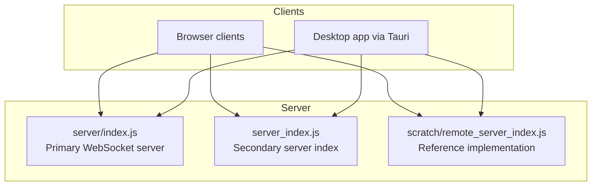
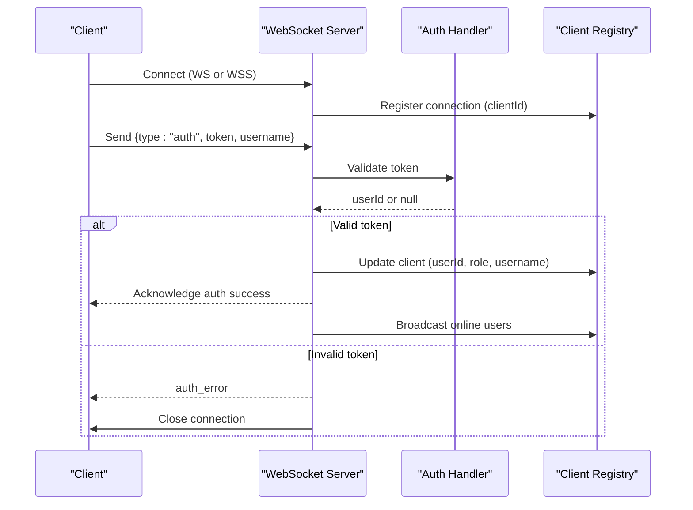
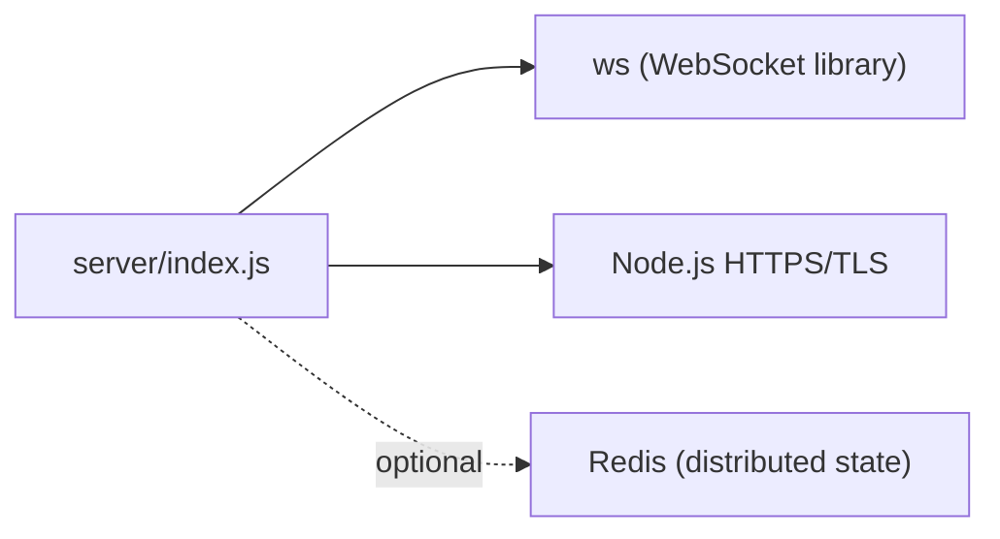

# Connection Scaling & Monitoring

<cite>
**Referenced Files in This Document**
- [server/index.js](file://server/index.js)
- [server_index.js](file://server_index.js)
- [scratch/remote_server_index.js](file://scratch/remote_server_index.js)
</cite>

## Table of Contents
1. [Introduction](#introduction)
2. [Project Structure](#project-structure)
3. [Core Components](#core-components)
4. [Architecture Overview](#architecture-overview)
5. [Detailed Component Analysis](#detailed-component-analysis)
6. [Dependency Analysis](#dependency-analysis)
7. [Performance Considerations](#performance-considerations)
8. [Troubleshooting Guide](#troubleshooting-guide)
9. [Conclusion](#conclusion)

## Introduction
This document explains how the WebSocket system manages connections, scales across instances, and monitors health and performance. It covers connection lifecycle management, rate limiting, abuse prevention, and operational observability. It also outlines strategies for horizontal scaling, load balancing, and integration with external systems for distributed state.

## Project Structure
The WebSocket server is implemented in Node.js with the ws library. Two variants exist:
- A primary server implementation under server/index.js
- A scratch/reference implementation under scratch/remote_server_index.js
- A secondary server index under server_index.js

These files define connection handlers, authentication, rate limiting, and optional HTTPS/WebSocket Secure transport.

**Diagram sources**
- [server/index.js](file://server/index.js)
- [server_index.js](file://server_index.js)
- [scratch/remote_server_index.js](file://scratch/remote_server_index.js)

**Section sources**
- [server/index.js](file://server/index.js)
- [server_index.js](file://server_index.js)
- [scratch/remote_server_index.js](file://scratch/remote_server_index.js)

## Core Components
- WebSocket server instances: One or more WebSocket servers handle incoming connections and messages.
- Client registry: A global map stores active connections with metadata (user ID, role, IP, counters).
- Authentication: Clients must authenticate with a token before gaining access; unauthenticated clients are disconnected after a timeout.
- Rate limiting: Per-client message rate limiting and message size checks prevent abuse and resource exhaustion.
- HTTPS/WebSocket Secure: Optional HTTPS server with WebSocket Secure transport for platforms requiring secure contexts.

Key implementation references:
- Connection lifecycle and client registry: [server/index.js](file://server/index.js)
- Authentication and broadcasting: [server/index.js](file://server/index.js)
- HTTPS/WSS bridge: [server/index.js](file://server/index.js)
- Reference implementation with IP-based connection limits and rate limiting: [scratch/remote_server_index.js](file://scratch/remote_server_index.js)
- Secondary server index with similar patterns: [server_index.js](file://server_index.js)

**Section sources**
- [server/index.js](file://server/index.js)
- [server_index.js](file://server_index.js)
- [scratch/remote_server_index.js](file://scratch/remote_server_index.js)

## Architecture Overview
The WebSocket server accepts connections, authenticates clients, tracks online presence, and enforces rate limits. Optional HTTPS/WSS ensures secure transport. The system supports horizontal scaling by running multiple server instances behind a load balancer.

**Diagram sources**
- [server/index.js](file://server/index.js)

**Section sources**
- [server/index.js](file://server/index.js)

## Detailed Component Analysis

### Connection Lifecycle and Client Registry
- On connection, a unique clientId is generated and stored in a registry with initial state (role, userId null).
- On message, the server parses JSON and routes by type.
- On authentication, the server validates the token, sets user identity, role, and broadcasts online users.

Operational notes:
- Client registry is a global map keyed by clientId.
- Authentication timeout is enforced; unauthenticated clients are closed after a configured period.

References:
- Connection registration and message handling: [server/index.js](file://server/index.js)
- Authentication flow and broadcasting: [server/index.js](file://server/index.js)

**Section sources**
- [server/index.js](file://server/index.js)

### Rate Limiting and Abuse Prevention
- Message size limit prevents oversized frames.
- Per-window message counts enforce rate limits.
- IP-based connection limits and blocking lists prevent abuse.
- Auth timeout protects against idle connections.

References:
- Rate limiting and size checks: [server/index.js](file://server/index.js)
- IP-based limits and blocking: [scratch/remote_server_index.js](file://scratch/remote_server_index.js)
- Secondary index with similar protections: [server_index.js](file://server_index.js)

**Section sources**
- [server/index.js](file://server/index.js)
- [scratch/remote_server_index.js](file://scratch/remote_server_index.js)
- [server_index.js](file://server_index.js)

### HTTPS and WebSocket Secure Transport
- An HTTPS server is created with SSL keys and certs.
- A separate WebSocket Secure server is attached to the HTTPS server.
- The WSS server reuses the same connection handler by emitting to the primary WebSocket server.

References:
- HTTPS/WSS setup and handler reuse: [server/index.js](file://server/index.js)

**Section sources**
- [server/index.js](file://server/index.js)

### Horizontal Scaling and Load Balancing
- Multiple server instances can run behind a reverse proxy/load balancer.
- Client registry is local to each process; state is not shared across instances.
- Recommendations:
  - Use sticky sessions or shared state (see Redis integration below) to maintain session affinity.
  - Scale horizontally by adding more WebSocket server instances.
  - Use health checks and circuit breakers at the load balancer.

[No sources needed since this section provides general guidance]

### Distributed State and Redis Integration
- Current implementations rely on in-memory registries and local rate-limiting.
- To enable cross-instance coordination (connection pooling, shared counters, presence):
  - Store active connections and counters in Redis.
  - Use pub/sub for broadcasting presence updates across instances.
  - Implement distributed locks for sensitive operations (e.g., rate-limit resets).
- Example integration points:
  - On connect: increment per-IP counters and register connection in Redis.
  - On disconnect: decrement counters and remove connection.
  - On authentication: persist user session and roles in Redis.
  - On broadcast: publish presence updates to a channel consumed by all instances.

[No sources needed since this section describes integration patterns]

### Connection Cleanup and Idle Detection
- Auth timeout closes unauthenticated connections.
- Message parsing errors and oversized messages trigger closure.
- Graceful disconnects should remove entries from the registry and decrement per-IP counters.

References:
- Cleanup on auth failure and timeouts: [server/index.js](file://server/index.js)
- Cleanup on oversized messages and parse errors: [server/index.js](file://server/index.js)

**Section sources**
- [server/index.js](file://server/index.js)

### Monitoring and Observability
- Metrics to track:
  - Active connections (total and per-IP)
  - Messages per second and rate-limit violations
  - Authentication attempts and failures
  - Broadcast events and latency
- Logging:
  - Log connection events, auth outcomes, and rate-limit triggers.
  - Capture errors during authentication and message processing.
- Tools:
  - Use Prometheus-compatible metrics and Grafana dashboards.
  - Integrate structured logs with ELK or Loki for diagnostics.

[No sources needed since this section provides general guidance]

## Dependency Analysis
The WebSocket server depends on:
- ws library for WebSocket protocol handling
- Node.js HTTPS/TLS for secure transport
- Optional Redis for distributed state (recommended for production)

**Diagram sources**
- [server/index.js](file://server/index.js)

**Section sources**
- [server/index.js](file://server/index.js)

## Performance Considerations
- Keep message sizes reasonable; enforce limits at the edge.
- Use compression judiciously; permessage-deflate can increase CPU usage.
- Tune rate limits per window to balance responsiveness and abuse protection.
- Use HTTPS/WSS to avoid mixed-content issues on web clients.
- For horizontal scaling, minimize shared state and leverage Redis for hot data.

[No sources needed since this section provides general guidance]

## Troubleshooting Guide
Common issues and resolutions:
- Too many connections from single IP:
  - Verify IP-based limits and blocking logic.
  - Check reverse proxy headers for accurate client IPs.
- Auth timeout or repeated auth errors:
  - Confirm token validity and expiration.
  - Review auth handler logs for exceptions.
- Rate limit exceeded:
  - Increase window size or limit thresholds if legitimate traffic patterns require it.
  - Investigate bursty clients causing spikes.
- Connection drops:
  - Inspect message size limits and parsing errors.
  - Validate keepalive and network stability.

References:
- IP-based limits and blocking: [scratch/remote_server_index.js](file://scratch/remote_server_index.js)
- Auth timeout and error handling: [server/index.js](file://server/index.js)
- Message size and rate limiting: [server/index.js](file://server/index.js)

**Section sources**
- [scratch/remote_server_index.js](file://scratch/remote_server_index.js)
- [server/index.js](file://server/index.js)

## Conclusion
The WebSocket system implements robust connection lifecycle management, authentication, and rate limiting. For production deployments, integrate Redis for distributed state and presence, scale horizontally behind a load balancer, and instrument metrics and logs for continuous monitoring and troubleshooting.