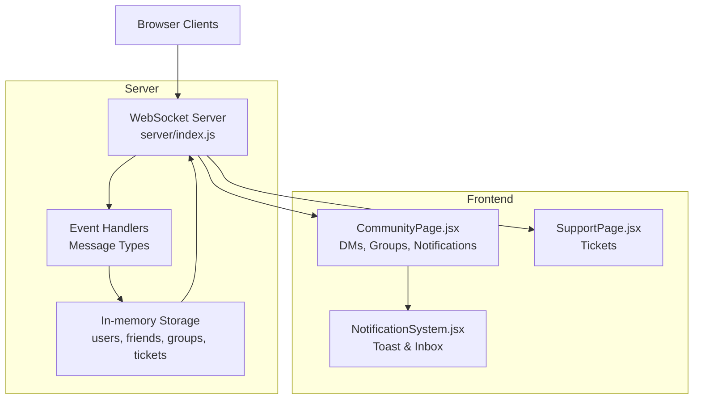
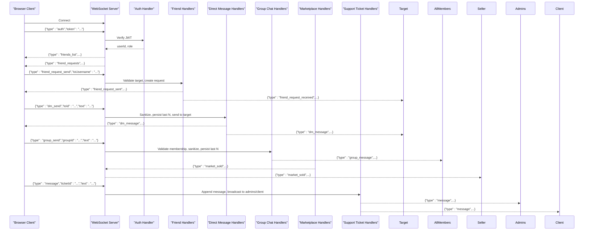
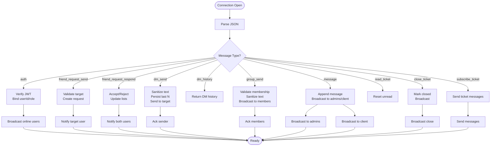
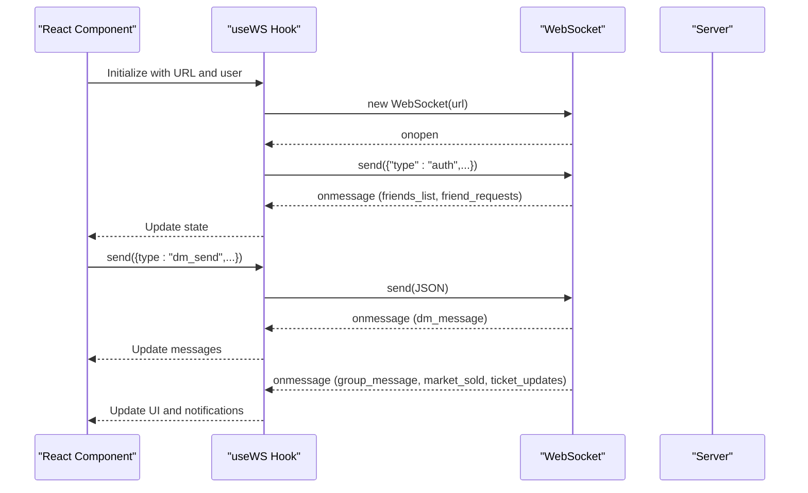
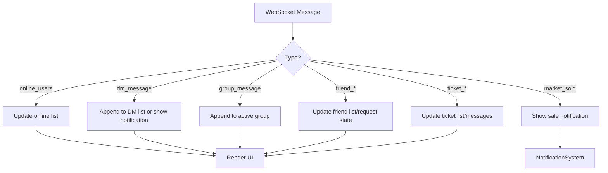
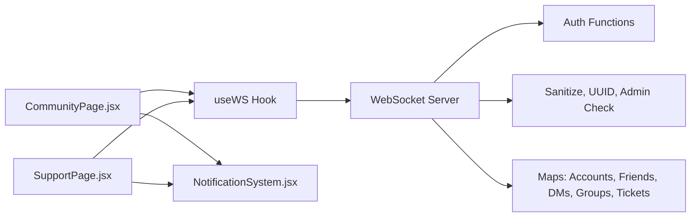

# Real-time Messaging & Event System

<cite>
**Referenced Files in This Document**
- [server/index.js](file://server/index.js)
- [server_index.js](file://server_index.js)
- [scratch/remote_server_index.js](file://scratch/remote_server_index.js)
- [src/pages/CommunityPage.jsx](file://src/pages/CommunityPage.jsx)
- [src/pages/SupportPage.jsx](file://src/pages/SupportPage.jsx)
- [src/components/NotificationSystem.jsx](file://src/components/NotificationSystem.jsx)
</cite>

## Table of Contents
1. [Introduction](#introduction)
2. [Project Structure](#project-structure)
3. [Core Components](#core-components)
4. [Architecture Overview](#architecture-overview)
5. [Detailed Component Analysis](#detailed-component-analysis)
6. [Dependency Analysis](#dependency-analysis)
7. [Performance Considerations](#performance-considerations)
8. [Troubleshooting Guide](#troubleshooting-guide)
9. [Conclusion](#conclusion)

## Introduction
This document describes the real-time messaging and event system built around WebSocket connections. It covers message parsing, event routing, client communication patterns, and real-time UI updates. It documents message types for authentication, friend requests, direct messages, group chats, marketplace events, and support tickets. It also explains delivery mechanisms, client targeting, broadcasting, and integration with frontend components. Guidance on message queuing, offline handling, persistence, and debugging tools is included.

## Project Structure
The real-time system spans a Node.js WebSocket server and React-based frontend:
- Server: WebSocket endpoint with message parsing, rate limiting, authentication, and event routing
- Frontend: React components that establish WebSocket connections, parse incoming events, and update UI state

**Diagram sources**
- [server/index.js:761-964](file://server/index.js#L761-L964)
- [src/pages/CommunityPage.jsx:75-121](file://src/pages/CommunityPage.jsx#L75-L121)
- [src/pages/SupportPage.jsx:35-74](file://src/pages/SupportPage.jsx#L35-L74)
- [src/components/NotificationSystem.jsx:1-200](file://src/components/NotificationSystem.jsx#L1-L200)

**Section sources**
- [server/index.js:761-964](file://server/index.js#L761-L964)
- [src/pages/CommunityPage.jsx:75-121](file://src/pages/CommunityPage.jsx#L75-L121)
- [src/pages/SupportPage.jsx:35-74](file://src/pages/SupportPage.jsx#L35-L74)
- [src/components/NotificationSystem.jsx:1-200](file://src/components/NotificationSystem.jsx#L1-L200)

## Core Components
- WebSocket server with connection lifecycle, authentication, rate limiting, and message routing
- Message parser that validates JSON and routes by type
- Event handlers for friend requests, direct messages, group chat, marketplace sales, and support tickets
- Frontend WebSocket hook for connection management and message dispatch
- UI components that react to real-time events and render notifications

Key responsibilities:
- Authentication: JWT verification and user identity binding
- Routing: Switch-based handler for each message type
- Delivery: Targeted sends to specific users and broadcasts to groups/admins
- Persistence: In-memory storage for DM history, group messages, and tickets

**Section sources**
- [server/index.js:761-964](file://server/index.js#L761-L964)
- [server_index.js:917-1153](file://server_index.js#L917-L1153)
- [scratch/remote_server_index.js:870-1008](file://scratch/remote_server_index.js#L870-L1008)
- [src/pages/CommunityPage.jsx:194-226](file://src/pages/CommunityPage.jsx#L194-L226)
- [src/pages/SupportPage.jsx:259-273](file://src/pages/SupportPage.jsx#L259-L273)

## Architecture Overview
The system uses a single WebSocket endpoint per client. On connect, clients authenticate and receive initial state (friends, friend requests). Subsequent messages are routed by type to appropriate handlers. Responses and updates are sent back to the client or broadcast to relevant recipients.

**Diagram sources**
- [server/index.js:761-964](file://server/index.js#L761-L964)
- [server_index.js:917-1153](file://server_index.js#L917-L1153)
- [scratch/remote_server_index.js:870-1008](file://scratch/remote_server_index.js#L870-L1008)

## Detailed Component Analysis

### WebSocket Server
The server manages connections, enforces rate limits, authenticates users, and routes messages by type. It supports:
- Authentication with JWT verification and user metadata binding
- Friend request lifecycle (send, accept, reject)
- Direct message sending and history retrieval
- Group chat with membership checks and bounded history
- Marketplace sale notifications
- Support ticket messaging with admin/client updates

**Diagram sources**
- [server/index.js:761-964](file://server/index.js#L761-L964)
- [server_index.js:917-1153](file://server_index.js#L917-L1153)
- [scratch/remote_server_index.js:870-1008](file://scratch/remote_server_index.js#L870-L1008)

**Section sources**
- [server/index.js:761-964](file://server/index.js#L761-L964)
- [server_index.js:917-1153](file://server_index.js#L917-L1153)
- [scratch/remote_server_index.js:870-1008](file://scratch/remote_server_index.js#L870-L1008)

### Message Types and Handlers

- auth
  - Purpose: Authenticate client and bind user identity
  - Behavior: Verifies JWT, sets user metadata, broadcasts online users, sends friends and pending friend requests
  - Delivery: To authenticated client only
  - Example payload path: [server/index.js:773-784](file://server/index.js#L773-L784)

- friend_request_send
  - Purpose: Send a friend request to another user
  - Behavior: Validates target existence, prevents self-friend, deduplicates requests, notifies target
  - Delivery: To requester and target
  - Example payload path: [server/index.js:980-991](file://server/index.js#L980-L991)

- friend_request_respond
  - Purpose: Accept or decline a friend request
  - Behavior: Updates friendship sets, notifies both parties, refreshes friend lists
  - Delivery: To both users
  - Example payload path: [server/index.js:993-948](file://server/index.js#L993-L948)

- dm_send
  - Purpose: Send a direct message
  - Behavior: Sanitizes text, persists bounded history, delivers to target
  - Delivery: To sender (ack) and target
  - Example payload path: [server/index.js:869-872](file://server/index.js#L869-L872)

- dm_history
  - Purpose: Retrieve recent DM history with a user
  - Behavior: Returns stored messages for the DM thread
  - Delivery: To requester
  - Example payload path: [server/index.js:876-881](file://server/index.js#L876-L881)

- group_send
  - Purpose: Post a message in a group
  - Behavior: Validates membership, sanitizes text, stores bounded history, broadcasts to members
  - Delivery: To all group members
  - Example payload path: [server/index.js:946-960](file://server/index.js#L946-L960)

- message (support ticket)
  - Purpose: Add a message to a support ticket
  - Behavior: Appends message, updates unread/status, broadcasts to admins and client
  - Delivery: To admins and client depending on role
  - Example payload path: [server/index.js:884-913](file://server/index.js#L884-L913)

- read_ticket
  - Purpose: Reset unread count for a ticket
  - Behavior: Sets unread to zero and sends current messages
  - Delivery: To admin who requested
  - Example payload path: [server/index.js:916-922](file://server/index.js#L916-L922)

- close_ticket
  - Purpose: Close a support ticket
  - Behavior: Marks closed and broadcasts closure
  - Delivery: To all subscribers
  - Example payload path: [server/index.js:926-933](file://server/index.js#L926-L933)

- subscribe_ticket
  - Purpose: Subscribe to ticket updates
  - Behavior: Stores ticket subscription and sends current messages
  - Delivery: To subscriber
  - Example payload path: [server/index.js:937-942](file://server/index.js#L937-L942)

- marketplace events
  - Purpose: Notify sellers of item sales
  - Behavior: Server emits sale notifications to affected users
  - Delivery: To seller
  - Example payload path: [scratch/remote_server_index.js:767-771](file://scratch/remote_server_index.js#L767-L771)

**Section sources**
- [server/index.js:761-964](file://server/index.js#L761-L964)
- [server_index.js:917-1153](file://server_index.js#L917-L1153)
- [scratch/remote_server_index.js:767-771](file://scratch/remote_server_index.js#L767-L771)

### Client Communication Patterns
- Connection lifecycle: Automatic reconnect with exponential backoff-like delay
- Authentication handshake: Sends auth payload after socket opens
- Message dispatch: Uses a single send method guarded by readyState
- Event-driven UI updates: Handlers update state and trigger notifications

**Diagram sources**
- [src/pages/CommunityPage.jsx:75-121](file://src/pages/CommunityPage.jsx#L75-L121)
- [src/pages/SupportPage.jsx:35-74](file://src/pages/SupportPage.jsx#L35-L74)

**Section sources**
- [src/pages/CommunityPage.jsx:75-121](file://src/pages/CommunityPage.jsx#L75-L121)
- [src/pages/SupportPage.jsx:35-74](file://src/pages/SupportPage.jsx#L35-L74)

### Frontend Integration and Real-time UI Updates
- CommunityPage: Handles online users, DMs, group messages, friend notifications, and marketplace updates
- SupportPage: Manages ticket subscriptions, live updates, and admin/client messaging
- NotificationSystem: Centralized toast and inbox management for real-time alerts

**Diagram sources**
- [src/pages/CommunityPage.jsx:194-226](file://src/pages/CommunityPage.jsx#L194-L226)
- [src/pages/SupportPage.jsx:259-273](file://src/pages/SupportPage.jsx#L259-L273)
- [src/components/NotificationSystem.jsx:1-200](file://src/components/NotificationSystem.jsx#L1-L200)

**Section sources**
- [src/pages/CommunityPage.jsx:194-226](file://src/pages/CommunityPage.jsx#L194-L226)
- [src/pages/SupportPage.jsx:259-273](file://src/pages/SupportPage.jsx#L259-L273)
- [src/components/NotificationSystem.jsx:1-200](file://src/components/NotificationSystem.jsx#L1-L200)

## Dependency Analysis
- Server depends on:
  - In-memory maps for accounts, friendships, DMs, groups, group messages, tickets
  - Helper functions for authentication, sanitization, and broadcasting
- Frontend depends on:
  - WebSocket hook for connection management
  - Notification system for UI feedback
  - Page-specific handlers for event routing

**Diagram sources**
- [server/index.js:761-964](file://server/index.js#L761-L964)
- [src/pages/CommunityPage.jsx:75-121](file://src/pages/CommunityPage.jsx#L75-L121)
- [src/pages/SupportPage.jsx:35-74](file://src/pages/SupportPage.jsx#L35-L74)
- [src/components/NotificationSystem.jsx:1-200](file://src/components/NotificationSystem.jsx#L1-L200)

**Section sources**
- [server/index.js:761-964](file://server/index.js#L761-L964)
- [src/pages/CommunityPage.jsx:75-121](file://src/pages/CommunityPage.jsx#L75-L121)
- [src/pages/SupportPage.jsx:35-74](file://src/pages/SupportPage.jsx#L35-L74)
- [src/components/NotificationSystem.jsx:1-200](file://src/components/NotificationSystem.jsx#L1-L200)

## Performance Considerations
- Rate limiting: Per-IP and per-client message windows prevent spam
- Message size limits: Early termination for oversized payloads
- Bounded histories: Limits on DMs and group messages reduce memory footprint
- Selective broadcasts: Admin-only broadcasts and targeted sends minimize network overhead
- Reconnect strategy: Backoff-like retry reduces server load during transient failures

Recommendations:
- Persist DMs and group messages to Redis for durability and cross-instance sharing
- Implement message acknowledgments for critical events
- Add connection pooling and horizontal scaling for high concurrency

**Section sources**
- [server_index.js:931-945](file://server_index.js#L931-L945)
- [scratch/remote_server_index.js:895-908](file://scratch/remote_server_index.js#L895-L908)

## Troubleshooting Guide
Common issues and diagnostics:
- Authentication failures
  - Symptoms: Immediate close with unauthorized code and auth_error
  - Actions: Verify token validity and user ID resolution
  - References: [server/index.js:776-780](file://server/index.js#L776-L780), [server_index.js:955-962](file://server_index.js#L955-L962)

- Message parsing errors
  - Symptoms: Silent drops for malformed JSON
  - Actions: Validate client payloads and log parsing exceptions
  - References: [server/index.js:765-767](file://server/index.js#L765-L767), [server_index.js:934](file://server_index.js#L934)

- Rate limit exceeded
  - Symptoms: Error response and temporary throttling
  - Actions: Reduce burst frequency or increase thresholds
  - References: [server_index.js:940-945](file://server_index.js#L940-L945), [scratch/remote_server_index.js:902-908](file://scratch/remote_server_index.js#L902-L908)

- Missing or delayed events
  - Symptoms: UI not updating for DMs/group messages
  - Actions: Confirm event handler paths and active subscriptions
  - References: [src/pages/CommunityPage.jsx:194-226](file://src/pages/CommunityPage.jsx#L194-L226), [src/pages/SupportPage.jsx:259-273](file://src/pages/SupportPage.jsx#L259-L273)

- Reconnection loops
  - Symptoms: Frequent disconnect/reconnect cycles
  - Actions: Adjust retry delays and ensure proper cleanup
  - References: [src/pages/CommunityPage.jsx:81-95](file://src/pages/CommunityPage.jsx#L81-L95), [src/pages/SupportPage.jsx:51-57](file://src/pages/SupportPage.jsx#L51-L57)

## Conclusion
The real-time messaging system provides robust WebSocket-based communication with clear separation of concerns between server-side routing and client-side UI updates. By leveraging bounded histories, targeted broadcasts, and structured event types, it achieves responsiveness and scalability. Extending persistence and acknowledgments would further improve reliability and offline resilience.