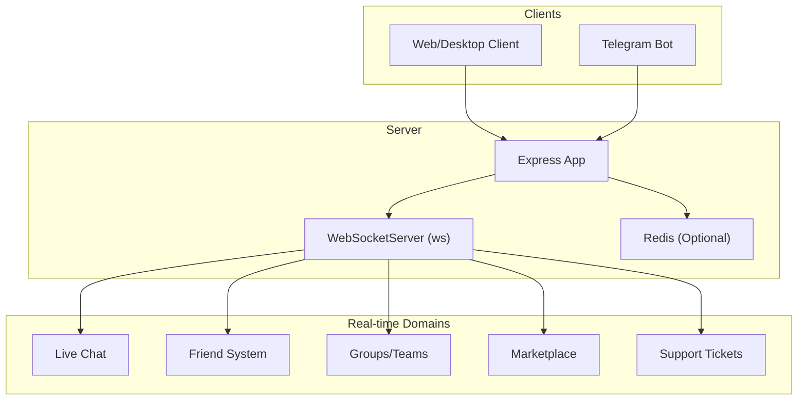
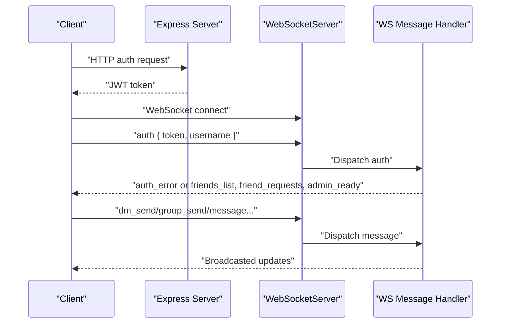
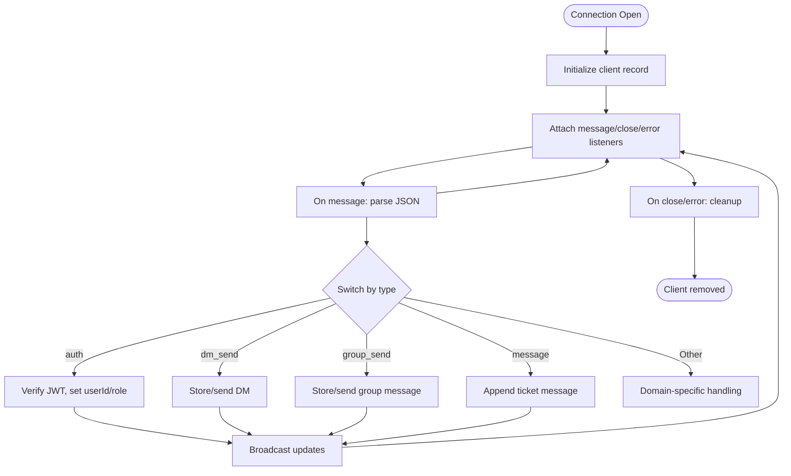
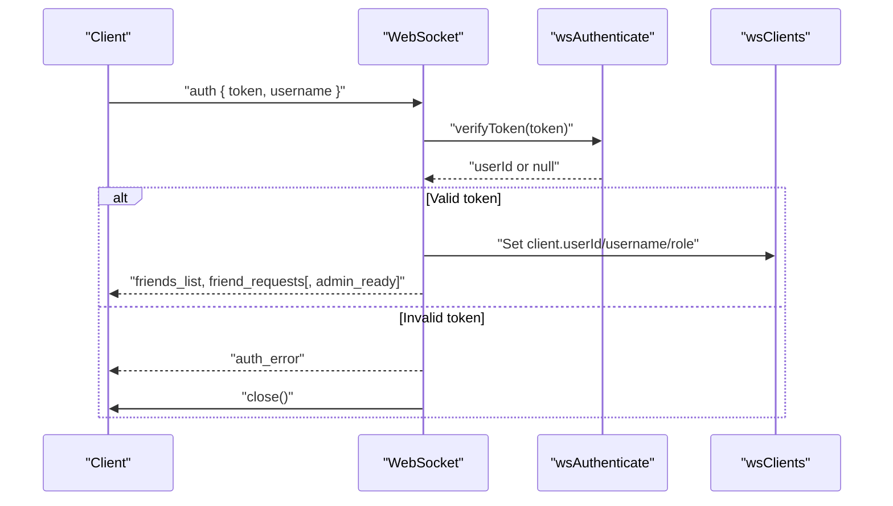
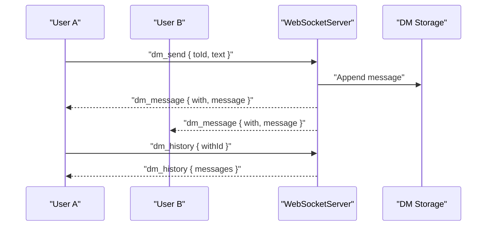
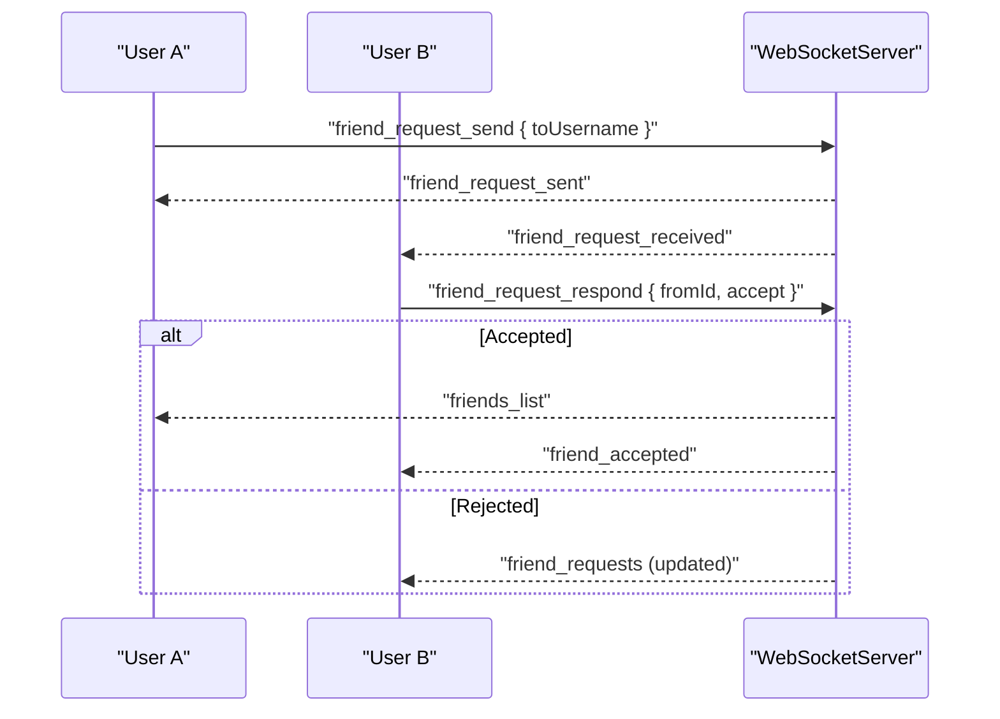
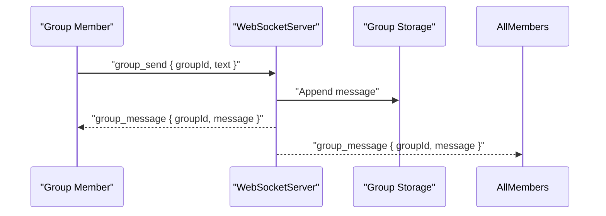
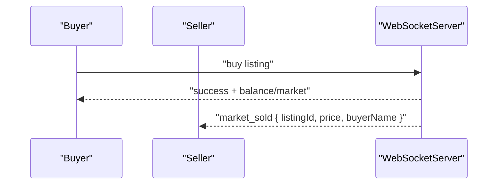
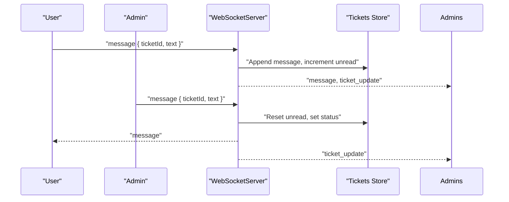
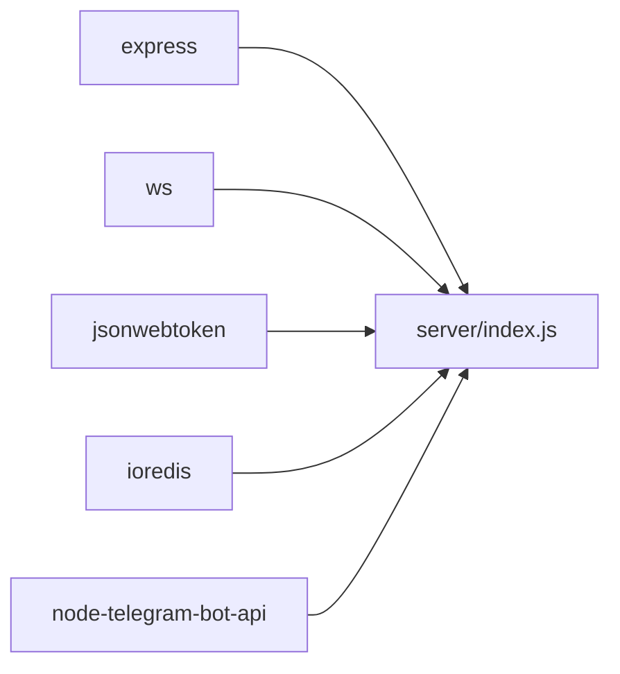

# WebSocket Communication & Real-time Features

<cite>
**Referenced Files in This Document**
- [server/index.js](file://server/index.js)
- [server/package.json](file://server/package.json)
</cite>

## Table of Contents
1. [Introduction](#introduction)
2. [Project Structure](#project-structure)
3. [Core Components](#core-components)
4. [Architecture Overview](#architecture-overview)
5. [Detailed Component Analysis](#detailed-component-analysis)
6. [Dependency Analysis](#dependency-analysis)
7. [Performance Considerations](#performance-considerations)
8. [Troubleshooting Guide](#troubleshooting-guide)
9. [Conclusion](#conclusion)

## Introduction
This document describes the WebSocket communication system powering real-time features for the gaming platform. Built with the ws library, the system manages WebSocket connections, authenticates clients via JWT, routes messages across multiple real-time domains (live chat, friend system, groups, marketplace notifications, and support tickets), and broadcasts updates to admins and users. It also covers connection lifecycle, authentication during the WebSocket handshake, cleanup procedures, and practical guidance for scaling, queuing, offline handling, debugging, and monitoring.

## Project Structure
The WebSocket server is implemented as a single Node.js service using Express for HTTP/HTTPS endpoints and ws for WebSocket handling. The server exposes REST endpoints for authentication, inventory, marketplace, groups, tickets, and news, while the WebSocket layer handles real-time messaging and updates.

**Diagram sources**
- [server/index.js:90-95](file://server/index.js#L90-L95)
- [server/index.js:1442-1468](file://server/index.js#L1442-L1468)

**Section sources**
- [server/index.js:37-95](file://server/index.js#L37-L95)
- [server/package.json:1-20](file://server/package.json#L1-L20)

## Core Components
- WebSocket Server: Uses ws WebSocketServer attached to both HTTP and HTTPS servers. Connections are tracked in-memory with per-client metadata (userId, username, role, ticket subscription).
- Authentication: JWT-based authentication during WebSocket handshake via an "auth" message type. Tokens verified using a shared secret.
- Message Routing: Centralized message handler switches on message.type to route to appropriate domain handlers (friends, DMs, groups, tickets).
- Broadcasting: Helpers broadcast to online users, admins, or specific ticket subscribers.
- Persistence: Optional Redis-backed account storage with in-memory fallback for offline operation.

Key implementation references:
- WebSocket initialization and connection handling: [server/index.js:90-95](file://server/index.js#L90-L95), [server/index.js:753-958](file://server/index.js#L753-L958)
- Authentication middleware: [server/index.js:84-88](file://server/index.js#L84-L88), [server/index.js:763-796](file://server/index.js#L763-L796)
- Message routing: [server/index.js:757-954](file://server/index.js#L757-L954)
- Broadcasting utilities: [server/index.js:964-983](file://server/index.js#L964-L983)

**Section sources**
- [server/index.js:753-958](file://server/index.js#L753-L958)
- [server/index.js:964-983](file://server/index.js#L964-L983)

## Architecture Overview
The WebSocket server integrates with REST endpoints and external services:
- REST endpoints handle authentication, inventory, marketplace, groups, tickets, and news.
- WebSocket connections receive real-time updates for friends, DMs, groups, marketplace, and tickets.
- Optional Redis persists account data; in-memory fallback ensures basic functionality without Redis.
- HTTPS WebSocket support mirrors HTTP handlers for platforms requiring secure WebSockets.

**Diagram sources**
- [server/index.js:140-178](file://server/index.js#L140-L178)
- [server/index.js:753-954](file://server/index.js#L753-L954)
- [server/index.js:964-983](file://server/index.js#L964-L983)

## Detailed Component Analysis

### WebSocket Connection Lifecycle
- On connection: Assign a clientId, initialize client record with null userId, and attach listeners for message, close, and error.
- On message: Parse JSON, dispatch by type, and handle domain-specific logic.
- On close/error: Remove client from wsClients and broadcast online user updates.

**Diagram sources**
- [server/index.js:753-958](file://server/index.js#L753-L958)
- [server/index.js:964-983](file://server/index.js#L964-L983)

**Section sources**
- [server/index.js:753-958](file://server/index.js#L753-L958)

### Authentication During Handshake
- Clients send an "auth" message containing a JWT token and username.
- Server verifies token using shared secret; on success, sets client.userId, client.username, and client.role.
- On success, server sends friends and pending friend requests, and optionally admin-ready state.

**Diagram sources**
- [server/index.js:763-796](file://server/index.js#L763-L796)
- [server/index.js:84-88](file://server/index.js#L84-L88)

**Section sources**
- [server/index.js:763-796](file://server/index.js#L763-L796)
- [server/index.js:84-88](file://server/index.js#L84-L88)

### Real-time Features and Message Types

#### Live Chat (Direct Messages)
- Clients send "dm_send" with { toId, text }.
- Server stores up to 200 messages per DM thread and delivers to both participants.
- Clients can request history via "dm_history".

**Diagram sources**
- [server/index.js:853-873](file://server/index.js#L853-L873)

**Section sources**
- [server/index.js:853-873](file://server/index.js#L853-L873)

#### Friend System Updates
- Send friend request via "friend_request_send" with target username.
- Respond to requests via "friend_request_respond" with accept flag.
- Upon acceptance, both users receive updated friends lists and notifications.

**Diagram sources**
- [server/index.js:798-850](file://server/index.js#L798-L850)

**Section sources**
- [server/index.js:798-850](file://server/index.js#L798-L850)

#### Group Communications
- Clients send "group_send" with { groupId, text }.
- Server validates membership, stores up to 200 messages, and broadcasts to all group members.

**Diagram sources**
- [server/index.js:937-952](file://server/index.js#L937-L952)

**Section sources**
- [server/index.js:937-952](file://server/index.js#L937-L952)

#### Marketplace Notifications
- When a listing sells, the server updates balances and sends "market_sold" to the seller.

**Diagram sources**
- [server/index.js:528-563](file://server/index.js#L528-L563)

**Section sources**
- [server/index.js:528-563](file://server/index.js#L528-L563)

#### Support Ticket Alerts
- Users send "message" to append messages; admins send replies.
- Server tracks unread counts, status, and broadcasts updates to admins and ticket subscribers.

**Diagram sources**
- [server/index.js:875-926](file://server/index.js#L875-L926)

**Section sources**
- [server/index.js:875-926](file://server/index.js#L875-L926)

### Broadcasting System
- Online users broadcast: [server/index.js:964-971](file://server/index.js#L964-L971)
- Admins broadcast: [server/index.js:973-977](file://server/index.js#L973-L977)
- Ticket-specific broadcast: [server/index.js:979-983](file://server/index.js#L979-L983)

**Section sources**
- [server/index.js:964-983](file://server/index.js#L964-L983)

### Connection Scaling, Queuing, and Offline Handling
- Current implementation uses in-memory maps for connections, accounts, tickets, groups, and DMs. No built-in message queue or offline message persistence is present.
- Recommendations:
  - Use Redis for durable queues and pub/sub to distribute load across instances.
  - Persist offline messages with timestamps keyed by userId and deliver upon reconnect.
  - Implement rate limiting and message size caps at the WebSocket layer.
  - Add heartbeat/ping-pong to detect stale connections.

[No sources needed since this section provides general guidance]

### Integration with Frontend Components
- The server exposes REST endpoints for authentication and game features, while WebSocket handles real-time updates.
- Frontend components should:
  - Authenticate via REST to obtain a JWT, then connect to WebSocket with "auth".
  - Subscribe to ticket updates by sending "subscribe_ticket".
  - Handle incoming real-time events (e.g., dm_message, friend_request_received, group_message, ticket_update, market_sold).

[No sources needed since this section provides general guidance]

## Dependency Analysis
The server depends on:
- ws for WebSocket handling
- Express for HTTP/HTTPS endpoints
- ioredis for optional Redis-backed account storage
- jsonwebtoken for JWT verification
- node-telegram-bot-api for Telegram integration

**Diagram sources**
- [server/package.json:6-17](file://server/package.json#L6-L17)

**Section sources**
- [server/package.json:1-20](file://server/package.json#L1-L20)

## Performance Considerations
- Connection limits: Monitor wsClients size and consider connection pooling or reverse proxy load balancing.
- Memory usage: In-memory stores grow with users and messages; consider periodic pruning and Redis persistence.
- Broadcast overhead: Limit unnecessary broadcasts; batch updates where feasible.
- Rate limiting: Apply per-connection rate limits for message throughput.
- HTTPS/WebSocket: Running two WebSocket servers (HTTP and HTTPS) doubles resource usage; consolidate if possible.

[No sources needed since this section provides general guidance]

## Troubleshooting Guide
Common issues and remedies:
- Authentication failures: Verify JWT secret consistency and token validity; ensure clients send "auth" with proper token and username.
- No real-time updates: Confirm clients subscribed to tickets ("subscribe_ticket"), and that WebSocket is connected after auth.
- Redis unavailable: In-memory fallback still works for basic features; monitor logs for Redis connection warnings.
- Stale connections: Implement ping/pong and close handlers; remove disconnected clients from wsClients.
- Debugging: Enable verbose logging for ws events and REST endpoints; use health endpoint to inspect internal state.

Operational endpoints and handlers:
- Health: [server/index.js:178](file://server/index.js#L178)
- Online users: [server/index.js:691-696](file://server/index.js#L691-L696)
- Admin ticket list: [server/index.js:698-706](file://server/index.js#L698-L706)
- Ticket details: [server/index.js:708-713](file://server/index.js#L708-L713)

**Section sources**
- [server/index.js:178](file://server/index.js#L178)
- [server/index.js:691-713](file://server/index.js#L691-L713)

## Conclusion
The WebSocket server provides a robust foundation for real-time gaming features, with clear separation between REST endpoints and WebSocket handlers. By adding Redis-backed queues, offline message delivery, and improved monitoring, the system can scale effectively while maintaining responsive, reliable real-time experiences across chat, friends, groups, marketplace, and support tickets.