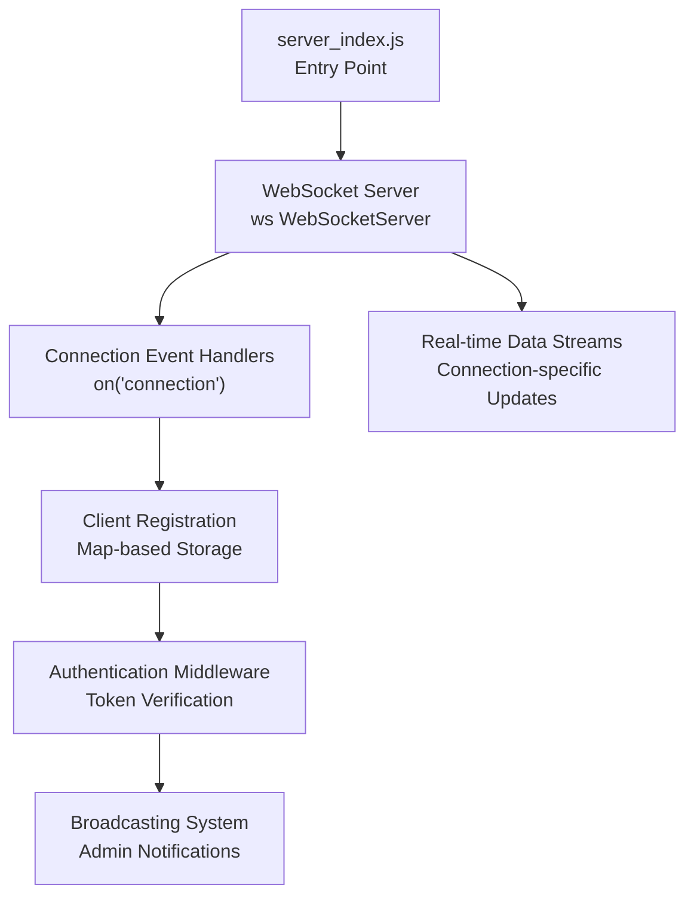
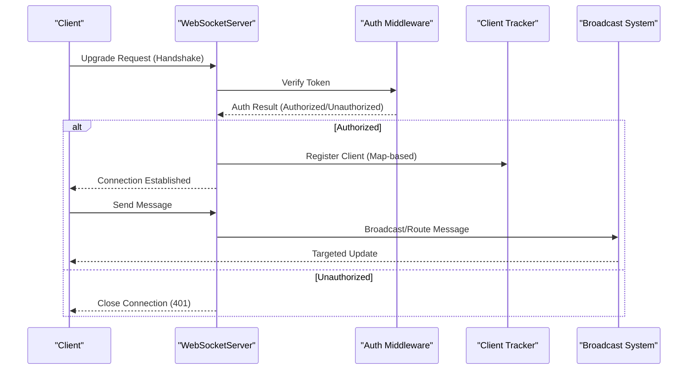
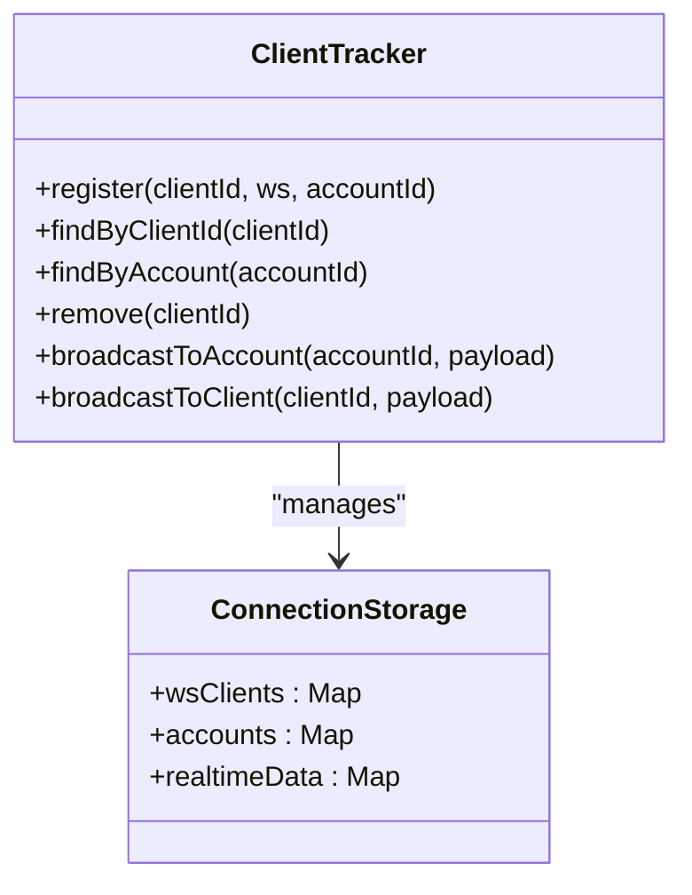
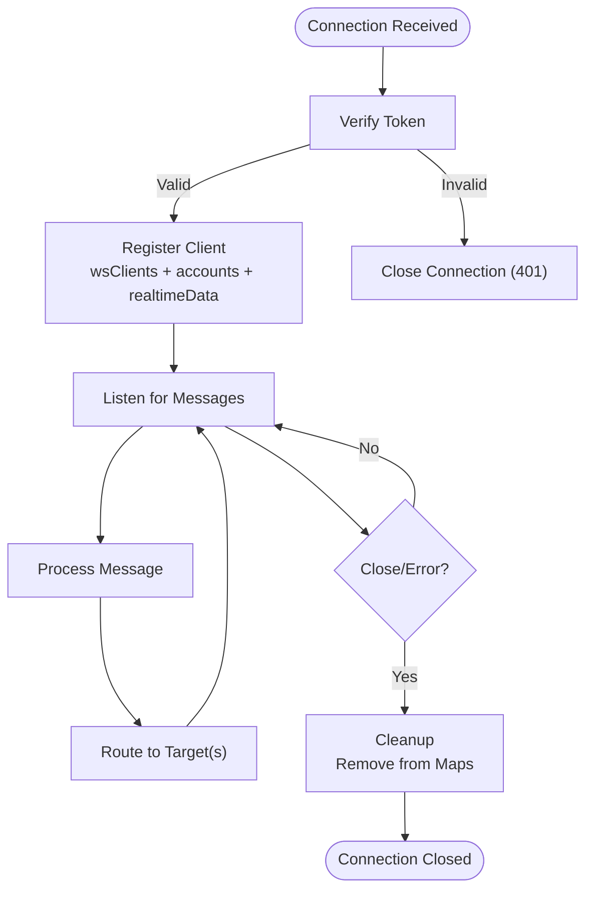
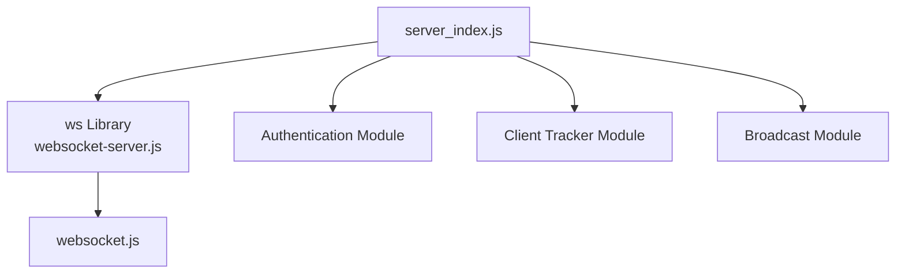

# WebSocket Server Architecture & Connection Management

<cite>
**Referenced Files in This Document**
- [server_index.js](file://server_index.js)
- [websocket-server.js](file://server/node_modules/ws/lib/websocket-server.js)
- [websocket.js](file://server/node_modules/ws/lib/websocket.js)
</cite>

## Table of Contents
1. [Introduction](#introduction)
2. [Project Structure](#project-structure)
3. [Core Components](#core-components)
4. [Architecture Overview](#architecture-overview)
5. [Detailed Component Analysis](#detailed-component-analysis)
6. [Dependency Analysis](#dependency-analysis)
7. [Performance Considerations](#performance-considerations)
8. [Troubleshooting Guide](#troubleshooting-guide)
9. [Conclusion](#conclusion)

## Introduction
This document provides comprehensive documentation for the WebSocket server architecture built with the ws library. It covers server initialization, connection lifecycle management, client tracking mechanisms, authentication middleware, broadcasting systems, and operational best practices for scaling and monitoring. The goal is to enable developers to understand, extend, and maintain the WebSocket infrastructure effectively.

## Project Structure
The WebSocket server is implemented as part of the backend service and leverages the ws library for WebSocket protocol handling. The primary entry point initializes the server and registers event handlers for connection lifecycle events. Supporting files include the WebSocket server implementation and core WebSocket classes from the ws library.

**Diagram sources**
- [server_index.js](file://server_index.js)
- [websocket-server.js](file://server/node_modules/ws/lib/websocket-server.js)

**Section sources**
- [server_index.js](file://server_index.js)

## Core Components
This section outlines the key components involved in WebSocket server operation, focusing on initialization, connection lifecycle, client tracking, authentication, and broadcasting.

- WebSocketServer Configuration
  - Initializes the WebSocket server with transport options and event handlers.
  - Registers the connection event listener to manage incoming client connections.

- Connection Lifecycle Management
  - Handles connection establishment, message processing, and cleanup on close/error.
  - Implements per-connection state tracking and resource management.

- Client Tracking System
  - Uses Map structures to maintain:
    - Active client connections keyed by unique identifiers.
    - Account associations linking clients to authenticated user identities.
    - Real-time data channels for targeted updates.

- Authentication Middleware and Token Verification
  - Validates client-provided tokens during connection handshake.
  - Authorizes clients based on token claims and account permissions.
  - Enforces access control for sensitive operations and broadcasts.

- Broadcasting System
  - Supports admin notifications and real-time updates to specific clients or groups.
  - Provides mechanisms to target messages by account identifiers or connection keys.

**Section sources**
- [server_index.js](file://server_index.js)
- [websocket-server.js](file://server/node_modules/ws/lib/websocket-server.js)

## Architecture Overview
The WebSocket server architecture centers around a single WebSocketServer instance that manages multiple client connections. Each connection is associated with an authenticated account and tracked via Map structures. Authentication occurs during the connection handshake, followed by registration into the client tracking system. The server supports targeted broadcasting to specific clients or groups.

**Diagram sources**
- [server_index.js](file://server_index.js)
- [websocket-server.js](file://server/node_modules/ws/lib/websocket-server.js)

## Detailed Component Analysis

### WebSocketServer Initialization and Configuration
- Entry point initializes the WebSocket server with transport options and registers the connection event handler.
- The server listens for upgrade requests and delegates authentication and registration to dedicated middleware and tracking modules.

Key responsibilities:
- Transport configuration (port, host, protocols).
- Event handler registration for connection lifecycle.
- Integration with authentication and client tracking systems.

**Section sources**
- [server_index.js](file://server_index.js)

### Connection Lifecycle Management
- Establishes per-connection state upon successful handshake and authentication.
- Processes incoming messages and routes them to appropriate handlers.
- Implements cleanup routines on close or error to release resources and update tracking structures.

Lifecycle stages:
- Handshake and upgrade.
- Authentication and authorization.
- Registration into client tracking structures.
- Message processing loop.
- Cleanup on close/error.

**Section sources**
- [websocket-server.js](file://server/node_modules/ws/lib/websocket-server.js)

### Client Tracking System
The client tracking system uses Map structures to maintain efficient lookups and updates:

- wsClients: Maps connection identifiers to WebSocket instances for targeted messaging.
- accounts: Maps account identifiers to active connections for group targeting and broadcast routing.
- real-time data: Maintains per-connection state for real-time updates and subscription management.

Operations:
- Registration: Associates a new connection with account and real-time data.
- Lookup: Retrieves connections by identifier or account for broadcasting.
- Removal: Cleans up entries on connection close or error.

**Diagram sources**
- [server_index.js](file://server_index.js)

**Section sources**
- [server_index.js](file://server_index.js)

### Authentication Middleware and Token Verification
- Validates client-provided tokens during the connection handshake.
- Extracts account metadata from tokens and enforces authorization policies.
- Rejects unauthorized connections and closes them gracefully.

Token verification steps:
- Decode token and validate signature.
- Check expiration and issuer claims.
- Resolve account identity and permissions.
- Allow or deny connection based on policy.

**Section sources**
- [server_index.js](file://server_index.js)

### Broadcasting System for Admin Notifications and Real-time Updates
- Targets specific clients using connection identifiers.
- Routes messages to all connections associated with an account for group updates.
- Supports admin notifications and real-time data streams.

Broadcasting patterns:
- One-to-one: Targeted message to a specific clientId.
- One-to-many: Broadcast to all connections under an accountId.
- Fan-out: Distribute updates to multiple accounts or groups.

**Section sources**
- [server_index.js](file://server_index.js)

### Connection Establishment, Client Identification, and Cleanup Procedures
- Connection establishment: Upgrade request processed, authentication performed, and client registered.
- Client identification: Unique clientId derived from connection metadata and account association stored.
- Cleanup procedures: On close/error, remove entries from tracking structures and release resources.

**Diagram sources**
- [websocket-server.js](file://server/node_modules/ws/lib/websocket-server.js)
- [server_index.js](file://server_index.js)

**Section sources**
- [websocket-server.js](file://server/node_modules/ws/lib/websocket-server.js)
- [server_index.js](file://server_index.js)

## Dependency Analysis
The WebSocket server depends on the ws library for core WebSocket functionality. The server integrates with authentication and client tracking modules to provide secure, scalable real-time communication.

**Diagram sources**
- [server_index.js](file://server_index.js)
- [websocket-server.js](file://server/node_modules/ws/lib/websocket-server.js)
- [websocket.js](file://server/node_modules/ws/lib/websocket.js)

**Section sources**
- [server_index.js](file://server_index.js)
- [websocket-server.js](file://server/node_modules/ws/lib/websocket-server.js)
- [websocket.js](file://server/node_modules/ws/lib/websocket.js)

## Performance Considerations
- Connection Limits and Scaling
  - Monitor concurrent connections and implement rate limiting to prevent overload.
  - Use horizontal scaling with multiple server instances behind a load balancer.
  - Consider sticky sessions if maintaining per-instance state is required.

- Memory Management
  - Regularly prune disconnected clients from tracking structures.
  - Limit per-client message queues and enforce backpressure.
  - Use streaming for large payloads to reduce memory footprint.

- Broadcasting Efficiency
  - Minimize redundant broadcasts by batching updates.
  - Use targeted broadcasting to avoid unnecessary fan-out.
  - Cache frequently accessed account-to-connection mappings.

- Monitoring and Metrics
  - Track connection counts, message rates, and error rates.
  - Monitor memory usage and garbage collection pauses.
  - Log authentication failures and authorization denials for security auditing.

## Troubleshooting Guide
Common issues and diagnostic approaches:

- Connection Refused or Handshake Failures
  - Verify server availability and port configuration.
  - Check firewall and proxy settings for WebSocket upgrades.
  - Review authentication logs for token validation errors.

- Authentication Errors
  - Confirm token validity, expiration, and issuer claims.
  - Validate account existence and permissions.
  - Inspect middleware logs for authorization denials.

- Client Tracking Issues
  - Ensure cleanup routines execute on close/error to prevent leaks.
  - Verify Map updates on register/remove operations.
  - Check for duplicate registrations or stale entries.

- Broadcasting Problems
  - Confirm target identifiers exist in tracking structures.
  - Validate routing logic for account-based broadcasts.
  - Test with small groups before scaling to larger audiences.

- Performance Degradation
  - Monitor connection counts and resource utilization.
  - Investigate long message processing times and queue backlogs.
  - Review broadcast frequency and payload sizes.

**Section sources**
- [server_index.js](file://server_index.js)
- [websocket-server.js](file://server/node_modules/ws/lib/websocket-server.js)

## Conclusion
The WebSocket server architecture built with the ws library provides a robust foundation for real-time communication. By implementing structured connection lifecycle management, secure authentication, efficient client tracking, and targeted broadcasting, the system supports scalable and maintainable real-time features. Proper monitoring, memory management, and operational practices ensure reliable performance under varying loads.