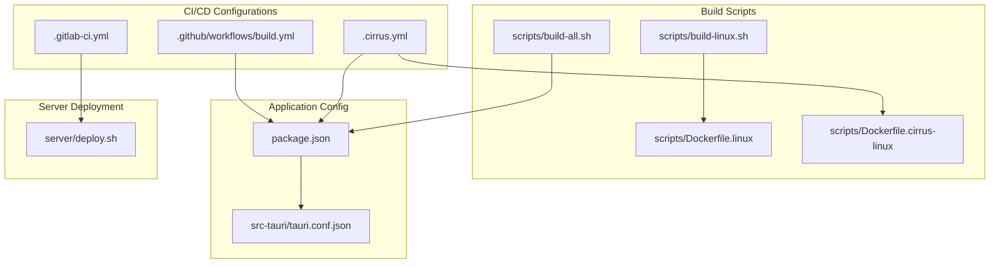
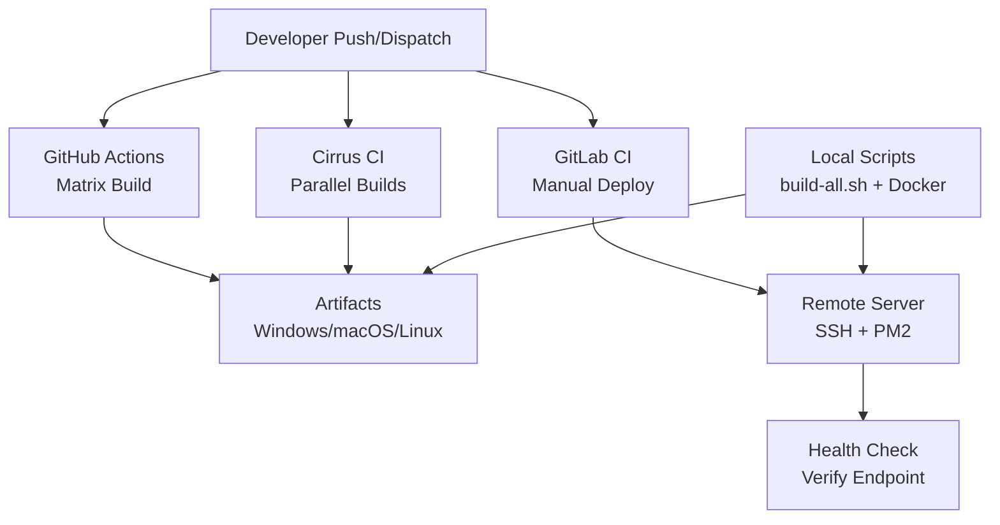
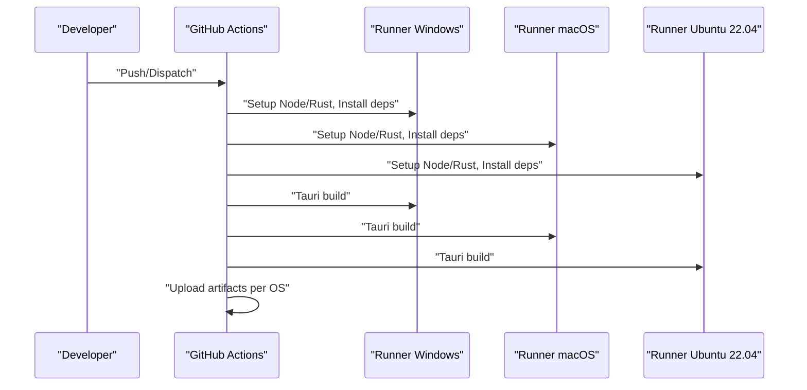
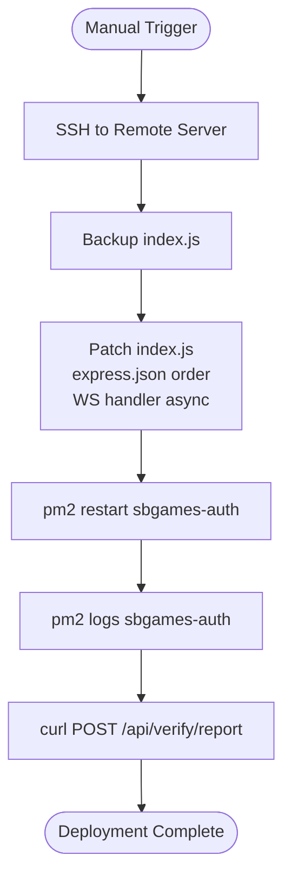
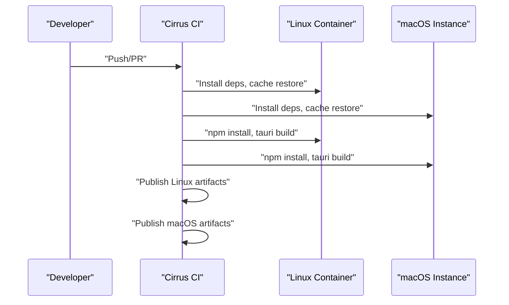
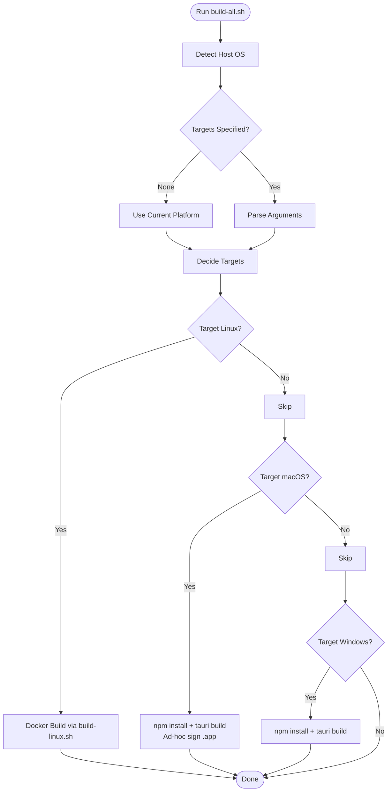
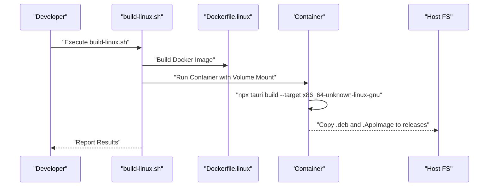
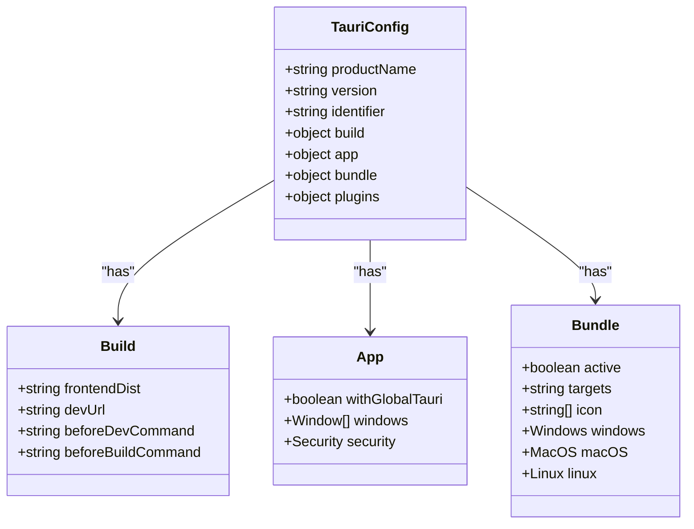
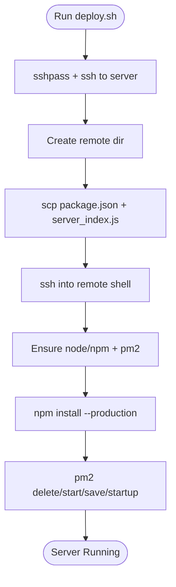
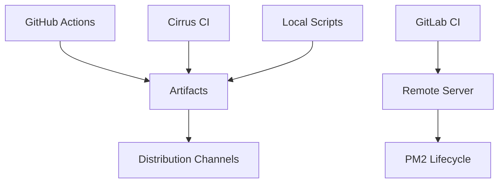

# Automated Deployment Pipeline

<cite>
**Referenced Files in This Document**
- [.github/workflows/build.yml](file://.github/workflows/build.yml)
- [.gitlab-ci.yml](file://.gitlab-ci.yml)
- [.cirrus.yml](file://.cirrus.yml)
- [scripts/build-all.sh](file://scripts/build-all.sh)
- [scripts/build-linux.sh](file://scripts/build-linux.sh)
- [scripts/Dockerfile.linux](file://scripts/Dockerfile.linux)
- [scripts/Dockerfile.cirrus-linux](file://scripts/Dockerfile.cirrus-linux)
- [BUILD.md](file://BUILD.md)
- [package.json](file://package.json)
- [src-tauri/tauri.conf.json](file://src-tauri/tauri.conf.json)
- [server/deploy.sh](file://server/deploy.sh)
</cite>

## Table of Contents
1. [Introduction](#introduction)
2. [Project Structure](#project-structure)
3. [Core Components](#core-components)
4. [Architecture Overview](#architecture-overview)
5. [Detailed Component Analysis](#detailed-component-analysis)
6. [Dependency Analysis](#dependency-analysis)
7. [Performance Considerations](#performance-considerations)
8. [Troubleshooting Guide](#troubleshooting-guide)
9. [Conclusion](#conclusion)
10. [Appendices](#appendices)

## Introduction
This document describes the automated deployment pipeline for the SBGames Launcher, covering continuous integration and delivery workflows, build automation scripts, and release management. It explains:
- GitHub Actions multi-platform builds, testing, and artifact generation
- GitLab CI configuration for manual deployment with quality gates
- Cirrus CI setup for cross-platform testing and deployment
- Local development build automation via build-all.sh
- Release process including versioning, changelog generation, and distribution
- Examples for customizing build triggers, adding new platforms, and implementing rollback procedures

## Project Structure
The repository organizes CI/CD configurations alongside build scripts and Tauri application configuration:
- GitHub Actions workflow under .github/workflows
- GitLab CI configuration at the repository root
- Cirrus CI configuration at the repository root
- Build automation scripts under scripts/
- Tauri configuration under src-tauri
- Package management and build scripts under package.json

**Diagram sources**
- [.github/workflows/build.yml:1-95](file://.github/workflows/build.yml#L1-L95)
- [.gitlab-ci.yml:1-57](file://.gitlab-ci.yml#L1-L57)
- [.cirrus.yml:1-72](file://.cirrus.yml#L1-L72)
- [scripts/build-all.sh:1-130](file://scripts/build-all.sh#L1-L130)
- [scripts/build-linux.sh:1-30](file://scripts/build-linux.sh#L1-L30)
- [scripts/Dockerfile.linux:1-47](file://scripts/Dockerfile.linux#L1-L47)
- [scripts/Dockerfile.cirrus-linux:1-25](file://scripts/Dockerfile.cirrus-linux#L1-L25)
- [package.json:1-43](file://package.json#L1-L43)
- [src-tauri/tauri.conf.json:1-89](file://src-tauri/tauri.conf.json#L1-L89)
- [server/deploy.sh:1-26](file://server/deploy.sh#L1-L26)

**Section sources**
- [.github/workflows/build.yml:1-95](file://.github/workflows/build.yml#L1-L95)
- [.gitlab-ci.yml:1-57](file://.gitlab-ci.yml#L1-L57)
- [.cirrus.yml:1-72](file://.cirrus.yml#L1-L72)
- [scripts/build-all.sh:1-130](file://scripts/build-all.sh#L1-L130)
- [scripts/build-linux.sh:1-30](file://scripts/build-linux.sh#L1-L30)
- [scripts/Dockerfile.linux:1-47](file://scripts/Dockerfile.linux#L1-L47)
- [scripts/Dockerfile.cirrus-linux:1-25](file://scripts/Dockerfile.cirrus-linux#L1-L25)
- [package.json:1-43](file://package.json#L1-L43)
- [src-tauri/tauri.conf.json:1-89](file://src-tauri/tauri.conf.json#L1-L89)
- [server/deploy.sh:1-26](file://server/deploy.sh#L1-L26)

## Core Components
- GitHub Actions build workflow orchestrates multi-platform builds for Windows, macOS, and Linux using a matrix strategy. It installs Node.js and Rust, configures platform-specific dependencies, builds the Tauri application, and uploads artifacts per platform.
- GitLab CI defines a manual deployment job that connects to a remote server via SSH, patches and restarts the Node.js service, and validates the deployment by invoking an API endpoint.
- Cirrus CI provides dedicated jobs for Linux and macOS builds, installing required system packages and toolchains, caching dependencies, and producing platform-specific artifacts.
- Local build automation scripts support cross-platform builds locally:
  - build-all.sh detects the current OS, parses arguments to select targets, and executes platform-specific build routines. It supports Docker-based Linux builds and native macOS/Windows builds.
  - build-linux.sh builds inside a Docker container using a dedicated Dockerfile, copies artifacts to a releases directory, and reports results.
  - Dockerfiles define reproducible environments for Linux builds and Cirrus CI compatibility.
- Tauri configuration controls bundling targets, icons, platform-specific signing and entitlements, and CSP policies.
- Server deployment script automates copying files to a remote server, installing dependencies, and managing the Node.js service with PM2.

**Section sources**
- [.github/workflows/build.yml:8-95](file://.github/workflows/build.yml#L8-L95)
- [.gitlab-ci.yml:8-57](file://.gitlab-ci.yml#L8-L57)
- [.cirrus.yml:4-72](file://.cirrus.yml#L4-L72)
- [scripts/build-all.sh:1-130](file://scripts/build-all.sh#L1-L130)
- [scripts/build-linux.sh:1-30](file://scripts/build-linux.sh#L1-L30)
- [scripts/Dockerfile.linux:1-47](file://scripts/Dockerfile.linux#L1-L47)
- [scripts/Dockerfile.cirrus-linux:1-25](file://scripts/Dockerfile.cirrus-linux#L1-L25)
- [src-tauri/tauri.conf.json:51-82](file://src-tauri/tauri.conf.json#L51-L82)
- [server/deploy.sh:1-26](file://server/deploy.sh#L1-L26)

## Architecture Overview
The pipeline integrates three CI systems with local automation and server deployment:
- GitHub Actions: automated matrix builds and artifact upload
- Cirrus CI: parallel Linux/macOS builds with caching and artifact publishing
- GitLab CI: manual deployment stage with pre-deploy checks and post-deploy verification
- Local scripts: unified build orchestration and Dockerized Linux builds
- Server deployment: automated provisioning and service lifecycle management

**Diagram sources**
- [.github/workflows/build.yml:3-25](file://.github/workflows/build.yml#L3-L25)
- [.cirrus.yml:4-72](file://.cirrus.yml#L4-L72)
- [.gitlab-ci.yml:8-57](file://.gitlab-ci.yml#L8-L57)
- [scripts/build-all.sh:62-111](file://scripts/build-all.sh#L62-L111)
- [scripts/build-linux.sh:11-29](file://scripts/build-linux.sh#L11-L29)
- [server/deploy.sh:1-26](file://server/deploy.sh#L1-L26)

## Detailed Component Analysis

### GitHub Actions Workflow
The workflow defines a matrix build across Windows, macOS, and Ubuntu 22.04. It sets up Node.js and Rust, installs Linux-specific dependencies, builds the Tauri app, and uploads platform-specific artifacts.

**Diagram sources**
- [.github/workflows/build.yml:3-95](file://.github/workflows/build.yml#L3-L95)

**Section sources**
- [.github/workflows/build.yml:3-95](file://.github/workflows/build.yml#L3-L95)

### GitLab CI Manual Deployment
The GitLab CI job provisions an SSH session to a remote server, backs up and patches the Node.js service file, restarts the service via PM2, retrieves logs, and performs a health check against a verify endpoint.

**Diagram sources**
- [.gitlab-ci.yml:18-56](file://.gitlab-ci.yml#L18-L56)

**Section sources**
- [.gitlab-ci.yml:8-57](file://.gitlab-ci.yml#L8-L57)

### Cirrus CI Cross-Platform Builds
Cirrus CI defines two jobs:
- Linux job: installs system dependencies and toolchains, caches Node modules, Cargo registry, Cargo git, and target artifacts, then builds and produces .deb and .AppImage artifacts.
- macOS job: installs Node and Rust via Homebrew, caches dependencies similarly, builds, and produces .dmg and .app artifacts.

**Diagram sources**
- [.cirrus.yml:4-72](file://.cirrus.yml#L4-L72)

**Section sources**
- [.cirrus.yml:4-72](file://.cirrus.yml#L4-L72)

### Local Build Automation (build-all.sh)
The script detects the host OS, parses arguments to select targets, and executes platform-specific build routines:
- Linux: requires Docker; delegates to build-linux.sh
- macOS: requires macOS host; runs npm install and tauri build, applies ad-hoc signature for .app
- Windows: requires Windows host; runs npm install and tauri build

**Diagram sources**
- [scripts/build-all.sh:21-130](file://scripts/build-all.sh#L21-L130)

**Section sources**
- [scripts/build-all.sh:1-130](file://scripts/build-all.sh#L1-L130)

### Linux Build via Docker (build-linux.sh and Dockerfile.linux)
The Linux build script builds inside a Docker container using a dedicated Dockerfile, then copies artifacts to a releases directory.

**Diagram sources**
- [scripts/build-linux.sh:11-29](file://scripts/build-linux.sh#L11-L29)
- [scripts/Dockerfile.linux:1-47](file://scripts/Dockerfile.linux#L1-L47)

**Section sources**
- [scripts/build-linux.sh:1-30](file://scripts/build-linux.sh#L1-L30)
- [scripts/Dockerfile.linux:1-47](file://scripts/Dockerfile.linux#L1-L47)

### Tauri Configuration and Bundling
Tauri configuration defines product metadata, build commands, window layouts, security policies, and platform-specific bundling options including icon sets, Windows signing fields, macOS entitlements, and Linux package targets.

**Diagram sources**
- [src-tauri/tauri.conf.json:6-88](file://src-tauri/tauri.conf.json#L6-L88)

**Section sources**
- [src-tauri/tauri.conf.json:1-89](file://src-tauri/tauri.conf.json#L1-L89)

### Server Deployment Script
The deployment script automates copying server files to a remote host, ensuring Node.js and PM2 are installed, installing production dependencies, starting the service, saving PM2 state, and enabling startup on boot.

**Diagram sources**
- [server/deploy.sh:1-26](file://server/deploy.sh#L1-L26)

**Section sources**
- [server/deploy.sh:1-26](file://server/deploy.sh#L1-L26)

## Dependency Analysis
The pipeline exhibits clear separation of concerns:
- CI orchestration: GitHub Actions, Cirrus CI, GitLab CI
- Build environment: Node.js 20, Rust stable, platform-specific system packages
- Packaging: Tauri bundling for Windows (NSIS/MSI), macOS (DMG/.app), Linux (DEB/AppImage)
- Artifact storage: GitHub Actions artifacts per OS
- Deployment: SSH-based manual deployment to a remote server with PM2

**Diagram sources**
- [.github/workflows/build.yml:67-94](file://.github/workflows/build.yml#L67-L94)
- [.cirrus.yml:33-71](file://.cirrus.yml#L33-L71)
- [scripts/build-all.sh:62-111](file://scripts/build-all.sh#L62-L111)
- [.gitlab-ci.yml:18-56](file://.gitlab-ci.yml#L18-L56)
- [server/deploy.sh:14-25](file://server/deploy.sh#L14-L25)

**Section sources**
- [.github/workflows/build.yml:8-95](file://.github/workflows/build.yml#L8-L95)
- [.cirrus.yml:4-72](file://.cirrus.yml#L4-L72)
- [scripts/build-all.sh:1-130](file://scripts/build-all.sh#L1-L130)
- [.gitlab-ci.yml:8-57](file://.gitlab-ci.yml#L8-L57)
- [server/deploy.sh:1-26](file://server/deploy.sh#L1-L26)

## Performance Considerations
- Caching: GitHub Actions uses rust-cache for Tauri workspaces; Cirrus CI caches Node modules, Cargo registry/git, and target folders to reduce build times.
- Parallelization: GitHub Actions matrix and Cirrus CI parallel jobs minimize total build time across platforms.
- Containerization: Docker-based Linux builds ensure deterministic environments and avoid local dependency mismatches.
- Incremental installs: package-lock.json and Cargo.lock fingerprinting enable efficient cache restores.

[No sources needed since this section provides general guidance]

## Troubleshooting Guide
Common issues and resolutions:
- GitHub Actions missing artifacts: verify upload-artifact steps match actual bundle paths and that builds succeed on each OS runner.
- GitLab CI SSH failures: ensure SSH private key secret is configured, server IP is reachable, and known_hosts entries are valid.
- macOS Gatekeeper blocking .app: apply ad-hoc signature during build and advise users to clear extended attributes if necessary.
- Linux AppImage/DEB not found: confirm Docker build succeeded and artifacts were copied to the expected release directory.
- Server deployment errors: check remote server connectivity, PM2 installation, and service logs after restart.

**Section sources**
- [.github/workflows/build.yml:67-94](file://.github/workflows/build.yml#L67-L94)
- [.gitlab-ci.yml:12-17](file://.gitlab-ci.yml#L12-L17)
- [scripts/build-all.sh:85-98](file://scripts/build-all.sh#L85-L98)
- [scripts/build-linux.sh:21-29](file://scripts/build-linux.sh#L21-L29)
- [server/deploy.sh:14-25](file://server/deploy.sh#L14-L25)

## Conclusion
The SBGames automated deployment pipeline leverages GitHub Actions for multi-platform CI, Cirrus CI for parallel builds, and GitLab CI for manual deployment with robust quality gates. Local build scripts streamline developer workflows, while Tauri configuration ensures consistent packaging across platforms. The server deployment script automates provisioning and service lifecycle management. Together, these components form a reliable, scalable release pipeline suitable for iterative development and frequent deployments.

[No sources needed since this section summarizes without analyzing specific files]

## Appendices

### Release Management Checklist
- Version bump in package.json and tauri.conf.json
- Generate changelog entries for included fixes and features
- Tag release commit (e.g., v1.0.0) and push annotated tag
- Publish GitHub Actions artifacts as release assets
- Promote artifacts to staging/production channels as appropriate
- Monitor server deployment logs and verify endpoint health

**Section sources**
- [package.json:3-3](file://package.json#L3-L3)
- [src-tauri/tauri.conf.json:3-4](file://src-tauri/tauri.conf.json#L3-L4)
- [.github/workflows/build.yml:67-94](file://.github/workflows/build.yml#L67-L94)
- [.gitlab-ci.yml:18-56](file://.gitlab-ci.yml#L18-L56)

### Customizing Build Triggers
- GitHub Actions: modify push branches or add pull_request triggers; adjust matrix strategy to include new runners.
- Cirrus CI: add new tasks or instances; extend cache keys to invalidate on dependency changes.
- GitLab CI: change when conditions (on_schedule/on_prompt) and adjust manual approval steps.

**Section sources**
- [.github/workflows/build.yml:3-12](file://.github/workflows/build.yml#L3-L12)
- [.cirrus.yml:1-3](file://.cirrus.yml#L1-L3)
- [.gitlab-ci.yml:11-11](file://.gitlab-ci.yml#L11-L11)

### Adding New Platforms
- Extend GitHub Actions matrix with new OS runners and corresponding artifact uploads.
- Add Cirrus CI tasks for new platforms with required system packages and toolchains.
- Update local build scripts to handle new targets and Docker containers if applicable.
- Configure Tauri bundler targets and platform-specific settings in tauri.conf.json.

**Section sources**
- [.github/workflows/build.yml:10-22](file://.github/workflows/build.yml#L10-L22)
- [.cirrus.yml:4-72](file://.cirrus.yml#L4-L72)
- [scripts/build-all.sh:33-48](file://scripts/build-all.sh#L33-L48)
- [src-tauri/tauri.conf.json:51-82](file://src-tauri/tauri.conf.json#L51-L82)

### Rollback Procedures
- GitLab CI: revert to previous commit or tag and redeploy; use manual trigger to gate changes.
- Server deployment: roll back by restoring backup of index.js and restarting PM2 service.
- GitHub Actions: re-run a prior successful workflow or download older artifacts for manual deployment.

**Section sources**
- [.gitlab-ci.yml:23-23](file://.gitlab-ci.yml#L23-L23)
- [server/deploy.sh:20-22](file://server/deploy.sh#L20-L22)