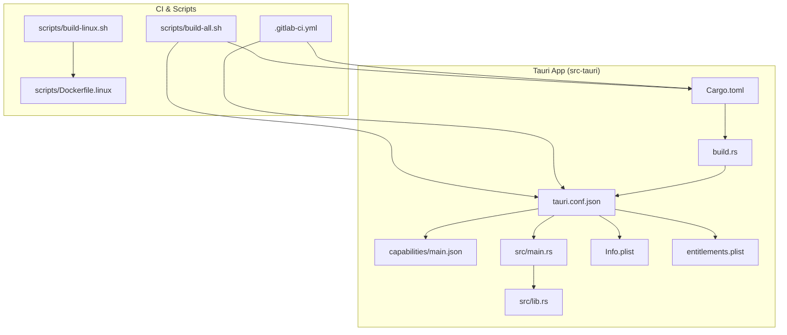
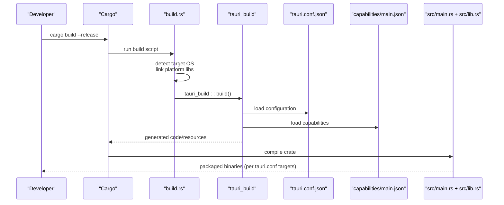
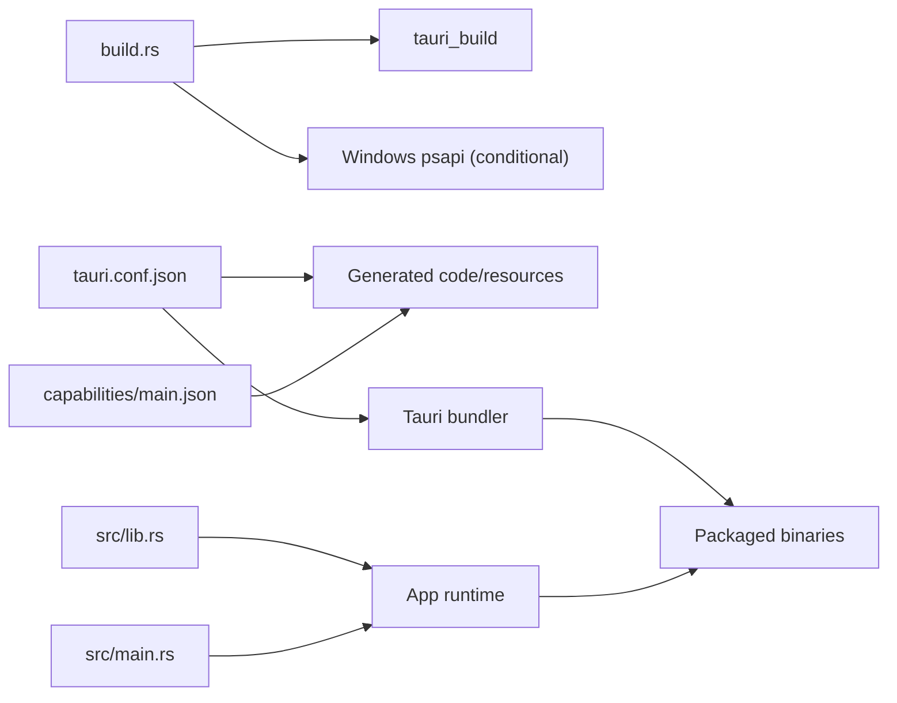

# Backend Compilation & Packaging

<cite>
**Referenced Files in This Document**
- [Cargo.toml](file://src-tauri/Cargo.toml)
- [build.rs](file://src-tauri/build.rs)
- [tauri.conf.json](file://src-tauri/tauri.conf.json)
- [main.json](file://src-tauri/capabilities/main.json)
- [main.rs](file://src-tauri/src/main.rs)
- [lib.rs](file://src-tauri/src/lib.rs)
- [Info.plist](file://src-tauri/Info.plist)
- [entitlements.plist](file://src-tauri/entitlements.plist)
- [.gitlab-ci.yml](file://.gitlab-ci.yml)
- [scripts/build-all.sh](file://scripts/build-all.sh)
- [scripts/build-linux.sh](file://scripts/build-linux.sh)
- [scripts/Dockerfile.linux](file://scripts/Dockerfile.linux)
</cite>

## Table of Contents
1. [Introduction](#introduction)
2. [Project Structure](#project-structure)
3. [Core Components](#core-components)
4. [Architecture Overview](#architecture-overview)
5. [Detailed Component Analysis](#detailed-component-analysis)
6. [Dependency Analysis](#dependency-analysis)
7. [Performance Considerations](#performance-considerations)
8. [Troubleshooting Guide](#troubleshooting-guide)
9. [Conclusion](#conclusion)
10. [Appendices](#appendices)

## Introduction
This document explains the Rust backend compilation and Tauri packaging pipeline for the SB Games launcher. It covers Cargo.toml dependency management, build script execution, platform-specific configurations, Tauri configuration (windows, security, capabilities), the build.rs script for dynamic linking and code generation, cross-platform compilation targeting Windows, macOS, and Linux, code signing and entitlements, and practical tips for customizing build targets, optimizing binary size, and handling platform-specific dependencies.

## Project Structure
The Tauri application is implemented under src-tauri with the following key files:
- Cargo.toml: Rust crate definition, dependencies, and profiles
- build.rs: Build script for platform-specific linking and tauri-build invocation
- tauri.conf.json: Tauri configuration for windows, security, bundling, and plugins
- capabilities/main.json: Capability definitions for window permissions
- src/main.rs and src/lib.rs: Entry point and backend logic
- Info.plist and entitlements.plist: macOS metadata and entitlements
- CI and scripts: Cross-platform build orchestration

**Diagram sources**
- [Cargo.toml](file://src-tauri/Cargo.toml)
- [build.rs](file://src-tauri/build.rs)
- [tauri.conf.json](file://src-tauri/tauri.conf.json)
- [main.json](file://src-tauri/capabilities/main.json)
- [main.rs](file://src-tauri/src/main.rs)
- [lib.rs](file://src-tauri/src/lib.rs)
- [Info.plist](file://src-tauri/Info.plist)
- [entitlements.plist](file://src-tauri/entitlements.plist)
- [.gitlab-ci.yml](file://.gitlab-ci.yml)
- [scripts/build-all.sh](file://scripts/build-all.sh)
- [scripts/build-linux.sh](file://scripts/build-linux.sh)
- [scripts/Dockerfile.linux](file://scripts/Dockerfile.linux)

**Section sources**
- [Cargo.toml](file://src-tauri/Cargo.toml)
- [build.rs](file://src-tauri/build.rs)
- [tauri.conf.json](file://src-tauri/tauri.conf.json)
- [main.json](file://src-tauri/capabilities/main.json)
- [main.rs](file://src-tauri/src/main.rs)
- [lib.rs](file://src-tauri/src/lib.rs)
- [Info.plist](file://src-tauri/Info.plist)
- [entitlements.plist](file://src-tauri/entitlements.plist)
- [.gitlab-ci.yml](file://.gitlab-ci.yml)
- [scripts/build-all.sh](file://scripts/build-all.sh)
- [scripts/build-linux.sh](file://scripts/build-linux.sh)
- [scripts/Dockerfile.linux](file://scripts/Dockerfile.linux)

## Core Components
- Cargo.toml defines the crate, edition, library types, dependencies (including Tauri v2 and platform-specific crates), and a release profile optimized for size and performance.
- build.rs performs conditional linking for Windows and invokes tauri_build to generate runtime code and resources.
- tauri.conf.json configures frontend integration, window layouts, CSP, bundling targets, platform-specific bundle settings, and plugin permissions.
- capabilities/main.json declares window permissions and plugin capabilities for the main and tray windows.
- src/main.rs sets the Windows subsystem for release builds and delegates to the library’s run function.
- src/lib.rs implements Tauri commands, security checks, system integrations, and a complex Minecraft Forge launcher workflow.

Key build and packaging elements:
- Release profile enables LTO, single codegen unit, panic abort, and stripping.
- Platform-specific dependencies and Windows linking via build.rs.
- Tauri bundler configured for “all” targets with icon sets and per-platform settings.
- macOS signing identity and entitlements file configured.

**Section sources**
- [Cargo.toml](file://src-tauri/Cargo.toml)
- [build.rs](file://src-tauri/build.rs)
- [tauri.conf.json](file://src-tauri/tauri.conf.json)
- [main.json](file://src-tauri/capabilities/main.json)
- [main.rs](file://src-tauri/src/main.rs)
- [lib.rs](file://src-tauri/src/lib.rs)

## Architecture Overview
The build and packaging pipeline integrates Cargo, Tauri’s code generator, and platform bundlers. The flow below maps to actual files and their roles.

**Diagram sources**
- [build.rs](file://src-tauri/build.rs)
- [tauri.conf.json](file://src-tauri/tauri.conf.json)
- [main.json](file://src-tauri/capabilities/main.json)
- [main.rs](file://src-tauri/src/main.rs)
- [lib.rs](file://src-tauri/src/lib.rs)

## Detailed Component Analysis

### Cargo.toml: Dependencies, Features, and Profiles
- Crate metadata and edition define the project identity and toolchain.
- Library types include staticlib, cdylib, and rlib for flexible embedding.
- Tauri v2 core and selected plugins are included with explicit features.
- Additional crates support networking, cryptography, async runtime, and platform utilities.
- Platform-specific dependency for Windows via target cfg.
- Release profile optimizes for size and performance with LTO, single codegen unit, panic abort, and strip.

Practical implications:
- Use the release profile for production builds to minimize binary size.
- Keep dependencies minimal and aligned with Tauri v2 feature flags.

**Section sources**
- [Cargo.toml](file://src-tauri/Cargo.toml)

### build.rs: Dynamic Linking and Code Generation
- Detects the target OS and links platform libraries conditionally.
- Invokes tauri_build to generate runtime code and embed resources defined in tauri.conf.json and capabilities.

Operational notes:
- On Windows, links psapi for process module enumeration used by anti-debug logic.
- Ensures generated code matches current configuration and capabilities.

**Section sources**
- [build.rs](file://src-tauri/build.rs)

### tauri.conf.json: Windows, Security, and Bundling
- Frontend integration: points to the built web assets and development server.
- Window definitions:
  - Main window: size limits, resizable, maximized, decorations, shadow, center.
  - Tray window: fixed size, non-resizable, transparent, always-on-top, skip-taskbar.
- Security:
  - Content Security Policy restricts sources for scripts, images, fonts, and connections.
  - Dangerous CSP modification flag disabled.
- Bundling:
  - Targets “all” for cross-platform distribution.
  - Icon set includes PNG sizes and platform-specific formats.
  - Windows: digest algorithm configured; certificate thumbprint and timestamp URL placeholders.
  - macOS: minimum system version, signing identity placeholder, entitlements file.
  - Linux: deb/rpm depends lists empty; AppImage bundles media framework.
- Plugins:
  - Shell open permission enabled.

Security and capability alignment:
- Capabilities in capabilities/main.json align with window permissions declared here.

**Section sources**
- [tauri.conf.json](file://src-tauri/tauri.conf.json)
- [main.json](file://src-tauri/capabilities/main.json)

### Capabilities: Permission Model
- Defines the capability identifier and description.
- Grants permissions for core window actions and shell open.
- Applies to both main and tray windows.

Integration:
- Generated schema files in gen/schemas are referenced by capability documents.

**Section sources**
- [main.json](file://src-tauri/capabilities/main.json)

### src/main.rs and src/lib.rs: Entry Point and Commands
- Entry point sets Windows subsystem for release builds and calls the library run function.
- lib.rs implements:
  - Anti-debug and anti-injection checks with OS-specific logic.
  - Tauri commands for version, system RAM detection, Discord Rich Presence, screenshots, notifications, and a sophisticated Minecraft Forge launcher workflow.
  - Cross-platform path resolution for screenshots and game directories.
  - Security prechecks and environment hygiene before launching external processes.

Security and safety:
- Guard thread monitors for debugger presence and injected modules.
- Path validation for sensitive filesystem operations.
- Controlled environment variables for Java processes.

**Section sources**
- [main.rs](file://src-tauri/src/main.rs)
- [lib.rs](file://src-tauri/src/lib.rs)

### macOS Metadata and Entitlements
- Info.plist provides application metadata.
- entitlements.plist is referenced by tauri.conf.json for macOS bundling.

Note: Actual signing identity and entitlements content should be configured according to Apple’s requirements.

**Section sources**
- [Info.plist](file://src-tauri/Info.plist)
- [entitlements.plist](file://src-tauri/entitlements.plist)
- [tauri.conf.json](file://src-tauri/tauri.conf.json)

### Cross-Platform Build Orchestration
- GitLab CI orchestrates builds across platforms.
- scripts/build-all.sh coordinates multi-target builds.
- scripts/build-linux.sh and scripts/Dockerfile.linux provide Linux-focused build environments.

Recommendations:
- Use CI matrices to build Windows, macOS, and Linux targets.
- Pin toolchain versions and use containerized builds for reproducibility.

**Section sources**
- [.gitlab-ci.yml](file://.gitlab-ci.yml)
- [scripts/build-all.sh](file://scripts/build-all.sh)
- [scripts/build-linux.sh](file://scripts/build-linux.sh)
- [scripts/Dockerfile.linux](file://scripts/Dockerfile.linux)

## Dependency Analysis
The Tauri application relies on a tight coupling between configuration, build script, and generated code. The diagram below maps actual dependencies among the key files.

**Diagram sources**
- [build.rs](file://src-tauri/build.rs)
- [tauri.conf.json](file://src-tauri/tauri.conf.json)
- [main.json](file://src-tauri/capabilities/main.json)
- [main.rs](file://src-tauri/src/main.rs)
- [lib.rs](file://src-tauri/src/lib.rs)

**Section sources**
- [build.rs](file://src-tauri/build.rs)
- [tauri.conf.json](file://src-tauri/tauri.conf.json)
- [main.json](file://src-tauri/capabilities/main.json)
- [main.rs](file://src-tauri/src/main.rs)
- [lib.rs](file://src-tauri/src/lib.rs)

## Performance Considerations
- Release profile settings:
  - opt-level = 3, lto = true, codegen-units = 1, panic = "abort", strip = true
- Impact: reduced binary size and improved runtime performance at the cost of longer compile times.
- Recommendations:
  - Enable these settings for production builds.
  - Consider incremental builds during development and full release builds for distribution.

**Section sources**
- [Cargo.toml](file://src-tauri/Cargo.toml)

## Troubleshooting Guide
Common issues and resolutions:
- Windows process module scanning fails:
  - Ensure psapi linkage is present in the build environment.
- macOS signing failures:
  - Verify signing identity and entitlements file paths in tauri.conf.json.
  - Confirm minimum system version compatibility.
- Linux bundling issues:
  - Review deb/rpm depends and AppImage media framework settings.
- CSP violations:
  - Align CSP sources with actual asset and API endpoints used by the app.
- Capability mismatches:
  - Ensure capability identifiers and permissions match window definitions.

**Section sources**
- [build.rs](file://src-tauri/build.rs)
- [tauri.conf.json](file://src-tauri/tauri.conf.json)
- [main.json](file://src-tauri/capabilities/main.json)

## Conclusion
The SB Games launcher integrates a robust Rust/Tauri build and packaging pipeline. Cargo.toml defines a lean dependency set and optimized release profile. The build.rs script handles platform-specific linking and invokes Tauri’s code generator. tauri.conf.json centralizes window, security, and bundling configuration, while capabilities/main.json enforces a strict permission model. Cross-platform builds are orchestrated via CI and scripts, with macOS signing and entitlements supported through dedicated configuration files.

## Appendices

### A. Customizing Build Targets
- To limit targets, adjust the bundling targets field in tauri.conf.json.
- Use Cargo feature flags to toggle optional dependencies.
- Add or remove platform-specific dependencies in Cargo.toml under target cfg blocks.

**Section sources**
- [tauri.conf.json](file://src-tauri/tauri.conf.json)
- [Cargo.toml](file://src-tauri/Cargo.toml)

### B. Optimizing Binary Size
- Keep the release profile settings enabled.
- Remove unused features and dependencies.
- Prefer statically linked components where appropriate.

**Section sources**
- [Cargo.toml](file://src-tauri/Cargo.toml)

### C. Handling Platform-Specific Dependencies
- Use target cfg sections in Cargo.toml for OS-specific crates.
- Configure build.rs to link required system libraries conditionally.
- Validate runtime behavior across Windows, macOS, and Linux.

**Section sources**
- [Cargo.toml](file://src-tauri/Cargo.toml)
- [build.rs](file://src-tauri/build.rs)

### D. Code Signing and Sandboxing
- macOS:
  - Set signing identity and configure entitlements file path in tauri.conf.json.
  - Ensure minimum system version meets distribution requirements.
- Windows:
  - Configure certificate thumbprint and timestamp URL for signed binaries.
- Linux:
  - Use AppImage with bundled media framework for self-contained distribution.

**Section sources**
- [tauri.conf.json](file://src-tauri/tauri.conf.json)