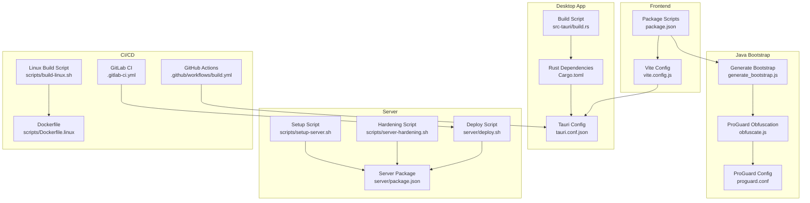
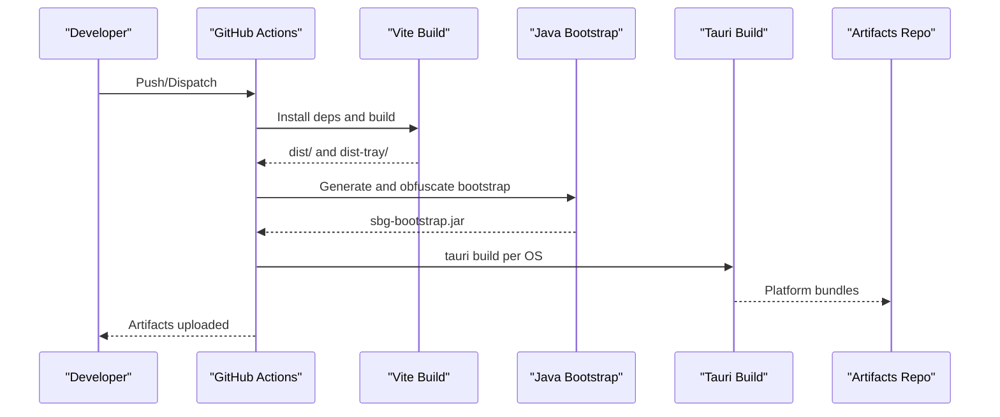
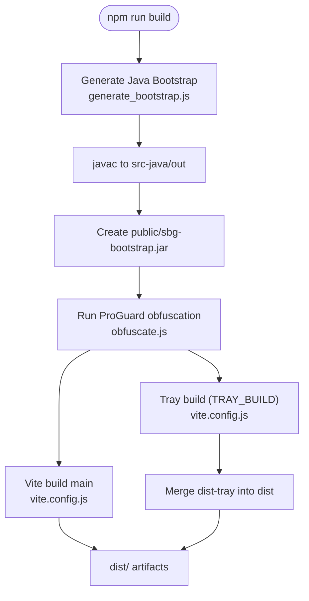
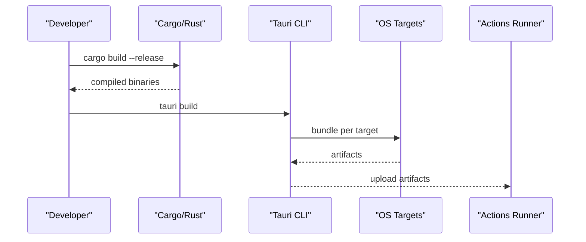
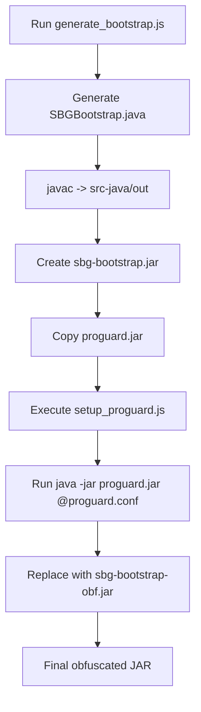
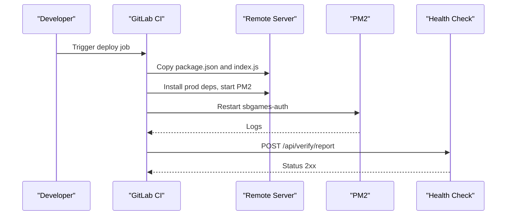
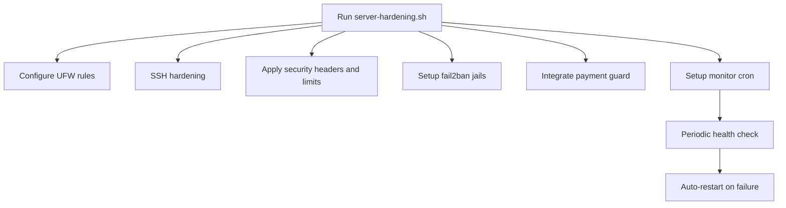
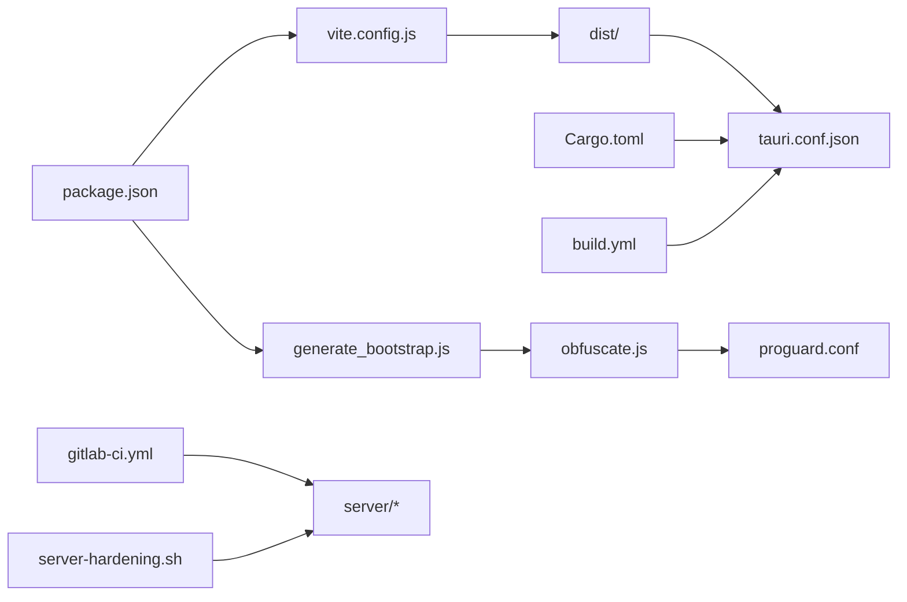

# Build & Deployment

<cite>
**Referenced Files in This Document**
- [package.json](file://package.json)
- [vite.config.js](file://vite.config.js)
- [Cargo.toml](file://src-tauri/Cargo.toml)
- [tauri.conf.json](file://src-tauri/tauri.conf.json)
- [build-all.sh](file://scripts/build-all.sh)
- [build-linux.sh](file://scripts/build-linux.sh)
- [Dockerfile.linux](file://scripts/Dockerfile.linux)
- [build.yml](file://.github/workflows/build.yml)
- [.gitlab-ci.yml](file://.gitlab-ci.yml)
- [generate_bootstrap.js](file://scratch/generate_bootstrap.js)
- [obfuscate.js](file://scratch/obfuscate.js)
- [proguard.conf](file://scratch/proguard.conf)
- [server/package.json](file://server/package.json)
- [server/deploy.sh](file://server/deploy.sh)
- [scripts/server-hardening.sh](file://scripts/server-hardening.sh)
- [scripts/setup-server.sh](file://scripts/setup-server.sh)
- [BUILD.md](file://BUILD.md)
- [src-tauri/build.rs](file://src-tauri/build.rs)
</cite>

## Table of Contents
1. [Introduction](#introduction)
2. [Project Structure](#project-structure)
3. [Core Components](#core-components)
4. [Architecture Overview](#architecture-overview)
5. [Detailed Component Analysis](#detailed-component-analysis)
6. [Dependency Analysis](#dependency-analysis)
7. [Performance Considerations](#performance-considerations)
8. [Troubleshooting Guide](#troubleshooting-guide)
9. [Conclusion](#conclusion)
10. [Appendices](#appendices)

## Introduction
This document describes the end-to-end build and deployment process for SBGames, covering:
- Multi-stage frontend build with Vite, asset optimization, and obfuscation
- Rust Tauri backend compilation, code signing, and platform packaging
- Java bootstrap generation, obfuscation, and runtime integrity checks
- Automated CI/CD pipelines for desktop releases and server deployments
- Production server hardening, security configurations, and monitoring
- Update mechanisms for desktop and web clients
- Environment-specific configurations and customization examples
- Quality assurance and rollback procedures

## Project Structure
The repository is organized into:
- Frontend: React + Vite with optional obfuscation plugin
- Tauri desktop app: Rust backend with platform bundling
- Java bootstrap generator and ProGuard obfuscation
- Server: Node.js service with PM2 and Nginx reverse proxy
- CI/CD: GitHub Actions for desktop builds, GitLab CI for server deployment
- Scripts: Local and containerized build helpers, server setup and hardening

**Diagram sources**
- [vite.config.js:1-97](file://vite.config.js#L1-L97)
- [package.json:1-43](file://package.json#L1-L43)
- [tauri.conf.json:1-89](file://src-tauri/tauri.conf.json#L1-L89)
- [Cargo.toml:1-57](file://src-tauri/Cargo.toml#L1-L57)
- [src-tauri/build.rs:1-8](file://src-tauri/build.rs#L1-L8)
- [generate_bootstrap.js:1-266](file://scratch/generate_bootstrap.js#L1-L266)
- [obfuscate.js:1-46](file://scratch/obfuscate.js#L1-L46)
- [proguard.conf:1-20](file://scratch/proguard.conf#L1-L20)
- [server/package.json:1-20](file://server/package.json#L1-L20)
- [server/deploy.sh:1-26](file://server/deploy.sh#L1-L26)
- [scripts/server-hardening.sh:1-224](file://scripts/server-hardening.sh#L1-L224)
- [scripts/setup-server.sh:1-180](file://scripts/setup-server.sh#L1-L180)
- [build.yml:1-95](file://.github/workflows/build.yml#L1-L95)
- [build-linux.sh:1-30](file://scripts/build-linux.sh#L1-L30)
- [Dockerfile.linux:1-47](file://scripts/Dockerfile.linux#L1-L47)

**Section sources**
- [package.json:1-43](file://package.json#L1-L43)
- [vite.config.js:1-97](file://vite.config.js#L1-L97)
- [tauri.conf.json:1-89](file://src-tauri/tauri.conf.json#L1-L89)
- [Cargo.toml:1-57](file://src-tauri/Cargo.toml#L1-L57)
- [src-tauri/build.rs:1-8](file://src-tauri/build.rs#L1-L8)
- [generate_bootstrap.js:1-266](file://scratch/generate_bootstrap.js#L1-L266)
- [obfuscate.js:1-46](file://scratch/obfuscate.js#L1-L46)
- [proguard.conf:1-20](file://scratch/proguard.conf#L1-L20)
- [server/package.json:1-20](file://server/package.json#L1-L20)
- [server/deploy.sh:1-26](file://server/deploy.sh#L1-L26)
- [scripts/server-hardening.sh:1-224](file://scripts/server-hardening.sh#L1-L224)
- [scripts/setup-server.sh:1-180](file://scripts/setup-server.sh#L1-L180)
- [build.yml:1-95](file://.github/workflows/build.yml#L1-L95)
- [build-all.sh:1-130](file://scripts/build-all.sh#L1-L130)
- [build-linux.sh:1-30](file://scripts/build-linux.sh#L1-L30)
- [Dockerfile.linux:1-47](file://scripts/Dockerfile.linux#L1-L47)
- [BUILD.md:1-61](file://BUILD.md#L1-L61)

## Core Components
- Frontend build and obfuscation: Vite with a custom obfuscation plugin and Terser minification; tray and main builds differ in entry and output directories.
- Desktop packaging: Tauri configuration defines bundling targets, CSP, and platform-specific options; Rust profile tuned for release.
- Java bootstrap: Dynamic generation of an obfuscated bootstrap class with embedded sensitive strings; ProGuard obfuscation and replacement of the original JAR.
- CI/CD: GitHub Actions for multi-platform desktop builds; GitLab CI for server deployment and post-deploy verification.
- Server hardening: UFW firewall, SSH hardening, Nginx security headers and rate limits, fail2ban, and anti-fraud guards.

**Section sources**
- [vite.config.js:1-97](file://vite.config.js#L1-L97)
- [package.json:1-43](file://package.json#L1-L43)
- [tauri.conf.json:1-89](file://src-tauri/tauri.conf.json#L1-L89)
- [Cargo.toml:1-57](file://src-tauri/Cargo.toml#L1-L57)
- [generate_bootstrap.js:1-266](file://scratch/generate_bootstrap.js#L1-L266)
- [obfuscate.js:1-46](file://scratch/obfuscate.js#L1-L46)
- [proguard.conf:1-20](file://scratch/proguard.conf#L1-L20)
- [build.yml:1-95](file://.github/workflows/build.yml#L1-L95)
- [.gitlab-ci.yml:1-57](file://.gitlab-ci.yml#L1-L57)
- [scripts/server-hardening.sh:1-224](file://scripts/server-hardening.sh#L1-L224)

## Architecture Overview
The build and deployment pipeline spans frontend, desktop, and server tiers with automated orchestration.

**Diagram sources**
- [build.yml:1-95](file://.github/workflows/build.yml#L1-L95)
- [package.json:1-43](file://package.json#L1-L43)
- [vite.config.js:1-97](file://vite.config.js#L1-L97)
- [generate_bootstrap.js:1-266](file://scratch/generate_bootstrap.js#L1-L266)
- [obfuscate.js:1-46](file://scratch/obfuscate.js#L1-L46)
- [tauri.conf.json:1-89](file://src-tauri/tauri.conf.json#L1-L89)

## Detailed Component Analysis

### Frontend Build and Asset Optimization
- Build commands:
  - Full build: generates Java bootstrap, runs Vite for main and tray outputs, merges tray into main dist.
  - Separate builds: main and tray builds with distinct entry points and output directories.
- Vite configuration:
  - Uses a custom obfuscation plugin that runs during the build phase and transforms JS chunks.
  - Minification via Terser with console/debugger removal.
  - Tray build variant disables source maps and sets a dedicated HTML entry.
- Aliasing and development server:
  - Path aliasing for imports.
  - Optional HMR host binding for Tauri dev.

**Diagram sources**
- [package.json:1-43](file://package.json#L1-L43)
- [generate_bootstrap.js:1-266](file://scratch/generate_bootstrap.js#L1-L266)
- [obfuscate.js:1-46](file://scratch/obfuscate.js#L1-L46)
- [vite.config.js:1-97](file://vite.config.js#L1-L97)

**Section sources**
- [package.json:1-43](file://package.json#L1-L43)
- [vite.config.js:1-97](file://vite.config.js#L1-L97)
- [generate_bootstrap.js:1-266](file://scratch/generate_bootstrap.js#L1-L266)
- [obfuscate.js:1-46](file://scratch/obfuscate.js#L1-L46)
- [proguard.conf:1-20](file://scratch/proguard.conf#L1-L20)

### Rust Tauri Backend Compilation and Packaging
- Cargo configuration:
  - Release profile optimized for speed and size with LTO, single codegen unit, panic abort, and stripping.
  - Platform-specific dependencies and Windows linking for diagnostics.
- Tauri configuration:
  - Bundling targets set to all supported platforms.
  - Windows signing fields present but not populated; macOS uses entitlements; Linux targets deb/rpm/AppImage.
  - CSP restricts resource loading to trusted origins; development URLs configured for local dev.
- Build orchestration:
  - Local scripts support per-OS builds and Docker-based Linux builds.
  - GitHub Actions matrix builds for Windows, macOS, and Linux and uploads artifacts.

**Diagram sources**
- [Cargo.toml:1-57](file://src-tauri/Cargo.toml#L1-L57)
- [tauri.conf.json:1-89](file://src-tauri/tauri.conf.json#L1-L89)
- [build-all.sh:1-130](file://scripts/build-all.sh#L1-L130)
- [build-linux.sh:1-30](file://scripts/build-linux.sh#L1-L30)
- [Dockerfile.linux:1-47](file://scripts/Dockerfile.linux#L1-L47)
- [build.yml:1-95](file://.github/workflows/build.yml#L1-L95)

**Section sources**
- [Cargo.toml:1-57](file://src-tauri/Cargo.toml#L1-L57)
- [tauri.conf.json:1-89](file://src-tauri/tauri.conf.json#L1-L89)
- [src-tauri/build.rs:1-8](file://src-tauri/build.rs#L1-L8)
- [build-all.sh:1-130](file://scripts/build-all.sh#L1-L130)
- [build-linux.sh:1-30](file://scripts/build-linux.sh#L1-L30)
- [Dockerfile.linux:1-47](file://scripts/Dockerfile.linux#L1-L47)
- [build.yml:1-95](file://.github/workflows/build.yml#L1-L95)

### Java Bootstrap Generation, Obfuscation, and Integrity Checks
- Generation:
  - Dynamically creates a Java class with obfuscated string constants and a main entrypoint.
  - Performs environment checks for debugger/agent presence and verifies modpack integrity via SHA-256 hashes.
- Obfuscation:
  - Extracts ProGuard, copies the JAR, generates a config, runs obfuscation, and replaces the original JAR with the obfuscated one.
- Security:
  - Runtime watchdog thread monitors for suspicious JVM arguments and environment variables.
  - Integrity verification ensures only approved mod JARs are accepted.

**Diagram sources**
- [generate_bootstrap.js:1-266](file://scratch/generate_bootstrap.js#L1-L266)
- [obfuscate.js:1-46](file://scratch/obfuscate.js#L1-L46)
- [proguard.conf:1-20](file://scratch/proguard.conf#L1-L20)

**Section sources**
- [generate_bootstrap.js:1-266](file://scratch/generate_bootstrap.js#L1-L266)
- [obfuscate.js:1-46](file://scratch/obfuscate.js#L1-L46)
- [proguard.conf:1-20](file://scratch/proguard.conf#L1-L20)

### Deployment Pipeline: Automated Builds, Testing, and Release Management
- Desktop:
  - GitHub Actions builds Windows, macOS, and Linux artifacts and uploads them.
  - Local scripts support cross-compilation and Docker-based Linux builds.
- Server:
  - GitLab CI deploys to a remote server via SSH, patches and validates the server code, restarts the service, and tests endpoints.
  - Manual trigger required for server deployment.

**Diagram sources**
- [.gitlab-ci.yml:1-57](file://.gitlab-ci.yml#L1-L57)
- [server/deploy.sh:1-26](file://server/deploy.sh#L1-L26)

**Section sources**
- [build.yml:1-95](file://.github/workflows/build.yml#L1-L95)
- [build-all.sh:1-130](file://scripts/build-all.sh#L1-L130)
- [build-linux.sh:1-30](file://scripts/build-linux.sh#L1-L30)
- [Dockerfile.linux:1-47](file://scripts/Dockerfile.linux#L1-L47)
- [.gitlab-ci.yml:1-57](file://.gitlab-ci.yml#L1-L57)
- [server/deploy.sh:1-26](file://server/deploy.sh#L1-L26)

### Server Hardening, Security Configurations, and Production Strategies
- Firewall and SSH:
  - UFW rules for API ports; SSH hardening with key-based auth and disabled root login.
- Nginx:
  - Security headers, rate limiting zones, connection limits, and bot blocking.
- Anti-fraud:
  - Payment request guards track per-user and per-IP limits.
- Monitoring:
  - Cron-based health check and auto-restart; fail2ban jails for brute-force and DDoS protection.
- Systemd and environment:
  - systemd service with hardening flags; environment variables managed via .env.

**Diagram sources**
- [scripts/server-hardening.sh:1-224](file://scripts/server-hardening.sh#L1-L224)
- [scripts/setup-server.sh:1-180](file://scripts/setup-server.sh#L1-L180)

**Section sources**
- [scripts/server-hardening.sh:1-224](file://scripts/server-hardening.sh#L1-L224)
- [scripts/setup-server.sh:1-180](file://scripts/setup-server.sh#L1-L180)
- [server/package.json:1-20](file://server/package.json#L1-L20)

### Update Mechanisms for Desktop and Web Platforms
- Desktop (Tauri):
  - New releases are produced by CI/CD and distributed as platform-specific installers.
  - Users update by installing the latest installer from the release channel.
- Web:
  - Static site served behind Nginx; updates are deployed by replacing server files and restarting services.
  - Rate limiting and caching applied to static assets.

**Section sources**
- [build.yml:1-95](file://.github/workflows/build.yml#L1-L95)
- [tauri.conf.json:1-89](file://src-tauri/tauri.conf.json#L1-L89)
- [scripts/setup-server.sh:1-180](file://scripts/setup-server.sh#L1-L180)

### Build Customization and Environment-Specific Configurations
- Environment variables:
  - TAURI_DEV_HOST enables WebSocket-based HMR for Tauri dev server.
  - TRAY_BUILD toggles tray-specific build configuration.
- Tauri CSP:
  - Adjusted to allow specific domains for images, fonts, and API endpoints.
- ProGuard dictionary:
  - Custom dictionary file referenced in the ProGuard config for consistent obfuscation.
- CI matrices:
  - GitHub Actions supports Windows/macOS/Linux with explicit artifact uploads.

**Section sources**
- [vite.config.js:1-97](file://vite.config.js#L1-L97)
- [tauri.conf.json:1-89](file://src-tauri/tauri.conf.json#L1-L89)
- [proguard.conf:1-20](file://scratch/proguard.conf#L1-L20)
- [build.yml:1-95](file://.github/workflows/build.yml#L1-L95)
- [BUILD.md:1-61](file://BUILD.md#L1-L61)

## Dependency Analysis
- Frontend depends on Vite and React; obfuscation plugin is applied post-build.
- Tauri depends on Rust toolchain and platform libraries; bundling integrates frontend dist.
- Java bootstrap generation depends on Node.js and ProGuard; obfuscation depends on JDK JMODs.
- Server deployment depends on SSH connectivity, PM2, and Nginx.

**Diagram sources**
- [vite.config.js:1-97](file://vite.config.js#L1-L97)
- [package.json:1-43](file://package.json#L1-L43)
- [generate_bootstrap.js:1-266](file://scratch/generate_bootstrap.js#L1-L266)
- [obfuscate.js:1-46](file://scratch/obfuscate.js#L1-L46)
- [proguard.conf:1-20](file://scratch/proguard.conf#L1-L20)
- [tauri.conf.json:1-89](file://src-tauri/tauri.conf.json#L1-L89)
- [Cargo.toml:1-57](file://src-tauri/Cargo.toml#L1-L57)
- [build.yml:1-95](file://.github/workflows/build.yml#L1-L95)
- [.gitlab-ci.yml:1-57](file://.gitlab-ci.yml#L1-L57)
- [scripts/server-hardening.sh:1-224](file://scripts/server-hardening.sh#L1-L224)

**Section sources**
- [vite.config.js:1-97](file://vite.config.js#L1-L97)
- [package.json:1-43](file://package.json#L1-L43)
- [tauri.conf.json:1-89](file://src-tauri/tauri.conf.json#L1-L89)
- [Cargo.toml:1-57](file://src-tauri/Cargo.toml#L1-L57)
- [generate_bootstrap.js:1-266](file://scratch/generate_bootstrap.js#L1-L266)
- [obfuscate.js:1-46](file://scratch/obfuscate.js#L1-L46)
- [proguard.conf:1-20](file://scratch/proguard.conf#L1-L20)
- [build.yml:1-95](file://.github/workflows/build.yml#L1-L95)
- [.gitlab-ci.yml:1-57](file://.gitlab-ci.yml#L1-L57)
- [scripts/server-hardening.sh:1-224](file://scripts/server-hardening.sh#L1-L224)

## Performance Considerations
- Frontend:
  - Terser minification and console/debugger removal reduce payload size.
  - Self-defending and control-flow flattening increase runtime overhead; evaluate trade-offs for production environments.
- Desktop:
  - Rust release profile with LTO and single codegen unit improves performance and reduces binary size.
- Server:
  - Nginx rate limiting and connection limits prevent resource exhaustion.
  - PM2 process management and cron-based monitoring improve uptime.

[No sources needed since this section provides general guidance]

## Troubleshooting Guide
- Vite build fails due to missing obfuscator:
  - Ensure the obfuscation plugin module is installed; the plugin gracefully skips when unavailable.
- Tauri build on Linux:
  - Install system dependencies listed in the Dockerfile; use the provided Docker build script for reproducible environments.
- macOS Gatekeeper issues:
  - The build script applies ad-hoc signing; if still blocked, clear extended attributes or right-click “Open”.
- Java bootstrap obfuscation:
  - Confirm JDK JMODs are available; ProGuard requires them to run successfully.
- Server deployment:
  - Verify SSH credentials and remote paths; ensure PM2 is installed and service is restarted.
  - Use the hardening script to validate firewall and Nginx configuration.

**Section sources**
- [vite.config.js:1-97](file://vite.config.js#L1-L97)
- [Dockerfile.linux:1-47](file://scripts/Dockerfile.linux#L1-L47)
- [build-all.sh:1-130](file://scripts/build-all.sh#L1-L130)
- [obfuscate.js:1-46](file://scratch/obfuscate.js#L1-L46)
- [scripts/server-hardening.sh:1-224](file://scripts/server-hardening.sh#L1-L224)
- [server/deploy.sh:1-26](file://server/deploy.sh#L1-L26)

## Conclusion
The SBGames build and deployment system combines a modern frontend with robust desktop packaging, secure Java bootstrap obfuscation, and hardened server infrastructure. Automation via CI/CD ensures consistent releases across platforms, while security-focused configurations protect both desktop and web surfaces. The provided scripts and configurations offer a strong baseline for customization and maintenance.

[No sources needed since this section summarizes without analyzing specific files]

## Appendices
- Quick references:
  - Desktop build matrix and artifacts: [build.yml:1-95](file://.github/workflows/build.yml#L1-L95)
  - Local build scripts: [build-all.sh:1-130](file://scripts/build-all.sh#L1-L130), [build-linux.sh:1-30](file://scripts/build-linux.sh#L1-L30), [Dockerfile.linux:1-47](file://scripts/Dockerfile.linux#L1-L47)
  - Frontend build and obfuscation: [package.json:1-43](file://package.json#L1-L43), [vite.config.js:1-97](file://vite.config.js#L1-L97)
  - Tauri configuration and Rust profile: [tauri.conf.json:1-89](file://src-tauri/tauri.conf.json#L1-L89), [Cargo.toml:1-57](file://src-tauri/Cargo.toml#L1-L57)
  - Java bootstrap and ProGuard: [generate_bootstrap.js:1-266](file://scratch/generate_bootstrap.js#L1-L266), [obfuscate.js:1-46](file://scratch/obfuscate.js#L1-L46), [proguard.conf:1-20](file://scratch/proguard.conf#L1-L20)
  - Server deployment and hardening: [server/deploy.sh:1-26](file://server/deploy.sh#L1-L26), [scripts/server-hardening.sh:1-224](file://scripts/server-hardening.sh#L1-L224), [scripts/setup-server.sh:1-180](file://scripts/setup-server.sh#L1-L180)
  - Build documentation: [BUILD.md:1-61](file://BUILD.md#L1-L61)

[No sources needed since this section lists references without analysis]