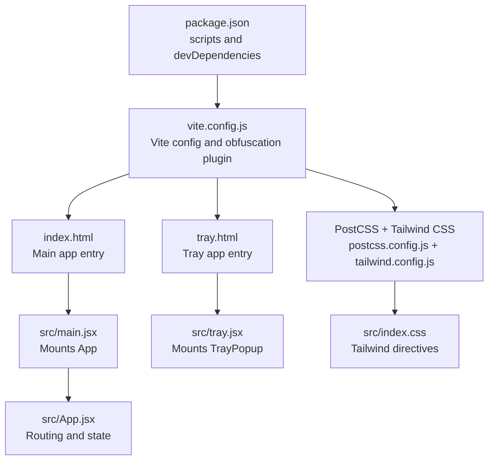
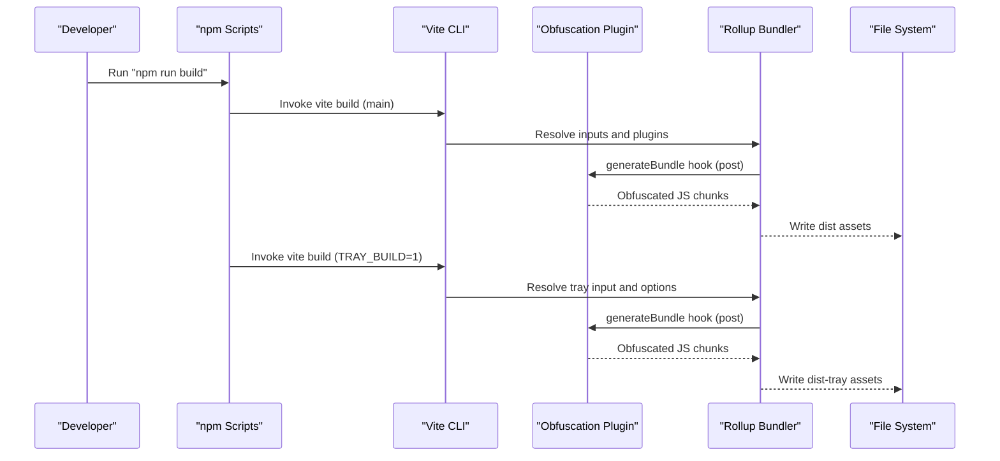
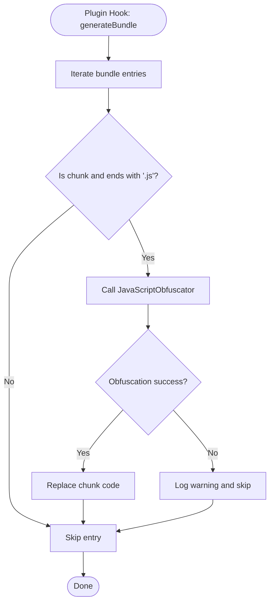
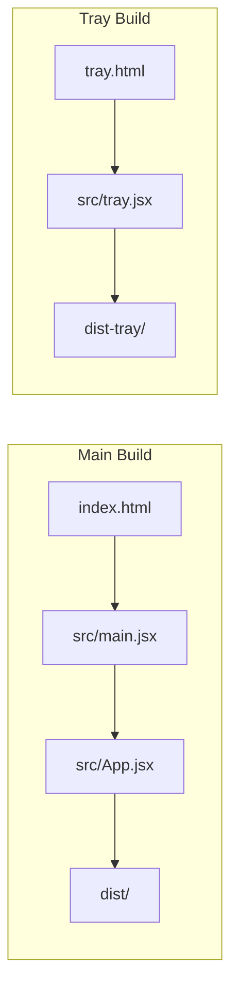
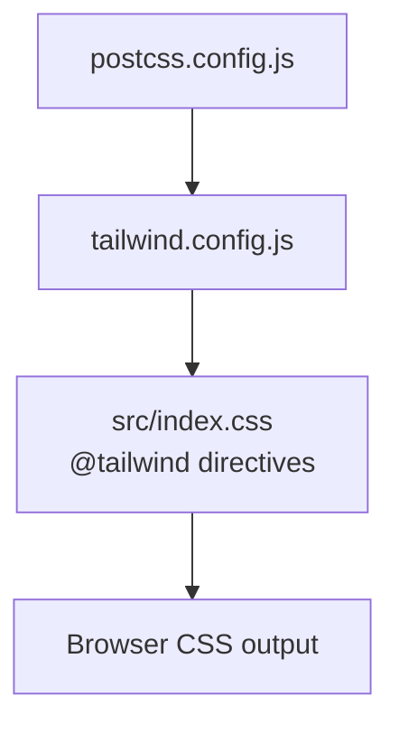
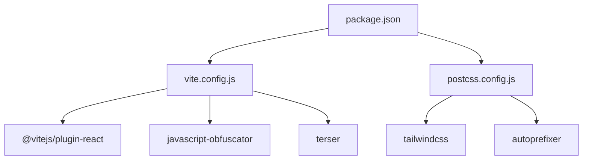

# Frontend Build Configuration

<cite>
**Referenced Files in This Document**
- [vite.config.js](file://vite.config.js)
- [package.json](file://package.json)
- [postcss.config.js](file://postcss.config.js)
- [tailwind.config.js](file://tailwind.config.js)
- [index.html](file://index.html)
- [tray.html](file://tray.html)
- [src/main.jsx](file://src/main.jsx)
- [src/tray.jsx](file://src/tray.jsx)
- [src/App.jsx](file://src/App.jsx)
- [src/index.css](file://src/index.css)
</cite>

## Table of Contents
1. [Introduction](#introduction)
2. [Project Structure](#project-structure)
3. [Core Components](#core-components)
4. [Architecture Overview](#architecture-overview)
5. [Detailed Component Analysis](#detailed-component-analysis)
6. [Dependency Analysis](#dependency-analysis)
7. [Performance Considerations](#performance-considerations)
8. [Troubleshooting Guide](#troubleshooting-guide)
9. [Conclusion](#conclusion)

## Introduction
This document explains the frontend build configuration for the launcher application, focusing on Vite setup, React plugin configuration, asset optimization, and the JavaScript obfuscation pipeline. It also covers the dual build modes for the main application and the tray build, Terser minification, source map handling, development versus production environments, and PostCSS/Tailwind CSS integration for styling optimization. Practical examples show how to customize builds for different environments and deployment targets.

## Project Structure
The build system centers around Vite with a custom obfuscation plugin and a dual-output configuration supporting both the main application and a tray-specific build. Tailwind CSS and PostCSS are configured for efficient styling optimization. The HTML entry points differ per build mode, and npm scripts orchestrate the overall build process.

**Diagram sources**
- [package.json:1-43](file://package.json#L1-L43)
- [vite.config.js:1-97](file://vite.config.js#L1-L97)
- [index.html:1-29](file://index.html#L1-L29)
- [tray.html:1-13](file://tray.html#L1-L13)
- [src/main.jsx:1-11](file://src/main.jsx#L1-L11)
- [src/tray.jsx:1-7](file://src/tray.jsx#L1-L7)
- [src/App.jsx:1-39](file://src/App.jsx#L1-L39)
- [postcss.config.js:1-7](file://postcss.config.js#L1-L7)
- [tailwind.config.js:1-62](file://tailwind.config.js#L1-L62)
- [src/index.css:1-34](file://src/index.css#L1-L34)

**Section sources**
- [package.json:1-43](file://package.json#L1-L43)
- [vite.config.js:1-97](file://vite.config.js#L1-L97)
- [index.html:1-29](file://index.html#L1-L29)
- [tray.html:1-13](file://tray.html#L1-L13)
- [src/main.jsx:1-11](file://src/main.jsx#L1-L11)
- [src/tray.jsx:1-7](file://src/tray.jsx#L1-L7)
- [src/App.jsx:1-39](file://src/App.jsx#L1-L39)
- [postcss.config.js:1-7](file://postcss.config.js#L1-L7)
- [tailwind.config.js:1-62](file://tailwind.config.js#L1-L62)
- [src/index.css:1-34](file://src/index.css#L1-L34)

## Core Components
- Vite configuration with environment-aware defaults and a custom obfuscation plugin applied during build.
- React plugin for JSX transformation and Fast Refresh in development.
- Dual build modes:
  - Main application build targeting the standard web app entry.
  - Tray build with a separate entry point, output directory, and distinct optimization profile.
- Terser minification with console and debugger removal.
- PostCSS and Tailwind CSS integration for utility-first styling and purging unused CSS.
- Alias resolution for clean module imports.

**Section sources**
- [vite.config.js:62-96](file://vite.config.js#L62-L96)
- [package.json:6-14](file://package.json#L6-L14)
- [postcss.config.js:1-7](file://postcss.config.js#L1-L7)
- [tailwind.config.js:1-62](file://tailwind.config.js#L1-L62)

## Architecture Overview
The build pipeline is orchestrated by Vite and npm scripts. The main application uses a standard HTML entry and mounts the React root to render the primary app. The tray build uses a dedicated HTML entry and renders a focused tray interface. Both builds leverage the same obfuscation plugin and Terser configuration, but the tray build disables source maps and removes console statements for a leaner runtime.

**Diagram sources**
- [package.json:9-11](file://package.json#L9-L11)
- [vite.config.js:62-96](file://vite.config.js#L62-L96)
- [vite.config.js:42-60](file://vite.config.js#L42-L60)

## Detailed Component Analysis

### Vite Configuration and Environment Modes
- Environment detection:
  - Uses a host variable for development HMR configuration when running under Tauri dev hosting.
  - Detects tray build via an environment flag to switch configuration.
- Plugins:
  - React plugin for JSX and HMR.
  - Custom obfuscation plugin applied post-build to transform JavaScript chunks.
- Main build:
  - Standard HTML entry and development server with strict port and optional HMR host override.
  - Minification with Terser and console/debugger removal.
  - No source maps in development.
- Tray build:
  - Separate output directory and input mapping to the tray HTML entry.
  - Minification with Terser and console/debugger removal.
  - No source maps for the tray build.
- Path alias:
  - Resolves "@" to the src directory for cleaner imports.

**Section sources**
- [vite.config.js:5-6](file://vite.config.js#L5-L6)
- [vite.config.js:62-96](file://vite.config.js#L62-L96)

### Obfuscation Plugin Implementation
- Plugin definition:
  - Named plugin applied during build phase and enforced post to run after bundling.
  - Iterates over generated chunks and obfuscates only JavaScript chunks.
- JavaScript Obfuscator settings:
  - Compact code generation and control flow flattening with a threshold to balance performance and obscurity.
  - Dead code injection for confusion.
  - Self-defending enabled to deter tampering.
  - String array encoding with RC4 and chained wrapper functions to hide sensitive strings.
  - Split strings and identifier renaming with hexadecimal prefixes.
  - Debug protection and console output disabling for production hardening.
  - Numbers-to-expressions and simplifications for further obfuscation.
  - Target set to browser for compatibility.
- Error handling:
  - Gracefully skips obfuscation on failures and logs warnings.

**Diagram sources**
- [vite.config.js:42-60](file://vite.config.js#L42-L60)
- [vite.config.js:7-40](file://vite.config.js#L7-L40)

**Section sources**
- [vite.config.js:42-60](file://vite.config.js#L42-L60)
- [vite.config.js:7-40](file://vite.config.js#L7-L40)

### Dual Build Modes: Main Application and Tray Build
- Main application build:
  - Entry: standard HTML with the React root element.
  - Output: default dist directory.
  - Development server with HMR and strict port enforcement.
  - Minification with Terser and console/debugger removal.
- Tray build:
  - Entry: tray-specific HTML with a minimal DOM and dedicated script.
  - Output: dist-tray directory with empty-out-dir behavior.
  - Minification with Terser and console/debugger removal.
  - No source maps for reduced footprint.
- Orchestration:
  - Combined build script runs Java bootstrap steps, main build, tray build, and merges tray artifacts into the main dist folder.

**Diagram sources**
- [index.html:1-29](file://index.html#L1-L29)
- [tray.html:1-13](file://tray.html#L1-L13)
- [src/main.jsx:1-11](file://src/main.jsx#L1-L11)
- [src/tray.jsx:1-7](file://src/tray.jsx#L1-L7)
- [src/App.jsx:1-39](file://src/App.jsx#L1-L39)

**Section sources**
- [vite.config.js:63-78](file://vite.config.js#L63-L78)
- [vite.config.js:79-96](file://vite.config.js#L79-L96)
- [package.json:9-11](file://package.json#L9-L11)

### Terser Minification and Source Map Handling
- Minification:
  - Enabled for both builds using Terser.
  - Compress options remove console and debugger statements to reduce payload and prevent dev hints.
- Source maps:
  - Disabled for both main and tray builds to minimize artifact size and improve security posture.

**Section sources**
- [vite.config.js:73-74](file://vite.config.js#L73-L74)
- [vite.config.js:91-93](file://vite.config.js#L91-L93)

### Development vs Production Environments
- Development:
  - HMR enabled with optional host override for Tauri dev hosting.
  - Strict port enforcement and watch exclusions for Tauri sources.
  - No minification or obfuscation in development to preserve readability and fast rebuilds.
- Production:
  - Obfuscation plugin active and applied post-build.
  - Minification with Terser and console/debugger removal.
  - No source maps for both main and tray builds.

**Section sources**
- [vite.config.js:82-88](file://vite.config.js#L82-L88)
- [vite.config.js:42-60](file://vite.config.js#L42-L60)
- [vite.config.js:73-74](file://vite.config.js#L73-L74)
- [vite.config.js:91-93](file://vite.config.js#L91-L93)

### PostCSS and Tailwind CSS Integration
- PostCSS configuration:
  - Enables Tailwind CSS and Autoprefixer plugins.
- Tailwind configuration:
  - Scans HTML and React component files for class usage.
  - Defines a custom AMOLED-themed palette, typography scales, shadows, gradients, animations, and keyframes.
- CSS entry:
  - Global CSS file includes Tailwind directives and base layer customizations.

**Diagram sources**
- [postcss.config.js:1-7](file://postcss.config.js#L1-L7)
- [tailwind.config.js:1-62](file://tailwind.config.js#L1-L62)
- [src/index.css:1-34](file://src/index.css#L1-L34)

**Section sources**
- [postcss.config.js:1-7](file://postcss.config.js#L1-L7)
- [tailwind.config.js:1-62](file://tailwind.config.js#L1-L62)
- [src/index.css:1-34](file://src/index.css#L1-L34)

### Asset Optimization and Entry Points
- Entry points:
  - Main app: standard HTML with React root.
  - Tray app: simplified HTML with dedicated script.
- Mounting:
  - Main app mounts the root App component.
  - Tray app mounts a focused tray popup component.
- Styling:
  - Tailwind directives in the global CSS file ensure purge-friendly optimization.
  - Theme customization supports dark-mode-first design with custom animations and effects.

**Section sources**
- [index.html:1-29](file://index.html#L1-L29)
- [tray.html:1-13](file://tray.html#L1-L13)
- [src/main.jsx:1-11](file://src/main.jsx#L1-L11)
- [src/tray.jsx:1-7](file://src/tray.jsx#L1-L7)
- [src/App.jsx:1-39](file://src/App.jsx#L1-L39)
- [src/index.css:1-34](file://src/index.css#L1-L34)

## Dependency Analysis
The build configuration relies on several key dependencies and their interactions:
- Vite orchestrates the build and integrates plugins.
- React plugin enables JSX/HMR.
- JavaScript Obfuscator powers the custom obfuscation plugin.
- Terser handles minification.
- PostCSS and Tailwind CSS manage styling and purging.
- npm scripts coordinate multi-target builds.

**Diagram sources**
- [vite.config.js:1-3](file://vite.config.js#L1-L3)
- [package.json:29-41](file://package.json#L29-L41)
- [postcss.config.js:1-7](file://postcss.config.js#L1-L7)

**Section sources**
- [vite.config.js:1-3](file://vite.config.js#L1-L3)
- [package.json:29-41](file://package.json#L29-L41)
- [postcss.config.js:1-7](file://postcss.config.js#L1-L7)

## Performance Considerations
- Obfuscation overhead:
  - Applied post-build; consider build time impact and adjust thresholds if CI performance becomes a bottleneck.
- Minification and purging:
  - Terser removes dead code and console statements; Tailwind purges unused classes to reduce CSS size.
- Source maps:
  - Disabled in production to avoid exposing original source and reduce bundle size.
- Development ergonomics:
  - HMR and strict ports improve iteration speed; exclude Tauri source directories from watching to avoid unnecessary rebuilds.

## Troubleshooting Guide
- Obfuscation failures:
  - The plugin logs warnings and skips problematic chunks; check console output for specific messages and review obfuscation options.
- Missing obfuscation:
  - Ensure the plugin is applied during build and that the environment allows dynamic imports of the obfuscator library.
- Tray build artifacts:
  - Verify the tray build script sets the tray environment flag and writes to the correct output directory.
- CSS not applied:
  - Confirm Tailwind directives are present in the global CSS and that scanning globs match actual source locations.

**Section sources**
- [vite.config.js:42-60](file://vite.config.js#L42-L60)
- [package.json:9-11](file://package.json#L9-L11)
- [src/index.css:1-34](file://src/index.css#L1-L34)

## Conclusion
The build configuration provides a robust, dual-mode setup for both the main application and the tray interface. It leverages Vite’s extensibility through a custom obfuscation plugin, enforces strong minification and hardening, and integrates Tailwind CSS for efficient styling. Development and production modes are clearly separated, with appropriate optimizations for each. The included npm scripts streamline multi-target builds, ensuring consistent and secure delivery across environments.