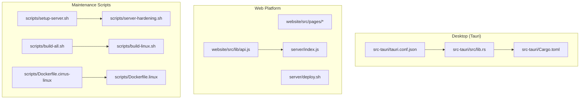
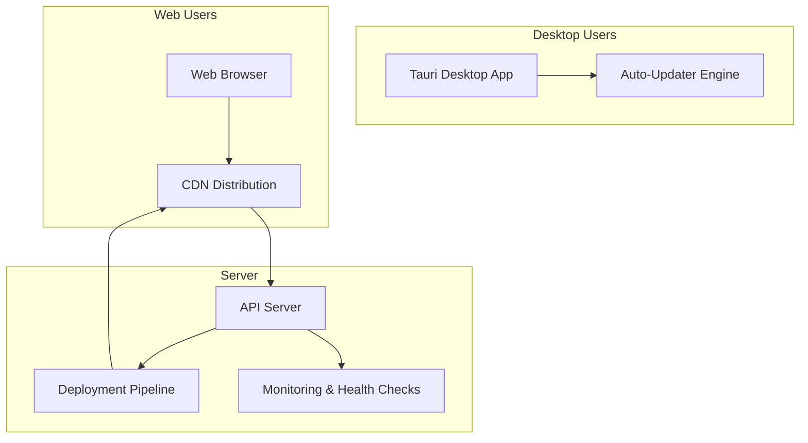
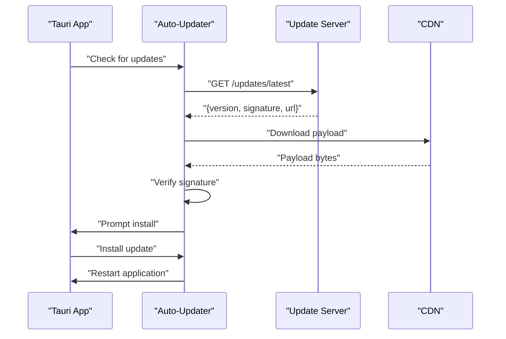
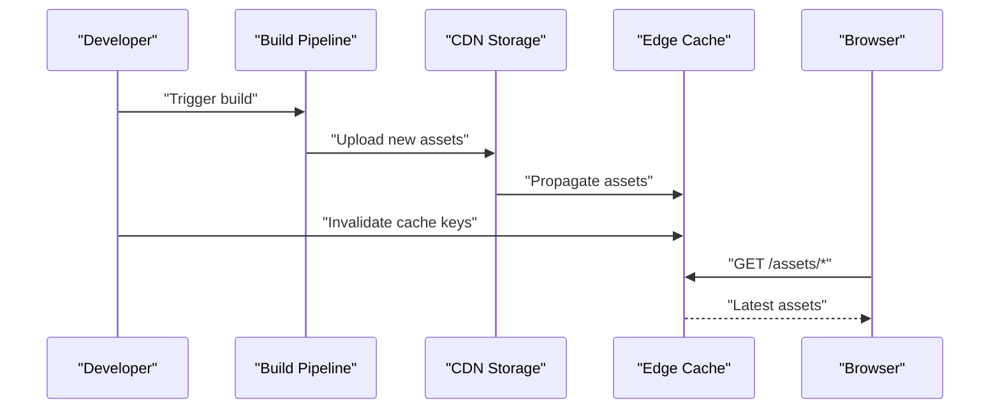
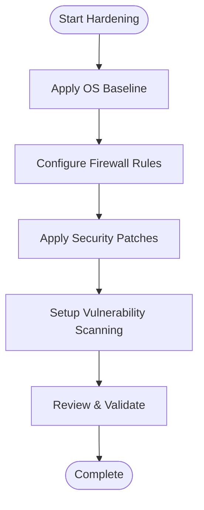
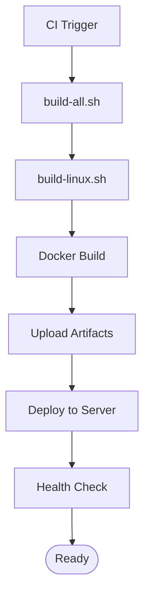
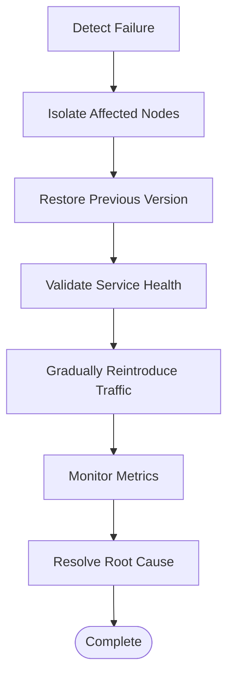
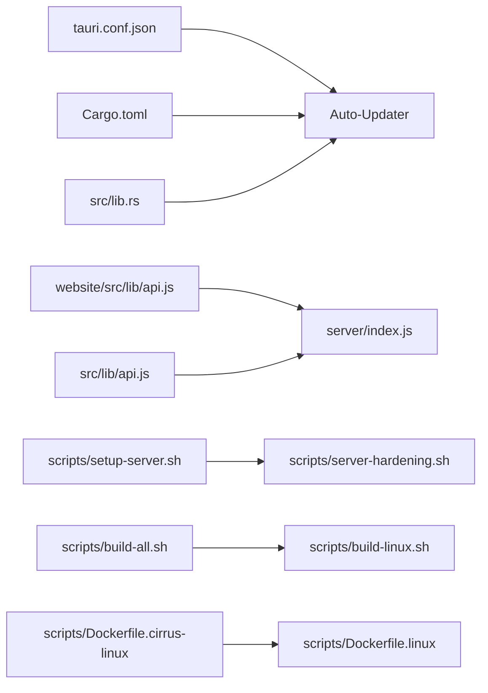

# Update & Maintenance Procedures

<cite>
**Referenced Files in This Document**
- [tauri.conf.json](file://src-tauri/tauri.conf.json)
- [lib.rs](file://src-tauri/src/lib.rs)
- [main.rs](file://src-tauri/src/main.rs)
- [Cargo.toml](file://src-tauri/Cargo.toml)
- [index.js](file://server/index.js)
- [deploy.sh](file://server/deploy.sh)
- [setup-server.sh](file://scripts/setup-server.sh)
- [server-hardening.sh](file://scripts/server-hardening.sh)
- [build-all.sh](file://scripts/build-all.sh)
- [build-linux.sh](file://scripts/build-linux.sh)
- [Dockerfile.cirrus-linux](file://scripts/Dockerfile.cirrus-linux)
- [Dockerfile.linux](file://scripts/Dockerfile.linux)
- [api.js](file://src/lib/api.js)
- [api.js](file://website/src/lib/api.js)
</cite>

## Table of Contents
1. [Introduction](#introduction)
2. [Project Structure](#project-structure)
3. [Core Components](#core-components)
4. [Architecture Overview](#architecture-overview)
5. [Detailed Component Analysis](#detailed-component-analysis)
6. [Dependency Analysis](#dependency-analysis)
7. [Performance Considerations](#performance-considerations)
8. [Troubleshooting Guide](#troubleshooting-guide)
9. [Conclusion](#conclusion)
10. [Appendices](#appendices)

## Introduction
This document provides comprehensive update and maintenance procedures for both desktop (Tauri) and web platforms. It covers automatic update mechanisms, delta/full reinstall scenarios for desktop, CDN-based web updates with cache invalidation, server hardening, maintenance scripts, backups, monitoring, rollback procedures, scheduled maintenance windows, zero-downtime deployments, and health checks.

## Project Structure
The repository contains:
- Desktop application built with Tauri under src-tauri
- Web application under website and server for CDN delivery
- Maintenance and deployment scripts under scripts
- Server-side deployment automation under server

**Diagram sources**
- [tauri.conf.json](file://src-tauri/tauri.conf.json)
- [lib.rs](file://src-tauri/src/lib.rs)
- [Cargo.toml](file://src-tauri/Cargo.toml)
- [api.js](file://website/src/lib/api.js)
- [index.js](file://server/index.js)
- [deploy.sh](file://server/deploy.sh)
- [setup-server.sh](file://scripts/setup-server.sh)
- [server-hardening.sh](file://scripts/server-hardening.sh)
- [build-all.sh](file://scripts/build-all.sh)
- [build-linux.sh](file://scripts/build-linux.sh)
- [Dockerfile.cirrus-linux](file://scripts/Dockerfile.cirrus-linux)
- [Dockerfile.linux](file://scripts/Dockerfile.linux)

**Section sources**
- [tauri.conf.json](file://src-tauri/tauri.conf.json)
- [lib.rs](file://src-tauri/src/lib.rs)
- [Cargo.toml](file://src-tauri/Cargo.toml)
- [api.js](file://website/src/lib/api.js)
- [index.js](file://server/index.js)
- [deploy.sh](file://server/deploy.sh)
- [setup-server.sh](file://scripts/setup-server.sh)
- [server-hardening.sh](file://scripts/server-hardening.sh)
- [build-all.sh](file://scripts/build-all.sh)
- [build-linux.sh](file://scripts/build-linux.sh)
- [Dockerfile.cirrus-linux](file://scripts/Dockerfile.cirrus-linux)
- [Dockerfile.linux](file://scripts/Dockerfile.linux)

## Core Components
- Desktop auto-updater: Configured via Tauri configuration and Rust runtime integration
- Web CDN updates: Server-side deployment pipeline with cache invalidation
- Server hardening: Security baseline and vulnerability scanning preparation
- Maintenance automation: Setup, build, and deployment scripts
- Health checks: API endpoints and monitoring hooks

**Section sources**
- [tauri.conf.json](file://src-tauri/tauri.conf.json)
- [lib.rs](file://src-tauri/src/lib.rs)
- [index.js](file://server/index.js)
- [api.js](file://website/src/lib/api.js)

## Architecture Overview
The update architecture integrates desktop and web systems with centralized server-side orchestration.

**Diagram sources**
- [tauri.conf.json](file://src-tauri/tauri.conf.json)
- [lib.rs](file://src-tauri/src/lib.rs)
- [index.js](file://server/index.js)

## Detailed Component Analysis

### Desktop Auto-Update System (Tauri)
The desktop application leverages Tauri's auto-updater capabilities configured in the Tauri configuration. The updater integrates with the Rust runtime to manage update checks, download, and installation.

**Diagram sources**
- [tauri.conf.json](file://src-tauri/tauri.conf.json)
- [lib.rs](file://src-tauri/src/lib.rs)

Key implementation patterns:
- Update channel configuration and signature verification
- Delta vs full reinstall logic handled by the updater engine
- Restart semantics after successful installation

**Section sources**
- [tauri.conf.json](file://src-tauri/tauri.conf.json)
- [lib.rs](file://src-tauri/src/lib.rs)
- [Cargo.toml](file://src-tauri/Cargo.toml)

### Web Platform Update Process (CDN + Cache Invalidation)
Web updates are delivered via CDN with cache invalidation to ensure clients receive the latest assets.

**Diagram sources**
- [index.js](file://server/index.js)
- [deploy.sh](file://server/deploy.sh)

Operational flow:
- Asset upload to CDN storage
- Edge propagation and cache warming
- Cache key invalidation to force fresh fetches
- Client receives updated content on next request

**Section sources**
- [index.js](file://server/index.js)
- [deploy.sh](file://server/deploy.sh)

### Server Hardening Procedures
Hardening focuses on security baselines, firewall configuration, and vulnerability scanning readiness.

**Diagram sources**
- [server-hardening.sh](file://scripts/server-hardening.sh)

Recommended steps:
- Minimal service exposure and hardened SSH access
- Automated patch management and scheduled scans
- Network segmentation and logging aggregation

**Section sources**
- [server-hardening.sh](file://scripts/server-hardening.sh)

### Maintenance Scripts and Automation
Scripts automate server setup, builds, and deployment.

**Diagram sources**
- [build-all.sh](file://scripts/build-all.sh)
- [build-linux.sh](file://scripts/build-linux.sh)
- [Dockerfile.cirrus-linux](file://scripts/Dockerfile.cirrus-linux)
- [Dockerfile.linux](file://scripts/Dockerfile.linux)

**Section sources**
- [build-all.sh](file://scripts/build-all.sh)
- [build-linux.sh](file://scripts/build-linux.sh)
- [Dockerfile.cirrus-linux](file://scripts/Dockerfile.cirrus-linux)
- [Dockerfile.linux](file://scripts/Dockerfile.linux)

### Rollback Procedures and Emergency Recovery
Rollback ensures minimal downtime during failed updates.

**Diagram sources**
- [index.js](file://server/index.js)
- [deploy.sh](file://server/deploy.sh)

Practical actions:
- Canary releases and staged rollouts
- Automated rollback triggers based on health checks
- Immutable infrastructure with version pinning

**Section sources**
- [index.js](file://server/index.js)
- [deploy.sh](file://server/deploy.sh)

### Scheduled Maintenance Windows and Zero-Downtime Deployments
- Schedule maintenance during low-traffic periods
- Use blue/green or rolling deployments
- Implement read-only mode for write-heavy operations
- Validate pre/post conditions with automated tests

[No sources needed since this section provides general guidance]

### Health Check Implementations
- API endpoints for liveness/readiness probes
- Database connectivity and cache health
- CDN reachability and asset integrity checks

**Section sources**
- [api.js](file://website/src/lib/api.js)
- [api.js](file://src/lib/api.js)

## Dependency Analysis
Desktop and web systems share common server-side dependencies for updates and monitoring.

**Diagram sources**
- [tauri.conf.json](file://src-tauri/tauri.conf.json)
- [Cargo.toml](file://src-tauri/Cargo.toml)
- [lib.rs](file://src-tauri/src/lib.rs)
- [api.js](file://website/src/lib/api.js)
- [api.js](file://src/lib/api.js)
- [index.js](file://server/index.js)
- [setup-server.sh](file://scripts/setup-server.sh)
- [server-hardening.sh](file://scripts/server-hardening.sh)
- [build-all.sh](file://scripts/build-all.sh)
- [build-linux.sh](file://scripts/build-linux.sh)
- [Dockerfile.cirrus-linux](file://scripts/Dockerfile.cirrus-linux)
- [Dockerfile.linux](file://scripts/Dockerfile.linux)

**Section sources**
- [tauri.conf.json](file://src-tauri/tauri.conf.json)
- [lib.rs](file://src-tauri/src/lib.rs)
- [Cargo.toml](file://src-tauri/Cargo.toml)
- [api.js](file://website/src/lib/api.js)
- [api.js](file://src/lib/api.js)
- [index.js](file://server/index.js)
- [setup-server.sh](file://scripts/setup-server.sh)
- [server-hardening.sh](file://scripts/server-hardening.sh)
- [build-all.sh](file://scripts/build-all.sh)
- [build-linux.sh](file://scripts/build-linux.sh)
- [Dockerfile.cirrus-linux](file://scripts/Dockerfile.cirrus-linux)
- [Dockerfile.linux](file://scripts/Dockerfile.linux)

## Performance Considerations
- Optimize CDN cache TTL and cache key strategies for web assets
- Minimize desktop update payload sizes and leverage delta updates
- Use compression and bundling for faster downloads
- Implement circuit breakers and retry policies for update requests

[No sources needed since this section provides general guidance]

## Troubleshooting Guide
Common issues and resolutions:
- Desktop update failures: Verify signatures, network connectivity, and disk permissions
- Web update delays: Confirm CDN propagation and cache invalidation completion
- Server hardening conflicts: Revert changes and re-run hardened configuration
- Deployment errors: Inspect logs, validate environment variables, and rerun deployment script

**Section sources**
- [lib.rs](file://src-tauri/src/lib.rs)
- [index.js](file://server/index.js)
- [server-hardening.sh](file://scripts/server-hardening.sh)
- [deploy.sh](file://server/deploy.sh)

## Conclusion
This document outlined end-to-end update and maintenance procedures for desktop and web platforms. By combining Tauri's auto-updater, CDN-driven web updates, robust server hardening, and automated maintenance scripts, teams can achieve reliable, secure, and efficient deployments with minimal downtime.

## Appendices
- Backup procedures: Regular snapshots of server configurations and database dumps
- Monitoring setup: Metrics collection, alerting rules, and dashboard views
- Rollback playbooks: Step-by-step instructions for reverting failed updates

[No sources needed since this section provides general guidance]