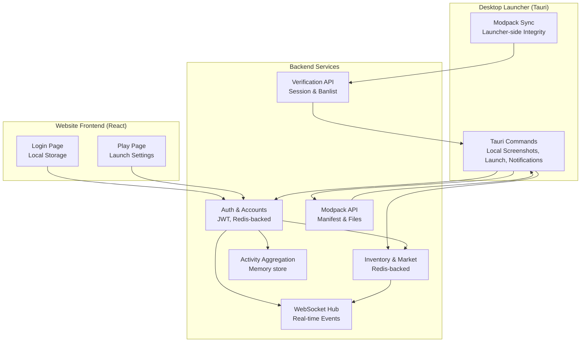
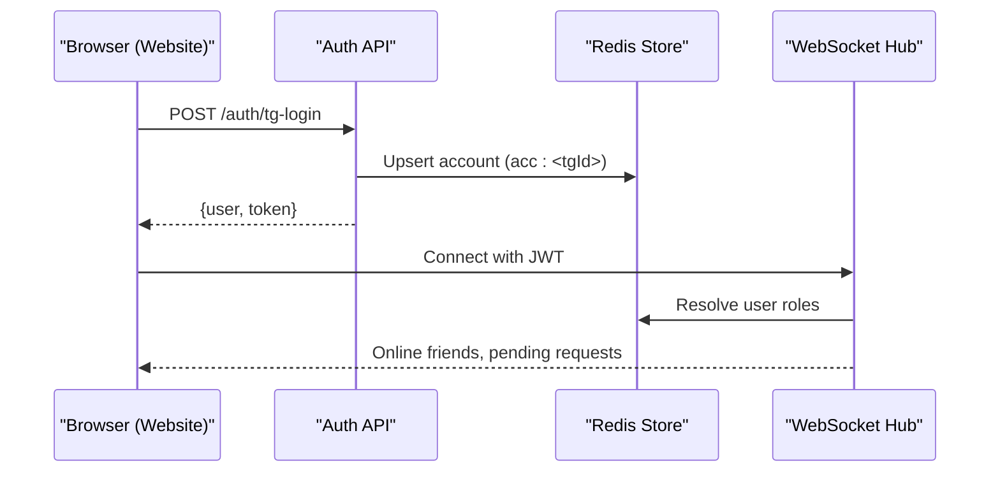
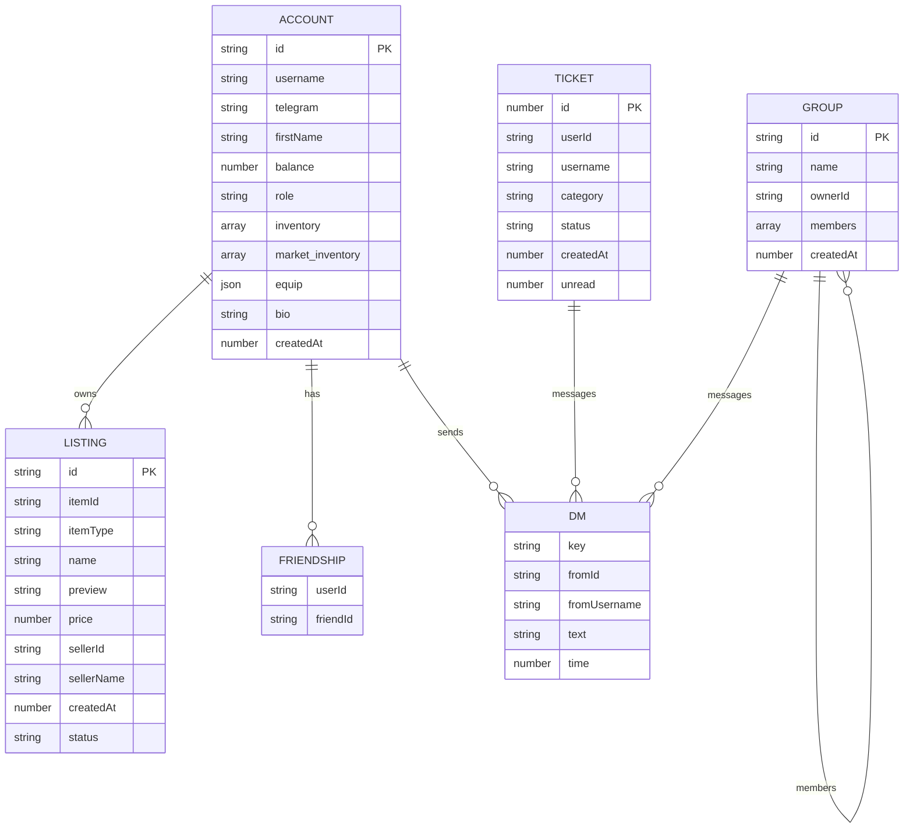
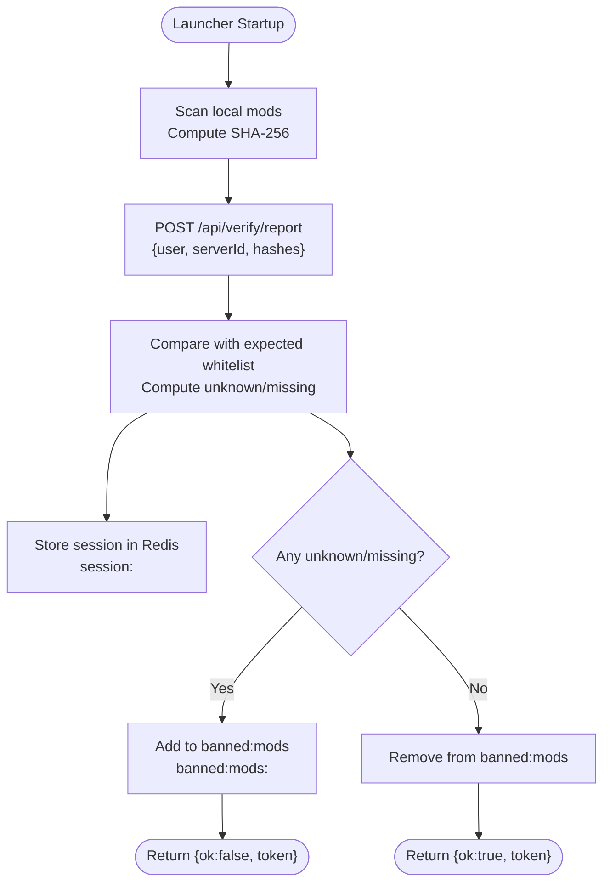
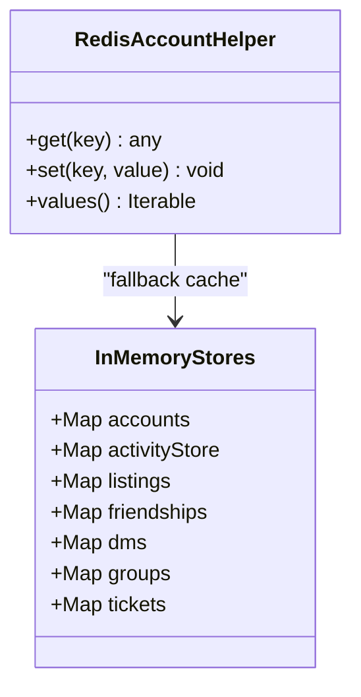
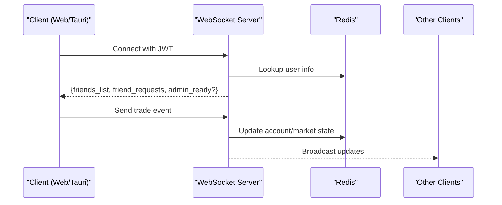
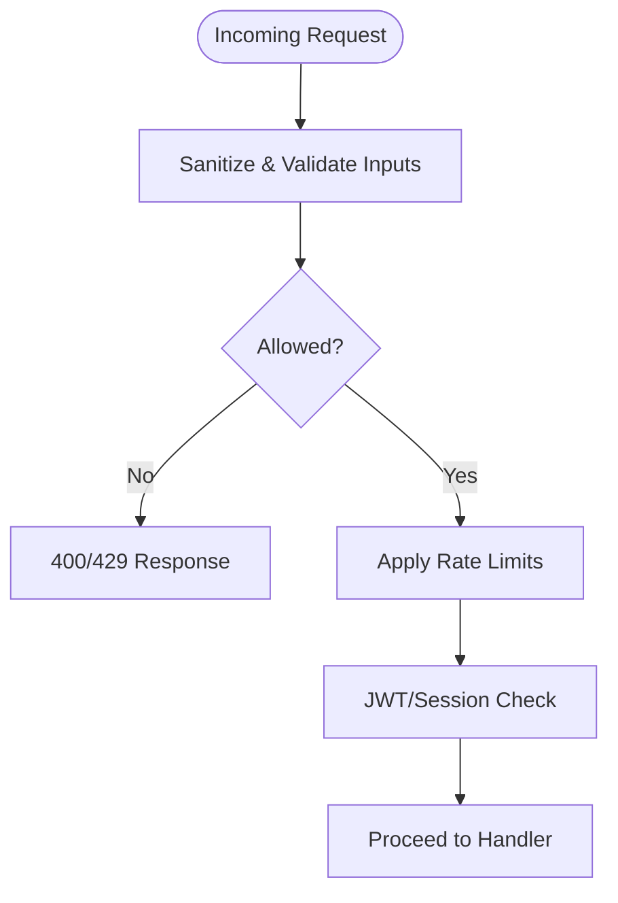
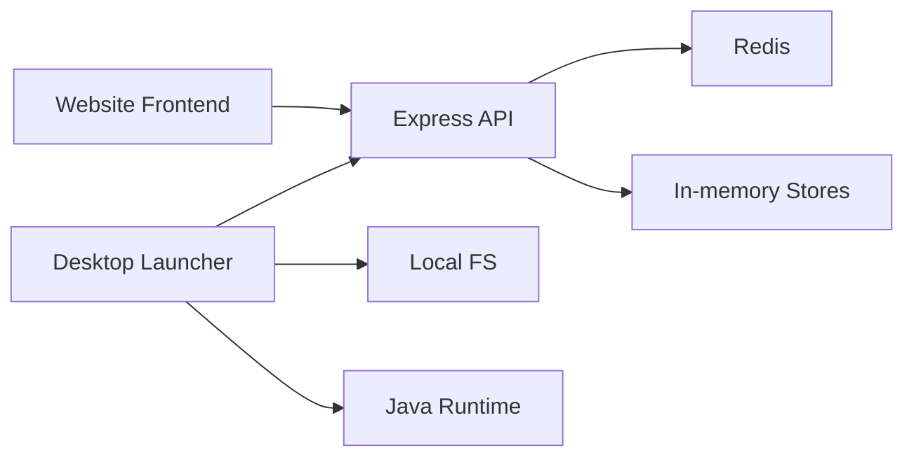

# Data Management

<cite>
**Referenced Files in This Document**
- [server/index.js](file://server/index.js)
- [server-files/modpack.js](file://server-files/modpack.js)
- [server-files/verify.js](file://server-files/verify.js)
- [src-tauri/src/lib.rs](file://src-tauri/src/lib.rs)
- [src/App.jsx](file://src/App.jsx)
- [src/pages/PlayPage.jsx](file://src/pages/PlayPage.jsx)
</cite>

## Table of Contents
1. [Introduction](#introduction)
2. [Project Structure](#project-structure)
3. [Core Components](#core-components)
4. [Architecture Overview](#architecture-overview)
5. [Detailed Component Analysis](#detailed-component-analysis)
6. [Dependency Analysis](#dependency-analysis)
7. [Performance Considerations](#performance-considerations)
8. [Troubleshooting Guide](#troubleshooting-guide)
9. [Conclusion](#conclusion)
10. [Appendices](#appendices)

## Introduction
This document describes the data management strategy for SBGames, covering database design, file management, caching, synchronization, and operational procedures. It explains how user accounts, game data, social relationships, marketplace transactions, and modpack integrity are modeled and handled across the desktop launcher, website, and backend services. It also documents caching via Redis, data validation and sanitization, security controls, and practical guidance for backups, migrations, and version management.

## Project Structure
The data-related systems span three primary layers:
- Backend service: Express server exposing REST APIs and WebSocket endpoints for authentication, profiles, inventory, marketplace, activity, groups, and support tickets.
- Desktop launcher: Tauri-based application that authenticates users, manages local assets, enforces modpack integrity, and launches the game client.
- File services: Dedicated routes for modpack manifests, ZIP delivery, and integrity verification.

**Diagram sources**
- [server/index.js:138-796](file://server/index.js#L138-L796)
- [server-files/modpack.js:1-153](file://server-files/modpack.js#L1-L153)
- [server-files/verify.js:1-139](file://server-files/verify.js#L1-L139)
- [src-tauri/src/lib.rs:340-800](file://src-tauri/src/lib.rs#L340-L800)
- [src/App.jsx:1-40](file://src/App.jsx#L1-L40)
- [src/pages/PlayPage.jsx:19-48](file://src/pages/PlayPage.jsx#L19-L48)

**Section sources**
- [server/index.js:138-796](file://server/index.js#L138-L796)
- [server-files/modpack.js:1-153](file://server-files/modpack.js#L1-L153)
- [server-files/verify.js:1-139](file://server-files/verify.js#L1-L139)
- [src-tauri/src/lib.rs:340-800](file://src-tauri/src/lib.rs#L340-L800)
- [src/App.jsx:1-40](file://src/App.jsx#L1-L40)
- [src/pages/PlayPage.jsx:19-48](file://src/pages/PlayPage.jsx#L19-L48)

## Core Components
- Authentication and accounts
  - Telegram login flow with JWT issuance and Redis-backed persistence for user accounts.
  - Optional desktop code-based flow for launcher-to-bot verification.
- Inventory and marketplace
  - Catalog-driven shop and player-owned items; market listings and trades tracked in memory with Redis-backed account persistence.
- Social and community
  - Friendships, friend requests, DMs, group chats, and profile comments with rate limiting and sanitization.
- Activity tracking
  - Client-sent play sessions aggregated server-side for analytics and leaderboards.
- Modpack integrity and verification
  - Manifest generation, per-file SHA-256, and verification pipeline for launcher and server-side checks.
- Desktop launcher
  - Local screenshot gallery, notification system, and secure Minecraft launcher with modpack synchronization and integrity enforcement.

**Section sources**
- [server/index.js:140-176](file://server/index.js#L140-L176)
- [server/index.js:303-383](file://server/index.js#L303-L383)
- [server/index.js:435-580](file://server/index.js#L435-L580)
- [server/index.js:400-433](file://server/index.js#L400-L433)
- [server-files/modpack.js:25-81](file://server-files/modpack.js#L25-L81)
- [server-files/verify.js:59-113](file://server-files/verify.js#L59-L113)
- [src-tauri/src/lib.rs:233-282](file://src-tauri/src/lib.rs#L233-L282)
- [src-tauri/src/lib.rs:340-796](file://src-tauri/src/lib.rs#L340-L796)

## Architecture Overview
The system integrates three channels:
- Website: REST and WebSocket for user-facing features.
- Desktop launcher: Tauri commands for local operations and secure game launching.
- Backend services: Shared Redis for session/account persistence, with in-memory aggregation for activity and marketplace listings.

**Diagram sources**
- [server/index.js:140-176](file://server/index.js#L140-L176)
- [server/index.js:752-796](file://server/index.js#L752-L796)

**Section sources**
- [server/index.js:140-176](file://server/index.js#L140-L176)
- [server/index.js:752-796](file://server/index.js#L752-L796)

## Detailed Component Analysis

### Database Design and Persistence
- Account model (persisted in Redis)
  - Keys: acc:<tgId>
  - Fields include identifiers, profile metadata, balances, inventories, equipment, and timestamps.
- In-memory aggregates
  - Activity sessions, marketplace listings, friend relations, DMs, group data, and support tickets are kept in memory for fast access and low-latency WebSocket updates.
- Redis-backed account helper
  - Transparent Redis fallback to an in-memory Map for resilience and development ergonomics.

**Diagram sources**
- [server/index.js:31-35](file://server/index.js#L31-L35)
- [server/index.js:94-99](file://server/index.js#L94-L99)
- [server/index.js:437-438](file://server/index.js#L437-L438)
- [server/index.js:582-585](file://server/index.js#L582-L585)

**Section sources**
- [server/index.js:31-35](file://server/index.js#L31-L35)
- [server/index.js:94-99](file://server/index.js#L94-L99)
- [server/index.js:437-438](file://server/index.js#L437-L438)
- [server/index.js:582-585](file://server/index.js#L582-L585)

### File Management System
- Modpack manifest and distribution
  - Manifest includes version, ZIP URL, ZIP SHA-256, and per-file metadata with SHA-256 and size.
  - Signed with HMAC for integrity verification.
  - Endpoints: GET /api/mods/manifest, GET /api/mods/zip/:version, GET /api/mods/file/:name.
- Verification pipeline
  - Launcher reports hashes to backend; backend compares against expected whitelist and maintains a ban list keyed by user.
  - Endpoints: POST /api/verify/report, GET /api/verify/check, GET /api/verify/banlist.
- Desktop launcher asset handling
  - Local screenshot gallery with safe path validation and base64 read-back.
  - Secure Minecraft launcher with environment hardening and modpack synchronization prior to launch.

**Diagram sources**
- [server-files/verify.js:59-113](file://server-files/verify.js#L59-L113)
- [server-files/verify.js:115-124](file://server-files/verify.js#L115-L124)
- [server-files/verify.js:131-136](file://server-files/verify.js#L131-L136)

**Section sources**
- [server-files/modpack.js:25-81](file://server-files/modpack.js#L25-L81)
- [server-files/modpack.js:85-118](file://server-files/modpack.js#L85-L118)
- [server-files/modpack.js:133-150](file://server-files/modpack.js#L133-L150)
- [server-files/verify.js:59-113](file://server-files/verify.js#L59-L113)
- [server-files/verify.js:115-124](file://server-files/verify.js#L115-L124)
- [server-files/verify.js:131-136](file://server-files/verify.js#L131-L136)
- [src-tauri/src/lib.rs:233-282](file://src-tauri/src/lib.rs#L233-L282)
- [src-tauri/src/lib.rs:340-796](file://src-tauri/src/lib.rs#L340-L796)

### Caching Strategies
- Redis for session and account data
  - Lazy connection with graceful fallback to in-memory Map.
  - Account helper transparently reads/writes to Redis with a memory cache.
- In-memory caches for high-frequency reads
  - Activity sessions, marketplace listings, friend relations, DMs, group data, and support tickets.
- Rate limiting and input sanitization
  - Express rate limiter, body size limits, and HTML sanitization for user inputs.

**Diagram sources**
- [server/index.js:31-35](file://server/index.js#L31-L35)
- [server/index.js:94-99](file://server/index.js#L94-L99)

**Section sources**
- [server/index.js:27-35](file://server/index.js#L27-L35)
- [server/index.js:65-68](file://server/index.js#L65-L68)
- [server/index.js:70-74](file://server/index.js#L70-L74)
- [server/index.js:94-99](file://server/index.js#L94-L99)

### Data Synchronization Across Platforms
- Real-time updates via WebSocket
  - Clients authenticate with JWT; upon connection, server broadcasts online status and sends personal lists (friends, friend requests, admin stats).
- Cross-device consistency
  - Account state is persisted in Redis; inventory and market data are updated atomically and propagated to clients via WS events.
- Launcher-to-backend coordination
  - Launcher reports mod hashes to backend; server emits WS events to notify players of marketplace sales and admin actions.

**Diagram sources**
- [server/index.js:752-796](file://server/index.js#L752-L796)
- [server/index.js:528-563](file://server/index.js#L528-L563)

**Section sources**
- [server/index.js:752-796](file://server/index.js#L752-L796)
- [server/index.js:528-563](file://server/index.js#L528-L563)

### Data Validation, Sanitization, and Security
- Input validation and sanitization
  - Strict sanitization for strings, enforced length limits, and regex-based allowlists for usernames and filenames.
- CORS and rate limiting
  - Origin allowlist for web and desktop origins; rate limits for API and webhook endpoints.
- JWT and token-based auth
  - Stateless JWT with expiration; WS authentication uses token verification.
- Desktop launcher protections
  - Anti-debugging and anti-injection checks; module scanning; environment hygiene; single-launch protection; secure screenshot read-back with path validation.

**Diagram sources**
- [server/index.js:70-82](file://server/index.js#L70-L82)
- [server/index.js:64-68](file://server/index.js#L64-L68)
- [server/index.js:289-301](file://server/index.js#L289-L301)
- [src-tauri/src/lib.rs:17-133](file://src-tauri/src/lib.rs#L17-L133)
- [src-tauri/src/lib.rs:273-282](file://src-tauri/src/lib.rs#L273-L282)

**Section sources**
- [server/index.js:70-82](file://server/index.js#L70-L82)
- [server/index.js:64-68](file://server/index.js#L64-L68)
- [server/index.js:289-301](file://server/index.js#L289-L301)
- [src-tauri/src/lib.rs:17-133](file://src-tauri/src/lib.rs#L17-L133)
- [src-tauri/src/lib.rs:273-282](file://src-tauri/src/lib.rs#L273-L282)

### Backup and Recovery Procedures
- Redis-backed accounts
  - Persisted under acc:<tgId>; use Redis persistence (RDB/AOF) and regular snapshots for disaster recovery.
- In-memory data
  - Activity sessions, marketplace listings, and social data are transient; acceptable loss given real-time nature.
- Modpack integrity
  - Maintain signed manifests and ZIPs; store expected hashes for verification; keep historical versions for rollback.
- Launcher-local data
  - Screenshots and settings are stored locally; ensure user-managed backups of important directories.

[No sources needed since this section provides general guidance]

### Data Migration Strategies
- Redis key schema changes
  - Use controlled rollout with dual-read/dual-write to migrate field names or structures; remove old keys after verification.
- Catalog migrations
  - Incrementally add new item types to catalogs; maintain backward compatibility until deprecation period.
- Modpack versioning
  - Keep multiple versions under separate directories; advertise latest via manifest; gracefully phase out older versions.

[No sources needed since this section provides general guidance]

### Version Management
- Modpack versions
  - Latest version determined by filesystem modification time; manifest includes version and signature.
- Launcher version reporting
  - Tauri command exposes version string for diagnostics and auto-update prompts.

**Section sources**
- [server-files/modpack.js:34-37](file://server-files/modpack.js#L34-L37)
- [server-files/modpack.js:70-80](file://server-files/modpack.js#L70-L80)
- [src-tauri/src/lib.rs:142-143](file://src-tauri/src/lib.rs#L142-L143)

### Examples of Data Access Patterns and Performance Optimization
- Efficient account retrieval
  - Use RedisAccount helper to minimize latency and avoid repeated network calls.
- Batched WebSocket updates
  - Coalesce frequent updates (e.g., inventory changes) and emit periodic summaries to reduce bandwidth.
- Pagination and limits
  - Apply limits to comments, messages, and listing queries; use reverse chronological ordering for recent-first views.
- CDN and signed URLs
  - Serve mod files via signed URLs or short-lived tokens to reduce origin load.

[No sources needed since this section provides general guidance]

### Data Retention and Privacy Compliance
- Data minimization
  - Collect only necessary fields; sanitize and truncate inputs; enforce strict length limits.
- Consent and transparency
  - Provide clear privacy notices and user controls for profile visibility and data export.
- Right to erasure
  - Implement deletion routines for accounts and associated data; invalidate cached entries.
- Audit logging
  - Log administrative actions and moderation events; retain logs per policy.

[No sources needed since this section provides general guidance]

## Dependency Analysis
- Backend depends on Redis for persistence and on in-memory maps for transient state.
- Desktop launcher depends on Tauri commands and local filesystem for assets and game launching.
- Website frontend persists minimal state in localStorage and communicates with backend via REST and WebSocket.

**Diagram sources**
- [server/index.js:27-35](file://server/index.js#L27-L35)
- [src-tauri/src/lib.rs:340-796](file://src-tauri/src/lib.rs#L340-L796)

**Section sources**
- [server/index.js:27-35](file://server/index.js#L27-L35)
- [src-tauri/src/lib.rs:340-796](file://src-tauri/src/lib.rs#L340-L796)

## Performance Considerations
- Prefer Redis for hot-path reads (accounts, sessions).
- Use in-memory stores for high-throughput, low-latency operations (activity, listings).
- Apply rate limits and input sanitization to prevent abuse and reduce processing overhead.
- Optimize WebSocket message sizes and frequency; batch updates where appropriate.

[No sources needed since this section provides general guidance]

## Troubleshooting Guide
- Redis connectivity issues
  - Fallback to in-memory Map is automatic; monitor logs for Redis errors and ensure service availability.
- Launcher modpack mismatch
  - Review verification report emitted by launcher; confirm expected vs. provided hashes; check banlist for flagged users.
- WebSocket auth failures
  - Validate JWT presence and expiration; ensure clients reconnect after token refresh.
- File serving errors
  - Confirm filename allowlist and absence of path traversal; verify ZIP and per-file SHA-256 headers.

**Section sources**
- [server/index.js:27-29](file://server/index.js#L27-L29)
- [server-files/verify.js:115-124](file://server-files/verify.js#L115-L124)
- [server-files/modpack.js:134-150](file://server-files/modpack.js#L134-L150)

## Conclusion
SBGames employs a hybrid persistence model combining Redis for durable account and session data with in-memory stores for real-time features. The desktop launcher enforces modpack integrity and securely launches the game, while the backend provides REST and WebSocket APIs for unified cross-platform experiences. Robust validation, sanitization, and security measures protect data integrity, and clear separation of concerns enables scalable maintenance and evolution.

## Appendices
- Example endpoints
  - Authentication: POST /auth/tg-login, POST /auth/create-code, GET /auth/check-code
  - Profiles: GET /api/user/:id, PUT /api/user/bio, GET /api/user/:id/activity
  - Inventory: GET /api/inventory, POST /api/inventory/buy, POST /api/inventory/equip, POST /api/inventory/unequip
  - Marketplace: GET /api/market/listings, POST /api/market/sell, POST /api/market/buy/:id, DELETE /api/market/:id
  - Modpack: GET /api/mods/manifest, GET /api/mods/zip/:version, GET /api/mods/file/:name
  - Verification: POST /api/verify/report, GET /api/verify/check, GET /api/verify/banlist

[No sources needed since this section provides general guidance]