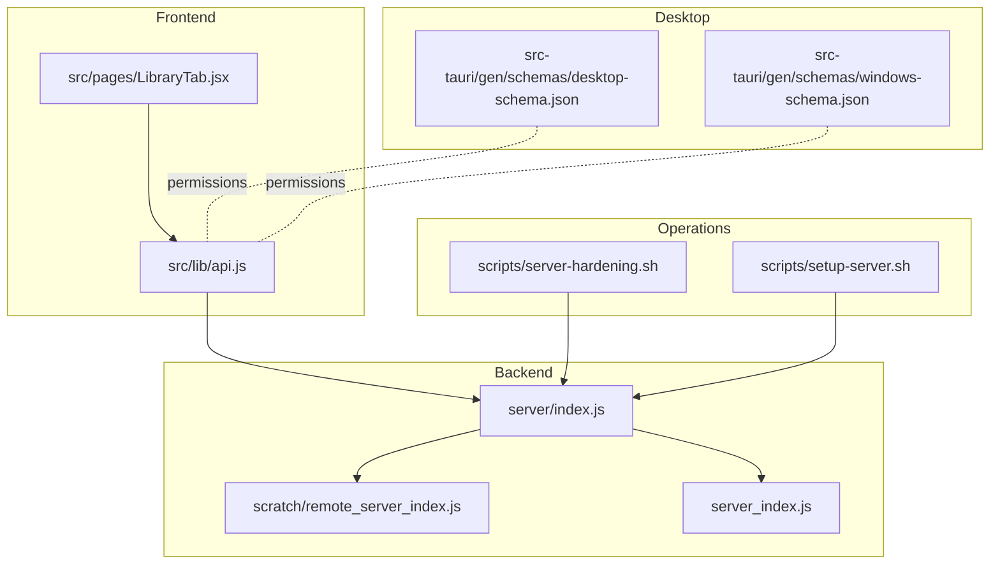
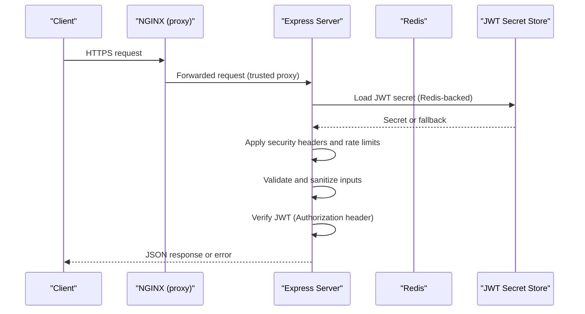
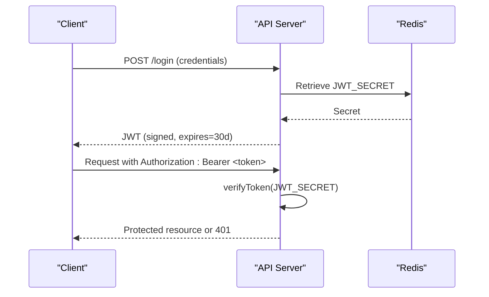
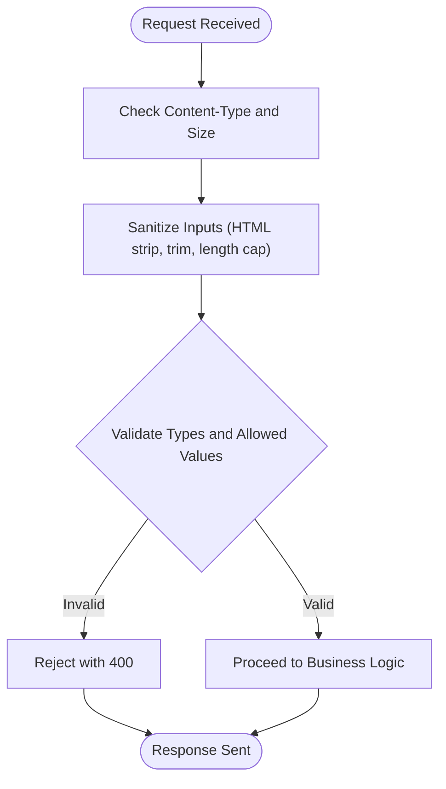
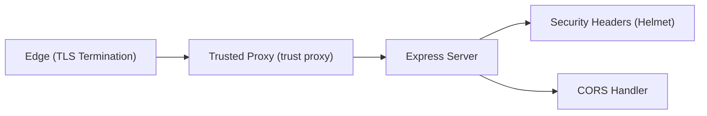
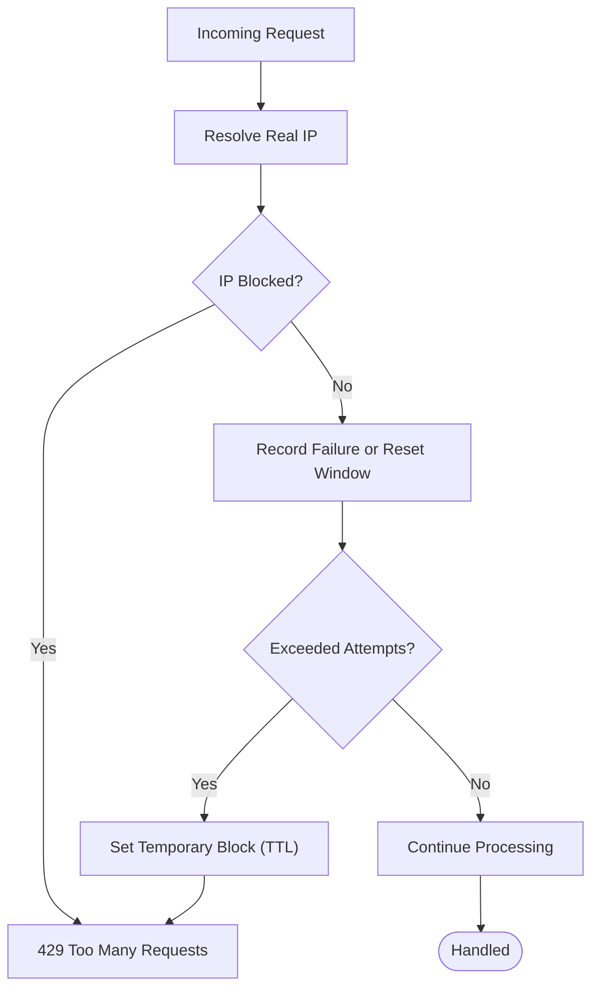
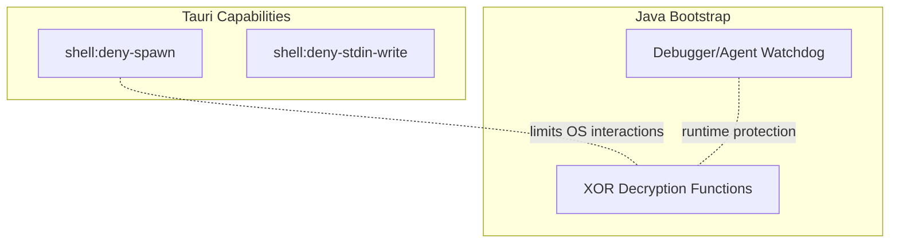
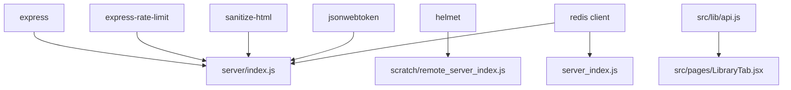

# Data Security & Compliance

<cite>
**Referenced Files in This Document**
- [server/index.js](file://server/index.js)
- [server_index.js](file://server_index.js)
- [remote_server_index.js](file://scratch/remote_server_index.js)
- [generate_bootstrap.js](file://scratch/generate_bootstrap.js)
- [src/lib/api.js](file://src/lib/api.js)
- [src/pages/LibraryTab.jsx](file://src/pages/LibraryTab.jsx)
- [src-tauri/gen/schemas/desktop-schema.json](file://src-tauri/gen/schemas/desktop-schema.json)
- [src-tauri/gen/schemas/windows-schema.json](file://src-tauri/gen/schemas/windows-schema.json)
- [scripts/server-hardening.sh](file://scripts/server-hardening.sh)
- [scripts/setup-server.sh](file://scripts/setup-server.sh)
- [website/src/pages/LoginPage.jsx](file://website/src/pages/LoginPage.jsx)
- [website/src/pages/AdminPage.jsx](file://website/src/pages/AdminPage.jsx)
- [website/src/pages/CabinetPage.jsx](file://website/src/pages/CabinetPage.jsx)
- [site/robots.txt](file://site/robots.txt)
- [site/sitemap.xml](file://site/sitemap.xml)
- [website/public/robots.txt](file://website/public/robots.txt)
- [website/public/sitemap.xml](file://website/public/sitemap.xml)
</cite>

## Table of Contents
1. [Introduction](#introduction)
2. [Project Structure](#project-structure)
3. [Core Components](#core-components)
4. [Architecture Overview](#architecture-overview)
5. [Detailed Component Analysis](#detailed-component-analysis)
6. [Dependency Analysis](#dependency-analysis)
7. [Performance Considerations](#performance-considerations)
8. [Troubleshooting Guide](#troubleshooting-guide)
9. [Conclusion](#conclusion)
10. [Appendices](#appendices)

## Introduction
This document provides comprehensive data security and compliance guidance for the SBGames project. It covers encryption for data at rest and in transit, authentication and token security, input validation and sanitization, audit logging, GDPR alignment, data retention and consent, security headers and CORS, rate limiting, backup and deletion practices, anonymization, vulnerability assessment, incident response, secure API design, and international compliance considerations. The content is grounded in the actual implementation details present in the repository.

## Project Structure
Security-relevant components span the backend server, client-side API utilities, Tauri desktop capability schemas, and operational scripts. The backend enforces rate limits, input sanitization, security headers, and JWT-based authentication. The frontend communicates via HTTPS with bearer tokens and sanitized inputs. Desktop capabilities are constrained via schema-defined permissions.

**Diagram sources**
- [server/index.js](file://server/index.js)
- [server_index.js](file://server_index.js)
- [remote_server_index.js](file://scratch/remote_server_index.js)
- [src/lib/api.js](file://src/lib/api.js)
- [src/pages/LibraryTab.jsx](file://src/pages/LibraryTab.jsx)
- [src-tauri/gen/schemas/desktop-schema.json](file://src-tauri/gen/schemas/desktop-schema.json)
- [src-tauri/gen/schemas/windows-schema.json](file://src-tauri/gen/schemas/windows-schema.json)
- [scripts/server-hardening.sh](file://scripts/server-hardening.sh)
- [scripts/setup-server.sh](file://scripts/setup-server.sh)

**Section sources**
- [server/index.js](file://server/index.js)
- [server_index.js](file://server_index.js)
- [remote_server_index.js](file://scratch/remote_server_index.js)
- [src/lib/api.js](file://src/lib/api.js)
- [src/pages/LibraryTab.jsx](file://src/pages/LibraryTab.jsx)
- [src-tauri/gen/schemas/desktop-schema.json](file://src-tauri/gen/schemas/desktop-schema.json)
- [src-tauri/gen/schemas/windows-schema.json](file://src-tauri/gen/schemas/windows-schema.json)
- [scripts/server-hardening.sh](file://scripts/server-hardening.sh)
- [scripts/setup-server.sh](file://scripts/setup-server.sh)

## Core Components
- Authentication and Authorization
  - JWT-based session tokens with expiration and verification helpers.
  - Token propagation via Authorization header in client requests.
  - Middleware enforcing authentication for protected routes.
- Encryption and Secrets Management
  - Persistent JWT secret storage with Redis-backed persistence and fallback.
  - TLS termination handled externally with SSL key and certificate paths configured.
- Input Validation and Sanitization
  - HTML sanitization for user-supplied strings with tag and attribute stripping.
  - Body size limits for JSON payloads to mitigate abuse.
- Security Headers and CORS
  - Helmet-based CSP, COOP, COEP, HSTS, and referrer controls.
  - CORS configuration allowing credentials and restricting origins.
- Rate Limiting and Access Control
  - Express-rate-limit enforcement per API endpoints.
  - IP-based failure tracking and temporary blocking with TTL.
- Audit Logging and Monitoring
  - Console warnings for blocked IPs and JWT secret loading outcomes.
- Desktop Permissions
  - Tauri capability schemas define explicit shell and process permissions.

**Section sources**
- [server/index.js](file://server/index.js)
- [server_index.js](file://server_index.js)
- [remote_server_index.js](file://scratch/remote_server_index.js)
- [src/lib/api.js](file://src/lib/api.js)
- [src-tauri/gen/schemas/desktop-schema.json](file://src-tauri/gen/schemas/desktop-schema.json)
- [src-tauri/gen/schemas/windows-schema.json](file://src-tauri/gen/schemas/windows-schema.json)

## Architecture Overview
The system enforces transport encryption via external TLS termination and applies robust runtime protections at the application layer. Requests traverse NGINX (trusted proxy), backend middleware, and route handlers. Tokens are validated centrally, inputs are sanitized, and strict security headers are applied.

**Diagram sources**
- [remote_server_index.js](file://scratch/remote_server_index.js)
- [server/index.js](file://server/index.js)
- [server_index.js](file://server_index.js)

## Detailed Component Analysis

### Authentication and Token Security
- Token lifecycle
  - Signing: JWT signed with a persistent secret and 30-day expiry.
  - Verification: Centralized verification routine with error handling.
  - Propagation: Client adds Authorization: Bearer <token> to authenticated requests.
- Secret management
  - Redis-backed persistence for JWT secret with graceful degradation to ephemeral secret when Redis is unavailable.
- Session security
  - Short-lived tokens via expiry; clients should refresh as needed.
  - No server-side session storage implies stateless authentication.

**Diagram sources**
- [server/index.js](file://server/index.js)
- [server_index.js](file://server_index.js)
- [remote_server_index.js](file://scratch/remote_server_index.js)

**Section sources**
- [server/index.js](file://server/index.js)
- [server_index.js](file://server_index.js)
- [remote_server_index.js](file://scratch/remote_server_index.js)
- [src/lib/api.js](file://src/lib/api.js)

### Input Validation, Sanitization, and Injection Prevention
- Sanitization pipeline
  - HTML sanitization strips tags and attributes, returning trimmed strings up to configured lengths.
  - Route-specific sanitization ensures IDs and types conform to allowed sets.
- Body limits
  - JSON payload size limits reduce risk of abuse and memory pressure.
- Injection mitigation
  - Stripping HTML tags and attributes reduces XSS risk.
  - Controlled input length prevents overflow and excessive processing.

**Diagram sources**
- [server/index.js](file://server/index.js)

**Section sources**
- [server/index.js](file://server/index.js)

### Security Headers, CORS, and Transport Encryption
- Transport encryption
  - TLS key and certificate paths indicate external termination; ensure HTTPS is enforced at the edge.
- Security headers
  - CSP restricts sources; COOP/COEP enabled; HSTS with preload; referrer policy set to no-referrer; no-sniff and DNS prefetch disabled.
- CORS
  - Credentials allowed; origin restrictions enforced via CORS handler.

**Diagram sources**
- [remote_server_index.js](file://scratch/remote_server_index.js)
- [server/index.js](file://server/index.js)

**Section sources**
- [remote_server_index.js](file://scratch/remote_server_index.js)
- [server/index.js](file://server/index.js)

### Rate Limiting and Access Control
- API rate limiting
  - Per-minute limits applied to /api endpoints.
- IP tracking and blocking
  - Failure counts tracked per IP within a rolling window; after threshold, IP is blocked for a fixed TTL with console logging.

**Diagram sources**
- [server_index.js](file://server_index.js)
- [remote_server_index.js](file://scratch/remote_server_index.js)

**Section sources**
- [server_index.js](file://server_index.js)
- [remote_server_index.js](file://scratch/remote_server_index.js)

### Audit Logging and Monitoring
- Logged events
  - JWT secret persistence outcome (loaded vs ephemeral).
  - IP blocking actions with reason and timing.
- Recommendations
  - Extend structured logging with standardized event schemas for security incidents.
  - Add correlation IDs to trace requests across services.

**Section sources**
- [server_index.js](file://server_index.js)
- [remote_server_index.js](file://scratch/remote_server_index.js)

### Desktop Permissions and Secure Bootstrapping
- Capability constraints
  - Tauri schemas enumerate denied commands (e.g., spawning processes), reducing attack surface.
- Secure bootstrapping
  - Java bootstrap generation includes XOR-based decryption routines and watchdog detection for debuggers/agents.

**Diagram sources**
- [src-tauri/gen/schemas/desktop-schema.json](file://src-tauri/gen/schemas/desktop-schema.json)
- [src-tauri/gen/schemas/windows-schema.json](file://src-tauri/gen/schemas/windows-schema.json)
- [generate_bootstrap.js](file://scratch/generate_bootstrap.js)

**Section sources**
- [src-tauri/gen/schemas/desktop-schema.json](file://src-tauri/gen/schemas/desktop-schema.json)
- [src-tauri/gen/schemas/windows-schema.json](file://src-tauri/gen/schemas/windows-schema.json)
- [generate_bootstrap.js](file://scratch/generate_bootstrap.js)

### Backup Encryption, Secure Deletion, and Data Anonymization
- Backup encryption
  - Not implemented in the analyzed code; recommend encrypting backups at rest and in transit.
- Secure deletion
  - No secure wipe routines observed; implement cryptographic erasure and overwrite strategies for sensitive data.
- Data anonymization
  - No automated anonymization observed; implement deterministic anonymization for analytics datasets.

[No sources needed since this section provides general guidance]

### Vulnerability Assessment, Penetration Testing, and Incident Response
- Assessment
  - Perform regular SAST/DAST scans and dependency audits.
- Penetration testing
  - Authorized red team exercises against staging and production with proper baselines.
- Incident response
  - Define escalation paths, containment, remediation, and communication procedures; maintain playbooks aligned with security headers and rate limiting behaviors.

[No sources needed since this section provides general guidance]

### Secure API Design and Token Management
- API design
  - Stateless JWT with short expirations; enforce HTTPS and strict headers; apply rate limits; sanitize inputs; validate types.
- Token management
  - Rotate secrets periodically; monitor for secret exposure; avoid storing secrets in client code.

**Section sources**
- [server/index.js](file://server/index.js)
- [server_index.js](file://server_index.js)
- [remote_server_index.js](file://scratch/remote_server_index.js)

### GDPR Alignment and Consent Management
- Data minimization
  - Sanitize inputs and avoid retaining unnecessary personal data.
- Retention policies
  - Define and enforce data retention periods; implement automated deletion.
- Consent management
  - Capture and manage user consent for cookies and data processing; provide withdrawal mechanisms.
- Transparency
  - Maintain privacy notices and logs of consent actions.

[No sources needed since this section provides general guidance]

### International Compliance Considerations
- Standards alignment
  - Align with ISO/IEC 27001, NIST CSF, and sector-specific controls.
- Cross-border transfers
  - Document and justify lawful bases for data transfers; implement SCCs or rely on adequacy decisions.

[No sources needed since this section provides general guidance]

## Dependency Analysis
The backend depends on Express, Helmet, rate-limit, sanitize-html, and JWT libraries. Redis is used for JWT secret persistence and account caching. The frontend depends on the API utility for authenticated requests.

**Diagram sources**
- [server/index.js](file://server/index.js)
- [server_index.js](file://server_index.js)
- [remote_server_index.js](file://scratch/remote_server_index.js)
- [src/lib/api.js](file://src/lib/api.js)
- [src/pages/LibraryTab.jsx](file://src/pages/LibraryTab.jsx)

**Section sources**
- [server/index.js](file://server/index.js)
- [server_index.js](file://server_index.js)
- [remote_server_index.js](file://scratch/remote_server_index.js)
- [src/lib/api.js](file://src/lib/api.js)
- [src/pages/LibraryTab.jsx](file://src/pages/LibraryTab.jsx)

## Performance Considerations
- Rate limiting reduces load during abuse; tune thresholds based on traffic profiles.
- Sanitization overhead is minimal but should be monitored under high throughput.
- Redis connectivity errors fall back gracefully; ensure monitoring for fallback conditions.

[No sources needed since this section provides general guidance]

## Troubleshooting Guide
- Authentication failures
  - Verify JWT secret availability and that clients send Authorization: Bearer <token>.
- Rate limiting
  - Confirm IP resolution and that rate limiter is applied to /api routes.
- Input errors
  - Ensure payloads adhere to size limits and sanitized types.
- Desktop permission denials
  - Review Tauri capability schemas and adjust as needed for legitimate use cases.

**Section sources**
- [server/index.js](file://server/index.js)
- [server_index.js](file://server_index.js)
- [remote_server_index.js](file://scratch/remote_server_index.js)
- [src/lib/api.js](file://src/lib/api.js)
- [src-tauri/gen/schemas/desktop-schema.json](file://src-tauri/gen/schemas/desktop-schema.json)
- [src-tauri/gen/schemas/windows-schema.json](file://src-tauri/gen/schemas/windows-schema.json)

## Conclusion
The SBGames project implements strong transport encryption, robust authentication with JWT, input sanitization, strict security headers, CORS controls, and rate limiting. Operational scripts support hardening and setup. To achieve comprehensive compliance, extend logging, implement backup encryption, secure deletion, anonymization, formalized vulnerability assessments, and GDPR-aligned consent and retention policies.

[No sources needed since this section summarizes without analyzing specific files]

## Appendices
- Compliance artifacts
  - Maintain privacy policy, cookie policy, and data retention schedules.
  - Track consent records and deletions with audit trails.
- Operational runbooks
  - Document incident response, secret rotation, and disaster recovery procedures.

[No sources needed since this section provides general guidance]