# Database Schema & Relationships

<cite>
**Referenced Files in This Document**
- [server/index.js](file://server/index.js)
- [server/package.json](file://server/package.json)
- [server_index.js](file://server_index.js)
- [src-tauri/tauri.conf.json](file://src-tauri/tauri.conf.json)
</cite>

## Table of Contents
1. [Introduction](#introduction)
2. [Project Structure](#project-structure)
3. [Core Components](#core-components)
4. [Architecture Overview](#architecture-overview)
5. [Detailed Component Analysis](#detailed-component-analysis)
6. [Dependency Analysis](#dependency-analysis)
7. [Performance Considerations](#performance-considerations)
8. [Troubleshooting Guide](#troubleshooting-guide)
9. [Conclusion](#conclusion)
10. [Appendices](#appendices)

## Introduction
This document describes the database schema and relationships for the SBGames platform. Based on the repository’s server implementation, the backend uses in-memory data structures backed by Redis for persistence. The schema covers user accounts, authentication tokens, game libraries, social relationships, marketplace transactions, and activity logs. It documents primary keys, logical relationships, indexes, constraints, data types, validation rules, and business logic. Migration and versioning guidance is included for evolving the schema.

## Project Structure
The SBGames backend is implemented as a Node.js service with Express and Redis. The server exposes REST endpoints and WebSocket channels for real-time features. Data is stored in memory maps and Redis with a Redis-backed account store. There is no traditional relational database in the current codebase; the schema below reflects the logical data model inferred from the server logic.

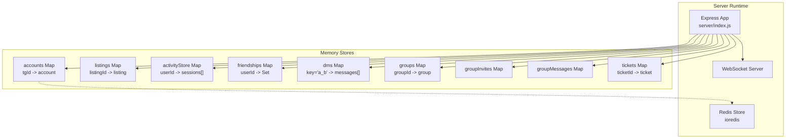

**Diagram sources**
- [server/index.js](file://server/index.js)
- [server/package.json](file://server/package.json)

**Section sources**
- [server/index.js](file://server/index.js)
- [server/package.json](file://server/package.json)

## Core Components
The logical schema is composed of the following entities and relationships:

- Accounts
  - Primary key: id (string, Telegram user identifier)
  - Fields: username, telegram, firstName, balance (integer), role, createdAt, bio, equip (object), inventory (array), market_inventory (array), telegramId (optional), linkCode (optional)
  - Constraints: username length 3–16, alphanumeric and underscore; balance non-negative; role in ["user","admin"]

- Authentication Tokens
  - Stored as JWTs signed with a server secret; validated via HMAC-SHA256
  - Token payload contains subject (user id) and expiration

- Game Libraries
  - shop_catalog: predefined items for purchase (id, type, name, price, preview)
  - market_catalog: items for marketplace trading (id, type, name, preview)
  - Ownership tracked per user via inventory arrays

- Social Relationships
  - Friendships: bidirectional mapping via friendships Map<userId, Set<friendId>>
  - Friend Requests: pending requests per user via friendRequests Map<toUserId, Request[]>
  - Direct Messages: DM threads per pair via dms Map<"min(a,b)_max(a,b)", Message[]>

- Groups
  - groups: Map<groupId, Group{ownerId,members[],createdAt}>
  - groupInvites: Map<groupId, Invite[]>
  - groupMessages: Map<groupId, Message[]>

- Marketplace Transactions
  - listings: Map<listingId, Listing{itemId,itemType,name,preview,price,sellerId,sellerName,createdAt,status}>
  - Status lifecycle: active → sold or cancelled

- Activity Logs
  - activityStore: Map<userId, Session{serverId,startedAt,endedAt,durationSec}>

- Tickets (Support)
  - tickets: Map<ticketId, Ticket{userId,username,category,preview,status,unread,createdAt,messages[]}>

- Online Presence
  - wsClients: Map<clientId, {userId,username,role}> for broadcasting online users

**Section sources**
- [server/index.js](file://server/index.js)

## Architecture Overview
The backend architecture couples REST APIs with WebSocket channels. Redis is used as a persistent cache for accounts, with in-memory maps for ephemeral state. Real-time features (friends, DMs, groups, tickets) rely on WebSocket events and memory-backed collections.

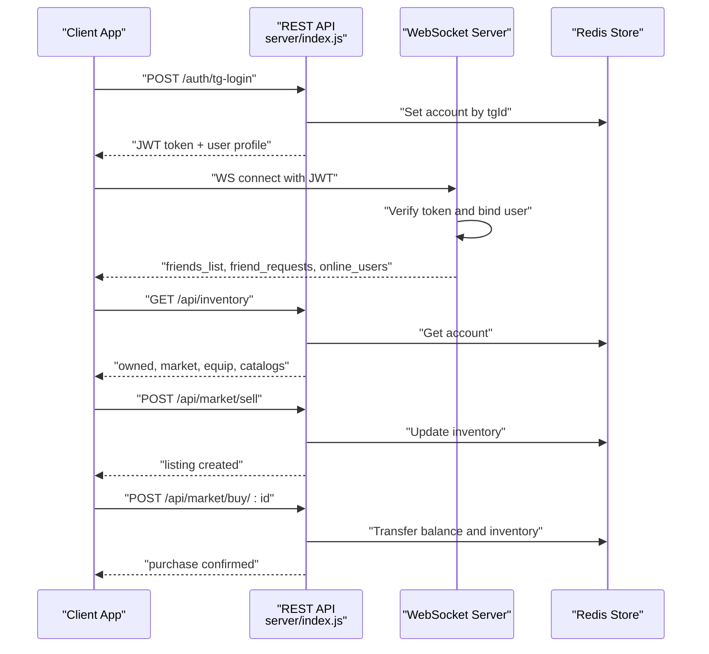

**Diagram sources**
- [server/index.js](file://server/index.js)
- [server/package.json](file://server/package.json)

## Detailed Component Analysis

### Accounts Entity
Logical schema:
- id (PK, string): Telegram user id
- username (string, 3–16 chars, alphanumeric + underscore)
- telegram (string, optional)
- firstName (string, up to 64)
- balance (integer ≥ 0)
- role (enum: "user","admin")
- createdAt (timestamp)
- bio (string, up to 300)
- equip (JSON object keyed by type)
- inventory (array of item ids)
- market_inventory (array of market item ids)
- telegramId (string, optional)
- linkCode (string, optional)

Constraints and validations:
- Username sanitized and validated before creation/update
- Role derived from admin whitelist
- Balance initialized to 100 for new users

Indexes and keys:
- Primary key: id
- Redis key pattern: acc:{tgId}

Normalization:
- Normalized: separate shop and market catalogs; ownership stored per user

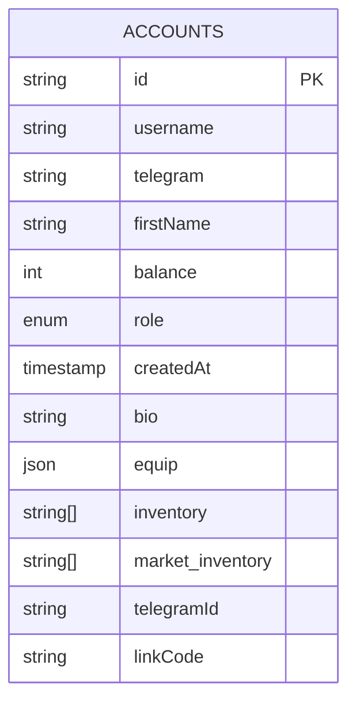

**Diagram sources**
- [server/index.js](file://server/index.js)

**Section sources**
- [server/index.js](file://server/index.js)

### Authentication Tokens
- JWT signing and verification using HMAC-SHA256
- Expiration: 30 days
- Middleware: optionalAuth and requireAuth enforce token presence for protected routes

Validation rules:
- Token signature verified against server secret
- Authorization header format: Bearer <token>

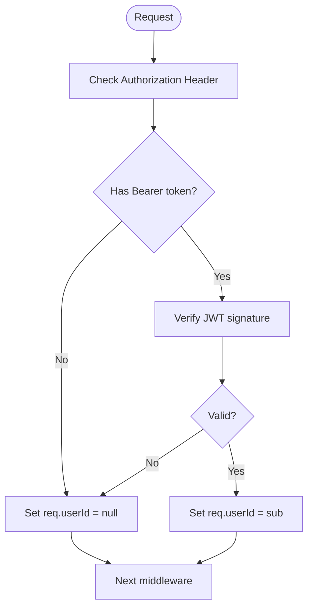

**Diagram sources**
- [server/index.js](file://server/index.js)

**Section sources**
- [server/index.js](file://server/index.js)

### Game Libraries
- shop_catalog: items for direct purchase (frame, background, avatar_animated, badge)
- market_catalog: tradable items (chest, relic, material, skin, token, disc, pearl, shard)
- Ownership: tracked per user in inventory arrays

Constraints:
- Purchase validation checks item existence, ownership, and sufficient balance
- Equipment assignment validates item type and ownership

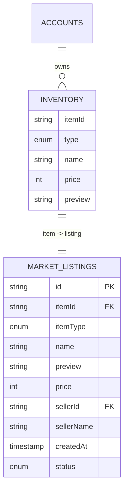

**Diagram sources**
- [server/index.js](file://server/index.js)

**Section sources**
- [server/index.js](file://server/index.js)

### Social Relationships
- Friendships: bidirectional mapping via friendships Map
- Friend Requests: pending per user via friendRequests Map
- Direct Messages: per-pair threads via dms Map with composite key min_max

Constraints:
- Cannot add self as friend
- Duplicate friend requests prevented
- Accept/decline clears pending requests

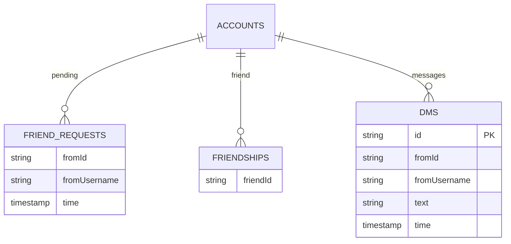

**Diagram sources**
- [server/index.js](file://server/index.js)

**Section sources**
- [server/index.js](file://server/index.js)

### Groups
- groups: owner-managed teams with up to 8 members
- groupInvites: pending invitations per group
- groupMessages: chat history per group

Constraints:
- Max members: 8
- Ownership transfer on owner leave
- Access control: only members can view messages

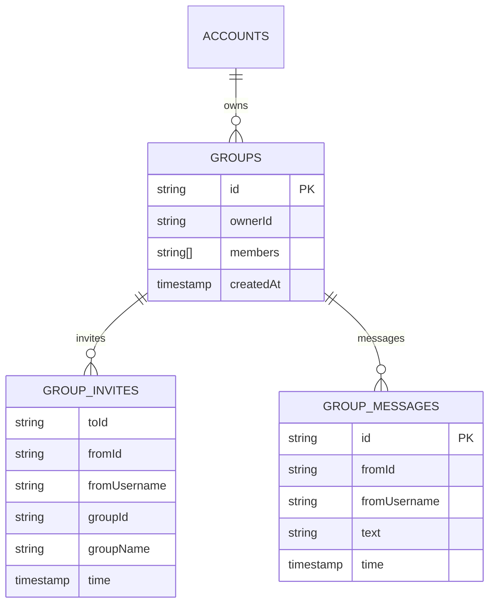

**Diagram sources**
- [server/index.js](file://server/index.js)

**Section sources**
- [server/index.js](file://server/index.js)

### Marketplace Transactions
- listings: active offers by sellers
- Buy flow: balance checks, transfer, fee calculation for long-lived listings

Constraints:
- Price range 10–100000
- One active listing per item per seller
- Age-based fee: 5% for listings older than 14 days

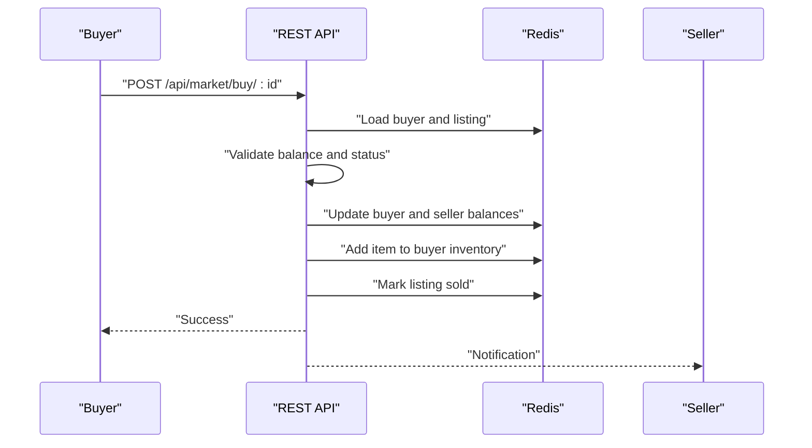

**Diagram sources**
- [server/index.js](file://server/index.js)

**Section sources**
- [server/index.js](file://server/index.js)

### Activity Logs
- activityStore aggregates per-user playtime sessions
- Aggregates: total seconds, per-server totals, last session

Constraints:
- Duration clamped to 24 hours
- Recent sessions capped at 200

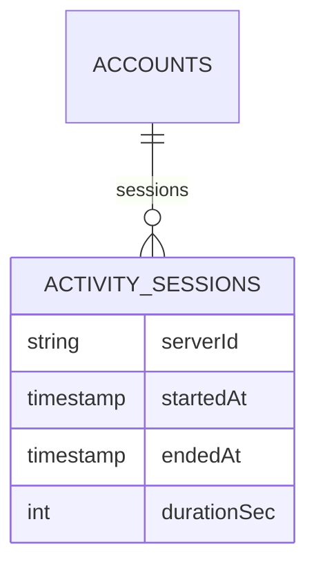

**Diagram sources**
- [server/index.js](file://server/index.js)

**Section sources**
- [server/index.js](file://server/index.js)

### Tickets (Support)
- tickets: support conversations with statuses and unread counters
- Admin workflow: open, in_progress, answered, closed

Constraints:
- Category and message validation
- Unread counter incremented for user messages

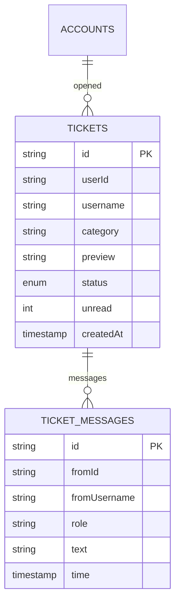

**Diagram sources**
- [server/index.js](file://server/index.js)

**Section sources**
- [server/index.js](file://server/index.js)

## Dependency Analysis
External dependencies influencing the schema:
- ioredis: Redis client for account persistence
- jsonwebtoken: JWT for authentication
- express-rate-limit: Rate limiting for API endpoints
- sanitize-html: Input sanitization for user-generated content

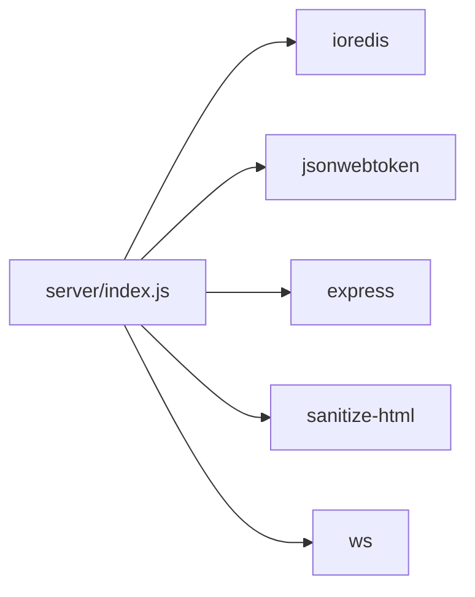

**Diagram sources**
- [server/package.json](file://server/package.json)

**Section sources**
- [server/package.json](file://server/package.json)

## Performance Considerations
- Memory-first design with Redis caching reduces latency for account reads/writes.
- In-memory maps enable fast joins and lookups for friends, DMs, groups, and listings.
- Indexing strategy:
  - Primary key: id (accounts), listingId (marketplace), userId (activity)
  - Composite keys: friendship sets, DM thread keys, group identifiers
- Recommendations:
  - Add Redis TTLs for ephemeral data (e.g., auth codes, invites)
  - Persist critical state (e.g., tickets, listings) to disk or external DB for durability
  - Use Redis streams or sorted sets for activity aggregation and timeline queries
  - Apply pagination for large lists (comments, messages, tickets)

[No sources needed since this section provides general guidance]

## Troubleshooting Guide
Common issues and resolutions:
- Authentication failures: verify JWT secret consistency and token expiration
- Redis unavailable: server falls back to in-memory maps; monitor availability
- Rate limits: adjust express-rate-limit configuration for production
- Validation errors: ensure client sanitizes inputs and respects field constraints

Operational endpoints:
- Health check: GET /health
- Admin ticket management: GET /admin/tickets, POST /admin/ticket/:id/status
- Balance adjustments: POST /admin/set-balance

**Section sources**
- [server/index.js](file://server/index.js)
- [server_index.js](file://server_index.js)

## Conclusion
The SBGames backend implements a normalized, schema-less logical model using Redis and in-memory structures. The schema supports user accounts, authentication, inventories, marketplace trades, social features, groups, activity logging, and support tickets. For production, consider migrating to a relational database with explicit constraints, adding migrations, and implementing robust backup/recovery. Indexing and caching strategies should evolve with traffic patterns.

[No sources needed since this section summarizes without analyzing specific files]

## Appendices

### Migration and Version Control Guidance
- Use a lightweight migration tool to track schema changes (e.g., JSON-based migrations stored in Redis or filesystem)
- Version control for migration scripts and apply incrementally during deployments
- Backward compatibility: maintain old field names and defaults for gradual rollout
- Rollback strategy: snapshot Redis keyspace before applying migrations

[No sources needed since this section provides general guidance]