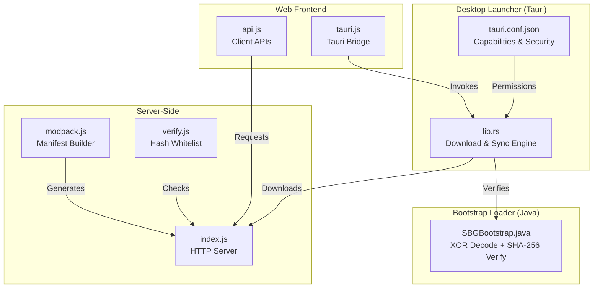
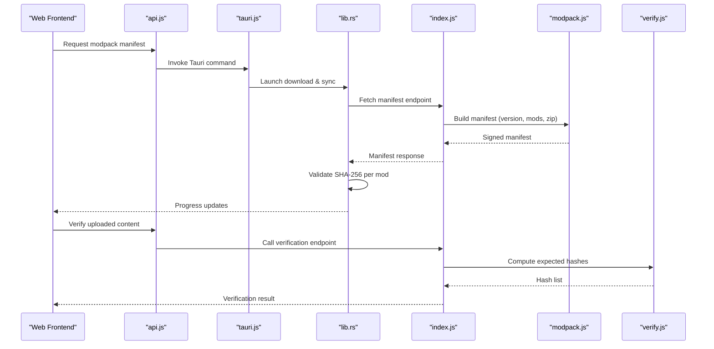
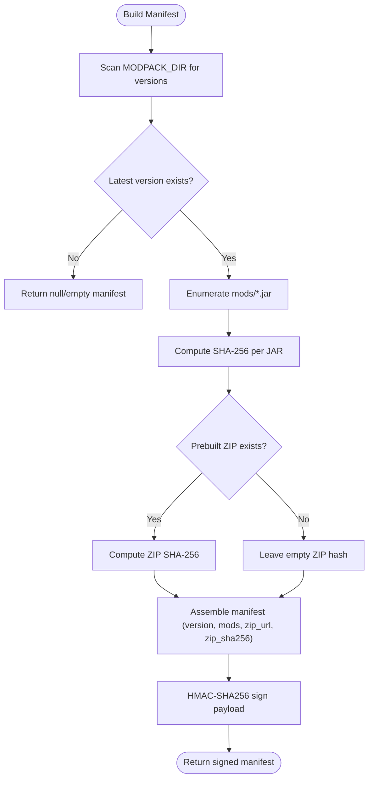
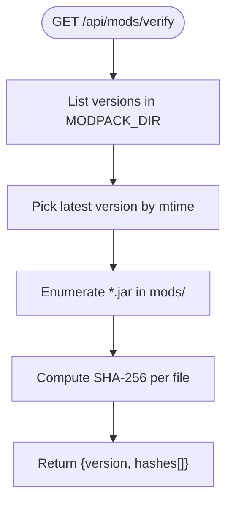
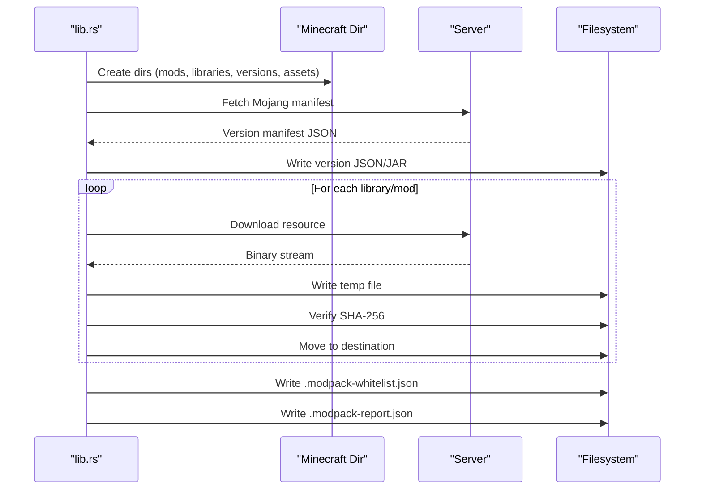
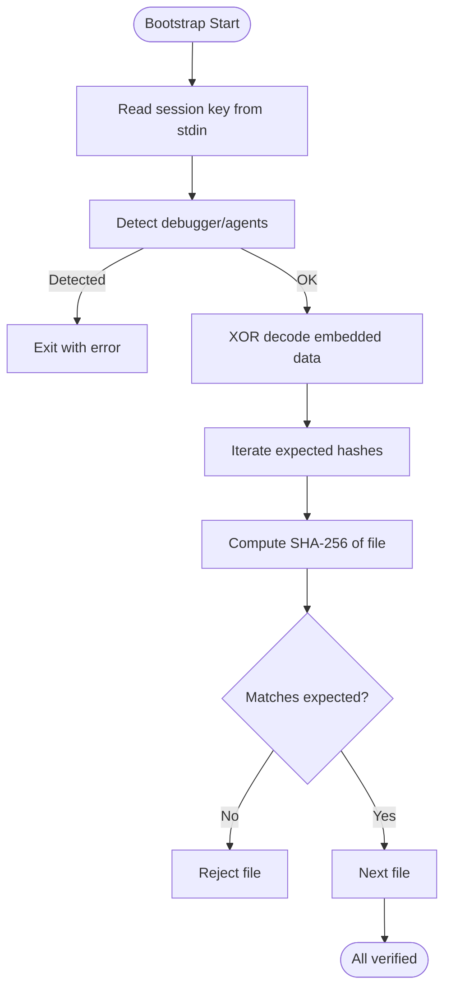
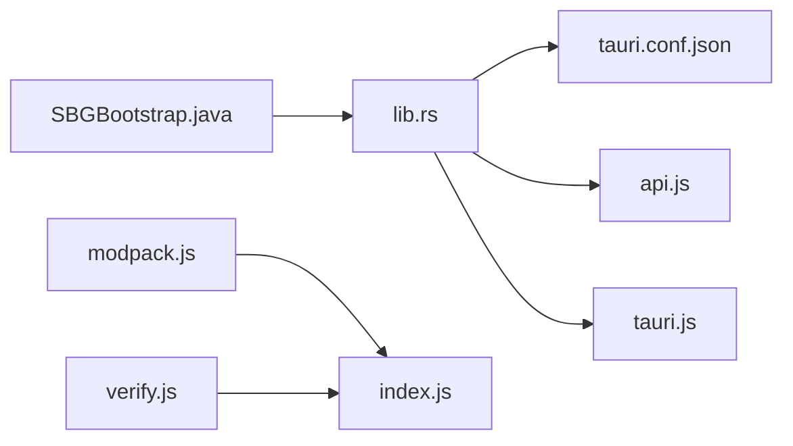
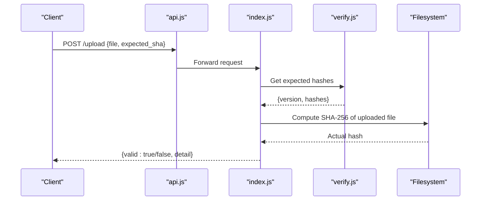

# File Storage & Management

<cite>
**Referenced Files in This Document**
- [SBGBootstrap.java](file://src-java/com/sbgames/bootstrap/SBGBootstrap.java)
- [modpack.js](file://server-files/modpack.js)
- [verify.js](file://server-files/verify.js)
- [lib.rs](file://src-tauri/src/lib.rs)
- [tauri.conf.json](file://src-tauri/tauri.conf.json)
- [package.json](file://package.json)
- [index.js](file://server/index.js)
- [api.js](file://src/lib/api.js)
- [tauri.js](file://src/lib/tauri.js)
</cite>

## Table of Contents
1. [Introduction](#introduction)
2. [Project Structure](#project-structure)
3. [Core Components](#core-components)
4. [Architecture Overview](#architecture-overview)
5. [Detailed Component Analysis](#detailed-component-analysis)
6. [Dependency Analysis](#dependency-analysis)
7. [Performance Considerations](#performance-considerations)
8. [Security Measures](#security-measures)
9. [Caching and Offline Capabilities](#caching-and-offline-capabilities)
10. [Compression, Encryption, and Backup](#compression-encryption-and-backup)
11. [File Operation APIs and Error Handling](#file-operation-apis-and-error-handling)
12. [Troubleshooting Guide](#troubleshooting-guide)
13. [Conclusion](#conclusion)

## Introduction
This document describes the file storage and management system for game assets, modpack distribution, user-generated content, and security verification. It covers the organization of Minecraft resources, texture packs, custom maps, and user uploads; the Java bootstrap loader’s role in integrity verification and XOR encoding; the modpack management pipeline for curated distributions; upload/download mechanisms, size/format constraints; security controls against malicious uploads; caching strategies for frequently accessed assets; offline storage; compression and encryption; and backup procedures. It also documents file operation APIs and error handling patterns.

## Project Structure
The file storage system spans multiple layers:
- Tauri-based desktop launcher (Rust) orchestrating downloads, integrity checks, and modpack synchronization.
- Java bootstrap loader validating environment and verifying file integrity via SHA-256.
- Node.js server-side scripts generating modpack manifests and managing verification endpoints.
- Web frontend APIs for user interactions and content delivery.
- Configuration and packaging files defining capabilities and build targets.

**Diagram sources**
- [lib.rs:398-2085](file://src-tauri/src/lib.rs#L398-L2085)
- [SBGBootstrap.java:192-371](file://src-java/com/sbgames/bootstrap/SBGBootstrap.java#L192-L371)
- [modpack.js:25-83](file://server-files/modpack.js#L25-L83)
- [verify.js:35-57](file://server-files/verify.js#L35-L57)
- [index.js](file://server/index.js)
- [api.js](file://src/lib/api.js)
- [tauri.js](file://src/lib/tauri.js)
- [tauri.conf.json](file://src-tauri/tauri.conf.json)

**Section sources**
- [lib.rs:398-2085](file://src-tauri/src/lib.rs#L398-L2085)
- [SBGBootstrap.java:192-371](file://src-java/com/sbgames/bootstrap/SBGBootstrap.java#L192-L371)
- [modpack.js:25-83](file://server-files/modpack.js#L25-L83)
- [verify.js:35-57](file://server-files/verify.js#L35-L57)
- [index.js](file://server/index.js)
- [api.js](file://src/lib/api.js)
- [tauri.js](file://src/lib/tauri.js)
- [tauri.conf.json](file://src-tauri/tauri.conf.json)

## Core Components
- Modpack Manifest Generator: Builds a manifest containing the latest version, mods list with SHA-256 hashes, and optional prebuilt ZIP metadata.
- Integrity Verification Endpoint: Serves a whitelist of expected hashes for the current modpack version.
- Desktop Launcher: Downloads vanilla assets, resolves Mojang manifests, fetches libraries, validates SHA-256, and synchronizes modpacks with a local whitelist.
- Bootstrap Loader: Reads a session key, performs environment checks, decodes embedded data using XOR, and verifies SHA-256 integrity.
- Web APIs: Provide endpoints for downloading assets and interacting with the launcher.

**Section sources**
- [modpack.js:25-83](file://server-files/modpack.js#L25-L83)
- [verify.js:35-57](file://server-files/verify.js#L35-L57)
- [lib.rs:398-2085](file://src-tauri/src/lib.rs#L398-L2085)
- [SBGBootstrap.java:192-371](file://src-java/com/sbgames/bootstrap/SBGBootstrap.java#L192-L371)
- [api.js](file://src/lib/api.js)

## Architecture Overview
The system integrates a Rust-based launcher with a Java bootstrap and Node.js server components. The launcher ensures secure downloads and integrity checks, while the server generates signed manifests and exposes verification endpoints. The web frontend communicates with both the launcher and server.

**Diagram sources**
- [lib.rs:398-2085](file://src-tauri/src/lib.rs#L398-L2085)
- [modpack.js:25-83](file://server-files/modpack.js#L25-L83)
- [verify.js:35-57](file://server-files/verify.js#L35-L57)
- [api.js](file://src/lib/api.js)
- [tauri.js](file://src/lib/tauri.js)
- [index.js](file://server/index.js)

## Detailed Component Analysis

### Modpack Management System
The modpack system builds a manifest for the latest version, enumerates mods, computes SHA-256, and optionally includes a prebuilt ZIP with its own hash. The manifest is signed using HMAC-SHA256 to support authenticity checks.

**Diagram sources**
- [modpack.js:25-83](file://server-files/modpack.js#L25-L83)

**Section sources**
- [modpack.js:25-83](file://server-files/modpack.js#L25-L83)

### Integrity Verification Endpoint
The verification endpoint serves the expected hashes for the current modpack version, enabling clients to validate uploaded or local content against a trusted whitelist.

**Diagram sources**
- [verify.js:35-57](file://server-files/verify.js#L35-L57)

**Section sources**
- [verify.js:35-57](file://server-files/verify.js#L35-L57)

### Desktop Launcher (Tauri) Integrity and Sync
The launcher prepares the Minecraft directory, resolves Mojang manifests, downloads assets and libraries, validates SHA-256, and writes a runtime whitelist and report. It enforces HTTPS for zip URLs and logs signature presence for future enforcement.

**Diagram sources**
- [lib.rs:398-2085](file://src-tauri/src/lib.rs#L398-L2085)

**Section sources**
- [lib.rs:398-2085](file://src-tauri/src/lib.rs#L398-L2085)

### Java Bootstrap Loader (XOR + SHA-256)
The bootstrap loader reads a session key from stdin, performs environment checks, decodes embedded data using XOR with a fixed key, and verifies SHA-256 of target files. It iterates over expected hashes and compares them to computed values.

**Diagram sources**
- [SBGBootstrap.java:192-371](file://src-java/com/sbgames/bootstrap/SBGBootstrap.java#L192-L371)

**Section sources**
- [SBGBootstrap.java:192-371](file://src-java/com/sbgames/bootstrap/SBGBootstrap.java#L192-L371)

### File Organization Structure
- Minecraft Resources:
  - versions/<version>/1.20.1.json and 1.20.1.jar
  - libraries/ for dependencies
  - assets/ for resource packs and textures
  - mods/ for modpack JARs
- Texture Packs and Custom Maps:
  - Stored under assets/ with version-specific subfolders
  - Managed alongside vanilla assets during sync
- User Uploads:
  - Verified against the expected hash list from the server
  - Uploaded content is validated before being placed into appropriate directories

**Section sources**
- [lib.rs:398-2085](file://src-tauri/src/lib.rs#L398-L2085)
- [verify.js:35-57](file://server-files/verify.js#L35-L57)

## Dependency Analysis
- Tauri launcher depends on:
  - Rust standard library for filesystem and process control
  - Tauri capabilities configured in tauri.conf.json
  - Web APIs exposed via tauri.js bridge
- Server-side scripts depend on:
  - Node.js fs, path, crypto, and http(s) modules
  - Environment variables for base URLs and secrets
- Bootstrap loader depends on:
  - Java runtime for SHA-256 and XOR operations

**Diagram sources**
- [lib.rs:398-2085](file://src-tauri/src/lib.rs#L398-L2085)
- [tauri.conf.json](file://src-tauri/tauri.conf.json)
- [api.js](file://src/lib/api.js)
- [tauri.js](file://src/lib/tauri.js)
- [modpack.js:25-83](file://server-files/modpack.js#L25-L83)
- [verify.js:35-57](file://server-files/verify.js#L35-L57)
- [index.js](file://server/index.js)
- [SBGBootstrap.java:192-371](file://src-java/com/sbgames/bootstrap/SBGBootstrap.java#L192-L371)

**Section sources**
- [lib.rs:398-2085](file://src-tauri/src/lib.rs#L398-L2085)
- [tauri.conf.json](file://src-tauri/tauri.conf.json)
- [modpack.js:25-83](file://server-files/modpack.js#L25-L83)
- [verify.js:35-57](file://server-files/verify.js#L35-L57)
- [index.js](file://server/index.js)
- [SBGBootstrap.java:192-371](file://src-java/com/sbgames/bootstrap/SBGBootstrap.java#L192-L371)

## Performance Considerations
- Streaming downloads: The launcher streams binary content to temporary files and validates SHA-256 incrementally to reduce memory overhead.
- Parallel retries: Multiple fallback URLs are attempted with exponential backoff for robustness.
- Incremental hashing: SHA-256 computation reads in chunks to handle large files efficiently.
- Caching: Assets are cached locally after successful verification to avoid redundant downloads.

[No sources needed since this section provides general guidance]

## Security Measures
- HTTPS Enforcement: The launcher rejects non-HTTPS zip URLs and logs signature presence for future enforcement.
- Integrity Checks: SHA-256 verification is performed for every downloaded asset and mod.
- Environment Checks: The bootstrap loader detects debuggers and agents and exits on detection.
- Session Key Validation: The bootstrap loader requires a minimum-length session key from stdin.
- Capability Restrictions: Tauri capabilities limit filesystem and network access to required scopes.

**Section sources**
- [lib.rs:1556-1572](file://src-tauri/src/lib.rs#L1556-L1572)
- [lib.rs:1734-1747](file://src-tauri/src/lib.rs#L1734-L1747)
- [SBGBootstrap.java:213-220](file://src-java/com/sbgames/bootstrap/SBGBootstrap.java#L213-L220)
- [SBGBootstrap.java:337-341](file://src-java/com/sbgames/bootstrap/SBGBootstrap.java#L337-L341)
- [tauri.conf.json](file://src-tauri/tauri.conf.json)

## Caching and Offline Capabilities
- Local Asset Cache: After successful download and verification, assets are stored in the Minecraft directory for offline reuse.
- Runtime Watcher: A whitelist file is written to enable runtime monitoring of modpack integrity.
- Report Persistence: A detailed report is saved to assist diagnostics and recovery.

**Section sources**
- [lib.rs:1759-1769](file://src-tauri/src/lib.rs#L1759-L1769)

## Compression, Encryption, and Backup
- Compression:
  - Prebuilt ZIPs may be included in the manifest for faster distribution; the launcher validates their SHA-256 before extraction.
- Encryption:
  - Embedded data in the bootstrap loader is XOR-encoded with a fixed key; decryption occurs prior to integrity checks.
- Backup Procedures:
  - The launcher writes a modpack report and whitelist to disk, enabling recovery and audit trails.

**Section sources**
- [modpack.js:56-83](file://server-files/modpack.js#L56-L83)
- [SBGBootstrap.java:192-204](file://src-java/com/sbgames/bootstrap/SBGBootstrap.java#L192-L204)
- [lib.rs:1761-1769](file://src-tauri/src/lib.rs#L1761-L1769)

## File Operation APIs and Error Handling
- Download and Sync:
  - The launcher emits progress events and handles HTTP errors, timeouts, and retry logic.
  - SHA-256 mismatches lead to rejection and removal of temporary files.
- Verification:
  - The server endpoint lists expected hashes for the latest version; errors are logged and returned gracefully.
- Upload Validation:
  - Clients compute SHA-256 of uploaded content and compare against the expected list from the verification endpoint.

**Diagram sources**
- [verify.js:35-57](file://server-files/verify.js#L35-L57)
- [lib.rs:1734-1747](file://src-tauri/src/lib.rs#L1734-L1747)

**Section sources**
- [lib.rs:1734-1747](file://src-tauri/src/lib.rs#L1734-L1747)
- [verify.js:35-57](file://server-files/verify.js#L35-L57)

## Troubleshooting Guide
- SHA-256 Mismatch:
  - The launcher removes temporary files and increments rejected counts; check the generated report for details.
- Non-HTTPS URL Rejection:
  - Ensure the manifest zip_url uses HTTPS; otherwise, the launcher will reject it.
- Missing Java:
  - The launcher requires Java 17; install and configure the path accordingly.
- Debugger Detection:
  - The bootstrap loader exits if debuggers or agents are detected; disable external debuggers and run in clean environments.
- Capability Denied:
  - Verify Tauri capabilities in tauri.conf.json permit required filesystem and network operations.

**Section sources**
- [lib.rs:1556-1572](file://src-tauri/src/lib.rs#L1556-L1572)
- [lib.rs:1734-1747](file://src-tauri/src/lib.rs#L1734-L1747)
- [SBGBootstrap.java:213-220](file://src-java/com/sbgames/bootstrap/SBGBootstrap.java#L213-L220)
- [tauri.conf.json](file://src-tauri/tauri.conf.json)

## Conclusion
The file storage and management system combines a Rust-based launcher, a Java bootstrap loader, and Node.js server components to deliver a secure, efficient, and verifiable distribution pipeline for Minecraft assets and modpacks. Integrity is ensured through SHA-256 checks, environment safeguards, and capability-limited operations. The design supports caching, offline usage, and robust error handling, while providing clear APIs for uploads and verification.