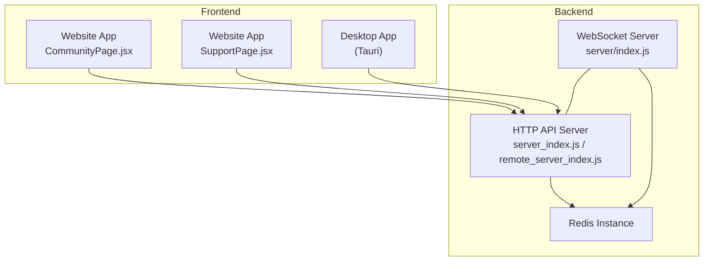
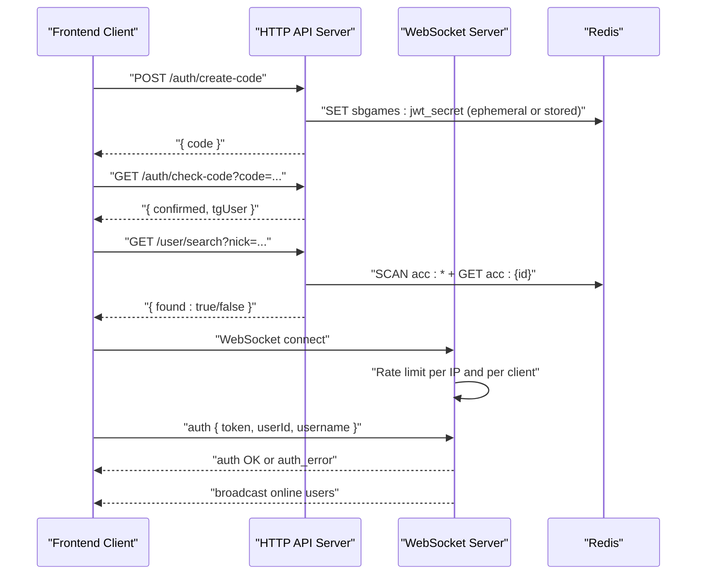
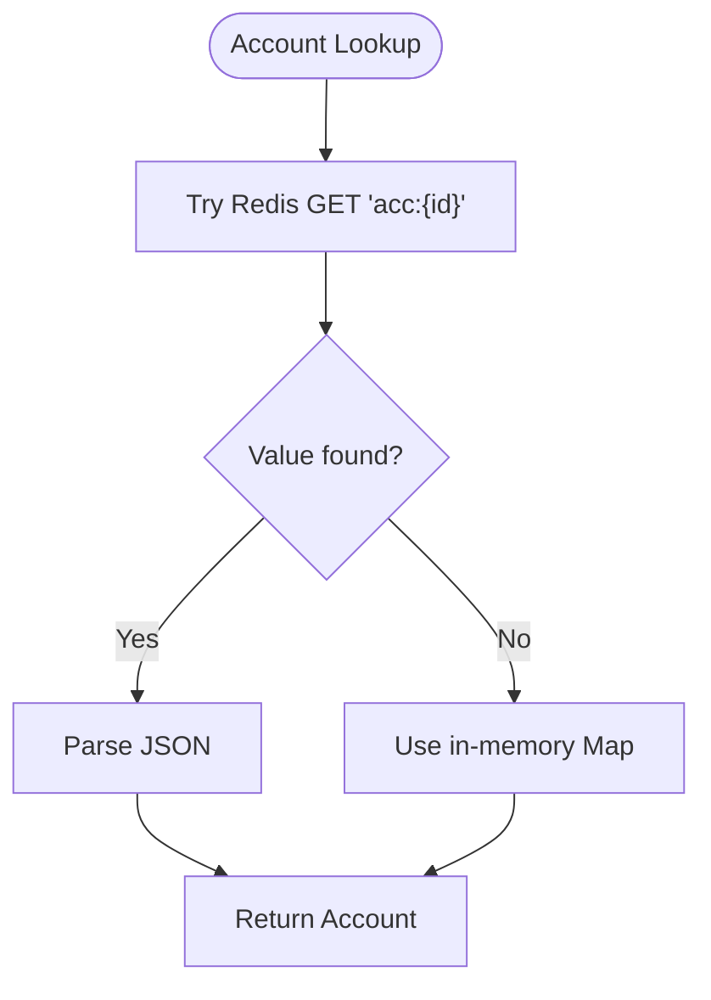
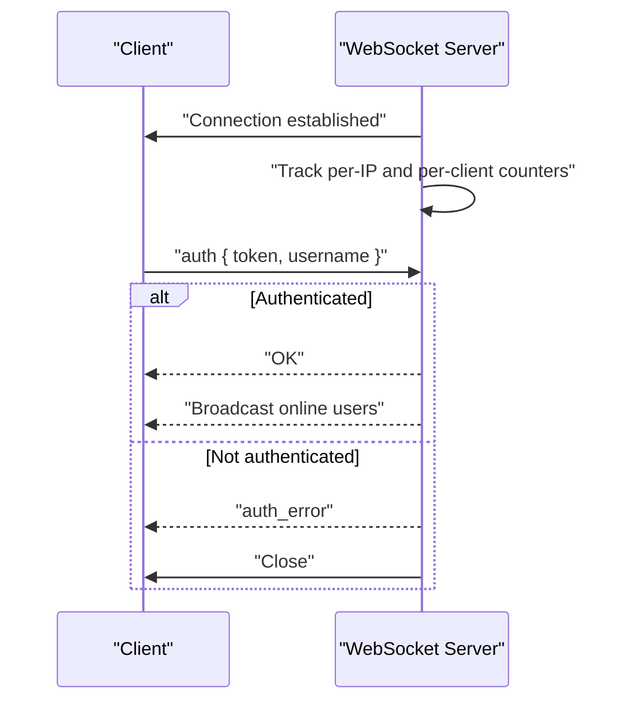
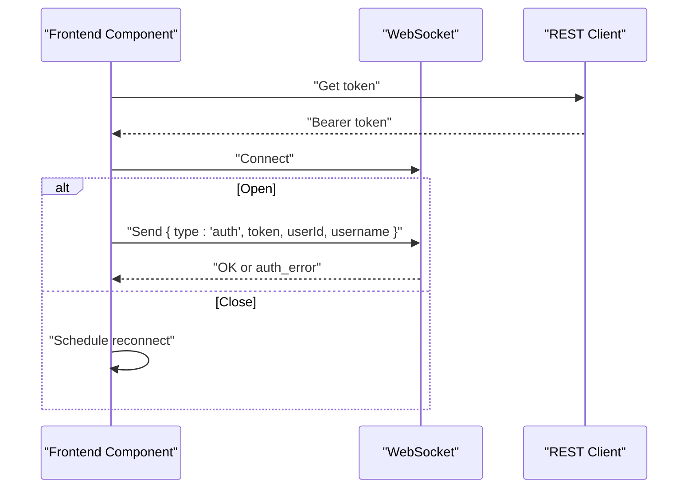
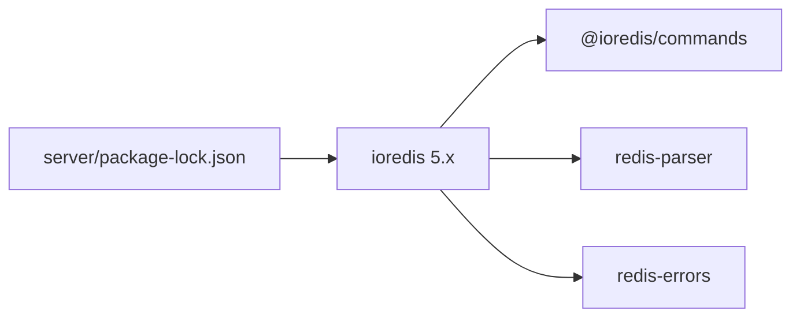

# Redis Caching & Data Synchronization

<cite>
**Referenced Files in This Document**
- [server_index.js](file://server_index.js)
- [remote_server_index.js](file://scratch/remote_server_index.js)
- [index.js](file://server/index.js)
- [api.js](file://src/lib/api.js)
- [CommunityPage.jsx](file://src/pages/CommunityPage.jsx)
- [SupportPage.jsx](file://src/pages/SupportPage.jsx)
- [package-lock.json](file://server/package-lock.json)
</cite>

## Table of Contents
1. [Introduction](#introduction)
2. [Project Structure](#project-structure)
3. [Core Components](#core-components)
4. [Architecture Overview](#architecture-overview)
5. [Detailed Component Analysis](#detailed-component-analysis)
6. [Dependency Analysis](#dependency-analysis)
7. [Performance Considerations](#performance-considerations)
8. [Troubleshooting Guide](#troubleshooting-guide)
9. [Conclusion](#conclusion)
10. [Appendices](#appendices)

## Introduction
This document explains the Redis-based caching strategy used for session management, real-time updates, and frequently accessed data across the desktop application, website platform, and backend services. It covers cache key structures, serialization formats, JWT token caching, user session persistence, WebSocket connection lifecycle, data synchronization patterns, invalidation strategies, consistency guarantees, and operational practices such as clustering, failover, backups, cache warming, and resilience against cache penetration and avalanche.

## Project Structure
The caching and synchronization logic spans three primary areas:
- Backend servers using Redis via ioredis
- Frontend clients (website and desktop) connecting via WebSocket and REST APIs
- Shared Redis-backed account storage abstraction with local fallback

**Diagram sources**
- [server_index.js:27-43](file://server_index.js#L27-L43)
- [remote_server_index.js:27-43](file://scratch/remote_server_index.js#L27-L43)
- [index.js:761-793](file://server/index.js#L761-L793)

**Section sources**
- [server_index.js:27-43](file://server_index.js#L27-L43)
- [remote_server_index.js:27-43](file://scratch/remote_server_index.js#L27-L43)
- [index.js:761-793](file://server/index.js#L761-L793)

## Core Components
- Redis client initialization and graceful degradation to in-memory storage when Redis is unavailable
- Account storage abstraction with Redis-backed keys and JSON serialization
- JWT secret persistence in Redis for cross-instance consistency
- WebSocket server managing client sessions and rate limits
- Frontend WebSocket clients with automatic reconnect and authentication handshake

Key implementation references:
- Redis initialization and fallback: [server_index.js:27-43], [remote_server_index.js:27-43]
- Account storage wrapper: [server_index.js:45-78], [remote_server_index.js:45-78]
- JWT secret caching: [server_index.js:32-42], [remote_server_index.js:32-42]
- WebSocket connection lifecycle: [index.js:761-793], [index.js:870-908]
- Frontend WebSocket clients: [CommunityPage.jsx:75-121], [SupportPage.jsx:35-74]
- REST client with bearer token support: [api.js:20-49]

**Section sources**
- [server_index.js:27-43](file://server_index.js#L27-L43)
- [remote_server_index.js:27-43](file://scratch/remote_server_index.js#L27-L43)
- [server_index.js:45-78](file://server_index.js#L45-L78)
- [remote_server_index.js:45-78](file://scratch/remote_server_index.js#L45-L78)
- [server_index.js:32-42](file://server_index.js#L32-L42)
- [remote_server_index.js:32-42](file://scratch/remote_server_index.js#L32-L42)
- [index.js:761-793](file://server/index.js#L761-L793)
- [index.js:870-908](file://server/index.js#L870-L908)
- [CommunityPage.jsx:75-121](file://src/pages/CommunityPage.jsx#L75-L121)
- [SupportPage.jsx:35-74](file://src/pages/SupportPage.jsx#L35-L74)
- [api.js:20-49](file://src/lib/api.js#L20-L49)

## Architecture Overview
The system uses Redis as a shared cache and session store:
- Accounts are cached under keys prefixed with "acc:" and serialized as JSON
- JWT signing secret is persisted under "sbgames:jwt_secret"
- WebSocket clients are tracked in-memory with optional Redis-backed persistence
- Frontend clients authenticate via JWT and exchange real-time messages over WebSocket

**Diagram sources**
- [server_index.js:32-42](file://server_index.js#L32-L42)
- [server_index.js:342-374](file://server_index.js#L342-L374)
- [index.js:761-793](file://server/index.js#L761-L793)
- [index.js:870-908](file://server/index.js#L870-L908)

## Detailed Component Analysis

### Redis Initialization and Fallback
Both backend variants initialize a Redis client and fall back to in-memory storage when Redis is unavailable. This ensures service continuity during transient Redis failures.

- Initialization and lazy connect: [server_index.js:27-29], [remote_server_index.js:27-29]
- Graceful failure handling: [server_index.js:29], [remote_server_index.js:29]

**Section sources**
- [server_index.js:27-29](file://server_index.js#L27-L29)
- [remote_server_index.js:27-29](file://scratch/remote_server_index.js#L27-L29)

### Account Storage Abstraction (Cache + Local Fallback)
A hybrid account store persists user records in Redis while maintaining an in-memory Map for fast local access. Lookups first check Redis, falling back to memory if Redis is unavailable.

- Redis-backed keys: "acc:{id}" with JSON payload
- Search strategy: scan Redis keyspace and merge with in-memory results
- Serialization: JSON.stringify / JSON.parse

References:
- Get/set operations: [server_index.js:45-48], [remote_server_index.js:45-48]
- Search with SCAN: [server_index.js:49-78], [remote_server_index.js:49-78]

**Diagram sources**
- [server_index.js:45-48](file://server_index.js#L45-L48)
- [remote_server_index.js:45-48](file://scratch/remote_server_index.js#L45-L48)

**Section sources**
- [server_index.js:45-48](file://server_index.js#L45-L48)
- [remote_server_index.js:45-48](file://scratch/remote_server_index.js#L45-L48)
- [server_index.js:49-78](file://server_index.js#L49-L78)
- [remote_server_index.js:49-78](file://scratch/remote_server_index.js#L49-L78)

### JWT Secret Persistence
The JWT signing secret is persisted in Redis to maintain consistency across multiple backend instances. On startup, the server attempts to load the secret from Redis; if absent, it generates a new secret and stores it.

- Key: "sbgames:jwt_secret"
- Behavior: load or generate and persist

References:
- Load/persist logic: [server_index.js:32-42], [remote_server_index.js:32-42]

**Section sources**
- [server_index.js:32-42](file://server_index.js#L32-L42)
- [remote_server_index.js:32-42](file://scratch/remote_server_index.js#L32-L42)

### WebSocket Session Management
WebSocket connections are rate-limited and authenticated. Clients must authenticate immediately after connecting; otherwise the connection is closed. Online presence is broadcast to connected clients.

- Connection lifecycle and rate limiting: [index.js:870-908]
- Authentication handshake and broadcasting: [index.js:761-793]

**Diagram sources**
- [index.js:761-793](file://server/index.js#L761-L793)
- [index.js:870-908](file://server/index.js#L870-L908)

**Section sources**
- [index.js:761-793](file://server/index.js#L761-L793)
- [index.js:870-908](file://server/index.js#L870-L908)

### Frontend WebSocket Clients
Frontend components establish WebSocket connections, automatically reconnect on close, and authenticate upon successful connection using a JWT token obtained from the REST client.

- Reconnect logic and auth on open: [CommunityPage.jsx:75-121], [SupportPage.jsx:35-74]
- REST client with Authorization header: [api.js:20-49]

**Diagram sources**
- [CommunityPage.jsx:75-121](file://src/pages/CommunityPage.jsx#L75-L121)
- [SupportPage.jsx:35-74](file://src/pages/SupportPage.jsx#L35-L74)
- [api.js:20-49](file://src/lib/api.js#L20-L49)

**Section sources**
- [CommunityPage.jsx:75-121](file://src/pages/CommunityPage.jsx#L75-L121)
- [SupportPage.jsx:35-74](file://src/pages/SupportPage.jsx#L35-L74)
- [api.js:20-49](file://src/lib/api.js#L20-L49)

### Cache Key Structures and Serialization
- Account cache key pattern: "acc:{userId}"
- JWT secret key: "sbgames:jwt_secret"
- Payload serialization: JSON stringification for Redis values

References:
- Keys and serialization: [server_index.js:45-48], [remote_server_index.js:45-48], [server_index.js:32-42], [remote_server_index.js:32-42]

**Section sources**
- [server_index.js:45-48](file://server_index.js#L45-L48)
- [remote_server_index.js:45-48](file://scratch/remote_server_index.js#L45-L48)
- [server_index.js:32-42](file://server_index.js#L32-L42)
- [remote_server_index.js:32-42](file://scratch/remote_server_index.js#L32-L42)

### Expiration Policies
- No explicit TTL usage was observed in the analyzed files
- Recommendations:
  - Apply EX (expire) on account writes to bound memory growth
  - Apply EX on ephemeral auth codes and short-lived caches
  - Use Redis eviction policies aligned with memory constraints

[No sources needed since this section provides general guidance]

### Data Synchronization Patterns
- Real-time updates: WebSocket broadcasts after successful authentication
- Presence: Online user lists are broadcast to connected clients
- Search: Hybrid Redis + memory search with SCAN for large datasets

References:
- Broadcast and presence: [index.js:761-793]
- Search with SCAN: [server_index.js:49-78], [remote_server_index.js:49-78]

**Section sources**
- [index.js:761-793](file://server/index.js#L761-L793)
- [server_index.js:49-78](file://server_index.js#L49-L78)
- [remote_server_index.js:49-78](file://scratch/remote_server_index.js#L49-L78)

### Cache Invalidation Strategies and Consistency
- Immediate write-through to Redis on account updates
- Invalidation by replacement: set replaces previous value
- Consistency across instances via shared Redis store
- Recommendations:
  - Use optimistic locking with version fields for concurrent updates
  - Implement cache-aside with explicit invalidation for sensitive writes
  - Consider Redis Streams for event-driven invalidation across nodes

References:
- Write-through behavior: [server_index.js:46-48], [remote_server_index.js:46-48]

**Section sources**
- [server_index.js:46-48](file://server_index.js#L46-L48)
- [remote_server_index.js:46-48](file://scratch/remote_server_index.js#L46-L48)

### Conflict Resolution
- No explicit conflict resolution mechanism was identified
- Recommendations:
  - Use Redis SET with NX for atomic creation
  - Implement last-write-wins or version-based merges
  - Use Lua scripts for atomic multi-key operations

[No sources needed since this section provides general guidance]

### Performance Metrics and Monitoring
- Health endpoint exposes runtime metrics (ticket counts, WebSocket client counts)
- Recommendations:
  - Track Redis memory usage, hit ratio, latency, and slowlog
  - Monitor WebSocket connection counts and message rates
  - Instrument account search latency and SCAN usage

Reference:
- Health endpoint: [server_index.js:344], [remote_server_index.js:344]

**Section sources**
- [server_index.js:344](file://server_index.js#L344)
- [remote_server_index.js:344](file://scratch/remote_server_index.js#L344)

### Clustering, Failover, and Backups
- Current implementation uses a single Redis instance
- Recommendations:
  - Use Redis Sentinel for automatic failover or Redis Cluster for horizontal scaling
  - Configure replication and periodic snapshots for backups
  - Enable AOF durability for stronger persistence guarantees

[No sources needed since this section provides general guidance]

### Examples of Cache Operations
- Persist JWT secret: [server_index.js:32-42], [remote_server_index.js:32-42]
- Store account: [server_index.js:46-48], [remote_server_index.js:46-48]
- Retrieve account: [server_index.js:45-48], [remote_server_index.js:45-48]
- Search accounts: [server_index.js:49-78], [remote_server_index.js:49-78]

**Section sources**
- [server_index.js:32-42](file://server_index.js#L32-L42)
- [remote_server_index.js:32-42](file://scratch/remote_server_index.js#L32-L42)
- [server_index.js:45-48](file://server_index.js#L45-L48)
- [remote_server_index.js:45-48](file://scratch/remote_server_index.js#L45-L48)
- [server_index.js:49-78](file://server_index.js#L49-L78)
- [remote_server_index.js:49-78](file://scratch/remote_server_index.js#L49-L78)

### Bulk Loading and Cache Warming
- Use batched SCAN and GET to warm search indices
- Preload frequently accessed accounts into Redis on startup
- Warm JWT secret and other small caches during boot

References:
- SCAN usage for search: [server_index.js:60-74], [remote_server_index.js:60-74]

**Section sources**
- [server_index.js:60-74](file://server_index.js#L60-L74)
- [remote_server_index.js:60-74](file://scratch/remote_server_index.js#L60-L74)

### Mitigation Strategies
- Cache Penetration:
  - Use NX semantics for new keys and cache empty results with short TTL
  - Normalize and validate search queries to reduce cardinality
- Cache Avalanche:
  - Apply randomized TTL jitter for hot keys
  - Use distributed locks for expensive recomputation
  - Implement read-through with fallback to compute-on-miss

[No sources needed since this section provides general guidance]

## Dependency Analysis
Redis client dependency is managed via ioredis. The lock file confirms the dependency and its transitive dependencies.

**Diagram sources**
- [package-lock.json:1449-1493](file://server/package-lock.json#L1449-L1493)

**Section sources**
- [package-lock.json:1449-1493](file://server/package-lock.json#L1449-L1493)

## Performance Considerations
- Prefer pipeline operations for batched account writes
- Use SCAN with reasonable COUNT to avoid blocking
- Apply EX on hot keys to prevent unbounded growth
- Monitor and cap WebSocket message sizes and rates
- Use compression for large payloads if bandwidth is constrained

[No sources needed since this section provides general guidance]

## Troubleshooting Guide
- Redis unavailable:
  - Verify connectivity and credentials
  - Confirm fallback behavior logs warnings
  - References: [server_index.js:29], [remote_server_index.js:29]
- Authentication failures:
  - Ensure frontend sends Authorization header
  - Verify token validity and expiry
  - References: [api.js:20-49], [index.js:761-793]
- WebSocket disconnects:
  - Check reconnect timers and rate-limit thresholds
  - References: [CommunityPage.jsx:75-121], [SupportPage.jsx:35-74], [index.js:870-908]
- Health checks:
  - Use health endpoint to inspect runtime state
  - References: [server_index.js:344], [remote_server_index.js:344]

**Section sources**
- [server_index.js:29](file://server_index.js#L29)
- [remote_server_index.js:29](file://scratch/remote_server_index.js#L29)
- [api.js:20-49](file://src/lib/api.js#L20-L49)
- [index.js:761-793](file://server/index.js#L761-L793)
- [CommunityPage.jsx:75-121](file://src/pages/CommunityPage.jsx#L75-L121)
- [SupportPage.jsx:35-74](file://src/pages/SupportPage.jsx#L35-L74)
- [index.js:870-908](file://server/index.js#L870-L908)
- [server_index.js:344](file://server_index.js#L344)
- [remote_server_index.js:344](file://scratch/remote_server_index.js#L344)

## Conclusion
The system leverages Redis for shared caching and session persistence, complemented by in-memory fallbacks and robust WebSocket-based real-time communication. By adopting explicit expiration, structured invalidation, and operational safeguards, the platform can achieve strong consistency and resilience across desktop, website, and backend services.

## Appendices
- Cache key naming conventions:
  - "acc:{userId}" for user accounts
  - "sbgames:jwt_secret" for JWT secret
- Serialization format:
  - JSON for account documents
- Operational recommendations:
  - Enable Redis Sentinel or Cluster
  - Configure backups and AOF
  - Monitor memory and latency

[No sources needed since this section provides general guidance]