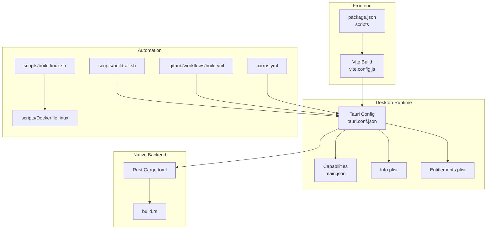
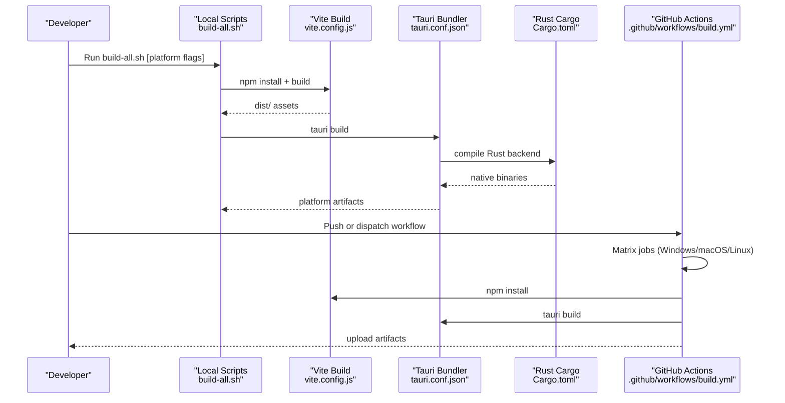
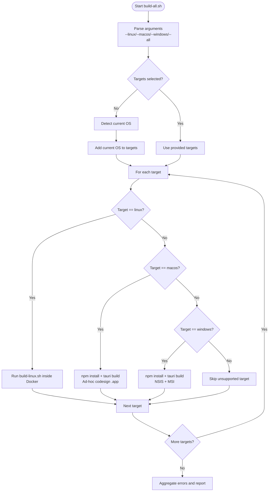
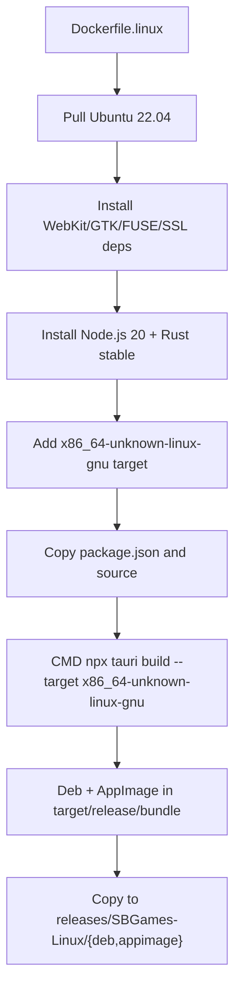
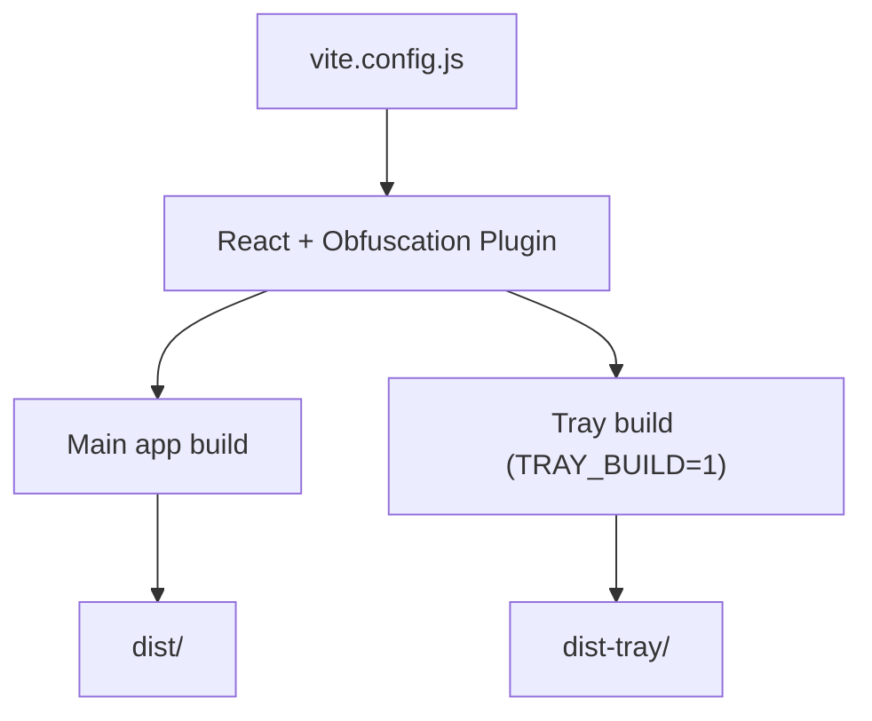
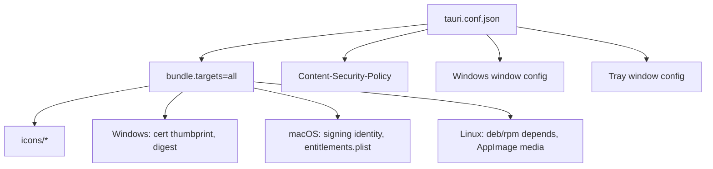
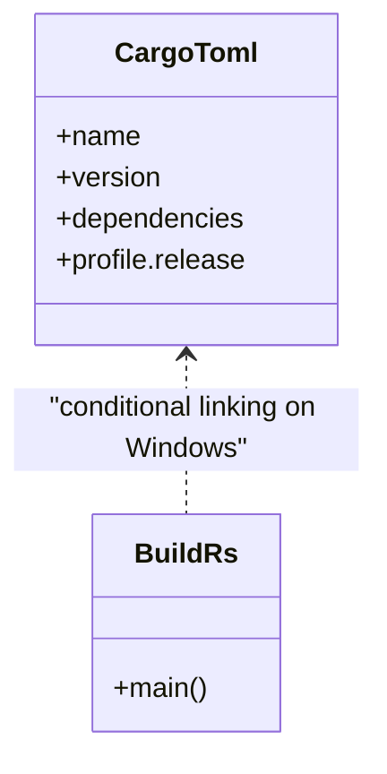
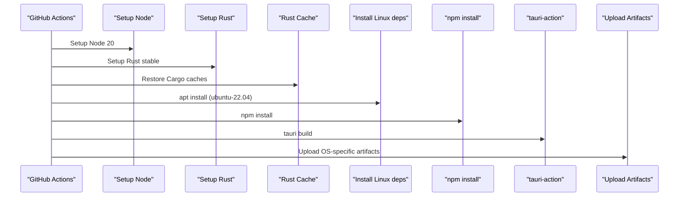
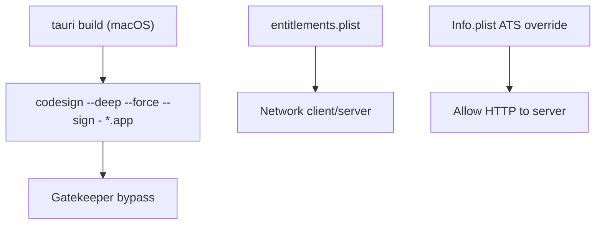
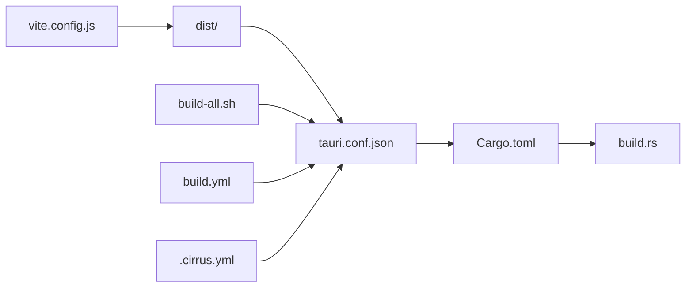

# Build & Deployment Processes

<cite>
**Referenced Files in This Document**
- [BUILD.md](file://BUILD.md)
- [build-all.sh](file://scripts/build-all.sh)
- [build-linux.sh](file://scripts/build-linux.sh)
- [Dockerfile.linux](file://scripts/Dockerfile.linux)
- [.github workflows build.yml](file://.github/workflows/build.yml)
- [Cargo.toml](file://src-tauri/Cargo.toml)
- [tauri.conf.json](file://src-tauri/tauri.conf.json)
- [vite.config.js](file://vite.config.js)
- [package.json](file://package.json)
- [build.rs](file://src-tauri/build.rs)
- [main.json](file://src-tauri/capabilities/main.json)
- [Info.plist](file://src-tauri/Info.plist)
- [entitlements.plist](file://src-tauri/entitlements.plist)
- [.cirrus.yml](file://.cirrus.yml)
- [DownloadPage.jsx](file://website/src/pages/DownloadPage.jsx)
</cite>

## Table of Contents
1. [Introduction](#introduction)
2. [Project Structure](#project-structure)
3. [Core Components](#core-components)
4. [Architecture Overview](#architecture-overview)
5. [Detailed Component Analysis](#detailed-component-analysis)
6. [Dependency Analysis](#dependency-analysis)
7. [Performance Considerations](#performance-considerations)
8. [Troubleshooting Guide](#troubleshooting-guide)
9. [Conclusion](#conclusion)
10. [Appendices](#appendices)

## Introduction
This document explains the end-to-end build and deployment processes for the SBGames desktop application. It covers the multi-stage pipeline that combines Vite for the React-based frontend with Tauri/Rust for the native desktop runtime, the automated build scripts for local and CI builds, platform-specific packaging and signing, continuous integration with GitHub Actions, and operational topics such as release workflows, versioning, distribution channels, and troubleshooting.

## Project Structure
The build system spans several layers:
- Frontend built with Vite and React, producing static assets consumed by the Tauri app.
- Tauri configuration orchestrates bundling and platform targets.
- Rust crate compiles the native backend and integrates with Tauri.
- Automated scripts support local multi-platform builds and CI orchestration.
- Packaging and signing are configured per platform.

**Diagram sources**
- [vite.config.js](file://vite.config.js)
- [package.json](file://package.json)
- [tauri.conf.json](file://src-tauri/tauri.conf.json)
- [main.json](file://src-tauri/capabilities/main.json)
- [Info.plist](file://src-tauri/Info.plist)
- [entitlements.plist](file://src-tauri/entitlements.plist)
- [Cargo.toml](file://src-tauri/Cargo.toml)
- [build.rs](file://src-tauri/build.rs)
- [build-all.sh](file://scripts/build-all.sh)
- [build-linux.sh](file://scripts/build-linux.sh)
- [Dockerfile.linux](file://scripts/Dockerfile.linux)
- [.github workflows build.yml](file://.github/workflows/build.yml)
- [.cirrus.yml](file://.cirrus.yml)

**Section sources**
- [BUILD.md](file://BUILD.md)
- [package.json](file://package.json)
- [vite.config.js](file://vite.config.js)
- [tauri.conf.json](file://src-tauri/tauri.conf.json)
- [Cargo.toml](file://src-tauri/Cargo.toml)
- [build-all.sh](file://scripts/build-all.sh)
- [.github workflows build.yml](file://.github/workflows/build.yml)

## Core Components
- Multi-stage frontend build with Vite and React, including optional JavaScript obfuscation during build.
- Tauri configuration defining product metadata, bundling targets, icons, and platform-specific settings.
- Rust crate with Tauri 2 dependencies and optimized release profile.
- Platform-specific packaging and signing:
  - Windows: NSIS installer and MSI via Tauri bundler.
  - macOS: DMG with ad-hoc code signing for Gatekeeper compatibility.
  - Linux: deb and AppImage via Tauri bundler and Docker-based cross-compilation.
- Continuous integration via GitHub Actions and Cirrus CI for macOS builds.

**Section sources**
- [package.json](file://package.json)
- [vite.config.js](file://vite.config.js)
- [tauri.conf.json](file://src-tauri/tauri.conf.json)
- [Cargo.toml](file://src-tauri/Cargo.toml)
- [build-all.sh](file://scripts/build-all.sh)
- [.github workflows build.yml](file://.github/workflows/build.yml)
- [.cirrus.yml](file://.cirrus.yml)

## Architecture Overview
The build pipeline proceeds as follows:
- Frontend assets are produced by Vite and packaged into the Tauri app.
- Tauri bundles the app with platform-specific installers and packages.
- Rust compiles the native backend and links platform libraries as needed.
- Automation scripts and CI orchestrate builds across platforms.

**Diagram sources**
- [build-all.sh](file://scripts/build-all.sh)
- [vite.config.js](file://vite.config.js)
- [tauri.conf.json](file://src-tauri/tauri.conf.json)
- [Cargo.toml](file://src-tauri/Cargo.toml)
- [.github workflows build.yml](file://.github/workflows/build.yml)

## Detailed Component Analysis

### Local Build Script: build-all.sh
- Supports targeting Linux, macOS, Windows, or all platforms.
- Detects current OS and validates platform availability.
- Orchestrates per-platform build steps:
  - Linux: Docker-based cross-compilation using a dedicated Dockerfile.
  - macOS: runs Tauri build and applies ad-hoc code signing for Gatekeeper compatibility.
  - Windows: runs Tauri build and produces NSIS and MSI installers.
- Aggregates errors and reports overall success.

**Diagram sources**
- [build-all.sh](file://scripts/build-all.sh)
- [build-linux.sh](file://scripts/build-linux.sh)

**Section sources**
- [build-all.sh](file://scripts/build-all.sh)

### Linux Build via Docker
- Builds a Docker image installing Node.js, Rust, GTK/WebKit dependencies, and Tauri prerequisites.
- Runs Tauri build inside the container for cross-compilation to Linux targets.
- Copies resulting deb and AppImage artifacts to a releases directory.

**Diagram sources**
- [Dockerfile.linux](file://scripts/Dockerfile.linux)
- [build-linux.sh](file://scripts/build-linux.sh)

**Section sources**
- [build-linux.sh](file://scripts/build-linux.sh)
- [Dockerfile.linux](file://scripts/Dockerfile.linux)

### Frontend Build and Obfuscation
- Vite configuration defines React plugin chain, aliases, and build options.
- A custom obfuscation plugin runs during build to obfuscate JavaScript chunks.
- Separate builds for main app and tray app with distinct entry points and outputs.

**Diagram sources**
- [vite.config.js](file://vite.config.js)
- [package.json](file://package.json)

**Section sources**
- [vite.config.js](file://vite.config.js)
- [package.json](file://package.json)

### Tauri Configuration and Platform Settings
- Product metadata, window configuration, and CSP are defined centrally.
- Bundling targets are set to “all” to produce installers for all supported platforms.
- Platform-specific settings:
  - Windows: certificate thumbprint and digest algorithm placeholders.
  - macOS: minimum system version, signing identity placeholder, and entitlements file.
  - Linux: deb/rpm dependency arrays and AppImage media framework bundling.

**Diagram sources**
- [tauri.conf.json](file://src-tauri/tauri.conf.json)
- [entitlements.plist](file://src-tauri/entitlements.plist)

**Section sources**
- [tauri.conf.json](file://src-tauri/tauri.conf.json)
- [entitlements.plist](file://src-tauri/entitlements.plist)

### Rust Crate and Build Script
- Cargo.toml defines Tauri 2 dependencies, optional Windows-specific sys crates, and a release profile with LTO and strip.
- build.rs conditionally links Windows system libraries when targeting Windows.

**Diagram sources**
- [Cargo.toml](file://src-tauri/Cargo.toml)
- [build.rs](file://src-tauri/build.rs)

**Section sources**
- [Cargo.toml](file://src-tauri/Cargo.toml)
- [build.rs](file://src-tauri/build.rs)

### Continuous Integration: GitHub Actions
- Matrix strategy builds Windows, macOS, and Linux artifacts.
- Caches Rust and Node dependencies for speed.
- Installs Linux system dependencies prior to build.
- Uploads platform-specific artifacts.

**Diagram sources**
- [.github workflows build.yml](file://.github/workflows/build.yml)

**Section sources**
- [.github workflows build.yml](file://.github/workflows/build.yml)

### macOS Signing and Gatekeeper Compatibility
- The local macOS build applies an ad-hoc code signature to the .app to avoid Gatekeeper warnings.
- The Tauri configuration includes an entitlements file enabling network client/server capabilities.
- An Info.plist allows HTTP traffic to the development server domain for local builds.

**Diagram sources**
- [build-all.sh](file://scripts/build-all.sh)
- [entitlements.plist](file://src-tauri/entitlements.plist)
- [Info.plist](file://src-tauri/Info.plist)

**Section sources**
- [build-all.sh](file://scripts/build-all.sh)
- [entitlements.plist](file://src-tauri/entitlements.plist)
- [Info.plist](file://src-tauri/Info.plist)

### Linux Packaging and Distribution
- Tauri generates deb and AppImage packages.
- The Dockerfile installs required system dependencies and cross-compilation tools.
- The build script copies artifacts to a structured releases directory.

**Section sources**
- [build-linux.sh](file://scripts/build-linux.sh)
- [Dockerfile.linux](file://scripts/Dockerfile.linux)

### Website Download Instructions
- The website’s download page documents platform-specific installation notes for Windows, macOS, and Linux.

**Section sources**
- [DownloadPage.jsx](file://website/src/pages/DownloadPage.jsx)

## Dependency Analysis
- Frontend depends on Vite and React ecosystem; build scripts orchestrate npm tasks.
- Tauri consumes frontend dist assets and bundles native binaries.
- Rust crate depends on Tauri 2 and platform libraries; build.rs injects Windows linkage.
- CI depends on Node, Rust, and platform-specific system packages.

**Diagram sources**
- [vite.config.js](file://vite.config.js)
- [tauri.conf.json](file://src-tauri/tauri.conf.json)
- [Cargo.toml](file://src-tauri/Cargo.toml)
- [build.rs](file://src-tauri/build.rs)
- [build-all.sh](file://scripts/build-all.sh)
- [.github workflows build.yml](file://.github/workflows/build.yml)
- [.cirrus.yml](file://.cirrus.yml)

**Section sources**
- [vite.config.js](file://vite.config.js)
- [tauri.conf.json](file://src-tauri/tauri.conf.json)
- [Cargo.toml](file://src-tauri/Cargo.toml)
- [build-all.sh](file://scripts/build-all.sh)
- [.github workflows build.yml](file://.github/workflows/build.yml)
- [.cirrus.yml](file://.cirrus.yml)

## Performance Considerations
- Enable Rust caching in CI to reduce cold-start times.
- Reuse Node dependency caches to accelerate frontend builds.
- Prefer Docker-based Linux builds to avoid local environment variability.
- Use Tauri’s release profile (LTO, strip, single codegen unit) to optimize binary size and performance.
- Minimize frontend bundle size with tree-shaking and obfuscation settings.

[No sources needed since this section provides general guidance]

## Troubleshooting Guide
Common build issues and resolutions:
- macOS Gatekeeper errors:
  - Apply ad-hoc code signing during local builds.
  - Clear quarantine extended attributes if the .app still fails to open.
- Linux build failures:
  - Ensure Docker is installed and the Dockerfile ran successfully.
  - Verify system dependencies are present in the container.
- Windows installer issues:
  - Confirm Tauri bundler generated NSIS and MSI artifacts.
  - Review certificate and timestamp settings if signing is required.
- CI flakiness:
  - Check dependency caches and system package installations.
  - Validate platform-specific steps (Linux deps, macOS signing identity).
- Frontend obfuscation failures:
  - Confirm the obfuscation plugin is applied only to JS chunks and does not interfere with React internals.

**Section sources**
- [build-all.sh](file://scripts/build-all.sh)
- [build-linux.sh](file://scripts/build-linux.sh)
- [tauri.conf.json](file://src-tauri/tauri.conf.json)
- [.github workflows build.yml](file://.github/workflows/build.yml)

## Conclusion
The SBGames build and deployment pipeline integrates Vite, Tauri, and Rust to deliver native desktop installers across Windows, macOS, and Linux. Local automation via shell scripts and robust CI with GitHub Actions streamline multi-platform builds. Platform-specific packaging and signing ensure secure distribution, while CI caching and Docker-based Linux builds improve reliability and performance.

[No sources needed since this section summarizes without analyzing specific files]

## Appendices

### Release Process Workflow
- Version management:
  - Keep versions synchronized in package.json and tauri.conf.json.
  - Increment versions consistently across frontend and native layers.
- CI-triggered releases:
  - Use GitHub Actions matrix to build all platforms.
  - Upload artifacts for each job; collect and publish in a release step.
- Distribution channels:
  - Publish Windows installers (NSIS/MSI), macOS DMG, and Linux packages (deb/AppImage) to release assets.
  - Maintain website download page with platform-specific notes.

**Section sources**
- [package.json](file://package.json)
- [tauri.conf.json](file://src-tauri/tauri.conf.json)
- [.github workflows build.yml](file://.github/workflows/build.yml)
- [DownloadPage.jsx](file://website/src/pages/DownloadPage.jsx)

### Update Mechanism and Rollback Procedures
- Update checking:
  - Implement an updater plugin in Tauri to check for newer versions and download/install updates.
  - Use release asset URLs and semantic version comparisons.
- Rollback:
  - Preserve previous version binaries and restore on failure.
  - Provide a manual rollback option in the UI to revert to the last known good version.

[No sources needed since this section provides general guidance]