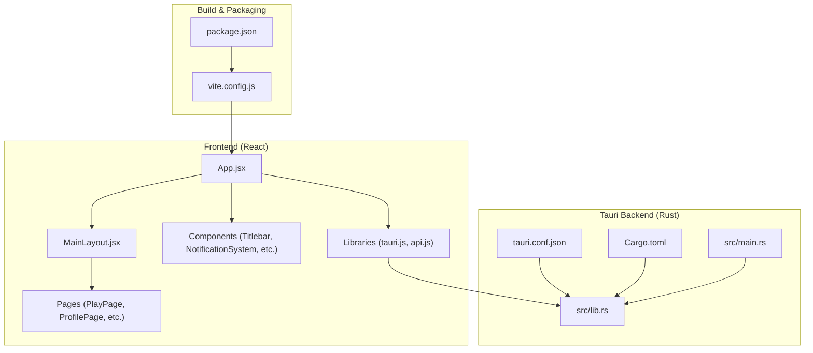
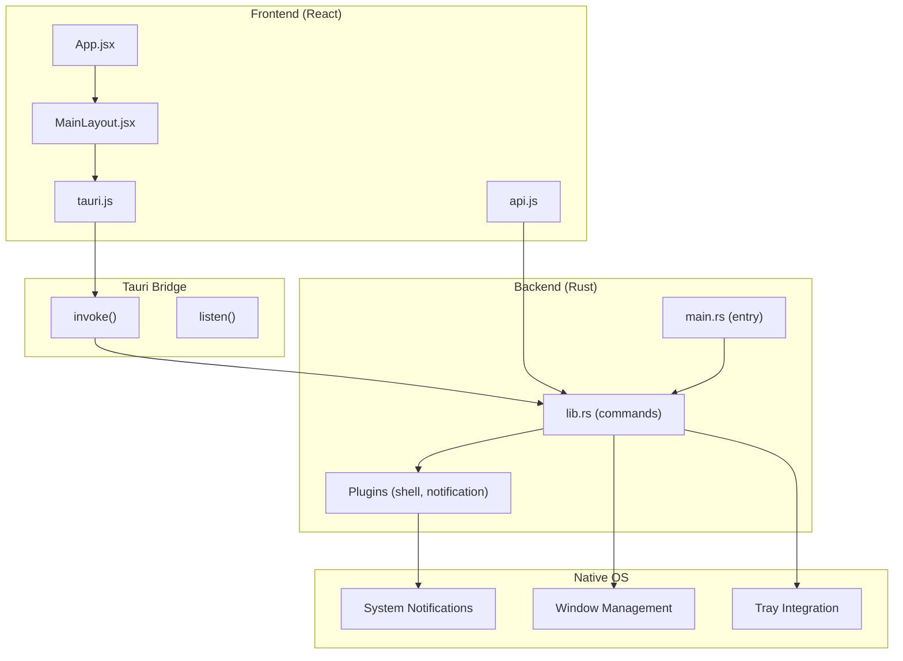
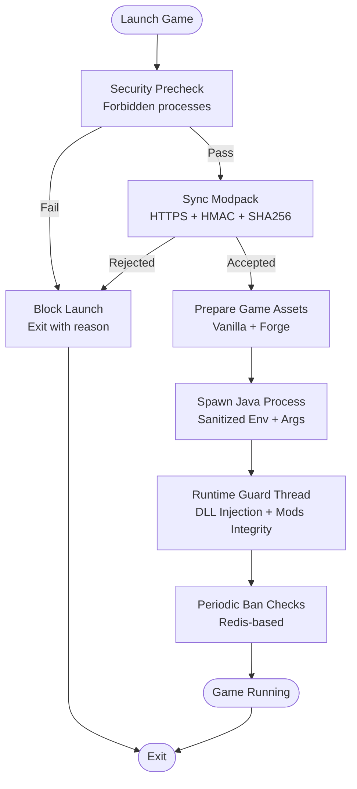
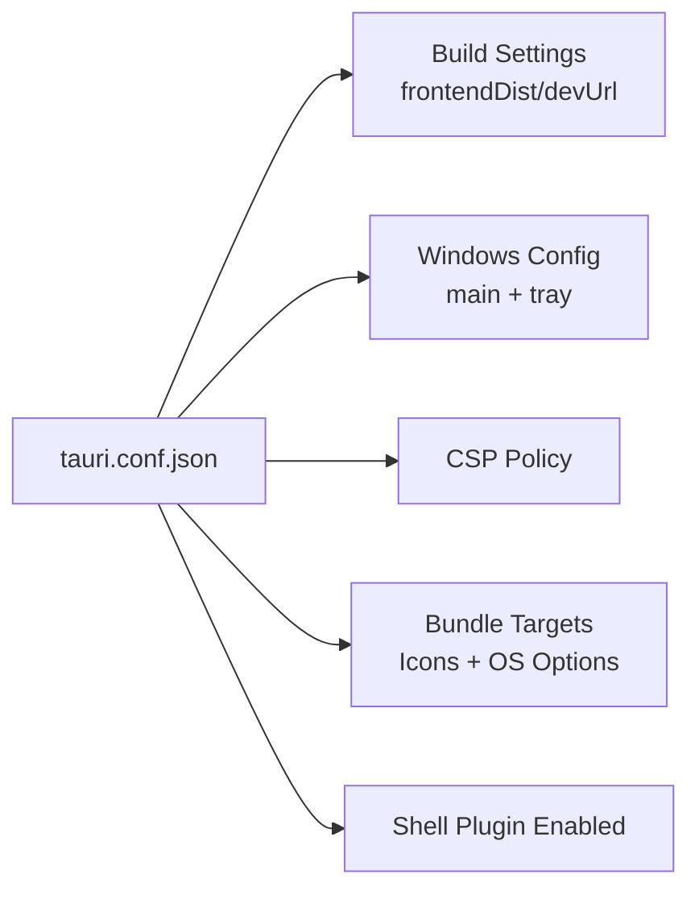
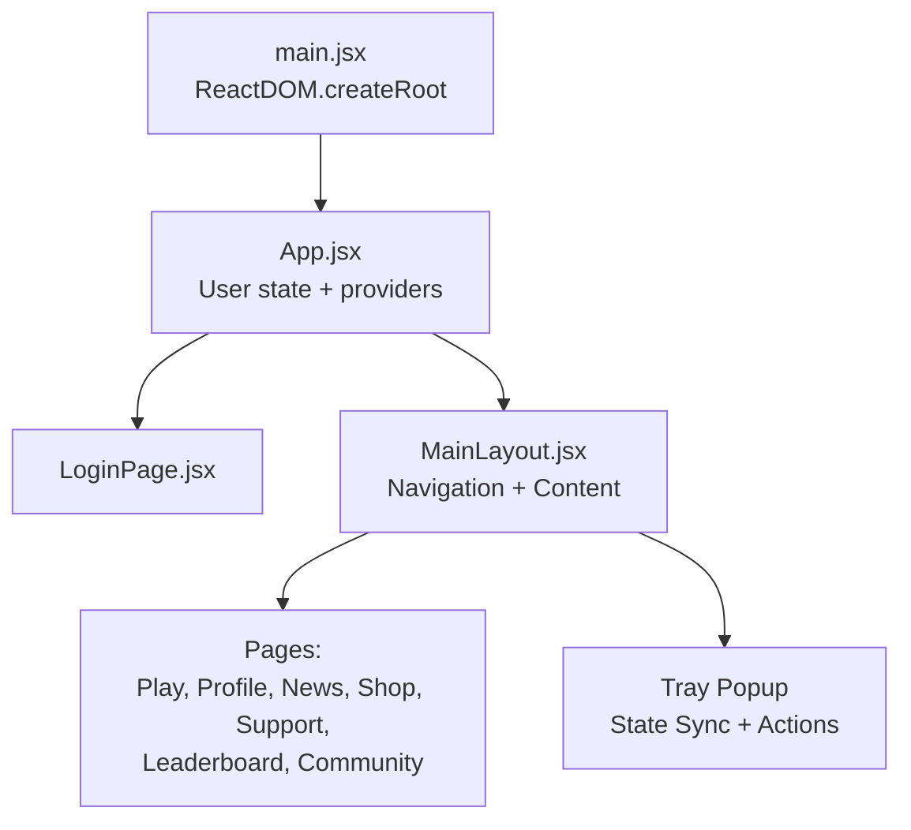
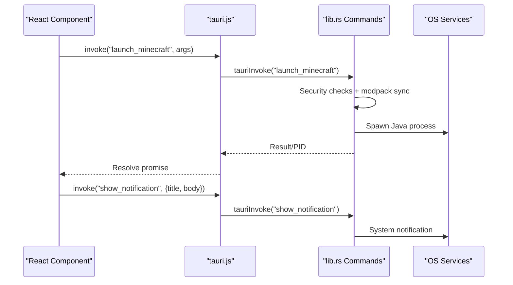
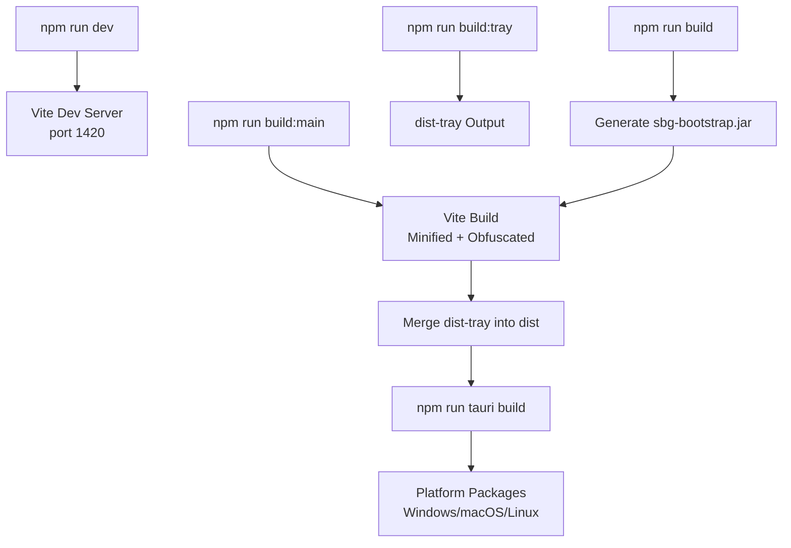
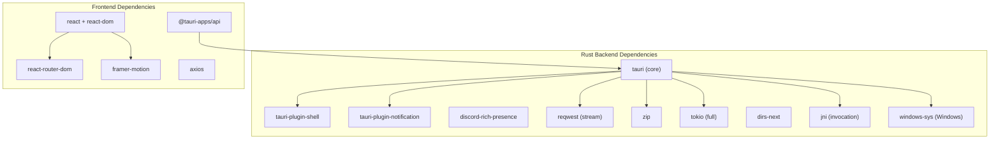

# Desktop Application Architecture

<cite>
**Referenced Files in This Document**
- [Cargo.toml](file://src-tauri/Cargo.toml)
- [tauri.conf.json](file://src-tauri/tauri.conf.json)
- [App.jsx](file://src/App.jsx)
- [main.jsx](file://src/main.jsx)
- [MainLayout.jsx](file://src/pages/MainLayout.jsx)
- [tauri.js](file://src/lib/tauri.js)
- [api.js](file://src/lib/api.js)
- [lib.rs](file://src-tauri/src/lib.rs)
- [main.rs](file://src-tauri/src/main.rs)
- [vite.config.js](file://vite.config.js)
- [package.json](file://package.json)
</cite>

## Table of Contents
1. [Introduction](#introduction)
2. [Project Structure](#project-structure)
3. [Core Components](#core-components)
4. [Architecture Overview](#architecture-overview)
5. [Detailed Component Analysis](#detailed-component-analysis)
6. [Dependency Analysis](#dependency-analysis)
7. [Performance Considerations](#performance-considerations)
8. [Troubleshooting Guide](#troubleshooting-guide)
9. [Conclusion](#conclusion)

## Introduction
This document describes the desktop application architecture for SBGames, a Tauri-based launcher for a Minecraft-compatible gaming service. The application uses a hybrid architecture: a React-based frontend for the user interface and a Rust backend for system-level operations, security enforcement, and native OS integration. The Tauri framework enables secure, lightweight desktop packaging with minimal overhead while leveraging native capabilities such as system notifications, tray integration, and process management.

Key architectural goals:
- Secure execution environment with anti-debugging and anti-injection protections
- Seamless native OS integration for notifications, tray, and window management
- Robust game launching pipeline with modpack integrity verification
- Cross-platform compatibility across Windows, macOS, and Linux

## Project Structure
The project follows a clear separation of concerns:
- Frontend (React): located under `src/`, including pages, components, hooks, and shared libraries
- Backend (Tauri/Rust): located under `src-tauri/`, including the Tauri configuration, Rust entry points, and command implementations
- Build tooling: Vite for bundling and development, with custom obfuscation and tray-specific builds
- Distribution: Tauri's bundler handles platform-specific packaging

**Diagram sources**
- [App.jsx:1-41](file://src/App.jsx#L1-L41)
- [MainLayout.jsx:1-313](file://src/pages/MainLayout.jsx#L1-L313)
- [tauri.conf.json:1-89](file://src-tauri/tauri.conf.json#L1-L89)
- [Cargo.toml:1-57](file://src-tauri/Cargo.toml#L1-L57)
- [main.rs:1-7](file://src-tauri/src/main.rs#L1-L7)
- [lib.rs:2526-2599](file://src-tauri/src/lib.rs#L2526-L2599)
- [vite.config.js:1-97](file://vite.config.js#L1-L97)
- [package.json:1-43](file://package.json#L1-L43)

**Section sources**
- [App.jsx:1-41](file://src/App.jsx#L1-L41)
- [MainLayout.jsx:1-313](file://src/pages/MainLayout.jsx#L1-L313)
- [tauri.conf.json:1-89](file://src-tauri/tauri.conf.json#L1-L89)
- [Cargo.toml:1-57](file://src-tauri/Cargo.toml#L1-L57)
- [main.rs:1-7](file://src-tauri/src/main.rs#L1-L7)
- [lib.rs:2526-2599](file://src-tauri/src/lib.rs#L2526-L2599)
- [vite.config.js:1-97](file://vite.config.js#L1-L97)
- [package.json:1-43](file://package.json#L1-L43)

## Core Components
- App container and routing: The React App component manages user state and toggles between Login and MainLayout views. It also provides global providers for notifications and a custom cursor.
- Main layout and navigation: MainLayout orchestrates the primary UI, including a top navigation bar, content area with animated page transitions, a community panel, and a download progress overlay. It integrates with Tauri commands for tray state updates and game launch triggers.
- Tauri backend: Implements commands for launching Minecraft with integrity checks, managing tray state, showing system notifications, and exposing system information. It includes robust anti-debugging and anti-injection protections and a secure modpack synchronization pipeline.
- Shared libraries: tauri.js wraps Tauri IPC calls with safe error handling and provides helpers for desktop notifications and Discord presence. api.js centralizes API endpoints and token handling.

**Section sources**
- [App.jsx:1-41](file://src/App.jsx#L1-L41)
- [MainLayout.jsx:1-313](file://src/pages/MainLayout.jsx#L1-L313)
- [tauri.js:1-101](file://src/lib/tauri.js#L1-L101)
- [api.js:1-30](file://src/lib/api.js#L1-L30)
- [lib.rs:140-232](file://src-tauri/src/lib.rs#L140-L232)

## Architecture Overview
The application employs a hybrid architecture with clear boundaries between the frontend and backend:

**Diagram sources**
- [App.jsx:1-41](file://src/App.jsx#L1-L41)
- [MainLayout.jsx:1-313](file://src/pages/MainLayout.jsx#L1-L313)
- [tauri.js:1-101](file://src/lib/tauri.js#L1-L101)
- [api.js:1-30](file://src/lib/api.js#L1-L30)
- [lib.rs:2546-2599](file://src-tauri/src/lib.rs#L2546-L2599)
- [main.rs:1-7](file://src-tauri/src/main.rs#L1-L7)

## Detailed Component Analysis

### Hybrid Architecture and Security Model
The application enforces a strong security posture:
- Anti-debugging and anti-injection: On non-debug builds, the Rust backend performs DLL baseline scans, checks for forbidden processes, and runs a guard thread to detect tampering during runtime.
- Integrity verification: Modpack synchronization validates each mod against a server-signed manifest and rejects unauthorized modifications.
- Secure process spawning: The launcher sanitizes environment variables, verifies Java availability, and uses a custom bootstrap to launch the game with controlled JVM arguments and module/classpath separation.
- Native protections: Windows-specific mitigations include DLL search path hardening and job object controls to manage child processes and restrict UI-related operations.

**Diagram sources**
- [lib.rs:1780-1826](file://src-tauri/src/lib.rs#L1780-L1826)
- [lib.rs:1516-1773](file://src-tauri/src/lib.rs#L1516-L1773)
- [lib.rs:340-1473](file://src-tauri/src/lib.rs#L340-L1473)
- [lib.rs:1007-1362](file://src-tauri/src/lib.rs#L1007-L1362)

**Section sources**
- [lib.rs:17-133](file://src-tauri/src/lib.rs#L17-L133)
- [lib.rs:1780-1826](file://src-tauri/src/lib.rs#L1780-L1826)
- [lib.rs:1516-1773](file://src-tauri/src/lib.rs#L1516-L1773)
- [lib.rs:340-1473](file://src-tauri/src/lib.rs#L340-L1473)
- [lib.rs:1007-1362](file://src-tauri/src/lib.rs#L1007-L1362)

### Tauri Configuration and Window Management
Tauri configuration defines:
- Product metadata and build pipeline integration with Vite
- Two webview windows: main launcher UI and a transparent tray popup
- Security policy (CSP) restricting resource origins and framing
- Platform-specific bundling options and plugin enablement

**Diagram sources**
- [tauri.conf.json:1-89](file://src-tauri/tauri.conf.json#L1-L89)

**Section sources**
- [tauri.conf.json:1-89](file://src-tauri/tauri.conf.json#L1-L89)

### Component Hierarchy and Navigation
The React component hierarchy starts at the root and flows through the App container to the MainLayout and specialized pages:

**Diagram sources**
- [main.jsx:1-11](file://src/main.jsx#L1-L11)
- [App.jsx:1-41](file://src/App.jsx#L1-L41)
- [MainLayout.jsx:1-313](file://src/pages/MainLayout.jsx#L1-L313)

**Section sources**
- [main.jsx:1-11](file://src/main.jsx#L1-L11)
- [App.jsx:1-41](file://src/App.jsx#L1-L41)
- [MainLayout.jsx:1-313](file://src/pages/MainLayout.jsx#L1-L313)

### IPC and Native API Integration
Frontend-to-backend communication is handled via Tauri's invoke/listen utilities:
- Safe invocation wrapper ensures errors are surfaced when Tauri APIs are unavailable
- Event listening supports reactive UI updates
- Desktop notifications are shown via Tauri's notification plugin
- Discord Rich Presence is managed through dedicated commands

**Diagram sources**
- [tauri.js:1-101](file://src/lib/tauri.js#L1-L101)
- [lib.rs:340-1473](file://src-tauri/src/lib.rs#L340-L1473)
- [lib.rs:320-329](file://src-tauri/src/lib.rs#L320-L329)

**Section sources**
- [tauri.js:1-101](file://src/lib/tauri.js#L1-L101)
- [lib.rs:320-329](file://src-tauri/src/lib.rs#L320-L329)
- [lib.rs:340-1473](file://src-tauri/src/lib.rs#L340-L1473)

### Build Process and Distribution
The build pipeline leverages Vite and custom scripts:
- Development: Vite dev server with hot module replacement and optional host binding for remote HMR
- Production: Bundling with Terser minification, console/debugger removal, and JavaScript obfuscation
- Tray build: Separate build targeting tray HTML with distinct output directory
- Tauri CLI integration: Scripts delegate to @tauri-apps/cli for packaging

**Diagram sources**
- [package.json:6-13](file://package.json#L6-L13)
- [vite.config.js:62-96](file://vite.config.js#L62-L96)

**Section sources**
- [package.json:6-13](file://package.json#L6-L13)
- [vite.config.js:1-97](file://vite.config.js#L1-L97)

## Dependency Analysis
The Rust backend depends on Tauri and several ecosystem crates for system integration, cryptography, networking, and process management. The frontend depends on React, routing, animations, and Tauri APIs.

**Diagram sources**
- [Cargo.toml:17-35](file://src-tauri/Cargo.toml#L17-L35)
- [package.json:15-28](file://package.json#L15-L28)

**Section sources**
- [Cargo.toml:17-35](file://src-tauri/Cargo.toml#L17-L35)
- [package.json:15-28](file://package.json#L15-L28)

## Performance Considerations
- Minification and obfuscation: Terser removes console statements and debuggers; JavaScriptObfuscator applies advanced transformations to reduce reverse engineering and payload size.
- Streaming downloads: Rust uses streaming HTTP requests to minimize memory usage during asset downloads.
- Controlled IPC updates: Progress events are throttled to prevent excessive IPC traffic.
- Memory footprint: The launcher targets modest RAM usage; system RAM detection is exposed via a command for adaptive behavior.
- Build optimization: Release profile enables LTO, single-codegen unit, and stripped binaries.

Recommendations:
- Prefer lazy-loading for heavy pages to reduce initial load
- Debounce frequent IPC updates in UI components
- Monitor network timeouts and retry logic for asset downloads
- Use platform-specific optimizations (e.g., Windows job objects) judiciously

**Section sources**
- [vite.config.js:7-40](file://vite.config.js#L7-L40)
- [lib.rs:2044-2139](file://src-tauri/src/lib.rs#L2044-L2139)
- [Cargo.toml:51-57](file://src-tauri/Cargo.toml#L51-L57)

## Troubleshooting Guide
Common issues and remedies:
- Game fails to launch due to security checks:
  - Verify no forbidden processes are running (debuggers, injectors)
  - Ensure Java is installed and discoverable; the launcher searches common locations
  - Check for guard-trigger messages indicating blocked mods or DLL injection
- Modpack verification failures:
  - Confirm network connectivity to the API endpoints
  - Review the generated modpack report for missing or rejected mods
- Tray popup not updating:
  - Trigger state refresh from the main window and ensure IPC handlers are registered
- Windows-specific problems:
  - Confirm DLL protection and job object configurations are applied
  - Check task manager for unexpected processes interfering with the launcher

**Section sources**
- [lib.rs:1780-1826](file://src-tauri/src/lib.rs#L1780-L1826)
- [lib.rs:1516-1773](file://src-tauri/src/lib.rs#L1516-L1773)
- [lib.rs:1398-1473](file://src-tauri/src/lib.rs#L1398-L1473)
- [lib.rs:2149-2227](file://src-tauri/src/lib.rs#L2149-L2227)

## Conclusion
SBGames demonstrates a robust hybrid architecture that combines a modern React frontend with a secure Rust backend powered by Tauri. The design emphasizes native OS integration, strong security measures, and efficient resource management. The modular component structure, clear IPC boundaries, and comprehensive build pipeline support reliable cross-platform distribution and maintenance.