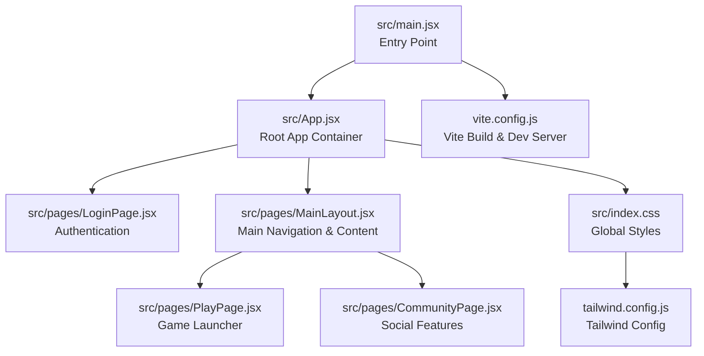
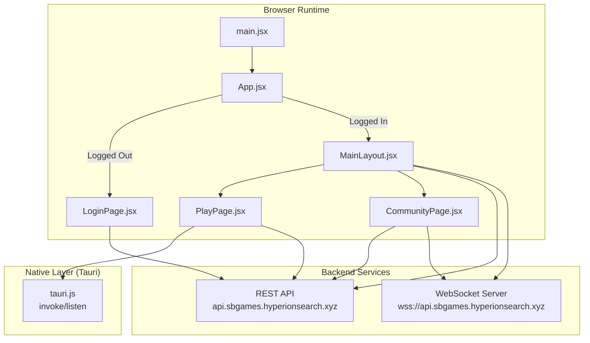
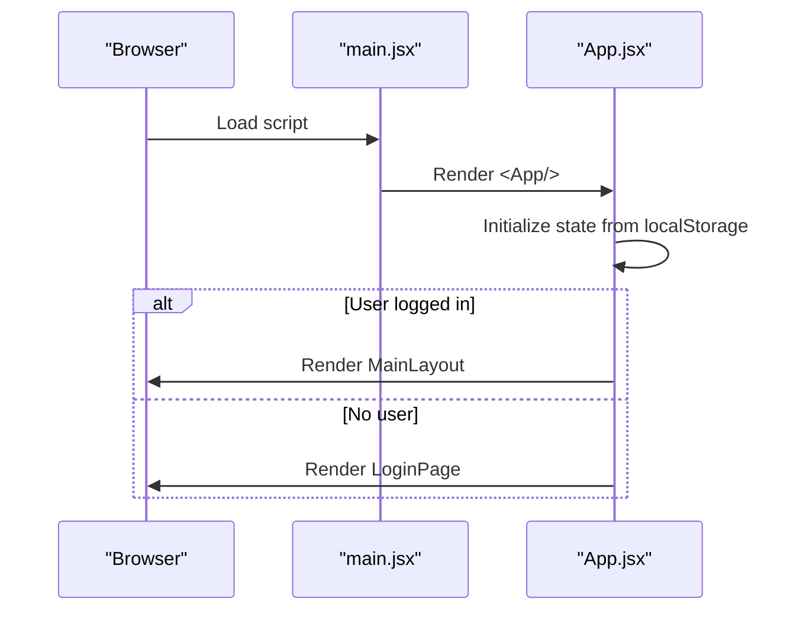
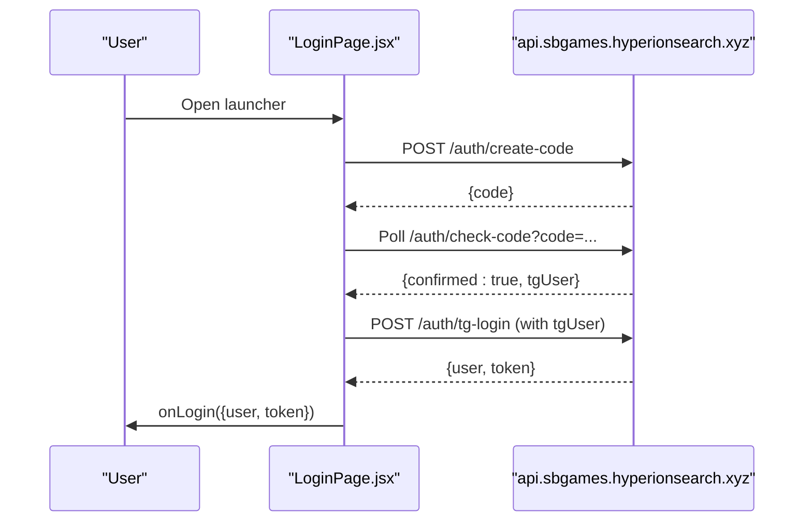
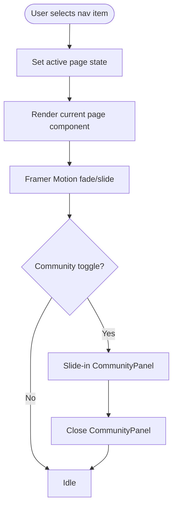
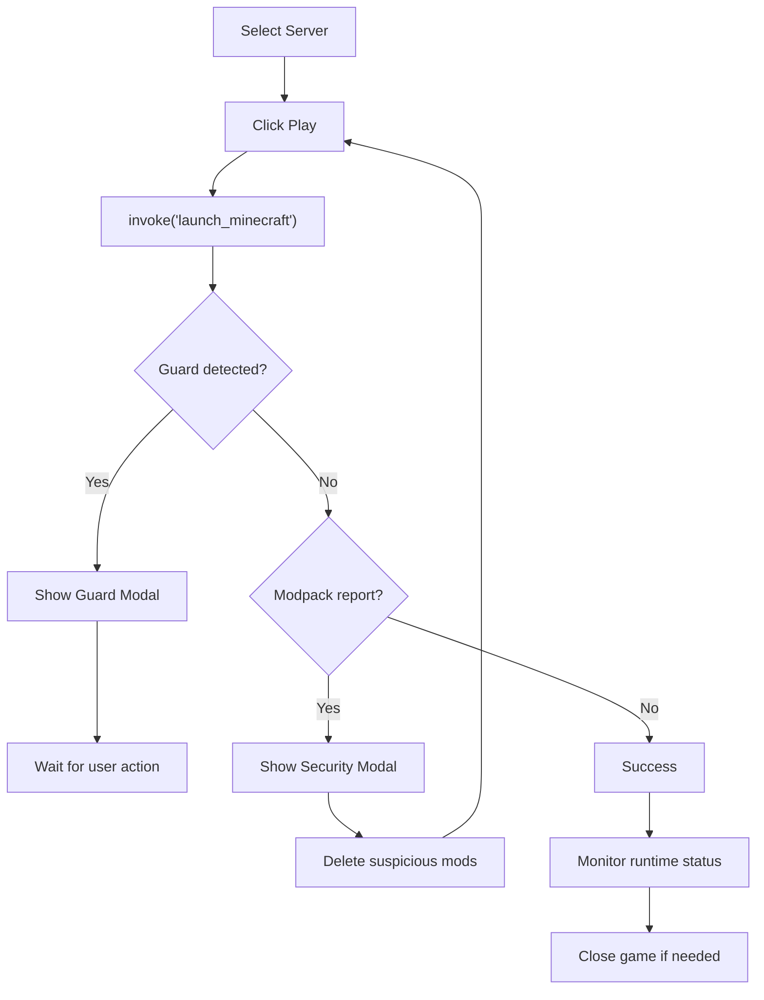
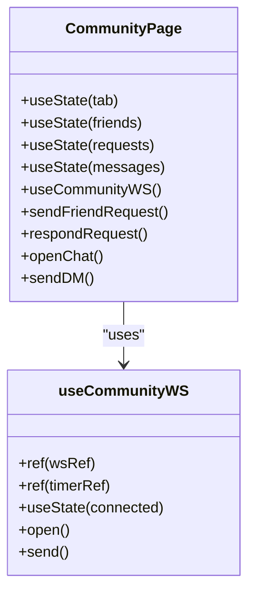
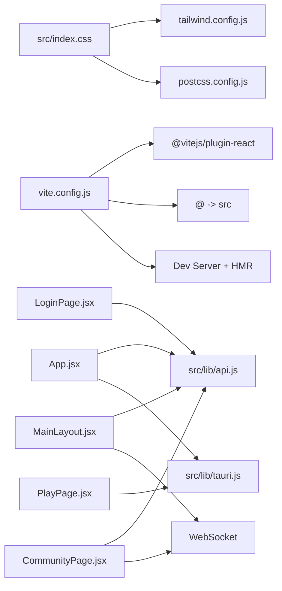

# React Frontend Structure

<cite>
**Referenced Files in This Document**
- [main.jsx](file://src/main.jsx)
- [App.jsx](file://src/App.jsx)
- [MainLayout.jsx](file://src/pages/MainLayout.jsx)
- [LoginPage.jsx](file://src/pages/LoginPage.jsx)
- [PlayPage.jsx](file://src/pages/PlayPage.jsx)
- [CommunityPage.jsx](file://src/pages/CommunityPage.jsx)
- [index.css](file://src/index.css)
- [tailwind.config.js](file://tailwind.config.js)
- [postcss.config.js](file://postcss.config.js)
- [vite.config.js](file://vite.config.js)
- [api.js](file://src/lib/api.js)
- [tauri.js](file://src/lib/tauri.js)
</cite>

## Table of Contents
1. [Introduction](#introduction)
2. [Project Structure](#project-structure)
3. [Core Components](#core-components)
4. [Architecture Overview](#architecture-overview)
5. [Detailed Component Analysis](#detailed-component-analysis)
6. [Dependency Analysis](#dependency-analysis)
7. [Performance Considerations](#performance-considerations)
8. [Troubleshooting Guide](#troubleshooting-guide)
9. [Conclusion](#conclusion)

## Introduction
This document explains the React frontend architecture of SBGames, focusing on the application entry point, routing and navigation patterns, component hierarchy, styling approach, state management, and build configuration. It also covers performance optimization techniques, development workflow, and debugging integrations.

## Project Structure
The frontend is organized around a single-page application (SPA) pattern with a root entry that mounts the main App component. Pages are organized under a dedicated pages directory, with shared components and utilities under components and lib respectively. Styling leverages Tailwind CSS with custom configurations and PostCSS plugins.

**Diagram sources**
- [main.jsx:1-11](file://src/main.jsx#L1-L11)
- [App.jsx:1-39](file://src/App.jsx#L1-L39)
- [MainLayout.jsx:1-310](file://src/pages/MainLayout.jsx#L1-L310)
- [LoginPage.jsx:1-453](file://src/pages/LoginPage.jsx#L1-L453)
- [PlayPage.jsx:1-746](file://src/pages/PlayPage.jsx#L1-L746)
- [CommunityPage.jsx:1-965](file://src/pages/CommunityPage.jsx#L1-L965)
- [index.css:1-34](file://src/index.css#L1-L34)
- [tailwind.config.js:1-62](file://tailwind.config.js#L1-L62)
- [vite.config.js:1-97](file://vite.config.js#L1-L97)

**Section sources**
- [main.jsx:1-11](file://src/main.jsx#L1-L11)
- [App.jsx:1-39](file://src/App.jsx#L1-L39)
- [index.css:1-34](file://src/index.css#L1-L34)
- [tailwind.config.js:1-62](file://tailwind.config.js#L1-L62)
- [postcss.config.js:1-7](file://postcss.config.js#L1-L7)
- [vite.config.js:1-97](file://vite.config.js#L1-L97)

## Core Components
- Entry point: Creates the React root and renders the App component with global styles.
- App container: Manages user session state, persists credentials to localStorage, and conditionally renders either LoginPage or MainLayout.
- MainLayout: Implements a tabbed navigation system with animated transitions, integrates WebSocket notifications, and hosts secondary views like Community and Profile.
- LoginPage: Handles Telegram-based authentication via QR code or bot flow, polling for confirmation, and optional nickname registration.
- PlayPage: Provides server selection, launch controls, runtime monitoring, and security modpack validation with modal dialogs.
- CommunityPage: Offers friend management, direct messages, group chats, and real-time updates via WebSocket.

**Section sources**
- [main.jsx:1-11](file://src/main.jsx#L1-L11)
- [App.jsx:1-39](file://src/App.jsx#L1-L39)
- [MainLayout.jsx:1-310](file://src/pages/MainLayout.jsx#L1-L310)
- [LoginPage.jsx:1-453](file://src/pages/LoginPage.jsx#L1-L453)
- [PlayPage.jsx:1-746](file://src/pages/PlayPage.jsx#L1-L746)
- [CommunityPage.jsx:1-965](file://src/pages/CommunityPage.jsx#L1-L965)

## Architecture Overview
The application follows a client-side SPA architecture with:
- Single entry mounting the App component.
- Conditional rendering based on authentication state.
- Local state management for user session and UI state.
- WebSocket connections for live updates and notifications.
- Tauri integration for native capabilities (desktop notifications, game launch, system presence).

**Diagram sources**
- [main.jsx:1-11](file://src/main.jsx#L1-L11)
- [App.jsx:1-39](file://src/App.jsx#L1-L39)
- [MainLayout.jsx:1-310](file://src/pages/MainLayout.jsx#L1-L310)
- [LoginPage.jsx:1-453](file://src/pages/LoginPage.jsx#L1-L453)
- [PlayPage.jsx:1-746](file://src/pages/PlayPage.jsx#L1-L746)
- [CommunityPage.jsx:1-965](file://src/pages/CommunityPage.jsx#L1-L965)
- [api.js:1-30](file://src/lib/api.js#L1-L30)
- [tauri.js:1-101](file://src/lib/tauri.js#L1-L101)

## Detailed Component Analysis

### Entry Point and App Container
- Mounts the React root and wraps the App in StrictMode.
- Initializes user state from localStorage and provides login/logout handlers.
- Renders LoginPage when no user is present; otherwise renders MainLayout.

**Diagram sources**
- [main.jsx:1-11](file://src/main.jsx#L1-L11)
- [App.jsx:1-39](file://src/App.jsx#L1-L39)

**Section sources**
- [main.jsx:1-11](file://src/main.jsx#L1-L11)
- [App.jsx:1-39](file://src/App.jsx#L1-L39)

### Authentication Flow (LoginPage)
- Supports two methods: QR code scanning and Telegram bot.
- Polls backend for confirmation and attempts auto-login with nickname fallback.
- Integrates platform-specific URL opening via Tauri when available.

**Diagram sources**
- [LoginPage.jsx:1-453](file://src/pages/LoginPage.jsx#L1-L453)
- [api.js:1-30](file://src/lib/api.js#L1-L30)

**Section sources**
- [LoginPage.jsx:1-453](file://src/pages/LoginPage.jsx#L1-L453)
- [api.js:1-30](file://src/lib/api.js#L1-L30)

### Main Navigation and Layout (MainLayout)
- Tabbed interface with six primary sections: Play, Profile, Leaderboard, Shop, News, Support.
- Animated transitions between pages using Framer Motion.
- WebSocket connection for real-time notifications (balance, friend, ticket).
- Embedded Community sidebar with animated slide-in panel.
- Desktop notifications integration via Tauri.

**Diagram sources**
- [MainLayout.jsx:1-310](file://src/pages/MainLayout.jsx#L1-L310)

**Section sources**
- [MainLayout.jsx:1-310](file://src/pages/MainLayout.jsx#L1-L310)

### Game Launch Experience (PlayPage)
- Server selection with animated backgrounds and highlights.
- Launch controls with runtime monitoring and anti-cheat safeguards.
- Modal dialogs for security reports and guard alerts.
- Persistent settings storage (RAM, Java path) and Discord presence updates.

**Diagram sources**
- [PlayPage.jsx:1-746](file://src/pages/PlayPage.jsx#L1-L746)
- [tauri.js:1-101](file://src/lib/tauri.js#L1-L101)

**Section sources**
- [PlayPage.jsx:1-746](file://src/pages/PlayPage.jsx#L1-L746)
- [tauri.js:1-101](file://src/lib/tauri.js#L1-L101)

### Social Hub (CommunityPage)
- Real-time social features via WebSocket with robust reconnection logic.
- Friend management, incoming friend requests, direct messaging, and group chats.
- Debounced global user search and online presence indicators.
- Dedicated WebSocket hook encapsulating connection lifecycle and message handling.

**Diagram sources**
- [CommunityPage.jsx:1-965](file://src/pages/CommunityPage.jsx#L1-L965)

**Section sources**
- [CommunityPage.jsx:1-965](file://src/pages/CommunityPage.jsx#L1-L965)

## Dependency Analysis
- Styling pipeline: Tailwind directives in index.css, configured via tailwind.config.js, processed by PostCSS (autoprefixer, tailwindcss).
- Build toolchain: Vite with React plugin, optional JavaScript obfuscation plugin, dev server with HMR, and aliases.
- Networking: Centralized API helpers for authenticated requests and token retrieval.
- Native integration: Tauri wrappers for invoke, events, desktop notifications, and Discord presence.

**Diagram sources**
- [index.css:1-34](file://src/index.css#L1-L34)
- [tailwind.config.js:1-62](file://tailwind.config.js#L1-L62)
- [postcss.config.js:1-7](file://postcss.config.js#L1-L7)
- [vite.config.js:1-97](file://vite.config.js#L1-L97)
- [api.js:1-30](file://src/lib/api.js#L1-L30)
- [tauri.js:1-101](file://src/lib/tauri.js#L1-L101)

**Section sources**
- [index.css:1-34](file://src/index.css#L1-L34)
- [tailwind.config.js:1-62](file://tailwind.config.js#L1-L62)
- [postcss.config.js:1-7](file://postcss.config.js#L1-L7)
- [vite.config.js:1-97](file://vite.config.js#L1-L97)
- [api.js:1-30](file://src/lib/api.js#L1-L30)
- [tauri.js:1-101](file://src/lib/tauri.js#L1-L101)

## Performance Considerations
- Bundle optimization: Terser minification and console/debugger stripping during build.
- Asset delivery: Static assets referenced via public paths (e.g., "/logo.jpg", "/money.png").
- Rendering efficiency: Framer Motion animations are scoped to minimize layout thrash; conditional rendering keeps inactive pages off DOM.
- Network efficiency: Debounced search in CommunityPage reduces API calls; WebSocket reuse avoids redundant connections.
- Memory hygiene: Cleanup timers and WebSocket connections on unmount; explicit close on component teardown.

[No sources needed since this section provides general guidance]

## Troubleshooting Guide
- Authentication failures: Verify network connectivity to the API domain and token persistence in localStorage.
- WebSocket disconnections: Inspect reconnection timers and ensure user context remains stable across renders.
- Launch errors: Review modpack security modal messages and confirm Java path/permissions; check guard modal for injected DLL detection.
- Desktop notifications: Confirm Tauri window creation and positioning logic; ensure notification.html is accessible.
- Dev server issues: Validate Vite server host/port configuration and HMR settings; check TRAY_BUILD environment for tray-specific builds.

**Section sources**
- [LoginPage.jsx:1-453](file://src/pages/LoginPage.jsx#L1-L453)
- [CommunityPage.jsx:1-965](file://src/pages/CommunityPage.jsx#L1-L965)
- [PlayPage.jsx:1-746](file://src/pages/PlayPage.jsx#L1-L746)
- [tauri.js:1-101](file://src/lib/tauri.js#L1-L101)
- [vite.config.js:1-97](file://vite.config.js#L1-L97)

## Conclusion
SBGames’ React frontend combines a clean SPA structure with robust state management, real-time communication, and native OS integration. The modular component design, centralized networking utilities, and Tailwind-based styling enable maintainable UI development. The Vite build pipeline and optional obfuscation provide production-ready optimizations, while the development server supports efficient iteration with HMR.