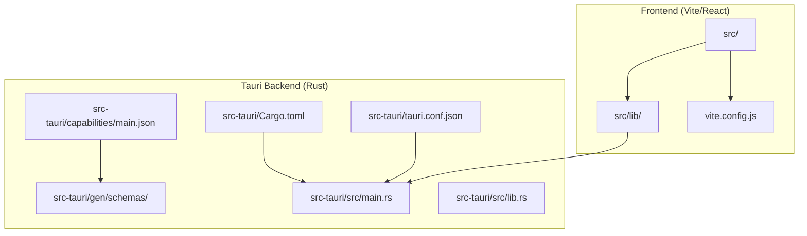
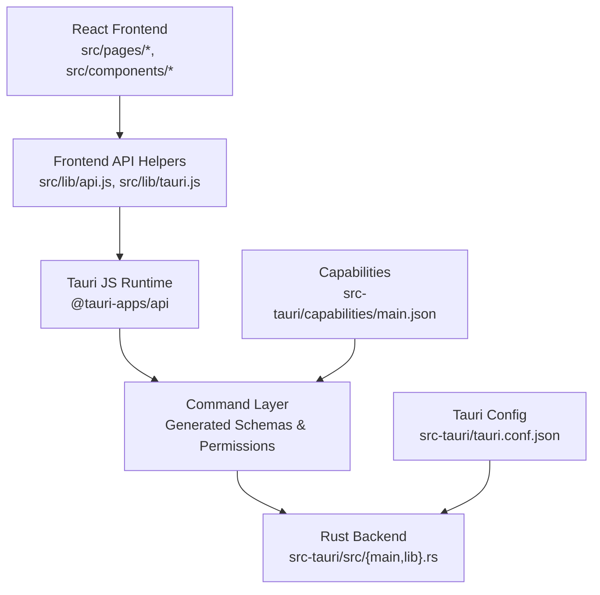
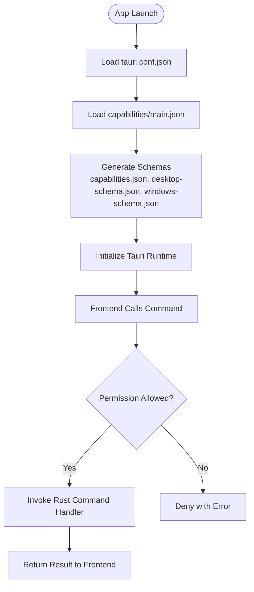
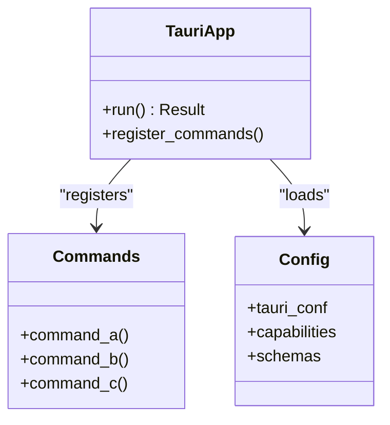
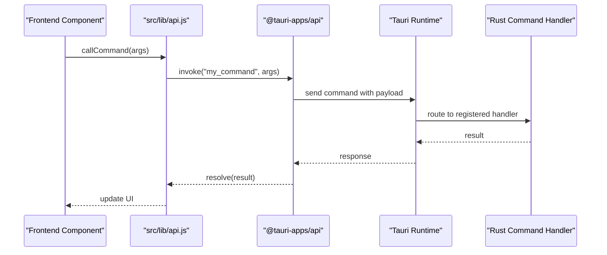
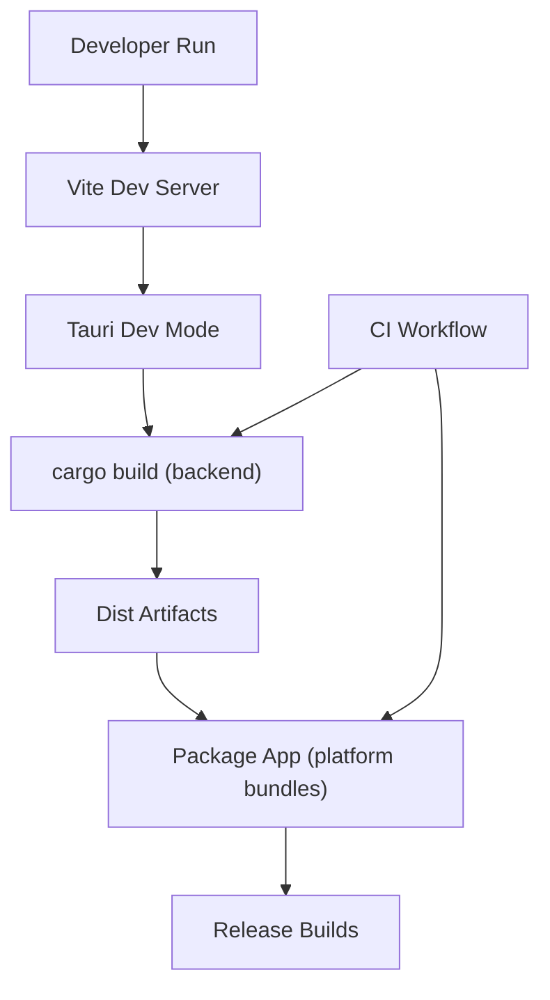
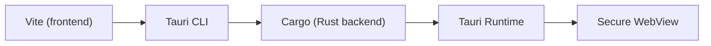

# Tauri Framework Fundamentals

<cite>
**Referenced Files in This Document**
- [tauri.conf.json](file://src-tauri/tauri.conf.json)
- [Cargo.toml](file://src-tauri/Cargo.toml)
- [main.rs](file://src-tauri/src/main.rs)
- [lib.rs](file://src-tauri/src/lib.rs)
- [main.json](file://src-tauri/capabilities/main.json)
- [capabilities.json](file://src-tauri/gen/schemas/capabilities.json)
- [desktop-schema.json](file://src-tauri/gen/schemas/desktop-schema.json)
- [windows-schema.json](file://src-tauri/gen/schemas/windows-schema.json)
- [tauri.js](file://src/lib/tauri.js)
- [api.js](file://src/lib/api.js)
- [package.json](file://package.json)
- [vite.config.js](file://vite.config.js)
- [build.yml](file://github/workflows/build.yml)
</cite>

## Table of Contents
1. [Introduction](#introduction)
2. [Project Structure](#project-structure)
3. [Core Components](#core-components)
4. [Architecture Overview](#architecture-overview)
5. [Detailed Component Analysis](#detailed-component-analysis)
6. [Dependency Analysis](#dependency-analysis)
7. [Performance Considerations](#performance-considerations)
8. [Troubleshooting Guide](#troubleshooting-guide)
9. [Conclusion](#conclusion)

## Introduction
This document explains the Tauri framework fundamentals used in SBGames, focusing on Tauri's security model, Rust backend implementation, minimal runtime overhead compared to Electron, and practical development workflow. It covers the Tauri configuration system (window settings, capabilities, and security policies), the command system for inter-process communication, the build process with cargo integration, and platform-specific compilation. It also provides guidance on development workflow, hot reloading, and production build preparation.

## Project Structure
SBGames integrates Tauri within a hybrid architecture:
- Frontend: React/Vite application under the `src` directory
- Backend: Rust Tauri application under `src-tauri`
- Shared libraries: Lightweight JavaScript helpers under `src/lib`

Key Tauri directories and files:
- Configuration: `src-tauri/tauri.conf.json`
- Build metadata: `src-tauri/Cargo.toml`, `src-tauri/build.rs`
- Security: `src-tauri/capabilities/main.json`, generated schemas
- Runtime entry: `src-tauri/src/main.rs`, `src-tauri/src/lib.rs`
- Generated artifacts: `src-tauri/gen/schemas/*`

**Diagram sources**
- [tauri.conf.json](file://src-tauri/tauri.conf.json)
- [Cargo.toml](file://src-tauri/Cargo.toml)
- [main.rs](file://src-tauri/src/main.rs)
- [lib.rs](file://src-tauri/src/lib.rs)
- [main.json](file://src-tauri/capabilities/main.json)
- [capabilities.json](file://src-tauri/gen/schemas/capabilities.json)

**Section sources**
- [tauri.conf.json](file://src-tauri/tauri.conf.json)
- [Cargo.toml](file://src-tauri/Cargo.toml)
- [main.rs](file://src-tauri/src/main.rs)
- [lib.rs](file://src-tauri/src/lib.rs)
- [main.json](file://src-tauri/capabilities/main.json)

## Core Components
- Tauri configuration (`tauri.conf.json`): Defines window behavior, security policies, bundling, and platform-specific settings.
- Capabilities system: Granular permissions that restrict which commands and APIs the frontend can access at runtime.
- Rust backend (`src/main.rs`, `src/lib.rs`): Exposes native functionality via Tauri commands and manages lifecycle.
- Generated schemas: Desktop and Windows schemas ensure type-safe command invocation and policy validation.
- Frontend helpers (`src/lib/tauri.js`, `src/lib/api.js`): Bridge between React components and Tauri commands.

**Section sources**
- [tauri.conf.json](file://src-tauri/tauri.conf.json)
- [main.json](file://src-tauri/capabilities/main.json)
- [capabilities.json](file://src-tauri/gen/schemas/capabilities.json)
- [desktop-schema.json](file://src-tauri/gen/schemas/desktop-schema.json)
- [windows-schema.json](file://src-tauri/gen/schemas/windows-schema.json)
- [main.rs](file://src-tauri/src/main.rs)
- [lib.rs](file://src-tauri/src/lib.rs)
- [tauri.js](file://src/lib/tauri.js)
- [api.js](file://src/lib/api.js)

## Architecture Overview
Tauri runs a small native shell hosting a secure webview. The frontend communicates with the Rust backend through a typed command system, with permissions enforced by the capabilities layer.

**Diagram sources**
- [tauri.js](file://src/lib/tauri.js)
- [api.js](file://src/lib/api.js)
- [tauri.conf.json](file://src-tauri/tauri.conf.json)
- [main.json](file://src-tauri/capabilities/main.json)
- [main.rs](file://src-tauri/src/main.rs)
- [lib.rs](file://src-tauri/src/lib.rs)

## Detailed Component Analysis

### Tauri Configuration System
The configuration controls window behavior, security policies, bundling, and platform specifics. Typical areas include:
- Window settings: size, min/max dimensions, resizable, decorations, transparency, focus behavior
- Security policies: CSP, devtools availability, webview attributes
- Capabilities binding: attaching capability JSON to the app
- Bundle settings: icon paths, updater configuration, system tray integration

These settings are loaded at build/runtime and influence how the webview is created and what commands are permitted.

**Section sources**
- [tauri.conf.json](file://src-tauri/tauri.conf.json)

### Capabilities and Security Policies
Capabilities define which commands and APIs the frontend can invoke. The main capability file enumerates allowed commands and sets permission boundaries. Generated schemas (`capabilities.json`, `desktop-schema.json`, `windows-schema.json`) enforce compile-time and runtime safety for command signatures and permissions.

**Diagram sources**
- [main.json](file://src-tauri/capabilities/main.json)
- [capabilities.json](file://src-tauri/gen/schemas/capabilities.json)
- [desktop-schema.json](file://src-tauri/gen/schemas/desktop-schema.json)
- [windows-schema.json](file://src-tauri/gen/schemas/windows-schema.json)

**Section sources**
- [main.json](file://src-tauri/capabilities/main.json)
- [capabilities.json](file://src-tauri/gen/schemas/capabilities.json)
- [desktop-schema.json](file://src-tauri/gen/schemas/desktop-schema.json)
- [windows-schema.json](file://src-tauri/gen/schemas/windows-schema.json)

### Rust Backend Implementation
The Rust backend exposes native capabilities to the frontend via Tauri commands. The entry points are:
- `src-tauri/src/main.rs`: Application entry and window creation
- `src-tauri/src/lib.rs`: Command registration and shared logic

Typical patterns:
- Define commands with `#[tauri::command]`
- Register commands in the Tauri state builder
- Use generated schemas to validate command signatures
- Enforce permissions via capabilities

**Diagram sources**
- [main.rs](file://src-tauri/src/main.rs)
- [lib.rs](file://src-tauri/src/lib.rs)
- [tauri.conf.json](file://src-tauri/tauri.conf.json)
- [main.json](file://src-tauri/capabilities/main.json)

**Section sources**
- [main.rs](file://src-tauri/src/main.rs)
- [lib.rs](file://src-tauri/src/lib.rs)

### Command System for IPC
The command system enables secure IPC between frontend and backend:
- Frontend invokes commands via the Tauri JS API
- Commands are validated against generated schemas and capabilities
- Rust handlers execute native logic and return structured results

**Diagram sources**
- [tauri.js](file://src/lib/tauri.js)
- [api.js](file://src/lib/api.js)
- [main.rs](file://src-tauri/src/main.rs)

**Section sources**
- [tauri.js](file://src/lib/tauri.js)
- [api.js](file://src/lib/api.js)
- [main.rs](file://src-tauri/src/main.rs)

### Build Process and Cargo Integration
SBGames uses cargo to build the Tauri backend alongside the Vite frontend:
- `src-tauri/Cargo.toml`: Defines Rust dependencies and targets
- `src-tauri/build.rs`: Optional build script for platform-specific tasks
- `vite.config.js`: Bundles the frontend and integrates with Tauri CLI
- GitHub Actions workflow orchestrates cross-platform builds

**Diagram sources**
- [Cargo.toml](file://src-tauri/Cargo.toml)
- [vite.config.js](file://vite.config.js)
- [build.yml](file://github/workflows/build.yml)

**Section sources**
- [Cargo.toml](file://src-tauri/Cargo.toml)
- [vite.config.js](file://vite.config.js)
- [build.yml](file://github/workflows/build.yml)

### Development Workflow and Hot Reloading
- Frontend hot reload: Vite serves the React app with fast refresh
- Tauri dev mode: Tauri CLI launches the app with live reload for both frontend and backend
- Rust changes trigger incremental rebuilds via cargo
- Platform-specific dev settings are configured in `tauri.conf.json`

**Section sources**
- [vite.config.js](file://vite.config.js)
- [tauri.conf.json](file://src-tauri/tauri.conf.json)

### Production Build Preparation
- Build frontend: Vite production bundle
- Build backend: cargo build --release
- Package app: Tauri CLI packages platform-specific installers
- CI automation: GitHub Actions handles cross-platform builds and releases

**Section sources**
- [build.yml](file://github/workflows/build.yml)
- [Cargo.toml](file://src-tauri/Cargo.toml)

## Dependency Analysis
Tauri backend dependencies are declared in `Cargo.toml`. The frontend depends on Vite and React, while Tauri CLI bridges the two during development and packaging.

**Diagram sources**
- [Cargo.toml](file://src-tauri/Cargo.toml)
- [vite.config.js](file://vite.config.js)

**Section sources**
- [Cargo.toml](file://src-tauri/Cargo.toml)
- [vite.config.js](file://vite.config.js)

## Performance Considerations
- Minimal runtime overhead: Tauri embeds a lightweight webview instead of a full Chromium process, reducing memory footprint compared to Electron
- Faster startup: Rust backend initializes quickly and avoids Node.js bootstrapping cost
- Reduced memory usage: Native OS integrations and smaller runtime improve long-running performance
- Platform-specific optimizations: Tauri leverages native webview implementations per OS

[No sources needed since this section provides general guidance]

## Troubleshooting Guide
Common issues and resolutions:
- Permission errors: Verify commands exist in capabilities and schemas match frontend calls
- Build failures: Ensure `Cargo.toml` dependencies are satisfied and `build.rs` executes successfully
- Dev mode problems: Confirm Tauri CLI is installed and Vite dev server is reachable
- Packaging issues: Check platform-specific entitlements and icons paths in configuration

**Section sources**
- [main.json](file://src-tauri/capabilities/main.json)
- [capabilities.json](file://src-tauri/gen/schemas/capabilities.json)
- [Cargo.toml](file://src-tauri/Cargo.toml)
- [tauri.conf.json](file://src-tauri/tauri.conf.json)

## Conclusion
SBGames leverages Tauri to deliver a secure, performant desktop application. The Rust backend provides efficient native capabilities, the capabilities system enforces strict security, and the command system ensures safe IPC. Combined with Vite for development and CI-driven packaging, Tauri enables rapid iteration and reliable production builds with lower resource usage than Electron alternatives.