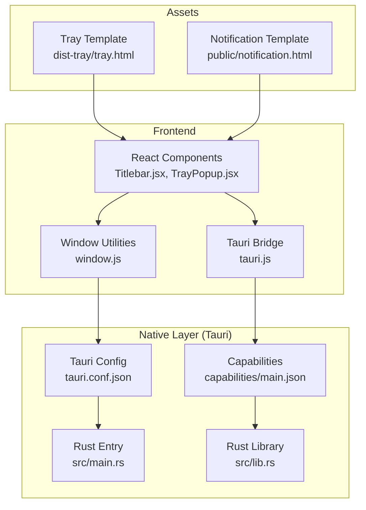
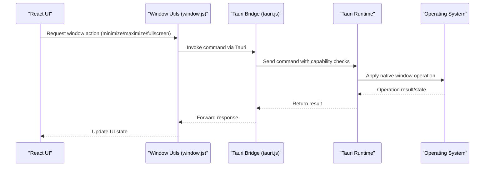
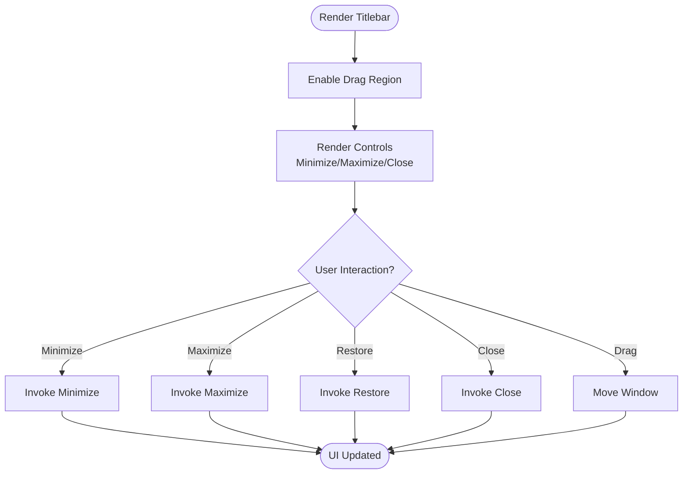
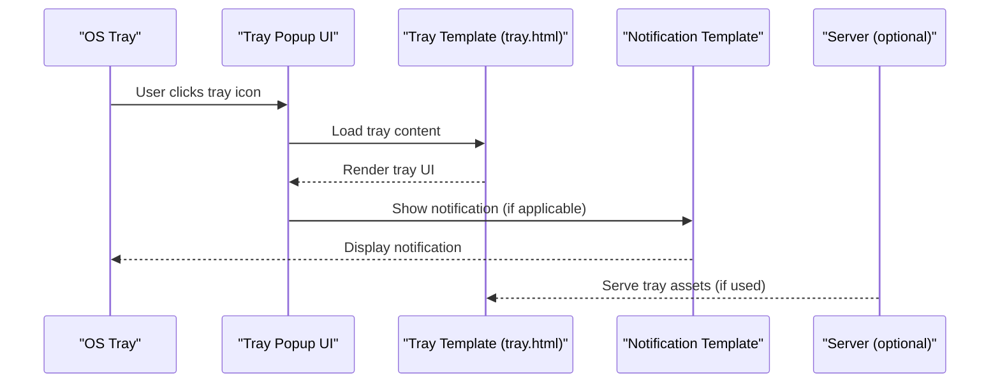
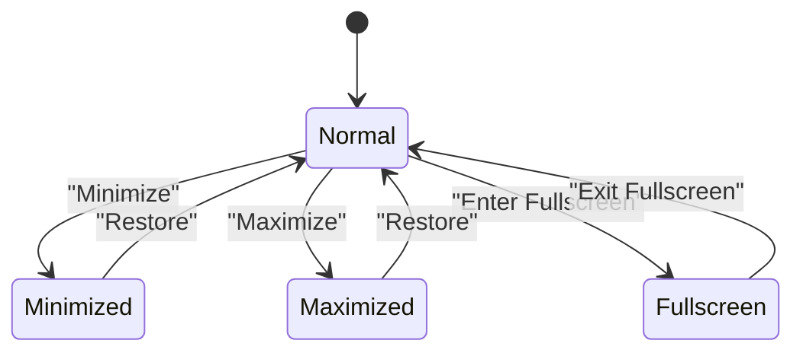
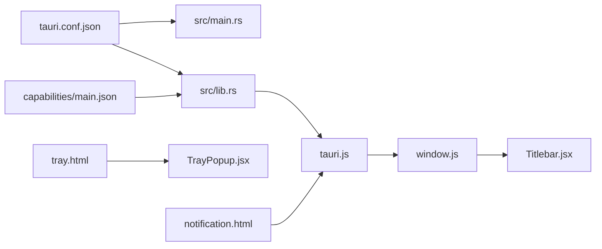

# Window Management & Native Integration

<cite>
**Referenced Files in This Document**
- [tauri.conf.json](file://src-tauri/tauri.conf.json)
- [main.rs](file://src-tauri/src/main.rs)
- [lib.rs](file://src-tauri/src/lib.rs)
- [main.json](file://src-tauri/capabilities/main.json)
- [window.js](file://src/lib/window.js)
- [tauri.js](file://src/lib/tauri.js)
- [Titlebar.jsx](file://src/components/Titlebar.jsx)
- [TrayPopup.jsx](file://src/pages/TrayPopup.jsx)
- [notification.html](file://public/notification.html)
- [tray.html](file://dist-tray/tray.html)
- [index.js](file://server/index.js)
</cite>

## Table of Contents
1. [Introduction](#introduction)
2. [Project Structure](#project-structure)
3. [Core Components](#core-components)
4. [Architecture Overview](#architecture-overview)
5. [Detailed Component Analysis](#detailed-component-analysis)
6. [Dependency Analysis](#dependency-analysis)
7. [Performance Considerations](#performance-considerations)
8. [Troubleshooting Guide](#troubleshooting-guide)
9. [Conclusion](#conclusion)

## Introduction
This document explains the window management and native operating system integration features in SBGames. It covers the main window configuration, titlebar implementation, system tray and notifications, file associations, capability-based permissions, window state management, and cross-platform behaviors across Windows, macOS, and Linux. The implementation leverages Tauri for native capabilities and React for the frontend UI.

## Project Structure
The window and native integration features span several areas:
- Backend (Tauri): Rust application entry points, configuration, and capabilities
- Frontend: React components for window controls, tray popup, and window utilities
- Public assets: Tray and notification HTML templates
- Server: Optional backend service for file serving and distribution

**Diagram sources**
- [tauri.conf.json](file://src-tauri/tauri.conf.json)
- [main.json](file://src-tauri/capabilities/main.json)
- [main.rs](file://src-tauri/src/main.rs)
- [lib.rs](file://src-tauri/src/lib.rs)
- [window.js](file://src/lib/window.js)
- [tauri.js](file://src/lib/tauri.js)
- [Titlebar.jsx](file://src/components/Titlebar.jsx)
- [TrayPopup.jsx](file://src/pages/TrayPopup.jsx)
- [tray.html](file://dist-tray/tray.html)
- [notification.html](file://public/notification.html)

**Section sources**
- [tauri.conf.json](file://src-tauri/tauri.conf.json)
- [main.rs](file://src-tauri/src/main.rs)
- [lib.rs](file://src-tauri/src/lib.rs)
- [main.json](file://src-tauri/capabilities/main.json)
- [window.js](file://src/lib/window.js)
- [tauri.js](file://src/lib/tauri.js)
- [Titlebar.jsx](file://src/components/Titlebar.jsx)
- [TrayPopup.jsx](file://src/pages/TrayPopup.jsx)
- [tray.html](file://dist-tray/tray.html)
- [notification.html](file://public/notification.html)

## Core Components
- Main window configuration and policies are defined in the Tauri configuration, including window size constraints, initial position, and behavior flags.
- The frontend exposes window utilities for state transitions and interactions via a JavaScript bridge.
- Titlebar controls provide custom drag regions and minimize/close actions.
- System tray integrates with a dedicated tray template and popup UI.
- Notifications use a static HTML template rendered by the native layer.
- Capability files define what the frontend can invoke from the backend safely.
- Cross-platform differences are handled through Tauri's platform abstractions.

**Section sources**
- [tauri.conf.json](file://src-tauri/tauri.conf.json)
- [window.js](file://src/lib/window.js)
- [tauri.js](file://src/lib/tauri.js)
- [Titlebar.jsx](file://src/components/Titlebar.jsx)
- [TrayPopup.jsx](file://src/pages/TrayPopup.jsx)
- [main.json](file://src-tauri/capabilities/main.json)

## Architecture Overview
The window and native integration architecture combines a React frontend with a Tauri backend. The frontend communicates with the native layer through a typed bridge, while Tauri enforces capability-based permissions and applies platform-specific behaviors.

**Diagram sources**
- [window.js](file://src/lib/window.js)
- [tauri.js](file://src/lib/tauri.js)
- [main.rs](file://src-tauri/src/main.rs)
- [lib.rs](file://src-tauri/src/lib.rs)

## Detailed Component Analysis

### Main Window Configuration
The main window properties, size constraints, and initial behavior are configured in the Tauri configuration. This includes:
- Initial window size and minimum/maximum bounds
- Centered or fixed-position placement
- Decorations and frameless options
- Focus behavior and always-on-top settings
- Menu and context menu policies
- File drop handling and drag-and-drop support

These settings are loaded at runtime and applied when the main window is created.

**Section sources**
- [tauri.conf.json](file://src-tauri/tauri.conf.json)

### Titlebar Implementation
The titlebar component provides:
- Custom drag region spanning the top of the window
- Minimize, maximize/restore, and close controls
- Responsive layout adjustments for different window states
- Platform-aware styling to match native titlebars

Drag regions enable moving the window by dragging the titlebar area, while button controls trigger native window operations through the bridge.

**Diagram sources**
- [Titlebar.jsx](file://src/components/Titlebar.jsx)
- [window.js](file://src/lib/window.js)

**Section sources**
- [Titlebar.jsx](file://src/components/Titlebar.jsx)
- [window.js](file://src/lib/window.js)

### System Tray Functionality
The system tray integrates with:
- A tray template HTML for rendering tray content
- A popup UI for tray interactions
- Native notifications using a notification template
- Optional server-side file serving for tray assets

The tray popup UI is presented when interacting with the tray icon, and notifications are shown via the notification template.

**Diagram sources**
- [TrayPopup.jsx](file://src/pages/TrayPopup.jsx)
- [tray.html](file://dist-tray/tray.html)
- [notification.html](file://public/notification.html)
- [index.js](file://server/index.js)

**Section sources**
- [TrayPopup.jsx](file://src/pages/TrayPopup.jsx)
- [tray.html](file://dist-tray/tray.html)
- [notification.html](file://public/notification.html)
- [index.js](file://server/index.js)

### Capability System
The capability system defines what the frontend can invoke from the backend. It restricts commands and APIs to prevent unauthorized access and ensures safe operation across platforms. The main capability file governs the default set of allowed operations.

Key aspects:
- Command allowlisting for backend invocations
- Scope restrictions for filesystem and network access
- Policy enforcement at runtime

**Section sources**
- [main.json](file://src-tauri/capabilities/main.json)

### Window State Management
Window state transitions include:
- Minimize: Hide the window or move to system tray depending on configuration
- Maximize/Restore: Toggle between maximized and restored states
- Fullscreen: Enter or exit fullscreen mode
- Focus and activation: Bring window to foreground

The frontend triggers these operations through the window utilities, which delegate to Tauri commands enforced by capabilities.

**Diagram sources**
- [window.js](file://src/lib/window.js)
- [tauri.js](file://src/lib/tauri.js)

**Section sources**
- [window.js](file://src/lib/window.js)
- [tauri.js](file://src/lib/tauri.js)

### Clipboard Integration
Clipboard operations are exposed through the Tauri bridge and guarded by capabilities. Typical operations include:
- Copy/paste text
- Copy/paste files (paths)
- Clear clipboard

Frontend components can request clipboard actions, which are executed natively and return results through the bridge.

**Section sources**
- [tauri.js](file://src/lib/tauri.js)
- [main.json](file://src-tauri/capabilities/main.json)

### Drag-and-Drop Functionality
Drag-and-drop support is configured in the main window settings and can be extended via custom handlers. The implementation typically involves:
- Enabling drop zones in the UI
- Handling drag events and extracting data
- Invoking backend operations for file processing

Frontend components coordinate with the window utilities to manage drag targets and data transfer.

**Section sources**
- [tauri.conf.json](file://src-tauri/tauri.conf.json)
- [window.js](file://src/lib/window.js)

### Desktop Environment Integration
Platform-specific behaviors are handled by Tauri:
- Windows: Taskbar grouping, jump lists, and system notifications
- macOS: Titlebar appearance, traffic light buttons, and dock integration
- Linux: GTK/Qt themes, system tray compliance, and notification daemons

These integrations are transparent to the frontend and controlled by Tauri configuration and capabilities.

**Section sources**
- [tauri.conf.json](file://src-tauri/tauri.conf.json)

## Dependency Analysis
The window and native integration features depend on:
- Tauri configuration for window policy and capabilities
- Rust entry points for native initialization and event handling
- Frontend libraries for bridging and UI composition
- Static assets for tray and notification rendering

**Diagram sources**
- [tauri.conf.json](file://src-tauri/tauri.conf.json)
- [main.rs](file://src-tauri/src/main.rs)
- [lib.rs](file://src-tauri/src/lib.rs)
- [main.json](file://src-tauri/capabilities/main.json)
- [tauri.js](file://src/lib/tauri.js)
- [window.js](file://src/lib/window.js)
- [Titlebar.jsx](file://src/components/Titlebar.jsx)
- [TrayPopup.jsx](file://src/pages/TrayPopup.jsx)
- [tray.html](file://dist-tray/tray.html)
- [notification.html](file://public/notification.html)

**Section sources**
- [tauri.conf.json](file://src-tauri/tauri.conf.json)
- [main.rs](file://src-tauri/src/main.rs)
- [lib.rs](file://src-tauri/src/lib.rs)
- [main.json](file://src-tauri/capabilities/main.json)
- [tauri.js](file://src/lib/tauri.js)
- [window.js](file://src/lib/window.js)
- [Titlebar.jsx](file://src/components/Titlebar.jsx)
- [TrayPopup.jsx](file://src/pages/TrayPopup.jsx)
- [tray.html](file://dist-tray/tray.html)
- [notification.html](file://public/notification.html)

## Performance Considerations
- Keep window operations synchronous where possible to avoid UI jank.
- Debounce frequent resize/move events to reduce unnecessary native calls.
- Use capability-scoped commands to minimize overhead and improve security.
- Cache static tray and notification templates to reduce asset loading delays.

## Troubleshooting Guide
Common issues and resolutions:
- Window does not move when dragging: Verify drag region is enabled and covers the titlebar area.
- Minimize/restore actions fail: Confirm capability allows window state commands and platform supports the operation.
- Tray popup not appearing: Ensure tray template exists and server serves assets if used.
- Notifications not visible: Check notification template and platform notification permissions.
- Clipboard errors: Validate capability grants clipboard access and handle permission prompts.

**Section sources**
- [tauri.conf.json](file://src-tauri/tauri.conf.json)
- [main.json](file://src-tauri/capabilities/main.json)
- [window.js](file://src/lib/window.js)
- [tauri.js](file://src/lib/tauri.js)
- [TrayPopup.jsx](file://src/pages/TrayPopup.jsx)
- [tray.html](file://dist-tray/tray.html)
- [notification.html](file://public/notification.html)

## Conclusion
SBGames integrates robust window management and native OS features through Tauri. The configuration-driven approach ensures consistent behavior across platforms, while the capability system maintains security. The frontend components provide intuitive controls for window state, titlebar interactions, tray operations, and notifications, delivering a polished desktop experience.