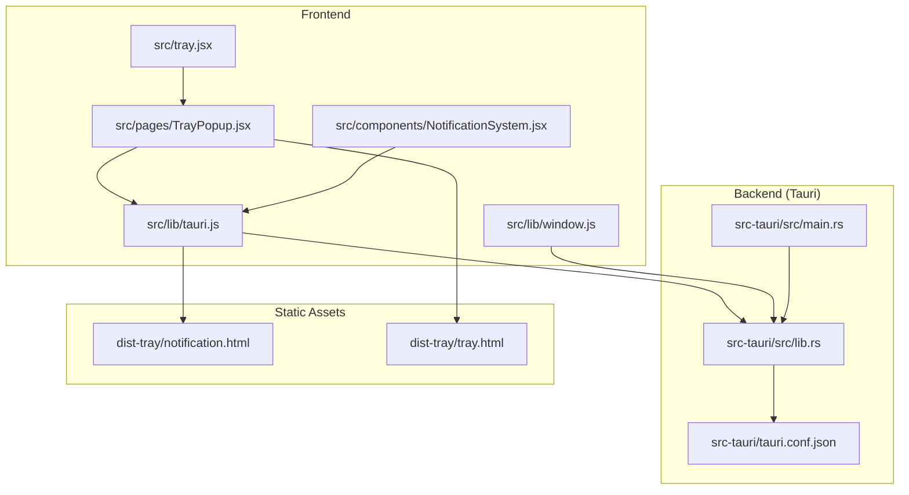
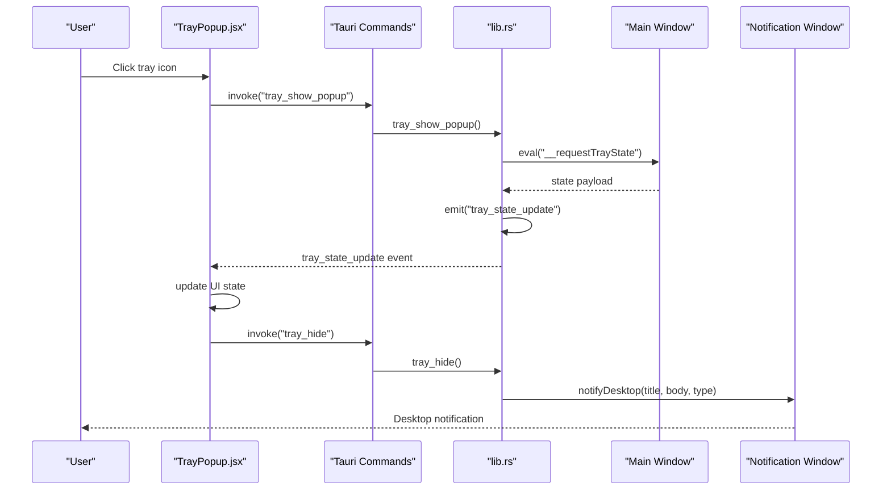
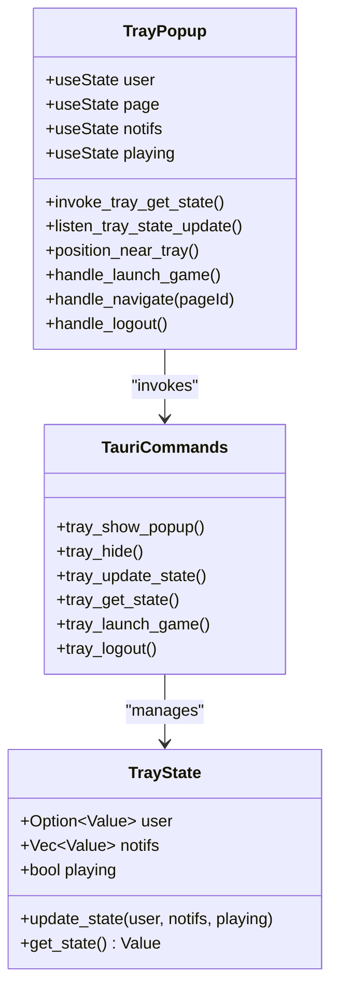
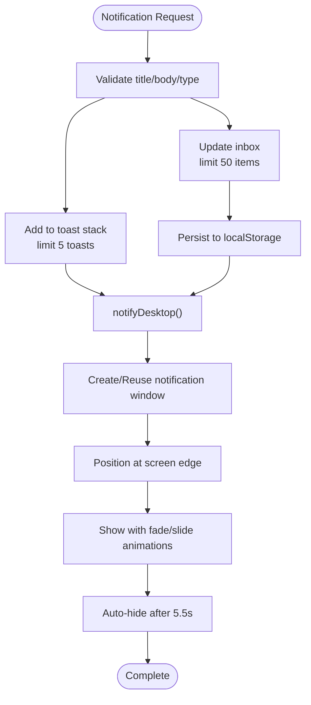
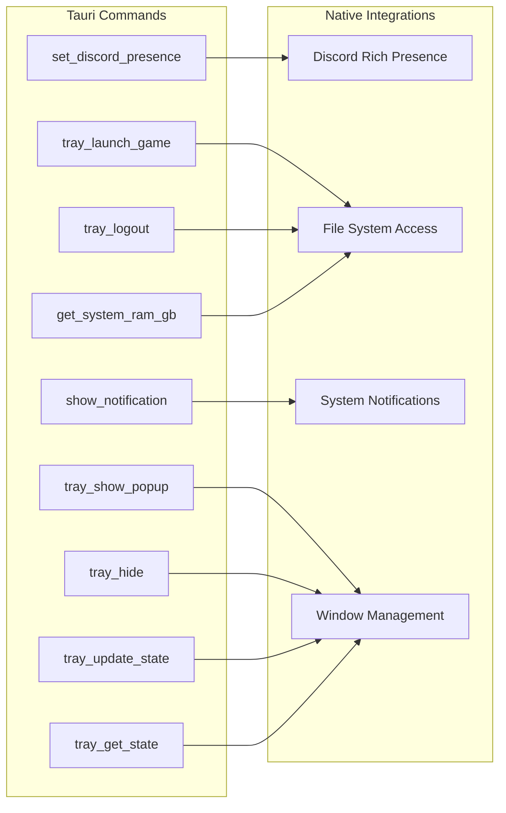
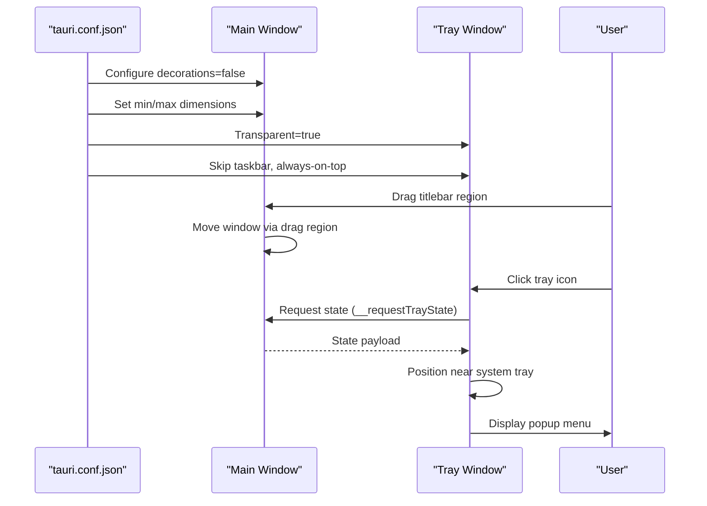
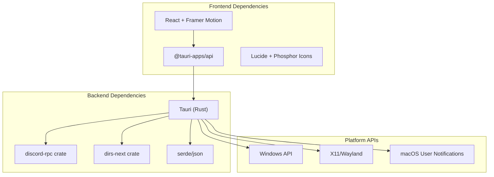

# Desktop Integration Features

<cite>
**Referenced Files in This Document**
- [tray.jsx](file://src/tray.jsx)
- [TrayPopup.jsx](file://src/pages/TrayPopup.jsx)
- [NotificationSystem.jsx](file://src/components/NotificationSystem.jsx)
- [tauri.js](file://src/lib/tauri.js)
- [window.js](file://src/lib/window.js)
- [lib.rs](file://src-tauri/src/lib.rs)
- [tauri.conf.json](file://src-tauri/tauri.conf.json)
- [notification.html](file://dist-tray/notification.html)
- [tray.html](file://dist-tray/tray.html)
- [main.rs](file://src-tauri/src/main.rs)
</cite>

## Table of Contents
1. [Introduction](#introduction)
2. [Project Structure](#project-structure)
3. [Core Components](#core-components)
4. [Architecture Overview](#architecture-overview)
5. [Detailed Component Analysis](#detailed-component-analysis)
6. [Dependency Analysis](#dependency-analysis)
7. [Performance Considerations](#performance-considerations)
8. [Troubleshooting Guide](#troubleshooting-guide)
9. [Conclusion](#conclusion)

## Introduction
This document provides comprehensive documentation for the desktop integration features of the SBGames launcher, focusing on system tray functionality, desktop notifications, and native OS integration via Tauri. It covers the tray application architecture with popup menus and quick actions, the notification system for real-time updates and user alerts, the Tauri plugin architecture for accessing native OS features, and window management features including custom titlebars and multi-window support. Platform-specific behaviors for Windows, macOS, and Linux are addressed, along with examples of custom desktop integrations and extension points.

## Project Structure
The desktop integration spans both the frontend React application and the Tauri backend written in Rust. The frontend handles UI rendering, event handling, and window positioning, while the backend manages system tray integration, command dispatch, and native OS features.

**Diagram sources**
- [tray.jsx:1-7](file://src/tray.jsx#L1-L7)
- [TrayPopup.jsx:1-239](file://src/pages/TrayPopup.jsx#L1-L239)
- [NotificationSystem.jsx:1-382](file://src/components/NotificationSystem.jsx#L1-L382)
- [tauri.js:1-101](file://src/lib/tauri.js#L1-L101)
- [window.js:1-17](file://src/lib/window.js#L1-L17)
- [main.rs:1-7](file://src-tauri/src/main.rs#L1-L7)
- [lib.rs:1-800](file://src-tauri/src/lib.rs#L1-L800)
- [tauri.conf.json:1-89](file://src-tauri/tauri.conf.json#L1-L89)
- [notification.html:1-250](file://dist-tray/notification.html#L1-L250)
- [tray.html:1-14](file://dist-tray/tray.html#L1-L14)

**Section sources**
- [tray.jsx:1-7](file://src/tray.jsx#L1-L7)
- [tauri.conf.json:1-89](file://src-tauri/tauri.conf.json#L1-L89)

## Core Components
- Tray Popup UI: A React-based overlay window positioned near the system tray, providing quick navigation, user information, and game launch controls.
- Notification System: A dual-layer system combining in-app toast notifications and native desktop notifications delivered via a dedicated webview window.
- Tauri Backend: Rust-based commands and state management for tray integration, window control, and native OS feature access.
- Window Utilities: Frontend helpers for minimizing, maximizing, and closing the main application window.

**Section sources**
- [TrayPopup.jsx:1-239](file://src/pages/TrayPopup.jsx#L1-L239)
- [NotificationSystem.jsx:1-382](file://src/components/NotificationSystem.jsx#L1-L382)
- [tauri.js:1-101](file://src/lib/tauri.js#L1-L101)
- [window.js:1-17](file://src/lib/window.js#L1-L17)
- [lib.rs:2142-2283](file://src-tauri/src/lib.rs#L2142-L2283)

## Architecture Overview
The desktop integration architecture leverages Tauri's multi-window capability and event-driven IPC to synchronize state between the main application and the tray popup. The notification system uses a dedicated webview window for native-style desktop notifications, while the frontend provides animated toast overlays for immediate feedback.

**Diagram sources**
- [TrayPopup.jsx:21-40](file://src/pages/TrayPopup.jsx#L21-L40)
- [lib.rs:2179-2198](file://src-tauri/src/lib.rs#L2179-L2198)
- [tauri.js:19-84](file://src/lib/tauri.js#L19-L84)

## Detailed Component Analysis

### Tray Application Architecture
The tray popup is a dedicated webview window designed to appear near the system tray area. It synchronizes state with the main application and provides quick actions for navigation, user management, and game launching.

**Diagram sources**
- [TrayPopup.jsx:15-78](file://src/pages/TrayPopup.jsx#L15-L78)
- [lib.rs:2142-2283](file://src-tauri/src/lib.rs#L2142-L2283)

Key features:
- State synchronization via IPC events
- Positioning logic for optimal tray proximity
- Quick action buttons for common tasks
- Navigation integration with the main application

**Section sources**
- [TrayPopup.jsx:1-239](file://src/pages/TrayPopup.jsx#L1-L239)
- [lib.rs:2142-2283](file://src-tauri/src/lib.rs#L2142-L2283)

### Notification System
The notification system combines in-app toasts with native desktop notifications. It maintains a persistent inbox in local storage and supports multiple notification types with distinct visual treatments.

**Diagram sources**
- [NotificationSystem.jsx:37-52](file://src/components/NotificationSystem.jsx#L37-L52)
- [tauri.js:19-84](file://src/lib/tauri.js#L19-L84)
- [notification.html:149-247](file://dist-tray/notification.html#L149-L247)

Implementation highlights:
- Animated toast stack with progress indicators
- Persistent notification inbox with unread counters
- Native desktop notifications via dedicated webview window
- Type-specific styling and icons

**Section sources**
- [NotificationSystem.jsx:1-382](file://src/components/NotificationSystem.jsx#L1-L382)
- [tauri.js:1-101](file://src/lib/tauri.js#L1-L101)
- [notification.html:1-250](file://dist-tray/notification.html#L1-L250)

### Tauri Plugin Architecture
The backend provides a comprehensive set of commands for desktop integration, including tray management, window control, and native OS feature access.

**Diagram sources**
- [lib.rs:140-231](file://src-tauri/src/lib.rs#L140-L231)
- [lib.rs:319-329](file://src-tauri/src/lib.rs#L319-L329)

Key capabilities:
- Tray state management and IPC synchronization
- System notification delivery via tauri-plugin-notification
- Discord Rich Presence integration
- Cross-platform window management
- Security-focused process validation

**Section sources**
- [lib.rs:140-231](file://src-tauri/src/lib.rs#L140-L231)
- [lib.rs:319-329](file://src-tauri/src/lib.rs#L319-L329)

### Window Management Features
The application supports custom titlebars, drag regions, and multi-window coordination for seamless desktop integration.

**Diagram sources**
- [tauri.conf.json:14-45](file://src-tauri/tauri.conf.json#L14-L45)
- [TrayPopup.jsx:42-59](file://src/pages/TrayPopup.jsx#L42-L59)

Features:
- Custom titlebar without OS decorations
- Multi-window support with dedicated tray window
- Drag region implementation for custom titlebars
- Platform-aware positioning near system tray

**Section sources**
- [tauri.conf.json:14-45](file://src-tauri/tauri.conf.json#L14-L45)
- [TrayPopup.jsx:42-59](file://src/pages/TrayPopup.jsx#L42-L59)

### Platform-Specific Behaviors
The application implements platform-specific optimizations and security measures:

Windows:
- DLL protection and module scanning
- Windows Subsystem configuration
- Tray positioning optimized for Windows taskbar

Linux:
- LD_PRELOAD detection and prevention
- Module scanning for injection attempts
- AppImage bundle support

macOS:
- Entitlements configuration
- Minimum system version enforcement
- Native notification integration

**Section sources**
- [lib.rs:18-93](file://src-tauri/src/lib.rs#L18-L93)
- [lib.rs:58-56](file://src-tauri/src/lib.rs#L58-L56)
- [tauri.conf.json:66-81](file://src-tauri/tauri.conf.json#L66-L81)

## Dependency Analysis
The desktop integration relies on several key dependencies and their interactions:

**Diagram sources**
- [lib.rs:3-10](file://src-tauri/src/lib.rs#L3-L10)
- [tauri.js:22-23](file://src/lib/tauri.js#L22-L23)

**Section sources**
- [lib.rs:1-800](file://src-tauri/src/lib.rs#L1-L800)
- [tauri.js:1-101](file://src/lib/tauri.js#L1-L101)

## Performance Considerations
- Window positioning uses device pixel ratio awareness for crisp rendering across displays
- Notification windows are reused to minimize resource overhead
- Toast animations use hardware-accelerated CSS properties
- Local storage persistence limits prevent excessive memory usage
- Tauri command invocation is asynchronous to maintain UI responsiveness

## Troubleshooting Guide
Common issues and solutions:

**Tray popup not appearing:**
- Verify tray window configuration in tauri.conf.json
- Check that tray_show_popup command executes successfully
- Ensure __requestTrayState is properly defined in the main window

**Notifications not displaying:**
- Confirm notification.html is accessible and properly built
- Verify WebviewWindow creation permissions
- Check monitor scaling factor calculations

**IPC communication failures:**
- Validate command registration in Tauri configuration
- Ensure proper event listener cleanup in React components
- Check for CORS policy restrictions on notification.html

**Section sources**
- [lib.rs:2179-2198](file://src-tauri/src/lib.rs#L2179-L2198)
- [tauri.js:38-84](file://src/lib/tauri.js#L38-L84)
- [tauri.conf.json:46-49](file://src-tauri/tauri.conf.json#L46-L49)

## Conclusion
The SBGames desktop integration provides a robust, cross-platform solution for system tray functionality, real-time notifications, and native OS feature access. The architecture balances frontend interactivity with backend reliability, offering extensible integration points for future enhancements. The combination of custom UI components, Tauri's multi-window capabilities, and platform-specific optimizations delivers a polished desktop experience across Windows, macOS, and Linux platforms.