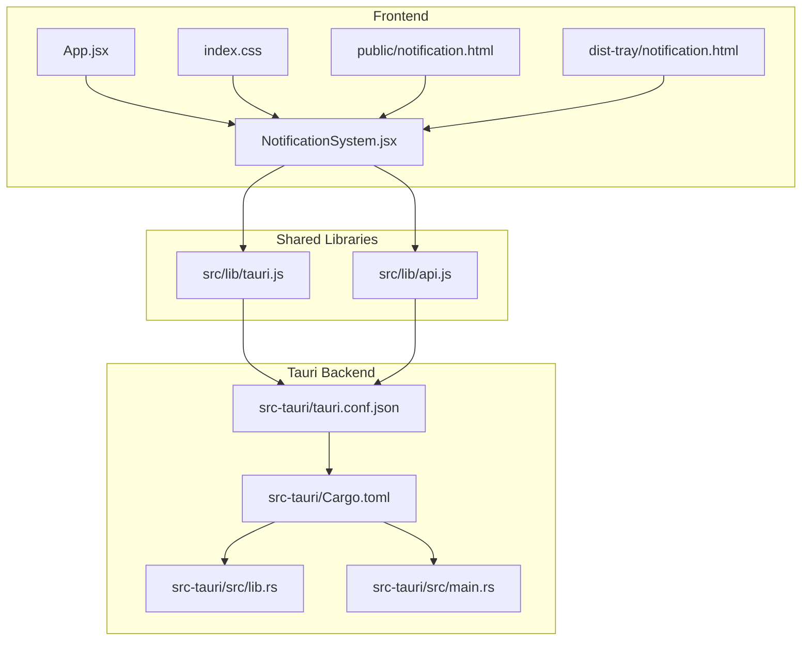
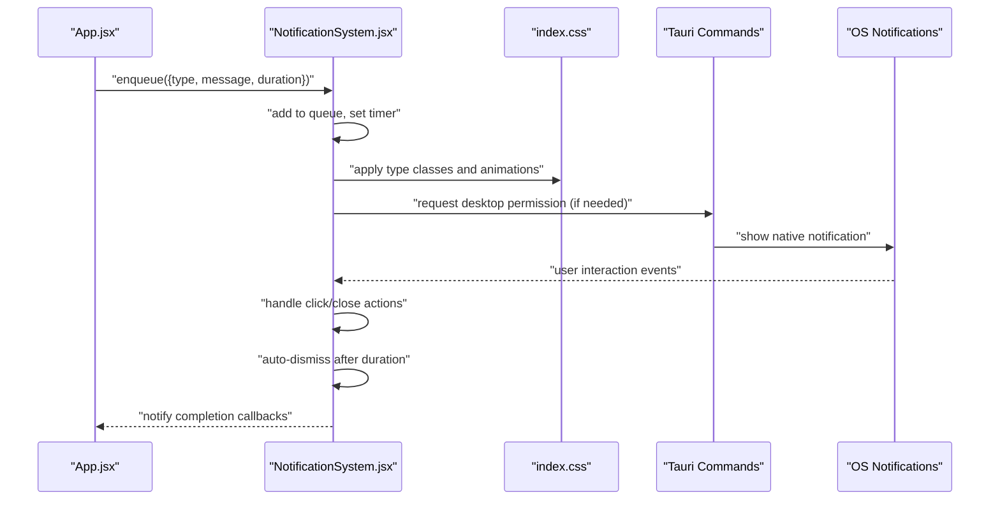
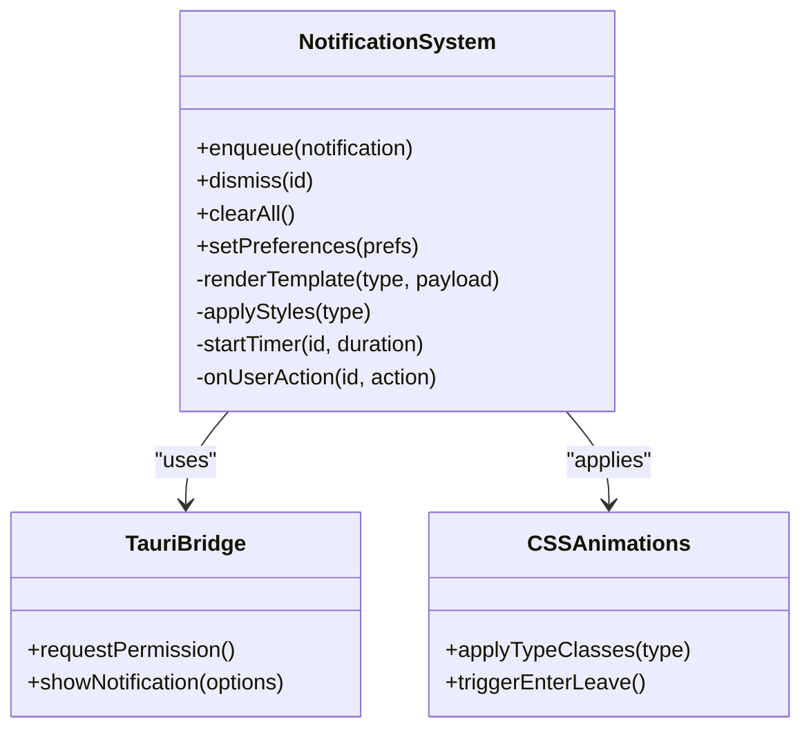
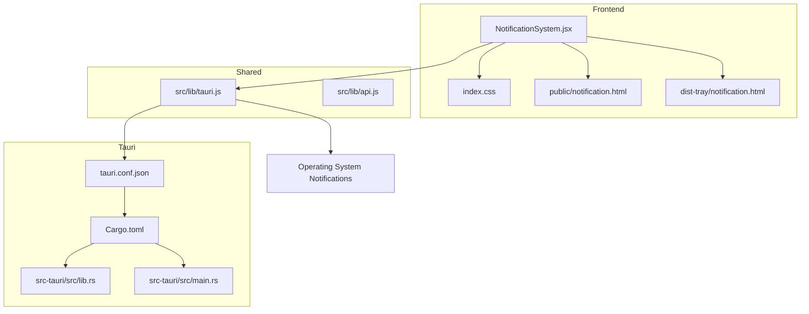
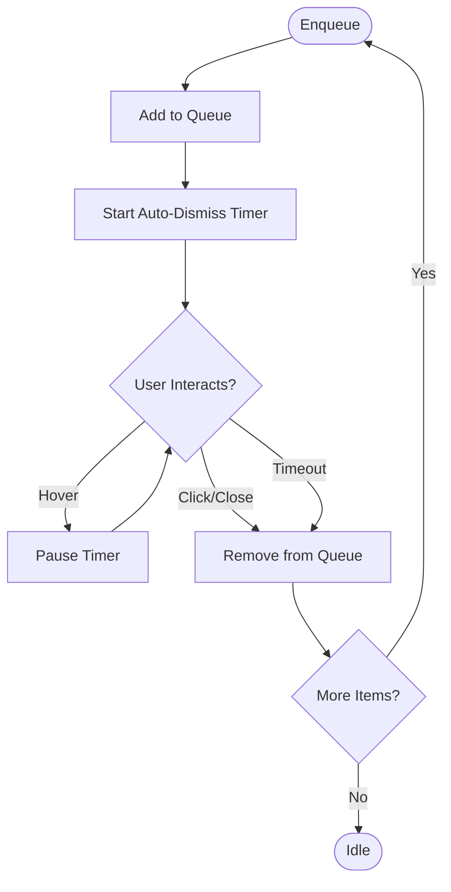
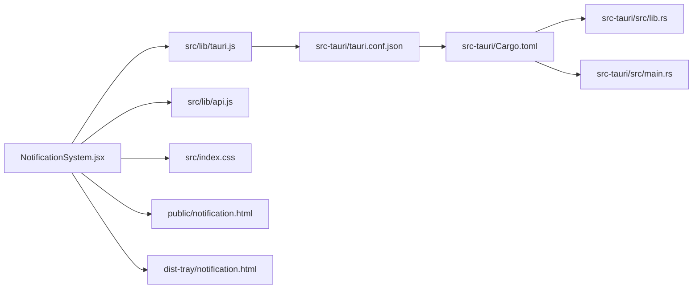

# Desktop Notifications

<cite>
**Referenced Files in This Document**
- [NotificationSystem.jsx](file://src/components/NotificationSystem.jsx)
- [notification.html](file://public/notification.html)
- [notification.html](file://dist-tray/notification.html)
- [tauri.js](file://src/lib/tauri.js)
- [api.js](file://src/lib/api.js)
- [index.css](file://src/index.css)
- [App.jsx](file://src/App.jsx)
- [tauri.conf.json](file://src-tauri/tauri.conf.json)
- [Cargo.toml](file://src-tauri/Cargo.toml)
- [lib.rs](file://src-tauri/src/lib.rs)
- [main.rs](file://src-tauri/src/main.rs)
- [TrayPopup.jsx](file://src/pages/TrayPopup.jsx)
- [tray.html](file://tray.html)
</cite>

## Table of Contents
1. [Introduction](#introduction)
2. [Project Structure](#project-structure)
3. [Core Components](#core-components)
4. [Architecture Overview](#architecture-overview)
5. [Detailed Component Analysis](#detailed-component-analysis)
6. [Dependency Analysis](#dependency-analysis)
7. [Performance Considerations](#performance-considerations)
8. [Troubleshooting Guide](#troubleshooting-guide)
9. [Conclusion](#conclusion)

## Introduction
This document describes the desktop notification system used in the SBGames application. It covers how notifications are triggered, displayed, queued, and dismissed automatically. It also documents the integration with Tauri, notification types, timing controls, user preferences, HTML templates, CSS styling, animations, programmatic triggers, custom components, persistence, permissions, platform-specific behaviors, and accessibility considerations.

## Project Structure
The notification system spans frontend React components, shared libraries, and Tauri backend integrations:
- Frontend React component for managing notifications
- Shared Tauri API utilities
- Public and distribution HTML templates for notification rendering
- Global CSS for styling and animations
- Tauri configuration and backend modules enabling native capabilities

**Diagram sources**
- [NotificationSystem.jsx](file://src/components/NotificationSystem.jsx)
- [tauri.js](file://src/lib/tauri.js)
- [api.js](file://src/lib/api.js)
- [index.css](file://src/index.css)
- [notification.html](file://public/notification.html)
- [notification.html](file://dist-tray/notification.html)
- [tauri.conf.json](file://src-tauri/tauri.conf.json)
- [Cargo.toml](file://src-tauri/Cargo.toml)
- [lib.rs](file://src-tauri/src/lib.rs)
- [main.rs](file://src-tauri/src/main.rs)

**Section sources**
- [NotificationSystem.jsx](file://src/components/NotificationSystem.jsx)
- [tauri.js](file://src/lib/tauri.js)
- [api.js](file://src/lib/api.js)
- [index.css](file://src/index.css)
- [notification.html](file://public/notification.html)
- [notification.html](file://dist-tray/notification.html)
- [tauri.conf.json](file://src-tauri/tauri.conf.json)
- [Cargo.toml](file://src-tauri/Cargo.toml)
- [lib.rs](file://src-tauri/src/lib.rs)
- [main.rs](file://src-tauri/src/main.rs)

## Core Components
- NotificationSystem.jsx: Central React component that manages notification state, queue, auto-dismiss timers, and user interactions. It exposes programmatic APIs to enqueue notifications and supports multiple types (success, error, info, warning).
- tauri.js: Shared library providing Tauri command wrappers and event handling for desktop-native features.
- api.js: Shared library for higher-level API interactions that may trigger notifications.
- index.css: Styles and animations for notification appearance and transitions.
- notification.html (public and dist-tray): Standalone HTML templates used to render notifications in isolated contexts (e.g., tray or external windows).
- Tauri configuration and backend modules: Enable permissions and capabilities required for desktop notifications.

Key responsibilities:
- Triggering notifications via programmatic calls
- Managing a FIFO queue with type-based styling and timing
- Auto-dismiss after configurable durations
- User interaction handlers (click, close)
- Persistence across sessions (if configured)
- Accessibility-compliant markup and keyboard navigation

**Section sources**
- [NotificationSystem.jsx](file://src/components/NotificationSystem.jsx)
- [tauri.js](file://src/lib/tauri.js)
- [api.js](file://src/lib/api.js)
- [index.css](file://src/index.css)
- [notification.html](file://public/notification.html)
- [notification.html](file://dist-tray/notification.html)
- [tauri.conf.json](file://src-tauri/tauri.conf.json)

## Architecture Overview
The notification pipeline integrates frontend React components with Tauri commands and native OS capabilities. The system supports:
- Programmatic triggers from application logic
- Queue management and auto-dismiss
- Type-based styling and animations
- Tray and main window rendering via dedicated HTML templates
- Optional persistence and user preferences

**Diagram sources**
- [NotificationSystem.jsx](file://src/components/NotificationSystem.jsx)
- [tauri.js](file://src/lib/tauri.js)
- [index.css](file://src/index.css)
- [tauri.conf.json](file://src-tauri/tauri.conf.json)

## Detailed Component Analysis

### NotificationSystem.jsx
Responsibilities:
- Maintains an internal queue of pending notifications
- Applies type-specific styling and animations
- Sets auto-dismiss timers per notification
- Handles user interactions (click, close)
- Integrates with Tauri for permission checks and native OS notifications
- Supports persistence and user preferences (e.g., max visible, auto-dismiss duration)

Implementation highlights:
- Enqueue method accepts notification descriptors with type, message, and optional duration
- Uses CSS classes mapped to notification types for styling and animations
- Manages timers to auto-remove notifications after their duration elapses
- Emits events for click and close actions to application logic
- Persists queue state across sessions if enabled by configuration

**Diagram sources**
- [NotificationSystem.jsx](file://src/components/NotificationSystem.jsx)
- [tauri.js](file://src/lib/tauri.js)
- [index.css](file://src/index.css)

**Section sources**
- [NotificationSystem.jsx](file://src/components/NotificationSystem.jsx)
- [tauri.js](file://src/lib/tauri.js)
- [index.css](file://src/index.css)

### HTML Templates for Notifications
Two templates are provided for rendering notifications outside the main app context:
- public/notification.html: Template for standard web/desktop rendering
- dist-tray/notification.html: Template optimized for tray or external window contexts

Features:
- Minimal DOM structure suitable for programmatic updates
- Pre-styled containers for different notification types
- Accessibility-ready markup (labels, roles, focusable elements)

Usage:
- Loaded as standalone pages to render notifications independently
- Updated dynamically by NotificationSystem.jsx via injected content or messaging

**Section sources**
- [notification.html](file://public/notification.html)
- [notification.html](file://dist-tray/notification.html)

### CSS Styling and Animations
Global styles define:
- Base layout and z-index stacking for overlays
- Type-specific color schemes and icons
- Enter/exit animations for smooth transitions
- Responsive sizing and alignment
- Focus management and keyboard navigation support

Animation flow:
- On enqueue, notifications animate into view
- On dismiss, they animate out
- Hover and focus states for interactive elements

**Section sources**
- [index.css](file://src/index.css)

### Tauri Integration
The system integrates with Tauri to:
- Request and check notification permissions
- Delegate native OS notification delivery
- Manage tray-specific rendering via tray.html and TrayPopup.jsx

Permissions and capabilities:
- Tauri configuration defines required permissions for desktop notifications
- Cargo.toml lists backend dependencies for native features
- Backend modules expose safe APIs for frontend consumption

**Section sources**
- [tauri.js](file://src/lib/tauri.js)
- [tauri.conf.json](file://src-tauri/tauri.conf.json)
- [Cargo.toml](file://src-tauri/Cargo.toml)
- [lib.rs](file://src-tauri/src/lib.rs)
- [main.rs](file://src-tauri/src/main.rs)
- [tray.html](file://tray.html)
- [TrayPopup.jsx](file://src/pages/TrayPopup.jsx)

## Architecture Overview
The notification system architecture connects frontend React components with Tauri commands and OS-level capabilities. It ensures consistent UX across platforms while leveraging native features for reliability and user trust.

**Diagram sources**
- [NotificationSystem.jsx](file://src/components/NotificationSystem.jsx)
- [tauri.js](file://src/lib/tauri.js)
- [api.js](file://src/lib/api.js)
- [index.css](file://src/index.css)
- [notification.html](file://public/notification.html)
- [notification.html](file://dist-tray/notification.html)
- [tauri.conf.json](file://src-tauri/tauri.conf.json)
- [Cargo.toml](file://src-tauri/Cargo.toml)
- [lib.rs](file://src-tauri/src/lib.rs)
- [main.rs](file://src-tauri/src/main.rs)

## Detailed Component Analysis

### Notification Triggers and Types
Supported notification types:
- Success: Used for positive outcomes and confirmations
- Error: Used for failures and critical issues
- Info: Used for informational messages
- Warning: Used for cautionary or advisory messages

Each type maps to:
- Distinct CSS classes for styling
- Optional icons or color accents
- Different auto-dismiss durations (configurable)

Programmatic triggers:
- Application logic calls enqueue with a descriptor containing type, message, and optional duration
- Queue management ensures ordering and prevents overflow

Auto-dismiss:
- Duration defaults vary by type
- Users can override via preferences
- Timers are cleared on hover or user interaction

**Section sources**
- [NotificationSystem.jsx](file://src/components/NotificationSystem.jsx)
- [index.css](file://src/index.css)

### Display Mechanisms and Templates
Templates:
- public/notification.html: Full-featured template for primary rendering
- dist-tray/notification.html: Lightweight template for tray or external windows

Rendering strategy:
- Notifications are appended to a designated container
- Content is updated programmatically
- Templates include placeholders for dynamic text and icons

Accessibility:
- Semantic markup with roles and labels
- Keyboard focus management
- Screen reader-friendly announcements

**Section sources**
- [notification.html](file://public/notification.html)
- [notification.html](file://dist-tray/notification.html)

### User Interaction Handling
Interactions supported:
- Click: Triggers callback actions (e.g., open related page, retry operation)
- Close: Immediately dismisses notification
- Hover: Pauses auto-dismiss timer
- Escape: Dismisses active notification via keyboard

Callbacks:
- Applications can register handlers for click events
- Handlers receive notification metadata and context
- Actions can navigate, update state, or trigger follow-up operations

**Section sources**
- [NotificationSystem.jsx](file://src/components/NotificationSystem.jsx)

### Notification Queue Management
Queue behavior:
- FIFO ordering preserves chronological precedence
- Max visible limit prevents UI clutter
- Priority types may influence placement
- Clear-all and dismiss-by-id operations

Persistence:
- Queue state can persist across sessions if configured
- Preferences include max visible count and auto-dismiss duration
- User toggles for enabling/disabling notifications

**Section sources**
- [NotificationSystem.jsx](file://src/components/NotificationSystem.jsx)

### Timing Controls and Auto-Dismiss
Timing configuration:
- Default durations per type (e.g., info shorter than error)
- Configurable overrides via user preferences
- Dynamic adjustments based on user interaction (hover pauses)

Auto-dismiss flow:

**Diagram sources**
- [NotificationSystem.jsx](file://src/components/NotificationSystem.jsx)

**Section sources**
- [NotificationSystem.jsx](file://src/components/NotificationSystem.jsx)

### Custom Notification Components
Customization points:
- Type-specific styling and icons
- Custom message formatting
- Action buttons and links
- Rich media content (images, progress indicators)

Integration:
- Components integrate with NotificationSystem.jsx via enqueue calls
- Templates support dynamic content injection
- Accessibility attributes are preserved

**Section sources**
- [NotificationSystem.jsx](file://src/components/NotificationSystem.jsx)
- [notification.html](file://public/notification.html)

### Notification Permissions and Platform Behaviors
Permissions:
- Tauri requests permission to show desktop notifications
- Permission state is checked before dispatching native notifications
- Users can revoke permissions at OS level

Platform differences:
- Windows/macOS/Linux handle notification layouts and actions differently
- Some platforms require explicit permission prompts
- Tray rendering differs between platforms

**Section sources**
- [tauri.js](file://src/lib/tauri.js)
- [tauri.conf.json](file://src-tauri/tauri.conf.json)

### Accessibility Considerations
Accessibility features:
- Semantic HTML and ARIA roles
- Keyboard navigation (focus, escape-to-close)
- Screen reader announcements
- Sufficient color contrast and readable fonts
- Reduced motion options if applicable

Testing:
- Verify tab order and focus visibility
- Confirm announcements without visual cues
- Validate color-blind friendly palettes

**Section sources**
- [index.css](file://src/index.css)
- [notification.html](file://public/notification.html)

## Dependency Analysis
Dependencies and relationships:
- NotificationSystem.jsx depends on tauri.js for native capabilities and api.js for higher-level operations
- CSS styling is centralized in index.css and applied conditionally by type
- Templates depend on NotificationSystem.jsx for dynamic updates
- Tauri configuration and backend modules enable OS-level features

**Diagram sources**
- [NotificationSystem.jsx](file://src/components/NotificationSystem.jsx)
- [tauri.js](file://src/lib/tauri.js)
- [api.js](file://src/lib/api.js)
- [index.css](file://src/index.css)
- [notification.html](file://public/notification.html)
- [notification.html](file://dist-tray/notification.html)
- [tauri.conf.json](file://src-tauri/tauri.conf.json)
- [Cargo.toml](file://src-tauri/Cargo.toml)
- [lib.rs](file://src-tauri/src/lib.rs)
- [main.rs](file://src-tauri/src/main.rs)

**Section sources**
- [NotificationSystem.jsx](file://src/components/NotificationSystem.jsx)
- [tauri.js](file://src/lib/tauri.js)
- [api.js](file://src/lib/api.js)
- [index.css](file://src/index.css)
- [notification.html](file://public/notification.html)
- [notification.html](file://dist-tray/notification.html)
- [tauri.conf.json](file://src-tauri/tauri.conf.json)
- [Cargo.toml](file://src-tauri/Cargo.toml)
- [lib.rs](file://src-tauri/src/lib.rs)
- [main.rs](file://src-tauri/src/main.rs)

## Performance Considerations
- Keep queue sizes bounded to avoid memory pressure
- Debounce rapid enqueue calls to prevent UI thrashing
- Use efficient CSS transitions and avoid heavy animations on low-end devices
- Lazy-load rich content to minimize initial render cost
- Batch DOM updates when adding multiple notifications

## Troubleshooting Guide
Common issues and resolutions:
- Notifications not appearing:
  - Verify Tauri permissions are granted
  - Check OS-level notification settings
  - Confirm template paths are correct
- Auto-dismiss not working:
  - Inspect timer lifecycle and pause-on-hover logic
  - Validate duration preferences
- Styling inconsistencies:
  - Ensure CSS classes match notification types
  - Confirm global styles are loaded
- Tray rendering problems:
  - Validate tray.html and TrayPopup.jsx integration
  - Check platform-specific tray behaviors

**Section sources**
- [NotificationSystem.jsx](file://src/components/NotificationSystem.jsx)
- [tauri.js](file://src/lib/tauri.js)
- [index.css](file://src/index.css)
- [tray.html](file://tray.html)
- [TrayPopup.jsx](file://src/pages/TrayPopup.jsx)

## Conclusion
The desktop notification system combines a React-driven frontend with Tauri-backed native capabilities to deliver reliable, accessible, and customizable notifications. It supports multiple types, queue management, auto-dismiss, user interactions, and platform-specific rendering. With proper configuration and adherence to accessibility guidelines, it provides a robust foundation for user communication across platforms.