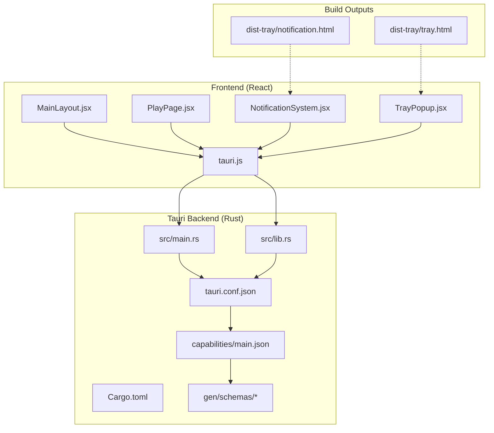
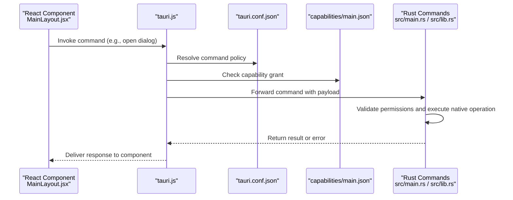
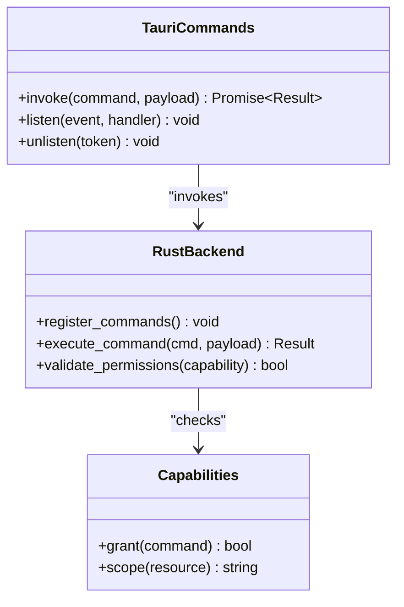
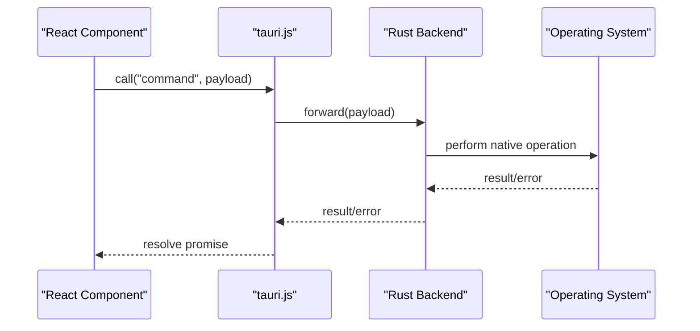
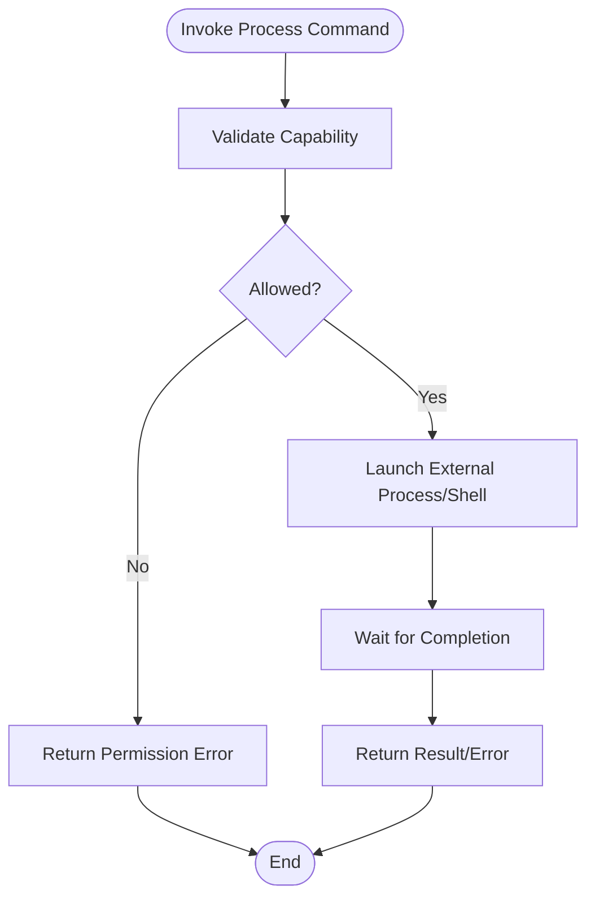
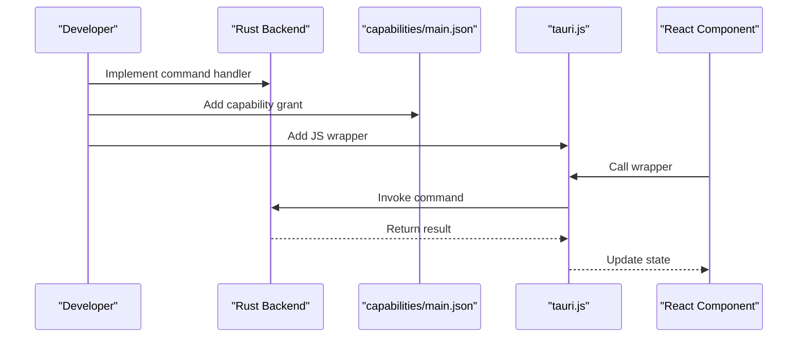
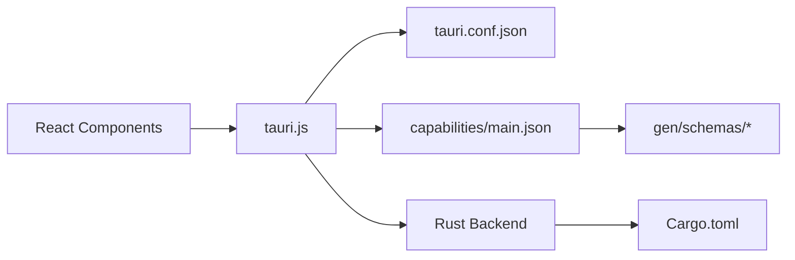

# Native OS Integration

<cite>
**Referenced Files in This Document**
- [src-tauri/src/main.rs](file://src-tauri/src/main.rs)
- [src-tauri/src/lib.rs](file://src-tauri/src/lib.rs)
- [src-tauri/Cargo.toml](file://src-tauri/Cargo.toml)
- [src-tauri/tauri.conf.json](file://src-tauri/tauri.conf.json)
- [src-tauri/capabilities/main.json](file://src-tauri/capabilities/main.json)
- [src-tauri/gen/schemas/capabilities.json](file://src-tauri/gen/schemas/capabilities.json)
- [src-tauri/gen/schemas/desktop-schema.json](file://src-tauri/gen/schemas/desktop-schema.json)
- [src-tauri/gen/schemas/windows-schema.json](file://src-tauri/gen/schemas/windows-schema.json)
- [src/lib/tauri.js](file://src/lib/tauri.js)
- [src/pages/MainLayout.jsx](file://src/pages/MainLayout.jsx)
- [src/pages/PlayPage.jsx](file://src/pages/PlayPage.jsx)
- [src/components/NotificationSystem.jsx](file://src/components/NotificationSystem.jsx)
- [src/pages/TrayPopup.jsx](file://src/pages/TrayPopup.jsx)
- [dist-tray/tray.html](file://dist-tray/tray.html)
- [dist-tray/notification.html](file://dist-tray/notification.html)
</cite>

## Table of Contents
1. [Introduction](#introduction)
2. [Project Structure](#project-structure)
3. [Core Components](#core-components)
4. [Architecture Overview](#architecture-overview)
5. [Detailed Component Analysis](#detailed-component-analysis)
6. [Dependency Analysis](#dependency-analysis)
7. [Performance Considerations](#performance-considerations)
8. [Troubleshooting Guide](#troubleshooting-guide)
9. [Conclusion](#conclusion)

## Introduction
This document explains how the SBGames project integrates with the native operating system through Tauri's plugin architecture. It focuses on the Tauri command system for accessing native OS features such as file system operations, clipboard access, system dialogs, and process management. The guide covers the Rust backend implementation, command definitions, JavaScript bridge integration, and practical examples for shell commands, external application launching, and system resource monitoring. It also addresses platform-specific capabilities, security considerations via capabilities and permissions, and performance optimization for native operations.

## Project Structure
The Tauri application is organized into a frontend React application and a Rust backend. The Tauri configuration and capability definitions live under the src-tauri directory, while the frontend resides under src. The build artifacts for tray and notification UIs are located under dist-tray.

**Diagram sources**
- [src-tauri/src/main.rs](file://src-tauri/src/main.rs)
- [src-tauri/src/lib.rs](file://src-tauri/src/lib.rs)
- [src-tauri/Cargo.toml](file://src-tauri/Cargo.toml)
- [src-tauri/tauri.conf.json](file://src-tauri/tauri.conf.json)
- [src-tauri/capabilities/main.json](file://src-tauri/capabilities/main.json)
- [src-tauri/gen/schemas/capabilities.json](file://src-tauri/gen/schemas/capabilities.json)
- [src-tauri/gen/schemas/desktop-schema.json](file://src-tauri/gen/schemas/desktop-schema.json)
- [src-tauri/gen/schemas/windows-schema.json](file://src-tauri/gen/schemas/windows-schema.json)
- [src/lib/tauri.js](file://src/lib/tauri.js)
- [src/pages/MainLayout.jsx](file://src/pages/MainLayout.jsx)
- [src/pages/PlayPage.jsx](file://src/pages/PlayPage.jsx)
- [src/components/NotificationSystem.jsx](file://src/components/NotificationSystem.jsx)
- [src/pages/TrayPopup.jsx](file://src/pages/TrayPopup.jsx)
- [dist-tray/tray.html](file://dist-tray/tray.html)
- [dist-tray/notification.html](file://dist-tray/notification.html)

**Section sources**
- [src-tauri/src/main.rs](file://src-tauri/src/main.rs)
- [src-tauri/src/lib.rs](file://src-tauri/src/lib.rs)
- [src-tauri/Cargo.toml](file://src-tauri/Cargo.toml)
- [src-tauri/tauri.conf.json](file://src-tauri/tauri.conf.json)
- [src-tauri/capabilities/main.json](file://src-tauri/capabilities/main.json)
- [src-tauri/gen/schemas/capabilities.json](file://src-tauri/gen/schemas/capabilities.json)
- [src-tauri/gen/schemas/desktop-schema.json](file://src-tauri/gen/schemas/desktop-schema.json)
- [src-tauri/gen/schemas/windows-schema.json](file://src-tauri/gen/schemas/windows-schema.json)
- [src/lib/tauri.js](file://src/lib/tauri.js)
- [src/pages/MainLayout.jsx](file://src/pages/MainLayout.jsx)
- [src/pages/PlayPage.jsx](file://src/pages/PlayPage.jsx)
- [src/components/NotificationSystem.jsx](file://src/components/NotificationSystem.jsx)
- [src/pages/TrayPopup.jsx](file://src/pages/TrayPopup.jsx)
- [dist-tray/tray.html](file://dist-tray/tray.html)
- [dist-tray/notification.html](file://dist-tray/notification.html)

## Core Components
- Tauri configuration defines the application metadata, security policies, bundling, and capabilities. It controls how the frontend interacts with the backend and which native APIs are exposed.
- Capabilities define the permission surface for commands and APIs. They restrict access to sensitive operations and ensure least privilege.
- The Rust backend exposes commands that the frontend invokes. These commands implement native OS integrations such as file system access, clipboard operations, dialogs, and process management.
- The JavaScript bridge (tauri.js) provides the API surface for the frontend to call Rust commands and receive responses.
- Tray and notification UIs are built as separate HTML outputs and integrated with the main application lifecycle.

Key implementation anchors:
- Backend entry points and command registration are defined in the Rust main and lib modules.
- Command definitions and capabilities are declared in tauri.conf.json and capabilities/main.json.
- Frontend integration occurs through tauri.js and page components.

**Section sources**
- [src-tauri/tauri.conf.json](file://src-tauri/tauri.conf.json)
- [src-tauri/capabilities/main.json](file://src-tauri/capabilities/main.json)
- [src-tauri/src/main.rs](file://src-tauri/src/main.rs)
- [src-tauri/src/lib.rs](file://src-tauri/src/lib.rs)
- [src/lib/tauri.js](file://src/lib/tauri.js)

## Architecture Overview
The Tauri application follows a layered architecture:
- Frontend (React): Renders UI, manages state, and invokes Tauri commands via the JavaScript bridge.
- Bridge (tauri.js): Provides typed wrappers for invoking backend commands and listening to events.
- Backend (Rust): Implements commands, validates permissions via capabilities, and performs native OS operations.
- Configuration and Schemas: Define capabilities, security policies, and generated schemas for type safety.

**Diagram sources**
- [src/pages/MainLayout.jsx](file://src/pages/MainLayout.jsx)
- [src/lib/tauri.js](file://src/lib/tauri.js)
- [src-tauri/tauri.conf.json](file://src-tauri/tauri.conf.json)
- [src-tauri/capabilities/main.json](file://src-tauri/capabilities/main.json)
- [src-tauri/src/main.rs](file://src-tauri/src/main.rs)
- [src-tauri/src/lib.rs](file://src-tauri/src/lib.rs)

## Detailed Component Analysis

### Tauri Command System and Rust Backend
The Rust backend exposes commands that the frontend can call. Commands are registered in the main and lib modules and mapped to capability grants defined in capabilities/main.json. The Cargo.toml lists dependencies and features enabling Tauri plugins and native OS integrations.

Implementation patterns:
- Command registration and dispatch are handled in the Rust entry points.
- Each command validates permissions against capabilities before performing native operations.
- Asynchronous operations are supported through async/await patterns in Rust and promise-based wrappers in JavaScript.

**Diagram sources**
- [src-tauri/src/main.rs](file://src-tauri/src/main.rs)
- [src-tauri/src/lib.rs](file://src-tauri/src/lib.rs)
- [src-tauri/capabilities/main.json](file://src-tauri/capabilities/main.json)
- [src/lib/tauri.js](file://src/lib/tauri.js)

**Section sources**
- [src-tauri/src/main.rs](file://src-tauri/src/main.rs)
- [src-tauri/src/lib.rs](file://src-tauri/src/lib.rs)
- [src-tauri/Cargo.toml](file://src-tauri/Cargo.toml)
- [src-tauri/capabilities/main.json](file://src-tauri/capabilities/main.json)
- [src/lib/tauri.js](file://src/lib/tauri.js)

### JavaScript Bridge Integration
The JavaScript bridge (tauri.js) provides the primary interface for the frontend to call Rust commands. Components invoke commands to perform actions like opening dialogs, copying to clipboard, and launching external processes. The bridge handles serialization, capability checks, and error propagation.

Integration examples:
- MainLayout.jsx uses the bridge to trigger native operations and update UI state.
- PlayPage.jsx demonstrates launching external applications or shell commands.
- NotificationSystem.jsx and TrayPopup.jsx integrate with native notifications and tray UIs.

**Diagram sources**
- [src/lib/tauri.js](file://src/lib/tauri.js)
- [src/pages/MainLayout.jsx](file://src/pages/MainLayout.jsx)
- [src/pages/PlayPage.jsx](file://src/pages/PlayPage.jsx)
- [src/components/NotificationSystem.jsx](file://src/components/NotificationSystem.jsx)
- [src/pages/TrayPopup.jsx](file://src/pages/TrayPopup.jsx)

**Section sources**
- [src/lib/tauri.js](file://src/lib/tauri.js)
- [src/pages/MainLayout.jsx](file://src/pages/MainLayout.jsx)
- [src/pages/PlayPage.jsx](file://src/pages/PlayPage.jsx)
- [src/components/NotificationSystem.jsx](file://src/components/NotificationSystem.jsx)
- [src/pages/TrayPopup.jsx](file://src/pages/TrayPopup.jsx)

### File System Operations
File system operations are exposed through Tauri commands registered in the Rust backend and granted via capabilities. The frontend can request file selection, write operations, and directory traversal with appropriate permission scopes.

Security model:
- Commands require explicit capability grants.
- Paths and operations are validated to prevent unsafe access.

**Section sources**
- [src-tauri/tauri.conf.json](file://src-tauri/tauri.conf.json)
- [src-tauri/capabilities/main.json](file://src-tauri/capabilities/main.json)
- [src-tauri/src/main.rs](file://src-tauri/src/main.rs)
- [src-tauri/src/lib.rs](file://src-tauri/src/lib.rs)

### Clipboard Access
Clipboard operations are implemented as commands with capability-based access control. The frontend can copy and paste data using the bridge, which forwards requests to the Rust backend for execution.

**Section sources**
- [src-tauri/capabilities/main.json](file://src-tauri/capabilities/main.json)
- [src-tauri/src/main.rs](file://src-tauri/src/main.rs)
- [src/lib/tauri.js](file://src/lib/tauri.js)

### System Dialogs
System dialogs (open/save/select) are invoked through the bridge and executed natively. The configuration and capabilities define which dialog types are permitted and their scope.

**Section sources**
- [src-tauri/tauri.conf.json](file://src-tauri/tauri.conf.json)
- [src-tauri/capabilities/main.json](file://src-tauri/capabilities/main.json)
- [src/lib/tauri.js](file://src/lib/tauri.js)

### Process Management
Process management includes launching external applications and shell commands. Commands are gated by capabilities and configured in tauri.conf.json. The frontend triggers operations from components like PlayPage.jsx.

**Diagram sources**
- [src-tauri/tauri.conf.json](file://src-tauri/tauri.conf.json)
- [src-tauri/capabilities/main.json](file://src-tauri/capabilities/main.json)
- [src/pages/PlayPage.jsx](file://src/pages/PlayPage.jsx)
- [src/lib/tauri.js](file://src/lib/tauri.js)

**Section sources**
- [src-tauri/tauri.conf.json](file://src-tauri/tauri.conf.json)
- [src-tauri/capabilities/main.json](file://src-tauri/capabilities/main.json)
- [src/pages/PlayPage.jsx](file://src/pages/PlayPage.jsx)
- [src/lib/tauri.js](file://src/lib/tauri.js)

### Shell Commands and External Applications
Shell commands and external application launching are implemented as commands with strict capability enforcement. The frontend components coordinate user actions and pass payloads to the backend for execution.

Best practices:
- Limit command scope to required paths and arguments.
- Sanitize inputs to prevent injection.
- Use asynchronous execution to avoid blocking the UI thread.

**Section sources**
- [src-tauri/tauri.conf.json](file://src-tauri/tauri.conf.json)
- [src-tauri/capabilities/main.json](file://src-tauri/capabilities/main.json)
- [src/pages/PlayPage.jsx](file://src/pages/PlayPage.jsx)
- [src/lib/tauri.js](file://src/lib/tauri.js)

### System Resource Monitoring
Resource monitoring (CPU, memory, disk) can be implemented via native system APIs exposed through Tauri commands. Capabilities should limit access to only necessary metrics, and the frontend should poll at appropriate intervals to balance accuracy and performance.

**Section sources**
- [src-tauri/capabilities/main.json](file://src-tauri/capabilities/main.json)
- [src-tauri/src/main.rs](file://src-tauri/src/main.rs)
- [src/lib/tauri.js](file://src/lib/tauri.js)

### Creating Custom Tauri Commands
Steps to add a new command:
1. Define the command signature in the Rust backend and register it during initialization.
2. Add a capability grant in capabilities/main.json for the new command.
3. Expose a JavaScript wrapper in tauri.js to call the command.
4. Consume the wrapper in a React component and handle results or errors.

**Diagram sources**
- [src-tauri/src/main.rs](file://src-tauri/src/main.rs)
- [src-tauri/src/lib.rs](file://src-tauri/src/lib.rs)
- [src-tauri/capabilities/main.json](file://src-tauri/capabilities/main.json)
- [src/lib/tauri.js](file://src/lib/tauri.js)
- [src/pages/MainLayout.jsx](file://src/pages/MainLayout.jsx)

**Section sources**
- [src-tauri/src/main.rs](file://src-tauri/src/main.rs)
- [src-tauri/src/lib.rs](file://src-tauri/src/lib.rs)
- [src-tauri/capabilities/main.json](file://src-tauri/capabilities/main.json)
- [src/lib/tauri.js](file://src/lib/tauri.js)
- [src/pages/MainLayout.jsx](file://src/pages/MainLayout.jsx)

### Handling Asynchronous Operations
Asynchronous operations are essential for native calls to avoid UI blocking. The Rust backend uses async/await patterns, and the JavaScript bridge wraps results in promises. Components should:
- Show loading indicators during long-running operations.
- Implement proper error handling and user feedback.
- Cancel or debounce operations when the component unmounts.

**Section sources**
- [src/lib/tauri.js](file://src/lib/tauri.js)
- [src/pages/MainLayout.jsx](file://src/pages/MainLayout.jsx)

### Managing Permissions
Permissions are managed via capabilities and enforced by the backend. Best practices:
- Grant minimal required permissions per command.
- Use scoped paths and restricted argument sets.
- Audit and review capability grants regularly.

**Section sources**
- [src-tauri/capabilities/main.json](file://src-tauri/capabilities/main.json)
- [src-tauri/tauri.conf.json](file://src-tauri/tauri.conf.json)

### Platform-Specific Capabilities
Platform-specific capabilities are defined in the configuration and schemas. Desktop and Windows schemas provide platform-specific command allowances and resource access. Ensure the correct schema is enabled for the target platform.

**Section sources**
- [src-tauri/gen/schemas/desktop-schema.json](file://src-tauri/gen/schemas/desktop-schema.json)
- [src-tauri/gen/schemas/windows-schema.json](file://src-tauri/gen/schemas/windows-schema.json)
- [src-tauri/tauri.conf.json](file://src-tauri/tauri.conf.json)

### Security Considerations
- Always validate and sanitize inputs to native commands.
- Enforce capability-based access control at runtime.
- Limit exposure of sensitive system resources.
- Use secure defaults and least privilege principles.

**Section sources**
- [src-tauri/capabilities/main.json](file://src-tauri/capabilities/main.json)
- [src-tauri/tauri.conf.json](file://src-tauri/tauri.conf.json)

### Performance Optimization
- Batch operations where possible to reduce IPC overhead.
- Use debouncing and throttling for frequent polling.
- Cache results for expensive operations with invalidation strategies.
- Prefer streaming or incremental updates for large datasets.

[No sources needed since this section provides general guidance]

## Dependency Analysis
The frontend depends on tauri.js for command invocation, which in turn depends on the Rust backend and capabilities. The backend depends on Cargo.toml for dependencies and tauri.conf.json for configuration. Generated schemas validate capabilities and command signatures.

**Diagram sources**
- [src/lib/tauri.js](file://src/lib/tauri.js)
- [src-tauri/tauri.conf.json](file://src-tauri/tauri.conf.json)
- [src-tauri/capabilities/main.json](file://src-tauri/capabilities/main.json)
- [src-tauri/src/main.rs](file://src-tauri/src/main.rs)
- [src-tauri/src/lib.rs](file://src-tauri/src/lib.rs)
- [src-tauri/Cargo.toml](file://src-tauri/Cargo.toml)
- [src-tauri/gen/schemas/capabilities.json](file://src-tauri/gen/schemas/capabilities.json)

**Section sources**
- [src/lib/tauri.js](file://src/lib/tauri.js)
- [src-tauri/tauri.conf.json](file://src-tauri/tauri.conf.json)
- [src-tauri/capabilities/main.json](file://src-tauri/capabilities/main.json)
- [src-tauri/src/main.rs](file://src-tauri/src/main.rs)
- [src-tauri/src/lib.rs](file://src-tauri/src/lib.rs)
- [src-tauri/Cargo.toml](file://src-tauri/Cargo.toml)
- [src-tauri/gen/schemas/capabilities.json](file://src-tauri/gen/schemas/capabilities.json)

## Performance Considerations
- Minimize round trips by batching related operations.
- Use efficient data structures and avoid unnecessary serialization.
- Implement lazy loading for heavy UI components.
- Monitor and profile IPC latency and CPU usage.

[No sources needed since this section provides general guidance]

## Troubleshooting Guide
Common issues and resolutions:
- Permission denied errors: Verify capability grants for the target command in capabilities/main.json.
- Command not found: Ensure the command is registered in the Rust backend and mapped in tauri.conf.json.
- Build failures: Confirm Cargo.toml dependencies and schema generation outputs.
- Tray/notification UI not rendering: Check dist-tray HTML paths and asset bundling.

**Section sources**
- [src-tauri/capabilities/main.json](file://src-tauri/capabilities/main.json)
- [src-tauri/tauri.conf.json](file://src-tauri/tauri.conf.json)
- [src-tauri/Cargo.toml](file://src-tauri/Cargo.toml)
- [dist-tray/tray.html](file://dist-tray/tray.html)
- [dist-tray/notification.html](file://dist-tray/notification.html)

## Conclusion
SBGames leverages Tauri's plugin architecture to deliver seamless native OS integration. The Rust backend exposes secure, capability-gated commands that the frontend accesses through tauri.js. By structuring commands around file system operations, clipboard access, system dialogs, and process management—and by enforcing strict permissions—the application achieves both powerful functionality and strong security. Following the patterns outlined here enables extending the system with additional native capabilities while maintaining performance and safety.