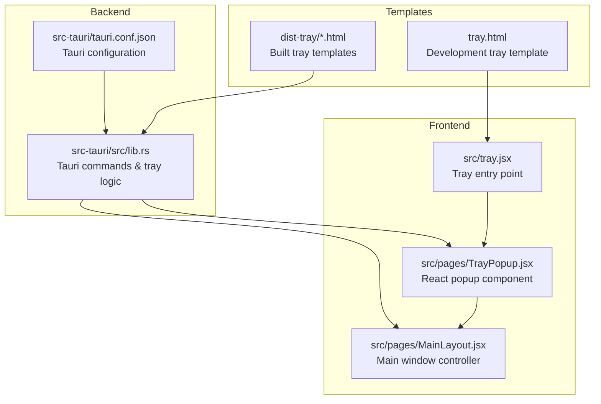
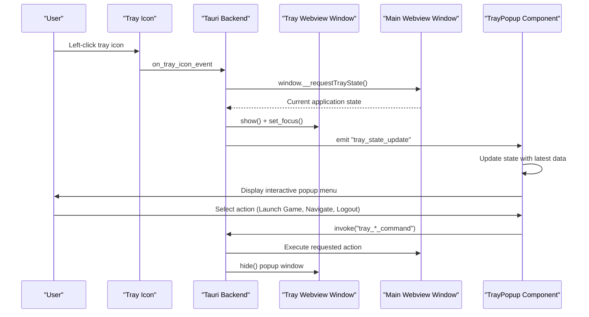
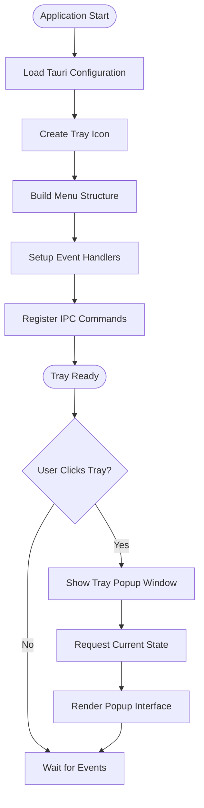
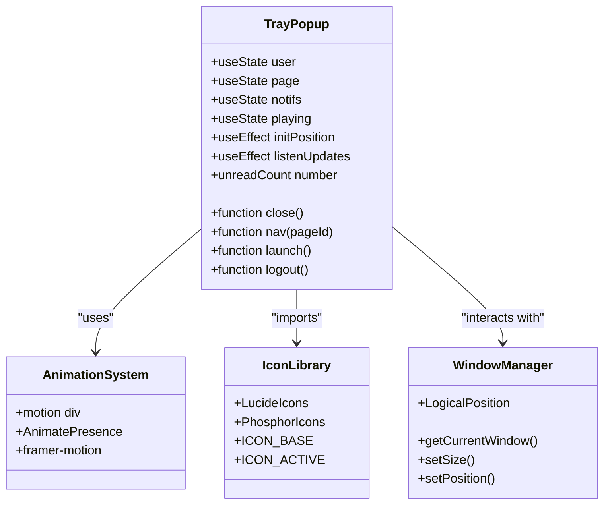
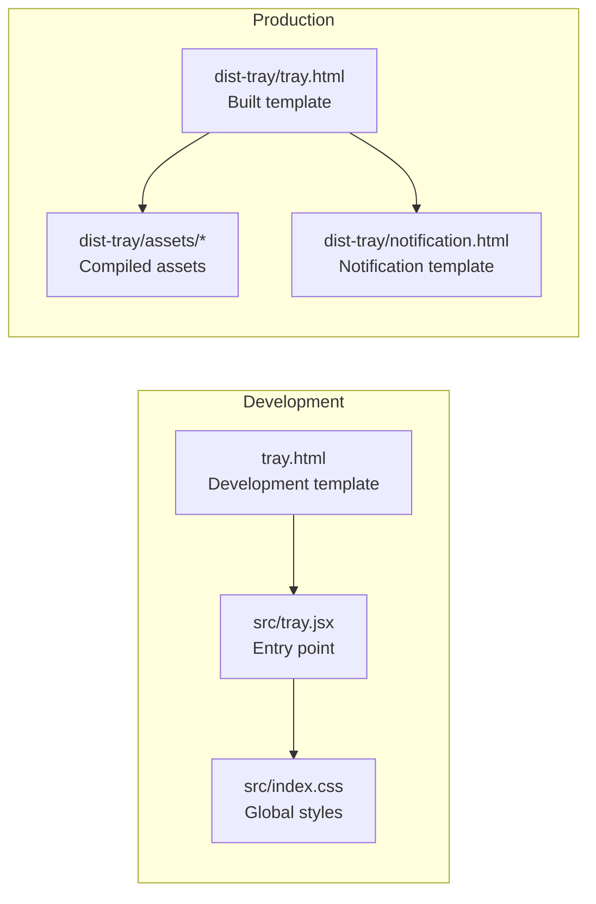
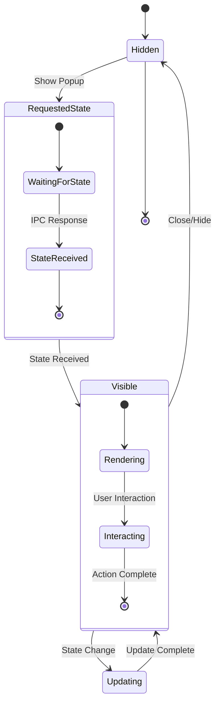
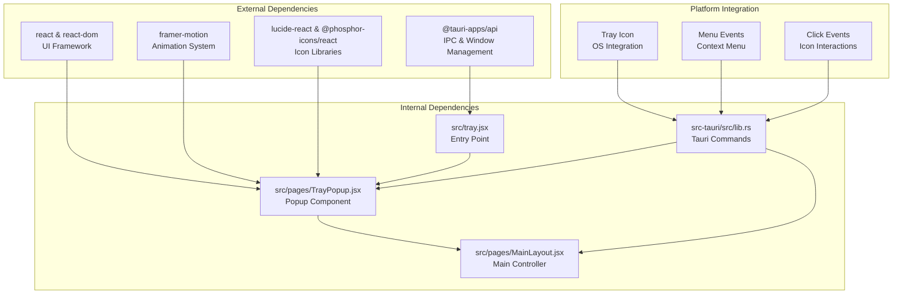

# System Tray Implementation

<cite>
**Referenced Files in This Document**
- [tray.jsx](file://src/tray.jsx)
- [TrayPopup.jsx](file://src/pages/TrayPopup.jsx)
- [MainLayout.jsx](file://src/pages/MainLayout.jsx)
- [lib.rs](file://src-tauri/src/lib.rs)
- [tauri.conf.json](file://src-tauri/tauri.conf.json)
- [notification.html](file://dist-tray/notification.html)
- [tray.html](file://tray.html)
</cite>

## Table of Contents
1. [Introduction](#introduction)
2. [Project Structure](#project-structure)
3. [Core Components](#core-components)
4. [Architecture Overview](#architecture-overview)
5. [Detailed Component Analysis](#detailed-component-analysis)
6. [Dependency Analysis](#dependency-analysis)
7. [Performance Considerations](#performance-considerations)
8. [Troubleshooting Guide](#troubleshooting-guide)
9. [Conclusion](#conclusion)

## Introduction
This document provides comprehensive technical documentation for the system tray implementation in the SBGames project. It covers the tray application architecture, popup menu functionality, quick access features, initialization process, React component structure, and HTML template integration. The documentation explains the popup menu system with game launch shortcuts, account management, and settings access, along with tray icon behavior, hover interactions, and click handlers. It also includes practical examples for extending tray functionality, customizing popup layouts, handling lifecycle events, and addressing platform-specific behaviors.

## Project Structure
The tray implementation spans three primary areas:
- Frontend React application for the tray popup interface
- Tauri backend for tray icon creation, menu handling, and IPC communication
- HTML templates and static assets for tray rendering

**Diagram sources**
- [tray.jsx:1-6](file://src/tray.jsx#L1-L6)
- [TrayPopup.jsx:1-78](file://src/pages/TrayPopup.jsx#L1-L78)
- [MainLayout.jsx:126-159](file://src/pages/MainLayout.jsx#L126-L159)
- [lib.rs:2158-2283](file://src-tauri/src/lib.rs#L2158-L2283)
- [tauri.conf.json](file://src-tauri/tauri.conf.json)

**Section sources**
- [tray.jsx:1-6](file://src/tray.jsx#L1-L6)
- [TrayPopup.jsx:1-78](file://src/pages/TrayPopup.jsx#L1-L78)
- [MainLayout.jsx:126-159](file://src/pages/MainLayout.jsx#L126-L159)
- [lib.rs:2158-2283](file://src-tauri/src/lib.rs#L2158-L2283)

## Core Components
The tray system consists of several interconnected components working together to deliver a seamless desktop experience:

### Tray Entry Point
The tray application starts from a dedicated React entry point that renders the popup interface independently of the main application window.

### Popup Menu System
The React-based popup provides a modern, animated interface with navigation controls, user account management, notifications, and quick access shortcuts.

### Tauri Tray Integration
The backend handles tray icon creation, menu construction, event handling, and inter-window communication via IPC commands.

### State Management
Real-time synchronization ensures the tray popup reflects current application state, including user data, notifications, and game status.

**Section sources**
- [tray.jsx:1-6](file://src/tray.jsx#L1-L6)
- [TrayPopup.jsx:15-40](file://src/pages/TrayPopup.jsx#L15-L40)
- [lib.rs:2238-2283](file://src-tauri/src/lib.rs#L2238-L2283)

## Architecture Overview
The system follows a hybrid architecture combining Electron-style webview windows with Tauri's native tray integration:

**Diagram sources**
- [lib.rs:2260-2280](file://src-tauri/src/lib.rs#L2260-L2280)
- [TrayPopup.jsx:32-40](file://src/pages/TrayPopup.jsx#L32-L40)
- [MainLayout.jsx:133-140](file://src/pages/MainLayout.jsx#L133-L140)

The architecture ensures loose coupling between frontend components while maintaining tight integration with native OS tray functionality through Tauri's command system.

## Detailed Component Analysis

### Tray Initialization Process
The tray initialization begins with the Tauri backend creating a persistent tray icon and menu structure:

**Diagram sources**
- [lib.rs:2238-2283](file://src-tauri/src/lib.rs#L2238-L2283)

The initialization process establishes:
- Tray icon with default application icon
- Context menu with show, play, support, and quit actions
- Event listeners for click and menu interactions
- IPC command registration for state management

**Section sources**
- [lib.rs:2238-2283](file://src-tauri/src/lib.rs#L2238-L2283)

### React Component Structure
The tray popup component implements a modular React architecture with state management and animation support:

**Diagram sources**
- [TrayPopup.jsx:1-78](file://src/pages/TrayPopup.jsx#L1-L78)

Key architectural patterns include:
- State-driven UI updates through React hooks
- Event-driven architecture for user interactions
- Modular icon system supporting both Lucide and Phosphor icons
- Animation framework integration for smooth transitions

**Section sources**
- [TrayPopup.jsx:1-78](file://src/pages/TrayPopup.jsx#L1-L78)

### Popup Menu Functionality
The popup menu provides comprehensive quick access features organized into logical sections:

#### Navigation Controls
- Main page navigation with animated transitions
- Persistent sidebar for quick access to core features
- Visual indicators for active states and unread notifications

#### Account Management
- User profile display with avatar and account details
- Real-time balance and role information
- Secure logout functionality with confirmation flow

#### Game Launch Shortcuts
- One-click game launching with status indication
- Integration with main window's launch mechanism
- Visual feedback during game startup sequence

#### Settings Access
- Quick access to application settings
- Theme switching capabilities
- Notification preferences management

**Section sources**
- [TrayPopup.jsx:63-76](file://src/pages/TrayPopup.jsx#L63-L76)

### HTML Template Integration
The tray system utilizes separate HTML templates for development and production environments:

**Diagram sources**
- [tray.html](file://tray.html)
- [notification.html](file://dist-tray/notification.html)

Template integration ensures consistent styling and functionality across different deployment environments while maintaining separation between development and production assets.

**Section sources**
- [tray.html](file://tray.html)
- [notification.html](file://dist-tray/notification.html)

### Tray Lifecycle Management
The system implements robust lifecycle management for tray windows and state synchronization:

**Diagram sources**
- [lib.rs:2180-2190](file://src-tauri/src/lib.rs#L2180-L2190)
- [TrayPopup.jsx:22-40](file://src/pages/TrayPopup.jsx#L22-L40)

Lifecycle events include:
- Automatic state synchronization on popup show
- Real-time updates via event listeners
- Graceful cleanup of event handlers and window references
- Cross-platform window positioning and focus management

**Section sources**
- [lib.rs:2180-2190](file://src-tauri/src/lib.rs#L2180-L2190)
- [TrayPopup.jsx:22-40](file://src/pages/TrayPopup.jsx#L22-L40)

## Dependency Analysis
The tray system exhibits well-structured dependencies with clear separation of concerns:

**Diagram sources**
- [TrayPopup.jsx:1-10](file://src/pages/TrayPopup.jsx#L1-L10)
- [lib.rs:2158-2283](file://src-tauri/src/lib.rs#L2158-L2283)

The dependency structure supports:
- Loose coupling between frontend and backend components
- Platform abstraction through Tauri's cross-platform APIs
- Modular architecture enabling easy extension and maintenance
- Clear separation between UI presentation and business logic

**Section sources**
- [TrayPopup.jsx:1-10](file://src/pages/TrayPopup.jsx#L1-L10)
- [lib.rs:2158-2283](file://src-tauri/src/lib.rs#L2158-L2283)

## Performance Considerations
The tray implementation incorporates several performance optimizations:

### Efficient State Updates
- Debounced state synchronization prevents excessive IPC calls
- Selective state updates minimize unnecessary re-renders
- Event listener cleanup prevents memory leaks

### Optimized Rendering
- Conditional rendering based on state changes
- Lazy loading of heavy components
- Efficient animation system using hardware acceleration

### Resource Management
- Proper cleanup of webview windows and event handlers
- Memory-efficient icon handling
- Minimal DOM manipulation for smooth interactions

## Troubleshooting Guide

### Common Issues and Solutions

#### Tray Icon Not Appearing
- Verify Tauri configuration includes proper icon paths
- Check platform-specific icon requirements (PNG format, sizes)
- Ensure tray icon creation occurs after application initialization

#### Popup Not Responding to Clicks
- Confirm IPC commands are properly registered in Tauri backend
- Verify event listeners are attached after component mount
- Check for JavaScript errors blocking event propagation

#### State Synchronization Problems
- Ensure `__requestTrayState` function is available in main window
- Verify event emission occurs on state changes
- Check network connectivity for real-time updates

#### Platform-Specific Behaviors
- Windows: Right-click context menu vs. left-click activation
- macOS: Menu bar integration and dark mode support
- Linux: X11/Wayland compatibility and icon themes

**Section sources**
- [lib.rs:2238-2283](file://src-tauri/src/lib.rs#L2238-L2283)
- [TrayPopup.jsx:42-59](file://src/pages/TrayPopup.jsx#L42-L59)

## Conclusion
The SBGames system tray implementation demonstrates a sophisticated blend of modern web technologies with native platform integration. Through careful architectural design, the system provides users with efficient access to core application features while maintaining cross-platform compatibility. The modular component structure, robust IPC communication, and thoughtful UX considerations create a foundation for future enhancements and extensions.

The implementation successfully addresses key requirements including real-time state synchronization, responsive user interactions, and platform-specific optimizations. Future development opportunities include expanding the popup menu functionality, implementing advanced notification systems, and enhancing accessibility features.