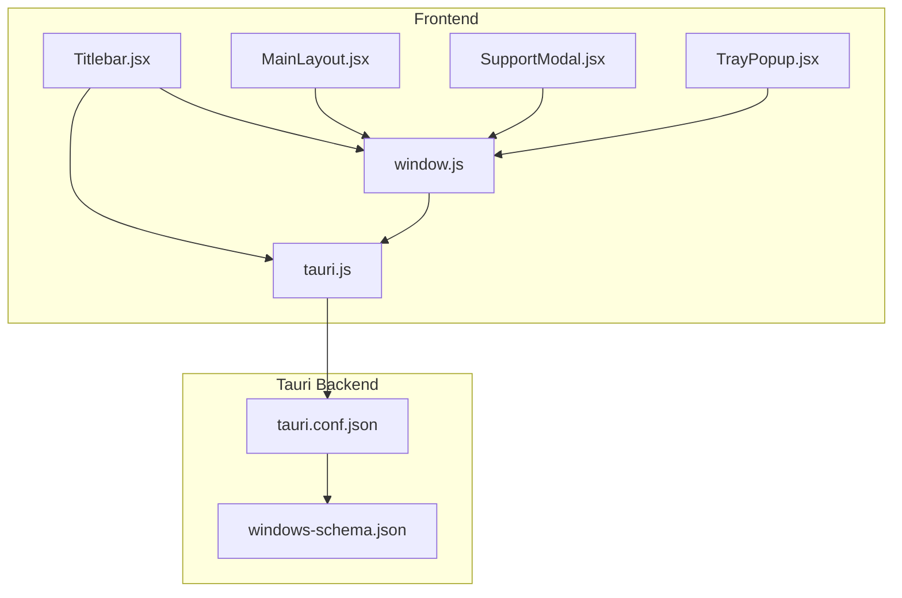
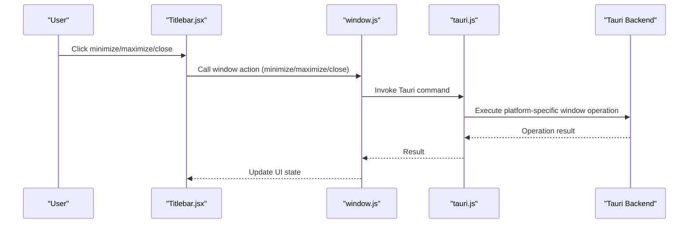
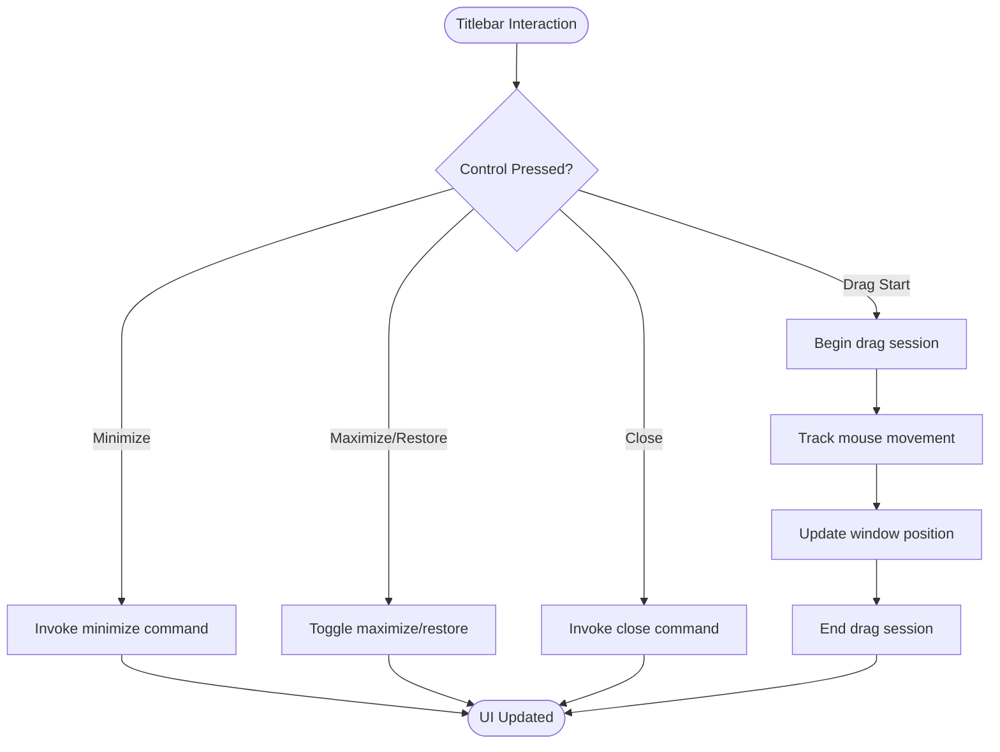
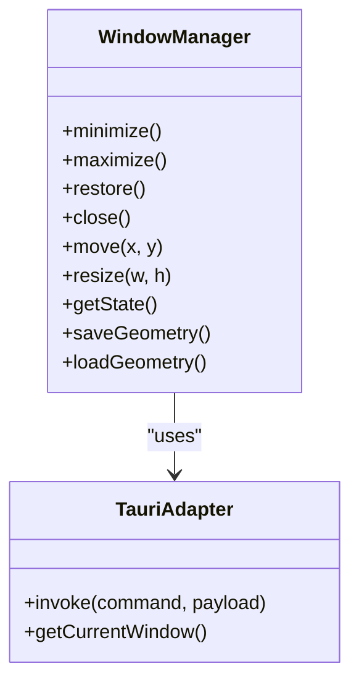
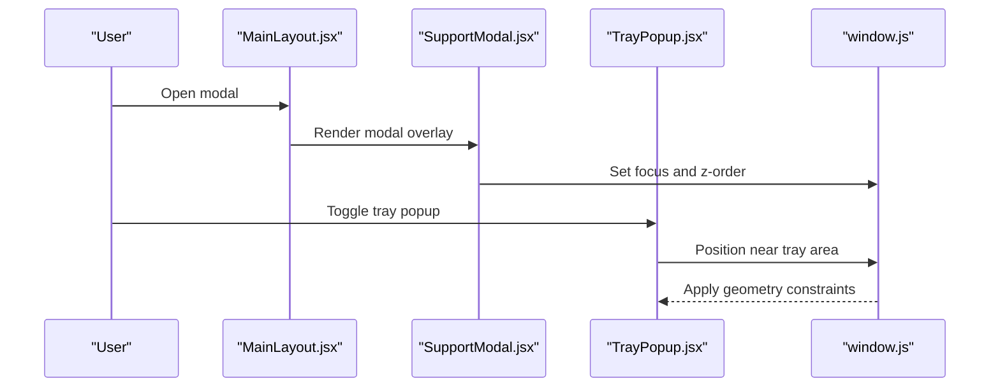
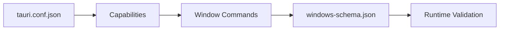
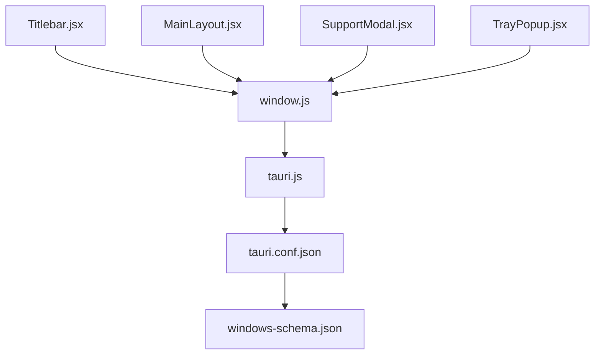

# Window Management

<cite>
**Referenced Files in This Document**
- [Titlebar.jsx](file://src/components/Titlebar.jsx)
- [window.js](file://src/lib/window.js)
- [tauri.js](file://src/lib/tauri.js)
- [MainLayout.jsx](file://src/pages/MainLayout.jsx)
- [SupportModal.jsx](file://src/pages/SupportModal.jsx)
- [TrayPopup.jsx](file://src/pages/TrayPopup.jsx)
- [tauri.conf.json](file://src-tauri/tauri.conf.json)
- [windows-schema.json](file://src-tauri/gen/schemas/windows-schema.json)
</cite>

## Table of Contents
1. [Introduction](#introduction)
2. [Project Structure](#project-structure)
3. [Core Components](#core-components)
4. [Architecture Overview](#architecture-overview)
5. [Detailed Component Analysis](#detailed-component-analysis)
6. [Dependency Analysis](#dependency-analysis)
7. [Performance Considerations](#performance-considerations)
8. [Troubleshooting Guide](#troubleshooting-guide)
9. [Conclusion](#conclusion)

## Introduction
This document provides comprehensive documentation for the window management features of the application, focusing on custom titlebars, window controls, multi-window support, and platform integration. It explains how the titlebar component implements minimize, maximize, close, and drag functionality, how window state is managed, how resizing and positioning are handled, and how the system integrates with desktop environments across platforms. Practical examples are included for custom window layouts, modal dialogs, and floating panels, along with guidance on focus management, z-order handling, platform-specific decorations, sizing constraints, aspect ratio maintenance, and responsive design considerations.

## Project Structure
The window management implementation spans React components, Tauri APIs, and platform configuration:
- Frontend window controls and layout: Titlebar component, page layouts, and modal/dialog components
- Window utilities: Cross-platform window manipulation helpers
- Platform integration: Tauri configuration and generated schemas for window capabilities

**Diagram sources**
- [Titlebar.jsx](file://src/components/Titlebar.jsx)
- [MainLayout.jsx](file://src/pages/MainLayout.jsx)
- [SupportModal.jsx](file://src/pages/SupportModal.jsx)
- [TrayPopup.jsx](file://src/pages/TrayPopup.jsx)
- [window.js](file://src/lib/window.js)
- [tauri.js](file://src/lib/tauri.js)
- [tauri.conf.json](file://src-tauri/tauri.conf.json)
- [windows-schema.json](file://src-tauri/gen/schemas/windows-schema.json)

**Section sources**
- [Titlebar.jsx](file://src/components/Titlebar.jsx)
- [window.js](file://src/lib/window.js)
- [tauri.js](file://src/lib/tauri.js)
- [tauri.conf.json](file://src-tauri/tauri.conf.json)

## Core Components
- Titlebar component: Provides custom window controls (minimize, maximize, close) and drag-to-move functionality
- Window utilities: Encapsulate cross-platform window operations (resize, move, state changes)
- Tauri integration: Expose window commands and permissions via configuration and generated schemas
- Layout components: Demonstrate multi-window scenarios (modal dialogs, tray popups)

Key responsibilities:
- Titlebar: Render controls, handle click events, and initiate drag operations
- Window utilities: Manage window geometry, state transitions, and persistence
- Tauri integration: Define capabilities and expose safe APIs to the frontend

**Section sources**
- [Titlebar.jsx](file://src/components/Titlebar.jsx)
- [window.js](file://src/lib/window.js)
- [tauri.js](file://src/lib/tauri.js)

## Architecture Overview
The window management architecture combines React UI components with Tauri window APIs. The Titlebar component interacts with window utilities, which delegate to Tauri commands for platform-specific actions. Configuration files define capabilities and permissions for window operations.

**Diagram sources**
- [Titlebar.jsx](file://src/components/Titlebar.jsx)
- [window.js](file://src/lib/window.js)
- [tauri.js](file://src/lib/tauri.js)
- [tauri.conf.json](file://src-tauri/tauri.conf.json)

## Detailed Component Analysis

### Titlebar Component
The Titlebar component renders custom window controls and enables dragging the window by its title area. It handles:
- Minimize: Reduces the window to the system tray or OS icon area
- Maximize/Restore: Toggles between maximized/fullscreen and restored states
- Close: Closes the current window
- Drag: Allows moving the window by clicking and dragging the title area

Implementation highlights:
- Control rendering and event binding for minimize, maximize, and close actions
- Drag detection and movement handling to update window position
- Integration with window utilities for state transitions

**Diagram sources**
- [Titlebar.jsx](file://src/components/Titlebar.jsx)
- [window.js](file://src/lib/window.js)

**Section sources**
- [Titlebar.jsx](file://src/components/Titlebar.jsx)

### Window Utilities
The window utilities module centralizes window operations:
- Resize handling: Adjust width/height constraints and maintain aspect ratios
- Position persistence: Save and restore window geometry across sessions
- State management: Track minimized, maximized, and normal states
- Multi-window coordination: Support multiple windows with independent states

Integration points:
- Delegates to Tauri APIs for platform-specific behavior
- Persists geometry to storage for restoration on next launch

**Diagram sources**
- [window.js](file://src/lib/window.js)
- [tauri.js](file://src/lib/tauri.js)

**Section sources**
- [window.js](file://src/lib/window.js)
- [tauri.js](file://src/lib/tauri.js)

### Layouts and Modal Windows
Custom window layouts and modal dialogs demonstrate multi-window patterns:
- MainLayout: Base layout coordinating primary content and optional overlays
- SupportModal: Modal dialog triggered from the main interface
- TrayPopup: Floating panel anchored to system tray

These components illustrate:
- Z-order management for layered UI elements
- Focus handling to ensure modality and keyboard navigation
- Responsive sizing and positioning relative to screen bounds

**Diagram sources**
- [MainLayout.jsx](file://src/pages/MainLayout.jsx)
- [SupportModal.jsx](file://src/pages/SupportModal.jsx)
- [TrayPopup.jsx](file://src/pages/TrayPopup.jsx)
- [window.js](file://src/lib/window.js)

**Section sources**
- [MainLayout.jsx](file://src/pages/MainLayout.jsx)
- [SupportModal.jsx](file://src/pages/SupportModal.jsx)
- [TrayPopup.jsx](file://src/pages/TrayPopup.jsx)

### Platform Integration and Desktop Environment Behavior
Platform integration ensures consistent window behavior across operating systems:
- Tauri configuration defines window capabilities and permissions
- Generated schemas describe available commands and constraints
- Desktop environments receive appropriate hints for decorations and behavior

Key aspects:
- Capability gating prevents unauthorized window operations
- Schema validation ensures compatibility across versions
- Decorations and behavior adapt to host OS conventions

**Diagram sources**
- [tauri.conf.json](file://src-tauri/tauri.conf.json)
- [windows-schema.json](file://src-tauri/gen/schemas/windows-schema.json)

**Section sources**
- [tauri.conf.json](file://src-tauri/tauri.conf.json)
- [windows-schema.json](file://src-tauri/gen/schemas/windows-schema.json)

## Dependency Analysis
Window management depends on coordinated interactions between UI components, utilities, and platform APIs. The coupling is intentionally loose to support cross-platform portability while maintaining consistent behavior.

**Diagram sources**
- [Titlebar.jsx](file://src/components/Titlebar.jsx)
- [window.js](file://src/lib/window.js)
- [tauri.js](file://src/lib/tauri.js)
- [tauri.conf.json](file://src-tauri/tauri.conf.json)
- [windows-schema.json](file://src-tauri/gen/schemas/windows-schema.json)
- [MainLayout.jsx](file://src/pages/MainLayout.jsx)
- [SupportModal.jsx](file://src/pages/SupportModal.jsx)
- [TrayPopup.jsx](file://src/pages/TrayPopup.jsx)

**Section sources**
- [Titlebar.jsx](file://src/components/Titlebar.jsx)
- [window.js](file://src/lib/window.js)
- [tauri.js](file://src/lib/tauri.js)
- [tauri.conf.json](file://src-tauri/tauri.conf.json)
- [windows-schema.json](file://src-tauri/gen/schemas/windows-schema.json)

## Performance Considerations
- Debounce drag and resize events to reduce unnecessary updates
- Persist geometry changes asynchronously to avoid blocking UI
- Cache window state to minimize repeated Tauri calls
- Use efficient layout calculations for responsive sizing and aspect ratio maintenance

## Troubleshooting Guide
Common issues and resolutions:
- Controls not responding: Verify window utilities are initialized and Tauri commands are permitted by configuration
- Drag not working: Ensure drag detection logic is active and mouse capture is handled properly
- Geometry not persisting: Confirm storage mechanisms are available and geometry saving occurs after resize/move
- Modal focus problems: Check z-order and focus management logic for modal overlays
- Platform-specific behavior: Review Tauri capabilities and schema compatibility for target OS

**Section sources**
- [window.js](file://src/lib/window.js)
- [tauri.conf.json](file://src-tauri/tauri.conf.json)
- [windows-schema.json](file://src-tauri/gen/schemas/windows-schema.json)

## Conclusion
The window management system combines a custom Titlebar component with robust window utilities and Tauri integration to deliver consistent, cross-platform behavior. By centralizing window operations, enforcing capability-based access, and supporting multi-window patterns like modals and floating panels, the system provides a solid foundation for responsive, user-friendly desktop experiences across diverse environments.