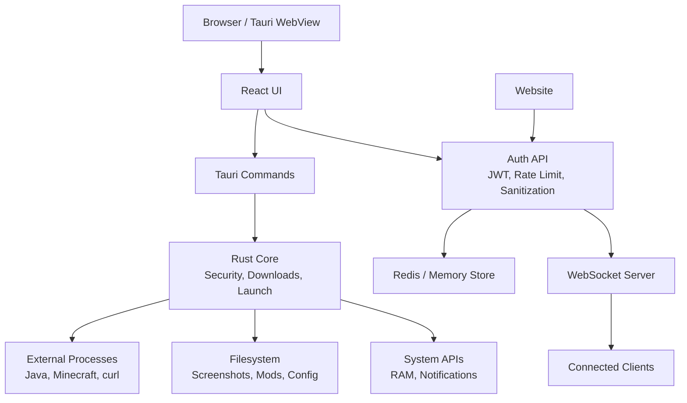
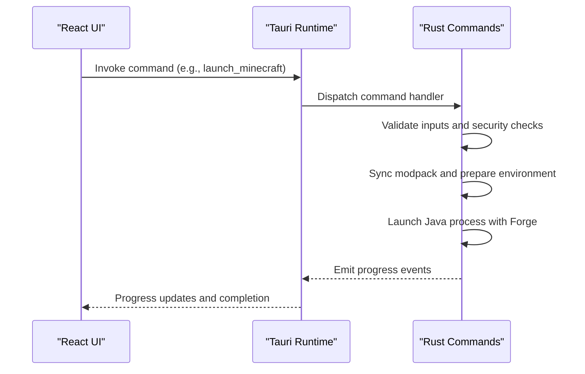
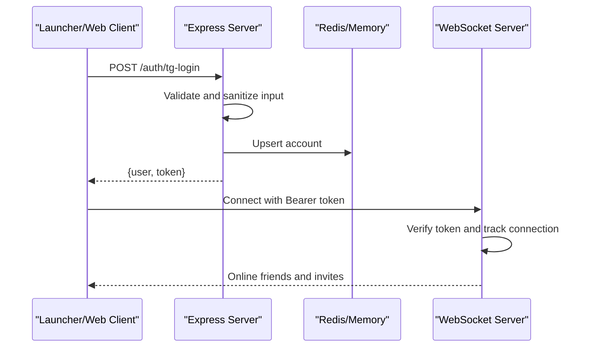
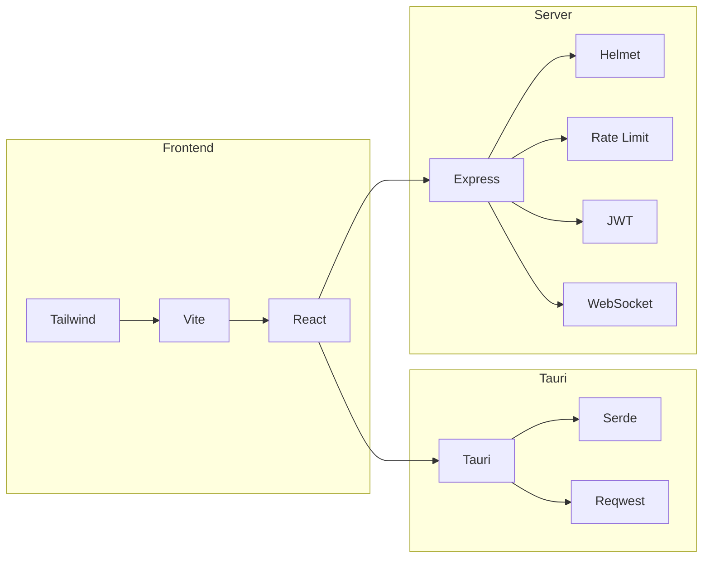

# Development Guidelines

<cite>
**Referenced Files in This Document**
- [package.json](file://package.json)
- [vite.config.js](file://vite.config.js)
- [tailwind.config.js](file://tailwind.config.js)
- [postcss.config.js](file://postcss.config.js)
- [.gitignore](file://.gitignore)
- [src/main.jsx](file://src/main.jsx)
- [src/App.jsx](file://src/App.jsx)
- [src-tauri/Cargo.toml](file://src-tauri/Cargo.toml)
- [src-tauri/src/lib.rs](file://src-tauri/src/lib.rs)
- [src-tauri/src/main.rs](file://src-tauri/src/main.rs)
- [server/package.json](file://server/package.json)
- [server/index.js](file://server/index.js)
- [website/package.json](file://website/package.json)
- [website/vite.config.js](file://website/vite.config.js)
- [website/tailwind.config.js](file://website/tailwind.config.js)
- [BUILD.md](file://BUILD.md)
</cite>

## Table of Contents
1. [Introduction](#introduction)
2. [Project Structure](#project-structure)
3. [Core Components](#core-components)
4. [Architecture Overview](#architecture-overview)
5. [Detailed Component Analysis](#detailed-component-analysis)
6. [Dependency Analysis](#dependency-analysis)
7. [Performance Considerations](#performance-considerations)
8. [Troubleshooting Guide](#troubleshooting-guide)
9. [Conclusion](#conclusion)
10. [Appendices](#appendices)

## Introduction
This document provides comprehensive development guidelines for SBGames contributors. It covers code standards for JavaScript/React, Rust, and Java components; project structure conventions; architectural principles; development workflow; testing strategies; linting and formatting standards; quality assurance procedures; debugging approaches; contribution practices; backward compatibility; performance optimization; and accessibility requirements.

## Project Structure
The repository is a multi-package monorepo with three primary frontends and supporting backend services:
- Desktop launcher built with React and Tauri (Rust) in the root and src-tauri
- Website built with React and Vite in the website directory
- Authentication and game services in the server directory
- Additional build and obfuscation tooling under scripts and scratch

```mermaid
graph TB
subgraph "Desktop Launcher"
FE["React Frontend<br/>Vite + Tailwind"]
RT["Tauri Runtime<br/>Rust Backend"]
end
subgraph "Website"
SiteFE["React Website<br/>Vite + Tailwind"]
end
subgraph "Server"
Auth["Auth + Game Services<br/>Express + WebSocket"]
end
subgraph "Build Tools"
Scripts["Build Scripts<br/>Node + ProGuard"]
end
FE --> RT
SiteFE --> RT
RT <- --> Auth
Scripts --> FE
Scripts --> SiteFE
```

**Diagram sources**
- [src/main.jsx:1-11](file://src/main.jsx#L1-L11)
- [src/App.jsx:1-41](file://src/App.jsx#L1-L41)
- [src-tauri/src/lib.rs:1-200](file://src-tauri/src/lib.rs#L1-L200)
- [server/index.js:1-120](file://server/index.js#L1-L120)
- [website/vite.config.js:1-94](file://website/vite.config.js#L1-L94)

**Section sources**
- [package.json:1-43](file://package.json#L1-L43)
- [src/main.jsx:1-11](file://src/main.jsx#L1-L11)
- [src/App.jsx:1-41](file://src/App.jsx#L1-L41)
- [src-tauri/Cargo.toml:1-57](file://src-tauri/Cargo.toml#L1-L57)
- [server/package.json:1-20](file://server/package.json#L1-L20)
- [website/package.json:1-29](file://website/package.json#L1-L29)

## Core Components
- React frontend with routing, state management via local storage, and UI components
- Tauri-based desktop runtime exposing safe commands to the frontend
- Express server with JWT authentication, rate limiting, Redis-backed persistence, and WebSocket support
- Website frontend with marketing and informational pages
- Build pipeline with Vite, Tailwind, PostCSS, and JavaScript obfuscation

Key implementation patterns:
- Frontend state stored in localStorage with structured parsing
- Tauri commands encapsulate filesystem, system, and external process operations
- Server enforces CORS, rate limits, input sanitization, and JWT verification
- Website uses a separate build pipeline with distinct obfuscation settings

**Section sources**
- [src/App.jsx:1-41](file://src/App.jsx#L1-L41)
- [src-tauri/src/lib.rs:140-231](file://src-tauri/src/lib.rs#L140-L231)
- [server/index.js:37-120](file://server/index.js#L37-L120)
- [website/vite.config.js:39-57](file://website/vite.config.js#L39-L57)

## Architecture Overview
The system comprises:
- Desktop launcher with a React UI communicating with a Rust backend via Tauri commands
- Centralized authentication and game services exposed over HTTPS with WebSocket channels
- Website serving marketing and administrative content
- Shared build tooling for obfuscation and packaging



**Diagram sources**
- [src-tauri/src/lib.rs:340-800](file://src-tauri/src/lib.rs#L340-L800)
- [server/index.js:1-200](file://server/index.js#L1-L200)

## Detailed Component Analysis

### React Frontend (JavaScript/JSX)
- Entry point initializes React DOM and renders the root App
- App manages user session state using localStorage and exposes login/logout handlers
- Uses Framer Motion for animations and phosphor icons for UI

Coding standards:
- Functional components with hooks
- Strict mode enabled
- Local storage for lightweight state persistence

Quality assurance:
- No explicit unit tests observed in the repository
- Obfuscation applied during build via Vite plugin

**Section sources**
- [src/main.jsx:1-11](file://src/main.jsx#L1-L11)
- [src/App.jsx:1-41](file://src/App.jsx#L1-L41)
- [vite.config.js:42-60](file://vite.config.js#L42-L60)

### Tauri Desktop Runtime (Rust)
- Exposes typed commands to the frontend for system info, screenshots, notifications, and launching Minecraft
- Implements anti-debugging and anti-injection checks on Windows
- Manages modpack synchronization, Java detection, and Forge installation

Security and safety:
- DLL scanning and process mitigation on Windows
- Module loading restrictions and environment hygiene
- Path validation for file operations



**Diagram sources**
- [src-tauri/src/lib.rs:340-800](file://src-tauri/src/lib.rs#L340-L800)

**Section sources**
- [src-tauri/src/lib.rs:1-200](file://src-tauri/src/lib.rs#L1-L200)
- [src-tauri/src/lib.rs:340-800](file://src-tauri/src/lib.rs#L340-L800)
- [src-tauri/src/main.rs:1-7](file://src-tauri/src/main.rs#L1-L7)

### Authentication and Game Services (Node.js/Express)
- REST endpoints for authentication, inventory, marketplace, groups, and support tickets
- WebSocket server for real-time communication
- JWT-based authentication with rate limiting and input sanitization



**Diagram sources**
- [server/index.js:140-200](file://server/index.js#L140-L200)
- [server/index.js:752-800](file://server/index.js#L752-L800)

**Section sources**
- [server/index.js:1-200](file://server/index.js#L1-L200)
- [server/index.js:752-800](file://server/index.js#L752-L800)

### Website Frontend (React/Vite)
- Separate React application with marketing pages and admin interfaces
- Distinct build configuration with tailored obfuscation settings

**Section sources**
- [website/package.json:1-29](file://website/package.json#L1-L29)
- [website/vite.config.js:1-94](file://website/vite.config.js#L1-L94)

### Build and Packaging
- Tauri builds per platform with cross-compilation support
- Vite-based obfuscation and minification for production bundles
- ProGuard-based Java bootstrap generation and obfuscation

**Section sources**
- [BUILD.md:1-61](file://BUILD.md#L1-L61)
- [package.json:6-14](file://package.json#L6-L14)
- [vite.config.js:62-96](file://vite.config.js#L62-L96)

## Dependency Analysis
- Frontend depends on React ecosystem and UI libraries
- Tauri backend depends on Tauri crates, serialization, cryptography, HTTP clients, and OS-specific bindings
- Server depends on Express, security middleware, Redis, JWT, sanitization, and WebSocket
- Website depends on React and Tailwind with minimal dev tooling



**Diagram sources**
- [package.json:15-41](file://package.json#L15-L41)
- [src-tauri/Cargo.toml:17-35](file://src-tauri/Cargo.toml#L17-L35)
- [server/package.json:6-18](file://server/package.json#L6-L18)

**Section sources**
- [package.json:15-41](file://package.json#L15-L41)
- [src-tauri/Cargo.toml:17-35](file://src-tauri/Cargo.toml#L17-L35)
- [server/package.json:6-18](file://server/package.json#L6-L18)

## Performance Considerations
- Minification and obfuscation are enabled in production builds for both web and website bundles
- Tauri release profile enables aggressive optimization, LTO, and stripping
- Server-side rate limiting and input sanitization reduce overhead and mitigate abuse
- Tailwind is configured to scope styles to relevant files to minimize CSS payload

Recommendations:
- Prefer lazy-loading heavy components
- Use memoization for expensive computations
- Monitor network requests and batch WebSocket updates
- Keep asset sizes small and leverage CDN where appropriate

**Section sources**
- [vite.config.js:89-96](file://vite.config.js#L89-L96)
- [website/vite.config.js:85-93](file://website/vite.config.js#L85-L93)
- [src-tauri/Cargo.toml:51-57](file://src-tauri/Cargo.toml#L51-L57)
- [server/index.js:64-69](file://server/index.js#L64-L69)

## Troubleshooting Guide
Common areas to investigate:
- Frontend state not persisting: verify localStorage keys and parsing logic
- Tauri command failures: check command signatures and error propagation
- Authentication errors: confirm JWT secret, CORS origins, and rate limiter thresholds
- WebSocket disconnections: validate token authentication and connection lifecycle

Debugging approaches:
- Enable verbose logging in server routes
- Inspect Tauri command emissions and event channels
- Use browser devtools for frontend debugging and network inspection
- Validate environment variables and Redis connectivity

**Section sources**
- [src/App.jsx:9-26](file://src/App.jsx#L9-L26)
- [src-tauri/src/lib.rs:140-231](file://src-tauri/src/lib.rs#L140-L231)
- [server/index.js:37-120](file://server/index.js#L37-L120)

## Conclusion
These guidelines consolidate the current codebase’s structure, standards, and operational practices. Contributors should align new features and fixes with existing patterns, maintain security-conscious defaults, and follow the established build and deployment procedures.

## Appendices

### Coding Standards by Technology

- JavaScript/React
  - Functional components with hooks
  - Strict mode enabled
  - Local storage for lightweight state
  - Obfuscation applied in production builds

  **Section sources**
  - [src/main.jsx:1-11](file://src/main.jsx#L1-L11)
  - [src/App.jsx:1-41](file://src/App.jsx#L1-L41)
  - [vite.config.js:42-60](file://vite.config.js#L42-L60)

- Rust (Tauri)
  - Typed Tauri commands
  - Security-focused with anti-debugging and path validation
  - Structured error handling and state guards

  **Section sources**
  - [src-tauri/src/lib.rs:1-200](file://src-tauri/src/lib.rs#L1-L200)
  - [src-tauri/src/lib.rs:340-800](file://src-tauri/src/lib.rs#L340-L800)

- Java (Bootstrap)
  - Generated and packaged via Node scripts
  - Obfuscated for distribution

  **Section sources**
  - [package.json:7-10](file://package.json#L7-L10)

### Project Structure Conventions
- Feature-based separation for React components and pages
- Layer-based organization for Tauri (commands, system integrations)
- Monorepo layout with dedicated packages for launcher, website, and server

**Section sources**
- [src/components/](file://src/components/)
- [src/pages/](file://src/pages/)
- [src-tauri/src/lib.rs:140-231](file://src-tauri/src/lib.rs#L140-L231)

### Naming Patterns
- PascalCase for React components
- camelCase for hooks and variables
- kebab-case for Tailwind utilities and CSS classes

**Section sources**
- [tailwind.config.js:23-26](file://tailwind.config.js#L23-L26)

### Architectural Principles
- Separation of concerns between frontend, backend, and desktop runtime
- Minimal state in frontend; persistence via localStorage
- Strong server-side validation and rate limiting
- Secure Tauri command boundaries

**Section sources**
- [src/App.jsx:1-41](file://src/App.jsx#L1-L41)
- [server/index.js:64-75](file://server/index.js#L64-L75)
- [src-tauri/src/lib.rs:140-231](file://src-tauri/src/lib.rs#L140-L231)

### Development Workflow
- Branch management: feature branches merged via pull requests
- Pull request procedures: include summary, rationale, and testing notes
- Code review: focus on correctness, security, performance, and accessibility

[No sources needed since this section provides general guidance]

### Testing Strategies
- Unit tests: none observed; recommended for critical business logic
- Integration tests: validate Tauri commands and server endpoints
- End-to-end tests: cover launcher flows and WebSocket interactions

[No sources needed since this section provides general guidance]

### Linting and Formatting Standards
- Formatting: Vite/Terser minification and Tailwind CSS scoping
- No explicit ESLint/Prettier configuration observed

**Section sources**
- [vite.config.js:89-96](file://vite.config.js#L89-L96)
- [tailwind.config.js:3-5](file://tailwind.config.js#L3-L5)

### Quality Assurance Procedures
- Release builds enable minification and obfuscation
- Tauri release profile optimizes binary size and startup time
- Server security middleware and rate limiting protect endpoints

**Section sources**
- [vite.config.js:62-96](file://vite.config.js#L62-L96)
- [src-tauri/Cargo.toml:51-57](file://src-tauri/Cargo.toml#L51-L57)
- [server/index.js:39-69](file://server/index.js#L39-L69)

### Debugging Approaches
- Frontend: React DevTools, console logs, network tab
- Backend: structured logs, Redis inspection, WebSocket monitoring
- Desktop: Tauri logs, command tracing, environment variable inspection

**Section sources**
- [server/index.js:1-120](file://server/index.js#L1-L120)
- [src-tauri/src/lib.rs:1-200](file://src-tauri/src/lib.rs#L1-L200)

### Contributing New Features and Bug Fixes
- New features: add React components/pages, expose Tauri commands, implement server endpoints, update build scripts if needed
- Bug fixes: target specific modules, add tests, update documentation, and verify across platforms

[No sources needed since this section provides general guidance]

### Backward Compatibility
- Respect existing API shapes and localStorage keys
- Avoid breaking changes to Tauri command signatures
- Maintain server endpoint compatibility

**Section sources**
- [src/App.jsx:9-26](file://src/App.jsx#L9-L26)
- [src-tauri/src/lib.rs:140-231](file://src-tauri/src/lib.rs#L140-L231)

### Performance Optimization Standards
- Minimize payload sizes with Tailwind scoping and obfuscation
- Optimize Tauri command execution and avoid blocking operations
- Use efficient data structures and caching on the server

**Section sources**
- [tailwind.config.js:3-5](file://tailwind.config.js#L3-L5)
- [vite.config.js:89-96](file://vite.config.js#L89-L96)
- [src-tauri/Cargo.toml:51-57](file://src-tauri/Cargo.toml#L51-L57)

### Accessibility Requirements
- Semantic HTML and proper labeling
- Keyboard navigation support
- Sufficient color contrast and readable fonts

[No sources needed since this section provides general guidance]