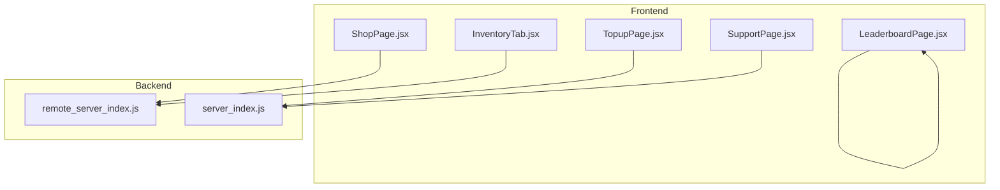
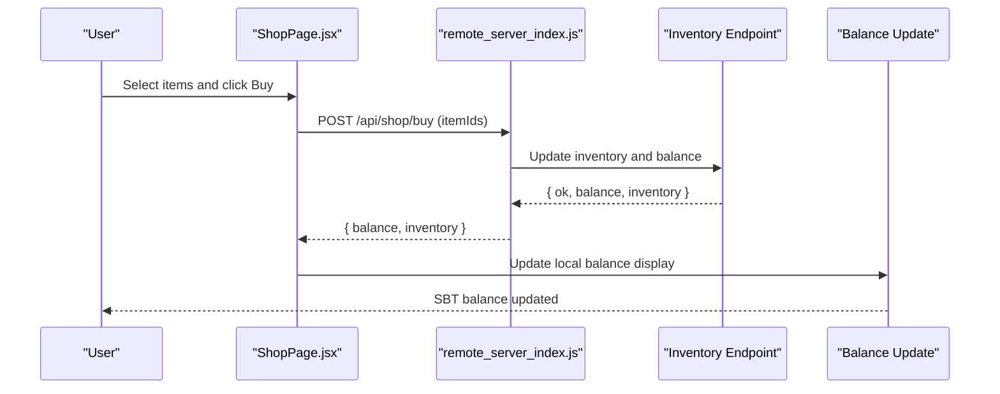
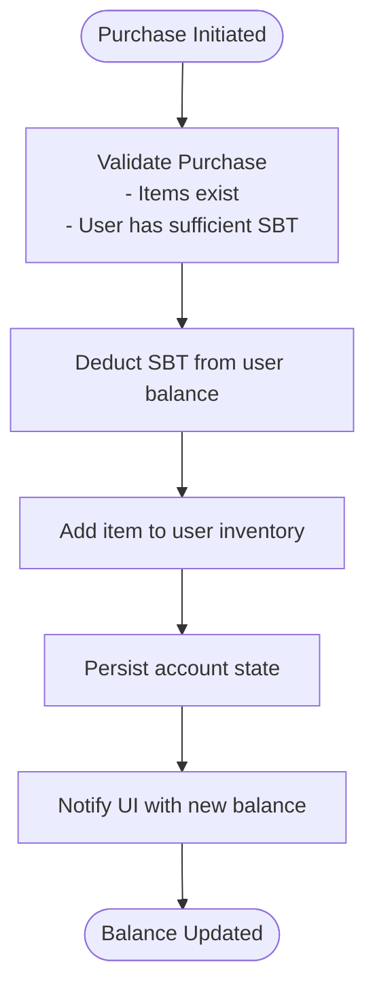
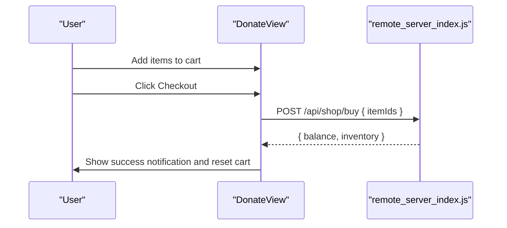
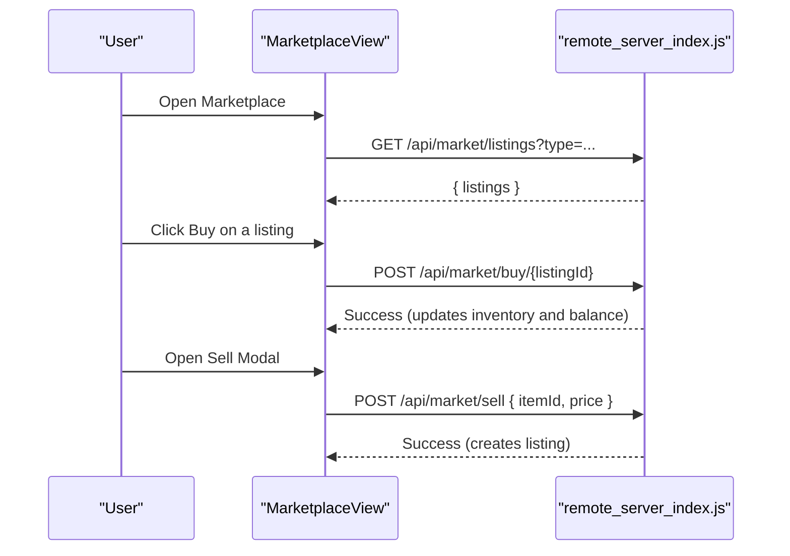
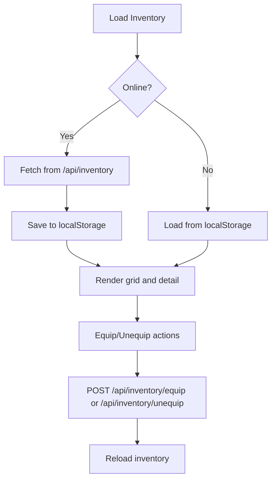
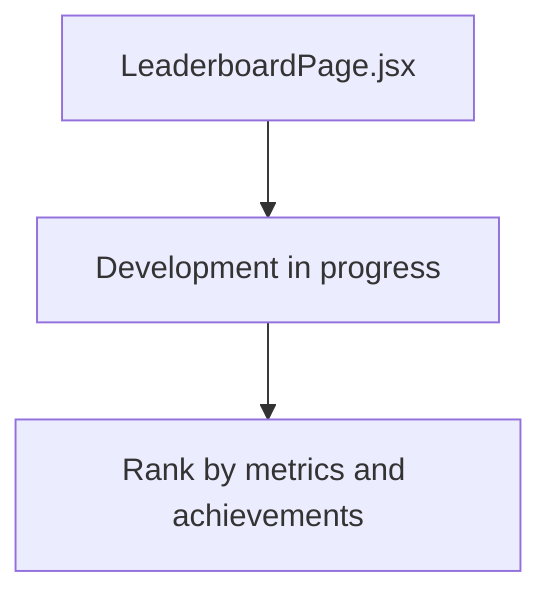
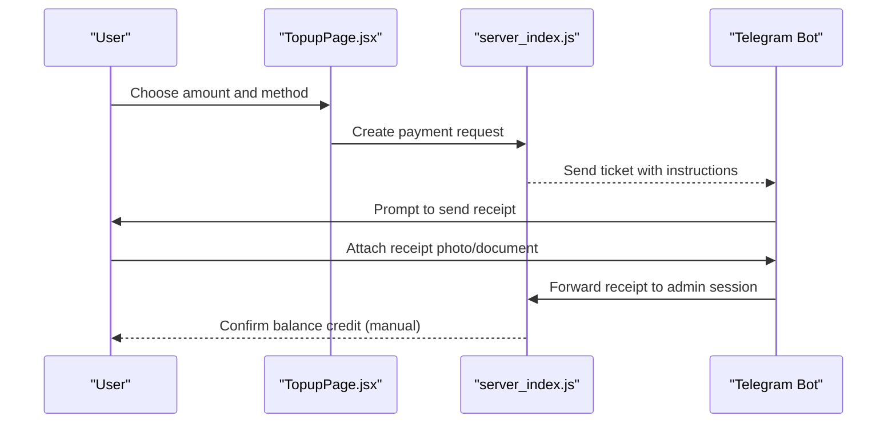
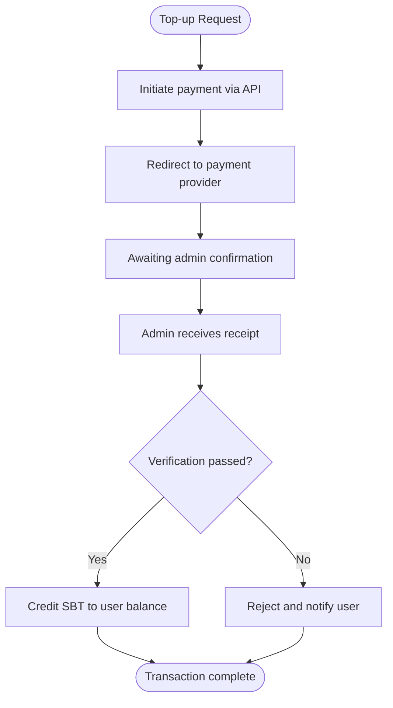
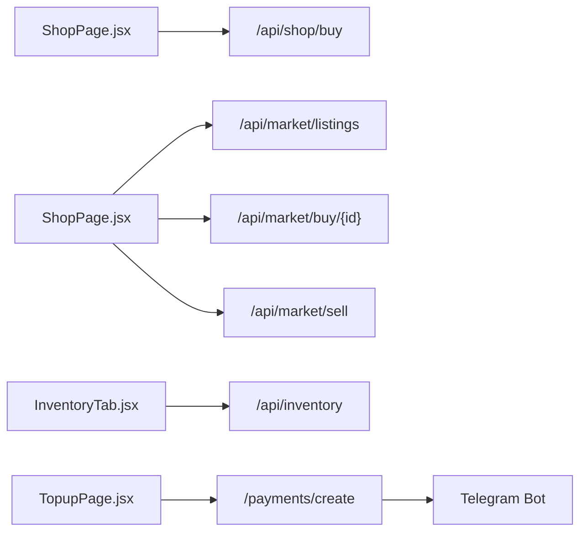

# Economy & Marketplace

<cite>
**Referenced Files in This Document**
- [ShopPage.jsx](file://src/pages/ShopPage.jsx)
- [InventoryTab.jsx](file://src/pages/InventoryTab.jsx)
- [LeaderboardPage.jsx](file://src/pages/LeaderboardPage.jsx)
- [TopupPage.jsx](file://website/src/pages/TopupPage.jsx)
- [SupportPage.jsx](file://src/pages/SupportPage.jsx)
- [remote_server_index.js](file://scratch/remote_server_index.js)
- [server_index.js](file://server_index.js)
</cite>

## Table of Contents
1. [Introduction](#introduction)
2. [Project Structure](#project-structure)
3. [Core Components](#core-components)
4. [Architecture Overview](#architecture-overview)
5. [Detailed Component Analysis](#detailed-component-analysis)
6. [Dependency Analysis](#dependency-analysis)
7. [Performance Considerations](#performance-considerations)
8. [Troubleshooting Guide](#troubleshooting-guide)
9. [Conclusion](#conclusion)
10. [Appendices](#appendices)

## Introduction
This document describes the virtual economy and marketplace system centered around the in-game currency SBT. It covers:
- Virtual currency (SBT) management and balance tracking
- Shop functionality for direct purchases and cosmetic/premium items
- Trading platform for peer-to-peer (P2P) listings
- Inventory management for item storage, categorization, and equipping
- Leaderboard system (placeholder)
- Transaction history and audit trail for financial activities
- Payment processor integration and security measures
- Economic gameplay mechanics and revenue models
- Anti-fraud measures and transaction validation processes

## Project Structure
The economy spans frontend UI pages and backend services:
- Frontend UI pages for shop, inventory, top-up, and support
- Backend endpoints for shop, inventory, market listings, and payments
- Telegram bot integration for manual balance confirmations and receipts

**Diagram sources**
- [ShopPage.jsx:51-83](file://src/pages/ShopPage.jsx#L51-L83)
- [InventoryTab.jsx:236-278](file://src/pages/InventoryTab.jsx#L236-L278)
- [LeaderboardPage.jsx:4-21](file://src/pages/LeaderboardPage.jsx#L4-L21)
- [TopupPage.jsx:23-57](file://website/src/pages/TopupPage.jsx#L23-L57)
- [SupportPage.jsx:427-564](file://src/pages/SupportPage.jsx#L427-L564)
- [remote_server_index.js:630-643](file://scratch/remote_server_index.js#L630-L643)
- [server_index.js:1518-1770](file://server_index.js#L1518-L1770)

**Section sources**
- [ShopPage.jsx:51-83](file://src/pages/ShopPage.jsx#L51-L83)
- [InventoryTab.jsx:236-278](file://src/pages/InventoryTab.jsx#L236-L278)
- [LeaderboardPage.jsx:4-21](file://src/pages/LeaderboardPage.jsx#L4-L21)
- [TopupPage.jsx:23-57](file://website/src/pages/TopupPage.jsx#L23-L57)
- [SupportPage.jsx:427-564](file://src/pages/SupportPage.jsx#L427-L564)
- [remote_server_index.js:630-643](file://scratch/remote_server_index.js#L630-L643)
- [server_index.js:1518-1770](file://server_index.js#L1518-L1770)

## Core Components
- SBT currency and balance
  - Balance display and tracking across UI surfaces
  - Balance updates after purchases and top-ups
- Shop (direct purchases)
  - Server and category filtering
  - Cart and checkout flow
- Market (P2P listings)
  - Listing retrieval and purchase
  - Sell modal for listing owned items
- Inventory
  - Item grid, filtering, and equipping/unequipping
- Top-up and payments
  - Payment method selection and initiation
  - Telegram-based manual confirmations
- Leaderboard
  - Placeholder page indicating future development

**Section sources**
- [ShopPage.jsx:86-113](file://src/pages/ShopPage.jsx#L86-L113)
- [ShopPage.jsx:496-600](file://src/pages/ShopPage.jsx#L496-L600)
- [InventoryTab.jsx:236-314](file://src/pages/InventoryTab.jsx#L236-L314)
- [TopupPage.jsx:23-57](file://website/src/pages/TopupPage.jsx#L23-L57)
- [LeaderboardPage.jsx:4-21](file://src/pages/LeaderboardPage.jsx#L4-L21)

## Architecture Overview
The economy integrates frontend UI with backend endpoints and a Telegram bot for manual verification.

**Diagram sources**
- [ShopPage.jsx:95-113](file://src/pages/ShopPage.jsx#L95-L113)
- [remote_server_index.js:630-643](file://scratch/remote_server_index.js#L630-L643)

## Detailed Component Analysis

### SBT Currency and Balance Tracking
- Display and formatting
  - Balance shown in multiple UI locations with consistent SBT notation
- Updates
  - After shop purchases and top-ups, the UI receives updated balance and refreshes displays
- Backend persistence
  - Balance stored per user account and updated atomically during transactions

**Diagram sources**
- [remote_server_index.js:630-643](file://scratch/remote_server_index.js#L630-L643)

**Section sources**
- [ShopPage.jsx:104-105](file://src/pages/ShopPage.jsx#L104-L105)
- [remote_server_index.js:630-643](file://scratch/remote_server_index.js#L630-L643)

### Shop Functionality (Direct Purchases)
- Filtering and presentation
  - Server and category filters
  - Item cards with rarity and pricing
- Cart and checkout
  - Add/remove items
  - Submit order via authenticated endpoint
- Post-purchase
  - Balance update and notification

**Diagram sources**
- [ShopPage.jsx:86-113](file://src/pages/ShopPage.jsx#L86-L113)
- [remote_server_index.js:630-643](file://scratch/remote_server_index.js#L630-L643)

**Section sources**
- [ShopPage.jsx:86-113](file://src/pages/ShopPage.jsx#L86-L113)

### Marketplace (P2P Listings)
- Browse listings
  - Load active listings with optional type filter
- Purchase
  - Buy button triggers purchase on selected listing
- Sell
  - Modal to pick owned item and set price
  - Creates listing and removes item from inventory until sold

**Diagram sources**
- [ShopPage.jsx:496-600](file://src/pages/ShopPage.jsx#L496-L600)
- [ShopPage.jsx:626-668](file://src/pages/ShopPage.jsx#L626-L668)
- [ShopPage.jsx:670-765](file://src/pages/ShopPage.jsx#L670-L765)
- [remote_server_index.js:630-643](file://scratch/remote_server_index.js#L630-L643)

**Section sources**
- [ShopPage.jsx:496-600](file://src/pages/ShopPage.jsx#L496-L600)
- [ShopPage.jsx:626-668](file://src/pages/ShopPage.jsx#L626-L668)
- [ShopPage.jsx:670-765](file://src/pages/ShopPage.jsx#L670-L765)

### Inventory Management
- Loading and caching
  - Fetch inventory and equipped items; fallback to local cache when offline
- Filtering and search
  - By category, server, and free-text search
- Equipping and unequipping
  - Toggle equipment state for items
- Detail view
  - Extended info and action buttons

**Diagram sources**
- [InventoryTab.jsx:248-278](file://src/pages/InventoryTab.jsx#L248-L278)
- [InventoryTab.jsx:280-314](file://src/pages/InventoryTab.jsx#L280-L314)

**Section sources**
- [InventoryTab.jsx:236-314](file://src/pages/InventoryTab.jsx#L236-L314)
- [InventoryTab.jsx:316-337](file://src/pages/InventoryTab.jsx#L316-L337)

### Leaderboard System
- Current state
  - Placeholder page indicating development status
- Future scope
  - Ranking by various metrics and achievements

**Diagram sources**
- [LeaderboardPage.jsx:4-21](file://src/pages/LeaderboardPage.jsx#L4-L21)

**Section sources**
- [LeaderboardPage.jsx:4-21](file://src/pages/LeaderboardPage.jsx#L4-L21)

### Transaction History and Audit Trail
- Financial activity logging
  - Backend maintains account state and transaction outcomes
- Telegram audit
  - Manual payment tickets with receipts and admin actions
  - Receipt submission and confirmation process

**Diagram sources**
- [TopupPage.jsx:34-57](file://website/src/pages/TopupPage.jsx#L34-L57)
- [server_index.js:1518-1770](file://server_index.js#L1518-L1770)

**Section sources**
- [TopupPage.jsx:34-57](file://website/src/pages/TopupPage.jsx#L34-L57)
- [server_index.js:1518-1770](file://server_index.js#L1518-L1770)

### Payment Processor Integration and Security Measures
- Payment initiation
  - Website initiates payment creation and redirects to external provider
- Manual verification
  - Telegram bot routes payments to admins for manual confirmation
  - Receipts collected and verified before crediting balances
- Security
  - Tokenized requests with bearer tokens
  - Admin-only controls for balance adjustments
  - Receipt-based audit trail

**Diagram sources**
- [TopupPage.jsx:34-57](file://website/src/pages/TopupPage.jsx#L34-L57)
- [server_index.js:1518-1770](file://server_index.js#L1518-L1770)

**Section sources**
- [TopupPage.jsx:23-57](file://website/src/pages/TopupPage.jsx#L23-L57)
- [SupportPage.jsx:427-564](file://src/pages/SupportPage.jsx#L427-L564)
- [server_index.js:1518-1770](file://server_index.js#L1518-L1770)

### Economic Gameplay Mechanics and Revenue Models
- Direct monetization
  - Cosmetic and premium items in shop
  - VIP status and server-wide effects
- Secondary market
  - Player-driven P2P trading via marketplace
- Revenue model
  - Upfront purchases (shop)
  - Transaction fees on marketplace (conceptual)
  - Premium subscriptions (conceptual)

[No sources needed since this section provides general guidance]

### Anti-Fraud Measures and Transaction Validation
- Validation steps
  - Item existence checks
  - Balance sufficiency verification
  - Atomic balance and inventory updates
- Manual verification
  - Telegram bot workflow for receipts
  - Admin callbacks for balance adjustments
- Audit trail
  - Persistent logs and ticket histories

**Section sources**
- [remote_server_index.js:630-643](file://scratch/remote_server_index.js#L630-L643)
- [server_index.js:1518-1770](file://server_index.js#L1518-L1770)
- [SupportPage.jsx:427-564](file://src/pages/SupportPage.jsx#L427-L564)

## Dependency Analysis
- UI-to-backend dependencies
  - Shop and inventory depend on authenticated fetch to backend endpoints
  - Top-up depends on payment creation API and Telegram bot for manual confirmations
- Backend-to-storage dependencies
  - Account and inventory persistence via Redis-like storage
- Cross-service dependencies
  - Telegram bot coordinates manual confirmations and receipts

**Diagram sources**
- [ShopPage.jsx:506-528](file://src/pages/ShopPage.jsx#L506-L528)
- [ShopPage.jsx:626-668](file://src/pages/ShopPage.jsx#L626-L668)
- [ShopPage.jsx:670-765](file://src/pages/ShopPage.jsx#L670-L765)
- [InventoryTab.jsx:248-278](file://src/pages/InventoryTab.jsx#L248-L278)
- [TopupPage.jsx:34-57](file://website/src/pages/TopupPage.jsx#L34-L57)
- [server_index.js:1518-1770](file://server_index.js#L1518-L1770)

**Section sources**
- [ShopPage.jsx:506-528](file://src/pages/ShopPage.jsx#L506-L528)
- [ShopPage.jsx:626-668](file://src/pages/ShopPage.jsx#L626-L668)
- [ShopPage.jsx:670-765](file://src/pages/ShopPage.jsx#L670-L765)
- [InventoryTab.jsx:248-278](file://src/pages/InventoryTab.jsx#L248-L278)
- [TopupPage.jsx:34-57](file://website/src/pages/TopupPage.jsx#L34-L57)
- [server_index.js:1518-1770](file://server_index.js#L1518-L1770)

## Performance Considerations
- UI responsiveness
  - Use of animations and lazy loading for item grids
  - Local caching for offline inventory access
- Backend throughput
  - Atomic balance and inventory updates
  - Efficient listing retrieval with filters
- Payment flow
  - Minimal client-side computation; rely on server-side validations

[No sources needed since this section provides general guidance]

## Troubleshooting Guide
- Shop purchase errors
  - Insufficient SBT, item not found, or account not found
  - UI alerts and retry mechanisms
- Inventory sync issues
  - Fallback to cached inventory; check network connectivity
- Payment confirmations
  - Ensure receipt is attached; verify amount and method
  - Contact support if pending for extended periods

**Section sources**
- [remote_server_index.js:630-643](file://scratch/remote_server_index.js#L630-L643)
- [InventoryTab.jsx:252-276](file://src/pages/InventoryTab.jsx#L252-L276)
- [SupportPage.jsx:427-564](file://src/pages/SupportPage.jsx#L427-L564)

## Conclusion
The economy and marketplace system combines a direct shop, a player-driven marketplace, robust inventory management, and secure payment flows with manual verification. The architecture emphasizes atomic updates, clear audit trails, and user-friendly UIs across servers and categories.

[No sources needed since this section summarizes without analyzing specific files]

## Appendices
- Glossary
  - SBT: In-game virtual currency
  - VIP: Premium status granting global benefits
  - P2P: Peer-to-peer trading between players

[No sources needed since this section provides general guidance]