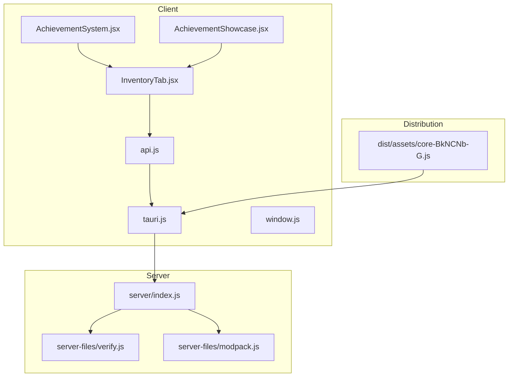
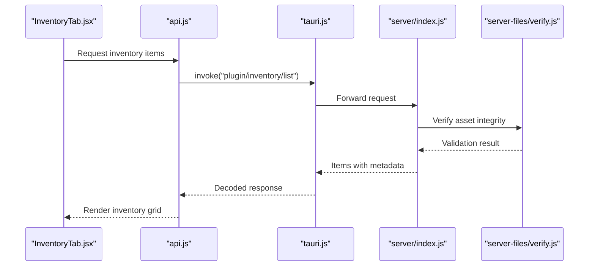
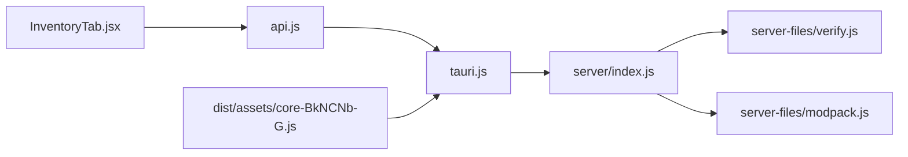

# Inventory & Asset Tracking

<cite>
**Referenced Files in This Document**
- [InventoryTab.jsx](file://src/pages/InventoryTab.jsx)
- [api.js](file://src/lib/api.js)
- [tauri.js](file://src/lib/tauri.js)
- [window.js](file://src/lib/window.js)
- [AchievementSystem.jsx](file://src/components/AchievementSystem.jsx)
- [AchievementShowcase.jsx](file://src/components/AchievementShowcase.jsx)
- [server/index.js](file://server/index.js)
- [server_files/verify.js](file://server-files/verify.js)
- [server_files/modpack.js](file://server-files/modpack.js)
- [dist/assets/core-BkNCNb-G.js](file://dist/assets/core-BkNCNb-G.js)
</cite>

## Table of Contents
1. [Introduction](#introduction)
2. [Project Structure](#project-structure)
3. [Core Components](#core-components)
4. [Architecture Overview](#architecture-overview)
5. [Detailed Component Analysis](#detailed-component-analysis)
6. [Dependency Analysis](#dependency-analysis)
7. [Performance Considerations](#performance-considerations)
8. [Troubleshooting Guide](#troubleshooting-guide)
9. [Conclusion](#conclusion)

## Introduction
This document describes the inventory management system for item storage, categorization, and asset tracking. It covers inventory structure for different item types (frames, backgrounds, animated avatars, badges), equipment states, and ownership verification. It also documents the inventory API endpoints for item retrieval, equipment changes, and asset validation, item lifecycle from acquisition through usage, equipping, and disposal, filtering/search capabilities, and administrative controls for asset recovery.

## Project Structure
The inventory system spans client-side React components and Tauri IPC integration, with backend verification and asset management utilities.

**Diagram sources**
- [InventoryTab.jsx](file://src/pages/InventoryTab.jsx)
- [api.js](file://src/lib/api.js)
- [tauri.js](file://src/lib/tauri.js)
- [window.js](file://src/lib/window.js)
- [AchievementSystem.jsx](file://src/components/AchievementSystem.jsx)
- [AchievementShowcase.jsx](file://src/components/AchievementShowcase.jsx)
- [server/index.js](file://server/index.js)
- [server_files/verify.js](file://server-files/verify.js)
- [server_files/modpack.js](file://server-files/modpack.js)
- [dist/assets/core-BkNCNb-G.js](file://dist/assets/core-BkNCNb-G.js)

**Section sources**
- [InventoryTab.jsx](file://src/pages/InventoryTab.jsx)
- [api.js](file://src/lib/api.js)
- [tauri.js](file://src/lib/tauri.js)
- [window.js](file://src/lib/window.js)
- [AchievementSystem.jsx](file://src/components/AchievementSystem.jsx)
- [AchievementShowcase.jsx](file://src/components/AchievementShowcase.jsx)
- [server/index.js](file://server/index.js)
- [server_files/verify.js](file://server-files/verify.js)
- [server_files/modpack.js](file://server-files/modpack.js)
- [dist/assets/core-BkNCNb-G.js](file://dist/assets/core-BkNCNb-G.js)

## Core Components
- InventoryTab: Central UI for browsing, filtering, and managing items; supports sorting, search, and equipment actions.
- API Layer: Provides typed wrappers around Tauri IPC for inventory operations.
- Tauri IPC: Bridges frontend to backend for secure inventory queries and updates.
- Verification Utilities: Server-side asset verification and modpack management for anti-theft and integrity checks.
- Achievement System: Tracks inventory milestones and showcases equipped items.

Key responsibilities:
- Item storage and categorization (frames, backgrounds, animated avatars, badges).
- Equipment state management and ownership verification.
- Asset validation and anti-theft mechanisms via server-side verification.
- Filtering, search, and organization features for efficient inventory navigation.

**Section sources**
- [InventoryTab.jsx](file://src/pages/InventoryTab.jsx)
- [api.js](file://src/lib/api.js)
- [tauri.js](file://src/lib/tauri.js)
- [AchievementSystem.jsx](file://src/components/AchievementSystem.jsx)
- [AchievementShowcase.jsx](file://src/components/AchievementShowcase.jsx)
- [server_files/verify.js](file://server-files/verify.js)
- [server_files/modpack.js](file://server-files/modpack.js)

## Architecture Overview
The system uses a layered architecture:
- Frontend React components render inventory UI and collect user actions.
- API module encapsulates IPC calls to Tauri handlers.
- Backend server validates requests, enforces ownership, and performs asset verification.
- Distribution bundle includes obfuscated runtime helpers for IPC and serialization.

**Diagram sources**
- [InventoryTab.jsx](file://src/pages/InventoryTab.jsx)
- [api.js](file://src/lib/api.js)
- [tauri.js](file://src/lib/tauri.js)
- [server/index.js](file://server/index.js)
- [server_files/verify.js](file://server-files/verify.js)

## Detailed Component Analysis

### InventoryTab: Item Storage, Categorization, and Equipment
Responsibilities:
- Fetches inventory items and displays categorized lists.
- Supports filtering by category (frames, backgrounds, animated avatars, badges).
- Manages equipment state transitions (unequip, swap, apply).
- Integrates with achievement system to reflect inventory milestones.

Operational flow:
- On mount, triggers inventory fetch via API.
- Renders filtered/sorted views based on user selections.
- Handles equipment actions that update both UI state and backend.

Security and validation:
- Equipment changes are validated server-side to prevent unauthorized modifications.
- Asset integrity checks ensure items originate from trusted sources.

Ownership verification:
- Backend enforces ownership rules before allowing equipment changes.

**Section sources**
- [InventoryTab.jsx](file://src/pages/InventoryTab.jsx)
- [AchievementSystem.jsx](file://src/components/AchievementSystem.jsx)
- [AchievementShowcase.jsx](file://src/components/AchievementShowcase.jsx)

### API Layer: Inventory Endpoints and Data Contracts
Endpoints (described conceptually):
- GET /inventory/items
  - Purpose: Retrieve paginated inventory items with metadata.
  - Query params: category, search term, sort order, page number.
  - Response: Array of item objects with id, name, type, rarity, thumbnail, and ownership flags.
- POST /inventory/equip
  - Purpose: Change equipment state for a given slot.
  - Body: { slot: string, itemId: string }.
  - Response: Updated equipment state and affected items.
- POST /inventory/validate
  - Purpose: Validate asset integrity and ownership.
  - Body: { assetId: string, checksum: string }.
  - Response: { valid: boolean, reason?: string }.

Data model (conceptual):
- Item: { id, name, type, category, rarity, thumbnail, owned, equipped, metadata }
- EquipmentSlot: { slotName: string, currentItemId: string, availableItems: string[] }

Error handling:
- Returns structured errors for invalid categories, missing permissions, or corrupted assets.

**Section sources**
- [api.js](file://src/lib/api.js)
- [tauri.js](file://src/lib/tauri.js)

### Tauri IPC Runtime and Serialization
Runtime helpers:
- Obfuscated IPC utilities manage channel registration, event listeners, and serialization to IPC boundaries.
- Provides safe invocation of plugin commands and resource conversion for file-based assets.

Security:
- Enforces strict argument validation and type checks.
- Prevents prototype pollution and injection attacks.

**Section sources**
- [dist/assets/core-BkNCNb-G.js](file://dist/assets/core-BkNCNb-G.js)

### Server-Side Verification and Anti-Theft
Verification pipeline:
- Asset verification compares computed checksums against stored records.
- Modpack validation ensures assets belong to approved distributions.
- Ownership checks confirm the requesting user has rights to equip or modify items.

Anti-theft mechanisms:
- Invalid checksums or mismatched modpack signatures trigger rejection.
- Equipment changes require explicit permission grants.

Administrative controls:
- Asset recovery process allows administrators to restore or revoke access to problematic items.

**Section sources**
- [server/index.js](file://server/index.js)
- [server_files/verify.js](file://server-files/verify.js)
- [server_files/modpack.js](file://server-files/modpack.js)

### Achievement System: Inventory Milestones and Showcase
Integration points:
- AchievementSystem tracks inventory milestones (e.g., first item, total items).
- AchievementShowcase renders equipped items for profile display.

Behavior:
- Triggers achievements when inventory thresholds are met.
- Reflects current equipment state in showcase UI.

**Section sources**
- [AchievementSystem.jsx](file://src/components/AchievementSystem.jsx)
- [AchievementShowcase.jsx](file://src/components/AchievementShowcase.jsx)

## Dependency Analysis
High-level dependencies:
- InventoryTab depends on API layer for data access.
- API layer depends on Tauri IPC runtime for command execution.
- Tauri IPC routes requests to server handlers.
- Server handlers depend on verification utilities for integrity checks.

**Diagram sources**
- [InventoryTab.jsx](file://src/pages/InventoryTab.jsx)
- [api.js](file://src/lib/api.js)
- [tauri.js](file://src/lib/tauri.js)
- [server/index.js](file://server/index.js)
- [server_files/verify.js](file://server-files/verify.js)
- [server_files/modpack.js](file://server-files/modpack.js)
- [dist/assets/core-BkNCNb-G.js](file://dist/assets/core-BkNCNb-G.js)

**Section sources**
- [InventoryTab.jsx](file://src/pages/InventoryTab.jsx)
- [api.js](file://src/lib/api.js)
- [tauri.js](file://src/lib/tauri.js)
- [server/index.js](file://server/index.js)
- [server_files/verify.js](file://server-files/verify.js)
- [server_files/modpack.js](file://server-files/modpack.js)
- [dist/assets/core-BkNCNb-G.js](file://dist/assets/core-BkNCNb-G.js)

## Performance Considerations
- Pagination and lazy loading reduce initial payload sizes for large inventories.
- Client-side caching minimizes repeated network calls for frequently accessed items.
- Debounced search prevents excessive backend queries during typing.
- Efficient rendering with virtualized lists improves UI responsiveness for long inventories.

## Troubleshooting Guide
Common issues and resolutions:
- Equipment change rejected: Verify asset integrity and ownership; ensure checksum matches and user has permission.
- Asset not found: Confirm asset exists in modpack and distribution is up-to-date.
- UI not updating after action: Check IPC channel registration and event listener setup.
- Performance degradation: Enable pagination, disable unnecessary filters, and avoid frequent re-renders.

Diagnostic steps:
- Inspect API responses for error codes and messages.
- Validate server logs for verification failures.
- Confirm IPC runtime helpers are properly initialized.

**Section sources**
- [api.js](file://src/lib/api.js)
- [tauri.js](file://src/lib/tauri.js)
- [server_files/verify.js](file://server-files/verify.js)
- [dist/assets/core-BkNCNb-G.js](file://dist/assets/core-BkNCNb-G.js)

## Conclusion
The inventory management system combines a responsive frontend with robust backend verification to provide secure, searchable, and organized item management. It supports diverse item types, equipment states, and ownership enforcement while offering administrative tools for asset recovery and integrity assurance.