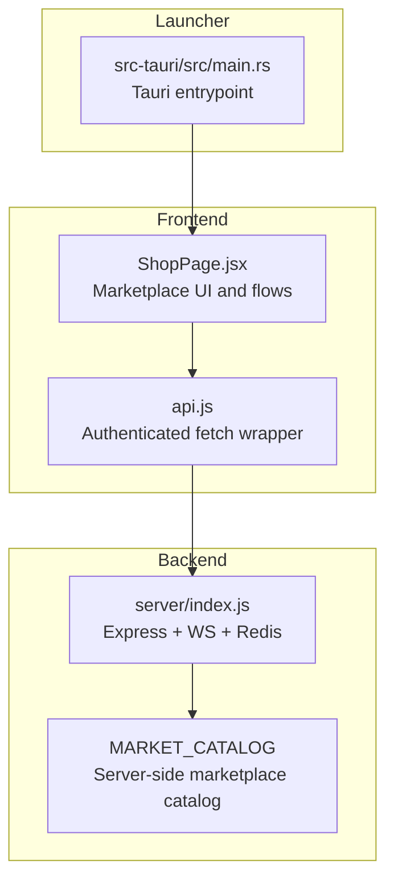
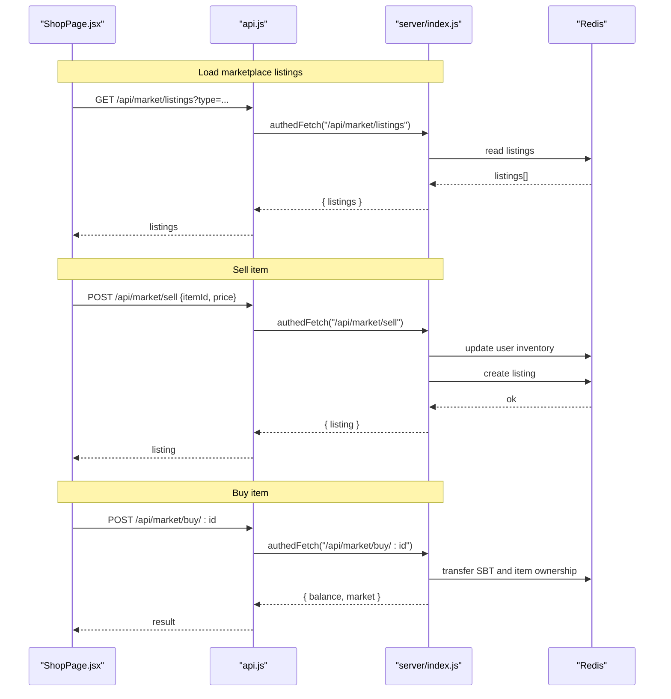
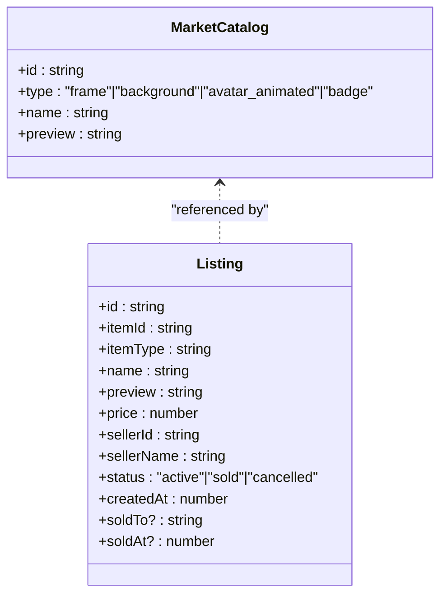
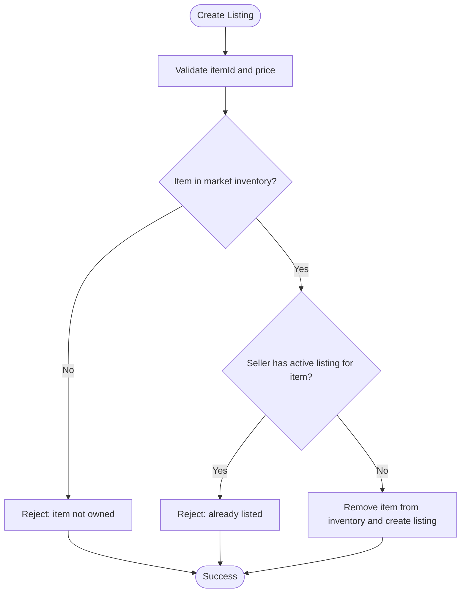
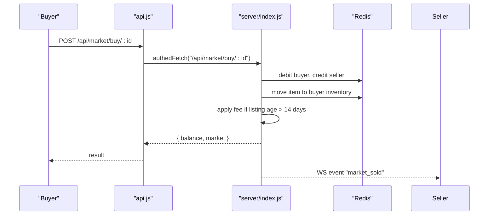
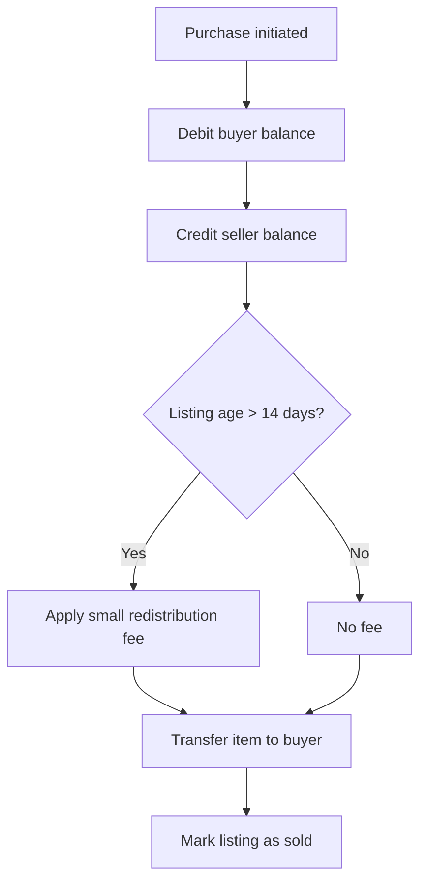
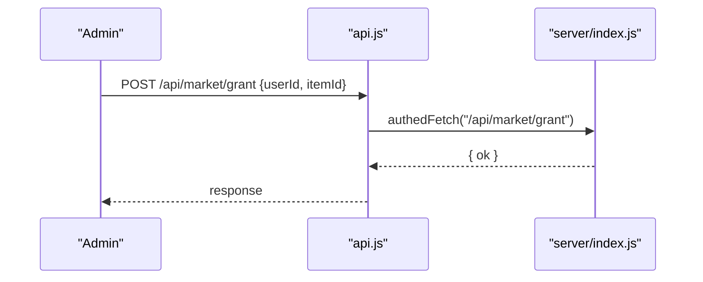
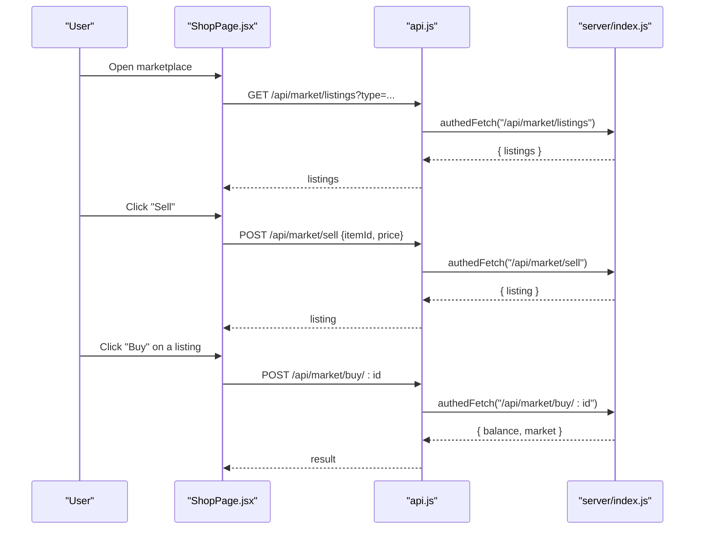
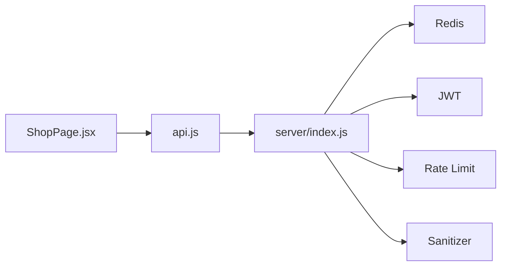

# Marketplace & P2P Trading

<cite>
**Referenced Files in This Document**
- [ShopPage.jsx](file://src/pages/ShopPage.jsx)
- [api.js](file://src/lib/api.js)
- [index.js](file://server/index.js)
- [catalog.js](file://src/pages/catalog.js)
- [main.rs](file://src-tauri/src/main.rs)
</cite>

## Table of Contents
1. [Introduction](#introduction)
2. [Project Structure](#project-structure)
3. [Core Components](#core-components)
4. [Architecture Overview](#architecture-overview)
5. [Detailed Component Analysis](#detailed-component-analysis)
6. [Dependency Analysis](#dependency-analysis)
7. [Performance Considerations](#performance-considerations)
8. [Troubleshooting Guide](#troubleshooting-guide)
9. [Conclusion](#conclusion)
10. [Appendices](#appendices)

## Introduction
This document describes the peer-to-peer (P2P) marketplace system integrated into the SBGames platform. It covers listing management, trading workflows, and the escrow-like mechanism that transfers items upon purchase. It documents marketplace types (frames, backgrounds, animated avatars, badges), listing creation and price setting, the purchase flow, and the server-side APIs used for retrieving listings, managing sales, and processing transactions. It also outlines buyer protection measures, seller verification, moderation and governance considerations, security controls, and operational examples.

## Project Structure
The marketplace spans three primary areas:
- Frontend UI and flows: implemented in a React page that renders the shop and marketplace views, manages filters, and performs authenticated fetches to the backend.
- Backend API: implemented as a Node.js/Express service with rate limiting, input sanitization, JWT authentication, and Redis-backed persistence.
- Launcher integration: a Tauri-based launcher entrypoint that boots the Rust library runtime.

**Diagram sources**
- [ShopPage.jsx:487-766](file://src/pages/ShopPage.jsx#L487-L766)
- [api.js:1-50](file://src/lib/api.js#L1-L50)
- [index.js:303-338](file://server/index.js#L303-L338)
- [main.rs:1-7](file://src-tauri/src/main.rs#L1-L7)

**Section sources**
- [ShopPage.jsx:1-766](file://src/pages/ShopPage.jsx#L1-L766)
- [api.js:1-50](file://src/lib/api.js#L1-L50)
- [index.js:303-338](file://server/index.js#L303-L338)
- [main.rs:1-7](file://src-tauri/src/main.rs#L1-L7)

## Core Components
- Marketplace UI (ShopPage.jsx): Provides two modes—donation shop and P2P marketplace. The marketplace view lists active listings, allows filtering by type, and enables selling items from the user’s library.
- Authentication and API layer (api.js): Centralized fetch wrapper that injects JWT tokens and normalizes error responses.
- Server-side marketplace endpoints (server/index.js): Implements listing retrieval, creation, purchase, cancellation, and administrative helpers.
- Market types and catalog (server/index.js + catalog.js): Defines marketplace item categories and metadata used for display and validation.

Key marketplace types supported:
- frames
- background
- avatar_animated
- badge

These correspond to the marketplace catalog entries and are used to filter and render listings.

**Section sources**
- [ShopPage.jsx:487-766](file://src/pages/ShopPage.jsx#L487-L766)
- [api.js:1-50](file://src/lib/api.js#L1-L50)
- [index.js:443-587](file://server/index.js#L443-L587)
- [catalog.js:1-42](file://src/pages/catalog.js#L1-L42)

## Architecture Overview
The marketplace follows a client-server model:
- The frontend loads marketplace listings via authenticated GET requests.
- Sellers create listings by posting items from their library with a price.
- Buyers purchase listings atomically transferring SBT and ownership of the item.
- Administrative endpoints support granting items for testing and moderation.

**Diagram sources**
- [ShopPage.jsx:506-528](file://src/pages/ShopPage.jsx#L506-L528)
- [api.js:20-49](file://src/lib/api.js#L20-L49)
- [index.js:463-587](file://server/index.js#L463-L587)

## Detailed Component Analysis

### Marketplace Types and Catalog
The server defines a dedicated marketplace catalog distinct from the shop catalog. These items are drawn from the user’s “library” and can be listed for sale. Types include:
- frame
- background
- avatar_animated
- badge

The frontend maps item types to human-readable labels and renders previews accordingly.

**Diagram sources**
- [index.js:328-338](file://server/index.js#L328-L338)
- [index.js:448-461](file://server/index.js#L448-L461)

**Section sources**
- [index.js:328-338](file://server/index.js#L328-L338)
- [index.js:448-461](file://server/index.js#L448-L461)
- [ShopPage.jsx:487-494](file://src/pages/ShopPage.jsx#L487-L494)

### Listing Management (Creation, Retrieval, Cancellation)
- Retrieve listings: GET /api/market/listings with optional type filter.
- Retrieve personal listings: GET /api/market/my.
- Create listing: POST /api/market/sell with itemId and price.
- Cancel listing: DELETE /api/market/:id (only the seller can cancel an active listing).

Validation rules:
- Price range: 10–100000 SBT.
- Only one active listing per item per seller.
- Item must be present in the user’s market inventory.

**Diagram sources**
- [index.js:500-534](file://server/index.js#L500-L534)

**Section sources**
- [index.js:463-479](file://server/index.js#L463-L479)
- [index.js:500-534](file://server/index.js#L500-L534)

### Purchase Workflow (Escrow-like Transfer)
When a buyer purchases a listing:
- The buyer’s balance is debited.
- The seller’s balance is credited.
- Ownership of the item moves from seller to buyer.
- If the listing is older than 14 days, a small fee is redistributed from buyer to seller.

**Diagram sources**
- [ShopPage.jsx:626-668](file://src/pages/ShopPage.jsx#L626-L668)
- [api.js:20-49](file://src/lib/api.js#L20-L49)
- [index.js:536-571](file://server/index.js#L536-L571)

**Section sources**
- [index.js:536-571](file://server/index.js#L536-L571)
- [ShopPage.jsx:626-668](file://src/pages/ShopPage.jsx#L626-L668)

### Escrow Mechanism and Buyer Protection
- Atomic transfer: The purchase endpoint updates balances and inventory atomically before marking the listing sold.
- Age-based fee: After 14 days, a small fee is redistributed to incentivize sellers to keep listings fresh.
- Cancellation policy: Sellers can cancel active listings to reclaim items; buyers cannot cancel purchases.

**Diagram sources**
- [index.js:555-567](file://server/index.js#L555-L567)

**Section sources**
- [index.js:555-567](file://server/index.js#L555-L567)

### Seller Verification and Moderation
- Role-based access: Administrative endpoints are protected by role checks.
- Granting items: Admins can grant marketplace items to users for testing.
- Moderation surface: The presence of admin-only endpoints indicates moderation capability is available in the backend.

**Diagram sources**
- [index.js:485-498](file://server/index.js#L485-L498)

**Section sources**
- [index.js:485-498](file://server/index.js#L485-L498)

### Frontend Operations: Listing, Price Setting, and Purchase
- Listing creation: The sell modal lets users pick an item from their library and set a price within allowed bounds.
- Filtering: Users can filter listings by type (frames, backgrounds, avatar_animated, badge).
- Purchase: Clicking “Buy” triggers the purchase flow and updates the UI.

**Diagram sources**
- [ShopPage.jsx:496-668](file://src/pages/ShopPage.jsx#L496-L668)
- [api.js:20-49](file://src/lib/api.js#L20-L49)
- [index.js:463-571](file://server/index.js#L463-L571)

**Section sources**
- [ShopPage.jsx:496-668](file://src/pages/ShopPage.jsx#L496-L668)

## Dependency Analysis
- Frontend depends on:
  - api.js for authenticated HTTP requests.
  - server endpoints for marketplace operations.
- Backend depends on:
  - Redis for account and listing persistence.
  - JWT for authentication.
  - Rate limiting and input sanitization for security.

**Diagram sources**
- [ShopPage.jsx:1-11](file://src/pages/ShopPage.jsx#L1-L11)
- [api.js:1-50](file://src/lib/api.js#L1-L50)
- [index.js:37-82](file://server/index.js#L37-L82)

**Section sources**
- [ShopPage.jsx:1-11](file://src/pages/ShopPage.jsx#L1-L11)
- [api.js:1-50](file://src/lib/api.js#L1-L50)
- [index.js:37-82](file://server/index.js#L37-L82)

## Performance Considerations
- Rate limiting: Requests to /api are rate-limited to prevent abuse.
- Input sanitization: All string inputs are sanitized to reduce injection risks.
- Redis fallback: Redis is used for persistence with an in-memory Map fallback if Redis is unavailable.
- Efficient listing queries: Listings are filtered client-side after fetching, minimizing server load.

[No sources needed since this section provides general guidance]

## Troubleshooting Guide
Common issues and resolutions:
- Authentication errors: Ensure a valid JWT token is stored and sent with requests.
- Listing not found: Verify the listing ID exists and is active.
- Insufficient balance: Confirm the buyer’s balance meets the listing price.
- Already listed item: A seller cannot list the same item twice while an active listing exists.
- Purchase canceled unexpectedly: Check if the listing was canceled by the seller or if the buyer attempted to buy their own listing.

Operational checks:
- Health endpoint: Use GET /health to verify server and connection counts.
- CORS: Ensure the origin is allowed by the server’s CORS configuration.

**Section sources**
- [index.js:178-178](file://server/index.js#L178-L178)
- [index.js:43-59](file://server/index.js#L43-L59)
- [index.js:536-571](file://server/index.js#L536-L571)

## Conclusion
The SBGames marketplace integrates a straightforward P2P trading system with clear seller and buyer protections. Listings are managed server-side with strict validation, and purchases execute atomically with an escrow-like mechanism. Administrative controls are present to support moderation and testing. The frontend provides intuitive filtering and a streamlined UX for browsing, listing, and purchasing items.

[No sources needed since this section summarizes without analyzing specific files]

## Appendices

### API Reference Summary
- GET /api/market/listings: Retrieve active listings, optionally filtered by type.
- GET /api/market/my: Retrieve the current user’s listings.
- POST /api/market/sell: Create a listing from an item in the user’s library with a valid price.
- POST /api/market/buy/:id: Purchase a listing by ID.
- DELETE /api/market/:id: Cancel an active listing (seller only).
- POST /api/market/grant: Admin-only endpoint to grant marketplace items to users.

**Section sources**
- [index.js:463-587](file://server/index.js#L463-L587)

### Security Measures and Fraud Prevention
- JWT-based authentication for protected endpoints.
- CORS restricted to approved origins.
- Rate limiting on API routes.
- Input sanitization for all string fields.
- Admin-only endpoints for sensitive operations.

**Section sources**
- [index.js:39-82](file://server/index.js#L39-L82)
- [index.js:43-62](file://server/index.js#L43-L62)
- [index.js:70-74](file://server/index.js#L70-L74)
- [index.js:134-136](file://server/index.js#L134-L136)

### Examples

- Listing an item:
  - Select an item from the library.
  - Set a price within the allowed range.
  - Submit the sell request; the item is removed from inventory and a listing is created.

- Buying an item:
  - Browse listings and select one.
  - Confirm the purchase; the system debits the buyer and credits the seller, then assigns the item to the buyer.

- Dispute resolution:
  - While a formal dispute endpoint is not exposed in the backend, administrators can grant items via the admin endpoint for testing and moderation scenarios.

**Section sources**
- [ShopPage.jsx:670-765](file://src/pages/ShopPage.jsx#L670-L765)
- [index.js:500-534](file://server/index.js#L500-L534)
- [index.js:536-571](file://server/index.js#L536-L571)
- [index.js:485-498](file://server/index.js#L485-L498)