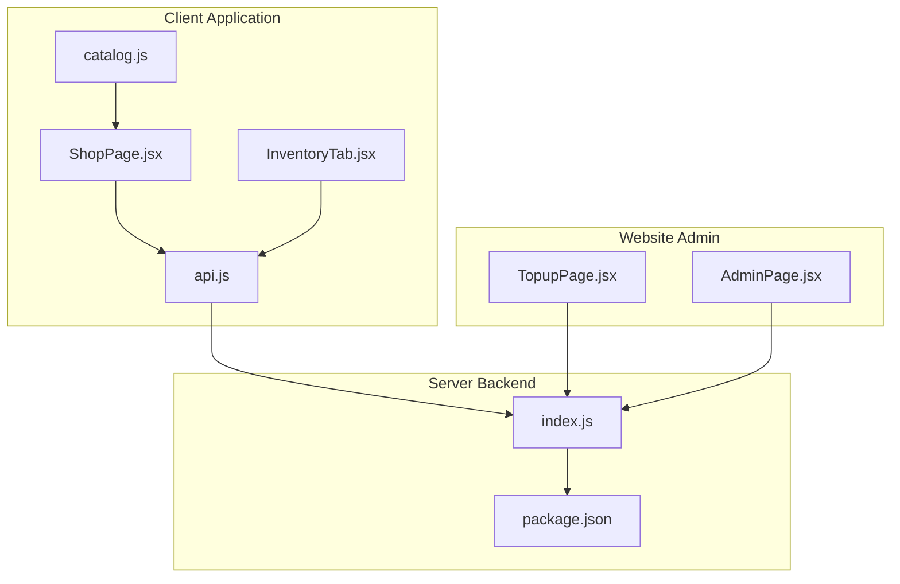
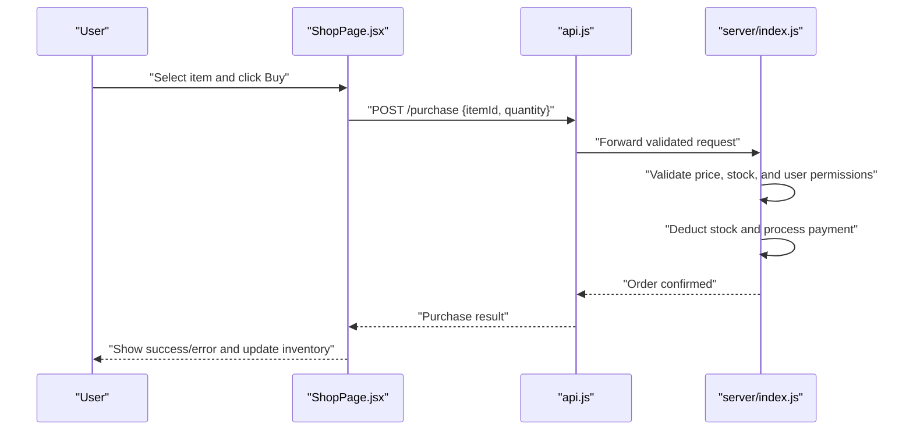
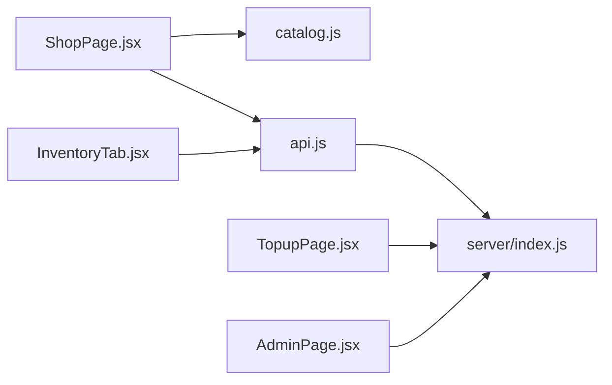

# Shop System & Item Management

<cite>
**Referenced Files in This Document**
- [ShopPage.jsx](file://src/pages/ShopPage.jsx)
- [InventoryTab.jsx](file://src/pages/InventoryTab.jsx)
- [catalog.js](file://src/pages/catalog.js)
- [api.js](file://src/lib/api.js)
- [index.js](file://server/index.js)
- [package.json](file://server/package.json)
- [TopupPage.jsx](file://website/src/pages/TopupPage.jsx)
- [AdminPage.jsx](file://website/src/pages/AdminPage.jsx)
</cite>

## Table of Contents
1. [Introduction](#introduction)
2. [Project Structure](#project-structure)
3. [Core Components](#core-components)
4. [Architecture Overview](#architecture-overview)
5. [Detailed Component Analysis](#detailed-component-analysis)
6. [Dependency Analysis](#dependency-analysis)
7. [Performance Considerations](#performance-considerations)
8. [Troubleshooting Guide](#troubleshooting-guide)
9. [Conclusion](#conclusion)

## Introduction
This document describes the shop system and item management functionality across the client-side application and server backend. It covers item catalog management, purchase workflows, inventory integration, categories, rarity system, server-specific availability, shopping cart and checkout processes, order fulfillment, item metadata, API endpoints, validation and security measures, and administrative workflows. The goal is to provide a comprehensive understanding for developers, administrators, and support personnel.

## Project Structure
The shop system spans three primary areas:
- Client shop interface and inventory management
- Catalog definition and item metadata
- Server-side API for purchases and inventory updates

**Diagram sources**
- [ShopPage.jsx](file://src/pages/ShopPage.jsx)
- [InventoryTab.jsx](file://src/pages/InventoryTab.jsx)
- [catalog.js](file://src/pages/catalog.js)
- [api.js](file://src/lib/api.js)
- [index.js](file://server/index.js)
- [package.json](file://server/package.json)
- [TopupPage.jsx](file://website/src/pages/TopupPage.jsx)
- [AdminPage.jsx](file://website/src/pages/AdminPage.jsx)

**Section sources**
- [ShopPage.jsx](file://src/pages/ShopPage.jsx)
- [InventoryTab.jsx](file://src/pages/InventoryTab.jsx)
- [catalog.js](file://src/pages/catalog.js)
- [api.js](file://src/lib/api.js)
- [index.js](file://server/index.js)
- [package.json](file://server/package.json)
- [TopupPage.jsx](file://website/src/pages/TopupPage.jsx)
- [AdminPage.jsx](file://website/src/pages/AdminPage.jsx)

## Core Components
- Shop Page: Renders the shop interface, displays items by category, handles selection, and triggers purchase actions via the API.
- Inventory Tab: Shows player inventory and supports item usage or management actions.
- Catalog: Defines item metadata, categories, rarities, and server availability rules.
- API Layer: Provides client-to-server communication for retrieving items, processing purchases, and updating inventory.
- Server: Implements purchase validation, stock management, pricing checks, and order fulfillment.
- Website Admin Pages: Support top-up and administrative controls for shop management.

Key responsibilities:
- Item catalog management: Define categories (armor, weapons, pets, effects), rarity tiers, descriptions, prices, and server restrictions.
- Purchase workflows: Shopping cart simulation, checkout, payment processing, and order fulfillment.
- Inventory integration: Real-time updates after successful purchases.
- Validation and security: Price verification, stock checks, and anti-abuse measures.
- Administration: Moderation, promotions, and bulk operations.

**Section sources**
- [ShopPage.jsx](file://src/pages/ShopPage.jsx)
- [InventoryTab.jsx](file://src/pages/InventoryTab.jsx)
- [catalog.js](file://src/pages/catalog.js)
- [api.js](file://src/lib/api.js)
- [index.js](file://server/index.js)

## Architecture Overview
The shop system follows a client-server model:
- Client components render the shop and inventory.
- Catalog defines item metadata and availability.
- API layer mediates requests to the server.
- Server validates transactions, manages inventory, and persists outcomes.

**Diagram sources**
- [ShopPage.jsx](file://src/pages/ShopPage.jsx)
- [api.js](file://src/lib/api.js)
- [index.js](file://server/index.js)

## Detailed Component Analysis

### Shop Page (ShopPage.jsx)
Responsibilities:
- Render shop categories and items.
- Handle item selection and purchase initiation.
- Integrate with the API for purchase requests.
- Display purchase results and update inventory state.

Key behaviors:
- Uses catalog data to populate category views.
- Validates selection before invoking purchase.
- Presents user feedback for purchase outcomes.

**Section sources**
- [ShopPage.jsx](file://src/pages/ShopPage.jsx)

### Inventory Tab (InventoryTab.jsx)
Responsibilities:
- Display current player inventory.
- Enable item usage or management actions.
- Reflect updates after successful purchases.

Integration:
- Subscribes to inventory updates from the API.
- Supports item filtering and sorting.

**Section sources**
- [InventoryTab.jsx](file://src/pages/InventoryTab.jsx)

### Catalog and Item Metadata (catalog.js)
Responsibilities:
- Define item catalog with metadata.
- Categorization: armor, weapons, pets, effects.
- Rarity system: common, uncommon, rare, epic, legendary.
- Server-specific availability rules.
- Descriptions, prices, and category classifications.

Data model outline:
- Items array with fields for id, name, description, category, rarity, price, serverRestrictions, and availability flags.
- Categories mapped to UI filters.
- Rarity levels used for UI styling and moderation thresholds.

Validation and moderation:
- Server restrictions prevent cross-server item acquisition.
- Rarity influences pricing tiers and promotional eligibility.

**Section sources**
- [catalog.js](file://src/pages/catalog.js)

### API Layer (api.js)
Responsibilities:
- Encapsulate HTTP requests to the server.
- Provide functions for item retrieval, purchase processing, and inventory updates.
- Centralize endpoint paths and request formatting.

Endpoints (client perspective):
- GET /api/items: Retrieve shop catalog filtered by category and server.
- POST /api/purchase: Submit purchase request with itemId, quantity, and user context.
- GET /api/inventory: Fetch current inventory for the user.
- PUT /api/inventory/use/{itemId}: Use an inventory item.

Security considerations:
- Client-side validation complements server-side checks.
- Requests include user context for permission verification.

**Section sources**
- [api.js](file://src/lib/api.js)

### Server Implementation (index.js)
Responsibilities:
- Validate purchase requests against catalog and inventory.
- Enforce pricing security and stock management.
- Process payments and update inventory.
- Persist order fulfillment and maintain audit logs.

Core workflows:
- Item validation: Verify item exists, matches server restrictions, and is available.
- Stock management: Deduct stock atomically; reject if insufficient.
- Pricing security: Recalculate price server-side; reject mismatches.
- Order fulfillment: Create order record, update inventory, and notify client.

Error handling:
- Clear error messages for invalid items, insufficient stock, pricing mismatches, and permission issues.

**Section sources**
- [index.js](file://server/index.js)

### Website Admin Pages (TopupPage.jsx, AdminPage.jsx)
Responsibilities:
- Admin dashboard for managing shop content and promotions.
- Top-up page for account credits and balance adjustments.
- Bulk operations for item availability and pricing changes.

Administrative controls:
- Approve/moderate new items.
- Apply promotional pricing.
- Manage server-specific availability.
- Monitor purchase logs and resolve disputes.

**Section sources**
- [TopupPage.jsx](file://website/src/pages/TopupPage.jsx)
- [AdminPage.jsx](file://website/src/pages/AdminPage.jsx)

## Dependency Analysis
High-level dependencies:
- ShopPage.jsx depends on catalog.js for item data and api.js for network operations.
- InventoryTab.jsx depends on api.js for inventory queries and updates.
- api.js depends on server endpoints defined in index.js.
- Admin pages depend on server endpoints for management operations.

**Diagram sources**
- [ShopPage.jsx](file://src/pages/ShopPage.jsx)
- [InventoryTab.jsx](file://src/pages/InventoryTab.jsx)
- [catalog.js](file://src/pages/catalog.js)
- [api.js](file://src/lib/api.js)
- [index.js](file://server/index.js)
- [TopupPage.jsx](file://website/src/pages/TopupPage.jsx)
- [AdminPage.jsx](file://website/src/pages/AdminPage.jsx)

**Section sources**
- [ShopPage.jsx](file://src/pages/ShopPage.jsx)
- [InventoryTab.jsx](file://src/pages/InventoryTab.jsx)
- [catalog.js](file://src/pages/catalog.js)
- [api.js](file://src/lib/api.js)
- [index.js](file://server/index.js)
- [TopupPage.jsx](file://website/src/pages/TopupPage.jsx)
- [AdminPage.jsx](file://website/src/pages/AdminPage.jsx)

## Performance Considerations
- Client caching: Cache catalog data locally to reduce network overhead during category switching.
- Debounced search: If search/filter is implemented, debounce input to avoid excessive API calls.
- Batch inventory refresh: Update inventory in batches after purchases to minimize UI thrashing.
- Server-side pagination: For large catalogs, paginate item retrieval to limit payload sizes.
- CDN for static assets: Serve item images and UI assets via CDN to improve load times.

## Troubleshooting Guide
Common issues and resolutions:
- Item not visible: Check server restrictions and availability flags in catalog.
- Purchase fails with "insufficient stock": Verify server-side stock deduction and reconcile discrepancies.
- Price mismatch errors: Ensure client recalculates totals server-side; confirm catalog prices are up-to-date.
- Inventory not updating: Confirm purchase completion handlers trigger inventory refresh.
- Admin actions not reflected: Verify admin endpoints are reachable and user roles are properly set.

Operational checks:
- Endpoint reachability: Validate /api/items, /api/purchase, and /api/inventory endpoints.
- Logs: Inspect server logs for validation failures and error traces.
- Permissions: Confirm user context is included in purchase requests.

**Section sources**
- [index.js](file://server/index.js)
- [api.js](file://src/lib/api.js)

## Conclusion
The shop system integrates a client-side shop and inventory interface with a robust server backend that enforces validation, security, and inventory management. The catalog defines categories, rarities, and availability, while the API mediates purchases and inventory updates. Administrators can manage promotions and content via dedicated pages. By following the outlined workflows, validation steps, and security measures, teams can maintain a reliable and scalable shop experience.