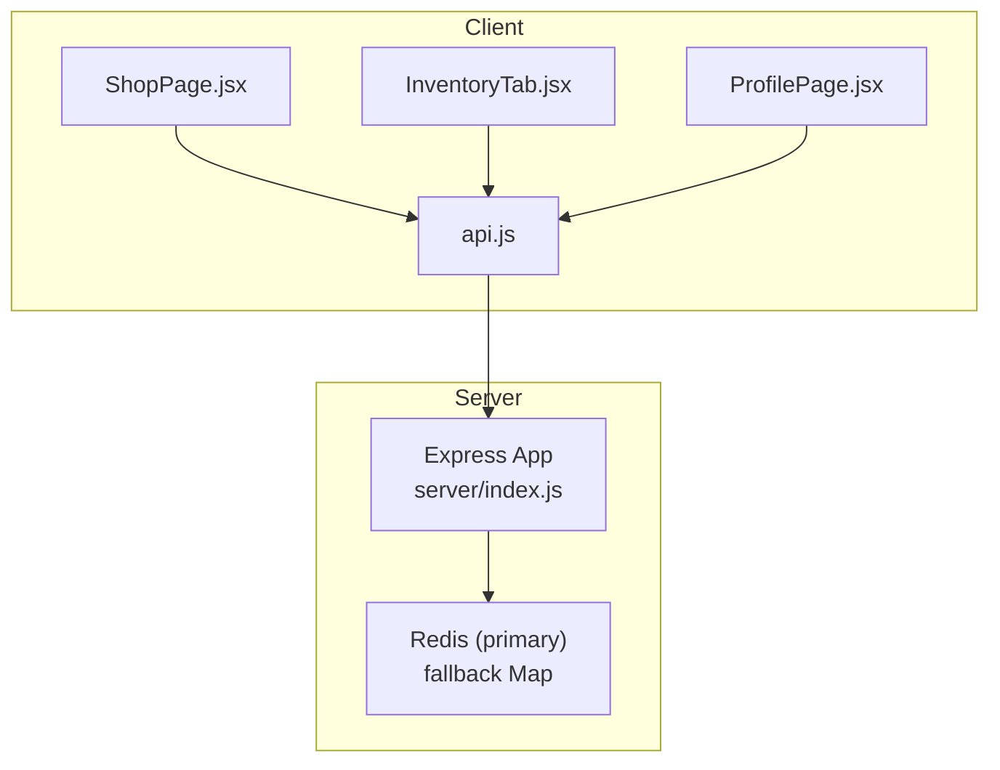
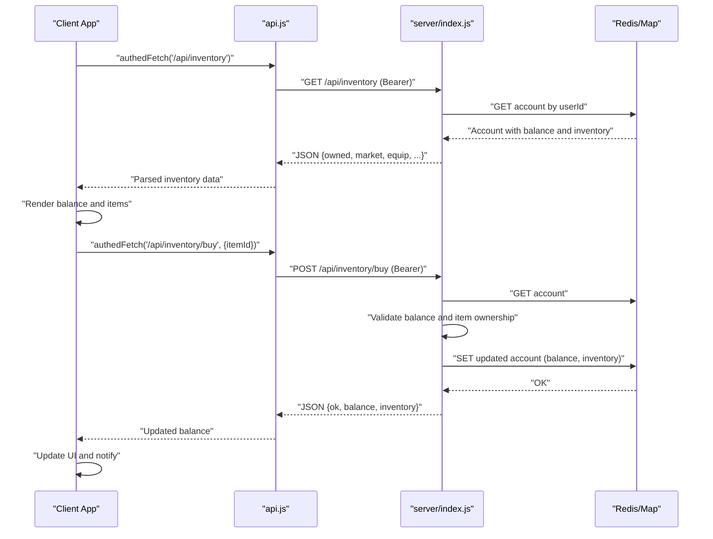
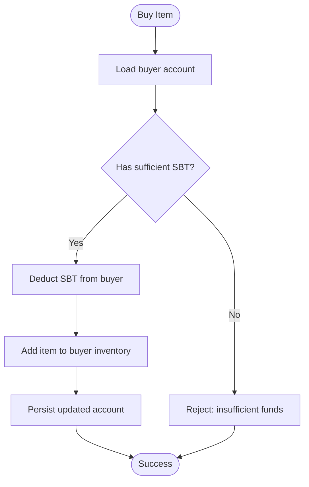
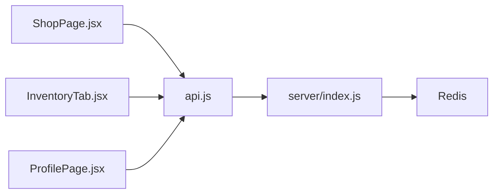

# Virtual Currency (SBT)

<cite>
**Referenced Files in This Document**
- [server/index.js](file://server/index.js)
- [src/lib/api.js](file://src/lib/api.js)
- [src/pages/ShopPage.jsx](file://src/pages/ShopPage.jsx)
- [src/pages/InventoryTab.jsx](file://src/pages/InventoryTab.jsx)
- [src/pages/ProfilePage.jsx](file://src/pages/ProfilePage.jsx)
</cite>

## Table of Contents
1. [Introduction](#introduction)
2. [Project Structure](#project-structure)
3. [Core Components](#core-components)
4. [Architecture Overview](#architecture-overview)
5. [Detailed Component Analysis](#detailed-component-analysis)
6. [Dependency Analysis](#dependency-analysis)
7. [Performance Considerations](#performance-considerations)
8. [Troubleshooting Guide](#troubleshooting-guide)
9. [Conclusion](#conclusion)
10. [Appendices](#appendices)

## Introduction
This document describes the SBT virtual currency system powering the SB Games ecosystem. It covers balance management, transaction processing, real-time balance updates, pricing and exchange mechanisms, transaction validation, fraud prevention, security measures, integration with payment processors and billing systems, financial audit trails, inflation controls, anti-money laundering considerations, and client-side currency handling. The goal is to provide a comprehensive yet accessible guide for developers and operators implementing or maintaining the SBT economy.

## Project Structure
The SBT currency system spans the backend server and the frontend client:
- Backend server exposes REST endpoints for authentication, inventory, marketplace trading, and user data. It persists user accounts and balances in Redis with a local-memory fallback.
- Frontend client communicates with the backend via authenticated fetch calls and displays balances, purchases, and marketplace transactions.

**Diagram sources**
- [server/index.js:1-120](file://server/index.js#L1-L120)
- [src/lib/api.js:1-30](file://src/lib/api.js#L1-L30)
- [src/pages/ShopPage.jsx:1-120](file://src/pages/ShopPage.jsx#L1-L120)
- [src/pages/InventoryTab.jsx:1-60](file://src/pages/InventoryTab.jsx#L1-L60)
- [src/pages/ProfilePage.jsx:170-290](file://src/pages/ProfilePage.jsx#L170-L290)

**Section sources**
- [server/index.js:1-120](file://server/index.js#L1-L120)
- [src/lib/api.js:1-30](file://src/lib/api.js#L1-L30)
- [src/pages/ShopPage.jsx:1-120](file://src/pages/ShopPage.jsx#L1-L120)
- [src/pages/InventoryTab.jsx:1-60](file://src/pages/InventoryTab.jsx#L1-L60)
- [src/pages/ProfilePage.jsx:170-290](file://src/pages/ProfilePage.jsx#L170-L290)

## Core Components
- Account storage and balance: Accounts are stored in Redis with a local Map fallback. Each account includes a numeric balance field and related metadata.
- Authentication and authorization: JWT-based bearer tokens are required for protected endpoints. CORS and rate limiting protect the API.
- Shop and inventory: Users can purchase cosmetic items with SBT, equipping/un-equipping items locally and on the server.
- Marketplace trading: Users list market items for sale, and other users can buy them, transferring SBT between parties with optional fees after extended listing periods.
- Real-time updates: WebSocket connections maintain online presence and can notify clients of events (e.g., marketplace sales).

Key implementation references:
- Account creation and balance initialization: [server/index.js:155-172](file://server/index.js#L155-L172)
- Shop purchase endpoint and balance deduction: [server/index.js:344-358](file://server/index.js#L344-L358)
- Marketplace sell and buy endpoints with balance transfer: [server/index.js:492-563](file://server/index.js#L492-L563)
- Client-side shop checkout and inventory loading: [src/pages/ShopPage.jsx:86-113](file://src/pages/ShopPage.jsx#L86-L113), [src/pages/InventoryTab.jsx:248-276](file://src/pages/InventoryTab.jsx#L248-L276)
- Client-side API wrapper with bearer token injection: [src/lib/api.js:8-29](file://src/lib/api.js#L8-L29)

**Section sources**
- [server/index.js:155-172](file://server/index.js#L155-L172)
- [server/index.js:344-358](file://server/index.js#L344-L358)
- [server/index.js:492-563](file://server/index.js#L492-L563)
- [src/pages/ShopPage.jsx:86-113](file://src/pages/ShopPage.jsx#L86-L113)
- [src/pages/InventoryTab.jsx:248-276](file://src/pages/InventoryTab.jsx#L248-L276)
- [src/lib/api.js:8-29](file://src/lib/api.js#L8-L29)

## Architecture Overview
The SBT economy is centered around a single-account-per-user model with a shared SBT balance. Purchases and trades adjust balances atomically on the server. The client maintains a local cache of inventory and equipment and updates the UI reactively upon successful transactions.

**Diagram sources**
- [src/lib/api.js:8-29](file://src/lib/api.js#L8-L29)
- [server/index.js:336-358](file://server/index.js#L336-L358)
- [src/pages/InventoryTab.jsx:248-276](file://src/pages/InventoryTab.jsx#L248-L276)

**Section sources**
- [src/lib/api.js:8-29](file://src/lib/api.js#L8-L29)
- [server/index.js:336-358](file://server/index.js#L336-L358)
- [src/pages/InventoryTab.jsx:248-276](file://src/pages/InventoryTab.jsx#L248-L276)

## Detailed Component Analysis

### Balance Management
- Initialization: New users receive a starter balance during first login.
- Tracking: Balance is a numeric field stored per account.
- Updates: Deductions occur on purchases; additions occur on marketplace sales to sellers (minus fees when applicable).

References:
- [server/index.js:162](file://server/index.js#L162)
- [server/index.js:354](file://server/index.js#L354)
- [server/index.js:543-544](file://server/index.js#L543-L544)

**Section sources**
- [server/index.js:162](file://server/index.js#L162)
- [server/index.js:354](file://server/index.js#L354)
- [server/index.js:543-544](file://server/index.js#L543-L544)

### Transaction Processing
- Shop purchases:
  - Validate item existence and ownership.
  - Deduct SBT from buyer’s balance.
  - Append item to buyer’s inventory.
- Marketplace trades:
  - Sell: Remove item from user’s market inventory and create a listing.
  - Buy: Validate listing and buyer balance, transfer SBT between parties, add item to buyer’s inventory.
  - Fees: After a long listing period, a fee is split between buyer and seller.

References:
- [server/index.js:344-358](file://server/index.js#L344-L358)
- [server/index.js:492-563](file://server/index.js#L492-L563)

**Diagram sources**
- [server/index.js:344-358](file://server/index.js#L344-L358)

**Section sources**
- [server/index.js:344-358](file://server/index.js#L344-L358)

### Real-Time Balance Updates
- Client-side:
  - Shop checkout triggers an API call and updates the displayed balance immediately upon success.
  - Inventory page loads and caches inventory/equipment locally for offline viewing.
- Server-side:
  - WebSocket connections track online users and can broadcast notifications (e.g., marketplace sale completion).

References:
- [src/pages/ShopPage.jsx:95-113](file://src/pages/ShopPage.jsx#L95-L113)
- [src/pages/InventoryTab.jsx:248-276](file://src/pages/InventoryTab.jsx#L248-L276)
- [server/index.js:752-795](file://server/index.js#L752-L795)

**Section sources**
- [src/pages/ShopPage.jsx:95-113](file://src/pages/ShopPage.jsx#L95-L113)
- [src/pages/InventoryTab.jsx:248-276](file://src/pages/InventoryTab.jsx#L248-L276)
- [server/index.js:752-795](file://server/index.js#L752-L795)

### Pricing Mechanisms and Cost Calculations
- Shop pricing:
  - Items have fixed prices in SBT. Total cost equals the sum of selected items.
- Marketplace pricing:
  - Sellers set a price per listing. Buyers pay the listed amount.
- Exchange rates:
  - No explicit conversion between currencies is implemented in the server code; SBT is the sole currency.

References:
- [server/index.js:305-318](file://server/index.js#L305-L318)
- [src/pages/ShopPage.jsx:31-42](file://src/pages/ShopPage.jsx#L31-L42)
- [src/pages/ShopPage.jsx:462-466](file://src/pages/ShopPage.jsx#L462-L466)

**Section sources**
- [server/index.js:305-318](file://server/index.js#L305-L318)
- [src/pages/ShopPage.jsx:31-42](file://src/pages/ShopPage.jsx#L31-L42)
- [src/pages/ShopPage.jsx:462-466](file://src/pages/ShopPage.jsx#L462-L466)

### Transaction Validation and Fraud Prevention
- Input sanitization and limits:
  - Request bodies are sanitized and size-limited.
- Authentication:
  - All protected endpoints require a valid JWT bearer token.
- Authorization:
  - Endpoints enforce ownership checks (e.g., only the listing owner can cancel).
- Rate limiting:
  - Global rate limiter applied to API endpoints.
- Additional safeguards:
  - Balance checks prevent overspending.
  - Duplicate listings prevented per item per seller.
  - Listing age determines fee applicability.

References:
- [server/index.js:70-82](file://server/index.js#L70-L82)
- [server/index.js:290-301](file://server/index.js#L290-L301)
- [server/index.js:64-68](file://server/index.js#L64-L68)
- [server/index.js:352](file://server/index.js#L352)
- [server/index.js:505-506](file://server/index.js#L505-L506)
- [server/index.js:547-552](file://server/index.js#L547-L552)

**Section sources**
- [server/index.js:70-82](file://server/index.js#L70-L82)
- [server/index.js:290-301](file://server/index.js#L290-L301)
- [server/index.js:64-68](file://server/index.js#L64-L68)
- [server/index.js:352](file://server/index.js#L352)
- [server/index.js:505-506](file://server/index.js#L505-L506)
- [server/index.js:547-552](file://server/index.js#L547-L552)

### Security Measures
- Transport and API protection:
  - Helmet and CORS configured; JSON body limits enforced.
  - Rate limiting and input sanitization reduce abuse.
- Authentication:
  - JWT signing and verification; WS authentication middleware.
- Storage:
  - Redis primary with in-memory Map fallback for resilience.

References:
- [server/index.js:39-62](file://server/index.js#L39-L62)
- [server/index.js:76-88](file://server/index.js#L76-L88)
- [server/index.js:26-35](file://server/index.js#L26-L35)

**Section sources**
- [server/index.js:39-62](file://server/index.js#L39-L62)
- [server/index.js:76-88](file://server/index.js#L76-L88)
- [server/index.js:26-35](file://server/index.js#L26-L35)

### Payment Processors and Billing Systems
- The server does not implement external payment processor integrations or billing cycles. SBT is managed internally.
- Starter balance is granted on first login; further funding pathways are not present in the server code.

References:
- [server/index.js:162](file://server/index.js#L162)

**Section sources**
- [server/index.js:162](file://server/index.js#L162)

### Financial Audit Trails
- The server maintains minimal audit data:
  - Market listings include timestamps and status.
  - WebSocket events can be used to notify clients of sales.
- No centralized transaction log is exposed as a dedicated endpoint.

References:
- [server/index.js:440-453](file://server/index.js#L440-L453)
- [server/index.js:556-562](file://server/index.js#L556-L562)

**Section sources**
- [server/index.js:440-453](file://server/index.js#L440-L453)
- [server/index.js:556-562](file://server/index.js#L556-L562)

### Currency Inflation Controls and Anti-Money Laundering
- Inflation controls:
  - No inflation mechanism is implemented in the server code.
- Anti-money laundering:
  - No KYC or transaction monitoring is implemented in the server code.
  - Basic rate limiting and input validation are present.

References:
- [server/index.js:64-68](file://server/index.js#L64-L68)
- [server/index.js:70-74](file://server/index.js#L70-L74)

**Section sources**
- [server/index.js:64-68](file://server/index.js#L64-L68)
- [server/index.js:70-74](file://server/index.js#L70-L74)

### Client-Side Currency Handling
- API wrapper injects bearer tokens and handles errors.
- Shop page collects selected items, computes totals, and performs checkout.
- Inventory page loads items and equipment, supports equip/unequip actions.

References:
- [src/lib/api.js:8-29](file://src/lib/api.js#L8-L29)
- [src/pages/ShopPage.jsx:86-113](file://src/pages/ShopPage.jsx#L86-L113)
- [src/pages/InventoryTab.jsx:248-314](file://src/pages/InventoryTab.jsx#L248-L314)

**Section sources**
- [src/lib/api.js:8-29](file://src/lib/api.js#L8-L29)
- [src/pages/ShopPage.jsx:86-113](file://src/pages/ShopPage.jsx#L86-L113)
- [src/pages/InventoryTab.jsx:248-314](file://src/pages/InventoryTab.jsx#L248-L314)

## Dependency Analysis
The client depends on the server for all currency operations. The server depends on Redis for persistence and on JWT/CORS/rate-limiting middleware for security.

**Diagram sources**
- [src/lib/api.js:1-30](file://src/lib/api.js#L1-L30)
- [server/index.js:1-120](file://server/index.js#L1-L120)

**Section sources**
- [src/lib/api.js:1-30](file://src/lib/api.js#L1-L30)
- [server/index.js:1-120](file://server/index.js#L1-L120)

## Performance Considerations
- Redis latency: Primary account storage is Redis; monitor latency and availability.
- Fallback behavior: In-memory Map ensures basic operation if Redis is unavailable.
- Request sizes: Body limits reduce risk and improve throughput.
- Rate limiting: Prevents abuse and protects downstream services.

[No sources needed since this section provides general guidance]

## Troubleshooting Guide
Common issues and resolutions:
- Insufficient balance:
  - Symptom: Purchase rejected with need/have fields.
  - Resolution: Ensure user has enough SBT before attempting purchase.
  - Reference: [server/index.js:352-353](file://server/index.js#L352-L353)
- Listing conflicts:
  - Symptom: Cannot create listing for an item already listed.
  - Resolution: Cancel existing listing or choose another item.
  - Reference: [server/index.js:505-506](file://server/index.js#L505-L506)
- Authentication failures:
  - Symptom: 401 Unauthorized on protected endpoints.
  - Resolution: Re-authenticate and ensure token is present.
  - Reference: [server/index.js:296-301](file://server/index.js#L296-L301)
- WebSocket auth errors:
  - Symptom: Auth error on WS connect.
  - Resolution: Verify token validity and username.
  - Reference: [server/index.js:764-772](file://server/index.js#L764-L772)

**Section sources**
- [server/index.js:352-353](file://server/index.js#L352-L353)
- [server/index.js:505-506](file://server/index.js#L505-L506)
- [server/index.js:296-301](file://server/index.js#L296-L301)
- [server/index.js:764-772](file://server/index.js#L764-L772)

## Conclusion
The SBT virtual currency system is a focused, single-currency economy with clear balance management, straightforward transaction flows, and robust client-server integration. While it lacks external payment processor integration and advanced financial controls, it provides a secure foundation with JWT, rate limiting, input sanitization, and Redis-backed persistence. Extending the system to support external payments, inflation controls, and compliance features would require adding new endpoints, audit logs, and regulatory safeguards.

## Appendices
- Example operations:
  - Deposit: Not implemented in server code; starter balance provided on first login.
  - Withdrawal: Not implemented in server code.
  - Transfer: Not implemented in server code.
  - Spending limits: Not implemented in server code.
- API endpoints (high level):
  - POST /auth/tg-login: Login and receive token/account.
  - GET /api/inventory: Load inventory and balance.
  - POST /api/inventory/buy: Purchase item with SBT.
  - POST /api/market/sell: List market item for sale.
  - POST /api/market/buy/:id: Buy a listed item.
  - DELETE /api/market/:id: Cancel own listing.
  - GET /api/user/:id: Public profile (non-authenticated).
  - GET /online: Online users list.

[No sources needed since this section summarizes without analyzing specific files]